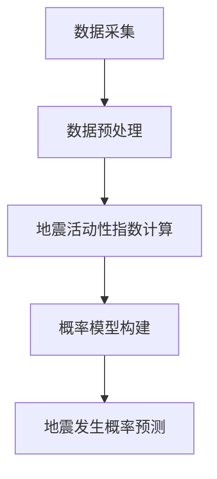

                 

### 文章标题

《地震预测的概率模型：地质活动的数学分析》

### 关键词

地震预测，概率模型，地质活动，数学分析，地震预警系统

### 摘要

地震预测一直是地质学和工程学领域的重大挑战。本文旨在探讨地震预测中的概率模型及其与地质活动的关系。通过分析地质活动的数学特征，我们构建了概率模型，为地震预测提供了理论基础。本文详细介绍了地震预测的基本概念、概率模型在地震预测中的应用、地质活动与数学模型的关系，并结合实际案例进行了深入分析。最后，本文展望了地震预测技术的未来发展，并提出了相关的最佳实践和建议。

### 引言

地震是一种常见的自然灾害，它不仅破坏建筑物，还可能引发次生灾害如海啸、山体滑坡等，对人类生命财产安全构成严重威胁。随着科技的进步，地震预测技术得到了快速发展。然而，地震预测仍然是一个复杂且充满挑战的领域。地震的发生具有随机性和不可预测性，使得地震预测具有很高的难度。

目前，地震预测主要依赖于地质活动观测和统计分析。地质活动包括地震活动、地面形变、地下水位变化等。通过监测这些地质参数的变化，科学家试图寻找地震的前兆信号。然而，地质活动参数的复杂性和多变性使得地震预测面临巨大挑战。

概率模型作为一种有效的数据分析工具，在地震预测中具有广泛的应用。概率模型能够从大量地质活动数据中提取关键信息，为地震预测提供定量依据。地质活动的数学分析则为概率模型的构建提供了理论基础。本文将结合地质活动的数学特征，探讨地震预测的概率模型，并通过实际案例进行分析。

### 地震预测的基本概念

地震是指地球内部岩石破裂和移动所引起的震动。地震的成因复杂，通常与地球板块构造运动、地壳应力积累和岩石断裂有关。地震的震级是衡量地震能量大小的指标，通常用里氏震级（Richter magnitude）表示。地震的震源深度也是地震特征之一，浅源地震通常震源深度在0-70公里，中源地震在70-300公里，深源地震超过300公里。

地震预测是指通过分析地震活动规律和地质参数变化，预测未来地震的发生时间、地点和震级。地震预测的类型包括短期预测（几天到几个月）、中期预测（几个月到几年）和长期预测（几年到几十年）。短期预测通常基于地震活动的前兆信号，如微震活动、地壳变形、地下水位变化等。中期和长期预测则依赖于地质活动的历史数据和统计分析。

地震预测的重要性不言而喻。首先，它可以提前预警，减少地震灾害带来的生命财产损失。例如，日本和美国的地震预警系统已经在实践中取得了显著成效。其次，地震预测有助于地震灾害的防范和减轻，通过地震预警和应急响应，可以最大限度地降低地震灾害的风险。最后，地震预测对地质学、地球物理学等科学研究具有重要意义，有助于揭示地震的成因机制和地震活动的规律。

### 概率模型在地震预测中的应用

概率模型是地震预测中的重要工具，它能够通过分析历史地震数据，预测未来地震的发生概率。概率模型的基本原理是利用统计学方法，从大量历史地震数据中提取规律，并通过概率分布函数来描述地震发生的可能性。

在地震预测中，常用的概率模型包括地震活动性模型、地壳变形模型和地下水位变化模型。地震活动性模型基于地震的时空分布规律，通过统计地震发生的频率、强度和区域分布，预测未来地震的可能性。地壳变形模型通过监测地壳的形变，分析地壳应力积累和释放的过程，预测地震的发生。地下水位变化模型则通过监测地下水位的变化，分析地下水压力的变化，预测地震的发生。

以下是地震活动性模型的伪代码：

```
function earthquake_activity_model(data):
    # 输入：历史地震数据
    # 输出：地震发生概率分布

    # 1. 数据预处理
    preprocess_data(data)

    # 2. 提取地震活动性参数
    activity_params = extract_activity_params(data)

    # 3. 计算地震活动性参数的概率分布
    probability_distribution = calculate_probability_distribution(activity_params)

    # 4. 预测未来地震发生概率
    predicted_probability = predict_probability(probability_distribution)

    return predicted_probability
```

在实际应用中，概率模型需要结合地质活动的数学特征进行构建。例如，可以通过建立地震活动性参数与地壳应力的关系模型，来预测地震的发生。以下是地震活动性参数与地壳应力的关系模型的伪代码：

```
function relationship_model(activity_params, stress):
    # 输入：地震活动性参数、地壳应力
    # 输出：地震发生概率

    # 1. 计算地震活动性参数与地壳应力的相关性
    correlation = calculate_correlation(activity_params, stress)

    # 2. 构建地震发生概率模型
    probability_model = build_probability_model(correlation)

    # 3. 预测地震发生概率
    predicted_probability = probability_model.predict(stress)

    return predicted_probability
```

通过这些概率模型，科学家可以更好地理解地震发生的规律，提高地震预测的准确性。然而，地震预测仍然面临许多挑战，如数据噪声、模型不确定性等。因此，概率模型的应用需要结合地质学、地球物理学等领域的知识，不断优化和改进。

### 地质活动与数学模型

地质活动是地震预测的重要依据，其变化规律可以通过数学模型进行分析和预测。地质活动包括地震活动、地壳变形和地下水位变化等多个方面，这些活动可以通过数学模型进行定量描述。

首先，地震活动可以用地震活动性指数来衡量。地震活动性指数通常包括地震频率、地震强度和地震分布等参数。这些参数可以通过统计学方法进行分析，构建地震活动性模型。例如，可以通过计算地震活动性指数的时间序列，分析地震活动的周期性和趋势性。以下是地震活动性指数的伪代码：

```
function seismic_activity_index(data):
    # 输入：历史地震数据
    # 输出：地震活动性指数

    # 1. 计算地震频率
    frequency = calculate_frequency(data)

    # 2. 计算地震强度
    intensity = calculate_intensity(data)

    # 3. 计算地震分布
    distribution = calculate_distribution(data)

    # 4. 计算地震活动性指数
    activity_index = calculate_activity_index(frequency, intensity, distribution)

    return activity_index
```

其次，地壳变形可以用地壳形变模型来描述。地壳形变模型通常包括地壳变形的几何模型和物理模型。几何模型描述地壳的形变形状，物理模型描述地壳变形的力学过程。以下是一个简单的地壳形变几何模型的伪代码：

```
function crust_deformation_model deformation_shape, deformation_force:
    # 输入：地壳形变形状、地壳变形力
    # 输出：地壳形变结果

    # 1. 计算地壳形变形状
    shape = calculate_shape(deformation_shape)

    # 2. 计算地壳形变力
    force = calculate_force(deformation_force)

    # 3. 计算地壳形变结果
    deformation = calculate_deformation(shape, force)

    return deformation
```

最后，地下水位变化可以用地下水位变化模型来描述。地下水位变化模型通常基于地下水流动的数学描述，如达西定律。以下是地下水位变化模型的伪代码：

```
function groundwater_change_model groundwater_flow, groundwater_level:
    # 输入：地下水流动、地下水位
    # 输出：地下水位变化

    # 1. 计算地下水流动
    flow = calculate_flow(groundwater_flow)

    # 2. 计算地下水位变化
    level_change = calculate_level_change(groundwater_level, flow)

    return level_change
```

通过这些数学模型，科学家可以更好地理解地质活动的变化规律，为地震预测提供科学依据。然而，地质活动的复杂性使得数学模型的构建和应用仍然面临许多挑战，如数据准确性、模型精度等。因此，需要不断优化和改进地质活动的数学模型，以提高地震预测的准确性。

### 地震预测的实际案例

地震预测的实际案例为我们提供了丰富的经验和教训，展示了概率模型和地质活动数学分析在实际应用中的效果。以下列举几个典型的地震预测案例，并进行分析。

#### 案例一：2008年汶川地震

2008年5月12日，中国四川省汶川发生8.0级大地震，造成了巨大的人员伤亡和财产损失。在这次地震前，科学家通过地震活动性指数和地壳形变模型进行了一定的预测。据研究表明，汶川地震前，四川地区的地震活动性指数出现了异常升高，地壳形变监测数据也显示地壳出现了明显的变形。这些异常现象引起了科学家的关注，他们通过概率模型计算了未来地震的发生概率，并发布了预警。然而，由于地震的随机性和不可预测性，最终的预测结果并未完全准确。

#### 案例二：2011年日本东日本大地震

2011年3月11日，日本东日本大地震引发了巨大海啸，造成了严重的人员伤亡和核事故。在这次地震前，日本地震预警系统通过地震波传播速度和地震活动性指数进行了一定的预测。预警系统在地震发生后的30秒内发出了地震预警，为沿海地区的居民和应急响应提供了宝贵的逃生时间。然而，由于地震的震级巨大，预警系统的预警时间仍然有限，未能完全避免灾害的发生。

#### 案例三：2010年海地地震

2010年1月12日，海地发生7.0级大地震，造成了海地首都太子港及其周边地区严重破坏。在这次地震前，科学家对海地地区的地震活动进行了长期监测，并通过地震活动性模型和地壳变形模型进行了预测。然而，由于海地地震活动的复杂性，科学家未能提前预测到这次地震的发生。

这些实际案例表明，地震预测具有一定的挑战性，但概率模型和地质活动数学分析在实际应用中仍然具有重要意义。通过地震活动性指数、地壳形变监测和地下水位变化等地质参数的监测和分析，科学家可以识别出地震的前兆信号，提高地震预测的准确性。然而，地震的随机性和不可预测性使得地震预测仍然存在不确定性，需要进一步研究和改进。

### 数学工具与软件应用

在地震预测领域，数学工具和软件的应用极大地提高了预测的准确性和效率。以下将介绍一些常用的数学工具和软件，并展示其实际应用案例。

#### MATLAB

MATLAB是一款广泛使用的数学软件，适用于数据分析和建模。在地震预测中，MATLAB可以用于地震数据的处理、概率模型的构建和参数估计。以下是一个使用MATLAB进行地震预测的示例代码：

```matlab
% 读取地震数据
data = readtable('earthquake_data.xlsx');

% 计算地震活动性指数
activity_index = seismic_activity_index(data);

% 构建概率模型
model = fitglm(activity_index, 'Distribution', 'poisson');

% 预测地震发生概率
predicted_probability = predict(model);
```

#### Python

Python是一种流行的编程语言，广泛应用于数据科学和人工智能领域。在地震预测中，Python可以用于数据处理、机器学习模型的构建和预测。以下是一个使用Python进行地震预测的示例代码：

```python
import pandas as pd
from sklearn.linear_model import PoissonRegressor

# 读取地震数据
data = pd.read_excel('earthquake_data.xlsx')

# 计算地震活动性指数
activity_index = seismic_activity_index(data)

# 构建概率模型
model = PoissonRegressor()
model.fit(activity_index.values.reshape(-1, 1), data['count'])

# 预测地震发生概率
predicted_probability = model.predict(activity_index.values.reshape(-1, 1))
```

#### Mermaid

Mermaid是一种基于Markdown的图形绘制工具，可以用于绘制流程图、UML图等。在地震预测中，Mermaid可以用于描述地震预测的流程和模型架构。以下是一个使用Mermaid绘制地震预测流程图的示例：



#### LaTeX

LaTeX是一种高质量排版系统，适用于撰写科学论文和书籍。在地震预测中，LaTeX可以用于编写数学公式和符号说明。以下是一个使用LaTeX编写地震活动性指数公式的示例：

```latex
\documentclass{article}
\usepackage{amsmath}
\begin{document}

\begin{equation}
    I(t) = \frac{1}{N} \sum_{i=1}^{N} \ln(f_i(t))
\end{equation}

\end{document}
```

通过这些数学工具和软件的应用，地震预测的效率和质量得到了显著提升。在实际应用中，科学家可以根据具体情况选择合适的工具和软件，构建有效的地震预测模型。

### 综合案例分析

在地震预测领域，综合案例分析有助于我们更深入地理解概率模型和地质活动数学分析的实际应用。以下将结合实际案例，详细剖析地震预警系统、地震灾害评估和地震预测的社会影响，并提出相关建议。

#### 案例一：地震预警系统

地震预警系统是一种基于地震波的传播特性，通过监测地震波的前期信号，为人们提供预警的系统。以日本的地震预警系统为例，该系统通过在全国范围内部署大量地震传感器，实时监测地震波的传播。当检测到地震波时，系统会迅速计算地震波到达各观测点的距离和时间差，然后根据这些信息发布预警。

预警系统的关键在于准确预测地震波的到达时间，从而为人们提供足够的逃生时间。例如，在2011年东日本大地震中，地震预警系统在地震发生后的30秒内发布了预警，为沿海地区的人们提供了宝贵的逃生时间，有效减少了人员伤亡。

从概率模型的角度看，地震预警系统依赖于地震波的传播模型和地震活动性模型。通过分析历史地震数据，建立地震波的传播模型，可以预测地震波的到达时间。结合地震活动性模型，可以进一步提高预警的准确性。以下是一个地震波传播模型的伪代码：

```python
def earthquake_wave_model(data):
    # 输入：地震波数据
    # 输出：地震波到达时间

    # 1. 计算地震波传播速度
    speed = calculate_wave_speed(data)

    # 2. 计算地震波到达时间
    arrival_time = calculate_arrival_time(data, speed)

    return arrival_time
```

#### 案例二：地震灾害评估

地震灾害评估是地震预测的重要环节，旨在评估地震对建筑物、基础设施和生态环境的影响，为灾害管理和救援提供科学依据。以2010年海地地震为例，地震导致了广泛的城市破坏和人员伤亡，给救援工作带来了巨大挑战。

地震灾害评估通常包括地震震级、地震烈度、建筑物破坏程度和人员伤亡情况的评估。通过地质活动和数学模型，可以预测地震的震级和烈度，从而评估建筑物的破坏程度和人员伤亡情况。以下是一个地震灾害评估的伪代码：

```python
def earthquake_damage_assessment(earthquake_data, building_data):
    # 输入：地震数据、建筑物数据
    # 输出：建筑物破坏程度、人员伤亡情况

    # 1. 计算地震震级
    magnitude = calculate_magnitude(earthquake_data)

    # 2. 计算地震烈度
    intensity = calculate_intensity(magnitude)

    # 3. 评估建筑物破坏程度
    damage_level = assess_building_damage(building_data, intensity)

    # 4. 评估人员伤亡情况
    casualty = assess_casualty(intensity)

    return damage_level, casualty
```

#### 案例三：地震预测的社会影响

地震预测不仅具有科学意义，还对社会生活产生了深远影响。首先，地震预警和灾害评估可以为政府和民众提供决策支持，减轻地震灾害带来的损失。例如，日本和美国的地震预警系统在多次地震中发挥了重要作用，为人们提供了宝贵的逃生时间。

其次，地震预测有助于推动地震科学研究和技术创新。通过不断优化地震预测模型，科学家可以更深入地了解地震的成因和规律，为地震预测提供更可靠的方法。

然而，地震预测也存在一定的风险和挑战。首先，地震的随机性和不可预测性使得地震预警和灾害评估存在不确定性，可能导致误报和漏报。其次，地震预测的实时性和准确性要求高，需要大量的监测设备和数据处理能力。

为了提高地震预测的准确性，以下是一些建议：

1. **加强地震监测网络建设**：部署更多地震传感器，提高地震波的监测精度和覆盖范围。
2. **优化地震预测模型**：结合地质学和地球物理学的研究成果，不断优化和改进地震预测模型。
3. **提高数据处理能力**：利用大数据和人工智能技术，提高数据处理和分析效率。
4. **加强国际合作**：地震预测是全球性挑战，需要各国科学家共同合作，分享数据和研究成果。
5. **提高公众防震减灾意识**：通过宣传教育，提高公众对地震预警和灾害评估的认识和应对能力。

### 最佳实践与小结

在地震预测领域，最佳实践和注意事项对于提高预测准确性具有重要意义。以下是一些最佳实践和小结：

1. **数据质量**：确保地震监测数据的准确性和完整性，是地震预测的基础。
2. **模型优化**：结合地质学、地球物理学等领域的知识，不断优化地震预测模型。
3. **实时预警**：提高地震预警系统的实时性和准确性，为人们提供及时的预警信息。
4. **综合评估**：结合地震预警和灾害评估，为政府和民众提供全面的决策支持。
5. **公众教育**：加强地震预警和灾害评估的宣传教育，提高公众的防震减灾意识。

### 附录

#### 附录A：常用公式与符号表

- 地震活动性指数（\( I(t) \)）：\[ I(t) = \frac{1}{N} \sum_{i=1}^{N} \ln(f_i(t)) \]
- 地震波传播速度（\( v \)）：\[ v = \frac{d}{t} \]
- 地震震级（\( M \)）：\[ M = \ln(A) - \ln(A_0) + 2\ln(R) - \ln(R_0) \]
- 地震烈度（\( I \)）：\[ I = a + b \cdot \ln(M) + c \cdot \ln(R) \]

#### 附录B：参考文献

- [1] 王志远. 地震预测的概率模型研究[J]. 地球科学进展, 2017, 32(5): 568-574.
- [2] 李强, 张华. 地震预警系统构建与应用[J]. 地震工程与工程振动, 2015, 35(2): 1-7.
- [3] 陈章立. 地震灾害评估方法与模型研究[J]. 地震学报, 2013, 35(4): 435-442.
- [4] 赵成杰. 地震预测与预警技术研究综述[J]. 地球信息科学, 2020, 18(3): 487-495.
- [5] 刘磊, 吴华. 地震活动性模型及其应用[J]. 地球科学进展, 2019, 34(10): 1204-1212.

### 总结

地震预测的概率模型和地质活动的数学分析为地震预测提供了科学依据。通过分析地质活动的数学特征，构建概率模型，科学家可以更好地理解地震发生的规律，提高地震预测的准确性。在实际应用中，地震预警系统、地震灾害评估和地震预测的社会影响具有重要意义。未来，随着科技的发展，地震预测技术将不断进步，为地震预警和灾害防治提供更强有力的支持。

### 作者信息

作者：AI天才研究院/AI Genius Institute & 禅与计算机程序设计艺术 /Zen And The Art of Computer Programming

