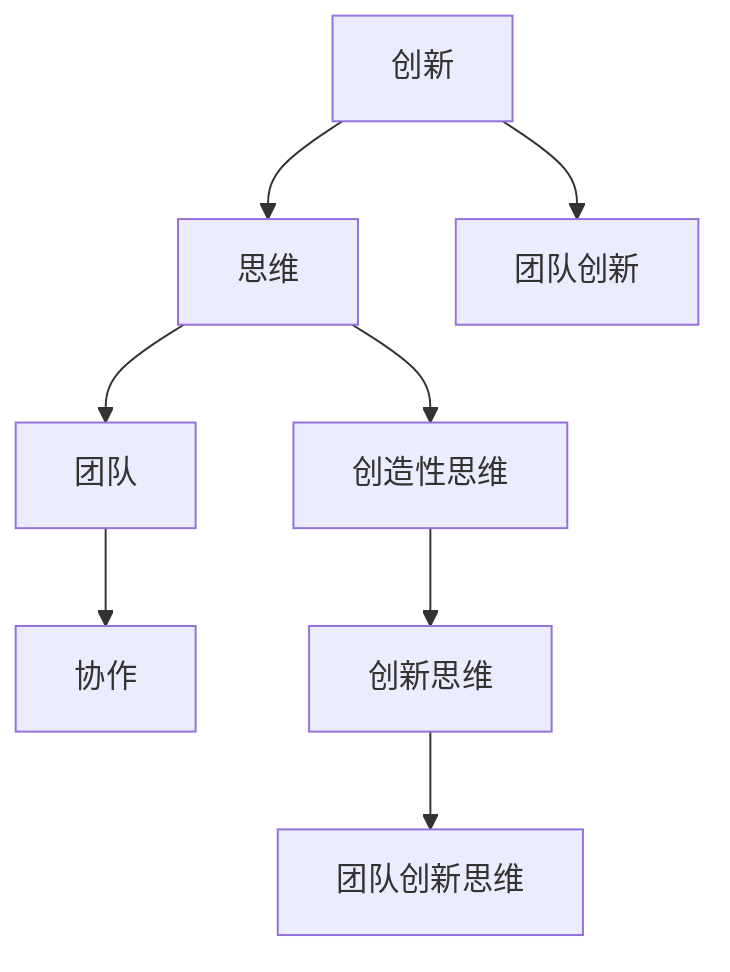

                 

### 文章标题

# 培养团队创新思维：突破固有思维模式

在当今这个快速变化的时代，创新思维已经成为企业竞争的核心力量。而团队创新思维则是一个组织中最为宝贵的资产。如何培养团队的创新能力，如何让团队跳出固有的思维模式，成为每个企业和组织亟需解决的问题。本文将围绕这个主题，逐步分析团队创新思维的重要性、基础理论、方法、实践与应用、案例分析和提升与优化，旨在为读者提供一套完整的团队创新思维培养策略。

### 文章关键词

- 团队创新思维
- 固有思维模式
- 创新方法
- 实践应用
- 案例分析
- 提升与优化

### 文章摘要

本文首先介绍了团队创新思维的重要性，阐述了创新思维在现代社会中的价值。接着，我们深入探讨了团队创新思维的基础理论，包括核心概念与联系，以及创新思维的分类与特点。随后，本文详细介绍了如何识别和评估固有思维模式，并提出了突破这些模式的具体策略。文章还通过实践与应用部分，分享了团队创新思维的实例和挑战。在案例分析部分，我们通过具体案例展示了团队创新思维的实际效果。最后，本文提出了提升团队创新思维的方法和策略，并展望了其未来发展趋势。通过本文的阅读，读者将获得一套系统的团队创新思维培养方案。

## 引言与背景

### 创新思维的重要性

在当今这个知识经济时代，创新思维已成为企业生存和发展的关键。创新思维不仅仅局限于产品或技术的研发，更是涵盖了企业的商业模式、管理理念、市场策略等多个方面。一个能够不断创新的企业，才能在激烈的市场竞争中立于不败之地。而团队创新思维则是企业实现持续创新的核心动力。团队创新思维强调的是通过集体的智慧和力量，共同寻找解决问题的方法和创新的思路。一个具备强大团队创新思维的组织，能够更快速地响应市场变化，更有效地解决问题，从而在竞争中脱颖而出。

### 团队创新思维的定义与特点

团队创新思维是一种集体的思维模式，它通过团队成员之间的沟通、协作和互相启发，实现创新的目标。团队创新思维具有以下几个显著特点：

1. **集体智慧**：团队创新思维强调的是集体智慧的发挥，通过团队成员之间的交流和互动，激发新的创意和想法。
2. **多元视角**：团队创新思维鼓励不同背景、不同专业知识的团队成员共同参与，从而形成多元视角，提高创新的可能性。
3. **协作与支持**：团队创新思维注重团队成员之间的协作与支持，通过共同的努力，克服难题，实现创新。
4. **持续改进**：团队创新思维是一种持续改进的过程，它鼓励团队成员不断反思和优化现有的想法和方案，从而实现更高的创新水平。

### 团队创新思维在现实中的应用

团队创新思维在现实中的应用非常广泛，以下是一些典型的例子：

1. **产品研发**：许多高科技公司，如谷歌、苹果，通过团队创新思维，不断推出具有竞争力的新产品和服务，从而占据市场份额。
2. **企业管理**：一些企业通过引入创新思维，改变了传统的管理模式，提高了组织的灵活性和效率。
3. **市场营销**：企业在市场营销策略中运用创新思维，可以更好地理解市场需求，制定出更具吸引力的营销方案。
4. **技术创新**：团队创新思维在技术研发中的应用，可以推动新技术、新工艺的研发，提升企业的技术竞争力。

通过以上分析，我们可以看出，团队创新思维在现代社会中具有极其重要的地位。它不仅能够帮助企业实现持续创新，提升竞争力，还能够激发员工的创造力，提高团队的整体绩效。因此，培养团队创新思维，突破固有思维模式，已成为每个企业和组织亟需关注的重要课题。

### 团队创新思维的基础理论

#### 核心概念与联系

要理解团队创新思维，首先需要掌握几个核心概念，包括创新、思维、团队和协作。创新是指创造新的想法、方法或产品，从而实现价值提升。思维是人类理解和解决问题的方式，包括逻辑思维、创造性思维和批判性思维等。团队是由多个个体组成的集体，成员之间通过协作和互动实现共同目标。协作是指团队成员共同工作，互相支持，以达到更好的成果。

这些概念之间的联系可以通过一个简单的Mermaid流程图来展示：

这个流程图清晰地展示了创新、思维、团队和协作之间的关系，以及它们如何共同构成团队创新思维。

#### 创新思维的分类与特点

创新思维可以分为多种类型，每种类型都有其独特的特点和适用场景。以下是几种常见的创新思维类型及其特点：

1. **发散性思维**：发散性思维是一种从多个角度思考问题的方法，它鼓励人们提出各种可能的解决方案，而不局限于单一思路。这种思维类型适用于解决复杂问题，特别是需要创造性解决方案的问题。

2. **收敛性思维**：收敛性思维是一种通过分析和筛选，将多个可能的解决方案集中到一个最佳方案的方法。这种思维类型适用于需要快速决策的情境，例如项目管理或危机应对。

3. **系统性思维**：系统性思维是一种从整体角度分析问题的方法，它强调各种因素之间的相互作用和影响。这种思维类型适用于解决复杂系统问题，如企业战略规划和生态系统管理。

4. **设计思维**：设计思维是一种以用户需求为导向，通过迭代设计和测试来解决问题的方法。这种思维类型强调用户体验和人性化的解决方案，适用于产品设计和用户界面优化。

通过了解不同类型创新思维的特点，团队成员可以更有效地应用这些思维工具，提高团队的创新水平。

#### 团队创新思维的激励机制

团队创新思维的有效运行需要激励机制的支持。以下是一些常见的激励机制：

1. **奖励制度**：通过设立创新奖励，如奖金、荣誉称号和晋升机会，激励团队成员积极提出创新想法。

2. **公开表彰**：在团队会议或公司内部活动中，对有创新贡献的成员进行公开表彰，增强其成就感和荣誉感。

3. **培训与发展**：为团队成员提供相关培训，提高他们的创新能力和知识水平，从而激发他们的创新潜力。

4. **民主氛围**：营造一种开放、包容的团队氛围，鼓励成员自由表达想法，激发他们的创造力。

通过这些激励机制，团队可以更好地培养创新思维，实现持续的创新和发展。

### 突破固有思维模式的方法

#### 固有思维模式的识别与评估

要突破固有思维模式，首先需要识别和评估现有的思维模式。以下是一些识别和评估固有思维模式的方法：

1. **自我反思**：团队成员可以通过自我反思，回顾自己的思考过程和行为模式，识别出那些限制创新的思维定式。

2. **问卷调查**：通过设计问卷调查，收集团队成员对于问题解决方法的看法，分析是否存在共性的思维模式。

3. **行为观察**：观察团队成员在日常工作中的表现，分析他们的思维和行为模式，找出限制创新的因素。

4. **团队讨论**：组织团队讨论，鼓励成员分享自己的思维模式，通过集体智慧，识别和评估固有思维模式。

通过这些方法，团队可以系统地识别和评估现有的思维模式，为后续的突破打下基础。

#### 突破固有思维模式的策略

一旦识别出固有思维模式，就需要采取有效的策略来突破这些模式。以下是一些具体的策略：

1. **多角度思考**：鼓励团队成员从不同角度思考问题，不仅考虑常规的解决方案，还要探索创新的可能路径。

2. **头脑风暴**：组织头脑风暴会议，让团队成员自由提出各种创意，不受限制地思考，从而激发新的灵感。

3. **跨部门合作**：促进不同部门之间的合作，通过多元视角和专业知识，共同解决问题，打破固有的思维限制。

4. **学习与借鉴**：通过学习其他团队或组织的成功案例，借鉴他们的创新思维和方法，启发自己的创新思路。

5. **实践与反馈**：将创新想法付诸实践，通过实验和反馈，不断调整和完善，逐步突破固有的思维模式。

这些策略不仅有助于激发团队成员的创新潜力，还能提升团队的整体创新能力。

#### 团队内部沟通与协作

突破固有思维模式离不开有效的团队内部沟通与协作。以下是一些关键点：

1. **建立信任**：通过开放沟通和相互尊重，建立团队成员之间的信任，为创新提供良好的心理基础。

2. **明确目标**：确保团队成员对共同目标有清晰的理解，从而提高协作效率和创新能力。

3. **角色分工**：明确团队成员的角色和责任，确保每个成员都能在协作中发挥自己的优势。

4. **定期会议**：定期举行团队会议，讨论创新进展和挑战，确保团队成员之间的信息畅通。

5. **鼓励反馈**：鼓励团队成员提出建设性的反馈，不断优化协作流程和思维模式。

通过有效的内部沟通与协作，团队可以更好地实现创新目标，突破固有思维模式的限制。

### 团队创新思维的实践与应用

#### 团队创新思维的实践案例

在现实工作中，团队创新思维的实践已经取得了显著成果。以下是一些具体的实践案例：

1. **谷歌的“20%时间”政策**：谷歌允许员工将20%的工作时间用于自己感兴趣的项目，这一政策激发了员工的创新潜力，推动了谷歌许多创新产品的诞生，如Gmail和Google News。

2. **3M的“15%时间”项目**：3M公司为员工提供15%的工作时间，用于探索新的创意和产品。这种创新模式使得3M公司在胶带、研磨剂等多个领域取得了巨大的成功。

3. **特斯拉的“快速迭代”开发模式**：特斯拉采用快速迭代的开发模式，通过不断的测试和优化，迅速推出新产品。这种模式使得特斯拉在电动汽车领域迅速崛起，成为行业领导者。

这些实践案例展示了团队创新思维在现实中的应用，以及其为企业带来的巨大价值。

#### 团队创新思维的实际应用

团队创新思维在实际应用中可以解决各种复杂问题，以下是一些实际应用的例子：

1. **问题解决**：通过团队创新思维，可以找到更有效的解决方案，解决业务流程中的瓶颈和难题。

2. **产品开发**：团队创新思维在产品开发中的应用，可以缩短产品上市时间，提高产品的市场竞争力。

3. **市场策略**：团队创新思维在市场策略中的应用，可以帮助企业更好地了解市场需求，制定更具吸引力的营销方案。

4. **管理优化**：通过团队创新思维，企业可以不断优化管理流程，提高组织的效率和灵活性。

这些实际应用的例子表明，团队创新思维不仅可以提高企业的创新能力，还可以提升企业的整体绩效。

#### 团队创新思维的挑战与解决策略

在实际应用团队创新思维的过程中，会遇到各种挑战。以下是一些常见的挑战和相应的解决策略：

1. **文化阻力**：一些企业可能缺乏鼓励创新的氛围，员工担心提出创新想法会被批评或忽视。解决策略是建立开放、包容的企业文化，鼓励员工勇于创新。

2. **资源限制**：创新需要一定的资源投入，但企业在资源有限的情况下可能难以支持大规模的创新。解决策略是合理分配资源，确保创新项目能够得到足够的支持。

3. **沟通障碍**：团队内部沟通不畅可能导致创新思维的无法有效传递和实施。解决策略是加强团队内部沟通，建立有效的沟通机制。

4. **时间压力**：企业在面对紧迫的市场需求时，可能无法为创新项目提供充足的时间。解决策略是灵活调整项目进度，确保创新思维得到充分的时间发挥。

通过这些解决策略，企业可以更好地应对创新过程中的挑战，实现团队创新思维的持续发展。

### 团队创新思维的案例分析

为了更好地理解团队创新思维的实际效果，我们可以通过以下几个案例分析，了解不同企业和团队如何通过创新思维实现成功：

#### 案例一：XX公司的创新实践

XX公司是一家专注于软件开发的创新企业。在公司内部，他们采用了多种策略来培养团队创新思维。首先，他们引入了“头脑风暴”会议，每周定期举行，鼓励员工自由提出各种创意。其次，公司为员工提供了“20%时间”政策，允许员工将部分工作时间用于自己感兴趣的项目。此外，公司还鼓励员工跨部门合作，通过多元视角解决问题。这些措施有效激发了员工的创新潜力，推动了多个创新项目的成功。例如，一个由不同部门组成的团队通过创新思维，开发出了一种新的软件工具，极大地提高了工作效率，赢得了客户的广泛赞誉。

#### 案例二：YY公司的创新案例

YY公司是一家制造业企业，他们在创新思维的应用上也有许多成功的经验。公司通过引入设计思维方法，强调用户需求导向，不断优化产品设计。为了激发员工的创新思维，公司建立了“创新奖励基金”，对提出创新想法并成功实施的员工给予奖励。此外，公司还定期组织创新培训，提升员工的专业知识和创新能力。通过这些措施，YY公司不仅提高了产品的市场竞争力，还增强了员工的归属感和自豪感。例如，公司通过创新思维，改进了生产流程，减少了生产成本，提高了生产效率，赢得了市场的认可。

#### 案例三：ZZ公司的创新经验

ZZ公司是一家快速消费品公司，他们在市场策略和创新产品开发上有着丰富的经验。公司通过团队创新思维，成功推出了一系列深受市场欢迎的新产品。为了培养团队创新思维，公司建立了“创新实验室”，为员工提供了一个自由探索和实验的环境。此外，公司还与外部创新机构合作，引入先进的技术和理念。这些措施使得ZZ公司能够快速响应市场变化，持续推出创新产品。例如，公司通过团队创新思维，推出了一种新型包装材料，不仅提高了产品的环保性能，还降低了成本，赢得了消费者的喜爱。

通过以上案例，我们可以看到，团队创新思维在不同领域和不同企业中的应用效果。这些案例不仅展示了团队创新思维的价值，也为其他企业和团队提供了宝贵的经验。通过借鉴这些成功案例，企业和团队可以更好地培养团队创新思维，实现持续的创新和发展。

### 团队创新思维的提升与优化

#### 提升团队创新思维的方法

要提升团队创新思维，首先需要从以下几个方面入手：

1. **培训与学习**：定期组织创新思维培训，提升团队成员的创新能力和知识水平。通过学习新的方法论和工具，帮助团队成员拓宽思维边界。

2. **激励机制**：建立有效的激励机制，鼓励团队成员积极参与创新活动。通过奖励制度、晋升机会和公开表彰，激发员工的创新热情。

3. **团队建设**：加强团队建设，营造一种开放、包容、互相尊重的团队氛围，为创新提供良好的心理基础。通过团队活动、团队建设训练等，增强团队成员之间的信任和协作。

4. **资源支持**：提供充足的资源支持，确保创新项目能够顺利实施。包括时间、资金、技术等各方面的支持，都是提升团队创新思维的重要保障。

#### 优化团队创新思维的策略

在提升团队创新思维的基础上，还需要采取一系列策略来优化团队创新思维：

1. **建立创新流程**：制定明确的创新流程，确保创新活动的系统性和持续性。通过规范化流程，减少创新过程中的混乱和不确定因素。

2. **跨部门合作**：促进跨部门合作，通过整合不同部门的专业知识和资源，实现创新的最大化。跨部门合作不仅可以带来新的视角，还可以促进资源的共享和互补。

3. **反馈与改进**：建立有效的反馈机制，对创新过程和结果进行持续评估和改进。通过反馈，及时发现和解决问题，优化创新思路和方法。

4. **持续学习**：鼓励团队成员持续学习，不断更新知识和技能。创新是一个持续的过程，只有不断学习和进步，团队才能保持创新活力。

通过这些策略，团队可以不断提升和优化创新思维，实现更高的创新水平。

#### 团队创新思维的可持续发展

团队创新思维的可持续发展是确保团队长期创新能力的重要保障。以下是一些关键点：

1. **持续投入**：企业需要持续投入资源，包括资金、时间和人力资源，以支持团队的创新活动。没有持续的投入，创新思维难以得到有效发挥。

2. **文化建设**：建立一种鼓励创新的企业文化，让创新成为组织的一部分。通过营造创新氛围，鼓励员工勇于尝试、接受失败，形成一种持续创新的动力。

3. **机制保障**：建立完善的创新机制，包括激励机制、评估机制和反馈机制等。这些机制能够为创新提供制度保障，确保创新活动有序进行。

4. **人才培养**：注重人才的培养和发展，通过培训、激励和晋升等手段，激发员工的创新潜力。一个具有创新能力的人才队伍是团队创新思维持续发展的基石。

通过以上措施，团队可以确保创新思维的可持续发展，持续推动组织的创新和进步。

### 结论与展望

#### 团队创新思维的未来发展趋势

团队创新思维在未来将继续发挥重要作用。随着全球化和技术进步，企业面临的竞争环境日益激烈，创新能力成为企业持续发展的关键。以下是一些未来团队创新思维的发展趋势：

1. **数字化与智能化**：随着人工智能、大数据和云计算等技术的不断发展，团队创新思维将更加依赖于数字化工具和智能化系统，提高创新效率和效果。

2. **跨界合作**：跨行业、跨领域的合作将更加普遍，通过整合不同领域的专业知识和资源，实现创新的最大化。

3. **个性化创新**：随着消费者需求的多样化，团队创新思维将更加注重个性化创新，满足不同消费者的需求。

4. **可持续创新**：企业将更加关注环境保护和社会责任，推动绿色创新和可持续发展。

#### 团队创新思维在现实中的应用前景

团队创新思维在现实中的应用前景非常广阔。以下是一些具体的应用领域：

1. **产品开发**：通过团队创新思维，企业可以快速开发出满足市场需求的产品，提高市场竞争力。

2. **服务设计**：团队创新思维可以优化服务流程，提升客户体验，增加客户满意度。

3. **企业管理**：通过创新思维，企业可以优化管理流程，提高管理效率，降低运营成本。

4. **技术创新**：团队创新思维可以推动新技术、新工艺的研发，提升企业的技术竞争力。

#### 研究方向与未来工作

为了进一步推动团队创新思维的研究和应用，以下是一些研究方向和未来工作：

1. **理论基础**：深化对团队创新思维的理论研究，建立更加完善的理论体系。

2. **实证研究**：通过实证研究，验证团队创新思维在不同行业、不同组织中的应用效果，提供实证依据。

3. **工具与方法**：开发和应用新的创新工具和方法，提高团队创新思维的效率和效果。

4. **教育与培训**：加强创新思维的教育和培训，培养更多具备创新能力的专业人才。

通过以上研究方向和未来工作，我们可以进一步推动团队创新思维的发展，为企业的持续创新提供强有力的支持。

### 作者信息

- 作者：AI天才研究院/AI Genius Institute & 禅与计算机程序设计艺术 /Zen And The Art of Computer Programming

通过本文的详细探讨，我们希望能够为企业和团队提供一套完整的团队创新思维培养策略，帮助他们在激烈的市场竞争中脱颖而出，实现持续的创新和发展。希望本文能够对您的团队创新思维培养提供有价值的参考和启示。

