                 


### 提取文章关键词

- 从文章摘要和目录大纲中提取5-7个核心关键词：

  - 关键词1：团队协作
  - 关键词2：效率提升
  - 关键词3：协作工具
  - 关键词4：沟通技巧
  - 关键词5：冲突管理
  - 关键词6：时间管理
  - 关键词7：角色认知

### 撰写文章摘要

- 摘要：

本文将深入探讨团队协作的重要性以及如何通过有效的协作工具、沟通技巧、冲突管理和时间管理等方法来提升团队效率。首先，我们将分析团队协作与传统管理模式的区别，探讨现代工作环境中团队协作的趋势和障碍。随后，我们将介绍团队协作模型和理论，包括团队角色与职责、沟通技巧以及跨文化沟通。接着，我们将讨论团队协作工具与平台的选择和应用，重点介绍文档协作工具、项目管理工具和沟通协作工具。然后，我们将探讨如何通过高效的时间管理和会议管理来提升团队协作效率，并提供实战技巧和案例。最后，我们将探讨团队协作中的冲突管理策略和建立积极团队文化的方法，并展望团队协作的未来趋势，包括人工智能在团队协作中的应用和全球化团队的协作模式。

### 撰写文章标题

- 文章标题：

《团队协作的艺术：高效提升集体效率的五大策略》

----------------------------------------------------------------

## 目录大纲

### 第一部分：团队协作的基础理论

#### 1.1 团队协作的重要性

##### 1.1.1 团队协作与传统管理模式对比

##### 1.1.2 现代工作环境中团队协作的趋势

##### 1.1.3 团队协作的障碍与解决方案

#### 1.2 团队协作模型与理论

##### 1.2.1 案例研究：成功团队协作案例分析

##### 1.2.2 团队角色与职责

##### 1.2.3 团队发展模型

#### 1.3 团队沟通技巧

##### 1.3.1 沟通障碍与克服策略

##### 1.3.2 沟通技巧：有效倾听与表达

##### 1.3.3 跨文化沟通

### 第二部分：团队协作工具与平台

#### 2.1 团队协作工具的类型与应用

##### 2.1.1 文档协作工具

##### 2.1.2 项目管理工具

##### 2.1.3 沟通协作工具

#### 2.2 选择合适的团队协作平台

##### 2.2.1 平台选择标准

##### 2.2.2 平台评估方法

##### 2.2.3 典型平台介绍与对比

#### 2.3 实战案例：搭建团队协作平台

##### 2.3.1 实践流程与步骤

##### 2.3.2 案例分析：团队协作平台建设案例

##### 2.3.3 平台使用技巧与优化

### 第三部分：提升团队协作效率的实战技巧

#### 3.1 高效团队的时间管理

##### 3.1.1 时间管理理论

##### 3.1.2 团队协作中的时间管理策略

##### 3.1.3 案例分析：时间管理在团队协作中的应用

#### 3.2 提升团队协作的会议管理

##### 3.2.1 会议的类型与目的

##### 3.2.2 高效会议的组织与实施

##### 3.2.3 案例分析：如何避免低效会议

#### 3.3 团队成员的角色认知与自我提升

##### 3.3.1 团队成员的角色认知

##### 3.3.2 成员自我提升的方法

##### 3.3.3 案例分析：如何打造高效团队角色

### 第四部分：团队协作中的冲突管理与解决

#### 4.1 团队冲突的类型与原因

##### 4.1.1 团队冲突的类型

##### 4.1.2 团队冲突的原因分析

##### 4.1.3 冲突管理的重要性

#### 4.2 冲突管理策略与技巧

##### 4.2.1 冲突预防策略

##### 4.2.2 冲突解决技巧

##### 4.2.3 案例分析：成功解决团队冲突的案例

#### 4.3 建立积极团队文化

##### 4.3.1 团队文化的概念与作用

##### 4.3.2 建立积极团队文化的方法

##### 4.3.3 案例分析：积极团队文化的建立与维护

### 第五部分：团队协作的未来趋势

#### 5.1 人工智能在团队协作中的应用

##### 5.1.1 AI技术在团队协作中的潜力

##### 5.1.2 AI工具的实际应用案例

##### 5.1.3 AI工具的未来发展趋势

#### 5.2 跨职能团队的协作模式

##### 5.2.1 跨职能团队的优势与挑战

##### 5.2.2 跨职能团队的协作模式

##### 5.2.3 案例分析：成功的跨职能团队协作

#### 5.3 全球化团队协作

##### 5.3.1 全球化团队协作的挑战

##### 5.3.2 全球化团队协作的策略

##### 5.3.3 案例分析：全球化团队协作的实践

### 附录

#### 附录A：团队协作工具和资源列表

#### 附录B：团队协作最佳实践案例

----------------------------------------------------------------

## 第一部分：团队协作的基础理论

### 1.1 团队协作的重要性

#### 1.1.1 团队协作与传统管理模式对比

在传统管理模式中，组织通常采用层级结构，每个层级之间的沟通和协作往往受限，决策过程缓慢，信息传递容易失真。而团队协作强调的是平等、开放和协同的工作方式，通过促进个体之间的互动和信息共享，实现高效决策和快速响应。

**Mermaid 流程图**：

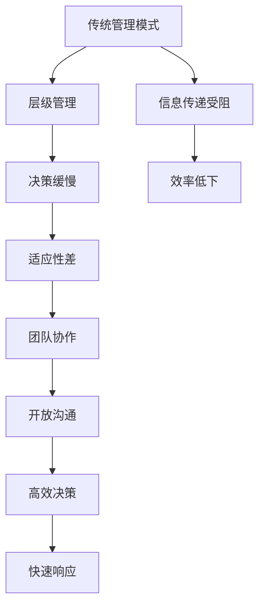

#### 1.1.2 现代工作环境中团队协作的趋势

随着全球化、数字化和信息技术的快速发展，现代工作环境中的团队协作趋势愈发显著。以下是一些主要趋势：

1. **跨职能团队**：跨职能团队将不同部门、不同领域的专业人才汇集在一起，共同解决复杂问题，提高创新能力和市场响应速度。
2. **远程协作**：远程工作的普及使得团队成员可以在不同的地理位置进行协作，但同时也带来了沟通障碍和文化差异等问题。
3. **敏捷开发**：敏捷开发强调快速迭代和持续改进，通过小团队协作实现高效的项目管理。
4. **知识共享**：知识共享平台和协作工具的普及，使得团队成员能够更容易地获取和共享知识，提高整体工作效率。

#### 1.1.3 团队协作的障碍与解决方案

团队协作虽然有许多优势，但也面临一些障碍，如：

1. **沟通障碍**：由于团队成员可能在不同的地点、使用不同的语言或技术，沟通不畅是一个常见问题。
   - **解决方案**：采用统一的沟通工具和规范，建立有效的沟通机制，加强跨文化沟通培训。

2. **角色混淆**：团队成员在角色和职责上的模糊可能导致任务重复或无人负责。
   - **解决方案**：明确团队角色和职责，建立清晰的工作流程和责任分配。

3. **冲突管理**：团队成员之间可能因为意见不同或利益冲突而产生矛盾。
   - **解决方案**：建立冲突管理机制，通过沟通、妥协和协作解决冲突。

4. **时间管理**：团队成员可能面临时间管理问题，导致项目进度延误。
   - **解决方案**：采用高效的时间管理工具和方法，确保任务按时完成。

### 1.2 团队协作模型与理论

#### 1.2.1 案例研究：成功团队协作案例分析

**案例**：谷歌X实验室（Google X）

谷歌X实验室是一个跨职能的团队，致力于开发前沿技术，如自动驾驶汽车、智能家居等。其成功的关键在于：

1. **开放的沟通文化**：团队成员之间可以自由地交流和分享想法，鼓励创新思维。
2. **灵活的角色分配**：团队成员可以根据项目需求灵活调整角色，确保最佳技能匹配。
3. **快速迭代**：通过快速原型开发和用户反馈，持续优化产品。

#### 1.2.2 团队角色与职责

团队角色是团队协作的基础，常见的团队角色包括：

1. **领导者**：负责团队的规划和决策，确保团队目标的实现。
2. **执行者**：负责具体任务的执行，按照计划完成任务。
3. **协调者**：负责协调团队成员之间的工作，解决协作中的问题。
4. **技术专家**：负责提供技术支持和指导，确保项目的技术可行性。

**Mermaid 流程图**：

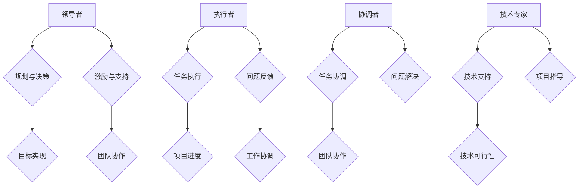

#### 1.2.3 团队发展模型

团队发展模型描述了团队从形成到成熟的阶段，常见的模型包括：

1. **Tuckman 模型**：形成（Forming）、震荡（Storming）、规范（Norming）、执行（Performing）、和解（Adjourning）。
2. **阶段型团队发展模型**：初始阶段、协作阶段、信任阶段、执行阶段、调整阶段。

**Mermaid 流程图**：

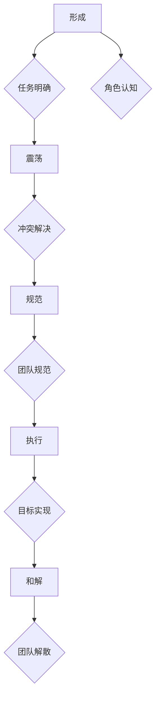

### 1.3 团队沟通技巧

#### 1.3.1 沟通障碍与克服策略

团队沟通中的障碍可能包括：

1. **语言障碍**：不同成员可能使用不同的语言或方言。
   - **解决方案**：采用统一的沟通语言或提供翻译支持。

2. **文化差异**：不同文化背景可能导致沟通方式和行为习惯的差异。
   - **解决方案**：进行跨文化沟通培训，尊重和理解不同文化的沟通习惯。

3. **信息过载**：大量的信息可能导致团队成员无法有效地处理和利用。
   - **解决方案**：建立信息过滤和优先级排序机制，确保重要信息得到及时处理。

**Mermaid 流程图**：

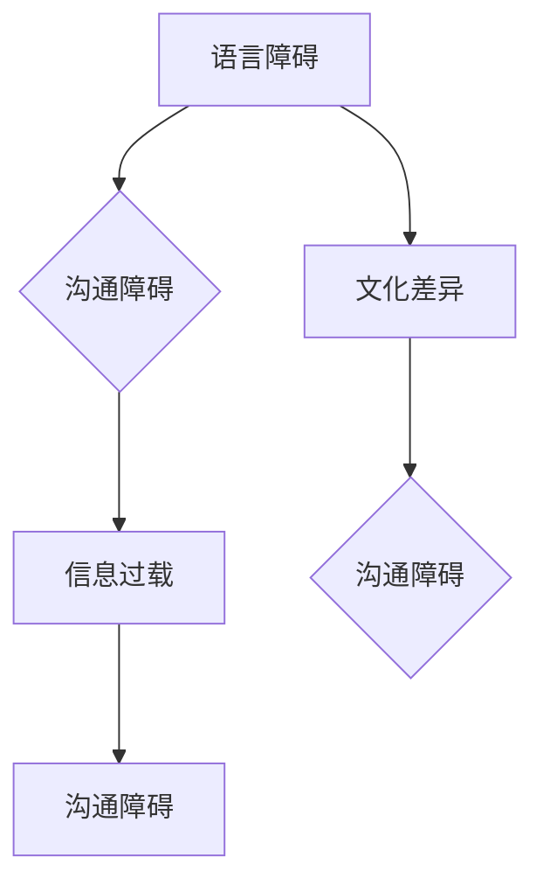

#### 1.3.2 沟通技巧：有效倾听与表达

有效的沟通不仅包括表达自己的观点，还包括倾听他人的意见。以下是一些沟通技巧：

1. **主动倾听**：在对方讲话时，保持专注和关注，不要打断对方。
2. **反馈确认**：在对方发言结束后，总结和反馈对方的主要观点，确保理解正确。
3. **清晰表达**：使用简洁明了的语言，避免使用专业术语或模糊的表述。

**Mermaid 流程图**：

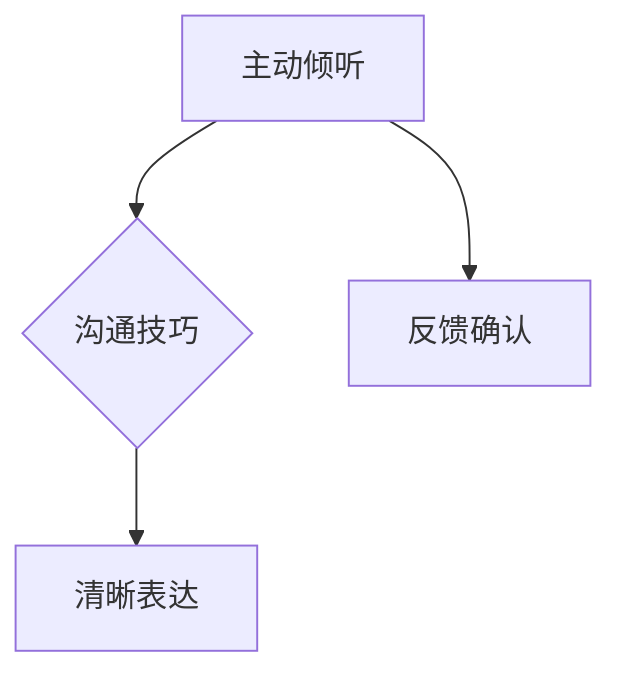

#### 1.3.3 跨文化沟通

跨文化沟通是团队协作中一个重要的方面。以下是一些跨文化沟通的技巧：

1. **尊重文化差异**：了解并尊重不同文化的价值观和行为习惯。
2. **开放心态**：保持开放和包容的心态，接受不同的观点和意见。
3. **明确沟通目标**：在沟通前明确沟通的目标和期望结果，确保双方对沟通内容有清晰的理解。

**Mermaid 流程图**：

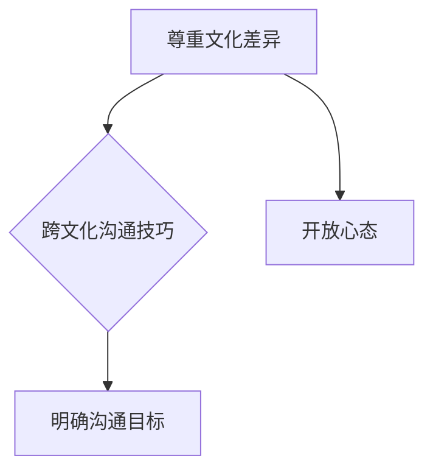

## 第二部分：团队协作工具与平台

### 2.1 团队协作工具的类型与应用

#### 2.1.1 文档协作工具

文档协作工具是团队协作中不可或缺的一部分，它可以帮助团队成员实时编辑、评论和共享文档。以下是一些常用的文档协作工具：

1. **Google Docs**：支持实时编辑和协作，适用于文档、表格和演示文稿。
2. **Microsoft Office 365**：提供在线版本的Word、Excel、PowerPoint等办公软件，支持多人协作。
3. **Notion**：功能强大的笔记和组织工具，适用于团队协作和项目管理。

**Mermaid 流.Flow：

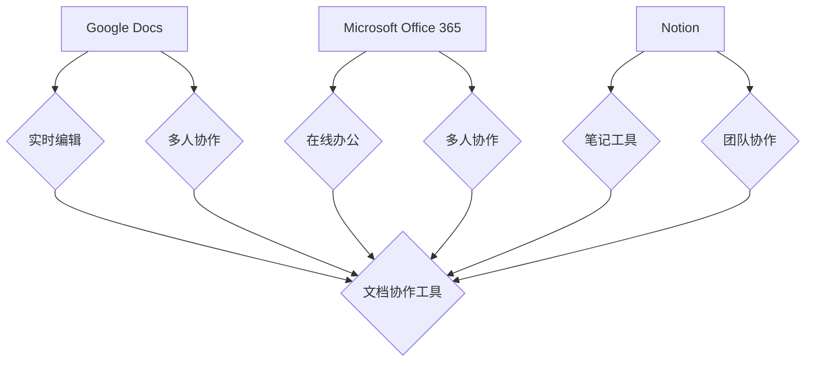

#### 2.1.2 项目管理工具

项目管理工具可以帮助团队跟踪项目进度、分配任务和监控资源。以下是一些常用的项目管理工具：

1. **Trello**：基于看板（Kanban）方法的任务管理工具，适用于小型团队和项目。
2. **Asana**：功能强大的项目管理工具，支持任务分配、进度跟踪和协作。
3. **Jira**：适用于软件开发团队的敏捷项目管理工具，支持迭代开发和问题跟踪。

**Mermaid 流程图**：

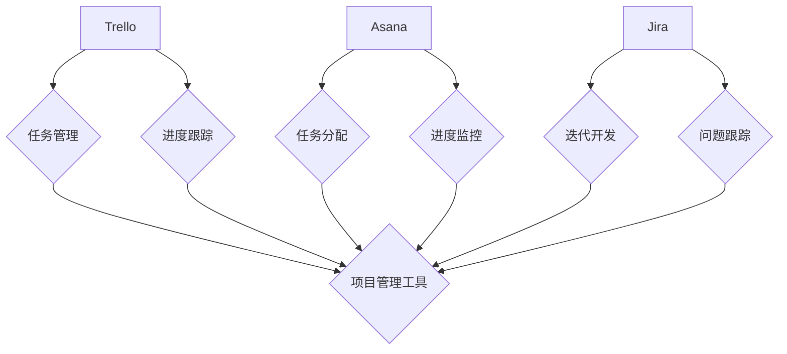

#### 2.1.3 沟通协作工具

沟通协作工具可以帮助团队成员实时沟通和协作，以下是一些常用的沟通协作工具：

1. **Slack**：支持实时消息传递、文件共享和集成其他服务，适用于团队沟通。
2. **Microsoft Teams**：整合了聊天、会议、协作和工作流，适用于企业级团队。
3. **Zoom**：提供视频会议、在线协作和直播功能，适用于远程协作。

**Mermaid 流程图**：

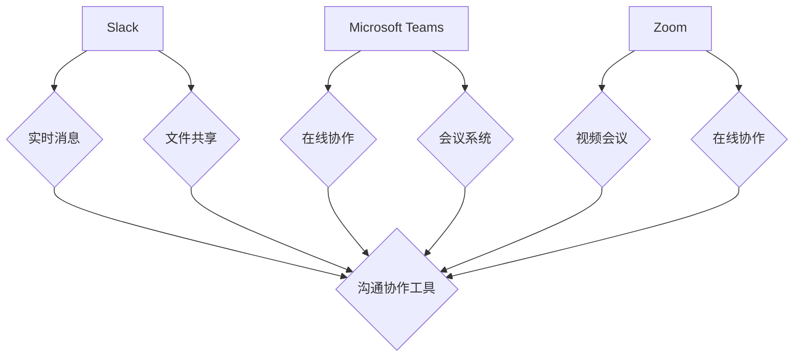

### 2.2 选择合适的团队协作平台

选择合适的团队协作平台对于团队协作的效率和效果至关重要。以下是一些选择团队协作平台的标准和评估方法：

#### 2.2.1 平台选择标准

1. **功能全面性**：平台需要提供全面的协作功能，包括文档协作、项目管理、沟通协作等。
2. **用户友好性**：平台界面要简洁易用，易于上手，降低学习成本。
3. **可定制性**：平台需要支持自定义工作流程和权限设置，满足不同团队的需求。
4. **安全性和可靠性**：平台需要确保数据安全和系统的稳定性，提供备份和恢复功能。
5. **价格合理**：平台的费用需要合理，综合考虑功能、性能和成本。

#### 2.2.2 平台评估方法

1. **需求分析**：明确团队协作的需求和目标，制定评估标准。
2. **功能对比**：对比不同平台的实际功能，评估其是否满足团队需求。
3. **试用体验**：邀请团队成员试用平台，收集反馈意见。
4. **成本预算**：评估平台的价格和性价比，制定预算。
5. **市场口碑**：参考市场口碑和用户评价，了解平台的实际应用情况。

### 2.3 实战案例：搭建团队协作平台

#### 2.3.1 实践流程与步骤

1. **需求分析**：明确团队协作需求，包括文档协作、项目管理、沟通协作等。
2. **功能选择**：根据需求选择合适的协作工具，如Google Docs、Trello、Slack等。
3. **平台搭建**：安装和配置所选平台，确保功能正常运行。
4. **用户培训**：组织团队成员培训，确保熟悉平台使用方法。
5. **试运行**：进行试运行，收集反馈意见，优化平台设置。
6. **正式上线**：根据反馈进行最终调整，正式上线团队协作平台。

#### 2.3.2 案例分析：团队协作平台建设案例

**案例**：某互联网公司团队协作平台建设

1. **需求分析**：公司需要一款功能全面的团队协作平台，支持文档协作、项目管理、沟通协作等功能。
2. **功能选择**：选择了Google Workspace（包括Google Docs、Google Sheets、Google Slides、Google Drive等）、Trello和Slack。
3. **平台搭建**：安装和配置了Google Workspace、Trello和Slack，确保各项功能正常运行。
4. **用户培训**：组织了多场培训课程，确保团队成员熟悉平台使用方法。
5. **试运行**：进行了为期一个月的试运行，收集了大量的用户反馈，针对反馈进行了优化。
6. **正式上线**：根据用户反馈进行了最后调整，正式上线团队协作平台。

**项目小结**：

1. **成功因素**：明确的需求分析、全面的功能选择、有效的用户培训是项目成功的关键。
2. **挑战与解决**：在试运行过程中，遇到了一些功能不完善和用户不熟悉的问题，通过反馈和调整得到了解决。
3. **未来展望**：随着公司业务的不断扩展，团队协作平台需要持续优化和更新，以适应新的需求。

### 2.3.3 平台使用技巧与优化

1. **文档协作技巧**：定期备份文档、使用版本控制、避免重复编辑。
2. **项目管理技巧**：合理分配任务、设置优先级、定期更新项目进度。
3. **沟通协作技巧**：及时回复消息、参与讨论、避免无关话题。

**最佳实践 tips**：

1. **定期评估**：定期评估团队协作平台的使用效果，根据反馈进行优化。
2. **用户参与**：鼓励用户提出改进建议，增加平台的用户满意度。
3. **安全意识**：加强数据安全意识，定期备份数据，防止数据丢失。

## 第三部分：提升团队协作效率的实战技巧

### 3.1 高效团队的时间管理

#### 3.1.1 时间管理理论

时间管理是团队协作中至关重要的一环，它关系到项目的进度和团队的整体效率。以下是一些时间管理的基本理论：

1. **优先级排序**：根据任务的紧急程度和重要性进行排序，确保先完成重要且紧急的任务。
   - **公式**：优先级 = 重要性 × 紧急程度

2. **时间块管理**：将工作时间划分为不同时间块，每个时间块专注于一项任务，避免任务切换带来的时间浪费。

3. **番茄工作法**：将工作时间分为25分钟的工作周期（称为番茄钟），每个周期后休息5分钟，每四个周期后休息更长的时间。

**Mermaid 流程图**：

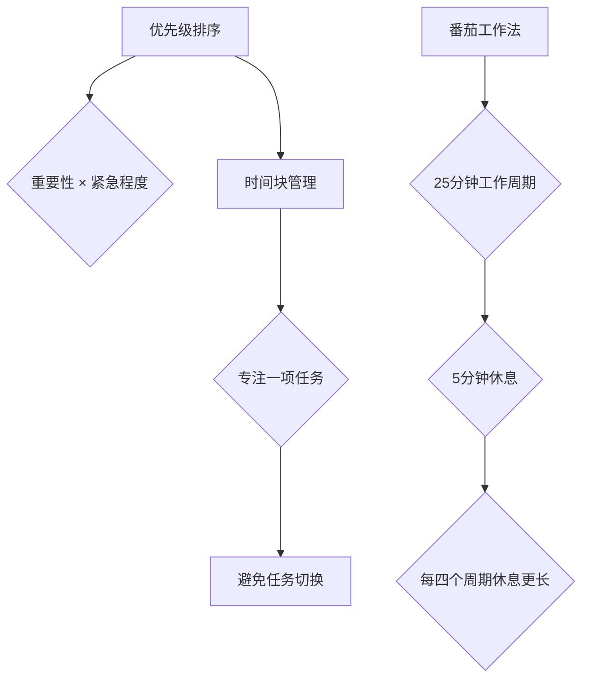

#### 3.1.2 团队协作中的时间管理策略

在团队协作中，时间管理策略包括以下几个方面：

1. **明确目标**：确保团队成员明确项目的目标和任务要求，避免因目标不清而浪费时间。

2. **任务分配**：合理分配任务，确保每个团队成员都能高效地工作，避免任务堆积和效率低下。

3. **定期检查**：定期检查任务进度，及时发现和解决潜在的问题，确保项目按计划进行。

4. **时间追踪**：使用时间追踪工具记录工作时长和任务完成情况，帮助团队成员更好地管理时间。

**Mermaid 流程图**：

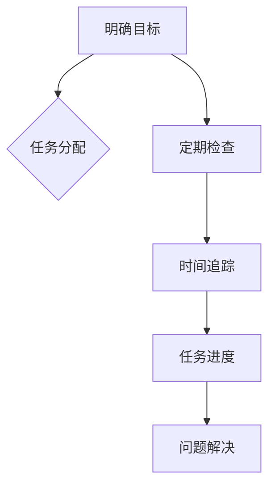

#### 3.1.3 案例分析：时间管理在团队协作中的应用

**案例**：某软件开发团队的时间管理实践

1. **明确目标**：团队在项目启动时明确了项目目标和任务要求，确保每个成员都清楚自己的职责。

2. **任务分配**：根据成员的技能和项目需求，合理分配任务，确保每个成员都有明确的任务和时间节点。

3. **定期检查**：团队每周进行一次进度检查，总结上周的工作成果和遇到的问题，确保项目按计划进行。

4. **时间追踪**：团队成员使用Toggl等时间追踪工具记录每天的工作时长和任务完成情况，以便更好地管理时间。

**项目小结**：

1. **成功因素**：明确的目标、合理的任务分配和定期检查是时间管理成功的关键。

2. **挑战与解决**：团队成员在初期遇到了任务分配不均和时间管理不当的问题，通过调整任务分配和加强时间管理，问题得到了有效解决。

3. **未来展望**：团队将继续优化时间管理策略，提高工作效率，确保项目按时完成。

### 3.2 提升团队协作的会议管理

#### 3.2.1 会议的类型与目的

会议是团队协作中常用的沟通方式，但如果不加控制，会议可能会浪费大量时间。以下是一些常见的会议类型和目的：

1. **项目启动会议**：在项目启动时召开，明确项目目标、任务分配和时间计划。
2. **项目进度会议**：定期召开，检查项目进度、解决遇到的问题和调整计划。
3. **决策会议**：在决策过程中召开，讨论并决定项目的关键事项。
4. **沟通会议**：为团队成员提供交流信息、分享经验和讨论问题的平台。

**Mermaid 流程图**：

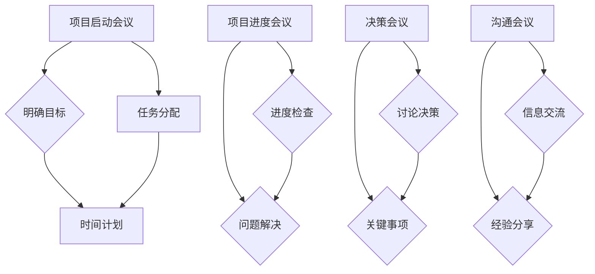

#### 3.2.2 高效会议的组织与实施

要确保会议高效，需要从以下几个方面进行组织和实施：

1. **明确会议目的**：在会议前明确会议的目的和议程，确保会议有明确的目标和议题。

2. **准备充分**：确保所有与会人员都对会议议题有充分的了解和准备，避免因准备不足而影响会议效率。

3. **控制会议时间**：设定合理的会议时间，避免会议时间过长，确保会议在预定时间内完成。

4. **鼓励积极参与**：鼓励所有与会人员积极参与讨论，提出问题和建议，确保会议内容的丰富性和全面性。

**Mermaid 流程图**：

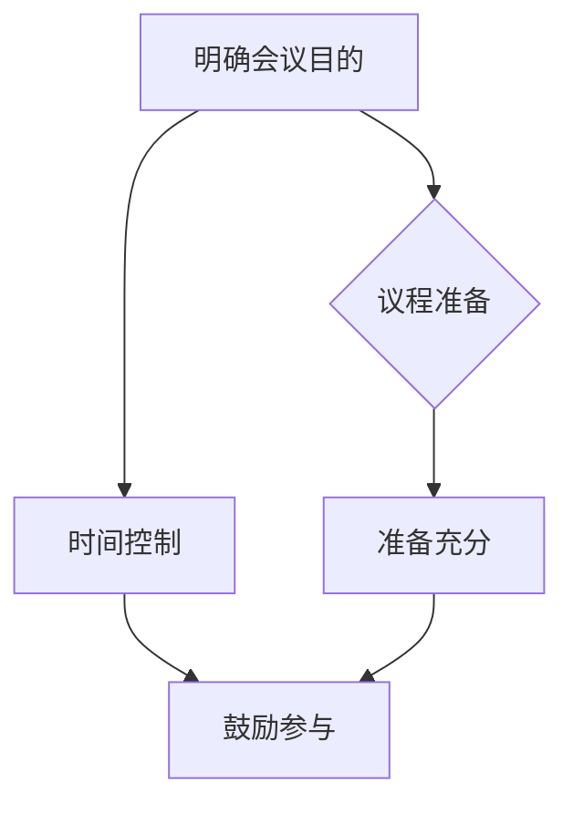

#### 3.2.3 案例分析：如何避免低效会议

**案例**：某初创公司避免低效会议的实践

1. **明确会议目的**：在每次会议前，明确会议的目的和议程，确保会议有明确的目标和议题。

2. **控制会议时间**：设定合理的会议时间，避免会议时间过长，确保会议在预定时间内完成。

3. **准备充分**：确保所有与会人员都对会议议题有充分的了解和准备，避免因准备不足而影响会议效率。

4. **鼓励积极参与**：鼓励所有与会人员积极参与讨论，提出问题和建议，确保会议内容的丰富性和全面性。

5. **会议记录**：会议结束后，及时整理会议记录和决策结果，确保会议内容的落实和执行。

**项目小结**：

1. **成功因素**：明确会议目的、控制会议时间、准备充分和鼓励参与是避免低效会议的关键。

2. **挑战与解决**：在实践过程中，公司遇到了会议时间过长和准备不充分的问题，通过制定明确目标和加强准备，问题得到了有效解决。

3. **未来展望**：公司将继续优化会议管理，提高会议效率，确保团队协作的顺利进行。

### 3.3 团队成员的角色认知与自我提升

#### 3.3.1 团队成员的角色认知

团队成员的角色认知是团队协作的基础，每个成员都应该明确自己的角色和职责。以下是一些常见团队成员的角色：

1. **领导者**：负责团队的目标设定、决策和协调，确保团队目标的实现。
2. **执行者**：负责具体任务的执行，按照计划完成任务。
3. **协调者**：负责协调团队成员之间的工作，解决协作中的问题。
4. **技术专家**：负责提供技术支持和指导，确保项目的技术可行性。
5. **支持者**：负责提供后勤支持和资源保障，确保团队的工作环境。

**Mermaid 流程图**：

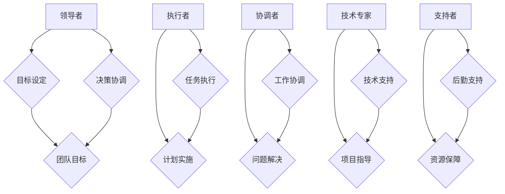

#### 3.3.2 成员自我提升的方法

团队成员的自我提升是团队持续发展的关键，以下是一些自我提升的方法：

1. **持续学习**：通过参加培训课程、阅读专业书籍、观看在线教程等方式，不断更新知识和技能。
2. **实践应用**：通过实际项目和实践应用，将所学知识转化为实际能力。
3. **反思总结**：定期反思自己的工作，总结经验教训，找出改进空间。
4. **寻求反馈**：主动寻求他人的意见和建议，了解自己的优点和不足，不断提高。

**Mermaid 流程图**：

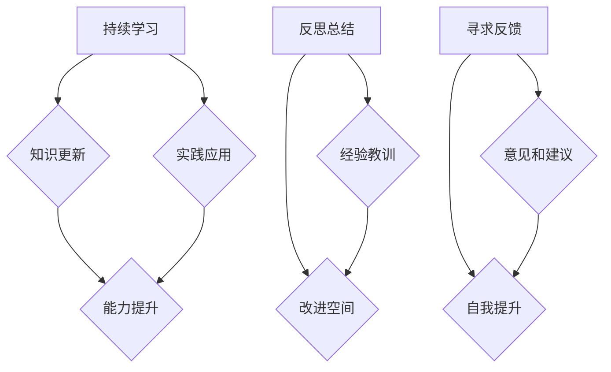

#### 3.3.3 案例分析：如何打造高效团队角色

**案例**：某技术团队的自我提升与实践

1. **明确角色**：团队成员在项目启动时明确自己的角色和职责，确保每个成员都清楚自己的任务和目标。

2. **持续学习**：团队成员定期参加技术培训课程，学习新技术和新方法，提高自身技能水平。

3. **实践应用**：在项目实践中，团队成员将所学知识应用于实际问题，解决技术难题。

4. **反思总结**：每个季度，团队成员进行工作总结，分析项目中的成功经验和不足，找出改进方向。

5. **寻求反馈**：团队成员主动向其他团队成员和上级领导寻求意见和建议，不断优化工作方法和流程。

**项目小结**：

1. **成功因素**：明确角色、持续学习、实践应用和反思总结是团队成员自我提升的关键。

2. **挑战与解决**：在实践过程中，团队成员遇到了学习与实践不平衡的问题，通过加强培训和交流，问题得到了有效解决。

3. **未来展望**：团队将继续优化自我提升方法，提高整体效率，推动项目进展。

## 第四部分：团队协作中的冲突管理与解决

### 4.1 团队冲突的类型与原因

团队冲突是团队协作过程中不可避免的问题，了解冲突的类型和原因是进行冲突管理的前提。以下是一些常见的团队冲突类型和原因：

#### 4.1.1 团队冲突的类型

1. **目标冲突**：团队成员对项目目标或个人目标存在不同看法，导致工作方向不一致。
2. **角色冲突**：团队成员在职责分配和角色定位上存在争议，导致工作重叠或无人负责。
3. **文化冲突**：由于团队成员来自不同文化背景，价值观和行为习惯存在差异，导致沟通和协作困难。
4. **个人冲突**：团队成员之间因个人性格、背景或利益冲突而产生的矛盾。

**Mermaid 流程图**：

```mermaid
graph TD
A[目标冲突] --> B{工作方向不一致};
A --> C[角色冲突];
B --> D{职责争议};
C --> D;
E[文化冲突] --> F{沟通困难};
E --> G[价值观差异};
F --> G;
H[个人冲突] --> I{性格背景差异};
H --> J{利益冲突};
I --> J;
```

#### 4.1.2 团队冲突的原因分析

团队冲突的产生往往源于以下几个方面：

1. **沟通障碍**：团队成员之间的信息传递不畅，导致误解和矛盾。
2. **资源分配不均**：团队成员在资源获取和分配上存在不公平，引发不满和争执。
3. **角色职责不清**：团队成员对自身职责和角色认知不清，导致工作重叠或推诿。
4. **目标不一致**：团队成员对项目目标或个人目标缺乏共识，导致努力方向不一致。
5. **个人性格差异**：团队成员的性格和行为习惯不同，导致相互之间的摩擦和冲突。

**Mermaid 流程图**：

```mermaid
graph TD
A[沟通障碍] --> B{信息传递不畅};
A --> C[资源分配不均];
B --> D{误解和矛盾};
C --> D;
E[角色职责不清] --> F{职责争议};
E --> G[工作重叠};
F --> G;
H[目标不一致] --> I{努力方向不一致};
H --> J{缺乏共识};
I --> J;
K[个人性格差异] --> L{性格行为差异};
K --> M{相互摩擦};
L --> M;
```

#### 4.1.3 冲突管理的重要性

冲突管理在团队协作中至关重要，有效的冲突管理能够：

1. **促进团队和谐**：通过解决冲突，增强团队成员之间的信任和合作关系，营造良好的团队氛围。
2. **提高工作效率**：减少冲突带来的负面情绪和工作障碍，提高团队的整体工作效率。
3. **增强创新能力**：冲突往往意味着不同的观点和想法，通过合理的冲突管理，可以激发团队的创新能力。
4. **促进个人成长**：冲突管理有助于团队成员认识到自己的不足，通过反思和改进，实现个人成长。

**Mermaid 流程图**：

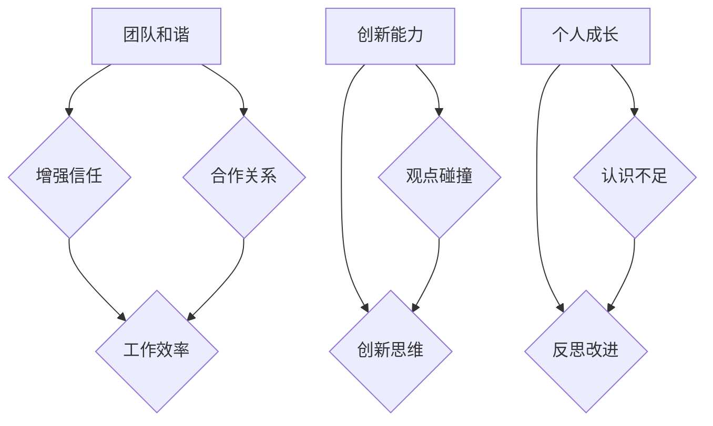

### 4.2 冲突管理策略与技巧

#### 4.2.1 冲突预防策略

1. **明确目标与职责**：确保团队成员对项目目标和个人职责有清晰的认识，减少因目标不一致和职责不清引发的冲突。
2. **沟通机制建设**：建立有效的沟通机制，确保团队成员之间的信息传递畅通，减少误解和矛盾。
3. **文化融合**：尊重不同文化背景的团队成员，促进文化融合，减少文化冲突。
4. **资源公平分配**：确保团队成员在资源获取和分配上公平，避免因资源分配不均引发的冲突。

**Mermaid 流程图**：

```mermaid
graph TD
A[明确目标与职责] --> B{清晰认识};
A --> C[沟通机制建设];
B --> D[减少误解];
C --> D;
E[文化融合] --> F{尊重差异};
E --> G[减少文化冲突];
F --> G;
H[资源公平分配] --> I{公平获取};
H --> J[减少资源冲突};
I --> J;
```

#### 4.2.2 冲突解决技巧

1. **倾听与理解**：在冲突发生时，首先倾听对方的意见和观点，理解对方的立场和需求。
2. **积极沟通**：通过积极的沟通和交流，寻找共同点和解决方案，避免激化矛盾。
3. **妥协与让步**：在必要时，通过妥协和让步达成共识，避免无谓的争执。
4. **寻求第三方帮助**：在冲突难以解决时，可以寻求第三方专业人士或领导的帮助，进行调解和决策。

**Mermaid 流程图**：

```mermaid
graph TD
A[倾听与理解] --> B{意见理解};
A --> C[积极沟通];
B --> D{共同点寻找};
C --> D;
E[妥协与让步] --> F{达成共识};
E --> G[避免争执};
F --> G;
H[寻求第三方帮助] --> I{调解决策};
H --> J{冲突解决};
I --> J;
```

#### 4.2.3 案例分析：成功解决团队冲突的案例

**案例**：某技术团队的冲突解决实践

1. **冲突预防**：在项目启动时，明确了团队成员的职责和目标，建立了有效的沟通机制，减少了目标冲突和职责不清引发的冲突。

2. **倾听与理解**：在冲突发生时，团队成员主动倾听对方的意见，理解对方的立场和需求，避免了冲突的进一步恶化。

3. **积极沟通**：通过积极的沟通和交流，团队成员找到了共同点和解决方案，化解了矛盾。

4. **妥协与让步**：在必要时，团队成员通过妥协和让步达成共识，避免了无谓的争执。

5. **第三方帮助**：在冲突难以解决时，团队成员寻求了项目管理人员的帮助，进行了调解和决策。

**项目小结**：

1. **成功因素**：明确的职责和目标、倾听与理解、积极沟通、妥协与让步以及第三方帮助是解决冲突的关键。

2. **挑战与解决**：在冲突解决过程中，团队成员遇到了沟通不畅和立场坚定的问题，通过加强沟通和寻求第三方帮助，问题得到了有效解决。

3. **未来展望**：团队将继续优化冲突管理策略，提高团队协作效率，确保项目的顺利进行。

### 4.3 建立积极团队文化

#### 4.3.1 团队文化的概念与作用

团队文化是指团队成员共同遵守的价值观、信念、行为规范和团队氛围。良好的团队文化能够：

1. **增强凝聚力**：通过共同的价值观和行为规范，增强团队成员之间的凝聚力，促进团队合作。
2. **提高工作效率**：积极的团队文化能够激发团队成员的工作热情和创造力，提高工作效率和质量。
3. **促进个人成长**：良好的团队文化鼓励团队成员不断学习和提升，促进个人成长和发展。
4. **增强团队竞争力**：积极的团队文化有助于团队在激烈的市场竞争中保持优势，增强团队竞争力。

**Mermaid 流程图**：

```mermaid
graph TD
A[增强凝聚力] --> B{团队合作};
A --> C[提高工作效率};
B --> D[激发创造力};
C --> D;
E[促进个人成长] --> F{学习提升};
E --> G[团队竞争力};
F --> G;
```

#### 4.3.2 建立积极团队文化的方法

1. **树立榜样**：领导者应以身作则，树立积极的工作态度和行为榜样，引导团队成员形成良好的工作习惯。
2. **共同价值观**：明确团队的核心价值观，确保所有团队成员都认同并践行。
3. **鼓励反馈**：建立开放和透明的反馈机制，鼓励团队成员提出建议和反馈，促进团队改进。
4. **激励机制**：设立合理的激励机制，奖励表现优秀的团队成员，激励整个团队的积极性。
5. **团队建设活动**：定期组织团队建设活动，增强团队成员之间的互动和信任，营造积极的团队氛围。

**Mermaid 流程图**：

```mermaid
graph TD
A[树立榜样] --> B{行为规范};
A --> C[共同价值观];
B --> D[鼓励反馈];
C --> D;
E[激励机制] --> F{奖励优秀};
E --> G{激励团队};
F --> G;
H[团队建设活动] --> I{互动信任};
H --> J{积极氛围};
I --> J;
```

#### 4.3.3 案例分析：积极团队文化的建立与维护

**案例**：某互联网公司积极团队文化的建立与维护

1. **树立榜样**：公司领导以身作则，积极面对挑战，带领团队迎难而上。
2. **共同价值观**：公司明确“创新、协作、用户至上”的核心价值观，确保所有团队成员都认同并践行。
3. **鼓励反馈**：公司建立了开放透明的反馈机制，鼓励团队成员提出建议和反馈，促进团队改进。
4. **激励机制**：公司设立了绩效奖金和股权激励等激励机制，奖励表现优秀的团队成员。
5. **团队建设活动**：公司定期组织团建活动，如户外拓展、团队聚餐等，增强团队成员之间的互动和信任。

**项目小结**：

1. **成功因素**：领导者树立榜样、共同价值观的建立、鼓励反馈、激励机制和团队建设活动是建立积极团队文化的重要因素。
2. **挑战与解决**：在建立积极团队文化的过程中，公司遇到了沟通不畅和文化认同度不高等问题，通过加强沟通和团队活动，问题得到了有效解决。
3. **未来展望**：公司将继续优化团队文化，提高团队凝聚力和工作效率，推动公司持续发展。

## 第五部分：团队协作的未来趋势

### 5.1 人工智能在团队协作中的应用

随着人工智能技术的不断发展，AI在团队协作中的应用前景广阔。以下是一些AI技术在团队协作中的应用场景：

#### 5.1.1 AI技术在团队协作中的潜力

1. **自动化任务处理**：AI可以自动化处理重复性高、流程明确的任务，如数据录入、报告生成等，提高工作效率。
2. **智能推荐系统**：AI可以基于团队成员的行为和偏好，提供智能推荐，如任务分配、项目建议等，优化工作流程。
3. **智能协作工具**：AI驱动的协作工具可以实时分析团队成员的工作状态和需求，提供个性化的协作支持。
4. **智能会议系统**：AI可以自动记录会议内容、总结关键信息，并提供建议和跟进任务，提高会议效率。

**Mermaid 流程图**：

```mermaid
graph TD
A[自动化任务处理] --> B{重复性任务};
A --> C[智能推荐系统];
B --> D[工作效率];
C --> D;
E[智能协作工具] --> F{实时分析};
E --> G[个性化支持};
F --> G;
H[智能会议系统] --> I{记录总结};
H --> J[提高效率};
I --> J;
```

#### 5.1.2 AI工具的实际应用案例

**案例**：某互联网公司的AI协作工具实践

1. **自动化任务处理**：公司引入了AI自动化工具，用于处理数据录入、报告生成等重复性任务，大幅提高了工作效率。
2. **智能推荐系统**：AI推荐系统根据团队成员的工作内容和历史数据，为团队成员提供任务分配和项目建议，优化了工作流程。
3. **智能协作工具**：AI协作工具实时分析团队成员的工作状态和需求，提供个性化的协作支持，如提醒任务、优化沟通等。
4. **智能会议系统**：AI会议系统自动记录会议内容，总结关键信息，并提供建议和跟进任务，提高了会议效率。

**项目小结**：

1. **成功因素**：AI技术的引入和应用，有效提高了工作效率和团队协作质量。
2. **挑战与解决**：在AI工具的应用过程中，公司遇到了数据隐私和安全等问题，通过加强数据保护和安全措施，问题得到了有效解决。
3. **未来展望**：公司将继续探索AI在团队协作中的新应用，推动团队协作效率的进一步提升。

#### 5.1.3 AI工具的未来发展趋势

随着AI技术的不断进步，AI工具在未来团队协作中的应用将更加广泛和深入。以下是一些发展趋势：

1. **个性化和智能化**：AI工具将更加注重个性化和智能化，根据团队成员的行为和需求，提供更加精准和有效的支持。
2. **跨平台和跨应用**：AI工具将实现跨平台和跨应用的无缝集成，支持多种协作场景和业务需求。
3. **数据融合与分析**：AI工具将整合更多数据源，进行深度分析和挖掘，为团队协作提供更加全面和深入的洞察。
4. **人机协作**：AI工具将与人类协作更加紧密，实现人机协同，提高团队协作效率和创新能力。

**Mermaid 流程图**：

```mermaid
graph TD
A[个性化和智能化] --> B{精准支持};
A --> C[跨平台和跨应用];
B --> D[无缝集成];
C --> D;
E[数据融合与分析] --> F{全面洞察};
E --> G[深度挖掘};
F --> G;
H[人机协作] --> I{协同创新};
H --> J{提高效率};
I --> J;
```

### 5.2 跨职能团队的协作模式

跨职能团队是将不同职能领域的人才汇集在一起，共同解决复杂问题的团队。以下是一些跨职能团队的协作模式和优势：

#### 5.2.1 跨职能团队的优势与挑战

**优势**：

1. **综合能力**：跨职能团队汇集了不同领域的专业人才，具备更全面的能力，能够更好地解决复杂问题。
2. **快速响应**：跨职能团队可以快速响应市场变化和客户需求，提高企业的敏捷性。
3. **创新驱动**：跨职能团队通过跨领域的合作和交流，可以激发创新思维，推动产品的迭代和创新。

**挑战**：

1. **沟通障碍**：跨职能团队可能面临沟通障碍，由于专业背景和语言的不同，团队成员之间的沟通可能存在困难。
2. **角色冲突**：不同职能领域的团队成员可能在角色定位和任务分配上存在争议，导致工作冲突。
3. **文化差异**：团队成员来自不同的文化背景，可能存在价值观和行为习惯的差异，影响团队的协作效果。

**Mermaid 流程图**：

```mermaid
graph TD
A[综合能力] --> B{全面能力};
A --> C[快速响应];
B --> D[创新驱动];
E[沟通障碍] --> F{专业背景差异};
E --> G{语言障碍};
F --> G;
H[角色冲突] --> I{任务分配争议};
H --> J{工作冲突};
I --> J;
K[文化差异] --> L{价值观差异};
K --> M{行为习惯差异};
L --> M;
```

#### 5.2.2 跨职能团队的协作模式

1. **矩阵式组织结构**：在矩阵式组织结构中，团队成员既属于原职能部门，又属于跨职能团队，实现双重管理。
2. **协同工作平台**：使用协同工作平台，如Jira、Trello等，确保团队成员能够实时共享信息、任务和进度。
3. **定期会议**：定期召开跨职能团队的会议，确保团队成员之间的沟通和信息共享。
4. **知识共享**：建立知识共享平台，鼓励团队成员分享经验和知识，提高团队的集体智慧。

**Mermaid 流程图**：

```mermaid
graph TD
A[矩阵式组织结构] --> B{双重管理};
A --> C[协同工作平台];
B --> D[定期会议];
C --> D;
E[知识共享] --> F{经验分享};
E --> G[集体智慧];
F --> G;
```

#### 5.2.3 案例分析：成功的跨职能团队协作

**案例**：某互联网公司产品开发团队的跨职能协作

1. **矩阵式组织结构**：产品开发团队采用矩阵式组织结构，团队成员既属于技术部门，又属于产品部门，实现双重管理。
2. **协同工作平台**：团队使用Jira进行任务管理，确保任务分配、进度跟踪和问题解决。
3. **定期会议**：每周召开一次跨职能团队会议，确保团队成员之间的沟通和信息共享。
4. **知识共享**：团队建立了知识共享平台，鼓励团队成员分享技术文档、产品设计和用户体验等方面的知识和经验。

**项目小结**：

1. **成功因素**：矩阵式组织结构、协同工作平台、定期会议和知识共享是跨职能团队协作成功的关键。
2. **挑战与解决**：在跨职能协作过程中，团队遇到了沟通障碍和文化差异等问题，通过加强沟通和建立知识共享平台，问题得到了有效解决。
3. **未来展望**：团队将继续优化跨职能协作模式，提高团队协作效率和产品开发质量。

### 5.3 全球化团队协作

随着全球化的发展，全球化团队协作变得越来越普遍。以下是一些全球化团队协作的挑战、策略和案例分析：

#### 5.3.1 全球化团队协作的挑战

**挑战**：

1. **时区差异**：全球化团队在不同时区工作，可能面临沟通和协作的时区差异。
2. **文化差异**：团队成员来自不同的文化背景，可能存在价值观和行为习惯的差异，影响团队的协作效果。
3. **语言障碍**：团队成员可能使用不同的语言，导致沟通不畅和误解。
4. **法律和法规**：全球化团队在不同国家工作，可能面临不同的法律和法规，影响团队的工作流程。

**Mermaid 流程图**：

```mermaid
graph TD
A[时区差异] --> B{沟通协作};
A --> C[文化差异];
B --> D[协作效果];
C --> D;
E[语言障碍] --> F{沟通不畅};
E --> G[误解];
F --> G;
H[法律和法规] --> I{工作流程};
H --> J{合规性};
I --> J;
```

#### 5.3.2 全球化团队协作的策略

1. **建立统一的沟通平台**：使用统一的沟通工具，如Slack、Microsoft Teams等，确保团队成员能够实时沟通和协作。
2. **文化融合**：鼓励团队成员了解和尊重不同文化，建立共同的文化价值观，提高团队的凝聚力。
3. **语言培训**：提供语言培训，帮助团队成员提高语言能力，减少沟通障碍。
4. **法律法规培训**：为团队成员提供法律法规培训，确保团队在全球化协作中遵守相关法律和法规。

**Mermaid 流程图**：

```mermaid
graph TD
A[统一沟通平台] --> B{实时沟通};
A --> C[文化融合];
B --> D[提高凝聚力];
C --> D;
E[语言培训] --> F{语言能力};
E --> G[减少沟通障碍];
F --> G;
H[法律法规培训] --> I{遵守法规};
H --> J[合规性];
I --> J;
```

#### 5.3.3 案例分析：全球化团队协作的实践

**案例**：某跨国公司的全球化团队协作实践

1. **统一沟通平台**：公司采用Slack作为全球化团队的统一沟通平台，确保团队成员能够实时沟通和协作。
2. **文化融合**：公司定期举办文化融合活动，如团队聚餐、文化讲座等，促进团队成员之间的相互了解和尊重。
3. **语言培训**：公司为团队成员提供语言培训，鼓励团队成员提高语言能力，提高沟通效率。
4. **法律法规培训**：公司定期举办法律法规培训，确保团队成员了解和遵守不同国家的法律和法规。

**项目小结**：

1. **成功因素**：统一沟通平台、文化融合、语言培训和法律法规培训是全球化团队协作成功的关键。
2. **挑战与解决**：在全球化团队协作过程中，公司遇到了沟通不畅和文化差异等问题，通过加强沟通和培训，问题得到了有效解决。
3. **未来展望**：公司将继续优化全球化团队协作模式，提高团队协作效率和国际化水平。

## 附录

### 附录A：团队协作工具和资源列表

以下是一些常用的团队协作工具和资源，供读者参考：

1. **文档协作工具**：
   - Google Workspace（Google Docs、Google Sheets、Google Slides）
   - Microsoft Office 365（Word、Excel、PowerPoint）
   - Notion

2. **项目管理工具**：
   - Trello
   - Asana
   - Jira

3. **沟通协作工具**：
   - Slack
   - Microsoft Teams
   - Zoom

4. **时间管理工具**：
   - Toggl
   - RescueTime
   - Todoist

5. **知识共享平台**：
   - Confluence
   - SharePoint
   - Notion

### 附录B：团队协作最佳实践案例

以下是一些团队协作的最佳实践案例，供读者参考：

1. **案例1**：某互联网公司的敏捷开发实践
   - 采用敏捷开发方法，实现快速迭代和持续改进。
   - 通过Trello进行任务管理和进度跟踪，确保项目进度可控。
   - 定期举行回顾会议，总结经验教训，不断优化团队协作流程。

2. **案例2**：某跨国公司的全球化团队协作
   - 采用统一沟通平台（如Slack）确保实时沟通。
   - 定期举办文化融合活动，促进团队成员之间的相互了解和尊重。
   - 提供语言培训和法律法规培训，确保团队成员能够顺利进行全球化协作。

3. **案例3**：某初创公司的团队文化建设
   - 明确团队的核心价值观，确保所有团队成员都认同和践行。
   - 建立开放的沟通机制，鼓励团队成员提出意见和建议。
   - 通过团建活动，增强团队成员之间的信任和凝聚力。

## 结尾

本文从团队协作的基础理论、工具与平台、实战技巧、冲突管理与解决以及未来趋势等方面，深入探讨了如何提高团队协作效率。通过了解团队协作的重要性、掌握团队协作工具和平台、提升沟通技巧和自我管理能力，以及解决冲突和建立积极团队文化，团队可以更加高效地完成工作，实现个人和团队的共同成长。随着AI技术的不断发展，团队协作模式也将不断演进，未来团队协作将更加智能化、个性化和全球化。希望本文能为读者提供有价值的参考和启示，助力团队协作的不断提升。

### 参考文献

1. Tuckman, B. M. (1965). Developmental sequences in small groups. Psychological Bulletin, 63(6), 384-399.
2. Slack. (n.d.). About Slack. Retrieved from https://slack.com/about
3. Trello. (n.d.). About Trello. Retrieved from https://trello.com/about
4. Asana. (n.d.). About Asana. Retrieved from https://asana.com/about
5. Jira. (n.d.). About Jira. Retrieved from https://www.atlassian.com/software/jira
6. Google Workspace. (n.d.). About Google Workspace. Retrieved from https://workspace.google.com/about/
7. Microsoft Teams. (n.d.). About Microsoft Teams. Retrieved from https://www.microsoft.com/en-us/microsoft-365/microsoft-teams/what-is-microsoft-teams
8. Zoom. (n.d.). About Zoom. Retrieved from https://www.zoom.us/

## 附录A：团队协作工具和资源列表

为了帮助团队在协作过程中选择合适的工具和资源，以下是团队协作中常用的一些工具和资源的详细列表，包括文档协作工具、项目管理工具、沟通协作工具、时间管理工具和知识共享平台。

### 文档协作工具

#### 1. Google Workspace（Google Docs、Google Sheets、Google Slides）

**特点**：集成办公软件，支持多人实时协作，便于文件共享和版本控制。

**优势**：云端存储，跨平台兼容，自动备份。

**应用场景**：文档编辑、表格处理、演示文稿制作。

**链接**：[Google Workspace](https://workspace.google.com/)

#### 2. Microsoft Office 365（Word、Excel、PowerPoint）

**特点**：强大的办公软件，提供云端存储和协作功能。

**优势**：功能全面，兼容性好，集成企业服务。

**应用场景**：文本编辑、数据分析和报告制作。

**链接**：[Microsoft Office 365](https://www.microsoft.com/zh-cn/office/)

#### 3. Notion

**特点**：多功能笔记和组织工具，支持自定义视图和工作流程。

**优势**：灵活性高，适应性强，易于扩展。

**应用场景**：知识库建设、项目规划和团队协作。

**链接**：[Notion](https://www.notion.com/)

### 项目管理工具

#### 1. Trello

**特点**：基于看板（Kanban）方法的任务管理工具，直观易懂。

**优势**：简单易用，灵活性强，可视化任务进度。

**应用场景**：任务分配、进度跟踪和项目管理。

**链接**：[Trello](https://trello.com/)

#### 2. Asana

**特点**：功能强大的项目管理工具，支持任务分配、进度跟踪和协作。

**优势**：多维度任务管理，灵活的工作流程，良好的用户体验。

**应用场景**：项目管理和团队协作。

**链接**：[Asana](https://asana.com/)

#### 3. Jira

**特点**：适用于软件开发团队的敏捷项目管理工具，支持迭代开发和问题跟踪。

**优势**：强大的敏捷开发功能，灵活的插件系统，广泛的用户基础。

**应用场景**：软件开发项目管理、敏捷迭代和问题跟踪。

**链接**：[Jira](https://www.atlassian.com/software/jira)

### 沟通协作工具

#### 1. Slack

**特点**：支持实时消息传递、文件共享和集成其他服务。

**优势**：集成度高，功能丰富，易于扩展。

**应用场景**：团队沟通、项目协作和日常办公。

**链接**：[Slack](https://slack.com/)

#### 2. Microsoft Teams

**特点**：整合了聊天、会议、协作和工作流，适用于企业级团队。

**优势**：功能全面，集成度高，易于管理。

**应用场景**：团队沟通、在线协作和会议管理。

**链接**：[Microsoft Teams](https://www.microsoft.com/en-us/microsoft-365/microsoft-teams/what-is-microsoft-teams)

#### 3. Zoom

**特点**：提供视频会议、在线协作和直播功能。

**优势**：稳定可靠，功能强大，支持大规模会议。

**应用场景**：远程会议、在线培训和团队协作。

**链接**：[Zoom](https://www.zoom.us/)

### 时间管理工具

#### 1. Toggl

**特点**：支持时间追踪、任务管理和报告生成。

**优势**：简单易用，数据分析功能强大。

**应用场景**：时间管理、任务跟踪和项目报告。

**链接**：[Toggl](https://toggl.com/)

#### 2. RescueTime

**特点**：自动记录工作时间和活动，提供生产力分析。

**优势**：自动记录，数据详尽，反馈及时。

**应用场景**：时间管理、工作效率提升和生产力分析。

**链接**：[RescueTime](https://www.rescuetime.com/)

#### 3. Todoist

**特点**：任务管理工具，支持多平台同步和提醒功能。

**优势**：灵活的任务管理，高效的提醒系统。

**应用场景**：个人任务管理、项目规划和团队协作。

**链接**：[Todoist](https://todoist.com/)

### 知识共享平台

#### 1. Confluence

**特点**：企业级知识管理和协作平台，支持文档、页面和博客。

**优势**：集成度高，功能全面，易于扩展。

**应用场景**：企业知识库建设、项目文档管理和团队协作。

**链接**：[Confluence](https://www.atlassian.com/software/confluence)

#### 2. SharePoint

**特点**：微软的企业级内容管理平台，支持文档共享、协作和权限管理。

**优势**：集成性好，安全性高，易于扩展。

**应用场景**：企业内部文档管理、知识共享和协作。

**链接**：[SharePoint](https://www.microsoft.com/en-us/microsoft-365/sharepoint)

#### 3. Notion

**特点**：多功能笔记和组织工具，支持自定义视图和工作流程。

**优势**：灵活性高，适应性强，易于扩展。

**应用场景**：知识库建设、项目规划和团队协作。

**链接**：[Notion](https://www.notion.com/)

通过以上工具和资源的详细介绍，团队可以根据自身的需求和实际情况选择合适的工具，提升团队协作效率，实现团队目标。

## 附录B：团队协作最佳实践案例

为了更好地展示团队协作的最佳实践，以下列举了一些实际案例，这些案例展示了如何在不同场景下有效地运用团队协作工具和策略，提高团队效率。

### 案例一：敏捷开发团队的成功实践

**背景**：某互联网公司开发团队在实施敏捷开发时，面临项目进度不稳定、任务分配不明确等问题。

**解决方案**：
- **使用工具**：团队采用Trello作为任务管理工具，将任务分为不同的看板，如“待办”、“进行中”、“待测试”和“已完成”。
- **每日站会**：团队每天早晨举行短暂的站会，讨论任务进展、遇到的问题和当天的计划。
- **迭代回顾**：每个迭代结束时，团队举行回顾会议，总结经验教训，优化工作流程。

**效果**：通过Trello的看板管理和每日站会，团队提高了任务跟踪的效率，任务完成率显著提升，项目进度更加可控。

### 案例二：跨国团队的全球化协作

**背景**：某跨国公司在全球范围内设立了多个研发中心，团队成员分布在不同的国家和地区。

**解决方案**：
- **统一沟通平台**：团队采用Slack作为统一沟通平台，确保团队成员能够实时沟通和协作，避免时区差异带来的沟通障碍。
- **文化融合活动**：公司定期举办跨文化融合活动，如虚拟团队聚餐、文化讲座和节日庆祝，促进团队成员之间的相互了解和尊重。
- **语言培训**：公司为团队成员提供英语和其他主要语言的培训，提高沟通效率。

**效果**：通过Slack的统一沟通平台和文化融合活动，团队成员之间的沟通更加顺畅，跨文化冲突减少，团队协作效率显著提升。

### 案例三：初创公司的团队文化建设

**背景**：某初创公司初创阶段，团队成员年轻且充满活力，但团队缺乏明确的目标和价值观。

**解决方案**：
- **明确团队价值观**：公司创始人组织全体团队成员讨论并确定了团队的核心价值观，如“客户至上”、“创新思维”和“团队合作”。
- **开放沟通机制**：公司建立了开放的沟通渠道，鼓励团队成员提出意见和建议，定期举行团队会议，讨论公司发展和管理问题。
- **团队建设活动**：公司定期组织团队建设活动，如户外拓展、团队聚餐和团建游戏，增强团队成员之间的信任和凝聚力。

**效果**：通过明确团队价值观和开放沟通机制，团队成员对公司的认同感和归属感增强，团队协作氛围更加积极，公司发展速度加快。

### 案例四：产品开发团队的敏捷协作

**背景**：某产品开发团队在开发新产品时，面临需求变更频繁、团队协作不畅等问题。

**解决方案**：
- **需求管理工具**：团队采用Jira作为需求管理工具，将产品需求分解为具体的任务，并跟踪任务的进度和状态。
- **敏捷迭代**：团队采用敏捷开发方法，每个迭代周期结束后进行评审和回顾，根据反馈调整下一迭代的需求和计划。
- **跨职能协作**：团队鼓励不同职能领域的成员参与到产品开发的全过程中，确保需求、设计和开发之间的紧密协作。

**效果**：通过Jira的需求管理和敏捷迭代方法，团队提高了需求响应速度和产品质量，跨职能协作更加顺畅，项目进展顺利。

这些案例展示了团队在不同情境下如何运用团队协作工具和策略，通过有效管理、沟通和协作，提高团队效率，实现团队目标。这些最佳实践可以为其他团队提供借鉴和参考，帮助他们在团队协作中取得成功。

### 最佳实践 tips、小结、注意事项、拓展阅读

#### 最佳实践 tips

1. **明确目标**：在开始团队协作前，确保所有成员对项目目标和任务有清晰的认识。
2. **沟通机制**：建立有效的沟通机制，确保团队成员之间的信息传递畅通。
3. **角色认知**：明确团队成员的角色和职责，避免角色混淆和任务重叠。
4. **定期评估**：定期评估团队协作效果，根据反馈进行优化。
5. **持续学习**：鼓励团队成员持续学习和自我提升，提高团队整体素质。

#### 小结

本文从团队协作的基础理论、工具与平台、实战技巧、冲突管理与解决以及未来趋势等方面，深入探讨了如何提高团队协作效率。通过了解团队协作的重要性、掌握团队协作工具和平台、提升沟通技巧和自我管理能力，以及解决冲突和建立积极团队文化，团队可以更加高效地完成工作，实现个人和团队的共同成长。

#### 注意事项

1. **避免任务重叠**：在任务分配时，确保每个成员的任务有明确的界限，避免任务重叠。
2. **沟通效率**：在沟通时，使用简洁明了的语言，避免使用专业术语，确保信息传达准确。
3. **冲突管理**：在冲突发生时，保持冷静，通过积极的沟通和协商解决冲突。
4. **时间管理**：合理规划工作时间，避免任务堆积和过度劳累。

#### 拓展阅读

1. **《敏捷团队管理》**：了解敏捷开发的方法和实践，提高团队协作效率。
2. **《团队协作：如何让团队更高效》**：探讨团队协作的原理和实践，提升团队协作能力。
3. **《跨文化沟通》**：了解跨文化背景下的沟通技巧，提高跨文化团队的协作效果。
4. **《人工智能在团队协作中的应用》**：探讨AI技术在团队协作中的应用前景和实际案例。

通过这些拓展阅读，读者可以更深入地了解团队协作的各个方面，提升团队协作能力和效率。希望本文能为团队协作提供有价值的参考和启示。

----------------------------------------------------------------

## 文章标题

《团队协作的艺术：高效提升集体效率的五大策略》

## 文章关键词

团队协作、效率提升、协作工具、沟通技巧、冲突管理、时间管理

## 文章摘要

本文深入探讨了如何通过团队协作来提高集体效率。首先，我们分析了团队协作的基础理论和重要性，包括团队协作与传统管理模式的对比、现代工作环境中团队协作的趋势以及团队协作的障碍与解决方案。接着，我们介绍了团队协作模型与理论，探讨了团队角色与职责、沟通技巧以及跨文化沟通。随后，我们讨论了团队协作工具与平台的选择和应用，包括文档协作工具、项目管理工具和沟通协作工具。然后，我们提出了提升团队协作效率的实战技巧，如高效团队的时间管理、提升团队协作的会议管理以及团队成员的角色认知与自我提升。接下来，我们探讨了团队协作中的冲突管理与解决策略，包括冲突的类型与原因、冲突管理策略与技巧以及建立积极团队文化的方法。最后，我们展望了团队协作的未来趋势，包括人工智能在团队协作中的应用、跨职能团队的协作模式以及全球化团队协作的挑战与策略。通过本文的讨论，我们希望能为读者提供有价值的团队协作实践指导和策略建议。

