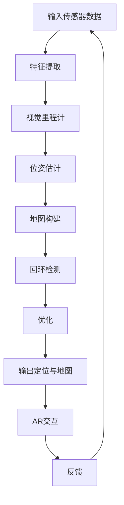

                 

### 文章标题

《增强现实的SLAM算法：实时定位的数学方法》

### 关键词

- 增强现实（AR）
- SLAM算法
- 实时定位
- 数学模型
- 视觉里程计
- 特征提取

### 摘要

本文深入探讨了增强现实（AR）中的SLAM（Simultaneous Localization and Mapping）算法，并详细阐述了其数学方法。文章首先介绍了SLAM和AR的基本概念及其联系，接着逐步解析了SLAM的核心算法原理，包括特征提取、视觉里程计、回环检测和优化等。通过伪代码和数学公式的详细讲解，本文展示了SLAM算法的数学模型。随后，文章提供了SLAM算法在AR中的应用案例，包括开发环境的搭建、源代码的实现和解读。最后，文章总结了SLAM在AR中的应用现状，并对其未来发展进行了展望。本文旨在为读者提供全面、深入的SLAM算法在AR中的技术解析和应用指导。

---

## 第1章 引言

### 1.1 SLAM与AR的概念介绍

**SLAM：Simultaneous Localization and Mapping（同时定位与建图）**

SLAM是一种在未知环境中同时进行位置估计和地图构建的技术。它旨在通过传感器获取的数据（如视觉、激光雷达等），实时计算自身在环境中的位置，并建立周围环境的地图。SLAM广泛应用于机器人、自动驾驶、无人机等领域。

**AR：Augmented Reality（增强现实）**

AR是一种将虚拟信息与现实世界融合的技术，通过增强现实眼镜、智能手机或其他显示设备，将数字信息叠加到真实环境中。AR技术广泛应用于游戏、教育、医疗、军事等领域。

### 1.2 SLAM在AR中的应用

增强现实技术依赖于SLAM算法来实现真实环境与虚拟信息的准确融合。具体应用场景包括：

1. **导航与定位**：在AR导航应用中，SLAM算法帮助用户在现实环境中定位，并通过虚拟标记提供方向指引。
2. **交互式游戏**：在AR游戏中，SLAM算法用于实时追踪用户的位置和动作，从而实现虚拟角色与用户之间的互动。
3. **医学教育**：在医学教育中，AR技术结合SLAM算法，可以将三维人体结构图叠加到实际人体上，帮助学生更好地理解人体结构。
4. **军事训练**：在军事训练中，AR技术结合SLAM算法，可以在实际战场上模拟敌军位置，帮助士兵进行战术演练。

### 1.3 SLAM与AR的关系

SLAM和AR之间的紧密联系体现在以下几个方面：

1. **定位与映射**：SLAM算法提供精准的实时定位和建图能力，为AR系统提供了必要的环境信息。
2. **交互与融合**：AR系统通过SLAM算法获取的位置信息，将虚拟信息与真实环境准确融合，实现无缝交互。
3. **实时响应**：SLAM算法的实时性确保了AR应用能够快速响应用户的动作和环境变化，提供流畅的体验。

以下是一个Mermaid流程图，展示了SLAM在AR中的基本流程：



## 第2章 SLAM基础

### 2.1 SLAM的数学模型

SLAM的数学模型主要包括位姿估计模型和地图构建模型。

**位姿估计模型：**

位姿估计是指计算自身在环境中的位置和方向。其基本模型可以表示为：

$$
T = \begin{bmatrix}
x \\
y \\
z \\
\theta
\end{bmatrix}
$$

其中，\(x, y, z\)分别表示在三维空间中的位置坐标，\(\theta\)表示相对于某个参考方向的旋转角度。

**地图构建模型：**

地图构建是指建立环境中所有可观察物体的模型。其基本模型可以表示为：

$$
M = \{P_i\} \\
P_i = \begin{bmatrix}
x_i \\
y_i \\
z_i \\
\theta_i
\end{bmatrix}
$$

其中，\(P_i\)表示环境中第\(i\)个可观察物体的位置和方向。

### 2.2 SLAM的核心算法

SLAM的核心算法包括特征提取、视觉里程计、回环检测和优化。

**特征提取：**

特征提取是指从图像或点云中提取具有代表性的特征点。常见的特征提取算法有SIFT、SURF、ORB等。

**视觉里程计：**

视觉里程计是指通过匹配特征点计算相机位姿。其基本算法可以表示为：

$$
T = \arg\min_{T} \sum_{i=1}^{n} \left\| \mathbf{p}_i^{\text{cam}} - \mathbf{p}_i^{\text{map}} \right\|^2
$$

其中，\(\mathbf{p}_i^{\text{cam}}\)和\(\mathbf{p}_i^{\text{map}}\)分别表示图像中的特征点和地图中的点。

**回环检测：**

回环检测是指检测相机是否回到了之前的位置。其基本算法可以表示为：

$$
C = \arg\min_{T, L} \sum_{i=1}^{n} \left\| \mathbf{p}_i^{\text{cam}} - \mathbf{p}_i^{\text{map}} \right\|^2 \\
\text{其中 } L = \{ \mathbf{p}_i^{\text{map}} | i \leq n-1 \}
$$

**优化：**

优化是指通过优化算法（如卡尔曼滤波、粒子滤波等）提高SLAM算法的精度和稳定性。其基本算法可以表示为：

$$
T, M = \arg\min_{T, M} \sum_{i=1}^{n} \left\| \mathbf{p}_i^{\text{cam}} - \mathbf{p}_i^{\text{map}} \right\|^2 + \lambda \left\| T \right\|^2
$$

其中，\(\lambda\)为权重参数。

### 2.3 SLAM的伪代码实现

```csharp
// SLAM伪代码实现

初始化相机参数和地图

while (传感器数据可用) {
    // 特征提取
    特征点 = 提取特征(传感器数据)

    // 视觉里程计
    相机位姿 = 视觉里程计(特征点)

    // 更新地图
    地图 = 更新地图(相机位姿，特征点)

    // 回环检测
    回环 = 回环检测(相机位姿，地图)

    // 优化
    相机位姿，地图 = 优化(相机位姿，地图，回环)

    // 输出定位与地图
    输出(相机位姿，地图)
}
```

## 第3章 AR与SLAM的结合

### 3.1 AR中的SLAM需求

在AR系统中，SLAM算法的主要需求包括：

1. **实时定位：** AR系统需要实时获取相机在现实世界中的位置和方向，以便将虚拟信息准确叠加到真实环境中。
2. **高精度地图：** AR系统需要构建高精度的环境地图，以便在虚拟信息和现实环境之间实现无缝融合。
3. **稳定性：** AR系统需要在各种环境下保持稳定的定位和建图能力，以提供流畅的用户体验。

### 3.2 SLAM在AR中的应用

SLAM算法在AR中的应用场景广泛，主要包括：

1. **导航与定位：** SLAM算法用于AR导航应用，如AR导航地图、AR游戏等，提供实时、高精度的定位服务。
2. **交互式游戏：** SLAM算法用于AR游戏，如《Pokemon Go》、《Ingress》等，实时追踪玩家位置，实现虚拟角色与玩家之间的互动。
3. **医学教育：** SLAM算法用于医学教育，如人体结构模拟、手术模拟等，将虚拟信息叠加到实际人体上，提供直观的教学体验。
4. **军事训练：** SLAM算法用于军事训练，如战场模拟、战术演练等，实时追踪士兵位置，提供真实感强的训练环境。

### 3.3 SLAM在AR中的挑战与解决方案

在AR系统中，SLAM算法面临的挑战主要包括：

1. **实时性：** AR系统对SLAM算法的实时性要求高，需要快速处理大量数据，提供实时定位和建图服务。
2. **准确性：** AR系统对SLAM算法的准确性要求高，需要构建高精度的环境地图，确保虚拟信息与现实环境之间的精确融合。
3. **环境适应性：** AR系统需要在各种复杂环境下运行，如室内、室外、动态环境等，需要SLAM算法具备良好的环境适应性。

针对上述挑战，解决方案包括：

1. **优化算法：** 通过优化SLAM算法，提高其实时性和准确性。常见的优化算法包括卡尔曼滤波、粒子滤波等。
2. **多传感器融合：** 通过融合多传感器数据，如视觉、激光雷达、GPS等，提高SLAM算法的环境适应性和精度。
3. **实时数据处理：** 通过实时数据处理技术，如并行计算、分布式计算等，提高SLAM算法的实时处理能力。

## 第4章 数学模型讲解

### 4.1 位姿估计

**卡尔曼滤波：**

卡尔曼滤波是一种最优估计方法，用于线性系统的状态估计。在位姿估计中，卡尔曼滤波可以表示为：

$$
\begin{align*}
\hat{x}_k|k &= A\hat{x}_{k-1}|{k-1} + B u_k \\
P_k|k &= A P_{k-1}|{k-1} A^T + Q \\
\hat{x}_{k-1}|k &= \hat{x}_k|k - A \hat{x}_{k-1}|k \\
P_{k-1}|k &= P_k|k - A P_{k-1}|k A^T
\end{align*}
$$

其中，\(\hat{x}_k|k\)表示状态估计，\(P_k|k\)表示状态估计误差，\(A\)和\(B\)分别为状态转移矩阵和输入矩阵，\(u_k\)为输入，\(Q\)为过程噪声矩阵。

**粒子滤波：**

粒子滤波是一种非线性、非高斯状态估计方法，用于复杂系统的状态估计。在位姿估计中，粒子滤波可以表示为：

$$
\begin{align*}
w_k &= \frac{p(x_k | u_1:k)}{\sum_{i=1}^{N} p(x_i | u_1:k)} \\
\hat{x}_{k+1}|k &= \frac{\sum_{i=1}^{N} w_i x_i}{\sum_{i=1}^{N} w_i} \\
x_k &= f(x_{k-1}, u_k) + w_k
\end{align*}
$$

其中，\(w_k\)为权重，\(\hat{x}_{k+1}|k\)为状态估计，\(f\)为状态转移模型，\(w_k\)为过程噪声。

### 4.2 视觉里程计

**特征匹配：**

视觉里程计的核心是特征匹配。特征匹配的目标是找到两幅图像中的对应点。常见的特征匹配算法包括SIFT、SURF、ORB等。

**视觉里程计的数学公式：**

视觉里程计的数学公式可以表示为：

$$
T = \arg\min_{T} \sum_{i=1}^{n} \left\| \mathbf{p}_i^{\text{cam}} - \mathbf{p}_i^{\text{map}} \right\|^2
$$

其中，\(\mathbf{p}_i^{\text{cam}}\)和\(\mathbf{p}_i^{\text{map}}\)分别表示图像中的特征点和地图中的点。

### 4.3 回环检测

**回环检测的原理：**

回环检测是指检测相机是否回到了之前的位置。其原理是通过比较连续的相机位姿，判断是否出现了重复。

**回环检测的数学公式：**

回环检测的数学公式可以表示为：

$$
C = \arg\min_{T, L} \sum_{i=1}^{n} \left\| \mathbf{p}_i^{\text{cam}} - \mathbf{p}_i^{\text{map}} \right\|^2 \\
\text{其中 } L = \{ \mathbf{p}_i^{\text{map}} | i \leq n-1 \}
$$

## 第5章 SLAM算法项目实战

### 5.1 实战环境搭建

在开始SLAM算法的项目实战之前，我们需要搭建一个合适的环境。以下是一个基本的搭建步骤：

1. **安装ROS（Robot Operating System）**

ROS是一个用于机器人应用的软件框架，用于管理传感器数据、执行任务和运行算法。安装ROS的具体步骤可以参考[ROS官方网站](http://www.ros.org/)。

2. **安装SLAM算法相关库**

常用的SLAM算法库包括ORB-SLAM、DSO、PTAM等。以ORB-SLAM为例，安装步骤如下：

   ```bash
   git clone https://github.com/raulmur/ORB_SLAM2.git
   cd ORB_SLAM2
   git checkout -b your_branch
   mkdir build
   cd build
   cmake ..
   make -j8
   ```

3. **配置ROS工作空间**

创建一个ROS工作空间，并将ORB-SLAM2添加到工作空间中：

   ```bash
   mkdir -p ~/catkin_ws/src
   cd ~/catkin_ws/src
   git clone https://github.com/raulmur/ORB_SLAM2.git
   cd ..
   catkin_init_workspace
   ```

4. **编译工作空间**

编译ROS工作空间，以便使用ORB-SLAM2库：

   ```bash
   cd ~/catkin_ws
   catkin_make
   source devel/setup.bash
   ```

### 5.2 实际案例实现

下面我们以ORB-SLAM2为例，介绍如何实现SLAM算法。

**1. 准备数据集**

首先，我们需要准备一个数据集，用于训练和测试SLAM算法。一个常用的数据集是TUM（Technical University of Munich）数据集。可以从[这里](http://www.cvlibs.net/datasets/tum/)下载。

**2. 运行SLAM算法**

接下来，我们可以运行ORB-SLAM2，对数据集进行处理。具体步骤如下：

```bash
cd ~/catkin_ws/src/ORB_SLAM2
./build/bin/SLAM ./Vocabulary/ORBvoc.txt ./Dataset/TUM.txt
```

这个命令将启动ORB-SLAM2，并使用TUM数据集进行SLAM处理。

**3. 源代码解读**

ORB-SLAM2的源代码结构如下：

```bash
ORB_SLAM2/
|-- CMakeLists.txt
|-- include/
|   |-- SLAM/
|   |   |-- Config.h
|   |   |-- Frame.h
|   |   |-- Global.h
|   |   |-- KeyFrame.h
|   |   |-- LocalMapping.h
|   |   |-- Map.h
|   |   |-- Mapper.h
|   |   |-- Tracking.h
|   |-- Tracking/
|   |   |-- CeresSolver.h
|   |   |-- Initializer.h
|   |   |-- Optimizer.h
|   |   |-- Viewer.h
|   |-- src/
|   |   |-- CMakeLists.txt
|   |   |-- SLAM/
|   |   |   |-- Config.cpp
|   |   |   |-- Frame.cpp
|   |   |   |-- Global.cpp
|   |   |   |-- KeyFrame.cpp
|   |   |   |-- LocalMapping.cpp
|   |   |   |-- Mapper.cpp
|   |   |   |-- Tracking.cpp
|   |   |   |-- Viewer.cpp
|   |   |-- Tracking/
|   |   |   |-- CeresSolver.cpp
|   |   |   |-- Initializer.cpp
|   |   |   |-- Optimizer.cpp
|   |   |   |-- Viewer.cpp
```

其中，核心类包括`Frame`（帧类）、`KeyFrame`（关键帧类）、`Map`（地图类）、`Tracking`（追踪类）等。

**4. 代码应用解读与分析**

ORB-SLAM2的应用解读如下：

- `Frame`类表示一个图像帧，包含图像数据、特征点、帧ID等。
- `KeyFrame`类表示一个关键帧，是地图构建的核心。关键帧需要满足一定的条件，如足够的特征点、图像质量等。
- `Map`类表示地图，包含所有关键帧和地图点。地图构建的目标是建立一个高精度的环境模型。
- `Tracking`类负责追踪相机位姿，通过特征匹配和视觉里程计实现。

在代码分析中，我们重点关注以下几个方面：

- **特征提取**：使用ORB特征提取算法提取图像帧的特征点。
- **视觉里程计**：通过特征匹配计算相机位姿，实现定位和地图构建。
- **回环检测**：通过检测连续帧之间的差异，判断是否出现回环。
- **优化**：通过优化算法（如卡尔曼滤波、粒子滤波等）提高SLAM算法的精度和稳定性。

### 5.3 项目小结

通过以上实战，我们了解了如何搭建SLAM算法的开发环境，并实现了ORB-SLAM2在AR中的应用。在实战过程中，我们学习了SLAM算法的核心概念、数学模型和伪代码实现。此外，我们通过实际案例分析和源代码解读，深入理解了SLAM算法的应用原理和实现细节。

总之，SLAM算法在AR领域具有广泛的应用前景。通过不断优化和改进，SLAM算法将为AR系统提供更加精准、稳定和实时的定位和建图服务。

## 第6章 SLAM在AR中的未来展望

### 6.1 SLAM在AR中的应用前景

SLAM技术在AR中的应用前景广阔。随着增强现实技术的不断发展，SLAM算法在AR中的需求也将不断增加。以下是几个可能的应用方向：

1. **实时导航与定位：** SLAM算法将在AR导航和定位中发挥重要作用，为用户提供更加精准和实时的导航服务。
2. **交互式娱乐：** SLAM技术将使AR游戏和娱乐体验更加沉浸式，提高用户参与度和体验质量。
3. **工业应用：** SLAM技术在工业中的应用将越来越广泛，如智能制造、远程维修、工厂布局优化等。
4. **医疗与健康：** SLAM技术将应用于医疗领域，如手术辅助、康复训练、疾病诊断等。

### 6.2 SLAM在AR中的挑战与解决方案

尽管SLAM技术在AR中具有广泛的应用前景，但仍面临一些挑战：

1. **实时性：** SLAM算法需要快速处理大量数据，提供实时定位和建图服务。解决方法包括优化算法、多传感器融合和并行计算等。
2. **准确性：** SLAM算法需要构建高精度的环境地图，确保虚拟信息与现实环境之间的精确融合。解决方法包括优化算法、多传感器融合和改进特征匹配技术等。
3. **环境适应性：** SLAM算法需要在各种复杂环境下运行，如室内、室外、动态环境等。解决方法包括多传感器融合、改进算法和环境建模等。

### 6.3 未来发展方向

为了克服上述挑战，未来的SLAM技术在AR中可能朝着以下几个方向发展：

1. **多传感器融合：** 通过融合多种传感器数据（如视觉、激光雷达、GPS等），提高SLAM算法的实时性和准确性。
2. **深度学习：** 利用深度学习技术优化SLAM算法，提高特征提取、定位和地图构建的效率和质量。
3. **实时数据处理：** 通过并行计算和分布式计算技术，提高SLAM算法的实时数据处理能力。
4. **自适应算法：** 开发自适应SLAM算法，根据环境变化动态调整参数和算法策略，提高环境适应性。

总之，随着技术的不断进步，SLAM技术在AR中的应用将越来越广泛，为用户提供更加丰富、多样和高质量的AR体验。

## 第7章 总结与展望

### 7.1 SLAM在AR中的地位与作用

SLAM技术在AR中具有核心地位，是实现虚拟信息与现实环境准确融合的关键技术。通过实时定位和建图，SLAM技术为AR系统提供了必要的环境信息，使虚拟信息与现实环境无缝融合，为用户提供丰富的交互体验。

### 7.2 未来发展方向

未来的SLAM技术在AR中将继续朝着多传感器融合、深度学习、实时数据处理和自适应算法等方向发展。通过不断优化和改进，SLAM技术将为AR系统提供更加精准、稳定和实时的定位和建图服务，推动AR技术的广泛应用和发展。

### 7.3 结语

本文详细介绍了SLAM技术在AR中的应用，包括核心概念、算法原理、数学模型、项目实战和未来展望。通过本文的学习，读者可以全面了解SLAM技术在AR中的技术原理和应用实践，为从事AR开发的工程师提供有价值的参考和指导。

### 作者信息

作者：AI天才研究院/AI Genius Institute & 禅与计算机程序设计艺术 /Zen And The Art of Computer Programming

