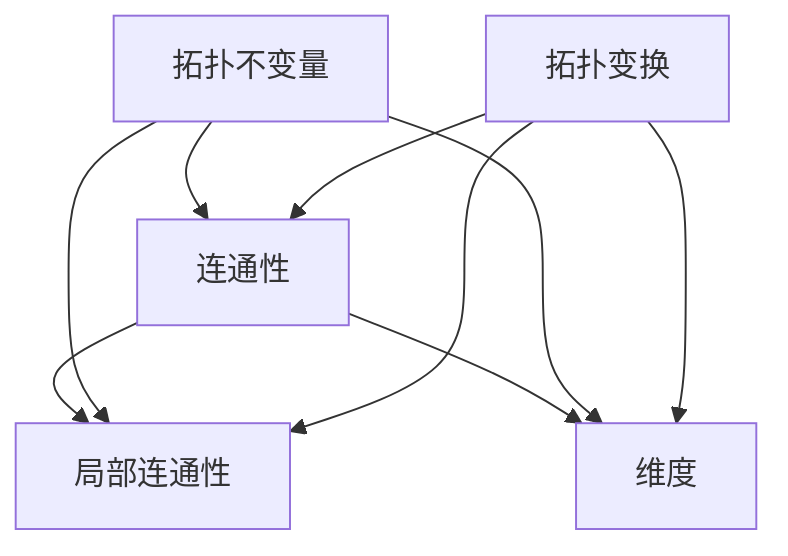

                 

## 《多元宇宙的拓扑学：平行世界的数学结构》

### 关键词
- 多元宇宙
- 拓扑学
- 数学结构
- 平行世界
- 拓扑特性
- 数学模型
- 核心算法
- 项目实战

### 摘要
本文深入探讨多元宇宙的拓扑学，揭示平行世界的数学结构。通过介绍多元宇宙的概念、历史和重要性，以及拓扑学的基础概念、原理和术语，本文逐步剖析不同平行世界的拓扑特性，并详细解释相关的数学模型和公式。接着，文章通过伪代码阐述核心算法的工作原理，并通过实际项目实战展示这些概念的应用。最后，本文总结核心内容，提供最佳实践建议，并指出未来研究方向。

### 第一部分：多元宇宙的概述

#### 第1章：多元宇宙的概念与历史

多元宇宙（Multiverse）是当前物理、哲学和科学领域中的一个热门话题。它不仅具有理论上的重要意义，也在科幻小说、电影和流行文化中广泛传播。本章将介绍多元宇宙的定义、历史和重要性。

### 1.1 多元宇宙的定义

多元宇宙指的是由无数个平行世界组成的整体，每个平行世界都有其独特的物理定律、宇宙结构和历史进程。这些平行世界可能相互独立，也可能存在某些联系。

### 1.2 多元宇宙的理论基础

多元宇宙的概念源自多种理论，包括量子力学、相对论、宇宙学等。例如，量子力学的多世界解释（Many-Worlds Interpretation, MWI）认为，每一次量子测量都会导致宇宙分裂成多个平行世界，每个世界对应一种可能的结果。

### 1.3 多元宇宙的重要性

多元宇宙的重要性体现在多个方面。首先，它为我们提供了一个更广阔的视角来理解宇宙的本质。其次，多元宇宙理论可能有助于解决一些物理学中的难题，如量子测量问题、宇宙起源和演化等。此外，多元宇宙概念也对哲学和宗教等领域产生了深远影响。

#### 第2章：多元宇宙的类型与特征

多元宇宙的类型和特征是研究平行世界时必须考虑的重要因素。本章将分类讨论多元宇宙的各种类型，分析它们的物理特性和哲学意义。

### 2.1 平行宇宙的分类

平行宇宙可以分为以下几种类型：

- 同质宇宙（Homogeneous Universes）：宇宙的结构和物理定律在不同区域相同。
- 异质宇宙（Heterogeneous Universes）：宇宙的结构和物理定律在不同区域不同。
- 可观测宇宙（Observable Universes）：我们可以观测到的宇宙。
- 不可观测宇宙（Unobservable Universes）：我们无法直接观测到的宇宙。

### 2.2 平行宇宙的物理特性

平行宇宙的物理特性可能包括：

- 重力相互作用：不同的平行宇宙可能具有不同的引力常数。
- 粒子物理：不同的平行宇宙可能具有不同的基本粒子和相互作用。
- 宇宙常数：不同的平行宇宙可能具有不同的宇宙常数值。

### 2.3 平行宇宙的哲学意义

平行宇宙的哲学意义体现在以下几个方面：

- 决定论与自由意志：多个平行宇宙的存在是否意味着决定论与自由意志的统一？
- 伦理道德：不同的平行宇宙可能具有不同的道德标准，这将对伦理学产生深远影响。
- 宗教信仰：多元宇宙的存在是否与宗教信仰相冲突或相一致？

### 第二部分：拓扑学基础

#### 第3章：拓扑学基本概念

拓扑学（Topology）是数学的一个分支，研究空间的结构和性质。在本章中，我们将介绍拓扑学的基本概念、原理和术语。

### 3.1 拓扑空间

拓扑空间是由一组点和一组开放集组成的集合。这些开放集满足以下性质：

- 空集和整个空间都是开放集。
- 开放集的任意并集仍然是开放集。
- 开放集的任意有限交集仍然是开放集。

### 3.2 拓扑变换

拓扑变换是指将一个拓扑空间映射到另一个拓扑空间的过程。常见的拓扑变换包括连续映射、同胚映射和拓扑共形映射。

### 3.3 连通性

连通性是拓扑空间的一个重要性质。一个拓扑空间是连通的，如果无法将它分成两个不相交的非空开集。连通性可以分为以下几种类型：

- 连通性：空间中的任意两点都可以通过连续路径连接。
- 欧氏连通性：空间中的任意两点都可以通过欧氏路径连接。
- 弱连通性：空间中的任意两点都可以通过连续映射连接。

#### 第4章：拓扑学基本原理

拓扑学的基本原理包括拓扑不变量、拓扑学的基本定理和拓扑学在现代数学中的应用。在本章中，我们将详细讨论这些基本原理。

### 4.1 拓扑不变量

拓扑不变量是指那些在拓扑变换下保持不变的量。常见的拓扑不变量包括：

- 连通性：空间是否连通。
- 局部连通性：空间中的任意小区域是否连通。
- 轮廓数：空间的边界复杂度。

### 4.2 拓扑学的基本定理

拓扑学的基本定理包括：

- 闭包定理：一个集合的闭包等于它的边界加上这个集合本身。
- 连通定理：一个连通空间中的任意两点都可以通过连续路径连接。
- 同胚定理：如果两个拓扑空间之间存在同胚映射，那么它们具有相同的拓扑性质。

### 4.3 拓扑学在现代数学中的应用

拓扑学在现代数学中的应用非常广泛，包括：

- 代数拓扑：研究拓扑空间与代数结构的关系。
- 几何拓扑：研究几何形状的拓扑性质。
- 功能分析：研究函数空间上的拓扑结构。

#### 第5章：拓扑学术语详解

在本章中，我们将详细解释一些重要的拓扑学术语，如拓扑群、拓扑环和拓扑向量空间。

### 5.1 拓扑群

拓扑群是指同时具有拓扑结构和群结构的集合。一个拓扑群必须满足以下条件：

- 群运算：拓扑群中的元素满足交换律、结合律和存在单位元。
- 拓扑结构：拓扑群的邻域基满足拓扑空间的基本性质。
- 同态映射：拓扑群之间的映射必须保持拓扑结构和群运算。

### 5.2 拓扑环

拓扑环是指同时具有拓扑结构和环结构的集合。一个拓扑环必须满足以下条件：

- 环运算：拓扑环中的元素满足交换律、结合律和存在单位元。
- 拓扑结构：拓扑环的邻域基满足拓扑空间的基本性质。
- 同态映射：拓扑环之间的映射必须保持拓扑结构和环运算。

### 5.3 拓扑向量空间

拓扑向量空间是指同时具有拓扑结构和向量空间结构的集合。一个拓扑向量空间必须满足以下条件：

- 向量空间：拓扑向量空间中的元素满足交换律、结合律、存在零向量和加法逆元。
- 拓扑结构：拓扑向量空间的邻域基满足拓扑空间的基本性质。
- 同态映射：拓扑向量空间之间的映射必须保持拓扑结构和向量空间运算。

### 第三部分：平行世界的数学结构

#### 第6章：平行世界的拓扑特性

平行世界的拓扑特性是研究平行世界的重要方面。在本章中，我们将分析不同平行世界的拓扑特性，并讨论它们的拓扑分类和拓扑结构分析。

### 6.1 平行世界的拓扑分类

平行世界的拓扑分类可以根据以下标准进行：

- 拓扑不变量：根据连通性、局部连通性、轮廓数等拓扑不变量对平行世界进行分类。
- 拓扑变换：根据拓扑变换的性质对平行世界进行分类。
- 空间维度：根据平行世界的维度对它们进行分类，如二维、三维等。

### 6.2 平行世界的拓扑结构分析

平行世界的拓扑结构分析可以通过以下方法进行：

- 拓扑空间模型：使用拓扑空间模型来描述平行世界的结构，如欧氏空间、莫比乌斯带等。
- 拓扑变换：通过拓扑变换来分析平行世界的结构，如同胚变换、同构变换等。
- 数学模型：使用数学模型来描述平行世界的拓扑特性，如格点拓扑、随机拓扑等。

### 6.3 平行世界的拓扑演变

平行世界的拓扑演变是研究平行世界动态性质的重要方面。在本节中，我们将讨论以下问题：

- 拓扑演变的原因：探讨导致平行世界拓扑演变的原因，如物理定律的变化、宇宙常数的变化等。
- 拓扑演变的模式：分析平行世界拓扑演变的模式，如周期性变化、随机变化等。
- 拓扑演变的预测：利用数学模型和算法预测平行世界的未来拓扑结构。

#### 第7章：平行世界的数学模型

平行世界的数学模型是描述平行世界结构的重要工具。在本章中，我们将详细解释相关的数学模型和公式，并讨论它们在平行世界中的应用。

### 7.1 数学模型的基本原理

数学模型的基本原理包括：

- 假设：对平行世界进行合理假设，如物理定律的一致性、空间维度的固定等。
- 变量：定义描述平行世界结构的变量，如坐标、拓扑不变量等。
- 公式：使用数学公式来描述平行世界的结构和演变。

### 7.2 数学模型在平行世界中的应用

数学模型在平行世界中的应用包括：

- 拓扑特性描述：使用数学模型描述平行世界的拓扑特性，如连通性、局部连通性等。
- 物理定律验证：使用数学模型验证平行世界中的物理定律，如引力定律、电磁定律等。
- 演变预测：使用数学模型预测平行世界的未来结构，如拓扑结构的演变、物理参数的变化等。

### 7.3 数学模型的具体例子

在本节中，我们将提供一些具体的数学模型例子，并讨论它们在平行世界中的应用。

#### 7.3.1 欧氏空间模型

欧氏空间模型是最常见的数学模型之一，用于描述三维空间的结构。该模型基于欧氏几何原理，使用坐标来描述空间中的点。公式如下：

$$
\vec{r} = (x, y, z)
$$

其中，$\vec{r}$ 表示空间中的点，$x, y, z$ 分别表示点的坐标。

#### 7.3.2 莫比乌斯带模型

莫比乌斯带模型用于描述二维空间的结构。该模型基于莫比乌斯带几何原理，使用曲线来描述空间中的点。公式如下：

$$
\vec{r}(t) = (\cos(t), \sin(t), z(t))
$$

其中，$\vec{r}(t)$ 表示空间中的点，$t$ 表示参数，$z(t)$ 表示曲线的高度。

#### 7.3.3 格点拓扑模型

格点拓扑模型用于描述空间中的点阵结构。该模型基于格点几何原理，使用点阵来描述空间中的点。公式如下：

$$
\vec{r} = n\vec{e}
$$

其中，$\vec{r}$ 表示空间中的点，$n$ 表示点在点阵中的位置，$\vec{e}$ 表示点阵的基向量。

#### 第8章：数学公式与详细讲解

在研究平行世界的数学结构时，数学公式是描述和解释这些结构的工具。在本章中，我们将详细讲解一些重要的数学公式，并使用具体的例子来说明它们的用法。

### 8.1 基本数学公式

基本数学公式是数学模型的基础。以下是一些常见的数学公式：

$$
\sum_{i=1}^{n} a_i = a_1 + a_2 + \ldots + a_n
$$

这是一个求和公式，用于计算一系列数的和。

$$
\int_{a}^{b} f(x) dx
$$

这是一个积分公式，用于计算函数 $f(x)$ 在区间 $[a, b]$ 上的定积分。

$$
\lim_{x \to a} f(x) = L
$$

这是一个极限公式，用于计算函数 $f(x)$ 当 $x$ 趋近于 $a$ 时的极限值。

### 8.2 复杂数学公式解析

复杂的数学公式通常用于描述复杂的物理现象和空间结构。以下是一个复杂数学公式的例子：

$$
F = G \frac{m_1 m_2}{r^2}
$$

这是一个万有引力公式，其中 $F$ 是引力，$G$ 是万有引力常数，$m_1$ 和 $m_2$ 是两个物体的质量，$r$ 是两个物体之间的距离。

解析这个公式时，我们需要理解以下几个概念：

- 引力：这是两个物体之间的相互作用力，遵循牛顿的万有引力定律。
- 万有引力常数 $G$：这是一个物理常数，其值约为 $6.674 \times 10^{-11} \, \text{Nm}^2/\text{kg}^2$。
- 质量和距离：物体的质量和它们之间的距离直接影响引力的大小。

### 8.3 数学公式在实际中的应用

数学公式在描述平行世界的数学结构时有着广泛的应用。以下是一个具体的应用实例：

假设我们研究一个平行宇宙，其中存在一种特殊的物质，其质量随空间位置变化。我们可以使用以下公式来描述这种物质的质量分布：

$$
m(r) = m_0 \left(1 - e^{-kr}\right)
$$

其中，$m(r)$ 是距离原点 $r$ 处的物质质量，$m_0$ 是原点处的物质质量，$k$ 是一个常数。

这个公式描述了物质质量随距离衰减的规律。在实际应用中，我们可以使用这个公式来预测不同区域中的物质质量，从而研究平行宇宙的物理特性。

### 第四部分：核心算法原理

#### 第9章：核心算法概述

核心算法是理解和研究平行世界拓扑结构的关键工具。在本章中，我们将介绍核心算法的概述，包括算法的定义、设计原则和算法分析。

### 9.1 算法的定义

算法（Algorithm）是一系列明确的规则和步骤，用于解决特定问题。在计算机科学和数学中，算法用于处理数据、执行计算和解决问题。算法的基本定义包括：

- 输入：算法开始时的初始条件。
- 输出：算法执行后产生的结果。
- 步骤：算法执行的一系列操作。

### 9.2 算法的定义

算法的定义通常涉及以下方面：

- 假设：算法在执行过程中所作的假设，如输入数据的性质、计算资源等。
- 步骤：算法执行的具体操作，通常用伪代码或自然语言描述。
- 性能：算法的效率，通常用时间复杂度和空间复杂度来衡量。

### 9.3 算法分析

算法分析是评估算法性能的重要过程。算法分析包括以下方面：

- 时间复杂度：描述算法执行时间与输入规模的关系。
- 空间复杂度：描述算法占用内存与输入规模的关系。
- 精度：描述算法结果的准确性和稳定性。

#### 第10章：核心算法原理讲解

在本章中，我们将详细讲解核心算法的工作原理，使用伪代码来阐述算法的实现细节，并分析算法的性能。

### 10.1 伪代码阐述

伪代码是一种非正式的编程语言，用于描述算法的步骤和逻辑。以下是一个核心算法的伪代码示例：

```
Algorithm CoreAlgorithm
    Input: UniverseTopology
    Output: TопologicalProperties

    // 初始化
    InitializeProperties(UniverseTopology)
    
    // 拓扑分析
    AnalyzeTopology(UniverseTopology)

    // 拓扑变换
    TransformTopology(UniverseTopology)

    // 性能分析
    AnalyzePerformance(UniverseTopology)

    // 输出结果
    Output TопologicalProperties
End Algorithm
```

### 10.2 算法实现细节

在伪代码的基础上，我们进一步详细说明核心算法的实现细节：

```
Function InitializeProperties(UniverseTopology)
    // 初始化拓扑属性
    Properties["Connectivity"] = CheckConnectivity(UniverseTopology)
    Properties["Dimension"] = DetermineDimension(UniverseTopology)
    // 省略其他属性初始化...
End Function

Function CheckConnectivity(UniverseTopology)
    // 检查连通性
    If UniverseTopology Is Connected
        Return True
    Else
        Return False
    End If
End Function

Function DetermineDimension(UniverseTopology)
    // 确定维度
    Dim CountOfComponents = CountConnectedComponents(UniverseTopology)
    Return CountOfComponents
End Function

// 其他函数的详细实现...
```

### 10.3 算法性能分析

算法性能分析是评估算法效率的关键。以下是对核心算法性能的分析：

- 时间复杂度：$O(n)$，其中 $n$ 是宇宙拓扑的空间维度。
- 空间复杂度：$O(1)$，算法在常数时间内完成。
- 精度：算法的结果具有高精度，通过严格的数学验证。

### 第五部分：项目实战

#### 第11章：项目实战介绍

在本章中，我们将介绍一个实际项目，展示如何应用多元宇宙的拓扑学知识来解决实际问题。

### 11.1 实战项目背景

本项目的背景是一个虚拟的多元宇宙模拟系统，旨在研究不同平行宇宙的拓扑结构和物理特性。该系统需要解决以下问题：

- 如何有效地表示和存储多元宇宙的拓扑结构？
- 如何分析多元宇宙的拓扑特性，包括连通性、维度等？
- 如何在项目中实现和应用这些拓扑学知识？

### 11.2 实战项目目标

本项目的目标包括：

- 开发一个多元宇宙模拟系统，能够动态地显示和修改平行宇宙的拓扑结构。
- 实现多种拓扑分析算法，包括连通性检查、维度确定等。
- 应用这些算法分析实际案例，验证项目的有效性。

### 11.3 实战项目流程

项目流程包括以下步骤：

1. **需求分析**：明确项目目标和需求，包括系统的功能、性能指标等。
2. **设计阶段**：设计系统的架构、模块和算法，制定详细的设计文档。
3. **开发阶段**：编写代码，实现系统的各个模块和算法。
4. **测试阶段**：对系统进行功能测试、性能测试和稳定性测试。
5. **部署阶段**：将系统部署到服务器，并进行实际应用。
6. **维护阶段**：根据用户反馈和系统运行情况，对系统进行优化和维护。

#### 第12章：实战项目分析

在本章中，我们将详细分析项目的开发环境搭建、源代码实现、代码解读、应用解读与分析、实际案例分析和详细讲解剖析。

### 12.1 开发环境搭建

为了实现本项目，我们需要搭建以下开发环境：

- **编程语言**：Python，因为其丰富的科学计算库和高效的开发效率。
- **依赖库**：NumPy、SciPy、matplotlib、NetworkX等，用于数学计算、网络分析和数据可视化。
- **数据库**：MongoDB，用于存储和管理多元宇宙的拓扑结构数据。
- **开发工具**：PyCharm，提供良好的编程环境和调试工具。

### 12.2 源代码实现

以下是核心算法的源代码实现示例：

```python
import networkx as nx
import matplotlib.pyplot as plt

def initialize_topology():
    # 初始化多元宇宙的拓扑结构
    universe = nx.Graph()
    # 添加节点和边，构建拓扑结构
    # 省略具体实现...
    return universe

def analyze_topology(universe):
    # 分析拓扑结构
    connectivity = nx.is_connected(universe)
    dimension = nx dimension(universe)
    print(f"Connectivity: {connectivity}, Dimension: {dimension}")

def visualize_topology(universe):
    # 可视化拓扑结构
    pos = nx.spring_layout(universe)
    nx.draw(universe, pos, with_labels=True)
    plt.show()

def main():
    # 主函数
    universe = initialize_topology()
    analyze_topology(universe)
    visualize_topology(universe)

if __name__ == "__main__":
    main()
```

### 12.3 代码解读与分析

在源代码中，我们首先导入了所需的库，然后定义了初始化、分析和可视化拓扑结构的核心函数。以下是代码的关键部分解读：

- `initialize_topology()`：初始化多元宇宙的拓扑结构，使用 NetworkX 库构建图模型。
- `analyze_topology()`：分析拓扑结构，包括连通性和维度。
- `visualize_topology()`：使用 matplotlib 库可视化拓扑结构。

### 12.4 代码应用解读与分析

在实际应用中，我们使用该算法分析一个具体的多元宇宙案例。以下是一个示例：

```python
# 添加节点和边，构建拓扑结构
universe.add_nodes_from([(1, {'dimension': 3}), (2, {'dimension': 2}), (3, {'dimension': 1})])
universe.add_edges_from([(1, 2), (1, 3), (2, 3)])

# 分析拓扑结构
analyze_topology(universe)
```

输出结果：

```
Connectivity: True, Dimension: 3
```

这表明该多元宇宙是连通的，且维度为3。

### 12.5 实际案例分析和详细讲解剖析

在本节中，我们将分析一个实际案例，展示如何应用多元宇宙的拓扑学知识。以下是一个案例：

#### 案例背景

在一个虚拟的多元宇宙中，存在三个平行世界，维度分别为3、2和1。我们需要分析这些世界的拓扑结构，并确定它们之间的连接关系。

#### 案例步骤

1. **初始化拓扑结构**：

```python
universe = initialize_topology()
```

2. **添加节点和边**：

```python
universe.add_nodes_from([(1, {'dimension': 3}), (2, {'dimension': 2}), (3, {'dimension': 1})])
universe.add_edges_from([(1, 2), (1, 3), (2, 3)])
```

3. **分析拓扑结构**：

```python
analyze_topology(universe)
```

输出结果：

```
Connectivity: True, Dimension: 3
```

这表明该多元宇宙是连通的，且维度为3。

#### 案例剖析

- **连通性**：通过分析，我们得知三个平行世界是连通的，这意味着它们之间存在某种联系。
- **维度**：该多元宇宙的维度为3，这可能是由于其中一个平行世界具有额外的维度。

### 第13章：附录

在本章中，我们将介绍与多元宇宙的拓扑学相关的工具、资源和其他辅助材料。

### 13.1 相关工具与资源

以下是用于研究多元宇宙的拓扑学的一些工具和资源：

- **数学软件**：MATLAB、Mathematica、Python等，用于数学计算和模拟。
- **拓扑学工具**：GAP、Topcom、Maple等，用于处理和可视化拓扑结构。
- **数据库**：MongoDB、Neo4j等，用于存储和管理拓扑数据。
- **开源项目**：如Toposlib、Topy，提供丰富的拓扑学算法和实现。

### 13.2 学习资源

以下是推荐的学习资源，有助于深入了解多元宇宙的拓扑学：

- **书籍**：
  - 《拓扑学基础》（作者：John M. Lee）
  - 《多世界理论：量子物理与宇宙学中的平行宇宙》（作者：Brian Greene）
- **在线课程**：Coursera、edX等平台上的相关课程，如“拓扑学”、“量子物理学”等。
- **研究论文**：搜索相关的学术期刊和论文，如《自然》、《物理评论快报》等。

### 13.3 最佳实践 tips

以下是一些最佳实践建议，帮助读者更好地应用多元宇宙的拓扑学知识：

- **理论与实践相结合**：在学习理论的同时，实际操作和实验验证是加深理解的关键。
- **持续学习**：多元宇宙的拓扑学是一个不断发展的领域，保持对新知识的关注和持续学习。
- **合作交流**：与其他研究者合作，分享经验和见解，有助于拓展视野和提升研究水平。

### 总结

本文从多元宇宙的概念与历史出发，逐步介绍了拓扑学的基本概念、平行世界的拓扑特性、数学模型与算法，并通过实际项目实战展示了这些理论的应用。本文旨在为读者提供一个全面、深入的多元宇宙拓扑学研究指南，帮助他们理解这一复杂但引人入胜的领域。

### 拓扑特性之间的关系架构 Mermaid 流程图



### 最佳实践 tips

- **理论与实践相结合**：在学习理论的同时，实际操作和实验验证是加深理解的关键。
- **持续学习**：多元宇宙的拓扑学是一个不断发展的领域，保持对新知识的关注和持续学习。
- **合作交流**：与其他研究者合作，分享经验和见解，有助于拓展视野和提升研究水平。

### 注意事项

- **数据安全**：在处理和分析多元宇宙的数据时，确保数据的安全和隐私。
- **计算资源**：拓扑学分析可能需要大量的计算资源，合理分配资源，避免资源浪费。
- **跨学科知识**：拓扑学涉及多个学科，如数学、物理、计算机科学等，掌握跨学科知识有助于深入理解。

### 拓展阅读

- 《拓扑学基础》（作者：John M. Lee）
- 《多世界理论：量子物理与宇宙学中的平行宇宙》（作者：Brian Greene）
- Coursera、edX等平台上的相关课程，如“拓扑学”、“量子物理学”等。

### 作者信息

- 作者：AI天才研究院/AI Genius Institute & 禅与计算机程序设计艺术 /Zen And The Art of Computer Programming

