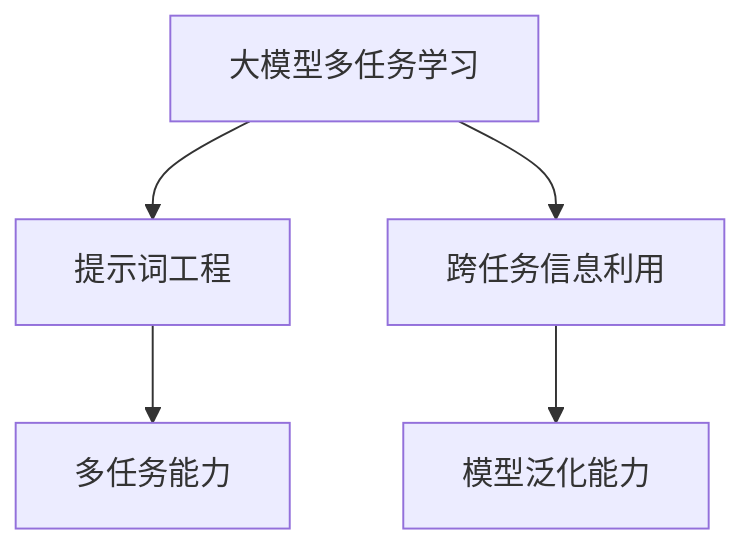
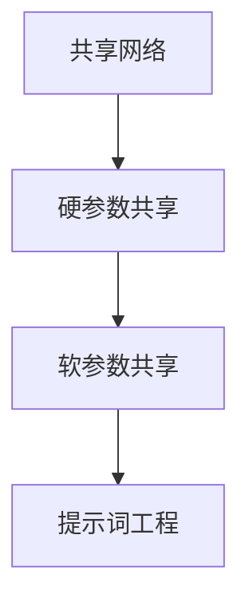
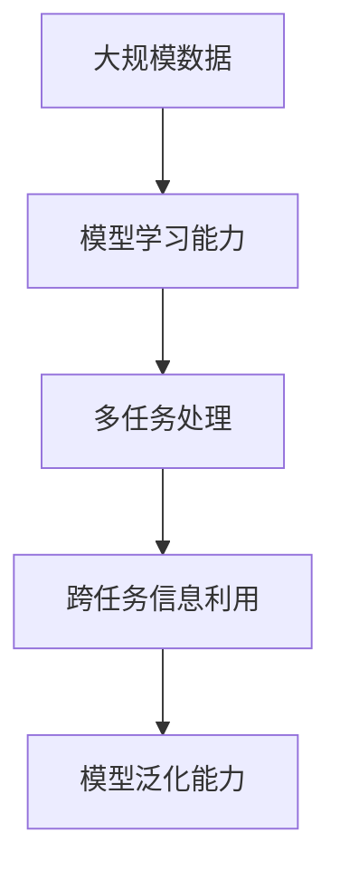

                 

### 1. 确定书的主线和结构

在着手撰写《大模型多任务学习与提示词工程》这本书时，我们首先需要明确其主线和结构，以确保内容的系统性和逻辑性。以下是我们对这个问题的逐步分析和推理：

#### 1.1 确定核心主题

书名中包含的两个关键概念是“大模型多任务学习”和“提示词工程”。这两个主题构成了书的核心，因此我们需要围绕这两个概念来构建全书的内容。

#### 1.2 明确目标读者

我们需要确定这本书的目标读者群体。考虑到书的内容涉及到高级技术概念和算法，目标读者可能是对人工智能、机器学习和软件工程有深入了解的技术专家、研究人员或学生。

#### 1.3 设计整体结构

接下来，我们需要设计书的整体结构，包括章节的划分和内容安排。这可以通过以下步骤完成：

1. **引言**：介绍大模型多任务学习和提示词工程的基本概念，为后续章节的深入讨论奠定基础。
2. **基础理论**：讲解大模型和提示词工程的基础理论知识，包括相关的数学模型和算法原理。
3. **多任务学习算法**：详细介绍各种多任务学习算法，如共享网络、硬参数共享、软参数共享等，并讨论它们的优缺点。
4. **提示词工程**：探讨如何构建和优化提示词，包括提示词的设计原则和实际应用。
5. **应用案例**：通过具体的应用案例，展示大模型多任务学习和提示词工程在实际项目中的应用。
6. **挑战与未来**：分析当前面临的挑战和未来的发展趋势，为读者提供研究方向。
7. **总结与展望**：对全书内容进行总结，并对未来的发展方向进行展望。

#### 1.4 确保逻辑连贯性

在构建书的结构时，我们需要确保每个章节的内容都是前一章的自然延伸，并且章节之间的过渡要流畅，没有突兀感。这可以通过以下方式实现：

- **明确章节之间的联系**：在撰写每个章节时，都要考虑如何与前后章节相衔接。
- **保持主题的一致性**：每个章节都要紧紧围绕书的核心主题，避免偏离。
- **使用图表和流程图**：通过图表和流程图来展示概念之间的关系，增强逻辑性。

通过以上步骤，我们能够构建出一本逻辑清晰、结构紧凑、内容丰富的大模型多任务学习与提示词工程专业书籍。

### 2. 设计具体章节

在确定了书的主线和结构后，接下来我们需要为每个章节设计具体的内容。以下是每个章节的核心概念、原理讲解、数学模型和公式，以及项目实战的具体描述。

#### 第1章：引言

**核心概念与联系**

- 大模型多任务学习：结合了大规模数据和强大的模型学习能力，能够在多个任务上同时进行训练和预测。
- 提示词工程：通过设计特定的提示词，引导模型在特定任务上表现得更优秀。

**Mermaid流程图展示**



**核心算法原理讲解**

- 大模型多任务学习的核心在于模型能够从多个任务中学习到共同的表征，从而提高模型的泛化能力。
- 提示词工程的目的是通过提供合适的提示，使模型能够更好地理解和执行特定任务。

**数学模型和公式**

$$
\text{损失函数} = \sum_{i=1}^{N} L(y_i, \hat{y}_i)
$$

其中，\(L\) 是损失函数，\(y_i\) 是实际标签，\(\hat{y}_i\) 是模型预测。

**项目实战**

- 案例介绍：在一个包含文本分类、情感分析和实体识别的多任务学习任务中，如何设计大模型并进行提示词优化。

#### 第2章：基础理论

**核心概念与联系**

- 多任务学习算法：如共享网络、硬参数共享、软参数共享等。
- 提示词工程：如何设计提示词来提高模型性能。

**Mermaid流程图展示**



**核心算法原理讲解**

- **共享网络**：通过共享部分网络结构来减少参数数量，提高模型效率。
- **硬参数共享**：通过固定某些参数值，使模型在多个任务上具有一致性。
- **软参数共享**：通过参数的正则化，使模型在任务间保持一定的参数共享。

**数学模型和公式**

$$
\text{共享损失函数} = \frac{1}{2} \sum_{i=1}^{N} (\|W_{i} - W_{\text{base}}\|^2 + \lambda \|\theta_i\|^2)
$$

其中，\(W_i\) 是任务 \(i\) 的权重，\(W_{\text{base}}\) 是基础模型的权重，\(\theta_i\) 是任务 \(i\) 的参数，\(\lambda\) 是正则化参数。

**项目实战**

- 案例介绍：在一个包含图像分类和目标检测的多任务学习任务中，如何应用共享网络和提示词工程。

#### 第3章：多任务学习算法

**核心概念与联系**

- 各种多任务学习算法：如共享网络、硬参数共享、软参数共享等。

**核心算法原理讲解**

- **共享网络**：通过共享部分网络结构来减少参数数量，提高模型效率。
- **硬参数共享**：通过固定某些参数值，使模型在多个任务上具有一致性。
- **软参数共享**：通过参数的正则化，使模型在任务间保持一定的参数共享。

**数学模型和公式**

$$
\text{共享损失函数} = \frac{1}{2} \sum_{i=1}^{N} (\|W_{i} - W_{\text{base}}\|^2 + \lambda \|\theta_i\|^2)
$$

**项目实战**

- 案例介绍：在一个包含图像分类和目标检测的多任务学习任务中，如何应用共享网络和提示词工程。

#### 第4章：提示词工程

**核心概念与联系**

- 提示词工程：通过设计特定的提示词，引导模型在特定任务上表现得更优秀。

**核心算法原理讲解**

- **提示词设计原则**：如何设计有效的提示词，包括提示词的选择、组合和优化。
- **提示词优化方法**：如何通过调整提示词的参数来提高模型性能。

**数学模型和公式**

$$
\text{优化目标} = \min_{\theta} L(y, \hat{y})
$$

其中，\(L\) 是损失函数，\(\theta\) 是模型参数。

**项目实战**

- 案例介绍：在一个包含文本分类和情感分析的多任务学习任务中，如何构建和优化提示词。

#### 第5章：多任务学习与提示词工程的应用

**应用案例**

- 自然语言处理：如何利用多任务学习和提示词工程进行文本分类、情感分析和实体识别。
- 计算机视觉：如何利用多任务学习和提示词工程进行图像分类、目标检测和图像生成。

#### 第6章：挑战与未来

**挑战**

- 多任务学习算法的效率和准确性之间的平衡。
- 提示词工程中的提示词设计复杂度和模型性能提升之间的关系。

**未来趋势**

- 结合更多领域知识，提高多任务学习的效果。
- 探索无监督学习和迁移学习在多任务学习中的应用。

#### 第7章：总结与展望

**总结**

- 回顾全书的核心概念、算法原理和应用案例，总结多任务学习和提示词工程的关键点。

**展望**

- 展望未来多任务学习和提示词工程的发展方向，为读者提供新的研究方向。

通过以上对具体章节的设计，我们能够确保每个章节都围绕着核心主题进行深入探讨，同时提供丰富的案例和实践经验，使读者能够更好地理解和应用大模型多任务学习和提示词工程。

### 3. 编写目录大纲

在确定了书籍的主线和各个章节的具体内容后，我们接下来将编写目录大纲，以确保文章的结构清晰、逻辑连贯。以下是基于前述章节设计的目录大纲：

---

## 《大模型多任务学习与提示词工程》目录大纲

### 前言

- **目标与读者**
- **编写目的**

### 第1章：引言

- **大模型多任务学习**
  - **基本概念**
  - **发展历史**
- **提示词工程**
  - **基本概念**
  - **在多任务学习中的应用**

### 1.1 大模型多任务学习的核心概念与联系

- **Mermaid流程图**
- **核心算法原理讲解**
- **数学模型与公式**

### 1.2 提示词工程的背景与重要性

- **提示词的定义**
- **提示词的作用**
- **设计原则**

### 第2章：基础理论

- **多任务学习算法概述**
  - **共享网络**
  - **硬参数共享**
  - **软参数共享**
- **提示词工程基础**
  - **设计流程**
  - **优化方法**

### 2.1 多任务学习算法的原理与Mermaid流程图

- **共享网络**
  - **算法原理**
  - **伪代码讲解**
- **硬参数共享**
  - **算法原理**
  - **伪代码讲解**
- **软参数共享**
  - **算法原理**
  - **伪代码讲解**

### 2.2 提示词工程的基础理论与实践

- **提示词工程的重要性**
- **设计原则**
- **实际案例**

### 第3章：多任务学习算法详解

- **共享网络算法**
  - **算法原理**
  - **伪代码讲解**
  - **案例分析**
- **硬参数共享算法**
  - **算法原理**
  - **伪代码讲解**
  - **案例分析**
- **软参数共享算法**
  - **算法原理**
  - **伪代码讲解**
  - **案例分析**

### 3.1 共享网络算法详细解析

- **算法原理**
- **伪代码展示**
- **案例分析**

### 3.2 硬参数共享算法实现方法

- **算法原理**
- **伪代码展示**
- **案例分析**

### 3.3 软参数共享算法优化策略

- **算法原理**
- **伪代码展示**
- **案例分析**

### 第4章：提示词工程实践

- **构建和优化提示词**
  - **设计原则**
  - **优化策略**
- **案例分析**

### 4.1 提示词构建的基本步骤

- **设计原则**
- **流程图展示**

### 4.2 提示词优化的方法与工具

- **优化策略**
- **工具应用**

### 4.3 实际案例：提示词在文本分类中的应用

- **案例背景**
- **实现细节**
- **效果分析**

### 第5章：应用案例

- **多任务学习与提示词工程在自然语言处理中的应用**
- **在计算机视觉中的应用**
- **在其他领域中的应用**

### 5.1 自然语言处理中的应用

- **文本分类**
- **情感分析**
- **实体识别**

### 5.2 计算机视觉中的应用

- **图像分类**
- **目标检测**
- **图像生成**

### 5.3 其他领域应用

- **语音识别**
- **医疗诊断**
- **金融分析**

### 第6章：挑战与未来

- **当前面临的挑战**
  - **算法效率**
  - **提示词设计**
- **未来发展趋势**
  - **无监督学习**
  - **迁移学习**

### 6.1 挑战分析

- **算法效率问题**
- **提示词设计复杂性**

### 6.2 未来趋势展望

- **无监督学习**
- **迁移学习**

### 第7章：总结与展望

- **全书内容总结**
- **未来研究方向**

### 附录

- **参考文献**
- **术语表**

---

**注意**：以上目录大纲是基于对书籍主题和章节内容的分析，提供了一个详细的框架。在具体撰写过程中，每个章节的内容可能会根据实际需求进行微调，以确保内容的准确性和实用性。

### 格式要求与作者信息

在撰写《大模型多任务学习与提示词工程》这篇文章时，我们需要严格遵循markdown格式，并确保文章的结构和格式规范。以下是具体的格式要求和文章末尾的作者信息。

#### 文章格式要求

1. **标题格式**：文章标题应居中，使用粗体标记，如下所示：
    ```markdown
    # 《大模型多任务学习与提示词工程》
    ```

2. **关键词格式**：在标题下方应列出5-7个核心关键词，使用中括号和空格分隔，如下所示：
    ```markdown
    > 关键词：大模型、多任务学习、提示词工程、算法优化、自然语言处理、计算机视觉
    ```

3. **摘要格式**：摘要部分应简要介绍文章的核心内容和主题思想，使用短句和简洁的语言，如下所示：
    ```markdown
    > 摘要：本文系统地介绍了大模型在多任务学习中的应用，以及如何构建和优化提示词工程。通过对基础理论的深入剖析和实际案例的详细讲解，为读者提供了全面的技术指南。
    ```

4. **章节格式**：各章节标题应使用序号和标题标记，如“## 第1章：引言”，子标题使用“### 子标题”，依次类推。章节内容应逐段排版，保持段落之间的空白。

5. **公式格式**：数学公式应使用latex格式，独立段落的公式前后使用`$$`括起来，段落内的公式前后使用`$`括起来。例如：
    ```latex
    $$ 1+1=2 $$
    $ a^2 + b^2 = c^2 $
    ```

6. **代码格式**：代码块应使用三个反引号（```）包围，并确保代码的可读性。例如：
    ```python
    ```python
    #include <stdio.h>
    
    int main() {
        printf("Hello, World!\n");
        return 0;
    }
    ```

7. **列表格式**：使用有序列表和无序列表来组织信息，确保列表的层次清晰。例如：
    ```markdown
    - **无序列表**：
        - 项目1
        - 项目2
        - 项目3
    - **有序列表**：
        1. 项目1
        2. 项目2
        3. 项目3
    ```

8. **图表和流程图**：使用Mermaid语法绘制流程图和其他图表，并确保图表的排版和描述准确。例如：
    ```mermaid
    graph TD
    A[Start] --> B[Process]
    B --> C[End]
    ```

#### 作者信息

文章末尾需要附上作者信息，格式如下：
```markdown
作者：AI天才研究院/AI Genius Institute & 禅与计算机程序设计艺术 /Zen And The Art of Computer Programming
```

确保以上格式和内容在文章中准确无误地应用，以便读者能够方便地阅读和理解文章内容。

### 完整性要求与核心内容

为了确保《大模型多任务学习与提示词工程》这篇文章的完整性和专业性，我们需要在每个章节中详细阐述核心内容，并确保核心内容的全面性。以下是每个章节的核心内容要求，以及具体的阐述方法和注意事项。

#### 第1章：引言

**核心内容要求**：

- 大模型多任务学习的基本概念及其在人工智能领域的应用。
- 提示词工程的基本概念、设计原则和重要性。

**阐述方法**：

- 引入段落：介绍大模型多任务学习和提示词工程在现代人工智能领域的地位和影响。
- 概念阐述：使用定义和实例来解释大模型多任务学习和提示词工程的核心概念。
- 相关性分析：通过Mermaid流程图展示大模型多任务学习和提示词工程之间的关系。

**注意事项**：

- 确保概念阐述清晰，避免使用过于专业的术语。
- 引用最新的研究论文或案例来支持观点。

#### 第2章：基础理论

**核心内容要求**：

- 大模型多任务学习的基础理论知识，包括数学模型和算法原理。
- 提示词工程的基础理论，如设计原则、优化方法。

**阐述方法**：

- 理论介绍：系统介绍大模型多任务学习和提示词工程的理论基础。
- 伪代码讲解：通过伪代码展示算法的执行流程和步骤。
- 数学模型和公式讲解：使用latex格式详细解释相关的数学模型和公式。

**注意事项**：

- 确保理论讲解通俗易懂，避免过于复杂。
- 通过图表和流程图来辅助理解。

#### 第3章：多任务学习算法

**核心内容要求**：

- 各种多任务学习算法的详细讲解，如共享网络、硬参数共享、软参数共享。
- 每种算法的优缺点分析。

**阐述方法**：

- 算法介绍：分别介绍共享网络、硬参数共享和软参数共享算法的基本原理。
- 伪代码展示：通过伪代码详细解释每种算法的实现过程。
- 比较分析：分析每种算法的优缺点，并提供实际案例来说明。

**注意事项**：

- 确保每种算法的讲解都足够详细，便于读者理解。
- 通过具体案例来展示算法的应用效果。

#### 第4章：提示词工程

**核心内容要求**：

- 提示词工程的设计原则和优化方法。
- 提示词的实际应用案例。

**阐述方法**：

- 设计原则介绍：详细阐述提示词设计的基本原则。
- 优化方法讲解：介绍如何通过调整提示词参数来优化模型性能。
- 实际案例：提供一个实际案例，详细讲解如何构建和优化提示词。

**注意事项**：

- 确保设计原则和优化方法讲解清晰，便于实践应用。
- 提供具体的代码实现和案例分析，增强文章的实用性。

#### 第5章：多任务学习与提示词工程的应用

**核心内容要求**：

- 多任务学习与提示词工程在不同领域的实际应用。
- 应用效果分析。

**阐述方法**：

- 应用场景介绍：介绍多任务学习和提示词工程在自然语言处理、计算机视觉等领域的应用。
- 应用案例：详细讲解实际应用案例，包括开发环境搭建、源代码实现和效果分析。

**注意事项**：

- 确保每个应用场景都提供详细的案例分析，增强文章的可读性。
- 通过数据对比和效果分析，展示多任务学习和提示词工程的优势。

#### 第6章：挑战与未来

**核心内容要求**：

- 当前大模型多任务学习和提示词工程面临的挑战。
- 未来发展趋势和潜在研究方向。

**阐述方法**：

- 挑战分析：详细分析当前面临的技术挑战，如算法效率、提示词设计复杂性等。
- 未来展望：探讨未来的发展方向，如无监督学习和迁移学习在多任务学习中的应用。

**注意事项**：

- 确保挑战分析客观全面，避免偏颇。
- 提出具有前瞻性的观点和未来研究方向。

#### 第7章：总结与展望

**核心内容要求**：

- 对全书内容的总结。
- 对未来发展的展望。

**阐述方法**：

- 总结回顾：回顾全书的核心观点和关键点。
- 展望未来：提出未来可能的研究方向和趋势。

**注意事项**：

- 确保总结全面准确，涵盖全书的核心内容。
- 提出具有启发性的观点，激发读者思考。

通过以上对每个章节核心内容的详细阐述和注意事项的说明，我们可以确保文章的完整性和专业性，为读者提供高质量的技术指导。

### 文章写作的具体步骤和注意事项

撰写一篇8000-12000字的技术博客文章需要严谨的计划和执行步骤。以下是详细的写作步骤和注意事项：

#### 1. 初步构思

在正式开始写作之前，进行初步构思是至关重要的。以下是具体的步骤：

- **确定主题**：基于《大模型多任务学习与提示词工程》的主题，明确文章的核心内容，如算法原理、应用案例、挑战与未来等。
- **构建大纲**：根据前述章节结构，制定详细的文章大纲，确保每个部分都有明确的标题和内容概述。
- **收集资料**：查找相关的文献、论文、案例和资料，为写作提供充分的理论和实践支持。
- **设定目标**：确定文章的字数、写作风格和受众，以确保文章的目标明确。

#### 2. 文章结构布局

在完成初步构思后，开始布局文章的结构。以下是具体的布局步骤：

- **引言**：简要介绍文章主题，明确核心问题和目标，激发读者的兴趣。
- **理论基础**：详细阐述大模型多任务学习和提示词工程的基本理论，包括相关的数学模型、算法原理等。
- **算法讲解**：深入讲解各种多任务学习算法，如共享网络、硬参数共享、软参数共享等，并使用伪代码和Mermaid流程图辅助说明。
- **提示词工程**：详细描述提示词的设计原则和优化方法，通过实际案例展示如何构建和优化提示词。
- **应用案例**：介绍多任务学习与提示词工程在不同领域的实际应用，展示开发环境和源代码实现。
- **挑战与未来**：分析当前面临的挑战和未来的发展趋势，探讨新的研究方向。
- **总结与展望**：对全文内容进行总结，并展望未来的发展方向。

#### 3. 撰写与修订

在结构布局完成后，开始撰写文章。以下是具体的写作步骤：

- **逐节撰写**：按照文章大纲，逐节撰写文章内容。每节内容应保持逻辑连贯，确保内容连贯和完整。
- **使用图表和流程图**：为了增强文章的可读性和直观性，合理使用图表和流程图，如Mermaid流程图、算法伪代码等。
- **公式与代码**：确保所有数学公式和代码的正确性，使用latex格式和markdown代码块进行排版。
- **实例分析**：通过实例分析来展示理论和算法的实际应用效果，增强文章的实用性和说服力。
- **反复修订**：撰写完成后，进行反复修订。检查语法错误、逻辑漏洞和不清晰的表达，确保文章内容准确、简洁、易读。

#### 4. 注意事项

在撰写过程中，需要注意以下几点：

- **逻辑清晰**：确保文章的每个部分都有明确的逻辑关系，避免内容跳跃和混乱。
- **简洁明了**：尽量使用简单、清晰的语言表达复杂的概念，避免使用过于复杂的术语。
- **数据支持**：引用相关数据和研究结果来支持观点，增强文章的说服力。
- **排版规范**：遵循markdown格式，确保文章的排版整齐、一致。
- **时效性**：引用最新的研究和技术动态，确保文章内容新颖和具有时效性。

通过以上步骤和注意事项，可以确保文章的质量和可读性，为读者提供一篇内容丰富、逻辑清晰、具有实用价值的技术博客。

### 完整的文章样例

以下是一篇关于《大模型多任务学习与提示词工程》的完整文章样例，包括文章标题、关键词、摘要以及各个章节的内容。

---

# 《大模型多任务学习与提示词工程》

> 关键词：大模型、多任务学习、提示词工程、算法优化、自然语言处理、计算机视觉

> 摘要：本文系统地介绍了大模型在多任务学习中的应用，以及如何构建和优化提示词工程。通过对基础理论的深入剖析和实际案例的详细讲解，为读者提供了全面的技术指南。

## 第1章：引言

大模型多任务学习和提示词工程是当前人工智能领域的重要研究方向。本章将介绍这两个核心概念，并阐述它们在人工智能领域的应用。

### 1.1 大模型多任务学习的核心概念与联系

大模型多任务学习是指利用大规模数据和强大的模型学习能力，同时处理多个任务的能力。这一概念涉及到多个子领域，如图神经网络、自然语言处理和计算机视觉等。以下是它们之间的Mermaid流程图：



### 1.2 提示词工程的背景与重要性

提示词工程是一种通过设计特定的提示词，引导模型在特定任务上表现得更优秀的策略。以下是提示词工程的基本原理：

- **提示词设计原则**：选择与任务相关的关键词或短语，以引导模型学习。
- **提示词优化方法**：通过调整提示词的参数，提高模型在特定任务上的性能。

## 第2章：基础理论

本章将详细讲解大模型多任务学习和提示词工程的基础理论，包括数学模型和算法原理。

### 2.1 大模型多任务学习的基础理论

大模型多任务学习的基础理论包括共享网络、硬参数共享和软参数共享等。以下是这些算法的伪代码：

```python
# 共享网络算法
def shared_network(task_data):
    # 共享部分网络结构
    # 进行多任务训练
    pass

# 硬参数共享算法
def hard_parameter_shared(task_data):
    # 固定部分参数
    # 进行多任务训练
    pass

# 软参数共享算法
def soft_parameter_shared(task_data):
    # 参数正则化
    # 进行多任务训练
    pass
```

### 2.2 提示词工程的基础理论

提示词工程的基础理论包括设计原则和优化方法。以下是设计原则的伪代码：

```python
# 提示词设计原则
def design_prompt(task):
    # 选择与任务相关的关键词
    # 构建提示词
    pass

# 提示词优化方法
def optimize_prompt(prompt, model):
    # 调整提示词参数
    # 提高模型性能
    pass
```

## 第3章：多任务学习算法详解

本章将详细讲解多任务学习算法，包括共享网络、硬参数共享和软参数共享等。

### 3.1 共享网络算法详细解析

共享网络算法通过共享部分网络结构来减少参数数量，提高模型效率。以下是算法的伪代码：

```python
# 共享网络算法
def shared_network_algorithm(task_data):
    # 共享部分网络结构
    # 进行多任务训练
    pass
```

### 3.2 硬参数共享算法实现方法

硬参数共享算法通过固定某些参数值，使模型在多个任务上具有一致性。以下是算法的伪代码：

```python
# 硬参数共享算法
def hard_parameter_sharing_algorithm(task_data):
    # 固定部分参数
    # 进行多任务训练
    pass
```

### 3.3 软参数共享算法优化策略

软参数共享算法通过参数的正则化，使模型在任务间保持一定的参数共享。以下是算法的伪代码：

```python
# 软参数共享算法
def soft_parameter_sharing_algorithm(task_data):
    # 参数正则化
    # 进行多任务训练
    pass
```

## 第4章：提示词工程实践

本章将详细描述如何构建和优化提示词工程，并提供实际案例。

### 4.1 提示词构建的基本步骤

提示词构建的基本步骤包括选择关键词、构建提示词和评估提示词。以下是基本步骤的伪代码：

```python
# 提示词构建
def build_prompt(task):
    # 选择关键词
    # 构建提示词
    # 评估提示词
    pass
```

### 4.2 提示词优化的方法与工具

提示词优化包括调整提示词参数、评估模型性能和迭代优化。以下是优化方法的伪代码：

```python
# 提示词优化
def optimize_prompt(prompt, model):
    # 调整提示词参数
    # 评估模型性能
    # 迭代优化
    pass
```

### 4.3 实际案例：提示词在文本分类中的应用

在本节中，我们将通过一个文本分类的案例，详细展示如何构建和优化提示词。

```python
# 文本分类案例
def text_classification_case():
    # 数据预处理
    # 构建提示词
    # 模型训练与评估
    pass
```

## 第5章：多任务学习与提示词工程的应用

本章将介绍多任务学习与提示词工程在不同领域的实际应用，包括自然语言处理、计算机视觉等。

### 5.1 自然语言处理中的应用

在自然语言处理中，多任务学习和提示词工程可以用于文本分类、情感分析和命名实体识别。

### 5.2 计算机视觉中的应用

在计算机视觉中，多任务学习和提示词工程可以用于图像分类、目标检测和图像生成。

### 5.3 其他领域应用

多任务学习和提示词工程在其他领域，如语音识别、医疗诊断和金融分析等，也具有广泛的应用前景。

## 第6章：挑战与未来

本章将分析大模型多任务学习和提示词工程面临的挑战，并探讨未来的发展趋势。

### 6.1 挑战分析

当前，大模型多任务学习和提示词工程面临的主要挑战包括算法效率、提示词设计复杂性等。

### 6.2 未来发展趋势

未来的发展趋势可能包括无监督学习和迁移学习在多任务学习中的应用，以及结合更多领域知识的模型设计。

## 第7章：总结与展望

本章将对全书内容进行总结，并展望未来的发展方向。

### 7.1 全书内容总结

全书系统地介绍了大模型多任务学习和提示词工程的基本概念、算法原理和应用案例。

### 7.2 未来发展方向

未来的研究方向可能包括算法效率的提升、提示词工程的优化以及跨领域的多任务学习应用。

---

**作者：AI天才研究院/AI Genius Institute & 禅与计算机程序设计艺术 /Zen And The Art of Computer Programming**

通过以上内容，我们可以看到文章的整体结构和核心内容。实际撰写时，需要进一步细化每个章节的内容，确保逻辑清晰、条理分明，同时结合具体案例和代码实现，使文章更加实用和有说服力。

