                 

## 文章标题
### 大模型训练与微调的技术挑战

## 文章关键词
- 大模型
- 训练
- 微调
- 技术挑战
- 算法
- 应用

## 文章摘要
本文深入探讨了在大模型训练与微调过程中面临的技术挑战。通过分析大模型的基本概念、训练与微调技术，结合实际案例，本文旨在为读者提供全面的技术指导和解决方案，帮助他们在大模型领域取得突破。

### 引言
#### 背景与意义
随着人工智能技术的迅猛发展，大模型在自然语言处理、计算机视觉、语音识别等领域的应用越来越广泛。大模型能够捕捉更多复杂的信息，提高任务的准确性和效率，但同时也带来了诸多技术挑战。训练大模型需要庞大的计算资源和时间，而微调则需要在有限的资源下实现模型的优化。本文将围绕这两个方面展开讨论，分析大模型训练与微调的技术挑战，并探讨解决方案。

#### 微调在大模型中的重要性
微调（Fine-tuning）是一种在预训练模型的基础上，针对特定任务进行参数调整的技术。通过微调，可以减少模型训练所需的样本量，提高模型在特定任务上的性能。在大模型时代，微调成为了实现高效模型训练的关键技术之一。

#### 技术挑战与应用前景
大模型训练与微调面临的技术挑战包括计算资源需求、参数规模、优化算法等。然而，随着硬件技术的发展和算法的创新，这些挑战正逐步得到解决。本文将详细讨论这些技术挑战，并展望大模型在未来的应用前景。

### 第1章 大模型基本概念
#### 大模型的定义与分类
大模型通常指参数规模达到亿级以上的神经网络模型。根据模型的应用领域和结构特点，可以分为自然语言处理模型、计算机视觉模型、语音识别模型等。这些模型在训练和微调过程中都有其独特的挑战。

#### 大模型的基础架构
大模型的基础架构主要包括神经网络架构、参数规模与计算资源需求、分布式计算框架。这些组成部分共同决定了模型的性能和训练效率。

#### 大模型的核心技术
大模型的核心技术包括神经元激活函数、正则化技术、优化算法。这些技术在大模型的训练与微调过程中发挥着关键作用。

### 第2章 大模型的训练技术
#### 数据预处理
数据预处理是训练大模型的重要环节，包括数据清洗、数据增强、数据标准化等步骤。通过预处理，可以提高模型的训练效果和鲁棒性。

#### 训练过程
训练大模型的过程包括模型初始化、训练策略、评估指标等环节。通过合理的训练策略和评估指标，可以保证模型在训练过程中的稳定性和有效性。

#### 训练优化技巧
训练大模型时，需要采用各种优化技巧来提高模型的训练速度和效果。包括批量归一化、学习率调整、梯度裁剪等。

### 第3章 大模型的微调技术
#### 微调的定义与目标
微调是在预训练模型的基础上，针对特定任务进行参数调整的技术。其目标是提高模型在特定任务上的性能，同时减少对训练样本的需求。

#### 微调方法
微调方法包括全量微调、部分微调等。根据任务需求和计算资源，可以选择合适的微调方法。

#### 微调中的挑战与解决
微调过程中面临的挑战包括参数规模与计算资源、预训练模型的选择、超参数调整等。通过合理的方法和技巧，可以解决这些挑战。

### 第4章 大模型训练与微调的实际案例
#### 案例一：图像分类任务
通过一个图像分类任务的案例，详细讲解大模型训练与微调的过程，包括数据集选择、模型架构、训练策略等。

#### 案例二：自然语言处理任务
通过一个自然语言处理任务的案例，展示大模型在文本分类、情感分析等任务中的应用，以及训练与微调的方法。

### 第5章 大模型训练与微调的硬件优化
#### 硬件选择
选择合适的硬件是训练大模型的关键。本文将讨论CPU、GPU、TPU等硬件的特点和应用场景。

#### 计算资源分配与调度
合理分配和调度计算资源是提高大模型训练效率的关键。本文将介绍GPU内存管理、线程与进程调度等技术。

### 第6章 大模型训练与微调的安全与伦理
#### 安全挑战
大模型训练与微调过程中面临的安全挑战，包括模型隐私保护、模型可解释性、恶意攻击防御等。

#### 伦理问题
大模型训练与微调过程中涉及的伦理问题，包括数据伦理、模型偏见与公平性、社会影响等。

### 第7章 大模型训练与微调的未来趋势
#### 新型计算架构
新型计算架构如光子计算、量子计算、类脑计算等，将有望解决大模型训练与微调中的计算资源需求问题。

#### 大模型的发展方向
大模型在未来的发展方向，包括多模态大模型、可解释性增强、自适应学习等。

### 第8章 总结与展望
#### 成果总结
总结大模型训练与微调的主要成果和技术创新，以及在实际应用中的成功案例。

#### 未来展望
展望大模型训练与微调的未来发展趋势，以及可能面临的挑战和解决方案。

---

### 完整性要求
每个章节的内容都要丰富、具体、详细讲解，确保核心内容包含：
- **背景介绍**：介绍相关技术的背景和发展过程。
- **核心概念与联系**：给出核心概念和原理，并绘制Mermaid流程图，展示概念之间的关系架构。
- **核心算法原理讲解**：使用伪代码详细阐述算法原理，并结合数学模型和公式进行解释。
- **项目实战**：包括开发环境搭建、源代码实现、代码解读、案例分析等，展示实际应用中的技术实现过程。
- **最佳实践 tips、小结、注意事项、拓展阅读**：为读者提供实用的建议和扩展阅读资源。

---

根据上述结构，我们可以逐步填充每个章节的内容，确保文章的完整性和深度。以下是一个具体的章节填充示例：

### 第1章 大模型基本概念

#### 1.1 大模型的定义与分类

大模型（Large-scale Model）通常指的是具有数百万甚至数十亿参数的深度学习模型。这些模型在训练过程中需要大量数据和高性能计算资源。大模型可以分为以下几类：

1. **自然语言处理模型**：如BERT、GPT等，广泛应用于文本分类、问答、翻译等任务。
2. **计算机视觉模型**：如ResNet、Inception等，用于图像分类、目标检测、图像分割等任务。
3. **语音识别模型**：如WaveNet、ConvolNet等，用于语音识别、语音合成等任务。

**Mermaid流程图**：

```mermaid
graph TD
    A[自然语言处理模型] --> B[BERT]
    A --> C[文本分类]
    A --> D[问答系统]
    A --> E[翻译系统]

    B --> F[预训练]
    B --> G[微调]

    C --> H[文本清洗]
    C --> I[文本编码]
    C --> J[分类器]

    D --> K[对话管理]
    D --> L[语言理解]
    D --> M[答案生成]

    E --> N[机器翻译]
    E --> O[多语言模型]

    F --> P[大规模数据集]
    F --> Q[高性能计算]
    F --> R[分布式训练]

    G --> S[特定任务数据]
    G --> T[优化策略]
    G --> U[评估指标]

    H --> V[数据清洗工具]
    H --> W[异常值处理]
    H --> X[缺失值填充]

    I --> Y[词嵌入]
    I --> Z[序列编码]

    J --> AA[神经网络]
    J --> BB[激活函数]
    J --> CC[损失函数]

    K --> LL[意图识别]
    K --> MM[实体识别]
    K --> NN[对话生成]

    L --> OO[语义理解]
    L --> PP[情感分析]
    L --> QQ[语法分析]

    M --> RR[答案检索]
    M --> SS[答案生成算法]
    M --> TT[答案质量评估]

    N --> UU[语音识别模型]
    N --> VV[声学模型]
    N --> WW[语言模型]

    O --> XX[多语言学习]
    O --> YY[跨语言对比]
    O --> ZZ[翻译质量评估]

    P --> AAA[大规模数据处理]
    P --> BBB[分布式计算框架]
    P --> CCC[资源调度策略]

    Q --> DDD[超参数优化]
    Q --> EEE[模型压缩]
    Q --> FFF[迁移学习]
```

#### 1.2 大模型的基础架构

大模型的基础架构通常包括以下几个组成部分：

1. **神经网络架构**：包括卷积神经网络（CNN）、循环神经网络（RNN）、变换器网络（Transformer）等。
2. **参数规模与计算资源需求**：大模型具有数亿甚至数十亿的参数，训练和推理过程需要大量的计算资源。
3. **分布式计算框架**：为了提高训练速度和效率，大模型通常采用分布式计算框架，如TensorFlow、PyTorch等。

#### 1.3 大模型的核心技术

大模型的核心技术包括以下几个部分：

1. **神经元激活函数**：如ReLU、Sigmoid、Tanh等，用于模型的可微性和非线性变换。
2. **正则化技术**：如Dropout、L1/L2正则化等，用于防止过拟合和优化模型的泛化能力。
3. **优化算法**：如Adam、RMSprop、SGD等，用于提高模型的收敛速度和精度。

通过上述填充，我们可以确保第1章的内容丰富、具体、详细，为后续章节的深入探讨奠定基础。接下来，我们将按照同样的方式逐步填充其他章节的内容，确保整篇文章的完整性和质量。在填充内容时，需要不断思考以下问题：

- **核心概念是如何定义和关联的？**
- **算法原理是如何实现的？**
- **数学模型和公式是如何解释的？**
- **实际案例是如何展示和解析的？**
- **最佳实践和注意事项有哪些？**

通过这样的思考过程，我们可以确保文章的逻辑清晰、条理分明，让读者能够更好地理解和掌握大模型训练与微调的技术挑战。在整个撰写过程中，我们还会根据读者的反馈不断调整和完善文章的结构和内容，确保最终的成果能够满足读者的需求和期望。

