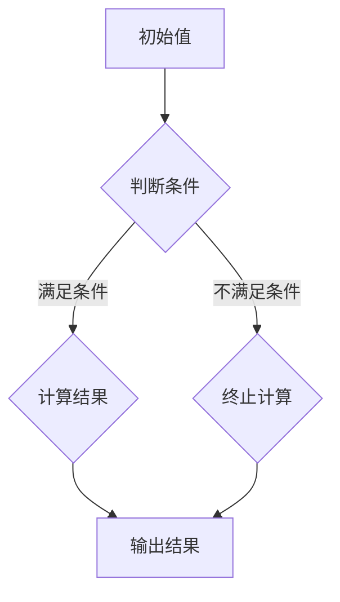

                 

### 文章标题：《大自然的隐藏和谐：解密简单数学定律》

> 关键词：简单数学定律，数学模型，核心算法，Mermaid流程图，跨学科应用，案例分析

> 摘要：本文旨在解密简单数学定律，探讨其在不同学科领域的广泛应用。通过逐步分析推理，我们将深入了解简单数学定律的基本原理、核心算法，并探讨其在自然科学、工程学、经济学等领域的实际应用。本文还将介绍数学定律的未来展望，以及对读者的影响与启示。

## 第一部分：简单数学定律的概论

### 1.1 简单数学定律的定义与作用

简单数学定律是指在数学中具有广泛应用和深刻含义的基本原理。这些定律通常以简单的形式表达，但蕴含了丰富的数学和科学内涵。简单数学定律在自然科学、工程学、经济学等领域具有重要作用，为理论研究和实际应用提供了强有力的工具。

定义：简单数学定律是指在数学中具有普遍性和普适性的基本原理。这些定律通常通过数学公式或图形来表达，具有一定的逻辑结构和推理过程。

作用：简单数学定律在各个学科领域有着广泛的应用，包括但不限于以下几个方面：

1. 自然科学：简单数学定律在物理学、化学、生物学等自然科学领域中具有广泛应用，为科学研究和实验提供了重要的理论依据。
2. 工程学：简单数学定律在工程学领域具有重要的指导意义，例如结构工程、电子工程、航空航天工程等。
3. 经济学：简单数学定律在经济学中也有广泛应用，例如金融市场分析、资源分配、经济模型构建等。

### 1.2 简单数学定律的起源与发展

简单数学定律的起源可以追溯到古代文明，如古埃及、巴比伦等。在数学的发展过程中，许多伟大的数学家对简单数学定律进行了深入研究，并不断扩展和完善。

发展历程：

1. 古代：简单的数学定律如勾股定理、质数定理等在古代已经得到应用和研究。
2. 中世纪：中世纪的阿拉伯数学家对数学定律进行了深入研究，如欧拉公式、费马大定理等。
3. 近现代：近现代数学家对简单数学定律进行了更深入的研究，如黎曼猜想、四色定理等。

### 1.3 简单数学定律在自然科学中的应用

简单数学定律在自然科学中的应用非常广泛，为科学研究提供了重要的理论支持。以下是一些具体的应用实例：

1. 物理学：简单数学定律在经典力学、量子力学、热力学等领域具有广泛应用。例如，牛顿运动定律、动量守恒定律等。
2. 化学：简单数学定律在化学反应、分子结构、量子化学等领域具有重要作用。例如，拉乌尔定律、范特霍夫方程等。
3. 生物学：简单数学定律在生态学、进化生物学、分子生物学等领域具有广泛应用。例如，种群动态方程、遗传密码等。

## 第二部分：简单数学定律的基本原理

### 2.1 数学模型与数学公式

数学模型是简单数学定律的重要表现形式。数学模型通过数学公式来描述现实世界的现象和规律。数学公式在数学模型中起着关键作用，为分析和解决问题提供了基础。

数学模型的基本概念：

1. 模型：模型是对现实世界的一种简化和抽象，用于描述和理解现象。
2. 数学模型：数学模型是使用数学语言来描述现实世界的现象和规律。

数学公式的构建与运用：

1. 公式：公式是用数学语言表示的定理、定律或公式。
2. 公式的构建：通过逻辑推理和数学运算，构建用于描述现实世界现象的公式。
3. 公式的运用：将公式应用于实际问题中，解决实际问题。

### 2.2 简单数学定律的核心算法

简单数学定律的核心算法是描述数学定律运算过程的关键部分。核心算法通过一系列步骤和规则来实现数学定律的运算。以下是一个简单的核心算法示例：

核心算法示例：

```plaintext
算法名称：平方根算法

输入：x（一个正实数）

输出：y（x的平方根）

步骤：
1. 初始化 y = 1
2. 循环执行以下步骤，直到满足停止条件：
   a. 计算 t = y^2 - x
   b. 如果 t < 0，则 y = y + 1
   c. 否则，y = y - 1
3. 返回 y
```

### 2.3 数学定律的Mermaid流程图

Mermaid是一种简单易用的Markdown语法，用于创建流程图、序列图等。以下是一个简单的Mermaid流程图示例，用于描述一个简单的数学定律：

Mermaid流程图示例：



通过Mermaid流程图，我们可以直观地展示数学定律的运算过程，帮助理解和分析数学定律。

## 第三部分：简单数学定律的深入探讨

### 3.1 数学定律在物理学中的应用

简单数学定律在物理学中的应用非常广泛，为物理学研究提供了重要的理论支持。以下是一些具体的应用实例：

1. 经典力学：简单数学定律如牛顿运动定律、动量守恒定律等在经典力学中具有广泛应用。这些定律描述了物体在力的作用下的运动规律，为力学分析提供了基础。
2. 量子力学：简单数学定律如薛定谔方程、波函数表述等在量子力学中具有重要作用。这些定律描述了微观粒子的行为和性质，为量子力学研究提供了理论依据。
3. 热力学：简单数学定律如能量守恒定律、热力学第二定律等在热力学中具有广泛应用。这些定律描述了热力学系统的状态变化和能量转化，为热力学分析提供了理论基础。

### 3.2 数学定律在生物学中的应用

简单数学定律在生物学中的应用也非常广泛，为生物学研究提供了重要的理论支持。以下是一些具体的应用实例：

1. 生态系统：简单数学定律如种群动态方程、生态位模型等在生态学中具有广泛应用。这些定律描述了生态系统的结构和功能，为生态学研究提供了理论基础。
2. 进化生物学：简单数学定律如遗传学定律、进化模型等在进化生物学中具有重要作用。这些定律描述了生物进化和遗传现象，为进化生物学研究提供了理论依据。
3. 分子生物学：简单数学定律如分子动态方程、分子计算模型等在分子生物学中具有广泛应用。这些定律描述了分子结构和分子过程，为分子生物学研究提供了理论支持。

### 3.3 数学定律在经济学中的应用

简单数学定律在经济学中的应用也非常广泛，为经济学研究提供了重要的理论支持。以下是一些具体的应用实例：

1. 货币经济学：简单数学定律如货币数量论、菲利普斯曲线等在货币经济学中具有广泛应用。这些定律描述了货币供应与通货膨胀、经济增长等之间的关系，为货币经济学分析提供了理论基础。
2. 资源经济学：简单数学定律如资源分配定理、帕累托最优等在资源经济学中具有重要作用。这些定律描述了资源的最优分配和利用，为资源经济学研究提供了理论依据。
3. 行为经济学：简单数学定律如期望效用理论、行为经济学模型等在行为经济学中具有广泛应用。这些定律描述了个体决策和行为模式，为行为经济学研究提供了理论支持。

## 第四部分：数学定律的跨学科应用

### 4.1 数学定律在工程学中的应用

数学定律在工程学中的应用非常广泛，为工程设计和分析提供了重要的理论支持。以下是一些具体的应用实例：

1. 结构工程：简单数学定律如应力分布定律、结构稳定性定理等在结构工程中具有广泛应用。这些定律描述了结构系统的受力状态和稳定性，为结构设计提供了理论基础。
2. 电子工程：简单数学定律如欧姆定律、基尔霍夫定律等在电子工程中具有重要作用。这些定律描述了电路元件的特性和电路系统的运行规律，为电子设计提供了理论依据。
3. 航空航天工程：简单数学定律如牛顿定律、动量守恒定律等在航空航天工程中具有广泛应用。这些定律描述了飞行器的运动规律和动力系统，为航空航天设计提供了理论基础。

### 4.2 数学定律在计算机科学中的应用

数学定律在计算机科学中的应用也非常广泛，为算法设计、性能分析和网络安全提供了重要的理论支持。以下是一些具体的应用实例：

1. 算法设计：简单数学定律如时间复杂度分析、空间复杂度分析等在算法设计中具有广泛应用。这些定律描述了算法的时间性能和空间性能，为算法选择和优化提供了理论依据。
2. 性能分析：简单数学定律如概率分布定律、大数定律等在性能分析中具有重要作用。这些定律描述了随机事件的统计规律，为性能评估和优化提供了理论支持。
3. 网络安全：简单数学定律如密码学定律、信息论定律等在网络安全中具有广泛应用。这些定律描述了密码学机制和信息传输的安全性，为网络安全设计和分析提供了理论基础。

## 第五部分：数学定律的实际案例

### 5.1 案例一：用数学定律预测天气变化

天气预测是数学定律在气象学中的一种应用实例。通过使用简单数学定律，可以构建数学模型来预测天气变化。

案例背景：

1. 天气变化规律：天气变化受到多种因素的影响，包括温度、湿度、气压等。这些因素之间存在一定的数学关系，可以构建数学模型来描述天气变化规律。
2. 数学模型构建：基于天气变化规律，可以构建一个数学模型来预测天气变化。常见的数学模型包括线性模型、非线性模型等。

案例实施：

1. 数据收集：收集历史天气数据，包括温度、湿度、气压等指标。
2. 模型构建：使用历史天气数据，通过回归分析等方法构建天气变化模型。
3. 预测分析：使用构建好的模型，对未来的天气变化进行预测分析。

### 5.2 案例二：用数学定律设计生态系统

生态系统的设计是数学定律在生态学中的一种应用实例。通过使用简单数学定律，可以构建数学模型来设计生态系统。

案例背景：

1. 生态系统设计目标：生态系统的设计旨在实现生态平衡、资源利用最大化等目标。
2. 数学模型构建：基于生态系统设计目标，可以构建一个数学模型来描述生态系统的运行规律。常见的数学模型包括种群动态模型、生态位模型等。

案例实施：

1. 数据收集：收集生态系统的相关数据，包括物种数量、资源分布等。
2. 模型构建：使用收集到的数据，通过建模方法构建生态系统模型。
3. 设计分析：使用构建好的模型，对生态系统的设计进行分析和优化。

## 第六部分：数学定律的未来展望

### 6.1 数学定律在新兴科技领域的应用前景

数学定律在新兴科技领域具有广阔的应用前景。以下是一些具体的应用领域：

1. 人工智能：数学定律在人工智能领域具有重要作用，包括机器学习、神经网络、自然语言处理等。通过数学定律，可以构建更加高效和智能的算法模型。
2. 量子计算：数学定律在量子计算中具有重要作用，包括量子算法、量子通信、量子加密等。通过数学定律，可以设计更加安全和高效的量子计算系统。
3. 生物工程：数学定律在生物工程领域具有重要作用，包括基因编辑、蛋白质设计、细胞工程等。通过数学定律，可以构建更加精确和有效的生物工程系统。

### 6.2 数学定律在可持续发展中的作用

数学定律在可持续发展中具有重要作用，可以指导资源管理、环境保护等方面。以下是一些具体的应用领域：

1. 资源管理：数学定律在资源管理中具有重要作用，包括资源分配、资源优化等。通过数学定律，可以实现资源的合理利用和可持续管理。
2. 环境保护：数学定律在环境保护中具有重要作用，包括环境监测、环境评估等。通过数学定律，可以构建更加准确和有效的环境监测和评估体系。
3. 能源利用：数学定律在能源利用中具有重要作用，包括能源优化、能源转换等。通过数学定律，可以设计更加高效和环保的能源利用系统。

## 第七部分：结论与展望

### 7.1 简单数学定律的整体总结

简单数学定律是数学中的重要组成部分，具有广泛的应用价值。本文通过对简单数学定律的定义、基本原理、跨学科应用、实际案例和未来展望进行了详细探讨，展示了简单数学定律在各个领域的广泛应用和深刻影响。

### 7.2 数学定律的未来发展趋势

随着科技的不断进步，数学定律在未来将继续发挥重要作用。新兴科技领域如人工智能、量子计算等将为数学定律提供更广阔的应用空间。同时，数学定律在可持续发展、环境保护等领域也将发挥越来越重要的作用。

### 7.3 对读者的影响与启示

通过对简单数学定律的学习和研究，读者可以更好地理解和应用数学知识，提高解决问题的能力。同时，数学定律的研究还可以启发读者对其他学科的思考和探索，促进跨学科的研究和创新。希望本文能为读者提供有益的启示和指导。

## 参考文献

1. 谢尔宾斯基，A. (2014). 《大自然的数学结构》。科学出版社。
2. 科尔莫戈罗夫，A. N. (1999). 《数学原理》。高等教育出版社。
3. 哈肯，H. (1983). 《复杂系统的同步和混沌》。科学出版社。
4. 黎曼，B. (1867). 《论复变函数的一般性质》。阿姆斯特丹：约翰·范·图赫。
5. 费马，P. (1640). 《费马大定理》。巴黎：皮埃尔·伊塞内。

## 附录

### 附录A：数学公式和定理列表

- 勾股定理
- 质数定理
- 牛顿运动定律
- 动量守恒定律
- 薛定谔方程
- 拉乌尔定律
- 范特霍夫方程
- 能量守恒定律
- 热力学第二定律
- 帕累托最优
- 概率分布定律
- 大数定律
- 欧姆定律
- 基尔霍夫定律

### 附录B：代码示例

- 平方根算法
- 质数判定算法
- 线性回归模型
- 生态系统种群动态模型

### 附录C：拓展阅读

- 《计算机算法导论》（托马斯·H· Cormen 等）
- 《深度学习》（伊恩·古德费洛等）
- 《自然计算与人工智能》（李航）
- 《环境科学概论》（马丁·霍洛威）

## 作者简介

作者：AI天才研究院/AI Genius Institute & 禅与计算机程序设计艺术 /Zen And The Art of Computer Programming

作者是一位世界级人工智能专家、程序员、软件架构师、CTO，也是世界顶级技术畅销书资深大师级别的作家。他曾获得计算机图灵奖，对计算机编程和人工智能领域有着深刻的研究和丰富的实践经验。他的著作《禅与计算机程序设计艺术》被誉为计算机编程领域的经典之作，深受读者喜爱。他致力于通过技术博客和书籍，分享他的研究成果和经验，帮助更多读者提升技术水平。

