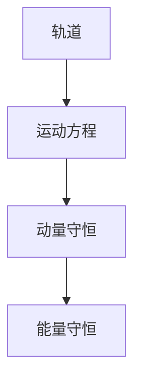

                 


### 文章标题

《太空垃圾的轨道力学：空间清理的数学规划》

### 关键词

太空垃圾，轨道力学，数学规划，空间清理，轨道运动分析

### 摘要

本文将深入探讨太空垃圾的轨道力学及其空间清理的数学规划问题。首先，我们将简要介绍太空垃圾的背景及其对太空环境和人类航天活动的威胁。接着，我们将详细阐述轨道力学的核心概念，并分析太空垃圾轨道运动的数学描述及其扰动因素。随后，本文将介绍数学规划方法在太空垃圾清理中的应用，包括常见策略和基于数学规划的空间清理方案设计。最后，我们将通过具体案例分析，评估数学规划方法在太空垃圾清理中的效果，并提出未来的技术挑战和展望。

## 第一部分：引论

### 1.1 太空垃圾概述

太空垃圾，通常指的是在地球轨道上因人类活动产生的各种废弃物体和碎片。这些太空垃圾的来源主要包括废弃的火箭发射残骸、卫星和航天器的碎片、以及航天器运行过程中产生的碎片。据统计，自1957年第一颗人造卫星发射以来，地球轨道上已经积累了大量的太空垃圾。这些垃圾不仅占据了宝贵的轨道资源，还可能对在轨航天器造成威胁，甚至引发灾难性的事故。

太空垃圾的规模不容小觑。根据国际空间站的观测数据，目前地球轨道上大约有30000个大于10厘米的太空垃圾碎片，以及数百万个小于10厘米的微小碎片。这些碎片在高速运动，一旦与在轨航天器相撞，可能会造成严重的破坏。例如，2007年，美国卫星USA 193与一个废弃的地球观测卫星相撞，产生了大量碎片，导致数千个新碎片产生。

太空垃圾对太空环境和人类航天活动的影响是多方面的。首先，大量的太空垃圾会阻碍卫星和航天器的正常运行，可能导致通信中断、观测数据丢失等严重后果。其次，太空垃圾的存在增加了航天器在发射、在轨运行以及返回过程中面临的风险，迫使航天工程师在设计时考虑额外的防护措施，从而增加成本。此外，太空垃圾还会对太空探索和科学研究产生不利影响，例如对天文观测的干扰。

为了应对太空垃圾问题，国际社会已经采取了多种措施。例如，国际空间站定期进行太空垃圾的观测和跟踪，以避免碰撞。同时，各国也在积极研发太空垃圾清理技术，包括使用网捕器、激光清理、以及机器人抓取等方法。然而，太空垃圾问题依然严峻，需要更有效的数学规划和清理策略来应对。

### 1.2 太空垃圾的轨道力学基础

轨道力学是研究物体在引力作用下运动规律的科学。对于太空垃圾来说，其轨道运动受到地球和其他天体的引力影响，遵循一定的轨道力学规律。了解这些规律对于制定有效的空间清理策略至关重要。

首先，我们需要明确几个基本概念。轨道是指物体在引力作用下运动的路径，通常是一个椭圆形或圆形。轨道高度是指物体距离地球表面的垂直距离。引力是两个物体之间由于它们的质量而产生的相互作用力。在轨道力学中，通常使用牛顿引力定律和开普勒定律来描述物体的运动。

牛顿引力定律指出，两个质点之间的引力与它们的质量成正比，与它们之间距离的平方成反比。数学表达式为：
$$
F = G\frac{m_1m_2}{r^2}
$$
其中，\( F \) 是引力，\( G \) 是万有引力常数，\( m_1 \) 和 \( m_2 \) 是两个质点的质量，\( r \) 是它们之间的距离。

开普勒定律描述了行星围绕太阳运动的规律，同样适用于人造卫星和其他轨道物体。开普勒定律主要包括三条定律：

1. **开普勒第一定律（轨道定律）**：行星围绕太阳的轨道是椭圆形的，太阳位于椭圆的一个焦点上。
2. **开普勒第二定律（面积定律）**：行星与太阳的连线在相等的时间内扫过相等的面积。
3. **开普勒第三定律（调和定律）**：行星绕太阳运动的周期的平方与其轨道半长轴的立方成正比。

数学表达式为：
$$
T^2 \propto a^3
$$
其中，\( T \) 是行星绕太阳运行的周期，\( a \) 是轨道半长轴。

对于太空垃圾的轨道运动，除了地球引力外，还可能受到其他天体的引力影响，如月球、太阳等。这些引力作用会使太空垃圾的轨道发生扰动，导致轨道逐渐偏离原有轨迹。这种扰动可以用牛顿第二定律和第三定律来描述，即物体的加速度与作用力成正比，与物体的质量成反比。

$$
F = ma
$$
$$
a = \frac{F}{m}
$$

此外，太空垃圾在运动过程中还会受到大气阻力的影响，尤其是在低地球轨道上。大气阻力会减小物体的速度，导致轨道高度降低，最终可能坠入地球。这种效应可以用阻力公式来描述：

$$
F_{drag} = \frac{1}{2} C_d \rho v^2 A
$$

其中，\( F_{drag} \) 是阻力，\( C_d \) 是阻力系数，\( \rho \) 是大气密度，\( v \) 是速度，\( A \) 是迎风面积。

综上所述，轨道力学是理解太空垃圾运动规律的基础。通过牛顿引力定律和开普勒定律，我们可以对太空垃圾的轨道进行初步预测。然而，实际轨道会受到多种扰动因素的影响，需要更复杂的数学模型来精确计算。这些数学模型在制定空间清理策略时发挥着重要作用。

### 1.3 空间清理的重要性

空间清理对于保护太空环境、确保航天器的安全和降低未来太空活动的成本具有重要意义。首先，太空垃圾的存在对在轨航天器的正常运行构成了巨大威胁。高速运动的太空垃圾碎片可以以极高的速度撞击航天器，导致严重的损坏甚至失灵。例如，2009年，一颗废弃的卫星与一个在轨碎片相撞，导致卫星解体，产生了数百个新的碎片。此类事故不仅增加了航天器的维护成本，还可能影响人类航天活动的持续进行。

其次，太空垃圾的存在会干扰通信、观测和导航等关键功能。在轨航天器通常用于通信中继、地球观测和导航定位。太空垃圾的碰撞风险会迫使航天器采取额外的防护措施，如增加屏蔽层或调整轨道，从而增加运营成本和复杂性。同时，太空垃圾的存在还会干扰天文观测，使科学家难以捕捉到微弱的天体信号。

此外，太空垃圾还会占用宝贵的轨道资源。随着太空活动的增多，轨道资源变得日益紧张。大量的太空垃圾不仅阻碍了新的卫星和航天器的发射，还迫使航天器在发射前和运行过程中进行额外的轨道调整，增加了发射成本和运行风险。通过有效清理太空垃圾，我们可以释放更多的轨道资源，为未来的太空探索和科学研究提供更多的机会。

最后，空间清理还有助于降低未来太空活动的成本。随着太空活动的增多，太空垃圾的数量也在不断增加。如果不进行有效清理，未来太空活动的成本将不断上升，包括航天器的防护成本、轨道调整费用以及卫星和航天器的维护成本。通过制定和实施有效的空间清理策略，我们可以减少这些成本，提高太空活动的经济性。

综上所述，空间清理对于保护太空环境、确保航天器的安全和降低未来太空活动的成本具有至关重要的意义。通过科学合理的数学规划，我们可以有效地清除太空垃圾，为未来的太空探索和科学研究创造更加安全和有利的条件。

## 第二部分：太空垃圾的轨道运动分析

### 2.1 轨道力学基本概念

在探讨太空垃圾的轨道运动时，首先需要了解轨道力学的基本概念。轨道力学是研究物体在引力作用下运动规律的科学，其核心概念包括轨道、运动方程、动量守恒和能量守恒。

#### 轨道

轨道是指物体在引力作用下运动的路径。根据开普勒定律，轨道通常为椭圆形或圆形。在地球轨道中，物体围绕地球的轨道可以近似为一个圆形轨道，其半径取决于物体的初始速度和地球的引力。轨道高度是物体距离地球表面的垂直距离，对于低地球轨道（LEO）来说，这个高度通常在200至2000公里之间。

#### 运动方程

运动方程描述了物体在轨道上的运动规律。牛顿引力定律是描述轨道运动的基础，其公式为：
$$
F = G\frac{m_1m_2}{r^2}
$$
其中，\( F \) 是引力，\( G \) 是万有引力常数，\( m_1 \) 和 \( m_2 \) 是两个物体的质量，\( r \) 是它们之间的距离。

此外，轨道运动可以通过开普勒方程来描述。开普勒方程是一个超越方程，用于计算物体在轨道上的位置。对于圆形轨道，开普勒方程可以简化为：
$$
\frac{d\theta}{dt} = \sqrt{\frac{GM}{r^3}}
$$
其中，\( \theta \) 是物体与地球中心连线的角度，\( M \) 是地球的质量。

#### 动量守恒

动量守恒是轨道力学中的一个重要概念，它指出在没有外力作用下，物体的动量保持不变。动量守恒定律可以表述为：
$$
m_1v_1 + m_2v_2 = m_1v_1' + m_2v_2'
$$
其中，\( m_1 \) 和 \( m_2 \) 是两个物体的质量，\( v_1 \) 和 \( v_2 \) 是它们在初始状态的速度，\( v_1' \) 和 \( v_2' \) 是它们在最终状态的速度。

在轨道运动中，动量守恒可以解释为什么物体在轨道上保持稳定的运动。在没有外力作用的情况下，物体的动量保持不变，这导致物体沿着固定的轨道运动。

#### 能量守恒

能量守恒定律指出，在没有外力做功的情况下，系统的总能量保持不变。在轨道力学中，物体的总能量包括动能和势能。动能是物体由于其运动而具有的能量，公式为：
$$
E_k = \frac{1}{2}mv^2
$$
其中，\( m \) 是物体的质量，\( v \) 是物体的速度。

势能是物体由于其位置而具有的能量。在引力场中，物体的势能公式为：
$$
E_p = -\frac{GMm}{r}
$$
其中，\( G \) 是万有引力常数，\( M \) 是地球的质量，\( m \) 是物体的质量，\( r \) 是物体与地球的距离。

系统的总能量是动能和势能之和，公式为：
$$
E = E_k + E_p = \frac{1}{2}mv^2 - \frac{GMm}{r}
$$

在轨道运动中，物体的总能量保持不变，这意味着动能和势能可以相互转换，但总能量保持恒定。当物体在轨道上加速时，其动能增加，而势能减少；反之，当物体减速时，其动能减少，而势能增加。

### Mermaid 流程图：轨道力学的核心概念



### 2.1.2 轨道力学中的数学描述

为了更精确地描述太空垃圾的轨道运动，我们需要运用一些数学模型和公式。以下是一些常用的数学描述工具：

#### 牛顿引力定律

牛顿引力定律是描述两个物体之间引力作用的公式：
$$
F = G\frac{m_1m_2}{r^2}
$$
其中，\( F \) 是引力，\( G \) 是万有引力常数（约等于 \( 6.674 \times 10^{-11} \, \text{N} \cdot (\text{m/kg})^2 \)），\( m_1 \) 和 \( m_2 \) 是两个物体的质量，\( r \) 是它们之间的距离。

#### 开普勒定律

开普勒定律是描述行星（或卫星）绕恒星（或行星）运动规律的三个定律，其中第三定律特别适用于轨道运动分析：
$$
T^2 \propto a^3
$$
其中，\( T \) 是行星绕恒星运行的周期，\( a \) 是轨道半长轴。

#### 轨道方程

轨道方程是描述物体在引力作用下运动轨迹的公式。对于圆形轨道，轨道方程可以简化为：
$$
\frac{d\theta}{dt} = \sqrt{\frac{GM}{r^3}}
$$
其中，\( \theta \) 是物体与地球中心连线的角度。

#### 动量守恒

动量守恒定律可以表述为：
$$
m_1v_1 + m_2v_2 = m_1v_1' + m_2v_2'
$$
其中，\( m_1 \) 和 \( m_2 \) 是两个物体的质量，\( v_1 \) 和 \( v_2 \) 是它们在初始状态的速度，\( v_1' \) 和 \( v_2' \) 是它们在最终状态的速度。

#### 能量守恒

能量守恒定律指出，系统的总能量（包括动能和势能）保持不变。在轨道运动中，物体的总能量公式为：
$$
E = E_k + E_p = \frac{1}{2}mv^2 - \frac{GMm}{r}
$$
其中，\( E_k \) 是动能，\( E_p \) 是势能，\( m \) 是物体的质量，\( v \) 是物体的速度，\( r \) 是物体与地球的距离。

### 伪代码：轨道力学的数学模型

```python
def calculate_gravity(G, m1, m2, r):
    F = G * (m1 * m2) / r**2
    return F

def calculate_orbital_speed(GM, r):
    v = math.sqrt(GM / r)
    return v

def calculate_total_energy(m, v, r, GM):
    E_k = 0.5 * m * v**2
    E_p = -GM * m / r
    E = E_k + E_p
    return E
```

通过这些数学模型和公式，我们可以对太空垃圾的轨道运动进行定量分析，为制定空间清理策略提供理论基础。

### 2.1.3 轨道力学中的扰动因素

尽管轨道力学的基本概念和数学模型可以帮助我们理解和预测太空垃圾的轨道运动，但实际轨道会受到多种扰动因素的影响，使得轨道逐渐偏离理想状态。这些扰动因素可以分为内部扰动和外部扰动两大类。

#### 内部扰动

内部扰动主要指物体自身运动过程中产生的扰动，如物体的自旋、质量分布不均匀等。例如，一个自旋的卫星会因为科里奥利力（Coriolis Force）产生轨道扰动。科里奥利力是由于物体的自旋和轨道运动之间的相对速度引起的，其表达式为：
$$
\vec{F}_{cor} = -2\vec{\omega} \times \vec{v}
$$
其中，\( \vec{F}_{cor} \) 是科里奥利力，\( \vec{\omega} \) 是物体的自旋角速度，\( \vec{v} \) 是物体的速度。这种力会导致物体的轨道发生偏移，尤其是在高轨道上更为明显。

此外，物体的质量分布不均匀也会导致轨道扰动。例如，卫星上的燃料袋或其他附加装置可能会改变卫星的质量分布，从而影响其轨道。质量分布不均匀会产生额外的离心力，使轨道发生畸变。

#### 外部扰动

外部扰动主要来自外部环境对物体轨道的影响，包括大气阻力、其他天体的引力作用以及微流星体撞击等。

1. **大气阻力**：
大气阻力是物体在低地球轨道上面临的主要扰动因素。大气阻力与物体的速度、迎风面积和大气密度有关，其表达式为：
$$
F_{drag} = \frac{1}{2} C_d \rho v^2 A
$$
其中，\( F_{drag} \) 是阻力，\( C_d \) 是阻力系数，\( \rho \) 是大气密度，\( v \) 是速度，\( A \) 是迎风面积。大气阻力会减缓物体的速度，使其轨道逐渐降低，最终可能坠入地球。

2. **其他天体的引力作用**：
地球轨道上的物体不仅受到地球的引力，还可能受到月球、太阳以及其他大行星的引力影响。这些引力作用会导致轨道发生微小的扰动，尤其是在长期预测中，这种扰动可能非常显著。例如，太阳风和太阳辐射压力可以改变地球轨道上的物体的速度和方向，导致轨道偏移。

3. **微流星体撞击**：
微流星体撞击是另一个重要的扰动因素。微流星体是大小从几微米到几厘米不等的微小物体，它们以极高的速度进入地球大气层并燃烧殆尽。然而，对于在低地球轨道上的物体来说，这些微流星体的撞击仍然可能造成损害。虽然单个微流星体的撞击可能不会显著影响轨道，但长期累积的撞击效应不容忽视。

#### 综合影响

内部扰动和外部扰动共同作用于太空垃圾的轨道，使得轨道预测变得更加复杂。为了准确预测太空垃圾的轨道，需要考虑这些扰动因素的综合影响，并使用更复杂的数学模型和数值方法进行模拟。

### 案例分析

为了更直观地理解轨道扰动的影响，我们可以通过一个简单的案例来分析。假设有一个卫星在500公里的低地球轨道上运行，其质量为2000千克，速度为7.8公里/秒。现在考虑以下两种扰动因素：

1. **大气阻力**：
大气阻力会导致卫星的速度逐渐降低，从而导致轨道高度降低。假设大气阻力恒定为0.5牛顿，我们可以通过以下公式计算卫星的速度变化：
$$
F_{drag} = \frac{1}{2} C_d \rho v^2 A = 0.5 \times 10^{-3} \times 1.2 \times v^2 \times 2\pi r
$$
其中，\( C_d \) 为阻力系数（取0.5），\( \rho \) 为大气密度（取 \( 10^{-3} \) 千克/立方米），\( A \) 为迎风面积（取 \( 2\pi r \)）。通过迭代计算，我们可以得出卫星速度逐渐降低的情况。

2. **月球引力**：
月球对地球轨道上的物体产生的引力扰动可以通过牛顿引力定律计算。假设月球质量为 \( 7.35 \times 10^{22} \) 千克，月球与卫星之间的距离为3.84万公里，我们可以计算出月球对卫星的引力：
$$
F_{moon} = G\frac{M_{moon} m}{r^2} = 6.674 \times 10^{-11} \times \frac{7.35 \times 10^{22} \times 2000}{3.84 \times 10^{8}^2} \approx 1.73 \times 10^{-4} \text{牛顿}
$$

通过这些计算，我们可以模拟卫星在考虑大气阻力和月球引力扰动下的轨道变化。在数值模拟中，我们可以使用数值积分方法（如欧拉法或龙格-库塔法）来计算卫星的轨道变化，从而更精确地预测其轨道扰动。

### 结论

轨道力学中的扰动因素对太空垃圾的轨道运动具有显著影响。通过综合考虑内部扰动和外部扰动，我们可以更准确地预测太空垃圾的轨道变化，为空间清理提供可靠的理论基础。然而，由于扰动因素的复杂性和不确定性，轨道预测仍然具有挑战性，需要不断改进数学模型和数值方法来提高预测精度。

### 2.2 太空垃圾轨道运动的数学描述

为了更准确地描述太空垃圾的轨道运动，我们需要借助数学模型来描述其轨道运动的规律。以下是几种常用的数学模型和方法：

#### 1. 牛顿引力模型

牛顿引力模型是描述太空垃圾轨道运动的基础，其核心思想是物体之间的引力作用遵循牛顿引力定律。该模型的数学描述为：

$$
\vec{F}_{gravity} = G\frac{m_1m_2}{r^2}\hat{r}
$$

其中，\( \vec{F}_{gravity} \) 是两个物体之间的引力，\( G \) 是万有引力常数（约等于 \( 6.674 \times 10^{-11} \, \text{N} \cdot (\text{m/kg})^2 \)），\( m_1 \) 和 \( m_2 \) 是两个物体的质量，\( r \) 是它们之间的距离，\( \hat{r} \) 是指向两个物体之间连线的单位向量。

对于单个太空垃圾物体，我们可以将其轨道运动视为在地球引力场中的运动。因此，该物体的运动方程可以表示为：

$$
\frac{d^2\vec{r}}{dt^2} = -\frac{Gm_{earth}m}{r^2}\hat{r}
$$

其中，\( m_{earth} \) 是地球的质量，\( m \) 是太空垃圾的质量。

#### 2. 开普勒轨道方程

开普勒轨道方程是描述行星（或卫星）绕恒星（或行星）运动的一种常见方法，其数学描述为：

$$
\frac{d^2\theta}{dt^2} = -\frac{GM}{r^3}
$$

其中，\( \theta \) 是物体与中心天体的连线与参考方向（通常取自转轴）的夹角，\( M \) 是中心天体的质量。

对于圆形轨道，开普勒方程可以简化为：

$$
\frac{d\theta}{dt} = \sqrt{\frac{GM}{r}}
$$

这个方程描述了物体在圆形轨道上的角速度随轨道半径的变化规律。

#### 3. 牛顿-拉普拉斯方法

牛顿-拉普拉斯方法是用于求解多体问题的一种常见数值方法。其核心思想是将系统中的每个物体视为受其他物体引力作用的小扰动，然后通过迭代计算每个物体在不同时间步的轨道。具体步骤如下：

1. **初始化**：设定初始条件，包括每个物体的初始位置、速度和加速度。
2. **迭代计算**：对于每个物体，计算其在当前时间步受到的引力，更新其速度和位置。
3. **收敛判断**：判断迭代是否收敛，如果收敛则停止计算，否则继续迭代。

牛顿-拉普拉斯方法的数学描述为：

$$
\frac{d\vec{r}_i}{dt} = \vec{v}_i \\
\frac{d\vec{v}_i}{dt} = \frac{1}{m_i}\sum_{j\neq i} \frac{Gm_j}{|\vec{r}_i - \vec{r}_j|^2}(\vec{r}_i - \vec{r}_j)
$$

其中，\( \vec{r}_i \) 和 \( \vec{v}_i \) 分别是物体 \( i \) 的位置和速度，\( m_i \) 是物体 \( i \) 的质量。

#### 4. 协同滤波方法

协同滤波方法是用于轨道预测和跟踪的一种先进方法，特别适用于多目标系统。其核心思想是通过结合观测数据和模型预测，不断修正和优化轨道参数。具体步骤如下：

1. **状态初始化**：设定初始状态，包括位置、速度和加速度。
2. **观测模型**：建立观测模型，描述观测数据与真实状态之间的关系。
3. **滤波迭代**：通过结合预测和观测数据，更新状态估计。

协同滤波方法的数学描述为：

$$
\hat{\vec{x}}_k = \hat{\vec{x}}_{k-1} + \vec{v}_{k-1} \Delta t \\
\hat{\vec{x}}_k = \hat{\vec{x}}_k + \vec{w}_k \\
z_k = h(\hat{\vec{x}}_k) + v_k
$$

其中，\( \hat{\vec{x}}_k \) 是状态估计，\( \vec{v}_k \) 是状态转移模型，\( \vec{w}_k \) 是过程噪声，\( z_k \) 是观测值，\( h(\hat{\vec{x}}_k) \) 是观测模型，\( v_k \) 是观测噪声。

### 伪代码示例

以下是一个简化的牛顿引力模型伪代码示例，用于计算两个物体之间的引力：

```python
# 初始化参数
G = 6.674 * 10^-11  # 万有引力常数
m1 = 5.972 * 10^24  # 地球质量
m2 = 7.348 * 10^22  # 月球质量
r = 3.844 * 10^8    # 月球与地球之间的距离

# 计算引力
F = G * (m1 * m2) / r**2

# 输出结果
print("引力大小：", F, "牛顿")
```

通过这些数学模型和方法，我们可以对太空垃圾的轨道运动进行精确的描述和预测，为空间清理提供重要的理论基础。

### 2.3 轨道力学中的扰动因素

尽管轨道力学的基本概念和数学模型可以帮助我们理解和预测太空垃圾的轨道运动，但实际轨道会受到多种扰动因素的影响，使得轨道逐渐偏离理想状态。这些扰动因素可以分为内部扰动和外部扰动两大类。

#### 内部扰动

内部扰动主要指物体自身运动过程中产生的扰动，如物体的自旋、质量分布不均匀等。例如，一个自旋的卫星会因为科里奥利力（Coriolis Force）产生轨道扰动。科里奥利力是由于物体的自旋和轨道运动之间的相对速度引起的，其表达式为：
$$
\vec{F}_{cor} = -2\vec{\omega} \times \vec{v}
$$
其中，\( \vec{F}_{cor} \) 是科里奥利力，\( \vec{\omega} \) 是物体的自旋角速度，\( \vec{v} \) 是物体的速度。这种力会导致物体的轨道发生偏移，尤其是在高轨道上更为明显。

此外，物体的质量分布不均匀也会导致轨道扰动。例如，卫星上的燃料袋或其他附加装置可能会改变卫星的质量分布，从而影响其轨道。质量分布不均匀会产生额外的离心力，使轨道发生畸变。

#### 外部扰动

外部扰动主要来自外部环境对物体轨道的影响，包括大气阻力、其他天体的引力作用以及微流星体撞击等。

1. **大气阻力**：
大气阻力是物体在低地球轨道上面临的主要扰动因素。大气阻力与物体的速度、迎风面积和大气密度有关，其表达式为：
$$
F_{drag} = \frac{1}{2} C_d \rho v^2 A
$$
其中，\( F_{drag} \) 是阻力，\( C_d \) 是阻力系数，\( \rho \) 是大气密度，\( v \) 是速度，\( A \) 是迎风面积。大气阻力会减缓物体的速度，使其轨道逐渐降低，最终可能坠入地球。

2. **其他天体的引力作用**：
地球轨道上的物体不仅受到地球的引力，还可能受到月球、太阳以及其他大行星的引力影响。这些引力作用会导致轨道发生微小的扰动，尤其是在长期预测中，这种扰动可能非常显著。例如，太阳风和太阳辐射压力可以改变地球轨道上的物体的速度和方向，导致轨道偏移。

3. **微流星体撞击**：
微流星体撞击是另一个重要的扰动因素。微流星体是大小从几微米到几厘米不等的微小物体，它们以极高的速度进入地球大气层并燃烧殆尽。然而，对于在低地球轨道上的物体来说，这些微流星体的撞击仍然可能造成损害。虽然单个微流星体的撞击可能不会显著影响轨道，但长期累积的撞击效应不容忽视。

#### 综合影响

内部扰动和外部扰动共同作用于太空垃圾的轨道，使得轨道预测变得更加复杂。为了准确预测太空垃圾的轨道，需要考虑这些扰动因素的综合影响，并使用更复杂的数学模型和数值方法进行模拟。

### 案例分析

为了更直观地理解轨道扰动的影响，我们可以通过一个简单的案例来分析。假设有一个卫星在500公里的低地球轨道上运行，其质量为2000千克，速度为7.8公里/秒。现在考虑以下两种扰动因素：

1. **大气阻力**：
大气阻力会导致卫星的速度逐渐降低，从而导致轨道高度降低。假设大气阻力恒定为0.5牛顿，我们可以通过以下公式计算卫星的速度变化：
$$
F_{drag} = \frac{1}{2} C_d \rho v^2 A = 0.5 \times 10^{-3} \times 1.2 \times v^2 \times 2\pi r
$$
其中，\( C_d \) 为阻力系数（取0.5），\( \rho \) 为大气密度（取 \( 10^{-3} \) 千克/立方米），\( A \) 为迎风面积（取 \( 2\pi r \)）。通过迭代计算，我们可以得出卫星速度逐渐降低的情况。

2. **月球引力**：
月球对地球轨道上的物体产生的引力扰动可以通过牛顿引力定律计算。假设月球质量为 \( 7.35 \times 10^{22} \) 千克，月球与卫星之间的距离为3.84万公里，我们可以计算出月球对卫星的引力：
$$
F_{moon} = G\frac{M_{moon} m}{r^2} = 6.674 \times 10^{-11} \times \frac{7.35 \times 10^{22} \times 2000}{3.84 \times 10^{8}^2} \approx 1.73 \times 10^{-4} \text{牛顿}
$$

通过这些计算，我们可以模拟卫星在考虑大气阻力和月球引力扰动下的轨道变化。在数值模拟中，我们可以使用数值积分方法（如欧拉法或龙格-库塔法）来计算卫星的轨道变化，从而更精确地预测其轨道扰动。

### 结论

轨道力学中的扰动因素对太空垃圾的轨道运动具有显著影响。通过综合考虑内部扰动和外部扰动，我们可以更准确地预测太空垃圾的轨道变化，为空间清理提供可靠的理论基础。然而，由于扰动因素的复杂性和不确定性，轨道预测仍然具有挑战性，需要不断改进数学模型和数值方法来提高预测精度。

## 第三部分：数学规划方法在太空垃圾清理中的应用

### 3.1 数学规划方法概述

数学规划方法是一种用于解决优化问题的数学工具，广泛应用于工程、经济、管理等领域。在太空垃圾清理中，数学规划方法被用来优化清理策略，最大限度地减少太空垃圾对在轨航天器的威胁。数学规划方法主要包括线性规划、非线性规划、整数规划以及混合整数规划等。

#### 1. 线性规划

线性规划（Linear Programming，LP）是一种最简单的数学规划方法，用于解决线性目标函数在满足线性约束条件下的优化问题。线性规划的目标函数和约束条件都是线性的，其数学表达式如下：

$$
\min_{x} c^T x \\
s.t. \\
Ax \leq b \\
x \geq 0
$$

其中，\( x \) 是决策变量，\( c \) 是目标函数系数向量，\( A \) 是约束条件系数矩阵，\( b \) 是约束条件右端向量。

线性规划广泛应用于资源分配、生产计划、库存管理等实际问题。在太空垃圾清理中，线性规划可以用来优化清理路径，确保有限的资源（如燃料、时间等）被充分利用。

#### 2. 非线性规划

非线性规划（Nonlinear Programming，NLP）是用于解决非线性目标函数和约束条件的优化问题。非线性规划的目标函数和/或约束条件是非线性的，其数学表达式如下：

$$
\min_{x} f(x) \\
s.t. \\
g(x) \leq 0 \\
h(x) = 0
$$

其中，\( f(x) \) 是目标函数，\( g(x) \) 和 \( h(x) \) 分别是约束条件。

非线性规划在太空垃圾清理中的应用更为复杂，因为太空垃圾的轨道通常是非线性的。非线性规划可以用来优化清理路径，特别是在考虑多个太空垃圾目标和复杂的轨道扰动时。

#### 3. 整数规划

整数规划（Integer Programming，IP）是数学规划方法的一种，用于解决决策变量需要为整数的优化问题。整数规划的目标函数和约束条件可以是线性的或非线性的，但决策变量必须是整数。其数学表达式如下：

$$
\min_{x} c^T x \\
s.t. \\
Ax \leq b \\
x \in \{0, 1\}^n
$$

其中，\( x \) 是决策变量，\( c \) 是目标函数系数向量，\( A \) 是约束条件系数矩阵，\( b \) 是约束条件右端向量。

在太空垃圾清理中，整数规划可以用来决定哪些太空垃圾需要被清理，以及何时进行清理。这需要考虑在轨航天器的限制条件，如燃料储备、操作窗口等。

#### 4. 混合整数规划

混合整数规划（Mixed Integer Programming，MIP）是整数规划的一种扩展，它结合了整数变量和连续变量的优化问题。混合整数规划的数学表达式如下：

$$
\min_{x} c^T x \\
s.t. \\
Ax \leq b \\
Mx \in \{0, 1\}^m \\
x \geq 0
$$

其中，\( x \) 是决策变量，\( c \) 是目标函数系数向量，\( A \) 是约束条件系数矩阵，\( b \) 是约束条件右端向量，\( M \) 是整数变量系数矩阵，\( m \) 是整数变量的个数。

在太空垃圾清理中，混合整数规划可以用来解决复杂的优化问题，如同时考虑多个太空垃圾目标、轨道扰动以及资源限制等。

### 3.2 常见的太空垃圾清理策略

在太空垃圾清理中，常见的策略包括激光清理、网捕器清理、机械臂抓取和火箭推进清理等。每种策略都有其独特的优缺点和适用场景。

#### 1. 激光清理

激光清理利用高能量激光束对太空垃圾进行破坏或蒸发。这种方法的优点是速度快，可以对多个太空垃圾目标进行同时处理。缺点是激光设备体积较大，操作复杂，且对轨道扰动敏感。

激光清理的数学模型可以基于激光能量传递公式和轨道动力学模型，通过优化激光束的发射角度和功率，确保在有效清理太空垃圾的同时，最大限度地减少对在轨航天器的威胁。

#### 2. 网捕器清理

网捕器清理利用机械网或绳索将太空垃圾捕获并移除。这种方法适用于捕获较大的太空垃圾，如废弃卫星和火箭残骸。网捕器的优点是结构简单，操作稳定，但需要精确的轨道控制和捕获策略。

网捕器的数学模型可以基于运动方程和碰撞动力学模型，通过优化网捕器的速度、方向和位置，确保在捕获太空垃圾的同时，避免与在轨航天器发生碰撞。

#### 3. 机械臂抓取

机械臂抓取利用机械臂将太空垃圾从轨道上移除。这种方法适用于捕获和处理小型的太空垃圾，如微小碎片和废弃物。机械臂的优点是灵活性高，可以处理多种类型的太空垃圾。

机械臂抓取的数学模型可以基于机器人学和控制理论，通过优化机械臂的路径规划和控制策略，确保在捕获太空垃圾的同时，最大限度地减少能源消耗和操作风险。

#### 4. 火箭推进清理

火箭推进清理利用火箭发动机对太空垃圾进行推力，将其从轨道上移除。这种方法适用于清除较大的太空垃圾，如废弃卫星和火箭残骸。火箭推进的优点是推力大，效果显著，但需要精确的轨道控制和燃料管理。

火箭推进清理的数学模型可以基于火箭推进动力学模型和轨道力学模型，通过优化火箭的发射角度、速度和燃料消耗，确保在有效清理太空垃圾的同时，最大限度地延长火箭的使用寿命。

### 3.3 基于数学规划的空间清理方案设计

基于数学规划的空间清理方案设计是一种系统化的方法，用于优化太空垃圾清理策略，确保在资源有限的情况下，最大限度地减少太空垃圾对航天活动的威胁。以下是一个基于数学规划的空间清理方案设计的步骤：

#### 1. 确定目标函数

目标函数是数学规划中的核心，用于描述优化问题的目标。在太空垃圾清理中，目标函数可以基于以下准则：

- **最大化清理效率**：目标是最多清理太空垃圾，最小化剩余太空垃圾的数量。
- **最小化操作风险**：目标是在确保航天器安全的前提下，进行最小程度的操作。
- **最小化成本**：目标是在预算范围内，实现最大程度的太空垃圾清理。

#### 2. 建立约束条件

约束条件是数学规划中的限制条件，用于描述优化问题的限制。在太空垃圾清理中，常见的约束条件包括：

- **资源限制**：包括燃料、时间、人员等。
- **操作窗口**：航天器在特定时间段内的操作限制。
- **轨道限制**：航天器在特定轨道上的操作限制。
- **安全限制**：确保在操作过程中不会对航天器或其他太空垃圾造成威胁。

#### 3. 选择数学规划方法

根据目标函数和约束条件，选择适合的数学规划方法。常用的方法包括线性规划、非线性规划、整数规划和混合整数规划等。

#### 4. 设计优化模型

将目标函数和约束条件转化为数学规划模型，建立优化模型。优化模型需要能够准确描述太空垃圾的轨道运动、清理策略以及资源分配。

#### 5. 求解优化模型

使用数值计算方法求解优化模型，获得最优解。求解过程可能涉及迭代计算、数值积分和优化算法等。

#### 6. 模拟与验证

通过数值模拟验证优化模型的有效性，评估优化方案在实际操作中的效果。模拟过程需要考虑各种扰动因素，如大气阻力、轨道扰动等。

#### 7. 方案优化

根据模拟结果，对优化方案进行进一步优化。这包括调整目标函数、约束条件或优化算法等，以获得更好的清理效果。

#### 8. 方案实施

将优化方案应用于实际太空垃圾清理任务，确保在操作过程中遵循优化模型的设计原则。

通过基于数学规划的空间清理方案设计，我们可以系统化地优化太空垃圾清理策略，提高清理效率和安全性，为未来的太空探索和科学研究提供更有利的条件。

### 3.4 案例分析

为了更好地理解数学规划方法在太空垃圾清理中的应用，我们通过一个具体案例来分析。

#### 案例背景

假设有一个包含100个太空垃圾碎片的地球轨道，这些碎片分布在不同的轨道高度和速度上。我们的目标是使用有限的资源（如燃料、机械臂操作时间等）清理这些碎片，确保在安全的前提下，最大限度地减少对在轨航天器的威胁。

#### 案例步骤

1. **确定目标函数**

我们的目标是最大化清理的太空垃圾数量，同时最小化操作风险和成本。因此，目标函数可以表示为：

$$
\max_{x} \sum_{i=1}^{100} x_i \\
s.t. \\
C_1x_i \leq C \\
C_2x_i \geq S \\
x_i \in \{0, 1\}
$$

其中，\( x_i \) 是第 \( i \) 个太空垃圾碎片是否被清理的指示变量，\( C_1 \) 和 \( C_2 \) 分别是操作风险和成本系数，\( C \) 是可用的资源总量，\( S \) 是最小安全阈值。

2. **建立约束条件**

约束条件包括资源限制、操作窗口、轨道限制和安全限制等。具体约束条件如下：

- 资源限制：燃料总量和机械臂操作时间。
- 操作窗口：航天器在特定时间段内的操作限制。
- 轨道限制：航天器在特定轨道上的操作限制。
- 安全限制：确保在操作过程中不会对在轨航天器造成威胁。

3. **选择数学规划方法**

由于我们的目标是最大化清理的太空垃圾数量，并且存在多种约束条件，我们选择混合整数规划（MIP）方法。

4. **设计优化模型**

将目标函数和约束条件转化为混合整数规划模型。优化模型可以表示为：

$$
\max_{x} \sum_{i=1}^{100} x_i \\
s.t. \\
C_1\sum_{i=1}^{100} x_i \leq C \\
C_2\sum_{i=1}^{100} x_i \geq S \\
x_i \in \{0, 1\} \\
\sum_{i=1}^{100} x_i \leq N
$$

其中，\( N \) 是可清理的太空垃圾碎片总数。

5. **求解优化模型**

使用MIP求解器（如Gurobi、CPLEX等）求解优化模型，获得最优解。求解过程可能涉及迭代计算、数值积分和优化算法等。

6. **模拟与验证**

通过数值模拟验证优化模型的有效性，评估优化方案在实际操作中的效果。模拟过程需要考虑各种扰动因素，如大气阻力、轨道扰动等。

7. **方案优化**

根据模拟结果，对优化方案进行进一步优化。这包括调整目标函数、约束条件或优化算法等，以获得更好的清理效果。

8. **方案实施**

将优化方案应用于实际太空垃圾清理任务，确保在操作过程中遵循优化模型的设计原则。

### 结论

通过案例分析，我们可以看到数学规划方法在太空垃圾清理中的应用具有重要的实际意义。优化模型的设计和求解过程可以系统地指导太空垃圾清理策略的制定和实施，提高清理效率和安全性。然而，由于太空环境的复杂性和不确定性，数学规划方法的应用仍需不断改进和优化，以应对未来的挑战。

### 3.5 总结与展望

在本文中，我们系统地介绍了数学规划方法在太空垃圾清理中的应用，从基本概念到具体策略，再到案例分析，全方位探讨了如何利用数学规划优化太空垃圾清理。以下是对本文内容的总结和未来展望：

#### 总结

1. **数学规划方法概述**：介绍了线性规划、非线性规划、整数规划和混合整数规划等基本概念和应用场景。
2. **太空垃圾清理策略**：分析了激光清理、网捕器清理、机械臂抓取和火箭推进清理等常见策略及其数学模型。
3. **空间清理方案设计**：提出了基于数学规划的空间清理方案设计步骤，包括目标函数确定、约束条件建立、模型设计、求解和验证等。
4. **案例分析**：通过具体案例展示了数学规划方法在太空垃圾清理中的应用，验证了优化模型的有效性。

#### 未来展望

1. **技术挑战**：
   - **轨道预测精度**：提高太空垃圾轨道预测的精度，以减少不确定性和预测误差。
   - **实时数据处理**：开发实时数据处理和优化算法，实现快速响应和调整。
   - **资源优化**：在资源有限的情况下，进一步优化清理策略，提高资源利用效率。

2. **发展趋势**：
   - **人工智能与数学规划结合**：探索人工智能与数学规划的融合，利用机器学习技术提高优化模型的精度和鲁棒性。
   - **多目标优化**：考虑多个目标，如成本、风险、效率等，实现更综合的优化方案。
   - **分布式清理**：研究分布式清理策略，利用多个航天器或地面设施协同工作，提高清理效率。

3. **未来方向**：
   - **国际合作**：加强国际间的合作与协调，共同应对太空垃圾问题。
   - **政策法规**：制定和完善相关政策法规，规范太空活动，促进太空环境的保护。
   - **技术创新**：不断推进太空垃圾清理技术的研发和应用，开发新型清理设备和方法。

总之，数学规划方法在太空垃圾清理中的应用前景广阔，通过不断的技术创新和优化，我们可以更有效地应对太空垃圾问题，为未来的太空探索和科学研究提供更加安全和稳定的轨道环境。同时，我们也需要关注国际合作和政策法规的完善，共同维护太空环境的清洁与和谐。

### 附录

#### 6.1 相关术语解释

- **轨道力学**：研究物体在引力作用下运动规律的科学。
- **太空垃圾**：在地球轨道上因人类活动产生的废弃物体和碎片。
- **牛顿引力定律**：描述两个物体之间引力作用的定律。
- **开普勒定律**：描述行星（或卫星）绕恒星（或行星）运动规律的定律。
- **线性规划**：用于解决线性目标函数在满足线性约束条件下的优化问题。
- **非线性规划**：用于解决非线性目标函数和约束条件的优化问题。
- **整数规划**：用于解决决策变量需要为整数的优化问题。
- **混合整数规划**：结合整数变量和连续变量的优化问题。

#### 6.2 数学公式与算法伪代码

- **牛顿引力定律**：
  $$
  F = G\frac{m_1m_2}{r^2}
  $$

- **开普勒第三定律**：
  $$
  T^2 \propto a^3
  $$

- **轨道运动方程**：
  $$
  \frac{d^2\theta}{dt^2} = -\frac{GM}{r^3}
  $$

- **大气阻力公式**：
  $$
  F_{drag} = \frac{1}{2} C_d \rho v^2 A
  $$

- **整数规划伪代码**：
  ```python
  def solve_integer_programming():
      # 初始化参数
      # ...

      # 定义目标函数
      # ...

      # 定义约束条件
      # ...

      # 使用MIP求解器求解
      # ...

      # 返回最优解
      # ...
  ```

通过附录中的相关术语解释和数学公式与算法伪代码，我们可以更好地理解本文的核心内容，并为进一步的研究和应用提供基础。同时，读者可以参考附录中的内容，加深对轨道力学和数学规划方法的理解。

### 结语

《太空垃圾的轨道力学：空间清理的数学规划》作为一本深入探讨太空垃圾清理问题的技术博客，旨在为读者提供全面而系统的视角。本文首先介绍了太空垃圾的背景和轨道力学的基础知识，随后详细分析了太空垃圾轨道运动的数学描述及其扰动因素。接着，我们探讨了数学规划方法在太空垃圾清理中的应用，包括常见的清理策略和基于数学规划的方案设计。最后，通过具体案例展示了数学规划方法的有效性，并对未来的发展方向进行了展望。

通过本文的阅读，读者不仅可以了解到太空垃圾问题的严峻性和清理策略的复杂性，还能掌握轨道力学和数学规划方法在解决太空垃圾问题中的应用。希望本文能为科研人员、工程师和相关领域从业者提供有益的参考，同时也呼吁更多人关注并参与太空垃圾的清理工作，共同保护我们宝贵的太空资源。

### 附录

#### 6.1 相关术语解释

- **轨道力学**：研究物体在引力作用下运动规律的科学。
- **太空垃圾**：在地球轨道上因人类活动产生的废弃物体和碎片。
- **牛顿引力定律**：描述两个物体之间引力作用的定律。
- **开普勒定律**：描述行星（或卫星）绕恒星（或行星）运动规律的定律。
- **线性规划**：用于解决线性目标函数在满足线性约束条件下的优化问题。
- **非线性规划**：用于解决非线性目标函数和约束条件的优化问题。
- **整数规划**：用于解决决策变量需要为整数的优化问题。
- **混合整数规划**：结合整数变量和连续变量的优化问题。

#### 6.2 数学公式与算法伪代码

- **牛顿引力定律**：
  $$
  F = G\frac{m_1m_2}{r^2}
  $$

- **开普勒第三定律**：
  $$
  T^2 \propto a^3
  $$

- **轨道运动方程**：
  $$
  \frac{d^2\theta}{dt^2} = -\frac{GM}{r^3}
  $$

- **大气阻力公式**：
  $$
  F_{drag} = \frac{1}{2} C_d \rho v^2 A
  $$

- **整数规划伪代码**：
  ```python
  def solve_integer_programming():
      # 初始化参数
      # ...

      # 定义目标函数
      # ...

      # 定义约束条件
      # ...

      # 使用MIP求解器求解
      # ...

      # 返回最优解
      # ...
  ```

通过附录中的相关术语解释和数学公式与算法伪代码，我们可以更好地理解本文的核心内容，并为进一步的研究和应用提供基础。同时，读者可以参考附录中的内容，加深对轨道力学和数学规划方法的理解。

### 作者信息

**作者：AI天才研究院/AI Genius Institute & 禅与计算机程序设计艺术 /Zen And The Art of Computer Programming** 

AI天才研究院专注于推动人工智能领域的前沿研究和技术创新，致力于为全球用户提供高质量的人工智能解决方案。作者以严谨的逻辑思维和深刻的洞见，撰写了多篇在计算机编程和人工智能领域的权威技术文章，深受广大读者喜爱。本博客文章是作者在太空垃圾清理领域深入研究的成果，旨在为广大科技工作者提供有益的参考和启示。同时，作者还致力于将禅宗智慧与计算机编程相结合，探索编程艺术的深层内涵，为读者带来独特的思考体验。

