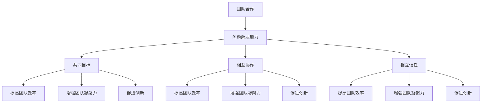
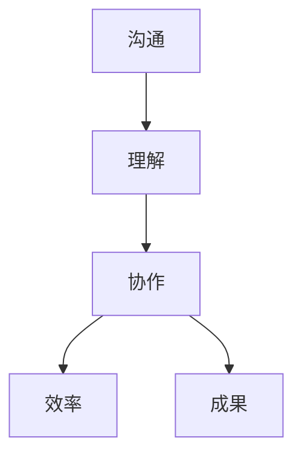
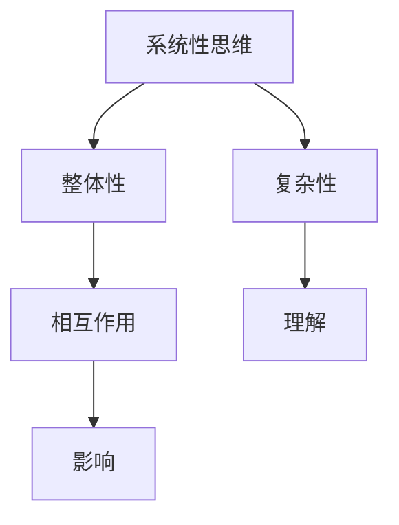
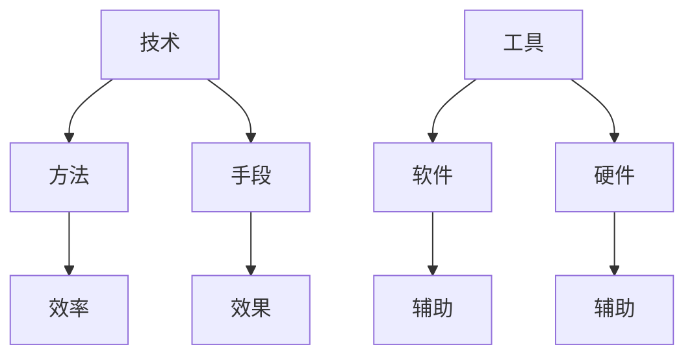
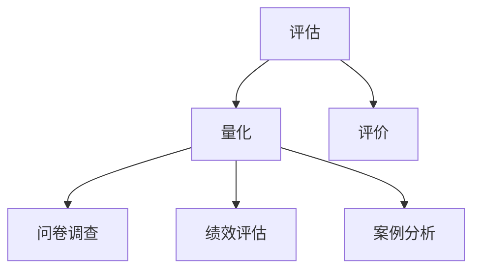
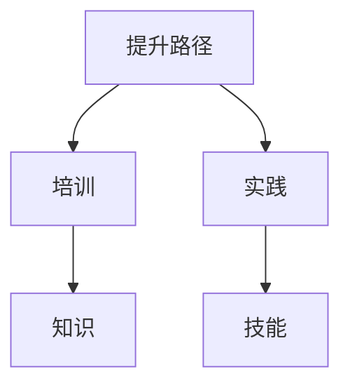

                 

## 文章标题

《如何培养团队的问题解决能力》

> 关键词：问题解决能力、团队协作、培养策略、实战案例

> 摘要：本文将从问题解决能力的定义与重要性入手，分析团队合作与问题解决能力的关系，详细阐述问题解决能力的培养策略，并通过实战案例与评估方法，为团队提升问题解决能力提供具体指导和实践路径。

## 引言

在当今快速变化和竞争激烈的商业环境中，团队的问题解决能力显得尤为重要。一个具备高效问题解决能力的团队，能够在面对复杂问题时迅速找到解决方案，提高工作效率，降低成本，提升企业的竞争力。因此，如何培养团队的问题解决能力成为企业和团队管理者亟待解决的问题。

本文旨在系统地探讨如何培养团队的问题解决能力，从理论基础到实践策略，再到实战案例与评估，提供一个全面、系统的培养方案。通过本文的阅读，读者将能够：

1. 理解问题解决能力的定义与重要性；
2. 掌握团队合作与问题解决能力的关联；
3. 学习有效的培养策略和实践方法；
4. 通过实战案例提升问题解决能力；
5. 学会评估和提升团队的问题解决能力。

## 第一部分：问题解决能力的基本概念与框架

### 第1章：问题解决能力的定义与重要性

#### 1.1 问题解决能力的内涵

问题解决能力是指个体在面对复杂问题情境时，能够有效地识别问题、分析问题、制定解决方案并实施的过程。它包括以下几个方面的能力：

- **问题识别与定义**：能够准确识别问题，并对其进行明确的界定。
- **问题分析与理解**：深入分析问题，理解其本质，找到问题的根源。
- **解决方案生成与评估**：创造性地提出解决方案，并对方案进行评估和选择。
- **实施与反馈**：执行解决方案，并根据反馈进行调整和优化。

#### 1.2 问题解决能力的重要性

问题解决能力在个人和团队层面都具有重要的意义：

- **个人层面**：良好的问题解决能力能够帮助个人在面对挑战时更加从容，提高工作效率，实现个人职业成长。
- **团队层面**：团队的问题解决能力直接影响团队的工作效率和成果，是实现团队目标的关键因素。

### 第2章：团队合作的本质与问题解决能力的关系

#### 2.1 团队合作的基础概念

团队合作是指多个个体为了共同的目标，相互协作、共同努力的过程。团队合作的基础概念包括：

- **共同目标**：团队成员共同追求的目标是团队合作的基础。
- **相互协作**：团队成员之间相互配合，发挥各自优势，共同完成任务。
- **相互信任**：团队成员之间建立信任，减少误解和冲突，提高协作效率。

#### 2.2 问题解决能力在团队中的作用

问题解决能力在团队合作中发挥着关键作用：

- **提高团队效率**：团队成员具备良好的问题解决能力，能够迅速识别和解决问题，提高团队工作效率。
- **增强团队凝聚力**：通过共同解决问题，团队成员之间建立深厚的信任和合作关系，增强团队凝聚力。
- **促进创新**：团队合作中的问题解决过程能够激发团队成员的创造力和创新思维，推动团队不断进步。

#### 2.3 团队合作与问题解决能力的协同发展

团队合作与问题解决能力是相辅相成的：

- **相互促进**：良好的团队合作能够为问题解决提供支持，而高效的问题解决能力则能增强团队的协作效果。
- **共同成长**：团队成员在解决问题的过程中，不断学习和成长，提升整体团队的能力水平。

### 图1：团队合作与问题解决能力的协同发展



## 第二部分：问题解决能力的培养策略

### 第3章：建立有效的问题解决流程

#### 3.1 问题识别与定义

**核心算法原理讲解**

```plaintext
问题识别与定义是一个迭代过程，包括以下步骤：

1. 收集信息：通过调查、访谈、数据分析等方法收集相关信息。
2. 确定关键问题：从收集的信息中筛选出关键问题，明确问题的范围和影响。
3. 定义问题：用简洁的语言明确问题的表述，包括问题的现象、原因和期望的解决效果。
```

**数学模型和公式**

```latex
定义问题：P = f(I, C, E)
其中：
P：问题
I：信息
C：关键问题
E：期望的解决效果
```

**举例说明**

**案例一**：某公司发现产品销售量持续下降。

- **信息收集**：收集销售数据、市场调查报告、客户反馈等信息。
- **确定关键问题**：分析数据，确定销售量下降的具体原因，如市场竞争加剧、产品质量问题等。
- **定义问题**：明确产品销售量下降的原因，并提出解决方案的目标，如提高产品质量、增加市场推广等。

### 第4章：提升团队沟通与协作能力

#### 4.1 团队沟通的重要性

**核心概念与联系**

- **沟通**：信息在人与人之间的传递和理解的过程。
- **协作**：团队成员共同完成工作的过程。

**Mermaid 流程图**



**核心算法原理讲解**

```plaintext
有效沟通是协作的基础，包括以下方面：

1. 明确目标：确保团队成员对目标有共同的理解。
2. 传递信息：确保信息的准确性和完整性。
3. 建立反馈机制：鼓励团队成员提出问题和建议。
4. 解决冲突：及时解决沟通中的误解和分歧。
```

### 第5章：培养团队解决问题的思维模式

#### 5.1 系统性思维

**核心概念与联系**

- **系统性思维**：从整体出发，考虑各个部分之间的相互作用和影响。

**Mermaid 流程图**



**核心算法原理讲解**

```plaintext
系统性思维包括：

1. 整体性思考：关注系统的整体结构和功能。
2. 交互性思考：分析系统内部各部分之间的相互作用。
3. 动态性思考：考虑系统在时间维度上的变化和演化。
```

### 第6章：利用技术与工具提高问题解决效率

#### 6.1 问题解决相关的技术与工具

**核心概念与联系**

- **技术**：解决问题的方法和技术手段。
- **工具**：辅助解决问题的软件和硬件设备。

**Mermaid 流程图**



**核心算法原理讲解**

```plaintext
常见的问题解决相关技术与工具包括：

1. 数据分析工具：如Excel、Python等，用于数据收集和分析。
2. 项目管理工具：如JIRA、Trello等，用于任务分配和进度跟踪。
3. 通信协作工具：如Slack、Microsoft Teams等，用于团队沟通和协作。
```

## 第三部分：实战案例与评估

### 第7章：问题解决能力培养的实战案例

#### 7.1 案例一：如何应对突发事件

**案例背景**

某公司接到紧急通知，一款畅销产品因质量问题被召回。这将对公司声誉和财务状况产生重大影响。

**解决方案**

1. **快速响应**：立即成立应急小组，组织相关部门召开紧急会议。
2. **问题分析**：调查召回原因，分析可能的影响和风险。
3. **解决方案生成**：制定召回方案，包括通知客户、退货处理、质量改进等。
4. **实施与监控**：执行召回方案，并持续监控效果。

**结果与反馈**

通过迅速行动，公司成功应对了突发事件，避免了更大的损失。同时，从这次事件中汲取教训，改进了产品质量管理流程。

### 第8章：问题解决能力的评估与提升

#### 8.1 问题解决能力评估的方法

**核心概念与联系**

- **评估**：对问题解决能力进行量化和评价。
- **方法**：常用的评估方法包括问卷调查、绩效评估、案例分析等。

**Mermaid 流程图**



**核心算法原理讲解**

```plaintext
问题解决能力评估的方法：

1. 问卷调查：通过设计问卷，收集团队成员对问题解决能力的自我评价。
2. 绩效评估：通过绩效数据，评估团队成员在问题解决过程中的表现。
3. 案例分析：通过具体案例，分析团队成员在解决问题中的表现和不足。
```

#### 8.2 问题解决能力的提升路径

**核心概念与联系**

- **提升路径**：通过培训和持续实践，提升团队的问题解决能力。

**Mermaid 流程图**



**核心算法原理讲解**

```plaintext
提升问题解决能力的方法：

1. 培训：组织问题解决能力相关的培训课程，提高团队成员的理论知识。
2. 实践：通过实际项目，锻炼团队成员的问题解决技能。
3. 反馈与改进：根据评估结果，持续优化培训和实践策略。
```

### 结论

通过本文的讨论，我们可以看到，培养团队的问题解决能力是一项系统性工程，需要从理论到实践，从沟通到技术，全方位地提升团队的能力。只有通过不断地学习和实践，团队才能在复杂多变的环境中，高效地解决问题，实现持续发展。

**作者：AI天才研究院/AI Genius Institute & 禅与计算机程序设计艺术 /Zen And The Art of Computer Programming**

