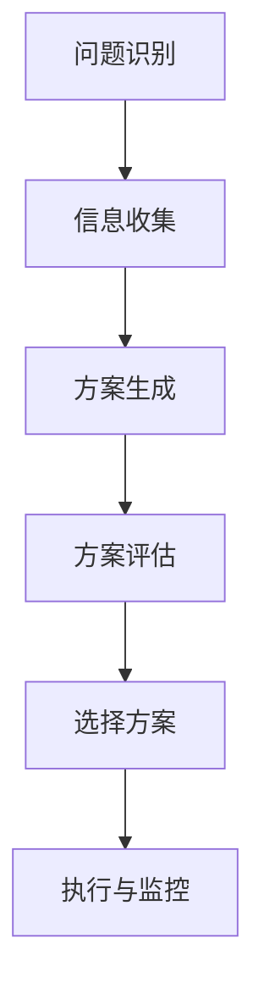
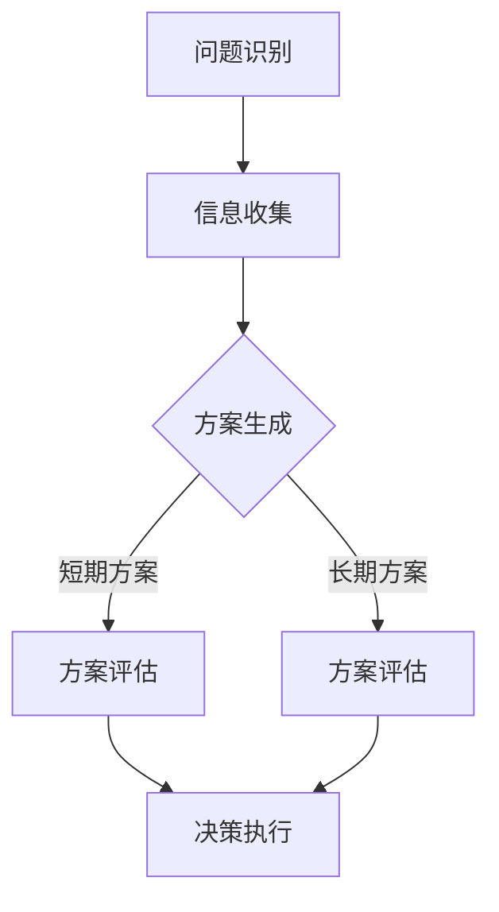

                 

### 引言

在信息化快速发展的当今时代，团队决策在企业运营和项目管理中扮演着至关重要的角色。无论是市场策略的制定、产品的研发设计，还是日常运营中的资源配置，决策的正确性和速度直接影响着企业的竞争力和执行力。一个高效的决策过程不仅能帮助团队迅速应对市场变化，还能确保资源的合理利用，从而推动企业的持续发展。

然而，现实中的团队决策并非总是顺利。由于信息不对称、沟通不畅、个人偏见以及时间压力等因素，团队往往面临决策质量低下、决策过程冗长等问题。这些问题不仅影响了团队的工作效率，更可能导致战略失误、市场机会流失，甚至损害企业的整体利益。

为了应对这些挑战，提高团队决策的质量和速度成为企业管理者和团队成员共同关注的焦点。本文旨在通过系统的分析和具体的策略，帮助团队从理论和实践两方面提升决策能力。

本文将采用逻辑清晰、结构紧凑、简单易懂的专业技术语言，逐步探讨以下内容：

1. **团队决策的重要性**：介绍团队决策在企业运作中的关键作用。
2. **当前团队决策面临的挑战**：分析影响决策质量的关键因素。
3. **团队决策理论**：介绍团队决策的基本概念、原则和方法。
4. **决策质量评估**：探讨如何评估团队决策的质量，包括评估指标、方法和案例分析。
5. **决策速度提升**：讨论如何通过优化决策流程、引入技术工具和改进团队协作来提升决策速度。
6. **案例分析**：通过实际案例展示如何应用上述理论和工具。
7. **实践指南**：总结提升决策质量和速度的实用方法和策略。

通过本文的阅读，读者将能够理解团队决策的基本原理，掌握评估决策质量和速度的方法，并学会在实际工作中应用这些策略，从而提高团队的整体决策能力。

### 关键词

- 团队决策
- 决策质量
- 决策速度
- 决策过程
- 团队协作
- 决策模型
- 决策评估
- 决策优化

### 摘要

本文围绕团队决策的质量和速度提升，系统地分析了当前团队决策面临的主要挑战和应对策略。首先，介绍了团队决策在企业运作中的重要性，并分析了影响决策质量的关键因素。接着，本文探讨了团队决策的基本概念、原则和方法，包括决策过程、团队动态和决策质量评估。在此基础上，文章详细阐述了如何通过优化决策流程、引入技术工具和改进团队协作来提升决策速度。随后，通过实际案例分析，展示了理论和方法在实践中的应用效果。最后，本文总结提出了提升决策质量和速度的实用方法和策略，为团队决策提供了有效的参考。通过本文的阅读，读者能够更好地理解和应用团队决策的相关理论和工具，从而提高团队的决策能力。

### 团队决策的重要性

团队决策在企业运作中具有至关重要的作用。首先，团队决策能够确保企业在面对复杂多变的市场环境时，能够迅速作出有效的反应。在竞争激烈的市场中，时间就是金钱，快速准确的决策可以帮助企业抓住市场机遇，避免潜在的风险。其次，团队决策有助于资源的合理配置。在企业的运营过程中，资源是有限的，如何有效地分配和利用这些资源，直接关系到企业的生存和发展。通过团队决策，可以确保资源配置的科学性和合理性，避免资源浪费和重复投资。最后，团队决策还能够促进团队协作，增强团队凝聚力。在决策过程中，团队成员需要充分沟通、协作，共同解决问题，这不仅能够提高决策的质量，还能够增进团队成员之间的了解和信任，从而提升团队的整体执行力。

在实际应用中，团队决策对企业的影响是多方面的。以产品研发为例，一个高效的团队决策过程可以确保产品的创新性、市场适应性和技术可行性。在项目实施阶段，通过团队决策，可以及时发现和解决项目中的问题，确保项目按计划推进。在市场战略制定阶段，团队决策可以帮助企业准确把握市场趋势，制定符合市场需求的发展策略。此外，在人力资源管理、财务规划等方面，团队决策也发挥着重要作用，确保企业在各个方面都能够高效运作。

总之，团队决策是企业实现战略目标、提高市场竞争力和运营效率的关键环节。一个高效的团队决策过程不仅能够帮助企业应对各种挑战，还能够提升企业的整体竞争力，促进企业的可持续发展。因此，理解和掌握团队决策的原理和方法，对于企业管理和团队建设具有重要意义。

### 当前团队决策面临的挑战

尽管团队决策在企业发展中具有重要作用，但实际操作中，团队决策面临诸多挑战，这些挑战往往导致决策质量下降、决策过程延长，甚至影响企业的整体运营效率。以下是当前团队决策面临的主要挑战：

**1. 信息不对称**

信息不对称是团队决策中的一个常见问题。团队成员之间获取的信息可能存在差异，导致部分成员在决策时缺乏全面的信息支持。信息不对称不仅会影响决策的准确性，还可能导致团队成员之间的信任问题，降低团队合作的效率。

**2. 沟通不畅**

沟通不畅是影响团队决策质量的另一个关键因素。团队成员之间的沟通不畅可能导致信息传递不准确、不及时，甚至出现误解。有效的沟通是团队决策的基础，缺乏良好的沟通机制会导致决策过程中出现许多不必要的误解和重复工作。

**3. 个人偏见**

个人偏见是影响团队决策质量的重要因素。团队成员可能因为个人经验、观点或情感因素，在决策过程中产生偏见。这种偏见不仅会影响决策的客观性，还可能导致团队成员之间的分歧，进一步影响决策的质量和速度。

**4. 时间压力**

在快速变化的市场环境中，时间压力常常成为团队决策的制约因素。为了尽快作出决策，团队可能会忽视一些重要的信息和分析，导致决策质量不高。此外，时间压力还可能促使团队采取一些短期行为，损害企业的长期利益。

**5. 决策流程复杂**

复杂的决策流程也是影响团队决策质量和速度的重要因素。在实际操作中，决策流程可能涉及多个环节和部门，需要大量的协调和沟通。如果决策流程过于复杂，不仅会增加决策的时间成本，还可能降低决策的效率。

**6. 决策支持系统不足**

现代企业中，决策支持系统（DSS）是辅助决策的重要工具。然而，许多企业的决策支持系统并不完善，无法提供全面、准确的数据和分析支持，导致决策过程中信息不足，难以作出科学、合理的决策。

**7. 团队成员能力差异**

团队成员的能力差异也是影响团队决策质量和速度的一个重要因素。在能力差异较大的团队中，往往会出现一些成员在决策过程中占据主导地位，而其他成员的意见和建议得不到充分重视，这不仅影响了决策的质量，还可能损害团队成员的积极性和参与度。

总之，当前团队决策面临的信息不对称、沟通不畅、个人偏见、时间压力、决策流程复杂、决策支持系统不足和团队成员能力差异等诸多挑战，都需要通过科学的方法和策略来应对，以提高团队决策的质量和速度。

### 团队决策理论

团队决策理论是研究团队在决策过程中如何进行有效协作、信息共享以及如何最大化决策质量的科学。这一理论涉及多个核心概念和原则，包括决策过程、团队动态、决策模型和算法等。

**1. 决策过程**

决策过程是指从问题识别、信息收集、方案生成、评估选择到最终执行和监控的一系列步骤。一个有效的决策过程不仅需要明确每个步骤的具体任务，还需要确保各个步骤之间的高效衔接。

**决策过程的步骤：**

- **问题识别**：明确团队需要解决的问题或面临的机会。
- **信息收集**：收集与问题相关的各种信息，包括市场数据、客户反馈、竞争对手分析等。
- **方案生成**：基于收集到的信息，团队成员共同生成多种可能的解决方案。
- **方案评估**：对每个方案进行评估，包括成本、风险、收益等多个方面。
- **选择方案**：根据评估结果选择最优或次优的方案。
- **执行与监控**：将决策方案付诸实施，并持续监控执行效果，根据实际情况进行调整。

**Mermaid流程图：**



**2. 团队动态分析**

团队动态分析涉及团队成员的角色与职责、沟通与协作等方面，是保证决策过程顺利进行的重要基础。

**团队成员的角色与职责：**

- **领导者**：负责指导决策过程，协调团队成员之间的工作。
- **信息提供者**：提供与决策相关的各类信息和数据。
- **方案制定者**：负责生成和改进决策方案。
- **评估者**：对方案进行评估和选择。
- **执行者**：负责实施决策方案。

**团队沟通与协作：**

- **沟通机制**：建立有效的沟通渠道，确保信息传递的及时性和准确性。
- **协作工具**：使用协作工具，如项目管理软件、团队沟通平台等，提高协作效率。
- **共同目标**：确保团队成员具有共同的目标和愿景，增强团队凝聚力。

**3. 决策质量评估**

决策质量评估是衡量决策结果是否达到预期目标的重要手段。通过设定评估指标和方法，可以全面评估决策的质量。

**评估指标的选择：**

- **准确性**：决策结果与实际情况的符合程度。
- **一致性**：团队成员对决策结果的一致认同度。
- **效率**：决策过程所需的时间和资源。
- **可行性**：决策方案的可操作性和实施可能性。

**评估方法：**

- **定量评估**：使用统计数据、绩效指标等量化方法进行评估。
- **定性评估**：通过专家评审、用户反馈等方式进行主观评估。

**伪代码描述评估算法的基本框架：**

```python
def evaluate_decision(decision, actual_result, target_goal):
    accuracy = calculate_accuracy(decision, actual_result)
    consistency = calculate_consistency(decision)
    efficiency = calculate_efficiency(decision)
    feasibility = calculate_feasibility(decision)
    
    decision_score = (accuracy * weight_accuracy +
                      consistency * weight_consistency +
                      efficiency * weight_efficiency +
                      feasibility * weight_feasibility)
    return decision_score
```

**4. 决策模型与算法**

决策模型与算法是指导团队进行决策的数学工具，可以用于优化决策过程，提高决策质量。

**经典决策模型：**

- **期望效用理论**：通过计算各方案的概率分布和效用值，选择效用最大的方案。
- **贝叶斯决策理论**：利用贝叶斯定理更新决策概率，选择具有最高后验概率的方案。

**现代决策算法：**

- **机器学习算法**：如决策树、随机森林、支持向量机等，通过历史数据预测最佳决策。
- **神经网络算法**：如深度学习模型，通过多层神经网络学习复杂决策关系。

**5. 团队决策的挑战与应对**

团队决策过程中可能会遇到各种挑战，如信息不对称、沟通不畅、个人偏见等。针对这些挑战，可以采取以下应对策略：

- **建立透明沟通机制**：确保信息传递的及时性和准确性，减少信息不对称。
- **培养团队合作精神**：通过团队建设活动和培训，增强团队成员的协作意识和凝聚力。
- **使用科学决策工具**：引入决策支持系统和其他辅助工具，提高决策的科学性和效率。

通过理解团队决策理论的核心概念和原则，团队可以更有效地应对决策过程中遇到的挑战，提高决策的质量和速度。

### 决策质量评估

决策质量评估是确保团队决策有效性和合理性的关键环节。通过科学、系统的评估方法，可以全面了解决策的结果是否符合预期，并不断优化决策过程。本文将详细探讨决策质量评估的指标、方法和应用。

#### 1. 评估指标的选择

决策质量评估指标是衡量决策效果的重要工具。选择合适的评估指标，可以帮助团队更准确地评估决策的质量。以下是一些常用的评估指标：

**1.1 准确性**

准确性是评估决策结果与实际情况符合程度的指标。高准确性的决策意味着决策结果在实际操作中能够达到预期目标。

**1.2 一致性**

一致性评估团队成员对决策结果的一致认同度。高一致性的决策意味着团队成员对决策结果没有异议，能够齐心协力地执行决策。

**1.3 效率**

效率评估决策过程所需的时间和资源。高效的决策能够在较短的时间内完成，并利用有限的资源产生最大的效益。

**1.4 可行性**

可行性评估决策方案的实际可操作性和实施可能性。高可行性的决策方案能够在实际操作中顺利实施，不会因为资源或技术限制而失败。

**1.5 创新性**

创新性评估决策方案的创新程度和新颖性。高创新性的决策能够为企业带来独特的竞争优势。

**1.6 可持续性**

可持续性评估决策方案对企业长期发展的影响。可持续性的决策方案能够确保企业在未来能够持续发展，而不是仅仅追求短期利益。

#### 2. 常见评估方法

在决策质量评估中，定量评估和定性评估是两种常见的方法。

**2.1 定量评估方法**

定量评估方法使用统计数据、绩效指标等量化工具，对决策效果进行量化分析。以下是一些常用的定量评估方法：

**2.1.1 成本效益分析**

成本效益分析（CBA）是评估决策成本和收益的一种方法。通过计算决策的净收益（总收益 - 总成本），可以评估决策的经济效益。

**2.1.2 价值评估模型**

价值评估模型（如净现值法、内部收益率法）是评估决策财务效益的常用方法。这些模型通过计算决策的财务指标，如净现值（NPV）和内部收益率（IRR），来评估决策的可行性。

**2.1.3 绩效指标分析**

绩效指标分析是通过设定具体的绩效指标，如销售额、市场份额、客户满意度等，来评估决策对业务绩效的影响。

**2.2 定性评估方法**

定性评估方法通过专家评审、用户反馈等方式进行主观评估。以下是一些常用的定性评估方法：

**2.2.1 专家评审**

专家评审是由行业专家或资深人士对决策结果进行评估。这种方法可以提供深入的见解和专业的建议。

**2.2.2 用户反馈**

用户反馈是通过调查用户对决策结果的满意度和体验来评估决策的质量。这种方法能够直接了解决策对用户的影响。

**2.2.3 语义分析**

语义分析是通过自然语言处理技术，对用户反馈和评估报告进行文本分析，提取关键信息，评估决策的影响。

#### 3. 评估方法的应用

**3.1 项目决策质量评估**

在项目决策过程中，评估方法可以帮助团队确定项目目标、制定项目计划、评估项目风险等。以下是一个项目决策质量评估的示例：

- **准确性评估**：通过实际项目进展与计划目标的对比，评估项目目标的实现程度。
- **一致性评估**：通过团队成员对项目计划的认同度和执行情况，评估团队的一致性。
- **效率评估**：通过项目执行时间与计划时间的对比，评估项目执行的效率。
- **可行性评估**：通过资源调配和风险评估，评估项目计划的可行性。
- **创新性评估**：通过项目的技术创新和市场创新程度，评估项目的创新性。
- **可持续性评估**：通过项目对环境、社会和经济的影响，评估项目的可持续性。

**3.2 团队成员决策质量评估**

团队成员决策质量评估可以用于评估团队成员的决策能力和表现。以下是一个团队成员决策质量评估的示例：

- **准确性评估**：通过团队成员在项目中的决策结果，评估决策的准确性。
- **一致性评估**：通过团队成员对决策结果的认同度，评估团队的一致性。
- **效率评估**：通过团队成员在决策过程中的时间投入，评估决策的效率。
- **可行性评估**：通过团队成员对决策方案的执行情况，评估决策的可行性。
- **创新性评估**：通过团队成员在决策过程中的创新建议，评估决策的创新性。

#### 4. 提升决策质量的策略

为了提升决策质量，团队可以采取以下策略：

- **数据驱动决策**：通过收集和分析数据，确保决策基于事实和证据。
- **多角度评估**：综合使用定量和定性评估方法，全面评估决策质量。
- **持续反馈与改进**：通过定期评估和反馈，不断优化决策过程和方案。
- **团队协作**：建立有效的沟通和协作机制，确保团队成员的意见和建议得到充分重视。
- **培训与发展**：通过培训和发展，提高团队成员的决策能力和专业素养。

通过科学、系统的决策质量评估方法，团队可以不断优化决策过程，提高决策质量，从而更好地应对企业运营和项目管理中的各种挑战。

### 决策速度提升

在快速变化的市场环境中，提升团队决策速度是确保企业保持竞争优势的关键。高效的决策不仅能够帮助团队迅速响应市场变化，还能确保资源的合理利用和战略的灵活调整。本文将探讨如何通过优化决策流程、引入技术工具和改进团队协作来提升决策速度。

#### 1. 决策流程优化

优化决策流程是提升决策速度的基础。一个高效的决策流程能够减少冗余步骤，提高决策效率。

**1.1 流程分析**

首先，团队需要对其现有决策流程进行详细分析，识别流程中的瓶颈和低效环节。这可以通过以下步骤完成：

- **流程图绘制**：使用流程图工具（如Mermaid）绘制现有决策流程，明确每个步骤和决策节点。
- **瓶颈识别**：分析流程图，识别导致决策流程缓慢的瓶颈环节，如重复审批、沟通不畅等。
- **时间评估**：对每个步骤所需的时间进行评估，找出时间消耗最多的环节。

**Mermaid流程图示例：**



**1.2 流程优化方法**

基于流程分析的结果，团队可以采取以下方法进行流程优化：

- **简化审批流程**：减少不必要的审批环节，确保决策流程的简洁和高效。
- **明确责任分工**：明确每个团队成员在决策流程中的职责和任务，避免职责重叠和推诿现象。
- **使用模板和标准操作流程**：为常见决策制定模板和标准操作流程，减少重复性工作。
- **并行处理**：将可以并行处理的决策节点同时进行，减少整体决策时间。

#### 2. 引入技术工具

现代技术的快速发展为团队决策提供了多种工具，这些工具能够显著提升决策速度和准确性。

**2.1 决策支持系统（DSS）**

决策支持系统（DSS）是辅助团队进行决策的软件工具，通过提供数据分析和预测功能，帮助团队做出更科学的决策。以下是一些DSS的特点：

- **数据集成**：整合来自多个数据源的信息，提供全面的数据支持。
- **可视化分析**：通过图表和可视化工具，帮助团队直观地理解数据和分析结果。
- **预测模型**：利用机器学习和统计分析方法，预测决策结果，提供决策建议。

**2.2 数据分析工具**

数据分析工具能够帮助团队快速处理大量数据，提取有价值的信息。以下是一些常见的数据分析工具：

- **Excel**：用于数据整理和初步分析，适用于中小规模的数据处理。
- **SQL**：用于数据库查询和数据分析，适用于结构化数据的处理。
- **Python**：用于复杂的数据分析和建模，适用于大规模数据处理的编程语言。

**2.3 人工智能与机器学习**

人工智能（AI）和机器学习（ML）技术在决策中的应用越来越广泛，可以帮助团队自动化决策流程，提高决策速度。以下是一些AI和ML在决策中的应用：

- **自动化决策**：通过建立自动化决策系统，减少人工干预，提高决策速度。
- **预测分析**：利用历史数据预测未来趋势，为决策提供科学依据。
- **优化算法**：使用优化算法，如线性规划、遗传算法等，为复杂决策提供最优解。

#### 3. 团队协作改进

团队协作是提升决策速度的关键因素。通过改进团队协作，可以减少信息传递的滞后和沟通不畅，提高决策效率。

**3.1 协作工具的选择**

选择合适的协作工具，可以提高团队协作的效率。以下是一些常用的协作工具：

- **项目管理软件**：如Trello、JIRA等，用于任务分配、进度追踪和团队协作。
- **沟通平台**：如Slack、Microsoft Teams等，用于实时沟通和信息共享。
- **文档协作工具**：如Google Docs、Microsoft Office 365等，用于多人实时编辑文档。

**3.2 协作机制的建立**

建立有效的协作机制，可以确保团队成员之间的沟通顺畅、信息共享及时。以下是一些协作机制的建立方法：

- **每日站会**：通过每日站会，团队成员可以快速交流进展、问题和计划。
- **任务看板**：使用任务看板，团队成员可以清晰地看到任务的进展和状态，避免重复工作和资源浪费。
- **共享文档库**：建立共享文档库，确保所有团队成员能够访问到最新和最相关的信息。

#### 4. 决策速度的评估与监控

为了确保决策速度的提升达到预期效果，团队需要定期评估和监控决策速度，并根据实际情况进行调整。

**4.1 速度评估指标**

可以设置以下指标来评估决策速度：

- **平均决策时间**：评估团队从问题识别到决策执行的平均时间。
- **决策周期**：评估决策流程中的每个节点的平均处理时间。
- **决策响应速度**：评估团队对紧急问题和市场变化的响应速度。

**4.2 速度监控方法**

以下是一些监控决策速度的方法：

- **时间跟踪工具**：使用时间跟踪工具，如Toggl、RescueTime等，记录团队成员的工作时间和决策时间，分析决策速度。
- **绩效指标分析**：通过绩效指标分析，评估决策对业务绩效的影响，确保决策速度的提升能够带来实际的业务效果。
- **团队反馈**：定期收集团队成员的反馈，了解他们在决策过程中的感受和意见，识别改进空间。

#### 结论

通过优化决策流程、引入技术工具和改进团队协作，团队可以显著提升决策速度。优化流程可以减少决策时间，技术工具可以提供数据支持和自动化决策，协作改进可以提高团队协作效率。定期的评估与监控可以帮助团队不断优化决策过程，确保决策速度的提升能够带来实际的业务效果。通过这些策略，团队可以在快速变化的市场环境中保持竞争优势，实现可持续发展。

### 案例分析

在实际应用中，提升团队决策质量和速度的策略往往需要通过具体案例来验证其有效性和适用性。以下我们将通过几个不同行业和情境的案例，展示如何在实际团队中应用这些策略，并分析其效果。

#### 案例一：提高项目管理决策质量

**背景**：某高科技公司正在开发一款新产品，项目周期为12个月。由于市场变化迅速，项目进度和质量面临着巨大的压力。

**策略**：

1. **决策流程优化**：项目团队首先对现有的决策流程进行了详细分析，通过使用Mermaid流程图，明确了问题识别、信息收集、方案生成、方案评估和决策执行的每个步骤。团队发现审批环节过于复杂，导致决策周期过长。

2. **决策支持系统引入**：团队引入了一个基于人工智能的决策支持系统（DSS），该系统能够自动收集和分析市场数据、用户反馈和竞争对手信息，为决策提供实时数据支持。

3. **团队协作改进**：团队采用了项目管理工具Trello来分配任务、追踪进度和沟通协作。通过每日站会和任务看板，团队成员能够实时了解项目进展和问题，及时调整决策方向。

**效果**：

- **决策质量提升**：通过DSS的数据支持，项目团队能够更准确地评估不同方案的优劣，决策过程变得更加科学和客观。
- **决策速度提升**：由于流程优化和工具的使用，决策周期从原来的两周缩短到一周，项目进度得到了显著提高。
- **团队协作增强**：团队成员之间的沟通更加顺畅，任务分配和执行更加高效，项目团队的凝聚力得到了增强。

#### 案例二：加快市场决策速度

**背景**：某消费品公司需要快速调整市场策略，以应对竞争对手的新产品发布。

**策略**：

1. **信息收集和评估优化**：市场团队建立了快速信息收集机制，通过社交媒体监控、市场调研和竞争对手分析，确保获得最新的市场信息。同时，团队使用Excel和Python进行数据分析，快速提取有价值的信息。

2. **引入数据分析工具**：团队引入了Tableau等数据分析工具，将复杂的数据可视化，帮助团队成员更直观地理解市场趋势和用户需求。

3. **决策会议改进**：团队改变了决策会议的形式，通过线上视频会议和实时投票系统，使决策会议更加高效。会议过程中，团队成员可以实时提出意见和建议，并进行讨论和投票。

**效果**：

- **信息获取速度提升**：通过快速信息收集机制和数据分析工具，市场团队能够迅速获取和处理大量信息，为决策提供及时的支持。
- **决策速度提升**：决策会议从原来的几天缩短到几小时，市场策略调整更加灵活，能够迅速应对市场变化。
- **决策质量提高**：团队成员的参与度和责任感增强，决策过程中信息更加全面和准确，市场策略调整更加有效。

#### 案例三：团队协作提升决策效率

**背景**：某创业公司成立初期，团队成员分散在不同城市，需要高效协作完成产品开发。

**策略**：

1. **协作工具选择**：公司采用了Slack作为主要的沟通平台，并结合Google Docs进行文档协作。Slack的实时消息和频道功能使得团队成员之间的沟通更加便捷，而Google Docs的多人实时编辑功能提高了文档协作的效率。

2. **任务管理工具引入**：公司引入了JIRA进行任务管理，明确了每个团队成员的任务和进度，通过任务看板和迭代管理，团队可以更好地掌控项目进度。

3. **定期团队建设**：公司定期组织线上团队建设活动，如团队游戏、虚拟聚餐等，增强团队成员之间的情感联系，提升团队的凝聚力。

**效果**：

- **协作效率提升**：通过协作工具和任务管理工具，团队成员之间的沟通和协作变得更加高效，任务分配和执行更加透明。
- **决策速度提升**：团队成员能够快速沟通和协作，决策过程更加迅速，项目进度得到了显著提高。
- **团队凝聚力增强**：通过团队建设活动，团队成员之间的信任和合作精神得到了增强，团队的战斗力得到提升。

通过以上案例分析，可以看出，通过优化决策流程、引入技术工具和改进团队协作，团队可以显著提升决策质量和速度。这些策略不仅适用于高科技公司和消费品公司，还可以为其他行业的团队提供有益的参考。在实际应用中，团队需要根据自身特点和需求，灵活选择和调整策略，以实现最佳效果。

### 实践指南

为了在团队中有效提升决策质量和速度，以下是具体的实践指南，包括提升决策质量的具体步骤、提升决策速度的关键技巧、团队决策最佳实践以及培养团队成员的决策能力。

#### 提升决策质量的具体步骤

1. **建立决策框架**：
   - 明确团队的目标和愿景，确保每个决策都与整体目标一致。
   - 制定决策流程，包括问题识别、信息收集、方案生成、评估选择和执行监控等环节。

2. **数据驱动决策**：
   - 收集与决策相关的数据，包括市场趋势、竞争对手分析和用户反馈等。
   - 使用数据分析工具和模型，对数据进行分析和预测，为决策提供科学依据。

3. **多角度评估**：
   - 设定多种评估指标，如准确性、一致性、效率、可行性和创新性，全面评估决策质量。
   - 结合定量和定性评估方法，确保决策的客观性和全面性。

4. **透明沟通机制**：
   - 建立透明、高效的沟通机制，确保信息传递的及时性和准确性。
   - 定期召开决策会议，鼓励团队成员发表意见和建议。

5. **持续反馈与改进**：
   - 定期收集团队成员的反馈，识别决策过程中的问题和改进空间。
   - 根据反馈结果，调整和优化决策流程和方案，不断提高决策质量。

#### 提升决策速度的关键技巧

1. **简化决策流程**：
   - 识别并去除冗余和低效的决策环节，减少不必要的审批和重复工作。
   - 采用标准化操作流程，提高决策的效率。

2. **引入决策支持工具**：
   - 使用决策支持系统（DSS）和数据可视化工具，提供实时数据和预测分析。
   - 利用人工智能和机器学习算法，自动化决策过程，减少人工干预。

3. **并行处理**：
   - 在决策过程中，尽量采用并行处理方法，同时进行多个决策节点，缩短整体决策时间。

4. **快速反馈机制**：
   - 建立快速反馈机制，确保决策结果能够迅速得到验证和调整。
   - 通过定期的评估和反馈，及时发现问题，提高决策效率。

#### 团队决策最佳实践

1. **明确角色和职责**：
   - 确定团队成员的角色和职责，确保每个人了解自己的任务和期望成果。
   - 领导者要发挥协调和引导作用，确保决策过程顺利进行。

2. **建立协作文化**：
   - 培养团队成员的协作精神，鼓励信息共享和互相支持。
   - 使用协作工具，如项目管理软件和沟通平台，提高团队协作效率。

3. **鼓励创新和多元化**：
   - 鼓励团队成员提出创新意见和建议，确保决策过程中有多个方案可供选择。
   - 尊重多元化，确保不同观点和经验得到充分重视。

4. **定期培训和交流**：
   - 定期组织培训和学习活动，提升团队成员的决策能力和专业素养。
   - 通过内部交流和外部学习，借鉴其他团队的成功经验。

#### 培养团队成员的决策能力

1. **提供实践机会**：
   - 通过实际项目和工作任务，让团队成员参与决策过程，积累实践经验。
   - 为团队成员提供试错机会，鼓励他们从失败中学习，提升决策能力。

2. **培训和指导**：
   - 定期开展决策培训，介绍决策理论和工具，提升团队成员的理论水平。
   - 配备导师，对团队成员进行一对一指导和反馈，帮助他们提高决策能力。

3. **建立反馈机制**：
   - 建立定期的反馈机制，收集团队成员的意见和建议，识别改进空间。
   - 通过反馈结果，制定个性化的提升计划，帮助团队成员不断进步。

通过以上实践指南，团队可以系统地提升决策质量和速度，确保在快速变化的市场环境中保持竞争力。通过不断优化决策流程、引入技术工具和培养团队成员的决策能力，团队能够在决策过程中更加科学、高效地应对各种挑战。

### 附录

#### 术语解释

1. **决策支持系统（DSS）**：一种计算机程序，旨在辅助决策者进行决策，通过数据分析、模型构建和可视化工具提供决策支持。
2. **决策模型**：描述决策过程和决策规则的结构化框架，如线性规划、决策树和贝叶斯网络等。
3. **团队动态**：团队在决策过程中表现出的行为模式，包括沟通、协作和信息共享等。
4. **评估指标**：用于衡量决策质量的具体参数，如准确性、一致性和效率等。
5. **决策质量评估**：对决策结果进行系统评价的过程，以确定决策是否符合预期目标。

#### 参考文献

1. Machover, C. (2017). The Art of Decision Making: Who Gets What and Why. Hachette.
2. Raiffa, H. (1968). Decision Analysis: Introductory Readings on Choices Under Uncertainty. Addison-Wesley.
3. Thompson, J. D. (2003). Understanding Normal and Abnormal Decision Making. Oxford University Press.
4. von Winterfeldt, D., & Edwards, W. (1986). Decision Analysis: An Introduction to Decision Analysis. Reading, MA: Addison-Wesley.
5. Muscio, A. (2019). The Decision Book: 50 Models for Strategic Thinking. Arsenal Pulp Press.

#### 扩展阅读资源

1. **在线课程**：
   - Coursera: Decision-Making in Organizations
   - edX: Introduction to Data, Models, and Decisions
2. **书籍推荐**：
   - 《决策心理学》（Daniel Kahneman 著）
   - 《决策分析实践》（Herbert Simon 著）
   - 《智能决策：人工智能与决策科学》（Antoine Paris 著）
3. **学术论文**：
   - Google Scholar: 搜索“team decision-making”
   - ResearchGate: 搜索“improving decision quality and speed”

通过阅读这些资源和文献，读者可以进一步深入理解团队决策的原理和实践，为实际工作提供更多参考和灵感。

