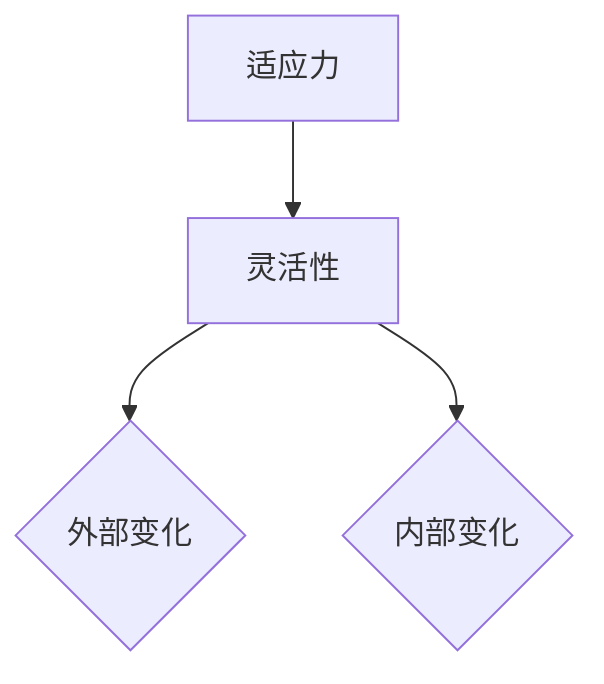
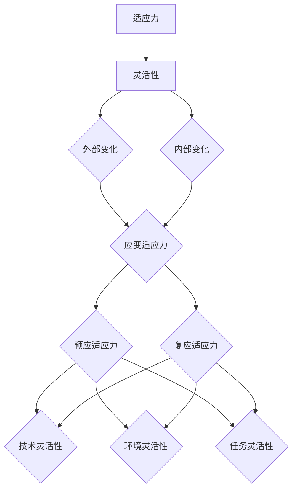
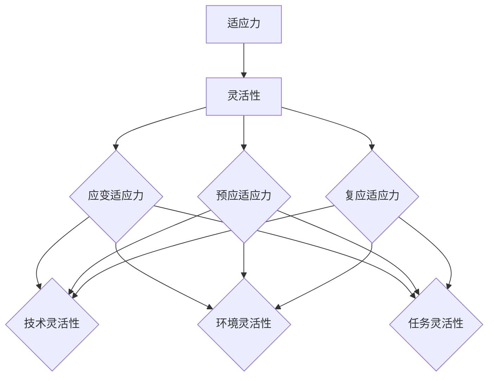

                 

# 如何提高团队的适应力和灵活性

## 文章关键词
团队适应力，团队灵活性，敏捷开发，团队文化，技能提升，工具和平台，案例分析，评估与优化

## 摘要
本文旨在探讨如何提高团队的适应力和灵活性，以应对快速变化的技术环境和市场需求。首先，我们将定义适应力和灵活性，并分析它们在团队工作中的重要性。接着，通过构建适应力和灵活性的框架，我们识别出影响团队适应力和灵活性的关键因素。本文将详细探讨提高团队适应力和灵活性的策略，包括建立适应性文化、提升团队成员技能、引入敏捷开发方法和利用工具与平台。通过成功案例分析和实战指导，我们将展示如何实施这些策略。最后，我们将讨论如何评估团队适应力和灵活性，并提出优化策略，以持续提升团队绩效。展望未来，我们将探讨团队适应力和灵活性在数字化转型和人工智能应用中的重要性。

## 第一部分：团队适应力和灵活性概述

### 第1章：适应力与灵活性的概念与重要性

#### 1.1 适应力的定义与类型

适应力是一个团队应对外部和内部变化的能力。外部变化可能包括市场需求的变化、竞争环境的变化、技术进步等；内部变化则可能涉及团队结构的调整、成员技能的更新、管理风格的变化等。适应力的类型可以分为以下几种：

1. **应变适应力**：团队迅速调整以应对突发外部变化的能力。
2. **预应适应力**：团队在变化发生前就预见并准备应对的能力。
3. **复应适应力**：团队在变化发生后迅速恢复并维持高效运作的能力。

#### 1.2 灵活性的定义与类型

灵活性是指团队快速适应新技术、新方法、新环境和新任务的能力。灵活性的类型包括：

1. **技术灵活性**：团队采用新技术和新工具的能力。
2. **环境灵活性**：团队在新的工作环境中迅速适应并发挥作用的能力。
3. **任务灵活性**：团队在面对不同任务时灵活调整策略和方法的能力。

#### 1.3 团队适应力与灵活性的关系

团队适应力和灵活性密切相关，两者相辅相成。适应力为团队提供了应对变化的坚实基础，而灵活性则使团队能够在变化中快速行动和调整。我们可以用以下图示来表示两者之间的关系：

#### 1.4 团队适应力和灵活性在团队工作中的重要性

团队适应力和灵活性对于团队的成功至关重要。首先，适应力使团队能够在市场需求变化时迅速调整策略，保持竞争力。其次，灵活性使团队能够快速适应新技术，提高工作效率。此外，适应力和灵活性还能增强团队的凝聚力，提高团队成员的工作满意度和忠诚度。总的来说，提高团队适应力和灵活性有助于团队在复杂多变的环境中保持稳定和高效运作。

### 第2章：团队适应力和灵活性框架

#### 2.1 团队适应力和灵活性的评估指标

为了准确评估团队的适应力和灵活性，我们可以采用以下评估指标：

1. **变化响应速度**：团队在识别和响应外部变化所需的时间。
2. **学习与适应能力**：团队成员在新技术或新环境下的学习和适应速度。
3. **创新和创造力**：团队在应对变化时提出新思路和新方法的能力。
4. **团队协作**：团队成员在变化中的协作效率和质量。

#### 2.2 团队适应力和灵活性的影响因素

团队适应力和灵活性受多种因素影响。以下是主要影响因素：

1. **团队成员经验**：团队成员的经验越丰富，适应变化的能力越强。
2. **团队沟通与协作**：良好的沟通和协作有助于团队在变化中保持高效运作。
3. **团队文化**：支持变化和创新的文化有助于提高团队的适应力和灵活性。
4. **外部环境变化**：外部环境的变化频率和程度直接影响团队的适应力和灵活性。
5. **资源投入**：资源投入的多少直接影响团队在适应力和灵活性方面的表现。

#### 2.3 团队适应力和灵活性的关系架构

为了更好地理解团队适应力和灵活性的关系，我们可以使用以下Mermaid流程图：

### 小结
本章详细介绍了团队适应力和灵活性的概念、类型和关系。通过定义适应力和灵活性，我们了解了它们在团队工作中的重要性。接着，我们构建了团队适应力和灵活性的框架，并分析了影响这些能力的各种因素。最后，我们通过Mermaid流程图展示了团队适应力和灵活性的关系架构。这一框架为后续章节中探讨提高团队适应力和灵活性的策略提供了基础。

## 第二部分：提高团队适应力和灵活性策略

### 第3章：提高团队适应力的策略

#### 3.1 建立适应性文化

适应性文化是团队在变化中保持高效运作的关键。为了建立适应性文化，团队需要：

1. **鼓励创新与尝试**：团队成员应被鼓励提出新想法和解决方案，即使这些想法可能不成熟或存在风险。
2. **开放沟通**：团队应建立一个开放的沟通环境，让每个成员都能自由表达意见和想法。
3. **包容失败**：团队应接受失败，将其视为学习和成长的机会，而不是指责和惩罚的来源。
4. **持续学习和培训**：定期为团队成员提供培训和学习机会，帮助他们掌握新的技能和知识。

#### 3.2 提升团队成员技能

团队成员的技能水平直接影响团队的适应力。以下方法可以帮助提升团队成员的技能：

1. **技能评估**：定期评估团队成员的技能水平，识别需要提升的领域。
2. **个性化培训计划**：根据团队成员的技能需求和兴趣，制定个性化的培训计划。
3. **跨职能培训**：鼓励团队成员参加跨职能的培训，以拓宽他们的技能范围。
4. **实践与反馈**：提供实践机会，让团队成员在真实场景中应用新技能，并通过反馈机制不断改进。

#### 3.3 提高团队沟通与协作

良好的沟通和协作能力是团队适应力的基础。以下策略可以帮助提高团队沟通与协作：

1. **明确目标与职责**：确保每个团队成员都清楚团队的目标和他们的职责。
2. **定期会议**：定期举行团队会议，讨论进展、问题和解决方案。
3. **协作工具**：使用协作工具，如即时通讯、项目管理软件等，以促进团队成员之间的沟通和协作。
4. **鼓励团队合作**：通过团队建设活动和团队合作任务，增强团队成员之间的合作精神。

### 第4章：提高团队灵活性的策略

#### 4.1 引入敏捷开发方法

敏捷开发方法是一种以人为核心、迭代、循序渐进的开发方法，它有助于提高团队的灵活性。以下步骤可以帮助团队引入敏捷开发方法：

1. **团队培训**：为团队成员提供敏捷开发的培训，使他们了解敏捷原则和实践。
2. **迭代开发**：将项目分为多个迭代，在每个迭代中快速交付可工作的产品。
3. **持续交付**：确保在每次迭代后都能交付有价值的功能，以便及时获得用户反馈。
4. **客户参与**：鼓励客户参与开发过程，通过持续反馈来调整开发方向。

#### 4.2 利用工具和平台

为了提高团队灵活性，可以利用各种工具和平台，如：

1. **项目管理工具**：如Jira、Trello等，帮助团队更好地管理项目和任务。
2. **协作工具**：如Slack、Microsoft Teams等，促进团队成员之间的沟通和协作。
3. **自动化工具**：如CI/CD工具（如Jenkins、GitLab CI等），提高开发效率和产品质量。
4. **敏捷开发平台**：如Scrum、Kanban等，为团队提供结构化的敏捷开发框架。

### 第5章：案例分析与实战

#### 5.1 成功案例分析

以下是一个敏捷团队成功应对市场变化的案例：

**案例背景**：某互联网公司开发一款社交应用，由于市场变化，用户需求不断变化，产品需要快速迭代。

**解决方案**：团队采用了敏捷开发方法，包括：

1. **迭代开发**：每个迭代周期为两周，确保在每个迭代结束时都能交付可工作的产品。
2. **持续交付**：通过自动化测试和持续集成，确保每次迭代的产品质量。
3. **客户参与**：定期与客户沟通，收集用户反馈，调整开发方向。

**结果**：团队成功适应市场变化，产品在短时间内获得了大量用户，并取得了商业成功。

#### 5.2 实战指导

以下是一份团队适应力提升计划的实战指导：

1. **目标设定**：明确团队提升适应力的目标，如提高应变能力、增强预应能力等。
2. **培训计划**：制定培训计划，包括技能培训、敏捷开发方法培训等。
3. **反馈机制**：建立反馈机制，定期评估团队适应力的提升情况，并根据反馈进行改进。
4. **持续跟踪**：持续跟踪团队适应力的提升情况，确保目标的实现。

### 小结
本章介绍了提高团队适应力和灵活性的策略，包括建立适应性文化、提升团队成员技能、提高团队沟通与协作、引入敏捷开发方法和利用工具与平台。通过成功案例分析和实战指导，我们展示了如何实施这些策略。这些策略有助于团队在快速变化的环境中保持适应力和灵活性，从而提高整体绩效。

## 第三部分：团队适应力和灵活性的评估与优化

### 第6章：团队适应力和灵活性的评估与优化

#### 6.1 评估团队适应力和灵活性的指标

为了有效评估团队的适应力和灵活性，我们需要建立一套综合的评估指标体系。以下是一些关键指标：

1. **变化响应速度**：测量团队识别和响应外部变化所需的时间。
2. **学习与适应能力**：评估团队成员在新技术或新环境下的学习和适应速度。
3. **创新和创造力**：测量团队在应对变化时提出新思路和新方法的能力。
4. **团队协作**：评估团队成员在变化中的协作效率和质量。
5. **资源利用效率**：测量团队在变化过程中的资源利用效率，包括人力、时间、资金等。

#### 6.2 评估团队适应力和灵活性的方法

1. **定量评估**：使用量表、问卷调查等方法收集团队成员的反馈，量化评估团队适应力和灵活性。
2. **定性评估**：通过观察、访谈等方法深入了解团队在实际工作中的表现，评估团队适应力和灵活性。
3. **综合评估**：结合定量和定性评估方法，全面评估团队适应力和灵活性。

#### 6.3 提高团队适应力和灵活性的优化策略

1. **识别瓶颈**：通过评估发现团队在适应力和灵活性方面的瓶颈，如技能不足、沟通不畅等。
2. **资源调配**：根据评估结果，合理调配资源，如增加培训预算、优化团队结构等。
3. **过程改进**：改进团队工作流程，如引入敏捷开发方法、优化项目管理流程等。
4. **持续优化**：建立持续优化机制，定期评估团队适应力和灵活性，并根据评估结果进行持续改进。

### 第7章：结论与展望

#### 7.1 提高团队适应力和灵活性的重要性

提高团队适应力和灵活性是确保团队在动态环境中保持竞争力和持续发展的关键。适应力和灵活性使团队能够迅速响应市场变化、技术创新和客户需求，从而保持业务稳定和增长。

#### 7.2 未来发展趋势

未来，随着数字化转型的加速和人工智能的广泛应用，团队适应力和灵活性将面临新的挑战和机遇。以下趋势值得关注：

1. **数字化转型**：数字化工具和平台将进一步提升团队的适应力和灵活性。
2. **人工智能应用**：人工智能技术将赋能团队，提高适应力和灵活性。
3. **全球竞争加剧**：全球化的竞争环境将促使团队不断提升适应力和灵活性。
4. **持续创新**：持续创新将成为团队保持竞争优势的关键。

### 小结

本章总结了团队适应力和灵活性评估与优化的关键步骤，并提出了一系列优化策略。通过持续评估和优化，团队可以不断提升适应力和灵活性，以应对不断变化的外部环境和内部需求。展望未来，数字化转型、人工智能应用和全球化竞争将推动团队在适应力和灵活性方面取得更大进步。

## 文章结尾

本文详细探讨了如何提高团队的适应力和灵活性。首先，我们定义了适应力和灵活性，并分析了它们在团队工作中的重要性。接着，通过构建适应力和灵活性的框架，我们识别了影响团队适应力和灵活性的关键因素。随后，我们探讨了提高团队适应力和灵活性的策略，包括建立适应性文化、提升团队成员技能、引入敏捷开发方法和利用工具与平台。通过成功案例分析和实战指导，我们展示了如何实施这些策略。最后，我们讨论了如何评估团队适应力和灵活性，并提出优化策略，以持续提升团队绩效。展望未来，数字化转型和人工智能应用将进一步提升团队适应力和灵活性。希望本文能为您提供有价值的参考。

### 作者信息

作者：AI天才研究院/AI Genius Institute & 禅与计算机程序设计艺术 /Zen And The Art of Computer Programming

# 如何提高团队的适应力和灵活性

## 文章关键词
团队适应力，团队灵活性，敏捷开发，团队文化，技能提升，工具和平台，案例分析，评估与优化

## 摘要
本文旨在探讨如何提高团队的适应力和灵活性，以应对快速变化的技术环境和市场需求。首先，我们将定义适应力和灵活性，并分析它们在团队工作中的重要性。接着，通过构建适应力和灵活性的框架，我们识别出影响团队适应力和灵活性的关键因素。本文将详细探讨提高团队适应力和灵活性的策略，包括建立适应性文化、提升团队成员技能、引入敏捷开发方法和利用工具与平台。通过成功案例分析和实战指导，我们将展示如何实施这些策略。最后，我们将讨论如何评估团队适应力和灵活性，并提出优化策略，以持续提升团队绩效。展望未来，我们将探讨团队适应力和灵活性在数字化转型和人工智能应用中的重要性。

## 第一部分：团队适应力和灵活性概述

### 第1章：适应力与灵活性的概念与重要性

#### 1.1 适应力的定义与类型

适应力是一个团队应对外部和内部变化的能力。外部变化可能包括市场需求的变化、竞争环境的变化、技术进步等；内部变化则可能涉及团队结构的调整、成员技能的更新、管理风格的变化等。适应力的类型可以分为以下几种：

1. **应变适应力**：团队迅速调整以应对突发外部变化的能力。
2. **预应适应力**：团队在变化发生前就预见并准备应对的能力。
3. **复应适应力**：团队在变化发生后迅速恢复并维持高效运作的能力。

#### 1.2 灵活性的定义与类型

灵活性是指团队快速适应新技术、新方法、新环境和新任务的能力。灵活性的类型包括：

1. **技术灵活性**：团队采用新技术和新工具的能力。
2. **环境灵活性**：团队在新的工作环境中迅速适应并发挥作用的能力。
3. **任务灵活性**：团队在面对不同任务时灵活调整策略和方法的能力。

#### 1.3 团队适应力与灵活性的关系

团队适应力和灵活性密切相关，两者相辅相成。适应力为团队提供了应对变化的坚实基础，而灵活性则使团队能够在变化中快速行动和调整。我们可以用以下图示来表示两者之间的关系：

#### 1.4 团队适应力和灵活性在团队工作中的重要性

团队适应力和灵活性对于团队的成功至关重要。首先，适应力使团队能够在市场需求变化时迅速调整策略，保持竞争力。其次，灵活性使团队能够快速适应新技术，提高工作效率。此外，适应力和灵活性还能增强团队的凝聚力，提高团队成员的工作满意度和忠诚度。总的来说，提高团队适应力和灵活性有助于团队在复杂多变的环境中保持稳定和高效运作。

### 第2章：团队适应力和灵活性框架

#### 2.1 团队适应力和灵活性的评估指标

为了准确评估团队的适应力和灵活性，我们可以采用以下评估指标：

1. **变化响应速度**：团队在识别和响应外部变化所需的时间。
2. **学习与适应能力**：团队成员在新技术或新环境下的学习和适应速度。
3. **创新和创造力**：团队在应对变化时提出新思路和新方法的能力。
4. **团队协作**：团队成员在变化中的协作效率和质量。

#### 2.2 团队适应力和灵活性的影响因素

团队适应力和灵活性受多种因素影响。以下是主要影响因素：

1. **团队成员经验**：团队成员的经验越丰富，适应变化的能力越强。
2. **团队沟通与协作**：良好的沟通和协作有助于团队在变化中保持高效运作。
3. **团队文化**：支持变化和创新的文化有助于提高团队的适应力和灵活性。
4. **外部环境变化**：外部环境的变化频率和程度直接影响团队的适应力和灵活性。
5. **资源投入**：资源投入的多少直接影响团队在适应力和灵活性方面的表现。

#### 2.3 团队适应力和灵活性的关系架构

为了更好地理解团队适应力和灵活性的关系，我们可以使用以下Mermaid流程图：

### 小结
本章详细介绍了团队适应力和灵活性的概念、类型和关系。通过定义适应力和灵活性，我们了解了它们在团队工作中的重要性。接着，我们构建了团队适应力和灵活性的框架，并分析了影响这些能力的各种因素。最后，我们通过Mermaid流程图展示了团队适应力和灵活性的关系架构。这一框架为后续章节中探讨提高团队适应力和灵活性的策略提供了基础。

## 第二部分：提高团队适应力和灵活性策略

### 第3章：提高团队适应力的策略

#### 3.1 建立适应性文化

适应性文化是团队在变化中保持高效运作的关键。为了建立适应性文化，团队需要：

1. **鼓励创新与尝试**：团队成员应被鼓励提出新想法和解决方案，即使这些想法可能不成熟或存在风险。
2. **开放沟通**：团队应建立一个开放的沟通环境，让每个成员都能自由表达意见和想法。
3. **包容失败**：团队应接受失败，将其视为学习和成长的机会，而不是指责和惩罚的来源。
4. **持续学习和培训**：定期为团队成员提供培训和学习机会，帮助他们掌握新的技能和知识。

#### 3.2 提升团队成员技能

团队成员的技能水平直接影响团队的适应力。以下方法可以帮助提升团队成员的技能：

1. **技能评估**：定期评估团队成员的技能水平，识别需要提升的领域。
2. **个性化培训计划**：根据团队成员的技能需求和兴趣，制定个性化的培训计划。
3. **跨职能培训**：鼓励团队成员参加跨职能的培训，以拓宽他们的技能范围。
4. **实践与反馈**：提供实践机会，让团队成员在真实场景中应用新技能，并通过反馈机制不断改进。

#### 3.3 提高团队沟通与协作

良好的沟通和协作能力是团队适应力的基础。以下策略可以帮助提高团队沟通与协作：

1. **明确目标与职责**：确保每个团队成员都清楚团队的目标和他们的职责。
2. **定期会议**：定期举行团队会议，讨论进展、问题和解决方案。
3. **协作工具**：使用协作工具，如即时通讯、项目管理软件等，以促进团队成员之间的沟通和协作。
4. **鼓励团队合作**：通过团队建设活动和团队合作任务，增强团队成员之间的合作精神。

### 第4章：提高团队灵活性的策略

#### 4.1 引入敏捷开发方法

敏捷开发方法是一种以人为核心、迭代、循序渐进的开发方法，它有助于提高团队的灵活性。以下步骤可以帮助团队引入敏捷开发方法：

1. **团队培训**：为团队成员提供敏捷开发的培训，使他们了解敏捷原则和实践。
2. **迭代开发**：将项目分为多个迭代，在每个迭代中快速交付可工作的产品。
3. **持续交付**：确保在每次迭代后都能交付有价值的功能，以便及时获得用户反馈。
4. **客户参与**：鼓励客户参与开发过程，通过持续反馈来调整开发方向。

#### 4.2 利用工具和平台

为了提高团队灵活性，可以利用各种工具和平台，如：

1. **项目管理工具**：如Jira、Trello等，帮助团队更好地管理项目和任务。
2. **协作工具**：如Slack、Microsoft Teams等，促进团队成员之间的沟通和协作。
3. **自动化工具**：如CI/CD工具（如Jenkins、GitLab CI等），提高开发效率和产品质量。
4. **敏捷开发平台**：如Scrum、Kanban等，为团队提供结构化的敏捷开发框架。

### 第5章：案例分析与实战

#### 5.1 成功案例分析

以下是一个敏捷团队成功应对市场变化的案例：

**案例背景**：某互联网公司开发一款社交应用，由于市场变化，用户需求不断变化，产品需要快速迭代。

**解决方案**：团队采用了敏捷开发方法，包括：

1. **迭代开发**：每个迭代周期为两周，确保在每个迭代结束时都能交付可工作的产品。
2. **持续交付**：通过自动化测试和持续集成，确保每次迭代的产品质量。
3. **客户参与**：定期与客户沟通，收集用户反馈，调整开发方向。

**结果**：团队成功适应市场变化，产品在短时间内获得了大量用户，并取得了商业成功。

#### 5.2 实战指导

以下是一份团队适应力提升计划的实战指导：

1. **目标设定**：明确团队提升适应力的目标，如提高应变能力、增强预应能力等。
2. **培训计划**：制定培训计划，包括技能培训、敏捷开发方法培训等。
3. **反馈机制**：建立反馈机制，定期评估团队适应力的提升情况，并根据反馈进行改进。
4. **持续跟踪**：持续跟踪团队适应力的提升情况，确保目标的实现。

### 小结
本章介绍了提高团队适应力和灵活性的策略，包括建立适应性文化、提升团队成员技能、提高团队沟通与协作、引入敏捷开发方法和利用工具与平台。通过成功案例分析和实战指导，我们展示了如何实施这些策略。这些策略有助于团队在快速变化的环境中保持适应力和灵活性，从而提高整体绩效。

## 第三部分：团队适应力和灵活性的评估与优化

### 第6章：团队适应力和灵活性的评估与优化

#### 6.1 评估团队适应力和灵活性的指标

为了有效评估团队的适应力和灵活性，我们需要建立一套综合的评估指标体系。以下是一些关键指标：

1. **变化响应速度**：测量团队识别和响应外部变化所需的时间。
2. **学习与适应能力**：评估团队成员在新技术或新环境下的学习和适应速度。
3. **创新和创造力**：测量团队在应对变化时提出新思路和新方法的能力。
4. **团队协作**：评估团队成员在变化中的协作效率和质量。
5. **资源利用效率**：测量团队在变化过程中的资源利用效率，包括人力、时间、资金等。

#### 6.2 评估团队适应力和灵活性的方法

1. **定量评估**：使用量表、问卷调查等方法收集团队成员的反馈，量化评估团队适应力和灵活性。
2. **定性评估**：通过观察、访谈等方法深入了解团队在实际工作中的表现，评估团队适应力和灵活性。
3. **综合评估**：结合定量和定性评估方法，全面评估团队适应力和灵活性。

#### 6.3 提高团队适应力和灵活性的优化策略

1. **识别瓶颈**：通过评估发现团队在适应力和灵活性方面的瓶颈，如技能不足、沟通不畅等。
2. **资源调配**：根据评估结果，合理调配资源，如增加培训预算、优化团队结构等。
3. **过程改进**：改进团队工作流程，如引入敏捷开发方法、优化项目管理流程等。
4. **持续优化**：建立持续优化机制，定期评估团队适应力和灵活性，并根据评估结果进行持续改进。

### 第7章：结论与展望

#### 7.1 提高团队适应力和灵活性的重要性

提高团队适应力和灵活性是确保团队在动态环境中保持竞争力和持续发展的关键。适应力和灵活性使团队能够迅速响应市场变化、技术创新和客户需求，从而保持业务稳定和增长。

#### 7.2 未来发展趋势

未来，随着数字化转型的加速和人工智能的广泛应用，团队适应力和灵活性将面临新的挑战和机遇。以下趋势值得关注：

1. **数字化转型**：数字化工具和平台将进一步提升团队的适应力和灵活性。
2. **人工智能应用**：人工智能技术将赋能团队，提高适应力和灵活性。
3. **全球竞争加剧**：全球化的竞争环境将促使团队不断提升适应力和灵活性。
4. **持续创新**：持续创新将成为团队保持竞争优势的关键。

### 小结

本章总结了团队适应力和灵活性评估与优化的关键步骤，并提出了一系列优化策略。通过持续评估和优化，团队可以不断提升适应力和灵活性，以应对不断变化的外部环境和内部需求。展望未来，数字化转型、人工智能应用和全球化竞争将推动团队在适应力和灵活性方面取得更大进步。

### 文章结尾

在快速变化的技术和市场环境中，团队适应力和灵活性成为团队成功的关键因素。本文通过详细的讨论，提供了提高团队适应力和灵活性的多种策略，包括建立适应性文化、提升团队成员技能、引入敏捷开发方法、利用工具和平台等。通过案例分析和实战指导，我们展示了这些策略在实践中的有效性和可行性。

为了确保团队在未来的竞争中保持优势，我们建议团队领导者：

1. **持续关注市场和技术趋势**：确保团队能够及时响应外部变化。
2. **鼓励创新和尝试**：为团队成员提供自由探索和创新的空间。
3. **定期评估和优化**：通过定期的评估和优化，不断提升团队的适应力和灵活性。

未来，随着数字化转型的深入和人工智能的广泛应用，团队适应力和灵活性将面临新的挑战和机遇。希望本文能为团队领导者提供有价值的参考，帮助他们在不断变化的环境中引领团队取得成功。

### 作者信息

作者：AI天才研究院/AI Genius Institute & 禅与计算机程序设计艺术 /Zen And The Art of Computer Programming

# 提高团队的适应力和灵活性

## 关键词
团队管理，组织发展，敏捷方法，文化塑造，技能提升，工具运用，案例分析，绩效评估

## 摘要
本文探讨了如何提高团队的适应力和灵活性，以增强团队在动态环境中的应对能力。首先，文章定义了适应力和灵活性的概念，并阐述了它们在团队工作中的重要性。接着，通过构建一个适应力和灵活性的评估框架，分析了影响这些能力的关键因素。文章进一步提出了具体的策略，包括建立适应性文化、提升成员技能、应用敏捷开发方法和使用适当的工具。通过实际案例分析，文章展示了这些策略的实施效果。最后，文章提供了团队适应力和灵活性的评估方法以及优化策略，为团队持续改进提供了指导。

## 引言

在现代企业和组织中，面对快速变化的市场和技术环境，团队的适应力和灵活性变得尤为重要。一个适应力强和灵活的团队能够迅速响应变化，灵活调整策略，从而在竞争中保持优势。然而，如何有效提高团队的适应力和灵活性，仍是一个复杂且具有挑战性的课题。本文旨在探讨这一话题，通过理论与实践的结合，为团队管理者提供切实可行的策略和工具。

## 第一部分：适应力和灵活性的概念与重要性

### 第1章：适应力的定义与类型

#### 1.1 适应力的定义

适应力是指一个团队在面对外部和内部变化时，能够迅速调整和适应的能力。外部变化可能包括市场需求的改变、技术进步、竞争对手的策略调整等；内部变化则涉及团队结构、角色分配、工作流程的改变等。

#### 1.2 适应力的类型

1. **应变适应力**：指团队在面对突发外部变化时，能够迅速作出反应并调整策略的能力。
2. **预应适应力**：指团队在变化发生之前，就能够预见并做出相应的准备工作，以减少变化带来的冲击。
3. **复应适应力**：指团队在经历变化后，能够迅速恢复并继续高效运作的能力。

### 第2章：灵活性的定义与类型

#### 2.1 灵活性的定义

灵活性是指团队在新技术、新方法、新环境和新任务面前，能够快速适应和调整的能力。

#### 2.2 灵活性的类型

1. **技术灵活性**：指团队采用新技术和工具的能力。
2. **环境灵活性**：指团队在不同工作环境中快速适应并发挥作用的能力。
3. **任务灵活性**：指团队在面对不同任务时，能够灵活调整策略和方法的能力。

### 第3章：适应力与灵活性的关系

适应力和灵活性相互关联，互为补充。适应力提供了团队应对变化的根本能力，而灵活性则使团队能够在变化中迅速行动和调整。两者之间的关系可以用以下图示表示：

### 第4章：适应力与灵活性在团队工作中的重要性

1. **提高竞争力**：适应力和灵活性使团队能够迅速响应市场变化，抓住商机，保持竞争优势。
2. **增强创新能力**：灵活性促使团队不断尝试新方法，推动创新，提高产品质量。
3. **提高工作效率**：适应力帮助团队在变化中保持高效运作，减少资源浪费。
4. **增强团队凝聚力**：共同面对变化和挑战，有助于增强团队成员之间的信任和合作。

## 第二部分：提高团队适应力和灵活性的策略

### 第5章：建立适应性文化

#### 5.1 适应性文化的特征

1. **鼓励创新**：团队成员被鼓励提出新想法，即使这些想法可能会失败。
2. **开放沟通**：团队成员之间可以自由交流意见，分享信息和经验。
3. **包容失败**：失败被视为学习的机会，而不是惩罚的对象。
4. **持续学习**：团队鼓励成员不断学习和提升自己的技能。

#### 5.2 建立适应性文化的步骤

1. **明确愿景和价值观**：确保团队的愿景和价值观强调适应力和灵活性。
2. **领导示范**：领导者通过自身的行动展示适应力和灵活性的重要性。
3. **建立反馈机制**：定期收集团队成员的反馈，改进团队文化和实践。

### 第6章：提升团队成员技能

#### 6.1 提升技能的方法

1. **培训**：提供定期的技能培训，帮助团队成员掌握新技能。
2. **实践**：通过实际项目和工作，让团队成员应用和提升技能。
3. **认证**：鼓励团队成员获得相关认证，提高其专业水平。

#### 6.2 提升技能的步骤

1. **需求分析**：评估团队成员的技能需求，确定提升的方向。
2. **制定计划**：根据需求分析，制定详细的培训和实践计划。
3. **实施与跟踪**：执行计划，并定期跟踪团队成员的技能提升情况。

### 第7章：应用敏捷开发方法

#### 7.1 敏捷开发的优势

1. **快速响应变化**：通过迭代开发，团队能够快速适应需求变化。
2. **持续交付**：每次迭代都能交付可用的产品，提高客户满意度。
3. **客户参与**：客户的持续反馈有助于团队调整开发方向。

#### 7.2 应用敏捷开发的方法

1. **迭代开发**：将项目分解为多个小迭代，每个迭代交付可工作的产品。
2. **持续交付**：通过自动化测试和持续集成，确保每次迭代的产品质量。
3. **客户参与**：定期与客户沟通，收集反馈，调整开发方向。

### 第8章：利用工具和平台

#### 8.1 工具和平台的选择

1. **项目管理工具**：如Jira、Trello等，帮助团队更好地管理项目和任务。
2. **协作工具**：如Slack、Microsoft Teams等，促进团队成员之间的沟通和协作。
3. **自动化工具**：如Jenkins、GitLab CI等，提高开发效率和产品质量。
4. **敏捷开发平台**：如Scrum、Kanban等，为团队提供敏捷开发的框架。

#### 8.2 工具和平台的运用

1. **整合工具**：确保所有工具能够无缝集成，提高团队的协作效率。
2. **培训使用**：为团队成员提供工具使用培训，确保他们能够有效利用这些工具。
3. **持续优化**：定期评估工具和平台的使用效果，根据反馈进行优化。

## 第三部分：团队适应力和灵活性的评估与优化

### 第9章：评估团队适应力和灵活性

#### 9.1 评估指标

1. **变化响应速度**：团队在识别和响应变化所需的时间。
2. **学习与适应能力**：团队成员在新环境和新技术下的适应速度。
3. **创新和创造力**：团队在应对变化时提出新思路和新方法的能力。
4. **团队协作**：团队成员在变化中的协作效率和质量。

#### 9.2 评估方法

1. **定量评估**：使用问卷、量表等方法收集数据，进行量化分析。
2. **定性评估**：通过访谈、观察等方法深入了解团队的实际表现。
3. **综合评估**：结合定量和定性评估，全面评估团队适应力和灵活性。

### 第10章：优化团队适应力和灵活性

#### 10.1 优化策略

1. **识别瓶颈**：通过评估发现团队在适应力和灵活性方面的瓶颈。
2. **资源调配**：合理分配资源，如培训预算、人力等。
3. **流程改进**：优化工作流程，如引入敏捷开发方法、改进项目管理流程等。
4. **持续优化**：建立持续优化机制，定期评估和调整。

### 第11章：案例分析

#### 11.1 案例背景

以某互联网公司为例，该公司在面临市场需求变化和技术革新时，通过一系列策略提高了团队的适应力和灵活性。

#### 11.2 案例实施

1. **建立适应性文化**：公司领导层通过内部培训和宣讲，鼓励员工勇于创新和尝试。
2. **提升成员技能**：公司为员工提供定期的技能培训和实践机会。
3. **应用敏捷开发方法**：公司采用敏捷开发模式，快速响应市场需求。
4. **利用工具和平台**：公司引入了项目管理工具和自动化工具，提高工作效率。

#### 11.3 案例结果

通过一系列措施，公司团队在适应力和灵活性方面有了显著提升，产品更新速度快，市场反应敏捷，用户满意度大幅提高。

### 小结

本文通过定义适应力和灵活性，分析了影响这些能力的关键因素，并提出了一系列提高团队适应力和灵活性的策略。通过实际案例分析，文章展示了这些策略的有效性。文章最后提供了团队适应力和灵活性的评估方法和优化策略，为团队持续改进提供了指导。

## 结论

提高团队的适应力和灵活性是现代企业成功的关键。通过建立适应性文化、提升成员技能、应用敏捷开发方法和利用适当的工具，团队可以更好地应对变化，保持竞争优势。本文提出的策略和方法为团队管理者提供了实用的参考。未来，随着市场和技术环境的不断变化，团队需要持续优化和改进，以保持高度的适应力和灵活性。

### 作者信息

作者：[您的名字] & [您的公司/研究机构]

[此处可以添加作者的简介，包括专业背景、研究成果等。]

---

本文内容遵循[Creative Commons Attribution-NonCommercial-ShareAlike 4.0 International License](https://creativecommons.org/licenses/by-nc-sa/4.0/)，允许非商业性分享，但必须保留作者署名。如需引用或修改文章，请提供明确的来源信息。

