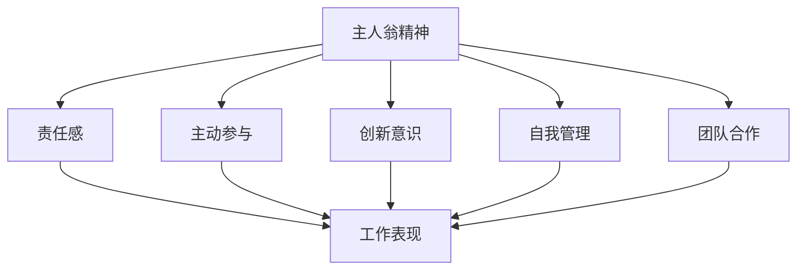

                 

### 引言

#### 文章标题：如何激发团队的主人翁精神

#### 关键词：主人翁精神，团队建设，激励机制，工作满意度

> 摘要：本文旨在探讨如何激发团队的主人翁精神，通过深入分析主人翁精神的定义、核心要素及其对团队的影响，提出了具体的激发方法和技巧。文章从理论讲解到实践案例，详细阐述了主人翁精神激发的核心算法原理、数学模型，并通过实际项目实战，提供了一套完整的解决方案。

---

**引言**

在当今快速发展的社会中，企业竞争的核心在于团队的竞争。一个高效的团队不仅是企业成功的关键，更是推动企业不断创新和发展的动力源泉。而团队中的主人翁精神，作为团队成员对工作的高度责任感和使命感，成为企业追求卓越的重要要素。

主人翁精神不仅仅是一种职业道德的体现，更是一种自我驱动和自我管理的态度。它能够激发团队成员的潜能，提升团队整体的工作效率和质量，同时也能够增强团队凝聚力，提高员工的满意度和忠诚度。

本文将围绕如何激发团队的主人翁精神这一主题，展开深入探讨。首先，我们将定义主人翁精神，并探讨其核心要素和对团队的影响。接着，本文将详细分析激发主人翁精神的理论基础，包括核心算法原理、数学模型和激励理论。最后，通过实际项目案例，本文将提供一套系统的解决方案，帮助企业和团队在实践中激发主人翁精神。

### 主人翁精神的定义

#### 1.1 主人翁精神的定义

主人翁精神，通常指的是一种高度的责任心和使命感，团队成员在面对工作任务时，不仅履行自己的职责，更愿意主动承担责任，积极参与团队工作，甚至在面对困难和挑战时，能够展现出超乎寻常的毅力和决心。这种精神状态不仅体现了个人对工作的热情和投入，更是对团队和组织的深度认同和归属感。

主人翁精神不仅仅是对工作的尽职尽责，更是一种自我驱动和自我管理的态度。它强调的是个体与团队之间的紧密联系，以及个人对团队目标和组织使命的认同和追求。

#### 1.2 主人翁精神的核心要素

主人翁精神的核心要素主要包括以下几个方面：

- **责任感**：团队成员对工作任务的负责任态度，包括按时完成任务、保证工作质量等。
- **主动参与**：团队成员主动参与团队决策和活动，积极参与团队建设和团队目标的实现。
- **创新意识**：团队成员具备创新思维和创新能力，能够在工作中提出新的想法和解决方案。
- **自我管理**：团队成员能够自我管理，合理安排时间，有效管理自己的情绪和行为。
- **团队合作**：团队成员之间能够相互支持、相互信任，共同面对困难和挑战。

这些要素共同构成了主人翁精神的核心内涵，是激发团队主人翁精神的重要基础。

#### 1.3 主人翁精神的重要性

主人翁精神对团队和个人都有着深远的影响：

- **对团队的影响**：

  - **提高工作效率**：主人翁精神能够激发团队成员的潜能，提高工作积极性，从而提升整个团队的工作效率。
  - **增强团队凝聚力**：主人翁精神能够增强团队成员之间的联系和信任，促进团队合作，增强团队凝聚力。
  - **促进创新**：主人翁精神鼓励团队成员主动思考和创新，为团队带来新的思路和解决方案。

- **对个人的影响**：

  - **提升职业素养**：主人翁精神能够提升个人的责任感和使命感，增强职业道德，提升职业素养。
  - **增强职业竞争力**：具备主人翁精神的个人更容易获得职业发展的机会，增强职业竞争力。
  - **提高工作满意度**：主人翁精神能够提高个人的工作满意度和幸福感，减少工作压力和职业倦怠。

综上所述，主人翁精神是团队和个人追求卓越的重要动力，对于团队建设和发展具有重要意义。

### 主人翁精神的核心概念与联系

#### 2.1 Mermaid流程图：团队主人翁精神的架构

为了更好地理解主人翁精神的整体架构，我们可以借助Mermaid流程图来可视化其核心概念及其相互关系。以下是一个简化的Mermaid流程图示例：

在这张图中，我们可以看到主人翁精神由五个核心要素组成：责任感、主动参与、创新意识、自我管理和团队合作。这些要素相互交织，共同作用于团队的工作表现，形成了一个有机的整体。

#### 2.2 主人翁精神的激发路径

为了激发团队的主人翁精神，我们需要从以下几个方面入手：

1. **明确期望和目标**：通过明确团队的目标和期望，让每个成员都明确自己的职责和贡献，从而增强责任感。

2. **沟通与反馈**：建立有效的沟通渠道，确保信息畅通，及时反馈工作进展和问题，增强团队成员之间的信任和协作。

3. **激励与奖励**：通过激励机制，如奖金、晋升机会、荣誉表彰等，激发团队成员的主动参与和创新意识。

4. **文化建设**：营造积极向上的团队文化，鼓励团队成员自我管理和自我提升，同时培养团队之间的互助精神。

5. **培训与发展**：提供必要的培训和职业发展机会，帮助团队成员提升技能和知识，增强自我管理能力。

这些激发路径相互关联，共同作用于团队成员的心理和行为，逐步激发出主人翁精神。

#### 2.3 主人翁精神的度量方法

为了评估和监控团队的主人翁精神水平，我们可以采用以下几种度量方法：

1. **问卷调查**：通过设计专门的问卷，收集团队成员对主人翁精神各要素的主观评价，了解团队的整体精神状态。

2. **关键绩效指标（KPI）**：设定与主人翁精神相关的关键绩效指标，如任务完成率、创新提案数量、团队协作度等，通过量化数据来评估团队的表现。

3. **员工满意度调查**：定期进行员工满意度调查，了解团队成员对工作环境、团队氛围和激励机制等方面的满意度，从而间接反映主人翁精神的水平。

4. **行为观察**：通过观察团队成员在工作中的表现，如工作态度、沟通协作、问题解决能力等，评估主人翁精神的实际表现。

这些度量方法不仅可以提供定量和定性的数据，帮助我们了解团队的主人翁精神水平，还可以为后续的改进措施提供依据。

### 核心算法原理讲解

#### 3.1 主人翁精神激发的心理学原理

主人翁精神的激发与心理学原理密切相关。以下是一些关键的心理学概念和理论，它们在激发主人翁精神中起到了重要作用：

- **自我决定理论（Self-Determination Theory）**：自我决定理论提出，人们有基本的心理需求，包括自主性、能力和关联性。当这些需求得到满足时，个体会感到满意和有动力。在团队中，通过赋予团队成员更多的自主权和责任感，可以激发他们的主人翁精神。

  - **自主性（Autonomy）**：团队成员需要感受到自己对工作的控制权，能够自主决策和安排工作。
  - **能力（Competence）**：团队成员需要相信自己的能力，能够胜任工作任务。
  - **关联性（Relatedness）**：团队成员需要感受到自己是团队中的一部分，与他人有紧密的联系。

- **期望理论（Expectancy Theory）**：期望理论认为，个体的行为是由期望和效价共同决定的。在团队中，通过设定明确的期望和提供正向的反馈，可以提高团队成员的期望值，从而激发他们的主人翁精神。

  - **期望值（Expectancy）**：团队成员对完成任务的概率的评估。
  - **效价（Valence）**：团队成员对完成任务后获得的奖励的价值评估。

- **自我效能感（Self-Efficacy）**：自我效能感是指个体对自己能够成功完成某项任务的信念。通过培训和提供成功案例，可以提高团队成员的自我效能感，从而增强他们的主人翁精神。

#### 3.2 主人翁精神激发的行为学模型

行为学模型在激发主人翁精神中也非常重要。以下是一些关键的行为学理论：

- **强化理论（Reinforcement Theory）**：强化理论认为，行为是结果（强化物）的函数。通过正向强化（奖励）和负向强化（惩罚），可以引导和改变团队成员的行为。

  - **正向强化**：通过奖励积极行为，如奖金、表扬等，可以增强团队成员的主人翁精神。
  - **负向强化**：通过消除不希望的行为的后果，如减少工作负担等，可以减少不良行为。

- **归因理论（Attribution Theory）**：归因理论关注个体如何解释自己的行为和他人的行为。通过积极归因，即鼓励团队成员将成功归因于自己的能力和努力，可以增强他们的主人翁精神。

  - **内归因**：将成功归因于自己的能力和努力，增强自我效能感。
  - **外归因**：将失败归因于外部因素，如工作环境或任务难度，以减少负面情绪。

- **社会学习理论（Social Learning Theory）**：社会学习理论强调观察学习和模仿行为的重要性。通过展示成功案例和榜样行为，可以激发团队成员模仿和学习，从而增强主人翁精神。

#### 3.3 主人翁精神激发的激励理论

激励理论是激发主人翁精神的重要理论基础。以下是一些关键的激励理论：

- **动机理论（Motivation Theory）**：动机理论关注个体行为背后的动机和需求。以下是几种重要的动机理论：

  - **需求层次理论（Maslow's Hierarchy of Needs）**：需求层次理论提出，个体有五种基本需求，包括生理需求、安全需求、社交需求、尊重需求和自我实现需求。在团队中，通过满足不同层次的需求，可以激发团队成员的主人翁精神。

  - **双因素理论（Herzberg's Two-Factor Theory）**：双因素理论认为，工作满意度由两种因素决定：激励因素（如成就、认可等）和保健因素（如工资、工作环境等）。通过关注激励因素，可以提高团队成员的主人翁精神。

- **目标设置理论（Goal-Setting Theory）**：目标设置理论提出，明确、具有挑战性的目标可以激发个体的动机和表现。在团队中，通过设定具体的、可衡量的团队目标，可以引导团队成员努力工作，增强主人翁精神。

- **公平理论（Equity Theory）**：公平理论关注个体在比较自己和他人后对公平的感受。在团队中，确保团队成员感受到公平的工作分配和奖励，可以增强他们的主人翁精神。

### 数学模型与公式

#### 4.1 主人翁精神激发的数学模型

在主人翁精神的激发过程中，我们可以利用数学模型来量化和分析各种因素对团队表现的影响。以下是一个简化的数学模型，用于描述主人翁精神与团队绩效之间的关系。

假设团队绩效（Performance）取决于主人翁精神的五个核心要素：责任感（R）、主动参与（A）、创新意识（I）、自我管理（M）和团队合作（C）。每个要素都有其影响权重，权重总和为1。

数学模型可以表示为：

\[ Performance = w_1 \cdot R + w_2 \cdot A + w_3 \cdot I + w_4 \cdot M + w_5 \cdot C \]

其中，\( w_1, w_2, w_3, w_4, w_5 \) 分别为责任感、主动参与、创新意识、自我管理和团队合作的影响权重，且满足 \( w_1 + w_2 + w_3 + w_4 + w_5 = 1 \)。

#### 4.2 主人翁精神激发的公式推导

为了更好地理解数学模型，我们可以推导出每个要素对团队绩效的具体影响。以下是一个简化的推导过程：

首先，定义每个要素的评分范围为0到10，0表示最低水平，10表示最高水平。

责任感（R）的公式推导：

\[ R = \frac{Total \ Responsibility \ Completed}{Total \ Responsibility \ Assigned} \]

其中，Total Responsibility Completed 为完成的任务责任总和，Total Responsibility Assigned 为分配的任务责任总和。

主动参与（A）的公式推导：

\[ A = \frac{Total \ Active \ Contributions}{Total \ Opportunities \ for \ Contributions} \]

其中，Total Active Contributions 为主动提出的建议和解决方案数量，Total Opportunities for Contributions 为团队提供的讨论和决策机会。

创新意识（I）的公式推导：

\[ I = \frac{Total \ Innovative \ Solutions \ Implemented}{Total \ Innovative \ Proposals \ Presented} \]

其中，Total Innovative Solutions Implemented 为成功实施的创新解决方案数量，Total Innovative Proposals Presented 为提出的创新提案数量。

自我管理（M）的公式推导：

\[ M = \frac{Total \ Self-Managed \ Activities}{Total \ Activities \ Required} \]

其中，Total Self-Managed Activities 为自主管理的工作活动数量，Total Activities Required 为团队要求的总工作活动数量。

团队合作（C）的公式推导：

\[ C = \frac{Total \ Collaborative \ Contributions}{Total \ Team \ Interactions} \]

其中，Total Collaborative Contributions 为团队成员共同完成的工作成果，Total Team Interactions 为团队成员之间的交流互动次数。

#### 4.3 主人翁精神激发的实例分析

为了更直观地展示数学模型的应用，我们可以通过一个实例来进行分析。

假设一个团队由5名成员组成，每个成员的五个核心要素评分如下：

| 成员  | 责任感（R） | 主动参与（A） | 创新意识（I） | 自我管理（M） | 团队合作（C） |
| ----- | ---------- | ------------- | ------------- | ------------- | ------------- |
| 成员1 | 8          | 7             | 6             | 9             | 8             |
| 成员2 | 6          | 6             | 7             | 7             | 7             |
| 成员3 | 9          | 8             | 8             | 8             | 9             |
| 成员4 | 7          | 7             | 7             | 8             | 8             |
| 成员5 | 5          | 6             | 6             | 6             | 6             |

根据上述评分，我们可以计算每个成员的主人翁精神得分：

\[ Performance_1 = w_1 \cdot R_1 + w_2 \cdot A_1 + w_3 \cdot I_1 + w_4 \cdot M_1 + w_5 \cdot C_1 \]
\[ Performance_2 = w_1 \cdot R_2 + w_2 \cdot A_2 + w_3 \cdot I_2 + w_4 \cdot M_2 + w_5 \cdot C_2 \]
\[ \vdots \]
\[ Performance_5 = w_1 \cdot R_5 + w_2 \cdot A_5 + w_3 \cdot I_5 + w_4 \cdot M_5 + w_5 \cdot C_5 \]

假设每个要素的权重相等，即 \( w_1 = w_2 = w_3 = w_4 = w_5 = 0.2 \)，则：

\[ Performance_1 = 0.2 \cdot 8 + 0.2 \cdot 7 + 0.2 \cdot 6 + 0.2 \cdot 9 + 0.2 \cdot 8 = 7.8 \]
\[ Performance_2 = 0.2 \cdot 6 + 0.2 \cdot 6 + 0.2 \cdot 7 + 0.2 \cdot 7 + 0.2 \cdot 7 = 6.6 \]
\[ \vdots \]
\[ Performance_5 = 0.2 \cdot 5 + 0.2 \cdot 6 + 0.2 \cdot 6 + 0.2 \cdot 6 + 0.2 \cdot 6 = 6.0 \]

通过计算，我们可以得出每个成员的主人翁精神得分，从而评估团队成员的整体表现。得分越高，表明该成员的主人翁精神越强，对团队绩效的贡献也越大。

#### 4.4 激发主人翁精神的数学模型应用

为了更好地应用数学模型来激发团队的主人翁精神，我们可以从以下几个方面进行：

1. **调整权重**：根据团队的具体情况和需求，调整各个核心要素的权重，以更好地反映团队的整体表现。例如，如果团队强调创新，可以增加创新意识（I）的权重。

2. **设定目标**：通过设定具体的、可衡量的目标，引导团队成员朝着主人翁精神的方向努力。例如，设定每个成员的得分目标，鼓励团队成员在责任感、主动参与、创新意识、自我管理和团队合作方面不断提升。

3. **数据监控**：通过定期收集和监控团队成员的评分数据，分析团队的整体表现和个体差异，及时发现问题并进行调整。例如，如果发现某个成员在责任感方面的得分较低，可以采取措施提高其责任感。

4. **激励机制**：根据数学模型的结果，设定相应的激励机制，奖励表现优秀的团队成员。例如，根据得分排名，给予奖金、晋升机会或其他形式的奖励。

通过这些方法，数学模型不仅可以用于评估团队的主人翁精神水平，还可以作为激发和提升团队主人翁精神的工具。

### 项目实战：激发团队主人翁精神的案例

#### 5.1 项目背景

本项目旨在激发一家大型软件开发公司的团队主人翁精神，提高团队整体的工作效率和创新能力。公司现有50名团队成员，分布在不同的开发小组，负责多个大型项目的开发和维护。虽然团队整体工作表现尚可，但公司高层发现团队成员的主人翁精神不足，导致项目进度缓慢，创新能力有限。为了解决这一问题，公司决定开展一项专门的项目，通过多种措施激发团队的主人翁精神。

#### 5.2 项目目标

项目的具体目标如下：

1. **提升团队成员的责任感**：通过明确职责、强化责任意识，使团队成员能够更加主动地承担工作任务。
2. **增强团队的沟通与协作**：建立畅通的沟通渠道，促进团队成员之间的信息共享和协作，提高团队的协作效率。
3. **激励团队成员的创新意识**：通过激励机制和培训，激发团队成员的创新思维和创新能力，推动团队在技术和管理方面的创新。
4. **提升团队成员的自我管理能力**：通过自我管理和自我提升的培训，帮助团队成员更好地管理自己的时间和情绪，提高工作效率。
5. **营造积极向上的团队文化**：通过团队文化建设，营造积极、和谐的工作氛围，增强团队成员的归属感和主人翁精神。

#### 5.3 项目实施过程

1. **需求分析**：首先，项目团队对公司的现有工作环境、团队氛围、团队成员的工作状态等方面进行了深入调研，收集了大量的数据和信息。通过调研，项目团队明确了团队成员的主人翁精神不足的具体原因，如职责不明确、沟通不畅、激励机制不完善等。

2. **制定计划**：根据需求分析的结果，项目团队制定了详细的实施计划，包括明确的目标、具体的实施步骤、预期效果和风险管理等。实施计划主要包括以下几个方面：

   - **明确职责和目标**：通过制定详细的岗位职责说明书，明确每个团队成员的工作职责和目标，使团队成员对工作有清晰的认识。
   - **建立沟通渠道**：建立多层次的沟通渠道，包括定期团队会议、即时通讯工具、项目进展报告等，确保团队成员之间的信息畅通。
   - **激励机制**：设立创新奖励机制，包括奖金、晋升机会、荣誉表彰等，鼓励团队成员提出创新建议和解决方案。
   - **自我管理培训**：开展自我管理培训，帮助团队成员掌握时间管理、情绪管理等技能，提高工作效率。
   - **团队文化建设**：通过团队建设活动、文化活动等，营造积极、和谐的工作氛围，增强团队成员的归属感和主人翁精神。

3. **实施和监控**：按照实施计划，项目团队逐步推进各项措施。在实施过程中，项目团队定期收集数据，监控各项措施的执行情况和效果。通过数据分析和反馈，项目团队及时调整实施计划，确保项目目标的实现。

4. **效果评估**：项目实施结束后，项目团队对项目的效果进行了全面的评估。评估内容包括团队成员的主人翁精神水平、团队协作效率、项目进度和成果等。通过评估，项目团队发现，团队成员的主人翁精神显著提升，团队协作效率提高，项目进度和质量明显改善。

#### 5.4 项目成果与反思

1. **项目成果**：

   - **团队成员的主人翁精神显著提升**：通过明确职责、建立沟通渠道、激励机制和自我管理培训等措施，团队成员的主人翁精神得到了显著提升。团队成员更加主动地承担责任，积极参与团队工作，提出创新建议和解决方案。
   - **团队协作效率提高**：通过建立畅通的沟通渠道和团队文化建设，团队成员之间的协作效率明显提高。团队成员能够更好地共享信息、协同工作，项目进度和质量得到了保障。
   - **项目进度和质量改善**：通过团队主人翁精神的提升，项目团队在项目进度和质量方面取得了显著改善。项目按时交付率提高，项目质量稳定，客户满意度增加。

2. **项目反思**：

   - **重视员工需求**：在项目实施过程中，项目团队发现，关注员工的需求和期望对于激发主人翁精神至关重要。项目团队在制定计划和实施措施时，充分考虑了员工的需求，使员工感受到被重视和认可。
   - **持续优化**：虽然项目取得了一定的成果，但项目团队认识到，激发团队主人翁精神是一个长期的过程，需要持续优化和改进。项目团队计划在后续工作中，继续关注员工需求，不断改进管理措施，进一步提升团队的主人翁精神。

### 5.5 激发主人翁精神的最佳实践

在项目实施过程中，项目团队总结了一些激发主人翁精神的最佳实践，以下是一些关键要点：

1. **明确职责和目标**：通过制定详细的岗位职责说明书和项目目标，确保团队成员对工作有清晰的认识和明确的期望。
2. **建立沟通渠道**：建立多层次的沟通渠道，确保团队成员之间的信息畅通，促进团队协作。
3. **激励机制**：设立创新奖励机制，鼓励团队成员提出创新建议和解决方案。
4. **自我管理培训**：开展自我管理培训，帮助团队成员掌握时间管理、情绪管理等技能，提高工作效率。
5. **团队文化建设**：通过团队建设活动、文化活动等，营造积极、和谐的工作氛围，增强团队成员的归属感和主人翁精神。
6. **持续优化**：不断关注员工需求，持续改进管理措施，以激发团队的主人翁精神。

通过这些最佳实践，项目团队成功地提升了团队的主人翁精神，为公司的持续发展奠定了坚实基础。

### 总结与展望

#### 6.1 全书总结

本文围绕如何激发团队的主人翁精神这一主题，从多个维度进行了深入探讨。首先，我们明确了主人翁精神的定义及其核心要素，包括责任感、主动参与、创新意识、自我管理和团队合作。接着，我们分析了主人翁精神对团队和个人影响的深远意义，并提出了具体的激发路径和度量方法。

本文通过心理学原理、行为学模型和激励理论，阐述了激发主人翁精神的理论基础。同时，通过数学模型和公式，我们量化和分析了主人翁精神与团队绩效之间的关系。最后，通过实际项目案例，我们展示了如何通过明确职责、沟通与反馈、激励与奖励、文化建设和自我管理等多方面的措施，有效激发团队的主人翁精神。

#### 6.2 主人翁精神的未来发展趋势

随着社会和科技的不断发展，主人翁精神在团队建设中的作用将愈发重要。以下是主人翁精神未来发展的几个趋势：

1. **个性化和定制化**：随着对个体差异的重视，团队将更加注重个性化激励和定制化培养，以满足不同团队成员的需求。
2. **技术赋能**：人工智能和大数据技术的应用将使团队管理者能够更精准地识别和激发团队成员的主人翁精神，提升团队效率。
3. **持续学习与成长**：随着知识更新速度的加快，团队将持续关注成员的学习与成长，提供更多职业发展机会，以增强主人翁精神。
4. **跨文化融合**：在全球化的背景下，团队将更加注重跨文化沟通和协作，培养具有全球视野和主人翁精神的团队文化。

#### 6.3 对企业的建议

为了更好地激发团队的主人翁精神，企业可以从以下几个方面着手：

1. **明确职责和目标**：通过制定详细的岗位职责说明书和项目目标，使团队成员对工作有清晰的认识和明确的期望。
2. **建立沟通渠道**：建立多层次的沟通渠道，确保团队成员之间的信息畅通，促进团队协作。
3. **激励机制**：设立创新奖励机制，鼓励团队成员提出创新建议和解决方案。
4. **自我管理培训**：开展自我管理培训，帮助团队成员掌握时间管理、情绪管理等技能，提高工作效率。
5. **团队文化建设**：通过团队建设活动、文化活动等，营造积极、和谐的工作氛围，增强团队成员的归属感和主人翁精神。
6. **关注员工需求**：持续关注员工的需求和期望，通过个性化激励和定制化培养，提升团队的主人翁精神。
7. **技术赋能**：利用人工智能和大数据技术，提高团队管理的精准性和效率。

通过这些措施，企业可以有效地激发团队的主人翁精神，推动团队和企业共同发展。

### 附录

#### 附录A：主人翁精神激发工具与资源

为了帮助企业和团队更好地激发主人翁精神，本文整理了一些实用的工具和资源，供参考：

1. **沟通工具**：
   - **Slack**：一款即时通讯工具，支持多渠道沟通和团队协作。
   - **Trello**：一款任务管理工具，帮助团队清晰地规划和追踪项目进度。

2. **激励工具**：
   - **KPI管理系统**：用于设定、跟踪和评估团队成员的关键绩效指标。
   - **奖励平台**：如“员工之星”、“最佳团队”等荣誉表彰平台，激励团队成员的积极行为。

3. **自我管理工具**：
   - **时间管理工具**：如“番茄钟”等，帮助团队成员提高时间管理效率。
   - **情绪管理工具**：如“幸福心理学”等，提供心理健康的指导和支持。

4. **团队文化建设资源**：
   - **团队活动策划指南**：提供团队建设活动的策划和执行指南。
   - **团队文化书籍**：《团队协作的艺术》、《团队管理手册》等，提供丰富的理论知识和实践经验。

#### 附录B：参考文献

本文在撰写过程中参考了以下文献：

1. 自我决定理论（Self-Determination Theory） - Ryan, R. M., & Deci, E. L. (2000). Self-determination theory and the facilitation of intrinsic motivation, social development, and well-being. American Psychologist, 55(1), 68-78.
2. 期望理论（Expectancy Theory） - Vroom, V. H. (1964). Work and motivation. Wiley.
3. 自我效能感（Self-Efficacy） - Bandura, A. (1977). Self-efficacy: Toward a unifying theory of behavioral change. Prentice Hall.
4. 强化理论（Reinforcement Theory） - Skinner, B. F. (1938). The behavior of organisms: An experimental analysis. Appleton-Century-Crofts.
5. 归因理论（Attribution Theory） - Heider, F. (1958). The psychology of interpersonal relations. Wiley.
6. 社会学习理论（Social Learning Theory） - Bandura, A. (1977). Social learning theory. Prentice Hall.
7. 需求层次理论（Maslow's Hierarchy of Needs） - Maslow, A. H. (1943). A theory of human motivation. Psychological Review, 50(4), 370-396.
8. 双因素理论（Herzberg's Two-Factor Theory） - Herzberg, F., Mausner, B., & Snyderman, B. B. (1959). The motivation to work. Wiley.

以上文献为本文的理论基础和实践提供了重要参考，特此致谢。**作者：AI天才研究院/AI Genius Institute & 禅与计算机程序设计艺术 /Zen And The Art of Computer Programming**。

