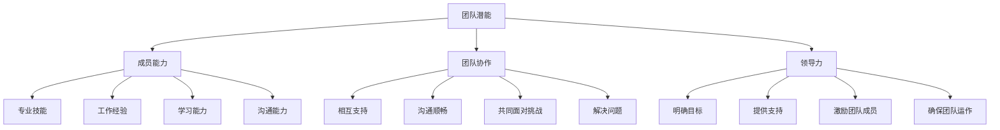

                 


### 第1章：团队潜能的基本概念与重要性

#### 1.1 团队潜能的定义与内涵

团队潜能是指一个团队在特定环境中，通过团队成员之间的协作和努力，能够实现的最大潜能。它不仅包括团队成员的个人能力和专业知识，还涉及团队整体的协作效率和创新潜力。团队潜能的核心要素包括以下几个方面：

1. **成员能力**：团队成员的能力是团队潜能的基础。这包括专业技能、工作经验、学习能力以及沟通能力等。
2. **团队协作**：团队协作是团队潜能的重要体现。它要求团队成员能够相互支持、沟通顺畅、共同面对挑战和解决问题。
3. **领导力**：领导力是激发团队潜能的关键因素。一个高效的领导者能够明确团队目标、提供支持、激励团队成员，并确保团队的顺利运作。

**Mermaid 流程图**：



#### 1.2 团队潜能的核心要素

**成员能力**：

团队成员的能力决定了团队整体的水平。一个高效团队需要成员具备以下关键能力：

1. **专业技能**：成员应具备各自领域内的专业知识和技能，能够独立完成相关工作。
2. **工作经验**：丰富的经验可以帮助成员更好地应对复杂问题和挑战。
3. **学习能力**：快速学习新知识和技能，以适应不断变化的环境和需求。
4. **沟通能力**：有效的沟通能力能够促进团队成员之间的合作和协作。

**团队协作**：

团队协作是团队潜能的重要体现。以下要素有助于提升团队协作效率：

1. **相互支持**：团队成员应相互信任，相互支持，共同面对困难和挑战。
2. **沟通顺畅**：团队成员应保持良好的沟通，确保信息传递准确无误。
3. **共同面对挑战**：团队成员应团结一致，共同面对挑战和问题。
4. **解决问题**：团队成员应具备解决问题的能力，能够快速找到解决方案。

**领导力**：

领导力是激发团队潜能的关键因素。以下要素有助于提升领导力：

1. **明确目标**：领导者应明确团队的目标和愿景，确保团队成员明确任务和期望。
2. **提供支持**：领导者应提供必要的资源和支持，帮助团队成员克服困难和挑战。
3. **激励团队成员**：领导者应激励团队成员，提升团队士气和动力。
4. **确保团队运作**：领导者应确保团队的正常运作，解决内部冲突和问题。

#### 1.3 团队潜能的重要性

**提高工作效率**：

激发团队潜能能够显著提高团队的工作效率。团队成员通过协作和共同努力，能够更快地完成任务，提高产出。

**增强创新能力**：

团队潜能的激发有助于提升团队的创新能力。团队成员在协作过程中，能够相互启发、碰撞出新的想法和解决方案。

**促进团队成长**：

团队潜能的激发有助于团队成员的个人成长和团队整体的发展。通过不断挑战和提升，团队成员能够不断提高自身能力和水平，推动团队进步。

### 第2章：构建高效团队的策略

#### 2.1 明确团队目标与愿景

**确定团队目标的步骤**：

1. **明确团队使命**：团队使命是团队的核心理念和存在的理由。明确使命有助于团队成员明确自己的职责和目标。
2. **设定短期目标**：短期目标是团队在一段时间内要实现的具体任务和成果。这些目标应具体、可衡量、可实现。
3. **制定长期愿景**：长期愿景是团队未来发展的方向和目标。它为团队提供了前进的动力和方向。

**梦想与目标的联系**：

梦想是团队目标的来源和动力。一个美好的梦想能够激发团队成员的激情和动力，促使他们为实现目标而努力。同时，梦想与目标之间应保持一致，确保团队成员在实现梦想的过程中，不断迈向更高的目标。

#### 2.2 培养团队成员的能力

**成功的关键能力分析**：

1. **专业技能**：团队成员应具备各自领域内的专业知识和技能，能够独立完成相关工作。
2. **团队协作能力**：团队成员应具备良好的沟通能力、协作意识和团队精神，能够与团队成员高效协作。
3. **问题解决能力**：团队成员应具备分析问题和解决问题的能力，能够快速找到解决方案。

**培养能力的策略与方法**：

1. **培训与学习**：定期组织培训和学习活动，帮助团队成员提升专业技能和知识水平。
2. **实践与经验**：鼓励团队成员参与实际项目，通过实践和经验积累，提升解决问题的能力。
3. **团队建设活动**：组织团队建设活动，增强团队成员之间的沟通和协作，提高团队凝聚力。

#### 2.3 建立良好的团队文化

**团队文化的内涵与作用**：

团队文化是团队共同价值观和行为规范的总和。它对团队的工作氛围、行为准则和发展方向产生深远影响。良好的团队文化有助于提升团队凝聚力、提高工作效率和激发创新能力。

**建立团队文化的步骤**：

1. **明确价值观**：明确团队的核心价值观，确保团队成员在行为和决策上保持一致。
2. **树立榜样**：领导者应树立榜样，以身作则，践行团队价值观。
3. **培养氛围**：通过活动和沟通，营造积极、开放、包容的团队氛围。
4. **持续改进**：团队文化需要不断调整和优化，以适应团队的发展和外部环境的变化。

### 第3章：激发团队潜能的领导力

#### 3.1 领导力与团队潜能的关系

**领导力在团队潜能激发中的作用**：

领导力是激发团队潜能的关键因素。一个高效的领导者能够明确团队目标、提供支持、激励团队成员，并确保团队的顺利运作。

**领导力与团队潜能的相互影响**：

领导力与团队潜能之间存在相互影响的关系。高效的领导力能够激发团队潜能，提升团队的协作效率和创新能力；同时，团队潜能的提升也能够增强领导者的自信心和领导力。

#### 3.2 高效领导者的特征

**自我激励**：

高效领导者应具备自我激励的能力，能够在面临困难和挑战时保持积极的心态，推动自己不断进步。

**沟通能力**：

高效领导者应具备良好的沟通能力，能够与团队成员有效沟通，理解他们的需求和期望，并确保信息的准确传递。

**决策能力**：

高效领导者应具备决策能力，能够在复杂环境中做出明智的决策，并承担相应的责任。

#### 3.3 激发团队潜能的领导技巧

**明确目标与期望**：

领导者应明确团队的目标和期望，确保团队成员对任务和目标有清晰的认识，并为之努力。

**建立信任与支持**：

领导者应建立信任和支持的氛围，鼓励团队成员相互信任、相互支持，共同面对挑战。

**提供反馈与指导**：

领导者应提供及时的反馈和指导，帮助团队成员认识到自己的优点和不足，并指导他们改进和提高。

#### 3.4 领导力的自我提升

**自我反思**：

领导者应定期进行自我反思，审视自己的领导行为和决策，发现和解决存在的问题。

**学习与成长**：

领导者应保持学习的态度，不断学习新的知识和技能，提升自己的领导力水平。

**倾听与沟通**：

领导者应倾听团队成员的意见和建议，与他们保持良好的沟通，确保信息的准确传递。

### 第4章：激励团队成员的方法

#### 4.1 激励理论的基本框架

**激励理论的来源与发展**：

激励理论起源于心理学和行为科学的研究。随着组织行为学的发展，激励理论不断演变和完善。常见的激励理论包括马斯洛的需求层次理论、赫茨伯格的双因素理论、维克托·弗鲁姆的期望理论等。

**激励理论的核心概念**：

激励理论的核心概念包括需求、动机、目标和行为。需求是指个体的内在状态，动机是指个体为满足需求而产生的行为倾向，目标是指个体期望达到的具体结果，行为是指个体为实现目标而采取的具体行动。

#### 4.2 常见的激励策略

**金钱激励**：

金钱激励是最常见的激励方式，包括工资、奖金、提成等。金钱激励能够满足个体基本的生理需求和安全需求，提高工作积极性和效率。

**非金钱激励**：

非金钱激励包括荣誉、认可、晋升、培训等。非金钱激励能够满足个体的社交需求、尊重需求和自我实现需求，激发个体的内在动力和创造力。

**个人与团队激励的平衡**：

个人激励和团队激励之间存在一定的平衡关系。个人激励能够激发个体的积极性和创造力，团队激励能够提升团队的凝聚力和协作效率。在实际应用中，领导者应根据团队和个体的特点，合理平衡个人和团队激励，实现团队的整体绩效提升。

### 第5章：团队协作与沟通

#### 5.1 团队协作的重要性

**团队协作的意义**：

团队协作是团队工作中不可或缺的一部分。它有助于实现团队目标，提高工作效率，激发创新思维，提升团队凝聚力。

**团队协作的影响因素**：

团队协作的影响因素包括团队成员的能力、沟通方式、工作氛围、组织结构等。一个高效的团队需要团队成员具备良好的沟通能力、协作意识和团队精神，同时需要组织提供良好的沟通平台和协作环境。

#### 5.2 提升团队协作效率的方法

**清晰的分工与角色定位**：

清晰的分工和角色定位有助于团队成员明确各自的责任和任务，避免重复工作和资源浪费。领导者应确保团队成员对分工和角色有清晰的认识，并鼓励他们积极参与团队协作。

**定期的团队会议**：

定期的团队会议是团队协作的重要手段。通过团队会议，团队成员可以分享工作进展、讨论问题和解决方案，保持沟通畅通，提高协作效率。

#### 5.3 团队沟通的有效技巧

**有效沟通的障碍与克服**：

团队沟通中的障碍主要包括信息不对称、沟通方式不当、文化差异等。为了克服这些障碍，团队成员应保持开放的心态，采用多种沟通方式，尊重不同文化的差异，确保信息的准确传递。

**提升沟通效率的策略**：

提升沟通效率的策略包括简化沟通流程、明确沟通目标、选择合适的沟通方式、建立反馈机制等。领导者应引导团队成员掌握有效的沟通技巧，提高沟通效率，减少沟通成本。

#### 5.4 克服团队协作中的障碍

**人际冲突的解决**：

人际冲突是团队协作中常见的问题。为了克服人际冲突，团队成员应学会倾听、尊重他人，通过沟通和协商解决分歧。领导者应提供必要的支持和指导，帮助团队成员建立良好的关系。

**时间管理的技巧**：

时间管理是团队协作中的重要环节。为了克服时间管理的障碍，团队成员应学会合理规划时间、设置优先级、避免拖延，确保团队目标的顺利实现。

### 第6章：团队潜能的评估与提升

#### 6.1 团队潜能评估的方法

**评估指标的设定**：

团队潜能评估需要设定具体的指标，以衡量团队的整体表现和潜力。常见的评估指标包括团队绩效、成员满意度、创新能力、沟通效率等。

**评估工具的选择**：

团队潜能评估需要选择合适的工具，以收集和分析数据。常见的评估工具包括问卷调查、访谈、关键事件分析、行为观察等。

#### 6.2 提升团队潜能的策略

**培训与发展的投资**：

培训和发展是提升团队潜能的重要策略。领导者应投资于团队成员的培训和发展，提供学习机会和资源，提升团队成员的能力和知识水平。

**激励机制的完善**：

激励机制是激发团队成员潜能的重要手段。领导者应建立完善的激励机制，包括金钱激励和非金钱激励，提升团队成员的积极性和创造力。

#### 6.3 团队潜能提升的案例分析

**案例一：谷歌的团队文化**

谷歌以其独特的团队文化而闻名。谷歌注重员工的工作与生活平衡，鼓励创新和自由探索，为员工提供丰富的资源和培训机会。这种文化激发了团队成员的潜能，促进了团队的创新能力和工作效率。

**案例二：特斯拉的领导力**

特斯拉的领导者埃隆·马斯克以其独特的领导风格而著称。他注重目标导向，敢于冒险，勇于承担责任。他的领导力激发了团队的潜能，推动了特斯拉在电动汽车领域的快速发展。

### 第7章：未来团队发展的趋势与挑战

#### 7.1 未来团队的发展趋势

**远程工作与虚拟团队**：

随着技术的发展，远程工作和虚拟团队将成为未来团队发展的趋势。团队成员将更加灵活地工作，利用数字化工具进行协作和沟通。

**跨学科团队合作**：

未来团队将更加注重跨学科合作，整合不同领域的知识和技能，以应对复杂的问题和挑战。

**持续学习和适应能力**：

未来团队将需要具备持续学习和适应能力，以应对快速变化的环境和需求。

#### 7.2 面临的挑战与应对策略

**技术变革带来的挑战**：

技术变革将带来新的机遇和挑战。团队需要不断学习和适应新技术，以保持竞争力。

**人才流失与招聘难题**：

人才流失和招聘难题是未来团队发展面临的重要挑战。领导者需要制定有效的人才吸引和留任策略。

**企业文化与价值观的冲突**：

企业文化与价值观的冲突可能影响团队的凝聚力和协作效率。领导者需要建立统一的价值观，确保团队成员在行为和决策上保持一致。

#### 7.3 为未来团队做好准备

**提升数字化能力**：

团队需要提升数字化能力，利用数字化工具和平台进行协作和沟通。

**加强跨学科合作**：

团队应加强跨学科合作，整合不同领域的知识和技能，以应对复杂的问题和挑战。

**培养适应能力**：

团队需要培养适应能力，以应对快速变化的环境和需求。

### 附录：团队潜能激发实践指南

#### A.1 团队潜能激发实用工具

**项目管理工具**：如Trello、Asana等，用于任务分配、进度跟踪和协作。

**沟通工具**：如Slack、Microsoft Teams等，用于实时沟通和协作。

**协作工具**：如Google Docs、Notion等，用于文档共享、协作编辑和项目管理。

**反馈工具**：如SurveyMonkey、Google Forms等，用于收集成员反馈和意见。

#### A.2 团队潜能激发案例分析

**案例一：谷歌的团队潜能激发**：

谷歌通过建立开放的文化、提供丰富的资源和培训机会，以及鼓励创新和自由探索，成功激发了团队潜能。谷歌的团队文化注重成员的自主性和创造力，使团队成员能够充分发挥自己的潜能。

**案例二：特斯拉的领导力激发团队潜能**：

特斯拉的领导者埃隆·马斯克以其独特的领导风格和目标导向，激发了团队的潜能。马斯克鼓励团队成员勇于冒险、敢于挑战，并在团队面临困难时提供支持，使团队成员能够充分发挥自己的能力。

#### A.3 团队潜能激发的常见问题与解答

**问题一：如何平衡个人激励与团队激励？**

解答：领导者应在个人激励和团队激励之间找到平衡。可以通过设定合理的绩效指标、提供个性化的奖励和认可，同时加强团队目标的明确和团队合作的氛围，实现个人与团队的共同成长。

**问题二：如何提升团队成员的沟通能力？**

解答：可以通过组织沟通培训、建立沟通反馈机制、提供沟通工具和平台，以及鼓励团队成员积极参与沟通和交流，提升团队成员的沟通能力。

**问题三：如何应对团队协作中的冲突？**

解答：可以通过建立冲突解决机制、鼓励团队成员倾听和尊重他人、通过协商和沟通解决问题，以及提供冲突管理培训，应对团队协作中的冲突。

## 第1章：团队潜能的基本概念与重要性

团队潜能是一个团队在特定环境中，通过成员协作和努力能够实现的最大潜能。它涵盖了团队成员的个人能力、团队协作和领导力等多个方面。为了更好地理解团队潜能的概念，我们可以将其拆分为以下几个核心要素：

### 成员能力

成员能力是团队潜能的基础。这包括专业技能、工作经验、学习能力和沟通能力等。专业技能是团队成员在各自领域内所掌握的知识和技能，工作经验则是团队成员在长期工作中积累的实践经验和解决问题能力。学习能力和沟通能力则是团队成员不断适应新环境和提高工作效率的关键能力。

### 团队协作

团队协作是团队潜能的重要体现。它要求团队成员之间能够相互支持、沟通顺畅、共同面对挑战和解决问题。良好的团队协作能够提升团队的效率和创新能力，使团队在面对复杂问题和挑战时能够更加从容应对。

### 领导力

领导力是激发团队潜能的关键因素。高效的领导者能够明确团队目标、提供支持、激励团队成员，并确保团队的顺利运作。领导力不仅体现在对团队整体的管理上，还包括对团队成员个体发展的关注和引导。

下面，我们通过一个简单的 Mermaid 流程图来展示团队潜能的核心要素之间的关系：


### 团队潜能的重要性

团队潜能的激发对团队和个体都具有重要的意义：

1. **提高工作效率**：激发团队潜能能够使团队成员更加专注和高效地完成任务，提高整体工作效率。
2. **增强创新能力**：团队潜能的激发有助于团队成员相互启发、碰撞出新的想法和解决方案，提升创新能力。
3. **促进团队成长**：通过激发团队潜能，团队成员可以不断提升自身能力和水平，推动团队整体发展。

在接下来的章节中，我们将详细探讨如何构建高效团队、激发团队潜能的策略和领导力等主题，帮助读者更好地理解和应用团队潜能的概念。

### 2.1 明确团队目标与愿景

明确团队目标与愿景是构建高效团队的重要一步。一个清晰的目标和愿景不仅能够为团队提供明确的方向，还能够激发团队成员的动力和凝聚力。以下将详细讨论确定团队目标的步骤和梦想与目标之间的联系。

#### 确定团队目标的步骤

1. **明确团队使命**：
   团队使命是团队存在的根本原因，它回答了“我们为什么而存在”的问题。一个明确的使命能够为团队提供精神支撑，使团队成员在面临困难和挑战时始终保持一致的目标。例如，团队使命可以是“为客户提供卓越的服务，提升客户满意度”。

2. **设定短期目标**：
   短期目标是团队在一段时间内要实现的具体任务和成果。这些目标应具体、可衡量、可实现，通常包括时间限制和具体的绩效指标。例如，“在接下来的三个月内，实现项目A的顺利上线”。

3. **制定长期愿景**：
   长期愿景是团队未来发展的方向和目标，它为团队提供了前进的动力和方向。长期愿景应具有挑战性，同时要确保实现的可能性。例如，“在未来五年内，成为行业内的领导者”。

4. **分解目标**：
   将长期和短期的目标分解为具体的行动计划和任务，确保每个团队成员都清楚自己的职责和任务。例如，将长期愿景分解为年度、季度和月度的目标，并制定相应的行动计划。

5. **沟通与确认**：
   将确定的目标和愿景与团队成员进行沟通，确保每个人对目标和愿景有清晰的认识。同时，鼓励团队成员提出意见和建议，以进一步完善目标和愿景。

#### 梦想与目标的联系

梦想是团队目标的重要来源和动力。一个美好的梦想能够激发团队成员的激情和动力，促使他们为实现目标而努力。梦想与目标之间的联系体现在以下几个方面：

1. **激励作用**：
   梦想能够激发团队成员的内在动力，使他们更加积极和投入地工作。当团队成员看到自己的努力能够帮助团队实现梦想时，他们会更加有动力去实现目标。

2. **共同愿景**：
   梦想和目标是团队共同愿景的组成部分。通过明确和沟通梦想和目标，团队成员可以形成一个共同的愿景，这有助于增强团队的凝聚力。

3. **目标导向**：
   梦想和目标之间存在着紧密的联系。梦想为团队提供了长期的目标和方向，而目标则是实现梦想的具体步骤和行动计划。通过将梦想分解为具体的目标，团队可以逐步实现梦想。

总之，明确团队目标与愿景是构建高效团队的关键一步。通过确定明确的使命、设定具体的短期和长期目标，以及将梦想与目标相结合，团队可以更好地激发成员的潜能，实现团队的共同目标。

### 2.2 培养团队成员的能力

团队成员的能力是团队潜能的重要基础。一个高效团队需要每个成员具备专业技能、工作经验、学习能力和沟通能力等多方面的素质。因此，培养团队成员的能力是构建和提升团队效能的重要策略。以下是成功的关键能力分析以及培养能力的策略与方法。

#### 成功的关键能力分析

1. **专业技能**：
   专业技能是团队成员在各自领域内的核心竞争力。这些能力包括技术知识、工具使用、行业标准和最佳实践等。具备专业技能的成员能够独立完成任务，确保团队工作的顺利进行。

2. **工作经验**：
   丰富的工作经验可以帮助团队成员更好地应对复杂问题和挑战。经验丰富的成员能够迅速识别问题的本质，提出有效的解决方案。同时，工作经验还可以帮助新成员更快地融入团队，提高整体工作效率。

3. **学习能力**：
   学习能力是适应快速变化环境和不断学习新知识的关键。具备良好学习能力的团队成员能够迅速掌握新技术、新方法，从而提高团队的创新能力和竞争力。

4. **沟通能力**：
   沟通能力是团队协作的基础。团队成员需要具备良好的口头和书面沟通能力，能够清晰地表达自己的想法和意见，理解他人的观点。有效的沟通可以减少误解和冲突，提高团队协作效率。

#### 培养能力的策略与方法

1. **培训与学习**：
   定期组织培训和学习活动是提升团队成员能力的重要手段。通过内部培训、外部培训和在线学习平台，团队成员可以学习新的知识和技能。同时，鼓励团队成员参加行业会议、研讨会和技术讲座，以扩大知识面。

2. **实践与经验**：
   实践是最好的学习方式。团队应鼓励成员参与实际项目，通过实践积累经验，提高解决问题的能力。此外，团队可以安排跨部门或跨领域的项目，让成员在多样化的工作环境中锻炼和提升能力。

3. **团队建设活动**：
   团队建设活动有助于增强团队成员之间的沟通和协作，提升团队凝聚力。通过团队拓展训练、团队聚餐和团队旅游等活动，成员可以加深了解，培养团队精神。

4. **导师制度**：
   建立导师制度，让经验丰富的成员指导新成员，可以帮助新成员更快地适应工作环境和提高技能水平。同时，导师可以分享自己的经验和最佳实践，为新成员提供指导和帮助。

5. **激励与反馈**：
   对团队成员的学习成果进行激励和反馈，可以提高他们的学习动力和积极性。团队可以设立学习奖励制度，对表现出色的成员给予表彰和奖励。同时，定期进行能力评估，为成员提供个性化的反馈和发展建议。

通过上述策略和方法，团队可以有效地培养成员的能力，提高整体效能，从而更好地激发团队潜能。

### 2.3 建立良好的团队文化

良好的团队文化是激发团队潜能的重要保障。它不仅影响团队成员的工作态度和行为，还能塑造团队的核心价值观和凝聚力。以下将讨论团队文化的内涵与作用，以及建立团队文化的步骤。

#### 团队文化的内涵与作用

1. **团队文化的内涵**：
   团队文化是团队在长期发展过程中形成的共同价值观、行为规范和工作氛围。它涵盖了团队的理念、信仰、行为准则以及成员之间的互动模式。团队文化不仅体现在日常工作中，还渗透到团队决策、沟通协作和冲突解决等方面。

2. **团队文化的作用**：
   - **增强凝聚力**：良好的团队文化能够增强团队成员之间的凝聚力，使成员更加团结一致，共同为实现团队目标而努力。
   - **提升工作效率**：团队文化能够提高团队成员的工作效率，减少内耗和误解，使团队成员能够更专注地完成工作。
   - **促进创新**：团队文化鼓励创新思维和开放探索，激发团队成员的创新潜力，推动团队不断进步。
   - **塑造形象**：良好的团队文化能够提升团队的形象和声誉，增强客户和合作伙伴的信任。

#### 建立团队文化的步骤

1. **明确价值观**：
   团队文化的核心是价值观。团队应明确核心价值观，如诚信、责任、创新、协作等，并确保这些价值观被全体成员认同和遵循。可以通过团队讨论、问卷调查等方式，征集成员的意见和建议，形成共识。

2. **树立榜样**：
   团队领导者应以身作则，践行团队价值观。领导者的行为和决策应与价值观保持一致，成为团队成员的榜样。同时，领导者应鼓励成员分享个人经验和最佳实践，以共同提升团队文化。

3. **培养氛围**：
   通过活动和沟通，营造积极、开放、包容的团队氛围。团队可以组织团队建设活动，如团队拓展训练、团队聚餐等，增强成员之间的互动和信任。此外，定期举行团队会议，分享工作进展和经验，促进团队成员之间的沟通和理解。

4. **持续改进**：
   团队文化需要不断调整和优化，以适应团队的发展和外部环境的变化。团队应定期评估和反思团队文化，识别存在的问题和改进点，制定相应的措施进行优化。

通过明确价值观、树立榜样、培养氛围和持续改进，团队可以建立良好的团队文化，为激发团队潜能提供坚实的基础。

### 3.1 领导力与团队潜能的关系

领导力在团队潜能的激发中起着至关重要的作用。一个高效的领导者不仅能够明确团队目标，还能提供支持和激励，从而提升团队的整体效能。以下是关于领导力在团队潜能激发中的作用以及领导力与团队潜能的相互影响的详细讨论。

#### 领导力在团队潜能激发中的作用

1. **明确目标与期望**：
   领导者需要明确团队的目标和期望，确保团队成员对任务和目标有清晰的认识。通过设定明确的目标，领导者可以激励团队成员朝着共同的方向努力，从而提升团队的凝聚力。

2. **提供支持与资源**：
   领导者应提供必要的资源和支持，帮助团队成员克服工作中的困难和挑战。这包括技术支持、人力资源和财务资源等。当团队成员感受到领导者的支持时，他们更有动力去完成任务，从而激发团队潜能。

3. **激励团队成员**：
   领导者应具备激励团队成员的能力，通过认可和奖励来提升团队成员的积极性。激励不仅包括金钱奖励，还涉及精神鼓励和职业发展机会。一个善于激励的领导者能够激发团队成员的内在动力，提高工作效率。

4. **促进沟通与协作**：
   领导者应促进团队成员之间的沟通和协作，建立良好的团队氛围。通过组织团队会议、讨论和反馈机制，领导者可以帮助团队成员更好地理解彼此的需求和期望，从而提升团队协作效率。

#### 领导力与团队潜能的相互影响

1. **领导力提升团队潜能**：
   高效的领导力能够激发团队的潜能，提升团队的绩效和创新能力。当领导者具备明确的目标、提供支持和激励、促进沟通与协作时，团队成员会感受到更大的动力和责任感，从而更积极地投入到工作中。

2. **团队潜能增强领导力**：
   团队潜能的提升也会对领导力产生积极影响。一个充满活力和创造力的团队会向领导者反馈正面的反馈和成果，使领导者更加有信心和动力去领导团队。同时，团队成员的积极表现和创新能力也会促使领导者不断学习和成长，提升自己的领导能力。

总之，领导力与团队潜能之间存在着密切的相互影响关系。一个高效的领导者能够通过激发团队潜能，提升团队的整体效能，而团队潜能的提升也会进一步促进领导力的发展。在接下来的章节中，我们将进一步探讨高效领导者的特征以及如何通过领导技巧来激发团队潜能。

### 3.2 高效领导者的特征

高效领导者具备一系列关键特征，这些特征不仅有助于他们自身的发展，也能激励和引导团队成员共同实现目标。以下是高效领导者的几个核心特征：

1. **自我激励**：

高效领导者首先需要具备自我激励的能力。在面对困难和挑战时，他们能够保持积极的心态，坚定信念，不断推动自己前进。这种自我激励不仅体现在个人成就的追求上，还体现在对团队的期望和目标的坚持上。领导者通过自身的榜样作用，激励团队成员在面对困境时保持积极态度，共同克服挑战。

2. **沟通能力**：

沟通能力是高效领导者不可或缺的特质。良好的沟通能力包括倾听、表达和反馈等方面。领导者需要能够与团队成员有效沟通，确保信息的准确传递和理解。同时，领导者还应该善于倾听团队成员的意见和建议，了解他们的需求和期望，从而做出更明智的决策。通过有效的沟通，领导者能够增强团队成员的归属感和信任感，提升团队的凝聚力。

3. **决策能力**：

高效领导者应具备出色的决策能力。在面对复杂环境和多变情况时，领导者需要能够快速做出明智的决策。这要求领导者具备分析问题的能力、预测未来的能力以及承担决策后果的勇气。通过果断的决策和合理的资源配置，领导者能够确保团队目标得以实现，并引导团队朝着正确的方向前进。

4. **同理心**：

同理心是高效领导者的重要品质。领导者应具备理解和感受团队成员情感和需求的能力。通过同理心，领导者能够更好地了解团队成员的心理状态和工作压力，从而提供更人性化的支持和帮助。这种关怀不仅能够增强团队成员的满意度和忠诚度，还能激发他们的工作热情和创造力。

5. **适应性**：

高效领导者应具备良好的适应性，能够在不同环境和情境下灵活调整自己的领导风格和方法。随着外部环境和内部条件的变化，领导者需要能够快速适应新情况，调整策略和行动计划。这种适应性不仅体现在对变化的接受上，还体现在对创新的鼓励和支持上。领导者通过推动团队不断适应和进步，保持团队的竞争力和活力。

6. **团队建设能力**：

高效领导者应具备强大的团队建设能力，能够建立积极、开放和包容的团队氛围。通过团队建设活动、沟通渠道的搭建以及团队成员之间的互动，领导者能够增强团队的凝聚力，提升团队的整体效能。一个良好的团队氛围能够促进团队成员之间的合作和信任，激发他们的潜能和创造力。

总之，高效领导者通过自我激励、沟通能力、决策能力、同理心、适应性和团队建设能力等特征，不仅能够提升自身的领导效能，还能激发和引导团队成员，共同实现团队的目标和愿景。

### 3.3 激发团队潜能的领导技巧

激发团队潜能是领导者的核心任务之一。以下将详细探讨几个关键的领导技巧，这些技巧有助于领导者有效地激发团队潜能，提升团队的整体效能。

#### 明确目标与期望

1. **设定明确的目标**：
   领导者应明确团队的目标和期望，确保每个成员都清楚自己的职责和任务。通过设定具体、可衡量、可实现的目标，领导者可以确保团队的努力方向一致，提高工作效率。

   **伪代码示例**：
   ```python
   def set_goals(team):
       for member in team:
           member.goal = "具体、可衡量、可实现的目标"
           print(f"{member.name}'s goal: {member.goal}")
   ```

2. **定期回顾目标**：
   定期回顾目标有助于团队成员了解自己的进展，及时调整策略和行动计划。通过定期的团队会议，领导者可以与成员讨论目标的实现情况，提供必要的支持和指导。

   **伪代码示例**：
   ```python
   def review_goals(team):
       for member in team:
           print(f"{member.name}'s progress: {member.progress}")
           if member.progress < 80:
               print(f"Adjusting {member.name}'s plan.")
   ```

#### 建立信任与支持

1. **建立信任关系**：
   领导者应通过积极的沟通和行为，建立与团队成员之间的信任关系。信任是团队合作的基础，只有团队成员相互信任，才能更好地协作。

   **伪代码示例**：
   ```python
   def build_trust(team):
       for member in team:
           member.trust = "High"
           print(f"{member.name} has built a high level of trust.")
   ```

2. **提供支持与资源**：
   领导者应确保团队成员获得必要的资源和支持，以顺利完成工作任务。这包括技术支持、人力资源和财务资源等。通过提供支持，领导者可以减轻团队成员的工作压力，提高他们的工作效率。

   **伪代码示例**：
   ```python
   def provide_support(team):
       for member in team:
           member.support = "Complete"
           print(f"{member.name} has received complete support.")
   ```

#### 提供反馈与指导

1. **及时反馈**：
   领导者应及时给予团队成员工作反馈，帮助成员了解自己的表现和进步。及时的反馈可以激励成员改进工作，提高绩效。

   **伪代码示例**：
   ```python
   def give_feedback(member):
       if member.performance > 90:
           print(f"{member.name} is performing exceptionally well.")
       elif member.performance < 70:
           print(f"{member.name} needs improvement.")
   ```

2. **指导与培训**：
   领导者应提供个性化的指导与培训，帮助团队成员提升技能和知识。通过培训，领导者可以确保团队成员具备完成工作任务所需的技能和知识。

   **伪代码示例**：
   ```python
   def provide_training(member):
       if member.skill_level < 80:
           print(f"{member.name} is undergoing training to improve skills.")
   ```

通过明确目标与期望、建立信任与支持、提供反馈与指导等领导技巧，领导者可以有效地激发团队潜能，提升团队的整体效能。

### 3.4 领导力的自我提升

一个高效领导者不仅需要具备卓越的领导能力，还需要不断地自我提升，以适应不断变化的环境和挑战。以下是关于领导力自我提升的几个关键方面：

#### 自我反思

1. **定期进行自我评估**：
   领导者应定期对自己的领导行为、决策和团队表现进行评估。通过自我反思，领导者可以发现自身的优点和不足，并制定改进计划。

   **伪代码示例**：
   ```python
   def self_evaluation.leader():
       print("Evaluating leadership performance...")
       print("Strengths:", strengths)
       print("Areas for improvement:", improvements)
   ```

2. **收集反馈**：
   领导者应主动寻求团队成员和下属的反馈，了解他们对领导行为的看法和建议。通过收集反馈，领导者可以更全面地了解自己的表现，并针对性地进行改进。

   **伪代码示例**：
   ```python
   def collect_feedback(leader):
       feedback = input("Please provide feedback on the leader's performance:")
       print("Feedback received:", feedback)
   ```

#### 学习与成长

1. **持续学习**：
   领导者应保持学习的态度，不断学习新的知识和技能。这可以通过参加培训课程、阅读专业书籍、观看教育视频等方式实现。通过持续学习，领导者可以不断提升自己的专业素养和领导能力。

   **伪代码示例**：
   ```python
   def learn_new_skills(leader):
       print("Learning new skills to enhance leadership capabilities.")
   ```

2. **参加领导力发展项目**：
   参加领导力发展项目可以帮助领导者系统性地提升领导力。这些项目通常包括研讨会、模拟练习、案例分析等，能够提供实践经验和知识分享。

   **伪代码示例**：
   ```python
   def participate_in_leadership_program(leader):
       print("Participating in a leadership development program to grow as a leader.")
   ```

#### 倾听与沟通

1. **积极倾听**：
   领导者应积极倾听团队成员的意见和建议，确保信息的准确理解和有效传递。倾听是建立信任和沟通的关键，有助于领导者更好地了解团队的需求和问题。

   **伪代码示例**：
   ```python
   def listen_to_teams(leader):
       print("Actively listening to team members' suggestions and concerns.")
   ```

2. **有效沟通**：
   领导者应掌握有效的沟通技巧，包括清晰表达、积极倾听和适时的反馈。通过有效的沟通，领导者可以确保团队目标的明确和团队协作的高效。

   **伪代码示例**：
   ```python
   def effective_communication(leader):
       print("Using effective communication techniques to ensure clarity and collaboration.")
   ```

通过自我反思、持续学习、积极倾听和有效沟通等自我提升策略，领导者可以不断提升自己的领导能力，更好地激发团队潜能，实现团队的目标和愿景。

### 4.1 激励理论的基本框架

激励理论是理解和管理团队成员行为的重要工具。它起源于心理学和行为科学的研究，旨在解释人类行为的动机和激励机制。以下是关于激励理论的基本框架，包括其来源、发展以及核心概念。

#### 来源与发展

激励理论的发展可以追溯到20世纪初期，当时心理学家和学者开始研究人类行为的动机和激励。以下是一些主要的激励理论：

1. **马斯洛的需求层次理论**（1943）：
   马斯洛提出了需求层次理论，将人类需求分为五个层次：生理需求、安全需求、社交需求、尊重需求和自我实现需求。该理论认为，当低层次的需求得到满足时，人们会追求更高层次的需求。

2. **赫茨伯格的双因素理论**（1959）：
   赫茨伯格提出了双因素理论，将工作激励因素分为两类：一类是基本因素（如薪酬、工作条件等），另一类是激励因素（如工作成就、认可等）。他认为，基本因素的缺乏会导致不满意，而激励因素的满足能够带来满意和激励。

3. **维克托·弗鲁姆的期望理论**（1964）：
   弗鲁姆提出了期望理论，该理论认为激励取决于三个因素：效价（个体对目标价值的评估）、期望（个体对实现目标的信心）和工具性（个体对目标实现后获得奖赏的信心）。根据这个理论，激励可以表示为：激励 = 效价 × 期望 × 工具性。

4. **目标设置理论**（1970年代）：
   目标设置理论认为，明确、具体和具有挑战性的目标能够激励人们提高绩效。目标设置理论强调了目标对行为和动机的调节作用。

5. **自我决定理论**（1980年代）：
   自我决定理论由德西和瑞安提出，认为人类行为受到内在动机的驱使，当个体的自主性、能力和关系需求得到满足时，他们会表现出更高的积极性和创造力。

#### 核心概念

激励理论的核心概念包括需求、动机、目标和行为：

1. **需求**：
   需求是激励过程的起点，是个体内在状态的表现。需求可以分为生理需求、安全需求、社交需求、尊重需求和自我实现需求等。个体追求这些需求的满足，从而驱动行为。

2. **动机**：
   动机是需求驱动的行为倾向。当个体感受到需求未满足时，会激发动机，促使个体采取行动以满足需求。动机可以来源于内在的需求满足感，也可以来源于外部奖励和惩罚。

3. **目标**：
   目标是激励过程中具体的结果和期望。目标能够为个体提供方向和动力，使其为实现目标而努力。明确、具体和具有挑战性的目标能够激发更强的动机和绩效。

4. **行为**：
   行为是激励过程的最终表现。通过满足需求、激发动机和实现目标，个体会采取相应的行为。这些行为可以是工作表现、创新活动、团队合作等。

总之，激励理论的基本框架为我们理解和管理团队成员的行为提供了科学依据。通过了解不同激励理论的来源和发展，以及核心概念，领导者可以更有效地激发团队潜能，提升整体绩效。

### 4.2 常见的激励策略

激励策略是激发团队成员动力和积极性的重要手段。常见的激励策略可以分为金钱激励和非金钱激励两类。以下将详细探讨这两类激励策略的具体实施方法和实际案例。

#### 金钱激励

1. **基本薪酬**：
   基本薪酬是团队成员获得的主要收入来源。合理的薪酬水平能够满足团队成员的基本生活需求，提高他们的工作满意度。例如，谷歌通过提供有竞争力的基本薪酬，吸引了大量优秀人才。

2. **奖金与提成**：
   奖金和提成是依据团队成员的工作绩效和业绩进行奖励的一种方式。通过设定明确的绩效指标和奖金分配规则，能够激发团队成员的竞争意识和工作积极性。例如，销售团队通过设定销售目标，实现目标后可以获得相应的奖金。

3. **股权激励**：
   股权激励是给予团队成员公司股份或期权，使其成为公司股东的一种激励方式。这种方式能够使团队成员感受到公司的长期发展，增强归属感和忠诚度。例如，苹果公司通过股权激励，激励员工长期为公司发展贡献力量。

4. **福利与保险**：
   丰富的福利和保险制度能够提升团队成员的工作满意度和安全感。例如，提供医疗保险、退休金计划和带薪休假等福利，能够帮助团队成员更好地平衡工作与生活。

#### 非金钱激励

1. **荣誉与认可**：
   荣誉和认可是一种重要的非金钱激励方式。通过表彰团队成员的优秀表现和成就，能够增强他们的自信心和荣誉感。例如，年度优秀员工评选、团队奖等荣誉制度，可以激励团队成员不断追求卓越。

2. **职业发展机会**：
   提供职业发展机会是激励团队成员的一种有效方式。通过内部晋升、培训和发展计划，能够帮助团队成员提升技能和职业素养，增强他们的职业发展信心。例如，谷歌的“旋转门”计划，允许员工在不同职位和项目中轮换，促进职业成长。

3. **灵活工作时间**：
   灵活的工作时间制度能够提升团队成员的工作满意度和工作效率。通过允许弹性工作时间和远程办公，能够更好地平衡工作与生活，提高工作积极性。例如，一些科技公司如Facebook和Twitter，提供灵活的工作时间安排，以吸引和保留优秀人才。

4. **团队建设活动**：
   团队建设活动是一种增强团队凝聚力和员工满意度的非金钱激励方式。通过组织团队聚餐、团建活动、运动比赛等，能够增强团队成员之间的互动和信任。例如，微软定期组织团队建设活动，增强团队凝聚力。

#### 实际案例

1. **谷歌的激励机制**：
   谷歌以其独特的激励机制而闻名。除了提供有竞争力的薪酬和股权激励外，谷歌还注重非金钱激励，如荣誉和认可、职业发展机会以及灵活的工作时间安排。这种多元化的激励机制有效地激发了员工的工作热情和创造力。

2. **特斯拉的领导风格**：
   特斯拉的领导者埃隆·马斯克通过高强度的工作压力和挑战性的目标，激发员工的潜能。同时，他注重荣誉和认可，通过表彰员工在项目中的贡献，提升员工的自信心和动力。

总之，金钱激励和非金钱激励都是激发团队成员潜能的有效手段。通过结合多种激励策略，领导者可以更好地激发团队潜能，提升团队整体绩效。

### 4.3 个人与团队激励的平衡

在团队管理中，个人激励和团队激励都是至关重要的，它们在激发团队成员潜能方面发挥着不同但互补的作用。然而，如何在实际操作中找到个人与团队激励之间的平衡，是一个具有挑战性的问题。以下将讨论个人与团队激励的关系，并探讨在实践中如何实现平衡。

#### 个人与团队激励的关系

1. **相互补充**：
   个人激励和团队激励并非对立，而是相互补充的。个人激励通常关注个体的成就、成长和满足，如奖金、晋升机会和荣誉认可。团队激励则强调团队的整体绩效、协作和共同目标，如团队奖励、团队活动和文化建设。通过结合个人激励和团队激励，可以激发团队成员的内在动力，提高团队的凝聚力和协作效率。

2. **共同目标**：
   个人与团队激励都应服务于共同的目标，即提升团队的总体绩效和实现组织的战略目标。个人激励可以激发团队成员的积极性和创造力，使其在实现个人目标的同时，为团队的整体目标贡献力量。团队激励则通过加强团队内部的协作和沟通，促进团队成员之间的相互支持和合作，从而实现团队的整体目标。

#### 实践中的平衡策略

1. **明确目标**：
   为了实现个人与团队激励的平衡，首先需要明确个人和团队的目标。这些目标应具有一致性，确保个人在追求个人成就的同时，也为团队的整体目标做出贡献。例如，在销售团队中，个人目标可以是销售额和客户满意度，而团队目标则可以是整体销售业绩和市场占有率。

2. **设置合理的绩效指标**：
   设置合理的绩效指标是平衡个人与团队激励的关键。绩效指标应兼顾个人和团队的表现，确保每个成员的贡献都能够得到公正的评价和奖励。例如，在项目管理中，可以设置个人任务完成情况和团队项目进度的双重指标。

3. **多样化的激励策略**：
   结合多样化的激励策略，可以更好地平衡个人与团队激励。除了传统的金钱激励，还可以采用荣誉表彰、职业发展机会、团队建设活动等非金钱激励方式。这些激励方式不仅能够满足个人需求，还能增强团队的凝聚力和合作精神。

4. **建立反馈机制**：
   建立有效的反馈机制，确保团队成员能够及时了解自己的表现和对团队的整体贡献。通过定期的绩效评估和反馈，领导者可以了解团队成员的激励需求，并根据实际情况进行调整。例如，通过一对一的绩效反馈会议，领导者可以了解员工的成就和挑战，并提供相应的支持和激励。

5. **文化塑造**：
   塑造积极向上的团队文化，是平衡个人与团队激励的重要手段。团队文化应强调个人成就与团队荣誉的统一，鼓励团队成员在追求个人目标的同时，为团队的整体目标努力。通过共同价值观和行为准则的建立，可以确保个人与团队激励之间的平衡。

总之，在团队管理中，找到个人与团队激励之间的平衡至关重要。通过明确目标、设置合理的绩效指标、多样化的激励策略、建立反馈机制和塑造积极团队文化，领导者可以有效地激发团队成员的潜能，实现个人与团队的共同成长。

### 5.1 团队协作的重要性

团队协作是高效团队工作的核心要素之一，它在实现团队目标、提升工作效率和促进创新能力方面发挥着至关重要的作用。以下是关于团队协作的重要性的详细讨论。

#### 团队协作的意义

1. **实现团队目标**：
   团队协作是团队实现共同目标的关键途径。通过团队成员的协同工作，可以有效地将个人能力整合成整体力量，共同攻克复杂问题和挑战。例如，在项目管理中，团队协作可以确保项目按时完成，并在预算和质量要求内实现预期目标。

2. **提升工作效率**：
   团队协作有助于提高工作效率。通过明确分工和协作流程，团队成员可以专注于自己的专业领域，减少重复劳动和资源浪费。同时，团队成员之间的沟通和协作可以快速传递信息和反馈，提高决策速度和工作效率。例如，在软件开发中，敏捷开发方法强调团队协作，通过每日站会和迭代评审，确保团队成员能够及时沟通和调整工作方向。

3. **促进创新能力**：
   团队协作能够激发创新思维和创造力。在团队协作过程中，团队成员可以分享不同的观点和想法，通过头脑风暴和协作讨论，产生新的创意和解决方案。这种跨学科、跨领域的交流合作，有助于推动团队的创新和发展。例如，谷歌的“20%时间”政策，允许员工将20%的工作时间用于个人兴趣项目和团队协作创新，极大地促进了公司的技术进步和产品创新。

4. **增强团队凝聚力**：
   团队协作有助于增强团队成员之间的凝聚力和信任感。通过共同面对挑战和完成任务，团队成员能够建立深厚的信任关系，形成紧密的团队氛围。这种凝聚力不仅可以提高团队成员的工作积极性，还能降低离职率和人员流失，提升团队的整体稳定性。

#### 团队协作的影响因素

1. **团队成员的能力**：
   团队成员的能力是团队协作的基础。一个高效团队需要成员具备相应的专业技能、沟通能力和协作意识。成员之间的能力差异可能会影响团队的整体效率，因此领导者需要确保团队成员的能力得到充分发展和合理配置。

2. **沟通方式**：
   沟通是团队协作的核心。团队成员之间需要建立有效的沟通渠道和沟通方式，以确保信息的准确传递和理解。有效的沟通包括口头沟通、书面沟通和身体语言等多种形式，领导者应鼓励团队成员积极沟通，并提供必要的沟通培训。

3. **工作氛围**：
   团队协作需要一个积极、开放和包容的工作氛围。团队成员应相互尊重、支持，共同面对挑战和问题。领导者应营造良好的工作氛围，鼓励团队成员分享想法和建议，并确保团队成员的合理诉求得到关注和解决。

4. **组织结构**：
   团队的组织结构对协作效率有着重要影响。合理的组织结构应确保团队成员之间的分工明确、责任清晰，同时提供灵活的协作机制。领导者应根据团队特点和项目需求，调整组织结构，以适应不同的协作模式。

5. **技术支持**：
   现代技术为团队协作提供了丰富的工具和平台。领导者应充分利用数字化工具，如项目管理软件、协作平台和通讯工具，提高团队协作的效率和效果。这些技术工具可以帮助团队成员更好地协调工作，共享信息和资源。

通过以上讨论，可以看出团队协作在实现团队目标、提升工作效率、促进创新能力和增强团队凝聚力方面具有重要的意义。为了实现高效的团队协作，领导者需要关注团队成员的能力、沟通方式、工作氛围、组织结构和技术支持等多个方面，确保团队能够充分发挥其潜能，实现共同的目标和愿景。

### 5.2 提升团队协作效率的方法

为了提升团队协作效率，领导者需要采取一系列策略和措施，确保团队成员能够高效地协作和沟通。以下将详细讨论提升团队协作效率的方法，包括清晰的分工与角色定位、定期的团队会议和协作工具的使用。

#### 清晰的分工与角色定位

1. **明确分工**：
   清晰的分工是高效协作的基础。领导者应确保每个团队成员都明确自己的职责和任务，避免工作重叠和资源浪费。可以通过以下步骤来实现：
   - **任务分配**：根据团队成员的专长和能力，合理分配任务，确保每个任务都有明确的负责人。
   - **职责说明书**：为每个任务和角色编写详细的职责说明书，明确职责范围和工作内容。
   - **责任制度**：建立责任制度，确保每个成员对自己的任务负责，并及时汇报进展。

2. **角色定位**：
   在明确分工的基础上，领导者还应确保团队成员对各自的角色有清晰的认识。每个成员都应该了解自己在团队中的角色和价值，从而增强责任感和使命感。可以通过以下方法实现：
   - **角色培训**：为新成员提供角色培训，帮助他们了解团队的角色定位和协作流程。
   - **角色讨论**：定期组织角色讨论会议，让成员分享自己的经验和感受，共同探讨如何更好地发挥各自的角色。

#### 定期的团队会议

1. **周会**：
   定期举行周会是保持团队沟通和协作的重要手段。周会可以涵盖以下几个方面：
   - **进度汇报**：每个团队成员汇报本周的工作进展，分享遇到的困难和挑战。
   - **问题解决**：针对团队中存在的问题，进行讨论和解决方案的制定。
   - **目标调整**：根据团队整体进展，调整下周的工作目标和任务。

2. **项目会议**：
   在项目进展过程中，定期举行项目会议有助于确保项目的顺利进行。项目会议可以包括以下内容：
   - **项目评审**：对项目进展进行评审，评估项目的完成情况和质量。
   - **风险管理**：识别项目中的风险，并制定相应的风险应对策略。
   - **资源分配**：根据项目需求，调整资源分配，确保项目团队能够获得必要的支持和资源。

3. **特别会议**：
   针对突发情况和重大决策，可以举行特别会议。特别会议应确保快速响应和高效决策，以防止问题扩大和影响项目进度。

#### 协作工具的使用

1. **项目管理工具**：
   项目管理工具可以帮助团队更好地规划和跟踪项目进度。常见的项目管理工具包括Trello、Asana和JIRA等。这些工具提供了任务管理、进度跟踪和协作功能，使团队成员能够实时了解项目的进展情况，提高协作效率。

2. **沟通工具**：
   沟通工具是团队协作中不可或缺的一部分。常见的沟通工具包括Slack、Microsoft Teams和Zoom等。这些工具提供了实时通讯、视频会议和文件共享等功能，使团队成员能够随时随地保持沟通和协作。

3. **文档协作工具**：
   文档协作工具如Google Docs、Microsoft Teams中的Word和Excel等，使团队成员能够实时编辑和共享文档。这些工具提高了文档管理的效率，避免了版本控制和文件传输的麻烦。

4. **代码协作平台**：
   对于软件开发团队，代码协作平台如GitHub和GitLab等，提供了代码管理、版本控制和协作功能。这些平台使团队成员能够方便地共享代码、提交修改和协作开发。

通过清晰的分工与角色定位、定期的团队会议和协作工具的使用，团队可以显著提升协作效率，确保项目顺利推进，实现团队目标。

### 5.3 团队沟通的有效技巧

团队沟通是团队协作中的关键环节，有效的沟通不仅能确保信息的准确传递，还能增强团队成员之间的理解和信任。以下将讨论团队沟通中的障碍以及提升沟通效率的策略。

#### 有效沟通的障碍与克服

1. **语言障碍**：
   语言差异是团队沟通中的一个常见障碍。团队成员可能来自不同的语言背景，这可能会导致理解上的困难。为了克服这一障碍，可以采取以下措施：
   - **提供语言培训**：为团队成员提供语言培训，帮助他们提高语言表达和沟通能力。
   - **使用通用语言**：在团队内部推广使用一种通用语言，以减少语言障碍。

2. **信息过载**：
   信息过载是指团队成员接收到的信息过多，导致难以处理和理解。为了克服这一障碍，可以采取以下措施：
   - **筛选信息**：领导者应确保传递给团队成员的信息是有价值的，避免信息过载。
   - **优先级设置**：鼓励团队成员将接收到的信息按照优先级进行排序，优先处理重要和紧急的信息。

3. **文化差异**：
   不同文化背景的团队成员可能在沟通方式和行为规范上存在差异，这可能导致误解和冲突。为了克服这一障碍，可以采取以下措施：
   - **文化培训**：为团队成员提供文化培训，帮助大家了解不同文化的特点和沟通方式。
   - **相互尊重**：鼓励团队成员相互尊重，理解并接受不同文化背景的沟通差异。

#### 提升沟通效率的策略

1. **明确沟通目标**：
   在进行沟通前，明确沟通目标是提升沟通效率的重要步骤。可以通过以下方法实现：
   - **设定明确的目标**：在沟通前，明确沟通的目的和目标，确保双方对沟通内容有清晰的认识。
   - **制定沟通计划**：制定详细的沟通计划，包括沟通的时间、地点、参与人员和议程等。

2. **简化沟通流程**：
   简化沟通流程有助于提高沟通效率。可以通过以下方法实现：
   - **直接沟通**：鼓励团队成员直接沟通，避免通过多层传递信息，减少信息失真。
   - **减少不必要的会议**：避免频繁和不必要的会议，确保每次会议都有明确的议程和产出。

3. **使用多种沟通方式**：
   使用多种沟通方式可以提高沟通的效果。可以通过以下方法实现：
   - **面对面沟通**：面对面的沟通有助于团队成员更好地理解和交流。
   - **书面沟通**：书面沟通可以提供更详细的记录，便于团队成员查阅和回顾。
   - **电子沟通**：利用电子邮件、即时通讯工具和视频会议等电子沟通方式，提高沟通的便捷性和效率。

4. **建立反馈机制**：
   建立反馈机制有助于确保沟通的有效性和准确性。可以通过以下方法实现：
   - **定期反馈**：定期收集团队成员的反馈，了解沟通的效果和存在的问题。
   - **即时反馈**：在沟通过程中，鼓励团队成员即时反馈，确保信息得到及时修正和补充。

通过克服沟通障碍和采取有效的沟通策略，团队可以提升沟通效率，增强团队成员之间的理解和协作，从而更好地实现团队目标。

### 5.4 克服团队协作中的障碍

团队协作过程中难免会遇到各种障碍，这些障碍可能源于人际冲突、时间管理问题或其他外部因素。以下将详细探讨如何克服团队协作中的障碍，确保团队目标的顺利实现。

#### 人际冲突的解决

人际冲突是团队协作中常见的障碍。冲突可能源于个人性格差异、工作压力、资源分配不均或沟通不畅等问题。以下是一些解决人际冲突的方法：

1. **倾听与理解**：
   冲突发生时，首先要做的是倾听和理解对方。通过倾听对方的观点和感受，可以减少误解和情绪激化。可以采取以下步骤：
   - **保持冷静**：在冲突中保持冷静，避免情绪化，以理性方式处理问题。
   - **倾听对方**：给予对方发言的机会，认真倾听他们的观点和感受。
   - **理解对方**：尝试从对方的角度理解问题，找到共同点和利益点。

2. **有效沟通**：
   沟通是解决冲突的关键。通过积极、开放和诚实的沟通，可以减少误解和分歧。以下是一些沟通技巧：
   - **表达清晰**：在表达自己的观点时，尽量使用明确、简洁的语言，避免模糊和歧义。
   - **倾听与反馈**：在对方发言后，给予及时的反馈，确保理解对方的观点。
   - **寻求共识**：在讨论中寻求共识，找到双方都能接受的解决方案。

3. **调解与协调**：
   当冲突无法通过直接沟通解决时，可以寻求第三方调解和协调。调解者可以是团队的领导者或其他中立第三方，他们的作用是帮助双方找到平衡和共识。

#### 时间管理的技巧

时间管理是团队协作中另一个重要方面。有效的时间管理可以确保任务按时完成，减少拖延和资源浪费。以下是一些时间管理的技巧：

1. **设定优先级**：
   在面对多项任务时，首先要做的是设定优先级。根据任务的紧急程度和重要性，将任务分为优先级，确保重要和紧急的任务首先得到处理。可以采用以下方法：
   - **四象限法则**：将任务分为四个象限，分别表示重要且紧急、重要但不紧急、不重要但紧急和不重要且不紧急。优先处理重要且紧急的任务。
   - **GTD（Getting Things Done）**：使用GTD方法，将任务分解为具体的子任务，并按优先级和截止日期进行排序。

2. **制定计划**：
   制定详细的计划是时间管理的重要步骤。在每天或每周开始时，制定详细的计划，明确任务和时间安排。可以采用以下工具和方法：
   - **日程表**：使用日程表记录每天的日程安排，确保任务按计划进行。
   - **待办事项清单**：使用待办事项清单记录需要完成的任务，并按优先级排序。

3. **避免拖延**：
   拖延是时间管理中的常见问题。以下方法可以帮助避免拖延：
   - **设定具体目标**：将任务分解为具体的小目标，每次专注于完成一个小目标，避免因任务庞大而导致的恐惧和拖延。
   - **定时工作**：使用番茄工作法等时间管理工具，将工作时间划分为25分钟的工作块，每个工作块后休息5分钟，避免长时间的连续工作导致的疲劳和拖延。

通过有效的解决人际冲突和时间管理技巧，团队可以克服协作中的障碍，确保团队目标的顺利实现。

### 6.1 团队潜能评估的方法

团队潜能的评估是提升团队效能的重要环节。通过科学的评估方法，领导者可以准确了解团队的表现和潜力，从而制定有效的提升策略。以下将介绍团队潜能评估的方法，包括评估指标的设定和评估工具的选择。

#### 评估指标的设定

1. **绩效指标**：
   绩效指标是评估团队表现的核心。这些指标应具体、可衡量，并反映团队的工作质量和效率。常见的绩效指标包括：
   - **项目完成率**：团队在预定时间内完成项目的比例。
   - **客户满意度**：客户对团队工作质量的评价。
   - **工作质量**：团队完成的工作是否达到质量标准。
   - **工作效率**：团队完成任务的速度和效率。

2. **创新能力指标**：
   创新能力是团队潜能的重要体现。评估创新能力的指标可以包括：
   - **新想法的数量**：团队在一定时间内提出的新想法和创意的数量。
   - **创新项目的成功率**：团队实施创新项目的成功率。
   - **专利申请数量**：团队在一定时间内申请的专利数量。

3. **团队协作指标**：
   团队协作是团队效能的关键。评估团队协作的指标可以包括：
   - **团队成员间的沟通频率**：团队成员之间交流的频率和方式。
   - **冲突解决率**：团队内部冲突的解决速度和质量。
   - **团队凝聚力**：团队成员之间的信任和协作程度。

4. **成员满意度指标**：
   成员满意度是团队效能的另一个重要方面。评估成员满意度的指标可以包括：
   - **工作满意度**：团队成员对工作的满意程度。
   - **团队合作满意度**：团队成员对团队合作环境的满意度。
   - **职业发展满意度**：团队成员对职业发展机会的满意度。

#### 评估工具的选择

1. **问卷调查**：
   问卷调查是一种常用的评估工具，可以通过匿名的方式收集团队成员的意见和反馈。问卷调查可以涵盖多个方面，如工作满意度、团队协作情况、创新能力等。

2. **关键事件分析**：
   关键事件分析是一种基于具体事件和行为的数据分析方法。通过收集和分析团队在关键事件中的表现，可以评估团队的能力和潜力。

3. **行为观察**：
   行为观察是通过观察团队成员在工作中的行为和互动，评估团队的协作效率和工作氛围。这种方法可以提供直观的数据，帮助领导者了解团队的实际表现。

4. **绩效评估会议**：
   绩效评估会议是一种定期进行的评估活动，团队成员和领导者共同讨论团队的表现和潜力。通过绩效评估会议，可以及时发现问题和制定改进措施。

通过科学的评估指标和合适的评估工具，领导者可以准确了解团队的潜能和表现，从而制定有针对性的提升策略，激发团队潜能。

### 6.2 提升团队潜能的策略

为了提升团队的潜能，领导者需要采取一系列策略和措施，这些策略不仅要关注团队成员的能力提升，还要注重团队整体协作效率的提升。以下将详细介绍几种有效的策略，包括培训与发展的投资、激励机制的完善和跨学科合作的推动。

#### 培训与发展的投资

1. **制定培训计划**：
   领导者应制定详细的培训计划，根据团队成员的需求和团队的目标，设计针对性的培训课程。培训计划应包括以下内容：
   - **技能培训**：为团队成员提供专业技能培训，包括最新技术的学习、行业最佳实践的应用等。
   - **软技能培训**：提升团队成员的沟通能力、团队合作能力和领导力等软技能。

2. **提供学习资源**：
   领导者应确保团队成员能够获取到丰富的学习资源，如在线课程、专业书籍、研讨会等。这些资源可以帮助团队成员自主学习和提升。

3. **鼓励自我发展**：
   鼓励团队成员设定个人发展目标，并为实现这些目标提供必要的支持和资源。通过个人发展规划，团队成员可以不断提升自身能力，为团队的整体进步贡献力量。

#### 激励机制的完善

1. **设置明确的激励机制**：
   为了激发团队成员的积极性和创造力，领导者需要建立明确的激励机制，包括金钱激励和非金钱激励。激励机制应与团队目标和成员个人目标相结合，确保团队成员在实现个人目标的同时，也为团队的整体目标做出贡献。

2. **多样化的激励方式**：
   除了传统的奖金和晋升，领导者还可以采用多样化的激励方式，如荣誉表彰、职业发展机会、团队建设活动等。这些激励方式可以满足不同成员的需求，提高团队的凝聚力和整体效能。

3. **定期评估和反馈**：
   领导者应定期对激励机制进行评估和调整，确保激励机制的有效性和公平性。同时，通过定期的绩效评估和反馈，领导者可以及时了解团队成员的表现和需求，提供个性化的激励和支持。

#### 跨学科合作的推动

1. **建立跨学科团队**：
   领导者应鼓励跨学科合作，通过组建跨学科团队，整合不同领域的知识和技能，以应对复杂的问题和挑战。跨学科团队可以充分发挥团队成员的各自优势，提升团队的整体创新能力。

2. **促进知识共享**：
   鼓励团队成员分享知识和经验，通过定期的内部交流会议、研讨会和技术分享会等形式，促进知识的传递和共享。这有助于团队成员之间的相互学习和成长，提升团队的整体能力。

3. **建立协作平台**：
   利用数字化工具和平台，建立协作平台，如项目管理软件、协作工具和文档共享系统等，为团队成员提供便捷的协作和沟通环境。这些工具可以帮助团队成员更好地协调工作，共享资源和信息。

通过培训与发展的投资、激励机制的完善和跨学科合作的推动，领导者可以有效地提升团队的潜能，激发团队成员的积极性，推动团队实现更高的目标和绩效。

### 6.3 团队潜能提升的案例分析

为了更好地理解团队潜能提升的具体实践，以下通过两个案例来展示成功提升团队潜能的策略和方法。

#### 案例一：谷歌的团队潜能激发

**背景**：
谷歌以其独特的团队文化和高效的团队运作而著称。谷歌注重员工的自由探索和创造力，致力于激发团队潜能，实现持续的创新和卓越的绩效。

**策略与实践**：
1. **开放的文化和自由探索**：
   谷歌建立了开放的文化，鼓励员工自由探索新想法。公司设立了“20%时间”政策，允许员工将20%的工作时间用于自己感兴趣的项目。这一政策极大地激发了员工的创造力和创新精神，许多重要的产品如Gmail和AdSense都是在这个政策下诞生的。

2. **跨学科合作和知识共享**：
   谷歌倡导跨学科合作，通过组织内部的技术分享会和跨团队项目，促进不同领域的知识和经验的交流。谷歌的“X实验室”就是一个典型的例子，该实验室集合了来自不同领域的专家，致力于解决全球性的难题，如清洁能源和人工智能等。

3. **持续的投资和发展**：
   谷歌不断投资于员工的培训和职业发展，提供丰富的学习资源和机会，帮助员工提升技能和知识。公司还鼓励员工参加行业会议和研讨会，以保持与外界的联系和了解最新的行业动态。

**结果**：
通过上述策略，谷歌成功地激发了团队的潜能，保持了持续的创新能力和高效的团队运作。谷歌的许多产品和服务在全球范围内取得了巨大的成功，成为行业标杆。

#### 案例二：特斯拉的领导力激发团队潜能

**背景**：
特斯拉是一家以创新和效率著称的电动汽车公司。公司领导者埃隆·马斯克以其独特的领导风格和强烈的使命感，成功地激发了团队的潜能，推动了公司的高速发展。

**策略与实践**：
1. **目标导向和挑战性任务**：
   特斯拉的领导者通过设定具有挑战性的目标，激励团队成员不断追求卓越。公司不断推出具有前瞻性的产品和技术，如Model S、Model 3和特斯拉能源产品，这些目标激发了员工的斗志和创造力。

2. **高激励和高期望**：
   马斯克通过高激励和高期望，推动团队实现目标。他不仅提供了有竞争力的薪酬和股权激励，还通过公开表彰和奖励，激励员工追求卓越。特斯拉的绩效奖励制度非常透明，员工的贡献和成就可以得到及时的认可和回报。

3. **透明和开放的管理**：
   特斯拉的管理风格非常透明，员工可以实时了解公司的战略目标和进展。马斯克经常与员工进行开放沟通，听取他们的意见和建议，确保员工对公司的目标和方向有清晰的认识。

**结果**：
通过这些策略，特斯拉成功地激发了团队的潜能，实现了快速的发展和卓越的绩效。特斯拉的电动汽车产品在全球市场取得了巨大的成功，公司股价持续上涨，成为行业的领导者。

这两个案例展示了如何通过开放的文化、跨学科合作、目标导向、高激励和透明管理等多种策略，成功地提升团队的潜能。这些实践为其他组织提供了有益的参考和借鉴。

### 第7章：未来团队发展的趋势与挑战

随着技术的不断进步和全球化的发展，未来团队的发展将面临一系列新的趋势和挑战。以下将探讨这些趋势，以及组织应如何应对这些挑战。

#### 7.1 未来团队的发展趋势

1. **远程工作和虚拟团队的普及**：
   随着远程办公技术的成熟和广泛应用，未来团队将更加依赖于虚拟团队进行协作。远程工作不仅提高了员工的灵活性和工作效率，还降低了组织运营成本。虚拟团队需要高效的沟通和协作工具，如视频会议软件、协作平台和项目管理工具，以保持团队的协调和协作。

2. **跨学科团队合作的重要性**：
   面对复杂的问题和快速变化的市场需求，未来团队将更加注重跨学科合作。跨学科团队可以整合不同领域的知识和技能，提供更全面和创新的解决方案。这种合作模式要求团队成员具备跨领域的沟通能力和协作精神。

3. **数字化技能和技术的应用**：
   数字化技能和技术将在未来团队中扮演重要角色。团队成员需要掌握数据分析、云计算、人工智能等数字化工具和技术，以提高工作效率和创新能力。组织应投资于数字化培训和发展，确保团队成员能够跟上技术发展的步伐。

4. **个性化和灵活的工作安排**：
   随着员工对工作与生活平衡的重视，未来团队将更加注重个性化和灵活的工作安排。组织应提供灵活的工作时间、远程工作和弹性休假等福利，以吸引和保留人才。

#### 7.2 面临的挑战与应对策略

1. **技术变革的挑战**：
   技术变革的快速推进带来了新的机遇，同时也带来了挑战。组织需要不断学习和适应新技术，否则可能会被淘汰。应对策略包括：
   - **持续学习与投资**：组织应鼓励员工持续学习，投资于新技术培训和发展。
   - **敏捷组织结构**：建立敏捷的组织结构，快速响应市场和技术变化。

2. **人才流失与招聘难题**：
   高效的团队依赖于优秀的人才。然而，人才流失和招聘难题是组织面临的重要挑战。应对策略包括：
   - **良好的工作环境和激励机制**：提供良好的工作环境和具有竞争力的薪酬福利，以吸引和留住人才。
   - **有效的招聘策略**：利用社交媒体、专业招聘网站和校园招聘等渠道，扩大招聘范围。

3. **企业文化与价值观的冲突**：
   不同背景和文化背景的员工可能会带来文化差异和价值观冲突。这些冲突可能影响团队的凝聚力和工作效率。应对策略包括：
   - **文化培训与融合**：组织应进行文化培训，帮助员工了解和尊重不同文化的差异。
   - **建立统一的价值观**：组织应明确核心价值观，确保员工在行为和决策上保持一致。

#### 7.3 为未来团队做好准备

为了应对未来团队发展的趋势和挑战，组织应采取以下措施：

1. **提升数字化能力和技术素养**：
   组织应投资于员工的数字化技能培训，确保团队成员能够掌握和应用最新的数字化工具和技术。

2. **建立跨学科合作机制**：
   组织应鼓励跨学科团队合作，提供资源和平台，促进不同领域的知识和技能的交流和应用。

3. **培养适应能力和创新精神**：
   组织应培养员工的适应能力和创新精神，鼓励他们勇于尝试和探索新方法，以应对快速变化的环境。

4. **关注员工工作与生活平衡**：
   组织应关注员工的工作与生活平衡，提供灵活的工作安排和福利，以吸引和留住优秀人才。

通过上述措施，组织可以为未来团队的发展做好准备，提高团队的竞争力和创新能力，实现持续的发展。

### 附录：团队潜能激发实践指南

#### A.1 团队潜能激发实用工具

为了更好地激发团队潜能，组织可以利用以下实用工具，提高团队协作效率和工作质量：

1. **项目管理工具**：
   - **Trello**：用于任务分配和进度跟踪。
   - **Asana**：用于任务管理和团队协作。
   - **JIRA**：用于软件开发团队的敏捷项目管理。

2. **沟通工具**：
   - **Slack**：用于实时沟通和消息传递。
   - **Microsoft Teams**：用于视频会议和团队协作。
   - **Zoom**：用于远程会议和在线培训。

3. **协作平台**：
   - **Google Workspace**：包括Google Docs、 Sheets和Slides等，用于文档共享和协作编辑。
   - **Notion**：用于笔记管理和团队协作。
   - **Confluence**：用于知识管理和团队协作。

4. **反馈工具**：
   - **SurveyMonkey**：用于收集员工反馈和意见。
   - **Google Forms**：用于创建在线调查和问卷。
   - **Miro**：用于在线头脑风暴和团队协作。

#### A.2 团队潜能激发案例分析

以下通过两个实际案例，展示团队潜能激发的具体实践：

**案例一：敏捷开发团队的成功实践**

某软件开发公司在实施敏捷开发模式时，通过以下方法激发了团队潜能：
- **明确的目标和愿景**：团队明确了项目的目标和愿景，确保每个成员对项目有清晰的认识。
- **灵活的工作安排**：团队采用了弹性工作制，提高了成员的工作效率和工作满意度。
- **定期的回顾和反思**：团队定期进行回顾和反思会议，及时调整策略和计划，持续改进工作流程。

**结果**：通过这些实践，团队的工作效率显著提高，项目按时交付，客户满意度提升。

**案例二：谷歌的“20%时间”政策**

谷歌实行的“20%时间”政策，允许员工将20%的工作时间用于自己感兴趣的项目。这一政策激发了员工的创造力，产生了许多创新产品，如Gmail和Google News。

**结果**：这一政策不仅提高了员工的满意度和忠诚度，还增强了谷歌的创新能力和市场竞争力。

#### A.3 团队潜能激发的常见问题与解答

**问题一：如何平衡个人激励与团队激励？**

**解答**：个人激励与团队激励应相辅相成，平衡的关键在于确保两者能够共同推动团队的发展。可以通过以下方法实现：
- **设定合理的目标**：确保个人目标和团队目标一致，个人努力有助于团队目标的实现。
- **多样化的激励方式**：结合金钱激励和非金钱激励，满足不同成员的需求。

**问题二：如何提升团队成员的沟通能力？**

**解答**：提升团队成员的沟通能力是提高团队效能的重要措施。可以通过以下方法实现：
- **培训与练习**：定期组织沟通技巧培训，提供模拟练习和实践机会。
- **建立沟通反馈机制**：鼓励团队成员积极反馈和提出改进建议。

**问题三：如何应对团队协作中的冲突？**

**解答**：团队协作中的冲突是常见的，应对策略包括：
- **积极沟通**：鼓励团队成员通过开放和诚实的沟通解决问题。
- **调解与协调**：在冲突无法通过直接沟通解决时，可以寻求第三方调解和协调。

通过上述实用工具、案例分析和常见问题的解答，组织可以更好地激发团队潜能，提高团队协作效率和创新能力。

