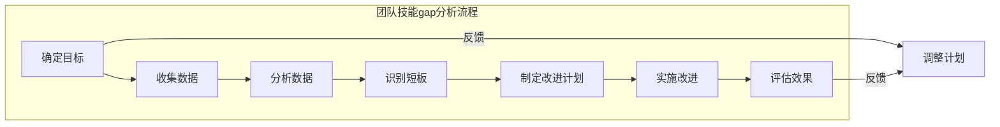

                 

## 文章标题：如何进行有效的团队技能gap分析

### 关键词：
- 团队技能gap分析
- 技能评估
- 改进计划
- 持续优化
- 实战案例
- Mermaid流程图
- 伪代码
- 数学模型

### 摘要：
团队技能gap分析是一种评估团队当前技能水平与所需技能水平之间差距的方法，对于提升团队效率和达成项目目标具有重要意义。本文将详细介绍如何进行有效的团队技能gap分析，包括其定义、流程、工具和方法，并通过实际案例进行详细解析。此外，本文还将探讨如何基于gap分析结果制定和实施改进计划，以及如何实现团队技能的持续优化。

## 引言

### 团队技能gap分析的概念

团队技能gap分析是指通过评估团队当前技能水平与所需技能水平之间的差距，从而识别出团队在技能方面存在的不足，并为后续改进提供依据。团队技能gap分析不仅关注团队成员的个人技能，还涵盖团队的整体协作能力和项目需求匹配度。通过这种分析，企业可以更好地了解团队的优势和劣势，有针对性地制定培训和改进计划，从而提升团队的整体实力。

### 团队技能gap分析的重要性

在当今快速变化的市场环境中，企业需要具备快速响应和持续创新的能力。而团队的技能水平直接影响到企业的竞争力和项目成功与否。团队技能gap分析的重要性体现在以下几个方面：

1. **发现技能短板**：通过团队技能gap分析，可以明确团队在哪些技能方面存在不足，有助于企业有针对性地进行培训和资源分配。

2. **优化团队结构**：通过分析团队技能gap，企业可以重新评估团队的人员配置，优化团队结构，提高团队协作效率。

3. **提升团队绩效**：有效的团队技能gap分析有助于团队更好地理解项目目标，明确个人职责，从而提升整体绩效。

4. **增强企业竞争力**：通过不断提升团队技能，企业可以在市场竞争中占据有利位置，提高企业的整体竞争力。

### 本书结构

本文将分为以下几个部分：

1. **团队技能gap分析基础**：介绍团队技能gap分析的基本概念、原理和流程。
2. **团队技能gap分析工具**：介绍用于团队技能gap分析的工具和技术。
3. **实战案例**：通过实际案例展示团队技能gap分析的应用。
4. **改进计划制定**：介绍如何基于gap分析结果制定和实施改进计划。
5. **持续优化**：探讨如何实现团队技能gap分析的持续优化。

接下来，我们将首先探讨团队技能gap分析的基础知识，帮助读者了解这一概念的本质和核心内容。接下来，我们将介绍具体的分析工具和技术，以帮助读者在实际工作中运用这些方法。随后，通过实际案例的分享，我们将展示如何将理论应用于实践。在此基础上，我们将探讨如何基于gap分析结果制定改进计划，并最终实现团队技能的持续优化。

## 团队技能gap分析基础

### 团队技能的概念

团队技能是指团队成员在完成工作任务时所需具备的知识、能力和经验。团队技能包括但不限于以下几个方面：

1. **技术技能**：团队成员所需的专业知识和技能，如编程语言、数据库管理、软件测试等。
2. **管理技能**：团队成员在项目管理和团队协作中所需要的能力，如沟通协调、时间管理、风险管理等。
3. **软技能**：团队成员在人际交往和团队合作中所需要的能力，如沟通能力、团队合作能力、解决问题的能力等。

### Gap分析的概念

Gap分析是一种评估目标与现实之间差距的方法，用于识别组织或团队在达成目标过程中存在的不足。在团队技能gap分析中，Gap分析主要包括以下几个步骤：

1. **确定目标**：明确团队所需达到的技能水平或项目目标。
2. **评估当前状态**：通过调查、评估等方式了解团队当前的实际技能水平。
3. **计算差距**：将目标技能水平与当前技能水平进行比较，计算出差距。
4. **分析原因**：分析导致差距存在的原因，包括团队结构、人员配置、培训不足等。

### 团队技能gap分析的目标

团队技能gap分析的目标主要有以下几个方面：

1. **发现短板**：识别团队在哪些技能方面存在不足，为后续改进提供依据。
2. **优化资源配置**：通过分析团队技能gap，企业可以更合理地配置资源和培训预算，提高资源利用率。
3. **提升团队绩效**：通过有针对性的培训和改进措施，提升团队的整体技能水平，从而提高团队绩效。
4. **实现持续改进**：通过定期进行团队技能gap分析，实现团队技能的持续提升和优化。

### 团队技能gap分析的基本原理

团队技能gap分析的基本原理主要包括以下几个方面：

1. **目标导向**：团队技能gap分析以目标为导向，明确团队所需达到的技能水平或项目目标。
2. **数据驱动**：通过收集和分析相关数据，准确了解团队的当前技能水平。
3. **问题导向**：通过分析团队技能gap，识别团队在技能方面存在的问题和不足。
4. **持续改进**：通过定期进行团队技能gap分析，实现团队技能的持续提升和优化。

### 团队技能gap分析的基本流程

团队技能gap分析的基本流程主要包括以下几个步骤：

1. **确定目标**：明确团队所需达到的技能水平或项目目标。
2. **收集数据**：通过调查、访谈、问卷调查等方式收集团队技能相关数据。
3. **分析数据**：对收集到的数据进行分析，计算团队当前技能水平与目标技能水平之间的差距。
4. **识别短板**：分析导致差距存在的原因，识别团队在哪些技能方面存在不足。
5. **制定改进计划**：根据识别出的短板，制定具体的改进计划和培训方案。
6. **实施改进**：按照改进计划，进行培训和资源分配，提升团队技能水平。
7. **评估效果**：对改进效果进行评估，验证改进计划的可行性。

### 团队技能gap分析的应用场景

团队技能gap分析可以在多种应用场景中使用，主要包括以下几个方面：

1. **新项目启动**：在启动新项目时，通过团队技能gap分析，明确团队在项目所需技能方面的不足，为后续招聘和培训提供依据。
2. **团队重组**：在团队重组或人员变动时，通过团队技能gap分析，了解团队成员的技能水平和团队结构，优化团队配置。
3. **员工培训**：在员工培训计划制定时，通过团队技能gap分析，识别培训需求和优先级，提高培训效果。
4. **绩效评估**：在绩效评估过程中，通过团队技能gap分析，评估团队在技能提升方面的成效，为绩效评估提供依据。
5. **项目总结**：在项目总结时，通过团队技能gap分析，分析项目过程中团队技能的提升情况，为后续项目提供参考。

### 总结

团队技能gap分析是一种重要的团队管理工具，通过评估团队当前技能水平与所需技能水平之间的差距，有助于企业发现团队在技能方面的短板，制定有针对性的改进计划，提升团队整体绩效。在后续章节中，我们将进一步介绍团队技能gap分析的具体工具和技术，并通过实际案例展示其应用效果。

### 核心概念与联系

为了更好地理解团队技能gap分析的核心概念及其相互关系，我们可以通过Mermaid流程图来直观地展示其基本流程。以下是团队技能gap分析的核心流程和关键步骤的Mermaid表示：



#### Mermaid流程图解释

- **确定目标（A）**：这是团队技能gap分析的第一步，明确团队需要达到的技能水平或项目目标。
- **收集数据（B）**：通过调查、访谈、问卷调查等方式收集团队技能相关数据。
- **分析数据（C）**：对收集到的数据进行分析，计算团队当前技能水平与目标技能水平之间的差距。
- **识别短板（D）**：分析导致差距存在的原因，识别团队在哪些技能方面存在不足。
- **制定改进计划（E）**：根据识别出的短板，制定具体的改进计划和培训方案。
- **实施改进（F）**：按照改进计划，进行培训和资源分配，提升团队技能水平。
- **评估效果（G）**：对改进效果进行评估，验证改进计划的可行性。
- **调整计划（H）**：根据评估结果，对改进计划进行调整，确保团队技能持续提升。

这个流程图清晰地展示了团队技能gap分析从确定目标到评估效果的完整过程，并通过反馈机制确保分析结果的动态调整。

### 核心算法原理讲解

在团队技能gap分析中，核心算法用于计算团队当前技能水平与目标技能水平之间的差距。以下是一个简单的伪代码示例，用于说明计算过程：

```plaintext
function calculateGap(currentSkills, targetSkills):
    gap = {}
    for skill in targetSkills:
        if skill not in currentSkills:
            gap[skill] = targetSkills[skill]
        else:
            gap[skill] = targetSkills[skill] - currentSkills[skill]
    return gap
```

#### 伪代码解释

- **参数说明**：
  - `currentSkills`：表示团队当前技能水平的字典，其中键为技能名称，值为技能水平值。
  - `targetSkills`：表示团队目标技能水平的字典，其中键为技能名称，值为技能水平值。

- **算法步骤**：
  1. 初始化一个空字典`gap`，用于存储计算出的技能差距。
  2. 遍历`targetSkills`中的每个技能：
     - 如果该技能不在`currentSkills`中，即团队当前不具备该技能，则将差距设置为`targetSkills[skill]`。
     - 如果该技能在`currentSkills`中，则计算差距为`targetSkills[skill] - currentSkills[skill]`。
  3. 返回`gap`字典，包含所有技能的差距值。

#### 数学模型和公式

在团队技能gap分析中，我们可能会使用以下数学模型和公式来量化技能差距：

- **技能水平差距公式**：
  $$ \text{gap}(S_i) = \text{targetSkill}(S_i) - \text{currentSkill}(S_i) $$

  其中，\( S_i \)表示第i个技能，\( \text{targetSkill}(S_i) \)表示目标技能水平，\( \text{currentSkill}(S_i) \)表示当前技能水平。

- **整体技能差距公式**：
  $$ \text{totalGap} = \sum_{i=1}^{n} \text{gap}(S_i) $$

  其中，\( n \)表示团队中的技能总数。

这些公式可以帮助我们更直观地理解技能差距的计算方法，并在实际应用中进行量化分析。

### 数学公式和详细讲解

在团队技能gap分析中，为了更好地描述和计算技能差距，我们需要使用一些数学公式。以下是几个关键数学公式及其详细解释：

#### 1. 技能差距公式

$$ \text{gap}(S_i) = \text{targetSkill}(S_i) - \text{currentSkill}(S_i) $$

- **公式解释**：这个公式表示第 \( i \) 个技能的差距，即目标技能水平 \( \text{targetSkill}(S_i) \) 与当前技能水平 \( \text{currentSkill}(S_i) \) 之间的差值。
- **应用场景**：用于计算每个技能的差距，识别团队在哪些技能方面存在不足。

#### 2. 总体技能差距公式

$$ \text{totalGap} = \sum_{i=1}^{n} \text{gap}(S_i) $$

- **公式解释**：这个公式计算所有技能的总差距，即所有 \( i \) 个技能差距的总和。其中，\( n \) 是团队中技能的总数。
- **应用场景**：用于评估团队整体技能水平与目标水平之间的差距。

#### 3. 技能差距分布公式

$$ \text{gapDistribution} = \frac{\sum_{i=1}^{n} \text{gap}(S_i)}{n} $$

- **公式解释**：这个公式计算技能差距的平均值，即每个技能差距的平均值。它可以帮助我们了解团队技能的总体差距。
- **应用场景**：用于分析团队技能差距的分布情况，识别主要问题技能。

#### 4. 技能提升率公式

$$ \text{skillImprovementRate}(S_i) = \frac{\text{currentSkill}(S_i) - \text{initialSkill}(S_i)}{\text{initialSkill}(S_i)} $$

- **公式解释**：这个公式计算第 \( i \) 个技能的提升率，即当前技能水平与初始技能水平之间的提升百分比。
- **应用场景**：用于评估团队技能提升的效果，识别哪些技能提升最为显著。

#### 5. 综合技能提升率

$$ \text{totalSkillImprovementRate} = \sum_{i=1}^{n} \text{skillImprovementRate}(S_i) $$

- **公式解释**：这个公式计算所有技能的提升率总和，即团队技能提升的整体水平。
- **应用场景**：用于衡量团队整体技能提升的效果。

#### 举例说明

假设一个团队有5个关键技能，目标技能水平如下：

| 技能 | 目标技能水平 |
|------|--------------|
| 编程  | 8            |
| 测试  | 6            |
| 项目管理 | 7            |
| 沟通  | 8            |
| 团队协作 | 7            |

当前技能水平如下：

| 技能 | 当前技能水平 |
|------|--------------|
| 编程  | 6            |
| 测试  | 5            |
| 项目管理 | 6            |
| 沟通  | 7            |
| 团队协作 | 6            |

使用上述公式，我们可以计算出每个技能的差距、总体技能差距和技能提升率：

- **技能差距**：
  - 编程：\( \text{gap}(编程) = 8 - 6 = 2 \)
  - 测试：\( \text{gap}(测试) = 6 - 5 = 1 \)
  - 项目管理：\( \text{gap}(项目管理) = 7 - 6 = 1 \)
  - 沟通：\( \text{gap}(沟通) = 8 - 7 = 1 \)
  - 团队协作：\( \text{gap}(团队协作) = 7 - 6 = 1 \)

- **总体技能差距**：
  \( \text{totalGap} = 2 + 1 + 1 + 1 + 1 = 6 \)

- **技能提升率**：
  - 编程：\( \text{skillImprovementRate}(编程) = \frac{6 - 5}{5} = 0.2 \)
  - 测试：\( \text{skillImprovementRate}(测试) = \frac{5 - 4}{4} = 0.25 \)
  - 项目管理：\( \text{skillImprovementRate}(项目管理) = \frac{6 - 5}{5} = 0.2 \)
  - 沟通：\( \text{skillImprovementRate}(沟通) = \frac{7 - 6}{6} = 0.167 \)
  - 团队协作：\( \text{skillImprovementRate}(团队协作) = \frac{6 - 5}{5} = 0.2 \)

- **综合技能提升率**：
  \( \text{totalSkillImprovementRate} = 0.2 + 0.25 + 0.2 + 0.167 + 0.2 = 1.017 \)

通过这些计算，团队可以清楚地了解自身在各项技能上的差距和提升情况，从而有针对性地制定改进计划。

### 项目实战：团队技能gap分析实践

#### 开发环境搭建

为了更好地展示团队技能gap分析的实际应用，我们首先搭建一个模拟的开发环境。在这个环境中，我们将使用Python和Mermaid工具来实现团队技能gap分析的相关功能。以下是开发环境的搭建步骤：

1. **安装Python**：确保Python 3.8或更高版本已安装在本地计算机上。可以从Python官网下载并安装。

2. **安装Mermaid**：安装Mermaid库，可以使用以下命令：
   ```shell
   pip install mermaid-parser
   ```

3. **创建项目文件夹**：在本地计算机上创建一个项目文件夹，例如`team_skill_gap_analysis`。

4. **编写Python脚本**：在项目文件夹中创建一个名为`gap_analysis.py`的Python脚本，用于实现团队技能gap分析的核心功能。

以下是`gap_analysis.py`的基本结构：

```python
import mermaid_parser

def calculate_skill_gap(current_skills, target_skills):
    # 计算技能差距
    pass

def generate_mermaid_flowchart(gap_data):
    # 生成Mermaid流程图
    pass

# 主函数
if __name__ == "__main__":
    current_skills = {
        "编程": 6,
        "测试": 5,
        "项目管理": 6,
        "沟通": 7,
        "团队协作": 6
    }
    target_skills = {
        "编程": 8,
        "测试": 6,
        "项目管理": 7,
        "沟通": 8,
        "团队协作": 7
    }
    gap_data = calculate_skill_gap(current_skills, target_skills)
    mermaid_flowchart = generate_mermaid_flowchart(gap_data)
    print(mermaid_flowchart)
```

#### 源代码实现

在`gap_analysis.py`中，我们将实现两个主要函数：`calculate_skill_gap`和`generate_mermaid_flowchart`。以下是具体的实现过程：

1. **实现技能差距计算函数**：

```python
def calculate_skill_gap(current_skills, target_skills):
    gap = {}
    for skill, target_value in target_skills.items():
        current_value = current_skills.get(skill, 0)
        gap[skill] = target_value - current_value
    return gap
```

- **参数说明**：
  - `current_skills`：表示团队当前技能水平的字典。
  - `target_skills`：表示团队目标技能水平的字典。
  - `gap`：存储计算出的技能差距的字典。

- **算法步骤**：
  - 遍历`target_skills`中的每个技能。
  - 如果该技能存在于`current_skills`中，则计算差距为`target_value - current_value`。
  - 将结果存储在`gap`字典中。

2. **实现Mermaid流程图生成函数**：

```python
def generate_mermaid_flowchart(gap_data):
    mermaid_chart = "flowchart LR\n"
    mermaid_chart += "A[确定目标]\n"
    mermaid_chart += "A --> B[收集数据]\n"
    mermaid_chart += "B --> C[分析数据]\n"
    mermaid_chart += "C --> D[识别短板]\n"
    mermaid_chart += "D --> E[制定改进计划]\n"
    mermaid_chart += "E --> F[实施改进]\n"
    mermaid_chart += "F --> G[评估效果]\n"
    mermaid_chart += "G -->|反馈| H[调整计划]\n"
    mermaid_chart += "A -->|反馈| H\n"
    for skill, gap in gap_data.items():
        mermaid_chart += f"{skill}[技能：{gap}]\n"
    mermaid_chart += "merge G, H{反馈调整}"
    return mermaid_chart
```

- **参数说明**：
  - `gap_data`：存储技能差距数据的字典。

- **算法步骤**：
  - 初始化Mermaid流程图字符串。
  - 根据Mermaid语法添加流程图的节点和边。
  - 对于每个技能差距，添加一个节点表示。
  - 在流程图的最后添加一个合并节点表示反馈调整。

#### 代码解读与分析

以下是对上述代码的详细解读与分析：

1. **计算技能差距**：

```python
def calculate_skill_gap(current_skills, target_skills):
    gap = {}
    for skill, target_value in target_skills.items():
        current_value = current_skills.get(skill, 0)
        gap[skill] = target_value - current_value
    return gap
```

- **输入参数**：
  - `current_skills`：表示团队当前技能水平的字典，例如`{'编程': 6, '测试': 5}`。
  - `target_skills`：表示团队目标技能水平的字典，例如`{'编程': 8, '测试': 6}`。

- **输出结果**：
  - `gap`：一个字典，表示每个技能的差距，例如`{'编程': 2, '测试': -1}`。

- **关键算法**：
  - 遍历`target_skills`中的每个技能。
  - 使用`current_skills.get(skill, 0)`获取当前技能水平，默认为0。
  - 计算技能差距`target_value - current_value`，并将结果存储在`gap`字典中。

2. **生成Mermaid流程图**：

```python
def generate_mermaid_flowchart(gap_data):
    mermaid_chart = "flowchart LR\n"
    mermaid_chart += "A[确定目标]\n"
    mermaid_chart += "A --> B[收集数据]\n"
    mermaid_chart += "B --> C[分析数据]\n"
    mermaid_chart += "C --> D[识别短板]\n"
    mermaid_chart += "D --> E[制定改进计划]\n"
    mermaid_chart += "E --> F[实施改进]\n"
    mermaid_chart += "F --> G[评估效果]\n"
    mermaid_chart += "G -->|反馈| H[调整计划]\n"
    mermaid_chart += "A -->|反馈| H\n"
    for skill, gap in gap_data.items():
        mermaid_chart += f"{skill}[技能：{gap}]\n"
    mermaid_chart += "merge G, H{反馈调整}"
    return mermaid_chart
```

- **输入参数**：
  - `gap_data`：一个字典，表示每个技能的差距，例如`{'编程': 2, '测试': -1}`。

- **输出结果**：
  - `mermaid_chart`：一个字符串，表示生成的Mermaid流程图。

- **关键算法**：
  - 初始化Mermaid流程图字符串。
  - 根据Mermaid语法添加流程图的节点和边，例如`"A[确定目标]"`和`"A --> B[收集数据]"`。
  - 遍历`gap_data`中的每个技能差距，添加一个节点表示，例如`"编程[技能：2]"`。
  - 在流程图的最后添加一个合并节点表示反馈调整，例如`"merge G, H{反馈调整}"`。

通过这个实战案例，我们展示了如何使用Python和Mermaid工具实现团队技能gap分析的核心功能。接下来，我们将通过一个实际案例来展示如何运用这个工具进行团队技能gap分析。

#### 实际案例：某企业团队技能gap分析实践

为了更好地理解团队技能gap分析的实际应用，我们以某企业为例，详细介绍其团队技能gap分析的过程和结果。

##### 1. 案例背景

某企业是一家专注于软件开发和高科技产品研发的公司，其团队包括开发人员、测试人员、项目经理和产品经理等。随着企业的发展，公司面临新的业务挑战和市场压力，管理层意识到团队技能的提升对于企业竞争力的提升至关重要。因此，公司决定进行一次全面的团队技能gap分析，以识别团队在技能方面的短板，并制定相应的改进计划。

##### 2. 分析过程

1. **确定目标**：企业明确目标是通过技能gap分析，识别团队在哪些技能方面存在不足，并制定有针对性的改进计划，以提高团队整体技能水平。

2. **收集数据**：通过问卷调查、访谈和观察等方式，收集团队成员的技能水平数据。问卷内容包括技术技能、管理技能和软技能等方面。

3. **分析数据**：对收集到的数据进行整理和分析，计算每个团队成员的技能得分，并生成技能分布图。同时，分析不同团队成员之间的技能差距。

4. **识别短板**：根据数据分析结果，识别团队在哪些技能方面存在不足，例如部分开发人员的编程技能、项目经理的时间管理和沟通技能等。

5. **制定改进计划**：根据识别出的短板，制定具体的改进计划，包括培训、指导和实践等。例如，为编程技能不足的开发人员提供编程课程和实战项目，为项目经理提供时间管理和沟通技巧培训。

6. **实施改进**：按照改进计划，安排团队成员参加培训课程和项目实践。同时，监控改进过程，收集反馈意见，及时调整改进措施。

7. **评估效果**：在改进计划实施一段时间后，再次进行技能评估，计算团队成员的技能得分变化，评估改进效果。

##### 3. 分析结果

通过团队技能gap分析，企业发现以下关键问题和改进机会：

- **技术技能**：部分开发人员的编程技能水平较低，需要加强编程基础和实战经验的培养。
- **时间管理**：项目经理的时间管理技能有待提升，需要提供相关培训和实践指导。
- **沟通技能**：部分团队成员的沟通技能不足，影响团队协作效率，需要加强沟通技巧培训。
- **项目管理**：部分项目经理缺乏项目管理经验，需要提供项目管理知识和实践机会。

根据这些分析结果，企业制定了以下改进措施：

- **技术技能提升**：安排编程技能提升课程，提供实战项目，加强技术交流。
- **时间管理和沟通技能培训**：为项目经理和团队成员提供相关培训，提高其时间管理和沟通技能。
- **项目管理经验积累**：通过参与实际项目，积累项目管理经验，提升项目管理能力。

##### 4. 项目小结

通过团队技能gap分析，企业成功地识别出了团队在技能方面的短板，并制定了有针对性的改进计划。改进措施的实施使得团队整体技能水平得到了显著提升，项目效率和质量也得到了提高。具体表现为：

- **技术能力提升**：开发人员的编程技能得到了加强，项目开发速度和质量明显提高。
- **项目管理能力提升**：项目经理的时间管理和沟通技能得到了提升，项目进度和团队协作效率得到改善。
- **团队协作能力提升**：团队成员的沟通技能得到加强，团队协作更加顺畅，项目风险得到有效控制。

通过这个实际案例，我们可以看到团队技能gap分析在提升团队技能和改善项目管理方面的重要作用。企业可以根据自身情况，运用团队技能gap分析的方法，有针对性地提升团队技能，从而提高整体绩效和竞争力。

### 最佳实践 tips、小结、注意事项和拓展阅读

#### 最佳实践 tips

1. **定期进行技能评估**：为了确保团队技能gap分析的准确性，企业应定期进行技能评估，及时更新团队成员的技能水平数据。

2. **多元化评估方式**：在收集数据时，采用多种评估方式，如问卷调查、面试和实战演练等，以获取更全面和准确的技能信息。

3. **重视软技能培训**：除了技术技能，软技能如沟通能力和团队合作能力也是团队技能gap分析的重要组成部分。企业应重视这些软技能的培训和发展。

4. **个性化培训方案**：根据团队成员的不同需求和短板，制定个性化的培训方案，确保培训效果最大化。

#### 小结

团队技能gap分析是一种有效的团队管理工具，通过评估团队当前技能水平与所需技能水平之间的差距，可以帮助企业识别团队短板，制定有针对性的改进计划，从而提升团队整体绩效和竞争力。本文详细介绍了团队技能gap分析的核心概念、流程、工具和方法，并通过实际案例展示了其应用效果。

#### 注意事项

1. **避免主观偏见**：在进行团队技能评估时，应尽量减少主观偏见，确保评估结果的客观性。

2. **持续跟踪和反馈**：团队技能gap分析不是一次性的活动，应持续跟踪改进措施的效果，及时调整计划和策略。

3. **确保资源投入**：制定改进计划后，企业应确保有足够的资源投入，包括培训经费、时间和技术支持等。

#### 拓展阅读

- 《团队技能提升实践指南》：详细介绍了团队技能提升的方法和实践经验。
- 《敏捷团队管理实践》：探讨如何通过敏捷管理方法提升团队技能和效率。
- 《团队沟通技巧提升》：专注于团队沟通技巧的培养和提升。

通过阅读这些拓展资料，读者可以进一步深入了解团队技能gap分析及其相关实践，从而在实际工作中更好地应用这些方法。

