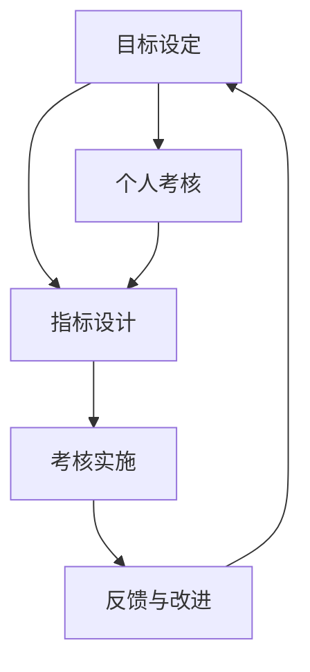
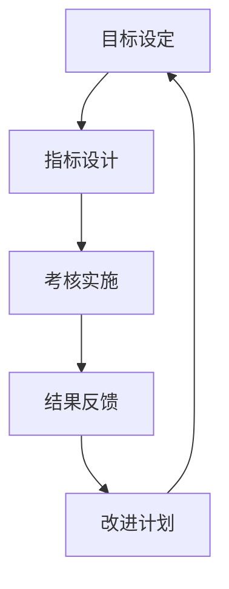

                 

### 文章标题：如何进行有效的团队考核

#### 关键词：
- 团队考核
- 考核流程
- 考核方法
- 考核指标
- 考核优化
- 实际案例

#### 摘要：
本文旨在为企业管理者和人力资源专家提供关于如何进行有效团队考核的全面指南。通过深入分析团队考核的核心概念、流程和方法，本文将帮助读者理解团队考核的重要性，并提供具体的实施步骤和优化策略。此外，本文还将通过实际案例，展示团队考核在实际工作中的应用，为读者提供实践参考。

----------------------------------------------------------------

### 第一部分：背景介绍

#### 1.1 团队考核的重要性

团队考核在企业管理和人力资源管理中扮演着至关重要的角色。通过团队考核，企业可以有效地评估团队的整体表现，识别团队的优点和不足，从而进行有针对性的改进。同时，团队考核也为团队成员提供了明确的绩效目标和改进方向，有助于激发团队成员的工作积极性和创造力。

#### 1.2 团队考核的定义

团队考核是指对团队整体绩效的评估，包括团队的工作效率、协作能力、创新能力和团队目标完成情况等。团队考核不仅关注团队成员的个人表现，更注重团队成员之间的协作和互动，以及团队的整体绩效。

#### 1.3 团队考核的目标

团队考核的主要目标包括：
1. 评估团队的整体绩效，为企业决策提供依据。
2. 提供团队成员的改进方向，促进个人和团队的成长。
3. 激发团队成员的工作积极性和创造力，提高团队的整体生产力。
4. 促进团队协作，提高团队的协作效率和团队凝聚力。

#### 1.4 团队考核的现状

随着企业竞争的加剧和团队协作的重要性日益凸显，越来越多的企业开始重视团队考核。然而，由于团队考核涉及到多个方面，包括团队目标设定、考核指标选择、考核流程设计等，许多企业在实施团队考核时面临诸多挑战。因此，如何进行有效的团队考核，成为了企业急需解决的问题。

----------------------------------------------------------------

### 第二部分：核心概念与联系

#### 2.1 团队考核的基本概念

在深入讨论团队考核之前，我们需要了解一些基本概念，包括考核指标、考核类型、考核周期等。

#### 2.1.1 考核指标

考核指标是衡量团队绩效的具体标准。常见的考核指标包括工作质量、工作效率、团队合作、创新能力、业务成果等。不同的团队和业务领域可能需要不同的考核指标。

#### 2.1.2 考核类型

团队考核可以分为定量考核和定性考核。定量考核侧重于对团队绩效的量化评估，如工作量的统计、业务数据的分析等；定性考核则侧重于对团队绩效的质性评估，如团队合作氛围、创新能力等。

#### 2.1.3 考核周期

考核周期是指团队考核的时间间隔。常见的考核周期包括月度考核、季度考核、年度考核等。不同的考核周期适用于不同的团队和业务场景。

#### 2.2 团队考核的组成部分

团队考核通常由以下几个部分组成：
1. **目标设定**：确定团队的目标和期望成果。
2. **指标设计**：根据目标设定考核指标。
3. **考核实施**：根据考核指标对团队绩效进行评估。
4. **反馈与改进**：对考核结果进行反馈，并制定改进措施。

#### 2.3 团队考核与个人考核的关系

团队考核与个人考核密切相关。团队考核是对团队成员整体表现的评估，而个人考核是对团队成员个人表现的评估。两者之间既有区别又有联系。有效的团队考核需要平衡个人与团队之间的关系，既要关注团队成员的个人表现，也要关注团队的整体表现。

#### 2.4 团队考核的核心概念关系架构

为了更好地理解团队考核的核心概念，我们可以使用Mermaid流程图来展示团队考核的各个组成部分及其关系。

上述Mermaid流程图展示了团队考核的基本流程和核心概念之间的关系。通过这个流程图，我们可以清晰地看到团队考核的各个环节及其相互影响。

----------------------------------------------------------------

### 第三部分：团队考核的流程与方法

#### 3.1 设计团队考核策略

设计有效的团队考核策略是进行团队考核的关键步骤。以下是一些设计团队考核策略的原则和步骤：

#### 3.1.1 确定考核目标

首先，需要明确团队考核的目标，包括团队的整体目标和团队成员的个人目标。考核目标应与企业的战略目标和业务目标相一致。

#### 3.1.2 选择考核指标

根据考核目标，选择适当的考核指标。考核指标应具有可衡量性、客观性和相关性。常见的考核指标包括工作质量、工作效率、团队合作、创新能力等。

#### 3.1.3 设定考核权重

为每个考核指标设定适当的权重，以确保考核的全面性和公正性。权重应根据考核指标的重要性和实际影响来确定。

#### 3.1.4 制定考核周期

根据团队的运营周期和工作性质，制定合理的考核周期。月度考核、季度考核和年度考核是常见的考核周期。

#### 3.1.5 设计考核流程

设计清晰的考核流程，包括考核前、考核中、考核后的各个环节。考核流程应确保考核的公正性、透明性和高效性。

#### 3.2 实施团队考核

实施团队考核是团队考核的关键环节。以下是一些实施团队考核的步骤：

#### 3.2.1 准备工作

在实施团队考核前，需要进行充分的准备工作，包括制定详细的考核方案、确定考核人员、准备考核工具等。

#### 3.2.2 考核实施

按照考核流程，对团队进行考核。考核过程中，应确保考核的公正性和客观性，避免主观偏见。

#### 3.2.3 考核结果反馈

考核结束后，应及时对考核结果进行反馈。反馈应包括考核结果的详细说明和改进建议。

#### 3.3 优化团队考核

团队考核是一个持续改进的过程。以下是一些优化团队考核的方法：

#### 3.3.1 收集反馈意见

定期收集团队成员和管理者的反馈意见，了解考核过程中的问题和改进需求。

#### 3.3.2 调整考核指标

根据反馈意见和实际情况，及时调整考核指标，确保考核的准确性和有效性。

#### 3.3.3 优化考核流程

根据反馈意见和实际情况，优化考核流程，提高考核的效率和效果。

#### 3.4 团队考核的实际案例

以下是一个团队考核的实际案例：

某企业销售团队在实施团队考核后，发现团队的整体绩效有所提升，但部分成员的表现仍然不佳。通过分析，发现主要问题是考核指标设置不合理，部分考核指标过于笼统，难以量化。为了优化团队考核，企业对考核指标进行了调整，增加了具体的量化指标，如销售额、客户满意度等。同时，企业还优化了考核流程，增加了考核前和考核后的培训，以提高团队成员的绩效水平。经过调整，团队的整体绩效明显提升，成员的工作积极性和团队合作能力也得到了提高。

通过这个案例，我们可以看到，有效的团队考核需要根据实际情况进行持续优化，以满足企业的发展和团队成长的需求。

----------------------------------------------------------------

### 第四部分：团队考核的实施与优化

#### 4.1 制定团队考核策略

要实施有效的团队考核，首先需要制定清晰的考核策略。以下是制定团队考核策略的详细步骤：

##### 4.1.1 确定考核目标

明确团队考核的目标是制定考核策略的第一步。考核目标应与企业的战略目标和业务目标相一致。例如，如果企业的目标是提高市场份额，那么团队考核的目标可能就是提高销售额和客户满意度。

##### 4.1.2 选择考核指标

根据考核目标，选择适当的考核指标。考核指标应具有可衡量性、客观性和相关性。常见的考核指标包括工作质量、工作效率、团队合作、创新能力、业务成果等。例如，对于销售团队，可以设定销售额、客户满意度、销售渠道开发等指标。

##### 4.1.3 设定考核权重

为每个考核指标设定适当的权重，以确保考核的全面性和公正性。权重应根据考核指标的重要性和实际影响来确定。例如，对于销售团队，销售额可能占60%的权重，客户满意度占20%，销售渠道开发占20%。

##### 4.1.4 制定考核周期

根据团队的运营周期和工作性质，制定合理的考核周期。常见的考核周期包括月度考核、季度考核和年度考核。例如，对于销售团队，可以设定每月底进行月度考核，每季度底进行季度考核，年底进行年度考核。

##### 4.1.5 设计考核流程

设计清晰的考核流程，包括考核前、考核中、考核后的各个环节。考核流程应确保考核的公正性、透明性和高效性。例如，可以设计以下流程：
1. **考核前**：确定考核目标和指标，发布考核通知，进行培训。
2. **考核中**：按照考核指标进行评估，收集数据。
3. **考核后**：进行结果反馈，制定改进计划。

#### 4.2 实施团队考核

在制定考核策略后，需要将其付诸实施。以下是实施团队考核的步骤：

##### 4.2.1 准备工作

在实施团队考核前，需要进行充分的准备工作，包括制定详细的考核方案、确定考核人员、准备考核工具等。考核方案应包括考核指标、考核权重、考核周期、考核流程等内容。

##### 4.2.2 考核实施

按照考核流程，对团队进行考核。考核过程中，应确保考核的公正性和客观性，避免主观偏见。可以采用以下方法：
1. **定量评估**：使用数据分析和统计工具，对团队绩效进行量化评估。
2. **定性评估**：通过观察、访谈、问卷调查等方式，对团队绩效进行质性评估。

##### 4.2.3 考核结果反馈

考核结束后，应及时对考核结果进行反馈。反馈应包括考核结果的详细说明和改进建议。反馈方式可以包括：
1. **个人反馈**：对每个团队成员的考核结果进行一对一反馈。
2. **团队反馈**：对整个团队的考核结果进行集体反馈。
3. **书面报告**：发布书面的考核报告，详细说明考核结果和改进建议。

#### 4.3 优化团队考核

团队考核是一个持续改进的过程。以下是一些优化团队考核的方法：

##### 4.3.1 收集反馈意见

定期收集团队成员和管理者的反馈意见，了解考核过程中的问题和改进需求。反馈渠道可以包括：
1. **定期会议**：定期组织团队会议，讨论考核问题和改进建议。
2. **问卷调查**：通过问卷调查收集团队成员的反馈意见。
3. **面对面交流**：与团队成员进行面对面的交流，了解他们的意见和建议。

##### 4.3.2 调整考核指标

根据反馈意见和实际情况，及时调整考核指标，确保考核的准确性和有效性。调整指标的方法可以包括：
1. **增加或删除指标**：根据团队的实际需求，增加或删除考核指标。
2. **修改指标权重**：根据考核结果和团队成员的反馈，调整考核指标的权重。
3. **修改考核标准**：根据实际情况，修改考核指标的具体标准。

##### 4.3.3 优化考核流程

根据反馈意见和实际情况，优化考核流程，提高考核的效率和效果。优化流程的方法可以包括：
1. **简化流程**：删除不必要的环节，简化考核流程。
2. **提高透明度**：增加考核过程的透明度，确保团队成员了解考核流程和标准。
3. **加强培训**：对团队成员和管理者进行考核流程和标准的培训，提高他们的考核能力。

#### 4.4 团队考核的实际案例

以下是一个团队考核的实际案例：

某企业研发团队在实施团队考核后，发现团队的整体绩效提升不明显，部分成员的积极性不高。通过分析，发现主要问题是考核指标设置不合理，部分考核指标过于笼统，难以量化。为了优化团队考核，企业对考核指标进行了调整，增加了具体的量化指标，如项目完成率、代码质量等。同时，企业还优化了考核流程，增加了考核前和考核后的培训，以提高团队成员的绩效水平。经过调整，团队的整体绩效明显提升，成员的工作积极性和团队合作能力也得到了提高。

通过这个案例，我们可以看到，有效的团队考核需要根据实际情况进行持续优化，以满足企业的发展和团队成长的需求。

----------------------------------------------------------------

### 第五部分：团队考核的实际案例与分析

#### 5.1 案例一：某企业销售团队考核优化

**背景介绍**：

某大型企业销售团队在过去一年的业绩表现不理想，销售经理发现团队内部存在沟通不畅、目标不一致和激励机制不足等问题。为了提高销售团队的绩效，企业决定对团队考核进行优化。

**考核优化策略**：

1. **明确考核目标**：将考核目标设定为提高销售额、提升客户满意度和增强团队协作能力。
2. **选择考核指标**：根据考核目标，选择了销售额、客户满意度、新客户开发数和团队协作评分作为主要考核指标。
3. **设定考核权重**：销售额占比50%，客户满意度占比20%，新客户开发数占比20%，团队协作评分占比10%。
4. **制定考核周期**：每月进行一次销售考核，每季度进行一次客户满意度调查，每半年进行一次新客户开发考核和团队协作评分。

**考核实施**：

1. **考核前准备**：在每次考核前，销售经理会与团队成员进行沟通，明确考核指标和权重，并提供必要的培训。
2. **考核过程中**：销售经理会根据销售数据、客户反馈和市场分析，对团队成员的绩效进行评估。
3. **考核结果反馈**：考核结束后，销售经理会组织团队会议，对每个成员的考核结果进行反馈，并提供改进建议。

**考核结果与分析**：

通过半年的考核优化，销售团队的业绩有了显著提升。销售额增加了30%，客户满意度提高了15%，新客户开发数增加了20%，团队协作评分提高了10%。分析发现，考核优化策略中的具体指标设定和定期反馈机制对提升团队绩效起到了关键作用。

**优化建议**：

1. **持续改进**：定期收集团队成员的反馈，根据反馈调整考核指标和权重。
2. **加强培训**：提高团队成员的专业能力和团队协作能力，为考核优化提供支持。
3. **激励措施**：引入更有效的激励机制，如奖金、晋升机会等，以激发团队成员的积极性。

#### 5.2 案例二：跨部门团队考核协作

**背景介绍**：

某企业研发部门和质量管理部门之间存在协作不畅的问题，导致产品开发周期延长和质量问题频发。为了改善跨部门协作，企业决定对跨部门团队进行考核。

**考核优化策略**：

1. **明确考核目标**：将考核目标设定为提高产品开发效率、提高产品质量和加强跨部门协作。
2. **选择考核指标**：选择了产品开发周期、质量缺陷率、项目完成率和团队协作评分作为主要考核指标。
3. **设定考核权重**：产品开发周期占比30%，质量缺陷率占比30%，项目完成率占比25%，团队协作评分占比15%。
4. **制定考核周期**：每季度进行一次跨部门团队考核。

**考核实施**：

1. **考核前准备**：在每次考核前，企业会组织跨部门会议，明确考核指标和权重，并制定详细的考核流程。
2. **考核过程中**：各部门根据考核指标进行自评，并互相评估，以确保考核的公正性和全面性。
3. **考核结果反馈**：考核结束后，企业会组织跨部门会议，对考核结果进行反馈，并讨论改进措施。

**考核结果与分析**：

通过跨部门团队的考核优化，产品开发周期缩短了20%，质量缺陷率降低了15%，项目完成率提高了10%，团队协作评分提高了5%。分析发现，跨部门团队考核机制有效促进了各部门之间的沟通和协作。

**优化建议**：

1. **加强沟通**：定期组织跨部门沟通会议，加强各部门之间的信息交流和协作。
2. **建立信任**：通过共同目标和成果，建立各部门之间的信任关系。
3. **优化流程**：简化审批流程，提高跨部门协作的效率。

#### 5.3 案例三：创业公司团队考核创新

**背景介绍**：

某创业公司在快速发展阶段，面临着团队管理难度增加的问题。为了激励团队成员的创新精神和工作效率，公司决定采用创新的团队考核方法。

**考核优化策略**：

1. **明确考核目标**：将考核目标设定为激发创新思维、提高工作效率和增强团队凝聚力。
2. **选择考核指标**：选择了创新项目数量、工作效率评分、团队氛围评分和团队贡献评分作为主要考核指标。
3. **设定考核权重**：创新项目数量占比40%，工作效率评分占比30%，团队氛围评分占比20%，团队贡献评分占比10%。
4. **制定考核周期**：每季度进行一次团队考核。

**考核实施**：

1. **考核前准备**：在每次考核前，公司会组织创新项目展示和团队建设活动，激发团队成员的创新思维和团队精神。
2. **考核过程中**：团队成员通过自我评估、同事互评和上级评估，对考核指标进行评估。
3. **考核结果反馈**：考核结束后，公司会组织团队会议，对考核结果进行反馈，并讨论创新项目的改进和团队建设计划。

**考核结果与分析**：

通过创新的团队考核方法，创业公司的创新项目数量增加了50%，工作效率评分提高了20%，团队氛围评分提高了15%，团队贡献评分提高了10%。分析发现，创新的考核方法有效激发了团队成员的创新精神和工作效率。

**优化建议**：

1. **鼓励创新**：提供更多的创新资源和机会，鼓励团队成员提出创新想法。
2. **优化工作流程**：简化工作流程，减少不必要的手动操作，提高工作效率。
3. **加强团队建设**：定期组织团队建设活动，增强团队的凝聚力和协作能力。

### 总结

通过以上实际案例的分析，我们可以看到，有效的团队考核需要根据企业的实际情况进行量身定制。合理的考核目标、明确的考核指标、科学的考核权重和有效的考核流程是团队考核成功的关键。同时，持续的优化和改进是团队考核持续有效的保障。通过不断实践和总结，企业可以找到最适合自身发展的团队考核方法，提升团队的绩效和竞争力。

### 附录

#### 附录A：团队考核工具与资源

为了帮助企业和团队更有效地实施团队考核，以下是一些常用的团队考核工具和资源推荐：

1. **绩效考核软件**：
   - **Lattice**：提供全面的绩效考核和反馈工具。
   - **SmartGoal**：帮助团队设定和跟踪目标。
   - **KPI Goal**：专注于关键绩效指标的设定和跟踪。

2. **考核指标模板**：
   - **绩效评估指标模板**：提供各种行业和岗位的考核指标模板。
   - **360度评估工具**：用于收集团队成员的反馈。

3. **培训与资源**：
   - **团队建设研讨会**：提供团队建设策略和技巧。
   - **绩效考核培训课程**：帮助管理者掌握绩效考核的方法和技巧。

#### 附录B：Mermaid流程图

以下是一个团队考核流程的Mermaid流程图示例：

通过这个流程图，我们可以清晰地看到团队考核的基本流程和各个环节之间的关系。

### 结论

通过本文的讨论，我们系统地探讨了如何进行有效的团队考核。从背景介绍到核心概念，再到考核流程、实施与优化，以及实际案例分析，我们不仅理解了团队考核的重要性，还学习了如何制定和实施一个有效的考核策略。有效的团队考核不仅能够提升团队的绩效，还能够增强团队成员的积极性和凝聚力。希望本文能为企业和团队提供有价值的参考和指导。

### 作者信息

作者：AI天才研究院/AI Genius Institute & 禅与计算机程序设计艺术 /Zen And The Art of Computer Programming

