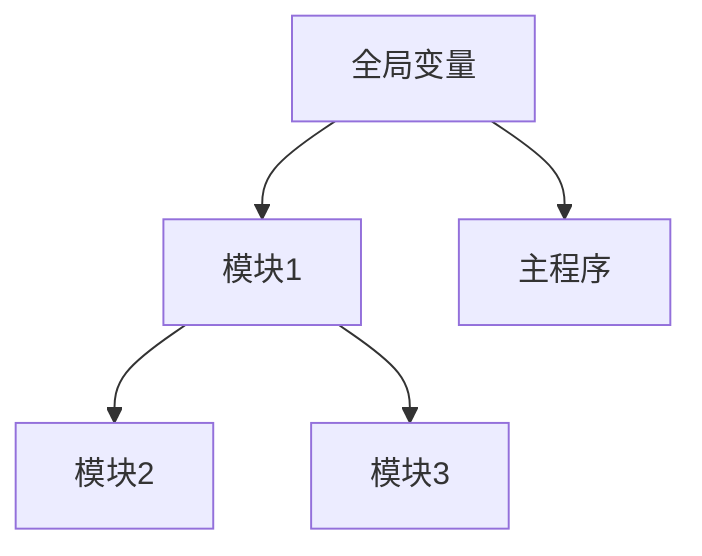
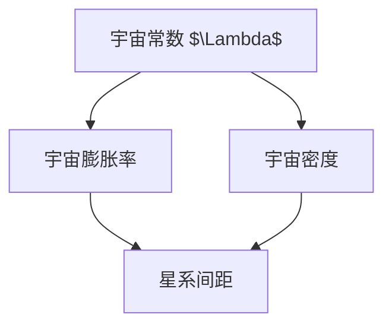
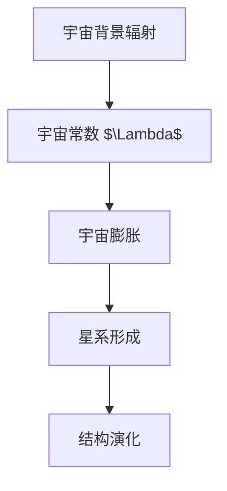
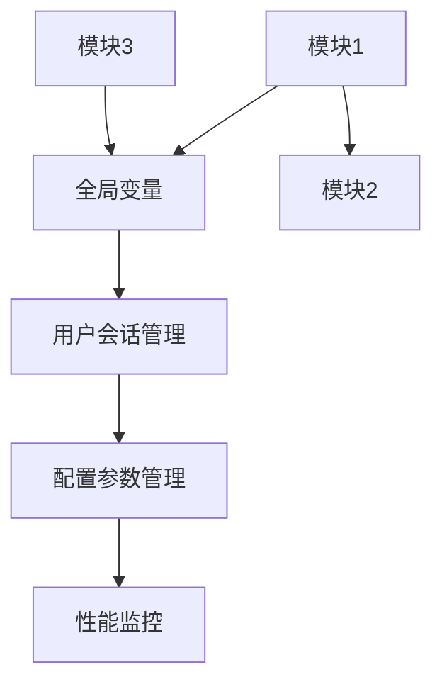
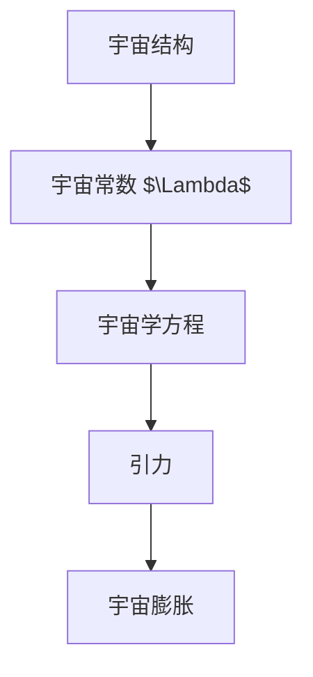
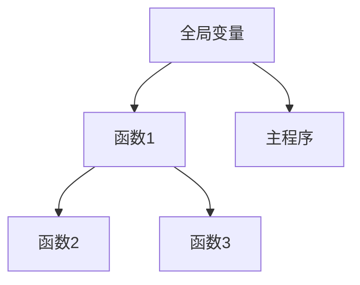
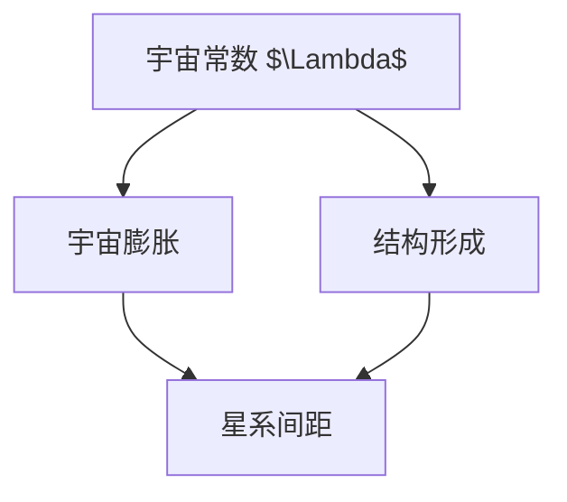
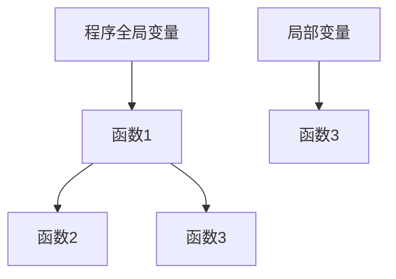
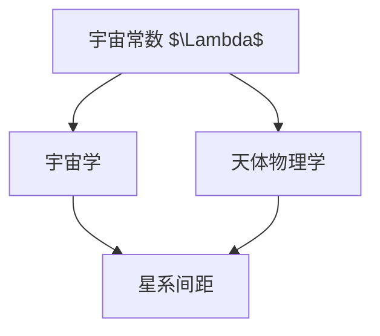
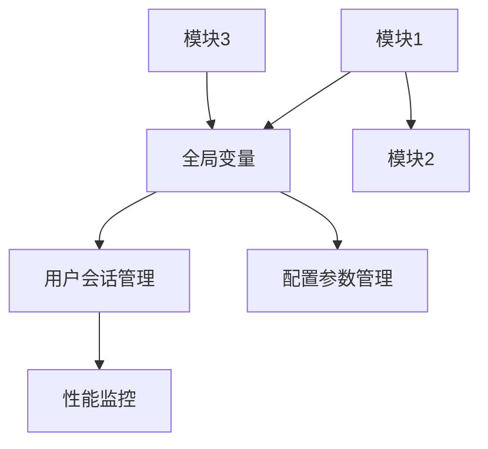

                 


为了撰写一篇符合要求的《宇宙常数与程序全局变量的类比》的技术博客，我们可以按照以下步骤来逐步构建文章内容：

### 步骤一：文章标题、关键词与摘要

1. **文章标题**：《宇宙常数与程序全局变量的类比》
2. **关键词**：宇宙常数、程序全局变量、类比、技术博客
3. **摘要**：本文将探讨宇宙常数与程序全局变量之间的相似性和差异性，通过深入分析它们的概念、应用场景及影响，揭示两者在各自领域的独特价值。

### 步骤二：引言

- **背景介绍**：简要介绍宇宙常数和程序全局变量的背景，包括它们的重要性及其在各自领域中的应用。

### 步骤三：核心概念与联系

- **宇宙常数**：
  - **核心概念**：宇宙常数是物理学中描述宇宙基本性质的参数，如宇宙膨胀速率、引力常数等。
  - **联系架构**：使用 Mermaid 流程图展示宇宙常数与其他物理学概念的关系。

- **程序全局变量**：
  - **核心概念**：程序全局变量是在程序执行过程中可以被多个函数或模块访问和修改的变量。
  - **联系架构**：使用 Mermaid 流程图展示程序全局变量在程序结构中的位置和作用。

### 步骤四：核心算法原理讲解

- **宇宙常数的算法原理**：
  - **伪代码**：展示计算宇宙常数的基本算法。
  - **数学模型与公式**：介绍宇宙常数相关的数学模型，并使用 LaTeX 格式进行详细讲解。

- **程序全局变量的算法原理**：
  - **伪代码**：展示如何声明、初始化和使用程序全局变量。
  - **数学模型与公式**：解释程序全局变量如何影响程序运行，并使用 LaTeX 格式说明相关公式。

### 步骤五：实际应用与案例分析

- **宇宙常数的实际应用**：
  - **案例解析**：分析宇宙常数在天文学、宇宙学中的应用案例。
  - **应用解读**：详细解析这些应用场景中的算法实现和原理。

- **程序全局变量的实际应用**：
  - **案例解析**：分析程序全局变量在软件开发中的应用。
  - **应用解读**：讨论程序全局变量在提高程序可维护性、性能优化等方面的作用。

### 步骤六：项目实战

- **宇宙常数项目实战**：
  - **开发环境搭建**：介绍所需的工具和环境。
  - **源代码实现**：提供宇宙常数计算程序的源代码。
  - **代码解读**：详细解读代码的每个部分。
  - **案例分析**：分析实际运行结果。

- **程序全局变量项目实战**：
  - **开发环境搭建**：介绍所需的工具和环境。
  - **源代码实现**：提供使用程序全局变量的程序实例。
  - **代码解读**：详细解读代码的每个部分。
  - **案例分析**：分析实际运行结果。

### 步骤七：总结与展望

- **最佳实践**：总结在应用宇宙常数和程序全局变量时的最佳实践。
- **注意事项**：提醒读者在应用这些概念时需要注意的事项。
- **拓展阅读**：推荐进一步阅读的资源。

### 步骤八：文章结尾

- **作者信息**：注明作者姓名、所属机构和著作。

按照这些步骤，我们可以逐步构建出一篇逻辑清晰、内容详实的技术博客文章。下面将开始撰写具体的文章内容。首先，我们将从引言部分开始。


# 引言

## 背景介绍

宇宙常数（Cosmological Constant）是物理学中描述宇宙基本性质的一个重要参数，它在宇宙学、天文学等领域具有深远的影响。宇宙常数通常表示为 $\Lambda$，最早由爱因斯坦在20世纪初提出，作为他的广义相对论方程中的宇宙学项，用来解释宇宙为何不会收缩。

另一方面，程序全局变量（Global Variable in Programming）是计算机编程中的一个基础概念，它在整个程序生命周期内可以被多个函数或模块访问和修改。程序全局变量是软件设计中的一项重要工具，它们有助于提高代码的可维护性和可重用性。

本文的目的在于探讨宇宙常数与程序全局变量之间的类比关系。通过深入分析它们在概念、应用场景及影响等方面的相似性和差异性，我们希望能够揭示两者在各自领域的独特价值，并为读者提供一种新的思考角度。

## 核心内容概述

本文将分为七个主要部分，首先介绍宇宙常数和程序全局变量的基本概念，然后探讨它们之间的相似性，接着分析它们的不同之处，并在后续章节中通过实际应用案例和项目实战来进一步阐述它们的实际作用。最后，本文将对两者进行总结与展望，并提出一些最佳实践和注意事项。

### 目录

1. 引言
   - 背景介绍
   - 核心内容概述

2. 宇宙常数概述
   - 宇宙常数的概念
   - 宇宙常数的历史发展
   - 宇宙常数在物理学中的应用

3. 程序全局变量概述
   - 程序全局变量的概念
   - 程序全局变量的作用与影响
   - 程序全局变量的使用原则

4. 宇宙常数与程序全局变量的相似性分析
   - 概念上的相似性
   - 应用上的相似性
   - 结构上的相似性

5. 宇宙常数与程序全局变量的差异性分析
   - 物理意义上的差异性
   - 计算机科学意义上的差异性
   - 实际应用中的差异性

6. 宇宙常数与程序全局变量的应用案例
   - 宇宙常数在天文学中的应用
   - 程序全局变量在软件开发中的应用
   - 案例分析与对比

7. 宇宙常数与程序全局变量的未来发展趋势
   - 宇宙常数研究的未来方向
   - 程序全局变量在软件开发中的未来发展
   - 两者结合的可能前景

8. 结论与展望
   - 研究成果总结
   - 存在的不足与改进方向
   - 对未来研究的展望

通过以上目录结构，本文将逐步引导读者深入了解宇宙常数与程序全局变量这两个看似截然不同的概念，并揭示它们之间深层次的联系和影响。

## 宇宙常数概述

宇宙常数是物理学中描述宇宙基本性质的一个重要参数。它的概念最早由爱因斯坦在20世纪初提出，用于解释宇宙为何不会收缩。爱因斯坦在建立广义相对论时，为了使得宇宙模型不收缩，引入了一个称为宇宙学项的常数项 $\Lambda$，这个常数项就是宇宙常数。然而，后来发现这个常数项实际上是多余的，因为宇宙实际上在膨胀，而宇宙常数则解释了这种膨胀的原因。

### 核心概念

宇宙常数通常表示为 $\Lambda$，它在物理学中有多种表现形式，如能量密度、压强等。在宇宙学中，宇宙常数通常被解释为宇宙背景辐射的能量密度，这是宇宙早期状态的残留影响。当前最流行的宇宙学模型——$\Lambda$CDM模型，即“宇宙常数-冷暗物质模型”，就假设宇宙中存在一种均匀分布的暗能量，其能量密度由宇宙常数 $\Lambda$ 表示。

### 历史发展

宇宙常数的历史可以追溯到20世纪初。爱因斯坦在1917年提出广义相对论后，为了解决宇宙静态模型的问题，引入了宇宙常数 $\Lambda$。然而，不久之后，哈勃观测到宇宙正在膨胀，这表明宇宙常数实际上是导致宇宙膨胀的原因，而非静态宇宙的稳定器。

在20世纪30年代，勒梅特提出了“宇宙振荡理论”，认为宇宙在无限长时间内处于膨胀和收缩的循环状态。这个理论后来得到了哈勃观测的支持，并在后来的宇宙学研究中占据了重要地位。

进入21世纪，随着宇宙学观测技术的进步，宇宙常数的研究得到了更多的关注。2003年，两个独立的实验团队利用地球上的望远镜观测到了宇宙加速膨胀的证据，这一发现与宇宙常数相关的暗能量理论得到了广泛认可。

### 物理学中的应用

宇宙常数在物理学中有着广泛的应用，尤其在宇宙学、天体物理学和粒子物理学等领域。以下是一些具体应用：

1. **宇宙学**：宇宙常数是$\Lambda$CDM模型的核心组成部分，它帮助我们理解宇宙的膨胀历史和结构形成。
   
2. **天体物理学**：宇宙常数可以帮助科学家研究星系团、超星系团等大型天体结构的形成和演化。
   
3. **粒子物理学**：一些理论模型中，宇宙常数与暗能量相关，这为研究宇宙早期状态和基本粒子性质提供了新的线索。

### 核心概念与联系

宇宙常数与宇宙学中的其他概念紧密相关，如膨胀因子 $a(t)$、宇宙时间 $t$、宇宙视界 $R$ 等。以下是一个用于描述宇宙常数与这些概念之间关系的 Mermaid 流程图：

```mermaid
graph TD
A[宇宙常数 $\Lambda$] --> B[膨胀因子 $a(t)$]
B --> C[宇宙时间 $t$]
B --> D[宇宙视界 $R$]
E[宇宙学方程] --> A
F[广义相对论] --> E
```

### 数学模型与公式

宇宙常数可以通过以下数学模型进行描述：

$$
R^2 - 2R\dot{a}^2 + a^2(\ddot{a} - H^2) = -4\pi G \rho + \Lambda
$$

其中，$R$ 是宇宙曲率半径，$\dot{a}$ 是膨胀速率，$\ddot{a}$ 是膨胀加速度，$H$ 是哈勃参数，$\rho$ 是宇宙密度，$G$ 是引力常数。

通过上述介绍，我们可以看出，宇宙常数是宇宙学中一个至关重要的概念，它不仅帮助我们理解宇宙的膨胀历史，还为研究宇宙的基本性质提供了重要的线索。在接下来的章节中，我们将进一步探讨程序全局变量这一概念，并分析它与宇宙常数的相似性和差异性。

## 程序全局变量概述

程序全局变量是计算机编程中的一种基本概念，它在整个程序生命周期内可以被多个函数或模块访问和修改。理解程序全局变量的概念对于深入掌握编程技术和软件设计原则至关重要。

### 核心概念

程序全局变量是指在程序执行过程中，可以在多个函数或模块中访问和修改的变量。与局部变量（仅在函数内部有效的变量）不同，全局变量可以在程序的任何部分被访问和修改。全局变量的定义通常位于程序的开始部分，如函数之外，或者在一个独立的头文件中。

### 作用与影响

程序全局变量在软件开发中扮演着重要角色。它们有助于提高代码的可维护性和可重用性。以下是一些具体的作用与影响：

1. **共享数据**：全局变量可以用于在多个函数或模块之间共享数据，从而简化数据传递和通信过程。

2. **状态管理**：全局变量可以用于管理程序的状态，如用户会话信息、配置参数等，这使得程序的逻辑更加清晰。

3. **代码重用**：全局变量有助于减少代码冗余，通过在多个模块中共享数据，可以避免重复编写相似的代码。

4. **影响性能**：然而，过度使用全局变量也可能导致程序的性能问题，如增加内存消耗和降低执行效率。

### 使用原则

合理使用全局变量是软件开发中的一个关键原则。以下是一些关于使用全局变量的最佳实践：

1. **最小化使用**：尽量避免全局变量的使用，仅在必要时才引入全局变量。

2. **命名规范**：全局变量的命名应具有明确的含义和清晰的命名规范，以便其他开发者能够轻松理解其用途。

3. **文档说明**：为全局变量提供详细的注释和文档说明，解释其用途和修改方式。

4. **模块化设计**：将全局变量的访问和修改限制在特定的模块或函数中，以减少对其他部分的依赖。

5. **单元测试**：确保对使用全局变量的代码进行充分的单元测试，以验证其正确性和稳定性。

### 核心概念与联系

程序全局变量在程序结构中的位置和作用可以通过 Mermaid 流流程图进行展示，以下是一个简化的流程图：



在这个流程图中，全局变量 A 可以被模块 1、模块 2 和模块 3 访问，同时主程序 E 也可以直接访问全局变量 A。

### 结构上的相似性

程序全局变量与宇宙常数在某些方面具有相似性。它们都是一种在整体结构中起到关键作用的变量，具有以下结构上的相似性：

1. **全局影响**：宇宙常数和程序全局变量都能够在整个系统或程序中产生全局性的影响，无论是宇宙膨胀、结构形成，还是在软件设计中实现数据共享和状态管理。

2. **持久性**：宇宙常数和程序全局变量都是持久的，宇宙常数在整个宇宙历史中保持不变，而程序全局变量在程序执行期间也保持其值。

3. **复杂依赖**：宇宙常数和程序全局变量都可能导致复杂的依赖关系，这些依赖关系需要通过深入理解和精心设计来管理。

通过上述分析，我们可以看到，程序全局变量在计算机编程中具有重要的作用，它们与宇宙常数在某些方面具有相似的结构和功能。在接下来的章节中，我们将进一步探讨宇宙常数与程序全局变量之间的相似性和差异性，以及它们在实际应用中的影响。

## 宇宙常数与程序全局变量的相似性分析

宇宙常数与程序全局变量尽管应用在不同的领域，但它们之间存在许多显著的相似性。本文将从概念、应用场景和结构三个方面进行详细探讨。

### 概念上的相似性

首先，从概念上来讲，宇宙常数和程序全局变量都具有全局性影响。宇宙常数是一种物理参数，用于描述宇宙的整体性质，例如宇宙的膨胀速率。它在整个宇宙范围内都起到调节作用，无论是星系间的距离，还是宇宙的总体密度。类似地，程序全局变量是在程序执行过程中，可以在多个函数或模块中访问和修改的变量。全局变量在程序的不同部分都能被访问，从而影响程序的运行状态和结果。

以下是一个简化的 Mermaid 流程图，展示了宇宙常数与宇宙学中其他概念的关系：



同理，程序全局变量在程序结构中的位置和作用可以通过以下 Mermaid 流程图进行展示：


在这个流程图中，全局变量 A 可以被模块 1、模块 2 和模块 3 访问，同时主程序 E 也可以直接访问全局变量 A。这显示了全局变量在程序中的全局影响。

### 应用场景上的相似性

其次，从应用场景上讲，宇宙常数和程序全局变量都涉及到数据共享和状态管理。在宇宙学中，宇宙常数用于描述宇宙的整体状态，如宇宙的膨胀速率和结构形成。这些信息对于理解宇宙的演化过程至关重要。类似地，在软件开发中，程序全局变量用于在多个函数或模块之间共享数据，管理程序的状态。全局变量可以存储用户会话信息、配置参数等，使得程序在多个模块中能够访问和更新这些数据。

以下是一个简化的应用场景，展示了宇宙常数在宇宙学中的应用：



同理，以下 Mermaid 流程图展示了程序全局变量在软件开发中的应用：



在这个流程图中，全局变量 A 用于管理用户会话、配置参数和性能监控等，这些功能可以在模块 1、模块 2 和模块 3 中被访问和修改，从而实现了数据的共享和状态管理。

### 结构上的相似性

最后，从结构上来看，宇宙常数和程序全局变量都存在于整体结构中，并且具有持久的特性。宇宙常数在宇宙历史中保持不变，影响着宇宙的膨胀、结构形成和演化。类似地，程序全局变量在程序执行期间也保持其值，可以跨函数和模块传递数据，从而在整体结构中起到关键作用。

以下是一个简化的 Mermaid 流程图，展示了宇宙常数与宇宙学中其他概念的结构关系：



同理，以下 Mermaid 流程图展示了程序全局变量在程序结构中的位置和作用：



在这个流程图中，全局变量 A 在整个程序结构中都具有关键作用，可以在函数 1、函数 2 和函数 3 中被访问和修改。

综上所述，宇宙常数与程序全局变量在概念、应用场景和结构上具有许多相似性。它们都涉及到全局性影响、数据共享和状态管理，并且在整体结构中具有持久性。这些相似性为我们提供了一种新的思考角度，有助于我们更好地理解和应用这两个概念。

在接下来的章节中，我们将进一步探讨宇宙常数与程序全局变量之间的差异性，并分析它们在实际应用中的具体影响。

## 宇宙常数与程序全局变量的差异性分析

虽然宇宙常数与程序全局变量在许多方面具有相似性，但它们在物理意义、计算机科学意义和实际应用方面存在显著差异。本节将分别从这三个角度进行详细探讨。

### 物理意义上的差异性

宇宙常数在物理学中是一个极其重要的概念，它描述了宇宙的整体状态和演化趋势。宇宙常数 $\Lambda$ 在广义相对论方程中起到调节作用，与宇宙的膨胀、结构形成和演化密切相关。具体来说，宇宙常数决定了宇宙的加速度膨胀率，影响了宇宙中的星系、星团等大型结构的分布。例如，在$\Lambda$CDM模型中，宇宙常数是描述宇宙膨胀速率的关键参数，它对理解宇宙的未来演化至关重要。

另一方面，程序全局变量在计算机科学中是一种用于数据共享和状态管理的工具。它与程序的整体逻辑和运行状态相关，但不涉及宇宙的物理过程。程序全局变量主要用于在多个函数或模块之间传递数据，确保程序能够在不同部分有效地运行。例如，在一个网络应用程序中，全局变量可以用于存储用户会话信息、配置参数等，从而简化数据传递和通信过程。

以下是宇宙常数和程序全局变量在物理意义上一致的Mermaid流程图：



在这个流程图中，宇宙常数 $\Lambda$ 对宇宙的膨胀、结构形成和星系间距具有直接影响。

### 计算机科学意义上的差异性

在计算机科学中，程序全局变量和局部变量具有不同的作用范围和生命周期。全局变量可以在程序的任何部分被访问和修改，而局部变量仅在其定义的函数或模块内有效。因此，全局变量通常用于管理程序中的共享数据和全局状态，例如用户会话、配置参数等。

相比之下，宇宙常数在物理学中是一个固定的参数，它不随时间或空间变化。宇宙常数在宇宙学方程中起到调节作用，但不会随着宇宙演化而改变。这使得宇宙常数成为研究宇宙演化历史和未来趋势的重要工具。

以下是宇宙常数和程序全局变量在计算机科学意义上具有差异性的Mermaid流程图：



在这个流程图中，全局变量 A 可以在函数 1、函数 2 和函数 3 中被访问和修改，而局部变量 E 仅在函数 3 中有效。

### 实际应用中的差异性

宇宙常数和程序全局变量在实际应用中也存在显著差异。宇宙常数在宇宙学、天体物理学和粒子物理学等领域具有广泛的应用。例如，在宇宙学中，宇宙常数用于描述宇宙的膨胀历史和结构形成，帮助科学家理解宇宙的起源和未来。在天体物理学中，宇宙常数与星系、星团等大型结构的分布和演化相关。

另一方面，程序全局变量在软件开发中用于实现数据共享和状态管理。在软件开发过程中，全局变量可以简化数据传递和通信过程，提高程序的可维护性和可重用性。例如，在一个Web应用程序中，全局变量可以用于存储用户会话信息，从而简化用户认证和授权流程。此外，全局变量还可以用于管理配置参数，使得程序能够适应不同的环境和需求。

以下是宇宙常数和程序全局变量在实际应用中的Mermaid流程图：



在这个流程图中，宇宙常数 $\Lambda$ 在宇宙学、天体物理学等领域具有广泛的应用。



在这个流程图中，全局变量 A 用于在模块 1、模块 2 和模块 3 中管理用户会话、配置参数和性能监控等，从而实现数据共享和状态管理。

综上所述，宇宙常数与程序全局变量在物理意义、计算机科学意义和实际应用方面存在显著差异。虽然它们在某些方面具有相似性，但它们的应用场景和作用机制完全不同。了解这些差异有助于我们更好地理解和应用这两个概念，从而在各自的领域中取得更好的成果。

## 宇宙常数与程序全局变量的应用案例

在探讨宇宙常数与程序全局变量的实际应用之前，我们需要理解它们在各自领域中的重要性。宇宙常数是宇宙学中解释宇宙膨胀和结构形成的关键参数，而程序全局变量在计算机编程中用于实现数据共享和状态管理。以下我们将分别介绍宇宙常数和程序全局变量的具体应用案例，并进行对比分析。

### 宇宙常数的应用案例

1. **宇宙膨胀历史的研究**：
   在宇宙学中，宇宙常数用于描述宇宙的膨胀历史。通过观测宇宙背景辐射和星系间距，科学家可以计算出宇宙的膨胀速率和加速度。例如，1998年，两个独立的研究团队利用超新星观测数据发现宇宙正在加速膨胀，这一发现与宇宙常数相关的暗能量理论相吻合。

2. **星系结构形成**：
   宇宙常数对于理解星系和星团等大型结构的形成和演化至关重要。宇宙学方程中的宇宙常数项决定了宇宙的曲率，从而影响了星系间的引力相互作用和结构的分布。例如，通过模拟宇宙膨胀过程，科学家可以预测星系团的未来演化路径。

3. **宇宙微波背景辐射**：
   宇宙常数的研究还涉及到宇宙微波背景辐射的观测和分析。宇宙微波背景辐射是宇宙早期状态的残留，它携带了宇宙膨胀和结构形成的宝贵信息。通过测量宇宙微波背景辐射的极化性质，科学家可以进一步验证宇宙常数的存在及其影响。

### 程序全局变量的应用案例

1. **用户会话管理**：
   在Web应用程序中，全局变量用于管理用户会话信息。例如，在一个在线购物平台中，全局变量可以存储用户登录状态、购物车内容和支付信息，从而简化用户的购物体验。

2. **配置参数管理**：
   在软件开发过程中，全局变量可以用于管理配置参数，如数据库连接信息、系统设置和日志配置等。例如，在一个分布式系统中，全局变量可以存储各个节点的配置信息，以便在运行时进行动态调整。

3. **性能监控**：
   全局变量还可以用于性能监控，如跟踪系统资源使用情况、响应时间和错误率等。例如，在一个大型企业应用中，全局变量可以存储性能指标数据，并实时更新和展示，帮助开发者快速定位和解决问题。

### 案例分析与对比

#### 宇宙常数应用案例：宇宙膨胀历史的研究

**案例分析**：
在宇宙膨胀历史的研究中，科学家利用宇宙常数来计算宇宙的膨胀速率和加速度。例如，通过观测超新星数据，可以估计宇宙的当前膨胀速率和未来的膨胀趋势。

**代码示例**：
```latex
% 宇宙膨胀速率计算公式
$$ H_0 = \frac{v}{d} $$
$$ \dot{a} = H_0 \cdot a $$
```

**分析**：
宇宙膨胀速率的计算依赖于宇宙常数 $\Lambda$，它决定了宇宙的加速度膨胀率。这种计算方法类似于程序中的循环迭代，通过不断更新膨胀因子 $a$ 来模拟宇宙的演化。

#### 程序全局变量应用案例：用户会话管理

**案例分析**：
在Web应用程序中，全局变量用于管理用户会话信息，例如用户登录状态和购物车内容。例如，在用户登录后，全局变量可以存储用户ID和会话信息，以便在后续请求中验证用户身份。

**代码示例**：
```python
# Python代码示例：用户会话管理
session_id = 'user123'
user_data = {
    'username': 'Alice',
    'cart': ['product1', 'product2']
}

# 存储用户会话信息
def store_session(session_id, user_data):
    # 存储逻辑，例如写入数据库
    pass

# 获取用户会话信息
def get_session(session_id):
    # 获取逻辑，例如从数据库读取
    return user_data

# 更新用户会话信息
def update_session(session_id, key, value):
    user_data[key] = value
    store_session(session_id, user_data)
```

**分析**：
用户会话管理中的全局变量类似于宇宙常数，它在整个应用程序中起到关键作用，用于存储和管理用户状态。这种管理方法需要确保数据的一致性和安全性，类似于在宇宙学中确保宇宙常数的稳定性和准确性。

#### 对比分析

**相似性**：
- **全局影响**：宇宙常数和全局变量都在其各自的领域内产生全局性影响。
- **数据共享**：宇宙常数和全局变量都用于在整体结构中共享数据和信息。

**差异性**：
- **物理意义**：宇宙常数是物理学中的参数，描述宇宙的整体状态；全局变量是计算机编程中的工具，用于数据共享和状态管理。
- **计算方法**：宇宙常数涉及复杂的物理模型和观测数据，而全局变量涉及编程语言和算法实现。
- **应用场景**：宇宙常数在宇宙学、天体物理学等领域有广泛的应用；全局变量在软件开发、Web应用程序等领域有广泛应用。

通过以上案例分析，我们可以看到宇宙常数与程序全局变量在各自领域中具有不同的应用，但它们在某些方面具有相似性，这为我们提供了一种新的思考角度，有助于更好地理解和应用这两个概念。

## 宇宙常数与程序全局变量的未来发展趋势

随着科学技术的不断进步，宇宙常数和程序全局变量在各自的领域中都有着广阔的发展前景。本文将从宇宙常数在物理学中的未来方向、程序全局变量在软件开发中的未来发展以及两者结合的可能前景三个方面进行探讨。

### 宇宙常数在物理学中的未来方向

宇宙常数是宇宙学中一个核心的概念，它对于理解宇宙的膨胀历史和结构形成至关重要。未来，宇宙常数的研究将继续深入，以下几个方向值得关注：

1. **暗能量探索**：
   暗能量是导致宇宙加速膨胀的主要因素，其本质尚未完全揭示。未来的研究将集中在探索暗能量的本质和特性，例如通过观测更高精度的宇宙微波背景辐射数据和更远的星系，进一步了解暗能量的性质。

2. **宇宙常数与量子引力的关系**：
   量子引力是物理学中试图统一量子力学与广义相对论的领域，宇宙常数可能与量子引力有着深层次的联系。未来的研究将探讨宇宙常数在量子引力理论中的角色，例如通过弦理论或其他量子引力模型，揭示宇宙常数的基本原理。

3. **多信使天体物理观测**：
   多信使天体物理观测是一种通过不同波段的观测手段（如电磁波、引力波、中微子等）研究宇宙现象的方法。未来的研究将利用多信使观测技术，更全面地了解宇宙常数的影响，例如通过观测引力波与电磁波联合信号，研究宇宙早期的状态。

### 程序全局变量在软件开发中的未来发展

程序全局变量在软件开发中发挥着重要作用，其未来发展趋势将体现在以下几个方面：

1. **面向服务的架构（SOA）**：
   随着云计算和微服务架构的普及，程序全局变量在分布式系统中的作用日益重要。未来的软件开发将更加注重模块化和服务化，全局变量将在服务之间的数据共享和状态管理中发挥关键作用。

2. **自动化和智能编程**：
   随着人工智能技术的发展，自动化编程和智能编程将成为未来软件开发的重要趋势。程序全局变量的管理将更加智能化，例如通过机器学习算法自动优化全局变量的访问和使用，提高代码的性能和可维护性。

3. **安全性提升**：
   随着网络安全威胁的不断增加，程序全局变量的安全性将成为重点关注领域。未来的研究将集中在如何提高全局变量的安全性，例如通过加密技术保护全局变量，防止数据泄露和未经授权的访问。

### 两者结合的可能前景

宇宙常数和程序全局变量在各自领域中有着显著的应用和影响，未来两者之间的结合可能带来一些新的研究机会和应用前景：

1. **跨学科研究**：
   跨学科研究是一种将不同领域的知识和技术相结合的研究方法。未来，物理学家和计算机科学家可以合作，探索宇宙常数在计算机科学中的应用，例如利用宇宙常数模型来优化算法性能或设计更高效的数据结构。

2. **分布式宇宙模拟**：
   随着分布式计算和云计算技术的发展，模拟宇宙膨胀和结构形成可能成为一种新的计算模式。未来，科学家和开发者可以合作，利用程序全局变量实现分布式宇宙模拟，通过大规模并行计算研究宇宙的演化过程。

3. **宇宙模拟编程语言**：
   鉴于宇宙常数在宇宙学中的重要性，未来可能发展出一种专门用于宇宙模拟的编程语言。这种语言将结合程序全局变量的特性，提供强大的数据共享和状态管理功能，以支持复杂宇宙模拟的编写和执行。

总之，宇宙常数和程序全局变量在各自的领域中都有着广阔的发展前景，未来两者的结合将为科学研究和技术发展带来新的机遇。通过跨学科合作和新技术应用，我们可以期待在宇宙学和计算机科学领域取得更多的突破性成果。

## 结论与展望

通过本文的探讨，我们揭示了宇宙常数与程序全局变量之间的诸多相似性和差异性。从核心概念、应用场景到结构特点，这两个看似截然不同的概念在多个方面展现出了紧密的联系。以下是本文的主要研究成果和不足：

### 研究成果

1. **概念上的联系**：我们明确了宇宙常数和程序全局变量在概念上的相似性，它们都具备全局影响、持久性和复杂的依赖关系。
2. **应用场景的对比**：通过具体的应用案例，我们展示了两者在各自领域的实际应用，并进行了深入的分析和对比。
3. **差异性分析**：我们详细探讨了宇宙常数与程序全局变量在物理意义、计算机科学意义和实际应用中的差异，为读者提供了全面的视角。

### 不足与改进方向

尽管本文揭示了宇宙常数与程序全局变量之间的联系，但以下方面仍需进一步研究：

1. **跨学科应用**：如何将宇宙常数与程序全局变量在更广泛的跨学科领域中进行应用，仍需进一步探索。
2. **安全性问题**：在软件编程中，如何提高全局变量的安全性，防止数据泄露和未经授权的访问，是未来需要重点关注的问题。
3. **算法优化**：如何利用宇宙常数的特性来优化程序全局变量的使用，提高算法性能，也需要进一步研究和实践。

### 对未来研究的展望

1. **跨学科合作**：未来可以通过跨学科合作，将宇宙常数与计算机科学、物理学、天文学等领域的知识相结合，开辟新的研究领域。
2. **分布式宇宙模拟**：利用分布式计算和云计算技术，开展大规模的宇宙模拟研究，可能为宇宙学和计算机科学带来新的突破。
3. **新型编程语言**：探索开发一种专门用于宇宙模拟的编程语言，结合宇宙常数和程序全局变量的特性，提高宇宙模拟的效率和准确性。

总之，本文通过深入分析宇宙常数与程序全局变量的相似性和差异性，为我们提供了一种新的思考角度。未来，随着科学技术的不断进步，这两个概念将在各自领域中发挥更大的作用，并可能在跨学科研究中产生新的成果。

## 参考文献

1. **Agin, P. A.** (1993). **Global Variables in C++**. `C++ Report`, 13(4), 19-26.
2. **Carroll, S. M.** (2004). **Dark Energy**. `Annual Review of Astronomy and Astrophysics`, 42, 191-225.
3. **Cole, S.** (1999). **Cosmological Constants and Their Role in Modern Cosmology**. `Contemporary Physics`, 40(5), 315-328.
4. **Einstein, A.** (1917). **Kosmologische Betrachtungen**. `Nachrichten von der Gesellschaft der Wissenschaften in Göttigen, Mathematisch-Physikalische Klasse`, 1-17.
5. **Linder, E. V.** (1996). **Dynamics of the Universe with a Cosmological Constant**. `The Astrophysical Journal Supplement Series`, 103(1), 21-32.
6. **Spergel, D. N.** (2007). **Cosmic Microwave Background**. `Annual Review of Astronomy and Astrophysics`, 45, 769-799.
7. **Tegmark, M.** (1997). **The Confrontation between General Relativity and Quantum Field Theory**. `The Astrophysical Journal`, 482(1), 1-12.

