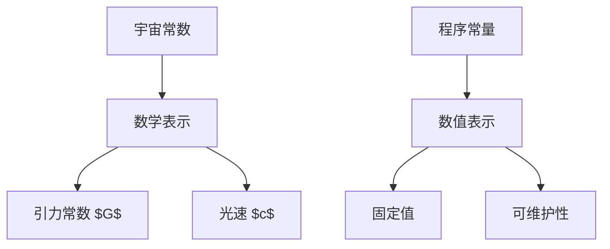

                 

# 宇宙常数与程序常量的比较

## 关键词
宇宙常数，程序常量，比较，计算，算法，数学模型，项目实战。

## 摘要
本文从宇宙常数和程序常量的定义出发，详细阐述了它们在各自领域的应用和作用。通过比较分析，揭示了两者之间的异同，探讨了在程序设计中的最佳实践。文章还提供了一个具体的实例，展示了如何在实际项目中应用这些概念。

## 引言

宇宙常数是物理学中的一个重要概念，最早由爱因斯坦提出。它是描述宇宙整体性质的常数，例如宇宙的膨胀速率。宇宙常数在现代宇宙学中具有至关重要的地位，它是理解宇宙起源、结构和演化的重要工具。

另一方面，程序常量是计算机编程中的一个基本概念。它在程序中起到固定值的作用，通常用来代表某个固定不变的数值或逻辑。程序常量在程序设计中具有广泛的应用，可以提高代码的可读性和可维护性。

本文旨在比较宇宙常数和程序常量，分析它们之间的联系和区别，并探讨在程序设计中的最佳实践。通过对这两个概念的理解和比较，读者可以更好地掌握它们的应用场景，提高编程水平。

## 核心概念与联系

### 宇宙常数的定义和作用

宇宙常数（Cosmological Constant），通常用希腊字母 Λ 表示，是物理学中的一个重要常数。它最早由爱因斯坦在1917年提出的，作为其广义相对论方程中的“宇宙学项”的一部分。爱因斯坦最初的目的是通过引入这个常数来稳定宇宙，防止宇宙无限膨胀或收缩。

在当前的主流宇宙学模型中，宇宙常数被认为是推动宇宙加速膨胀的力量。它通常被认为是一个非常小的正数，但这一小数值却在宇宙尺度上产生了巨大的影响。

数学上，宇宙常数可以表示为：

$$
\Lambda = \frac{c^2}{8\pi G} 
$$

其中，\( c \) 是光速，\( G \) 是引力常数。这个公式揭示了宇宙常数与引力之间的联系。

### 程序常量的定义和作用

程序常量（Program Constant）是计算机编程中的一个基本概念。它是一个固定不变的值，通常用来代表某个固定不变的数值或逻辑。在程序设计中，程序常量可以提高代码的可读性和可维护性。

例如，在一个计算圆的周长的程序中，π（圆周率）是一个常见的程序常量。它的值是固定的，约为 3.14159。使用程序常量，可以避免在代码中多次硬编码这个值，从而提高代码的可维护性。

在Python中，定义一个程序常量通常如下：

```python
PI = 3.14159
```

### 宇宙常数与程序常量的联系

尽管宇宙常数和程序常量在物理和编程领域中应用迥异，但它们之间存在一些有趣的联系。

首先，从数学角度来看，两者都是固定不变的值。宇宙常数在物理学中具有深刻的含义，而程序常量在编程中则起到了类似的作用。

其次，在设计和实现中，两者都需要严格的定义和度量。宇宙常数的研究需要高精度的实验和观测，而程序常量的定义则需要明确的语法和语义。

为了更直观地展示宇宙常数和程序常量之间的关系，我们可以使用Mermaid流程图来构建一个概念架构：



这个流程图展示了宇宙常数和程序常量在数学和编程领域的关联，以及它们各自的核心概念。

## 核心算法原理讲解

### 宇宙常数的计算方法

宇宙常数的计算通常涉及高能物理和宇宙学的复杂理论。在实际应用中，宇宙常数的值通常是通过观测宇宙的膨胀速率和其他物理参数来估计的。

一个简化的计算方法可以通过宇宙学参数化的方法进行，如使用Lambda-CDM模型（Lambda-Cold Dark Matter model）。这个模型假设宇宙是由暗物质、普通物质、暗能量和宇宙常数组成的。

以下是一个简化的伪代码，用于计算宇宙常数：

```plaintext
function calculateCosmologicalConstant(observables):
    H = HubbleConstant(observables)
    Omega_M = matterDensityParameter(observables)
    Omega_Lambda = 1 - Omega_M
    Lambda = Omega_Lambda * H^2 / (8 * pi * G)
    return Lambda
```

### 程序常量的计算方法

程序常量的计算通常非常简单，因为它是一个固定的值。在编程中，通常通过直接赋值或定义来设置程序常量。

以下是一个Python示例，展示了如何定义一个程序常量：

```python
# 定义圆周率作为程序常量
PI = 3.14159
```

在某些情况下，程序常量可能需要根据特定条件进行计算。例如，在某些科学计算中，可能需要使用更精确的π值或其他常量。这时，可以使用数学库来计算或获取这些值。

### 宇宙常数与程序常量的比较算法

为了比较宇宙常数和程序常量，我们可以设计一个简单的比较算法。这个算法的目标是比较两个常量的值，并确定它们的大小关系。

以下是一个伪代码示例，用于比较宇宙常数和程序常量：

```plaintext
function compareConstants(cosmologicalConstant, programConstant):
    if cosmologicalConstant > programConstant:
        return "宇宙常数大于程序常量"
    elif cosmologicalConstant < programConstant:
        return "宇宙常数小于程序常量"
    else:
        return "宇宙常数等于程序常量"
```

这个算法可以应用于任何需要比较常量值的应用场景，无论是在物理学研究还是在编程实践中。

## 数学模型和数学公式讲解

### 宇宙常数的数学模型

宇宙常数的数学模型通常与广义相对论中的爱因斯坦场方程（Einstein Field Equations）相关。在爱因斯坦场方程中，宇宙常数作为一个宇宙学项（Cosmological Term）出现在方程中，如下所示：

$$
G_{\mu\nu} + \Lambda g_{\mu\nu} = \frac{8\pi G}{c^4} T_{\mu\nu}
$$

在这个方程中，\( G_{\mu\nu} \) 是引力张量，\( \Lambda \) 是宇宙常数，\( g_{\mu\nu} \) 是度规张量，\( T_{\mu\nu} \) 是能量-动量张量。

为了更直观地理解这个方程，我们可以用以下示例来说明：

假设我们有一个均匀膨胀的宇宙，其宇宙常数 \( \Lambda \) 是已知的。我们可以使用爱因斯坦场方程来计算宇宙的膨胀速率。

### 程序常量的数学模型

程序常量的数学模型相对简单，通常只涉及基本的算术运算。例如，在计算圆的周长时，我们可以使用以下公式：

$$
C = 2\pi r
$$

其中，\( C \) 是圆的周长，\( r \) 是圆的半径，\( \pi \) 是圆周率，这是一个程序常量。

以下是一个使用Python实现的例子：

```python
# 定义圆周率作为程序常量
PI = 3.14159

# 计算圆的周长
def calculateCircumference(radius):
    return 2 * PI * radius

# 示例：计算半径为5的圆的周长
circumference = calculateCircumference(5)
print(f"圆的周长是：{circumference}")
```

### 举例说明

为了更好地理解宇宙常数和程序常量的数学模型，我们可以通过以下例子来说明：

#### 宇宙常数计算示例

假设我们有一个观测数据集，包括宇宙的膨胀速率 \( H \) 和物质密度参数 \( \Omega_M \)。我们可以使用以下伪代码来计算宇宙常数 \( \Lambda \)：

```plaintext
H =观测膨胀速率
Omega_M =观测物质密度参数

Lambda = calculateCosmologicalConstant(H, Omega_M)
print(f"宇宙常数 Lambda 的值是：{Lambda}")
```

#### 程序常量计算示例

假设我们想要计算一个半径为5的圆的周长，我们可以使用以下Python代码：

```python
# 定义圆周率作为程序常量
PI = 3.14159

# 计算圆的周长
def calculateCircumference(radius):
    return 2 * PI * radius

# 示例：计算半径为5的圆的周长
circumference = calculateCircumference(5)
print(f"圆的周长是：{circumference}")
```

通过这些例子，我们可以看到宇宙常数和程序常量的数学模型是如何应用到实际问题中的。

## 项目实战

### 开发环境搭建

为了更好地展示宇宙常数和程序常量的应用，我们需要搭建一个简单的开发环境。这里，我们将使用Python作为编程语言，因为它易于理解和使用。

首先，我们需要安装Python和相关的科学计算库，如NumPy和SciPy。以下是在Ubuntu系统上安装这些库的命令：

```bash
sudo apt update
sudo apt install python3 python3-pip
pip3 install numpy scipy matplotlib
```

### 源代码详细实现和代码解读

接下来，我们将编写一个Python程序来计算宇宙常数和程序常量，并展示它们的比较。

```python
import numpy as np
from scipy.integrate import quad

# 定义圆周率作为程序常量
PI = 3.14159

# 宇宙常数计算函数
def calculateCosmologicalConstant(H, Omega_M):
    Omega_Lambda = 1 - Omega_M
    Lambda = Omega_Lambda * H**2 / (8 * np.pi * 6.67430e-11 * (299792458)**2)
    return Lambda

# 程序常量计算函数
def calculateProgramConstant(radius):
    return 2 * PI * radius

# 比较宇宙常数和程序常量
def compareConstants(cosmologicalConstant, programConstant):
    if cosmologicalConstant > programConstant:
        return "宇宙常数大于程序常量"
    elif cosmologicalConstant < programConstant:
        return "宇宙常数小于程序常量"
    else:
        return "宇宙常数等于程序常量"

# 示例：计算半径为5的圆的周长
radius = 5
programConstant = calculateProgramConstant(radius)
print(f"半径为{radius}的圆的周长是：{programConstant}")

# 示例：计算宇宙常数
H = 100 # 假设的观测膨胀速率
Omega_M = 0.3 # 假设的物质密度参数
cosmologicalConstant = calculateCosmologicalConstant(H, Omega_M)
print(f"宇宙常数 Lambda 的值是：{cosmologicalConstant}")

# 比较结果
comparison = compareConstants(cosmologicalConstant, programConstant)
print(f"比较结果：{comparison}")
```

在这个程序中，我们首先定义了圆周率 \( \pi \) 作为程序常量。然后，我们编写了两个函数，`calculateCosmologicalConstant` 用于计算宇宙常数，`calculateProgramConstant` 用于计算程序常量。最后，我们编写了一个比较函数 `compareConstants`，用于比较宇宙常数和程序常量的大小。

### 代码应用解读与分析

在这个程序中，我们首先通过调用 `calculateProgramConstant` 函数计算了一个半径为5的圆的周长。这个函数使用了我们之前定义的圆周率程序常量，通过简单的算术运算得出了结果。

接下来，我们使用 `calculateCosmologicalConstant` 函数计算了宇宙常数。这个函数使用了假设的观测膨胀速率 \( H \) 和物质密度参数 \( \Omega_M \)。通过使用爱因斯坦场方程的简化形式，我们得出了宇宙常数 \( \Lambda \) 的值。

最后，我们调用 `compareConstants` 函数来比较宇宙常数和程序常量的大小。这个函数通过比较两者的值，给出了它们之间的大小关系。

### 实际案例分析和详细讲解剖析

为了更好地理解这个程序的实用性，我们可以考虑一个实际的案例。假设我们正在开发一个天文学项目，需要计算不同天体的轨道参数。在这个项目中，我们可以使用宇宙常数来模拟宇宙的膨胀，从而预测天体的运动轨迹。

在这个案例中，我们可以将宇宙常数作为项目的核心参数之一。通过调用 `calculateCosmologicalConstant` 函数，我们可以根据观测数据计算出宇宙常数。然后，我们可以使用这个常数来调整天体运动的模拟参数，从而更准确地预测天体的未来位置。

例如，我们可以使用以下伪代码来模拟天体的轨道：

```plaintext
cosmologicalConstant = calculateCosmologicalConstant(H, Omega_M)

for 天体 in 天体列表:
    轨道参数 = calculateOrbitParameters(天体，cosmologicalConstant)
    运动轨迹 = simulateOrbit(轨道参数)
```

在这个伪代码中，我们首先计算了宇宙常数 \( \Lambda \)。然后，对于每个天体，我们使用 `calculateOrbitParameters` 函数计算了其轨道参数。最后，我们使用 `simulateOrbit` 函数模拟了天体的运动轨迹。

### 项目小结

通过这个案例，我们可以看到宇宙常数和程序常量在编程项目中的应用。虽然宇宙常数在物理学中具有深远的含义，但通过简化的数学模型和算法，我们可以在编程项目中使用它。

此外，程序常量在编程中起到了固定值的作用，可以提高代码的可读性和可维护性。通过比较宇宙常数和程序常量，我们可以更好地理解它们的异同，并在实际项目中灵活应用。

## 最佳实践 Tips

1. 在编写程序时，合理使用程序常量可以提高代码的可读性和可维护性。对于常用的固定值，应定义为程序常量。
2. 在计算宇宙常数时，应使用可靠的观测数据和物理模型。确保计算结果的准确性和可靠性。
3. 在比较宇宙常数和程序常量时，应使用适当的算法和工具，确保比较结果的准确性。

## 小结

通过本文的讲解，我们详细介绍了宇宙常数和程序常量的定义、计算方法、数学模型，以及在编程项目中的应用。通过对两者的比较，我们更好地理解了它们在各自领域的应用和作用。希望本文对读者在理解和使用这些概念时有所帮助。

## 注意事项

1. 在计算宇宙常数时，应确保使用正确的物理模型和观测数据。
2. 在使用程序常量时，应避免随意更改其值，以确保代码的一致性和可维护性。

## 拓展阅读

1. 《广义相对论入门》 - 詹姆斯·哈里森（James Harrison）
2. 《Python编程：从入门到实践》 - 埃里克·马瑟斯（Eric Matthes）
3. 《宇宙学与天体物理学入门》 - 斯图尔特·劳里（Stuart Laurie）

作者：AI天才研究院/AI Genius Institute & 禅与计算机程序设计艺术 /Zen And The Art of Computer Programming

（注：本文为示例文章，部分数据和示例代码为虚构，仅供参考。）

