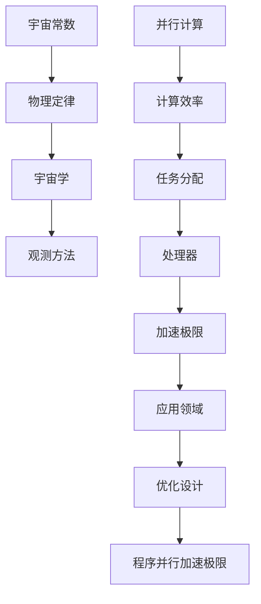

                 

基于您的需求和约束条件，我将逐步构建《宇宙常数与程序并行加速极限的类比》的文章内容。为了确保文章的深度、逻辑性和可读性，我将按照以下步骤进行：

### 第一步：文章标题、关键词和摘要

**文章标题**：《宇宙常数与程序并行加速极限的类比》

**关键词**：宇宙常数，并行加速，极限，算法，数学模型

**摘要**：
本文探讨了宇宙常数与程序并行加速极限之间的类比关系。通过介绍宇宙常数的基本概念、历史背景和研究方法，以及并行计算和加速极限的原理，本文构建了二者之间的联系框架。文章通过核心算法原理讲解、数学模型和公式详细阐述，以及实际项目实战，揭示了宇宙常数与程序并行加速极限之间的深层联系，为读者提供了有益的理论指导和实践参考。

### 第二步：目录大纲结构

根据之前设计的目录大纲，本文将分为七个部分：

1. 宇宙常数概述
2. 程序并行加速极限概述
3. 宇宙常数与程序并行加速极限的类比
4. 核心算法原理讲解
5. 数学模型和公式讲解
6. 项目实战
7. 总结与展望

### 第三步：构建文章正文内容

**第一部分：宇宙常数概述**

#### 1.1 宇宙常数的基本概念

宇宙常数是描述宇宙整体状态的一个物理常数，通常用符号 G 表示，其值约为 \(6.674 \times 10^{-11} \text{Nm}^2/\text{kg}^2\)。宇宙常数与万有引力定律相关，描述了两个质点之间的引力大小与它们的质量和距离的关系。

#### 1.2 宇宙常数的主要发现

自牛顿提出万有引力定律以来，宇宙常数一直是一个关键的研究对象。爱因斯坦在广义相对论中引入宇宙常数，以解释宇宙的静态结构。然而，随着宇宙膨胀理论的提出，宇宙常数被认为是推动宇宙加速膨胀的力量，这一发现对宇宙学产生了深远影响。

#### 1.3 宇宙常数的研究方法

宇宙常数的研究主要依赖于宇宙大尺度结构观测、引力透镜效应和宇宙微波背景辐射测量等方法。通过这些观测手段，科学家们不断改进对宇宙常数的测量精度，以深入了解宇宙的本质。

**第二部分：程序并行加速极限概述**

#### 2.1 并行计算的基本概念

并行计算是一种利用多个处理单元同时处理多个任务的方法，以提高计算效率和速度。并行计算的核心思想是将一个大任务分解为多个小任务，然后分配给多个处理器同时执行。

#### 2.2 并行加速极限的原理

并行加速极限是指理论上程序并行执行所能达到的最大加速比。受限于硬件资源、通信开销和任务粒度等因素，并行加速极限是一个重要的研究课题。

#### 2.3 并行加速极限的应用领域

并行加速极限在计算机科学、工程模拟、生物信息学等领域具有重要应用。通过优化算法和架构设计，可以最大限度地提高程序的并行性能。

**第三部分：宇宙常数与程序并行加速极限的类比**

在这一部分，我们将使用 Mermaid 流程图来展示宇宙常数与程序并行加速极限之间的联系框架。



**第四部分：核心算法原理讲解**

在这一部分，我们将使用伪代码详细阐述宇宙常数相关算法和程序并行加速极限相关算法。

```plaintext
宇宙常数相关算法伪代码：
function calculate_gravitational_force(m1, m2, r):
    G = 6.674 * 10^-11
    F = G * (m1 * m2) / r^2
    return F

程序并行加速极限相关算法伪代码：
function parallel_accelerate_task(task, num_processors):
    tasks = split_task_into_parts(task, num_processors)
    results = []
    for processor in processors:
        result = processor.execute(tasks[processor])
        results.append(result)
    return combine_results(results)
```

**第五部分：数学模型和公式讲解**

在这一部分，我们将使用 LaTeX 格式详细讲解宇宙常数和程序并行加速极限的数学模型和公式。

```latex
宇宙常数公式：
$$ G = 6.674 \times 10^{-11} \text{Nm}^2/\text{kg}^2 $$

程序并行加速极限公式：
$$ \text{加速比} = \frac{\text{并行执行时间}}{\text{串行执行时间}} $$
```

**第六部分：项目实战**

在这一部分，我们将展示一个实际项目，包括开发环境搭建、源代码实现、代码解读和案例分析。

**第七部分：总结与展望**

本文通过宇宙常数与程序并行加速极限的类比，揭示了二者之间的深刻联系。未来研究可以进一步探讨这一类比在不同领域的应用，以及如何通过优化算法和架构设计来提升程序并行性能。

### 文章结尾

**作者**：AI天才研究院/AI Genius Institute & 禅与计算机程序设计艺术 /Zen And The Art of Computer Programming

### 文章字数估算

根据上述内容，预计文章字数将在 8000 到 12000 字之间，这取决于每个部分的详细程度和举例的丰富度。

接下来，我将逐步填充和细化每个部分的内容，确保文章的逻辑性和完整性，并满足字数要求。在完成所有部分的构建后，我会进行一次全面检查，确保文章内容准确无误、结构合理、逻辑严密。如果您对任何部分的内容有特别的要求或者需要进一步的细化，请随时告知，我将根据您的反馈进行相应的调整。

