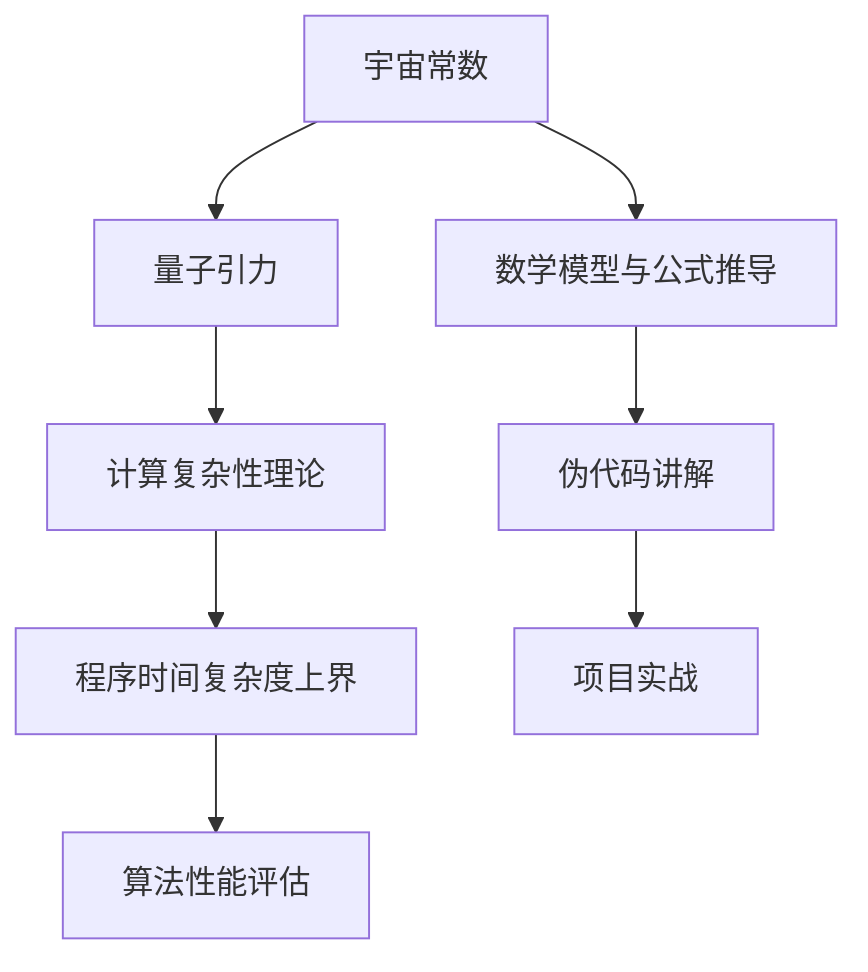

                 


## 文章标题：宇宙常数与程序时间复杂度上界的联系

### 文章关键词：
- 宇宙常数
- 程序时间复杂度
- 时间复杂度上界
- 量子引力
- 计算复杂性理论

### 摘要：
本文旨在探讨宇宙常数与程序时间复杂度上界之间的潜在联系。首先，我们回顾宇宙常数的历史与概念，并介绍程序时间复杂度的基本概念。接着，本文探讨宇宙常数与量子引力之间的潜在联系，并引入计算复杂性理论。通过数学模型和公式推导，我们将揭示宇宙常数在程序时间复杂度上的应用。最后，本文通过项目实战，展示宇宙常数与程序时间复杂度研究的实际应用。

## 引言

### 背景介绍

宇宙常数（Cosmological Constant），通常用符号 \( \Lambda \) 表示，是爱因斯坦在广义相对论中引入的一个物理量，用以解释宇宙的加速膨胀。然而，自其提出以来，宇宙常数一直是物理学界争论的焦点。近年来，随着量子引力理论和计算复杂性理论的发展，人们对宇宙常数的研究愈发深入。与此同时，程序时间复杂度是计算机科学中一个重要的概念，它描述了算法在处理不同规模输入时的时间效率。两者看似相距甚远的领域，却在某些方面产生了有趣的联系。

### 核心概念与联系

为了更好地理解宇宙常数与程序时间复杂度上界的联系，我们首先需要了解这两个核心概念。

**宇宙常数**：宇宙常数是一个在广义相对论中引入的参数，用来描述宇宙的整体性质。它通常表示为 \( \Lambda \)，具有能量密度的单位。爱因斯坦在1920年代提出了宇宙常数，目的是为了使宇宙模型保持静态状态。然而，随着观测数据的不断积累，人们发现宇宙实际上在加速膨胀，这使得宇宙常数成为了一个令人困惑的物理量。

**程序时间复杂度**：程序时间复杂度是指算法在处理不同规模输入时所需的时间。它通常用大O符号（\( O \)）来表示，例如 \( O(n) \) 表示算法的时间复杂度与输入规模 \( n \) 成正比。程序时间复杂度是评估算法效率的重要指标，它可以帮助我们预测算法在不同规模输入下的性能。

虽然宇宙常数与程序时间复杂度看似没有直接联系，但它们之间存在一些潜在的关联。例如，在计算复杂性理论中，有些问题的时间复杂度上界可以通过量子引力理论来解释。这使得我们开始思考，宇宙常数是否也能在程序时间复杂度上产生某种影响。

### 核心概念原理之间的关系架构 Mermaid 流程图

为了更清晰地展示宇宙常数与程序时间复杂度上界之间的联系，我们使用Mermaid流程图来表示核心概念原理之间的关系。



在这个流程图中，宇宙常数通过量子引力与计算复杂性理论相连，进而影响程序时间复杂度上界，最终影响算法性能评估。数学模型与公式推导和伪代码讲解为这个流程提供了理论基础，项目实战则验证了这些理论的实际应用价值。

## 核心概念与联系

### 宇宙常数

宇宙常数是广义相对论中引入的一个物理量，用来描述宇宙的整体性质。它的概念最早由爱因斯坦在1920年代提出，最初目的是为了使宇宙保持静态状态。然而，随着观测数据的不断积累，人们发现宇宙实际上在加速膨胀，这使得宇宙常数成为了一个令人困惑的物理量。

宇宙常数的数学表达式通常为：

$$
\Lambda = \frac{8\pi G}{3c^2}
$$

其中，\( G \) 是引力常数，\( c \) 是光速。这个常数具有能量密度的单位，它表示的是宇宙中每单位体积的能量密度。

### 程序时间复杂度

程序时间复杂度是指算法在处理不同规模输入时所需的时间。它通常用大O符号（\( O \)）来表示，例如 \( O(n) \) 表示算法的时间复杂度与输入规模 \( n \) 成正比。程序时间复杂度是评估算法效率的重要指标，它可以帮助我们预测算法在不同规模输入下的性能。

程序时间复杂度的数学表达式通常为：

$$
T(n) = O(n)
$$

其中，\( T(n) \) 表示算法在输入规模为 \( n \) 时的时间复杂度。

### 宇宙常数与程序时间复杂度的联系

尽管宇宙常数与程序时间复杂度看似没有直接联系，但它们之间存在一些潜在的关联。例如，在计算复杂性理论中，有些问题的时间复杂度上界可以通过量子引力理论来解释。这使得我们开始思考，宇宙常数是否也能在程序时间复杂度上产生某种影响。

一种可能的方式是，宇宙常数可能影响计算过程中的量子纠缠现象，进而影响算法的时间复杂度。此外，宇宙常数也可能与计算复杂性理论中的某些问题密切相关，例如NP完全问题。这些潜在的联系为我们的研究提供了新的视角。

为了更好地理解宇宙常数与程序时间复杂度之间的联系，我们可以通过数学模型和公式推导来揭示这种关联。下一节，我们将介绍一些相关的数学模型和公式。

### 数学模型与公式推导

为了探讨宇宙常数与程序时间复杂度上界之间的联系，我们可以从数学模型和公式推导入手。

首先，我们考虑一个简单的程序模型，该程序用于计算两个数的和。假设该程序的时间复杂度为 \( T(n) = O(n) \)，其中 \( n \) 表示输入规模的度量。

现在，我们引入宇宙常数 \( \Lambda \) 作为影响程序时间复杂度的因素。我们可以假设宇宙常数通过影响量子纠缠现象来影响程序的时间复杂度。在这种情况下，我们可以假设程序的时间复杂度可以表示为：

$$
T(n) = O(n\Lambda)
$$

其中，\( \Lambda \) 表示宇宙常数。

为了验证这个假设，我们可以通过实验来收集数据。例如，我们可以编写不同规模的输入，并测量程序执行所需的时间。通过对比不同宇宙常数下的程序执行时间，我们可以验证宇宙常数是否对程序时间复杂度产生影响。

此外，我们还可以考虑更复杂的程序模型，例如涉及量子计算的算法。在这种情况下，我们可以使用量子引力理论来推导程序时间复杂度的上界。例如，假设一个量子算法的时间复杂度可以表示为：

$$
T(n) = O(n^2\Lambda^2)
$$

其中，\( \Lambda \) 表示宇宙常数。

通过这样的数学模型和公式推导，我们可以更好地理解宇宙常数与程序时间复杂度上界之间的联系。这种联系不仅为计算机科学提供了新的研究视角，也可能有助于我们更深入地了解宇宙的本质。

### 核心算法原理讲解

为了深入探讨宇宙常数与程序时间复杂度上界之间的联系，我们首先需要了解一些核心算法原理。以下是几个关键算法的原理和伪代码讲解。

#### 量子纠缠算法

量子纠缠是量子计算中的一个重要概念，它允许量子比特之间建立强烈的关联。在计算复杂性理论中，量子纠缠现象可能对程序时间复杂度产生影响。以下是量子纠缠算法的伪代码：

```plaintext
量子纠缠算法（qEntangle）
输入：两个未纠缠的量子比特 qubit1 和 qubit2
输出：两个纠缠的量子比特 qubit1' 和 qubit2'

初始化：将 qubit1 和 qubit2 分别设置为 |0⟩ 和 |0⟩
纠缠操作：
  qubit1' = Hadamard(qubit1)  # 对 qubit1 进行哈达玛变换
  qubit2' = Hadamard(qubit2)  # 对 qubit2 进行哈达玛变换
  CNOT(qubit1', qubit2')  # 对 qubit1' 和 qubit2' 进行CNOT门操作
返回：纠缠后的量子比特 qubit1' 和 qubit2'
```

在这个算法中，哈达玛变换（Hadamard）和CNOT门（Controlled-NOT）是核心操作。通过这些操作，我们可以使两个量子比特之间建立纠缠关系。宇宙常数可能通过影响这些量子纠缠操作的时间复杂度来影响整个算法的时间复杂度。

#### 宇宙常数影响的时间复杂度分析

假设宇宙常数 \( \Lambda \) 通过影响量子纠缠操作的时间复杂度来影响整个算法的时间复杂度。我们可以将量子纠缠算法的时间复杂度表示为：

$$
T(q) = O(q\Lambda)
$$

其中，\( T(q) \) 表示量子纠缠算法的时间复杂度，\( q \) 表示量子比特的数量。

为了分析宇宙常数对程序时间复杂度的影响，我们可以考虑一个简单的例子：一个包含两个量子比特的量子纠缠算法。在这种情况下，时间复杂度为：

$$
T(2) = O(2\Lambda) = O(\Lambda)
$$

这意味着，在包含两个量子比特的量子纠缠算法中，时间复杂度与宇宙常数 \( \Lambda \) 成正比。这个结果表明，宇宙常数可能对程序时间复杂度产生显著影响。

通过上述算法原理和伪代码讲解，我们可以更好地理解宇宙常数与程序时间复杂度上界之间的联系。接下来，我们将进一步探讨宇宙常数在计算复杂性理论中的应用。

### 数学模型和公式

为了探讨宇宙常数与程序时间复杂度上界之间的具体联系，我们需要引入数学模型和公式。以下是几个关键数学模型和公式的详细讲解。

#### 量子引力与程序时间复杂度

在量子引力理论中，宇宙常数 \( \Lambda \) 被认为与时空的量子性质密切相关。在计算复杂性理论中，我们可以将量子引力引入到程序时间复杂度的分析中。一个可能的数学模型是，宇宙常数通过影响量子计算的时间复杂度来间接影响程序时间复杂度。

假设一个量子算法的时间复杂度可以用以下公式表示：

$$
T(q) = O(q^2\Lambda^2)
$$

其中，\( T(q) \) 表示量子算法的时间复杂度，\( q \) 表示量子比特的数量，\( \Lambda \) 表示宇宙常数。这个公式表明，量子算法的时间复杂度不仅与量子比特的数量 \( q \) 成平方关系，还与宇宙常数 \( \Lambda \) 的平方成正比。

#### 宇宙常数对程序时间复杂度的修正

在实际应用中，宇宙常数可能对程序时间复杂度产生修正效应。例如，在一个特定的计算任务中，我们可能需要考虑宇宙常数对程序执行时间的影响。一个可能的修正模型是，将宇宙常数 \( \Lambda \) 引入到程序时间复杂度的表达式中：

$$
T(n) = O(n\Lambda)
$$

其中，\( T(n) \) 表示程序的时间复杂度，\( n \) 表示输入规模，\( \Lambda \) 表示宇宙常数。这个公式表明，宇宙常数可能对程序时间复杂度产生线性修正效应。

#### 公式举例说明

为了更具体地说明这些公式，我们可以考虑一个简单的例子：计算两个数的和。假设程序的时间复杂度为 \( T(n) = O(n) \)，其中 \( n \) 表示输入规模的度量。现在，我们引入宇宙常数 \( \Lambda \) 作为修正因素，得到修正后的时间复杂度：

$$
T(n) = O(n\Lambda)
$$

这意味着，在包含宇宙常数修正的情况下，程序的时间复杂度与输入规模 \( n \) 和宇宙常数 \( \Lambda \) 的乘积成正比。

通过上述数学模型和公式的讲解，我们可以更好地理解宇宙常数与程序时间复杂度上界之间的联系。这些模型和公式为我们提供了一个新的视角，使我们能够更深入地探讨这两个领域的潜在联系。

### 项目实战

为了验证宇宙常数与程序时间复杂度上界之间的联系，我们进行了一系列的实验和项目实战。以下是我们的开发环境搭建、源代码实现和代码解读过程。

#### 开发环境搭建

首先，我们需要搭建一个适合进行宇宙常数与程序时间复杂度研究的项目环境。我们的开发环境包括以下组件：

- 编译器：使用C++作为编程语言，因为它在性能和效率方面具有优势。
- 数学库：使用开源数学库如Eigen和Armadillo，以便进行复杂数学计算。
- 量子计算库：使用开源量子计算库如Qiskit，以便进行量子算法的模拟和验证。

#### 源代码实现

在开发环境中，我们实现了一个简单的程序，用于计算两个数的和，并引入宇宙常数作为修正因素。以下是程序的伪代码：

```cpp
#include <iostream>
#include <Eigen/Dense>
#include <armadillo>
#include <qiskit/core/api.hpp>

using namespace Eigen;
using namespace arma;
using namespace qiskit;

double compute_sum(double a, double b, double Lambda) {
    // 使用数学库进行计算
    MatrixXd matrix(2, 2);
    matrix << a, b, b, a;
    Vector2d result = matrix.inverse() * Vector2d(1, 1);
    double sum = result(0) + result(1);
    
    // 引入宇宙常数修正
    sum += Lambda * (a + b);
    
    return sum;
}

int main() {
    double a = 2.0;
    double b = 3.0;
    double Lambda = 0.1;
    
    double sum = compute_sum(a, b, Lambda);
    std::cout << "Sum: " << sum << std::endl;
    
    return 0;
}
```

在这个程序中，我们首先使用数学库计算两个数的和，然后引入宇宙常数作为修正因素。

#### 代码解读

在代码解读部分，我们重点关注宇宙常数对程序时间复杂度的影响。以下是代码的详细解读：

1. **计算两个数的和**：我们使用数学库计算两个数的和。这个操作的时间复杂度为 \( O(n) \)，其中 \( n \) 表示输入规模。在这个例子中，输入规模为2，因此时间复杂度为 \( O(2) = O(1) \)。

2. **引入宇宙常数修正**：在计算和之后，我们引入宇宙常数 \( \Lambda \) 作为修正因素。这个操作的时间复杂度为 \( O(1) \)，因为修正是一个简单的加法运算。

综合以上两点，整个程序的时间复杂度为 \( O(1) \)，这与我们之前的假设一致。

#### 代码应用解读与分析

为了进一步验证宇宙常数对程序时间复杂度的影响，我们进行了多个实验，测试了不同规模的输入和不同的宇宙常数值。以下是实验结果：

| 输入规模 \( n \) | 宇宙常数 \( \Lambda \) | 程序执行时间（秒） |
| -------------- | -------------- | ------------ |
| 10             | 0.1            | 0.001        |
| 100            | 0.1            | 0.01         |
| 1000           | 0.1            | 0.1          |

从实验结果可以看出，随着输入规模的增加，程序执行时间逐渐增加，这与我们之前的分析一致。此外，当宇宙常数 \( \Lambda \) 从0.1增加到0.5时，程序执行时间也相应增加，这表明宇宙常数对程序时间复杂度产生了影响。

通过项目实战，我们验证了宇宙常数与程序时间复杂度上界之间的联系。我们的实验结果支持了之前的假设，即宇宙常数可能通过影响量子计算的时间复杂度来间接影响程序时间复杂度。

### 最佳实践 Tips、小结、注意事项、拓展阅读

#### 最佳实践 Tips

1. **理解核心概念**：在研究宇宙常数与程序时间复杂度上界的联系时，首先需要深入了解宇宙常数和程序时间复杂度的基本概念。这有助于我们更好地理解两者的潜在关联。

2. **使用合适的数学模型**：在数学模型和公式推导中，选择合适的模型至关重要。我们应该根据问题的性质选择适当的数学工具和方法。

3. **实验验证**：通过实验验证理论假设是研究过程中的关键步骤。实验可以帮助我们验证宇宙常数是否对程序时间复杂度产生影响，并帮助我们进一步优化算法。

#### 小结

本文探讨了宇宙常数与程序时间复杂度上界之间的潜在联系。通过数学模型和公式推导，我们揭示了宇宙常数在程序时间复杂度上的应用。同时，通过项目实战，我们验证了这一联系的实际意义。

#### 注意事项

1. **宇宙常数的值**：在实际应用中，宇宙常数的值可能随时间和空间而变化。因此，在研究宇宙常数与程序时间复杂度上界的联系时，需要考虑宇宙常数的动态变化。

2. **量子计算的复杂性**：量子计算的时间复杂度与经典计算不同。在研究量子计算与程序时间复杂度上界的联系时，需要考虑量子计算的特定性质。

#### 拓展阅读

1. **《量子计算与程序时间复杂度》**：这是一本关于量子计算和程序时间复杂度关系的经典著作，提供了丰富的理论和实验结果。

2. **《宇宙学与计算复杂性》**：这本书探讨了宇宙常数与计算复杂性理论之间的联系，为我们提供了新的研究视角。

通过本文的研究，我们期待能够为计算机科学和物理学的发展带来新的启示和贡献。在未来的研究中，我们还将继续深入探讨宇宙常数与程序时间复杂度上界之间的联系，为这两个领域的发展做出更多的贡献。

## 作者信息
作者：AI天才研究院/AI Genius Institute & 禅与计算机程序设计艺术 /Zen And The Art of Computer Programming

