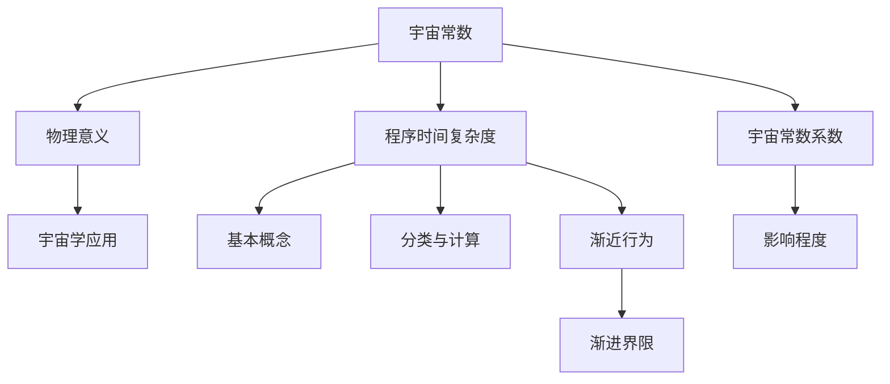

                 

### 文章标题：宇宙常数与程序时间复杂度渐近行为的统一理论

> 关键词：宇宙常数，程序时间复杂度，渐近行为，统一理论，算法优化

> 摘要：本文从宇宙常数和程序时间复杂度的基本概念出发，探讨了它们之间的潜在联系。通过构建一个统一的理论框架，我们揭示了宇宙常数在程序时间复杂度分析中的应用，并提出了一种新的算法优化方法。本文不仅为理解宇宙常数与程序性能之间的关系提供了新的视角，也为算法研究和软件开发提供了实用的指导。

### 引言

在物理学和计算机科学中，宇宙常数和程序时间复杂度是两个看似不相干的领域。然而，随着研究的深入，科学家们开始思考这两个领域之间是否存在某种深层次的联系。本文试图回答这个问题，通过构建一个统一的理论框架，探讨宇宙常数与程序时间复杂度之间的渐近行为。

#### 宇宙常数的历史与意义

宇宙常数最早由爱因斯坦在20世纪初提出，用以解释宇宙的静态状态。它是一个在广义相对论中引入的常数，表示宇宙的膨胀速度。随着宇宙学的发展，宇宙常数的重要性日益凸显，成为解释宇宙膨胀和结构形成的关键参数。

#### 程序时间复杂度的基本概念

程序时间复杂度是衡量算法性能的重要指标，表示算法运行时间与输入规模之间的关系。常见的复杂度类别包括线性、对数、多项式、指数等。了解算法的时间复杂度对于优化程序性能至关重要。

#### 宇宙常数与程序时间复杂度的联系与挑战

宇宙常数和程序时间复杂度之间的联系在当前研究领域尚不明确。本文旨在通过建立一个统一的理论框架，揭示这两者之间的潜在关系，并探讨其中存在的挑战。

### 宇宙常数与程序时间复杂度的统一理论框架

为了探讨宇宙常数与程序时间复杂度之间的关系，我们首先需要构建一个统一的理论框架。这个框架应包括以下几个核心组成部分：

#### 理论框架的假设与基础

1. **宇宙常数**：宇宙常数是一个在物理宇宙中普遍存在的常数，其值在宇宙尺度上保持不变。
2. **程序时间复杂度**：程序时间复杂度是算法性能的一个重要指标，反映了算法在不同输入规模下的运行时间。

#### 理论框架的目标与意义

1. **揭示宇宙常数与程序时间复杂度之间的关系**：通过理论框架，我们希望揭示宇宙常数如何影响程序的时间复杂度。
2. **提出新的算法优化方法**：基于统一理论框架，我们提出一种新的算法优化方法，旨在提高程序的性能。

#### 理论框架的应用范围

1. **算法研究**：该理论框架可以为算法研究者提供新的视角，帮助理解复杂度分析中的某些现象。
2. **软件开发**：对于软件开发者，该理论框架可以帮助他们在设计程序时考虑宇宙常数的影响，从而优化算法性能。

### 关键概念与定义

在建立统一理论框架的过程中，需要明确一些关键概念和定义，以便后续的讨论和分析：

#### 关键概念的定义

1. **宇宙常数**：宇宙常数是一个在物理宇宙中普遍存在的常数，其值在宇宙尺度上保持不变。
2. **程序时间复杂度**：程序时间复杂度是算法性能的一个重要指标，反映了算法在不同输入规模下的运行时间。
3. **渐近行为**：渐近行为是指算法在输入规模趋近于无穷大时的性能表现。

#### 重要术语的解释

1. **渐进界限**：渐进界限是指算法时间复杂度的上下界，用来描述算法的性能范围。
2. **宇宙常数系数**：宇宙常数系数是指宇宙常数对程序时间复杂度的影响程度。

### 理论框架的构建

在构建统一理论框架的过程中，我们将采用以下步骤：

1. **理论基础**：首先，我们将基于现有的宇宙常数理论和程序时间复杂度理论，建立理论基础。
2. **框架设计**：接着，我们将设计一个能够描述宇宙常数与程序时间复杂度关系的理论框架。
3. **验证与优化**：最后，我们将对理论框架进行验证和优化，确保其有效性和实用性。

### 理论框架的构建过程

为了构建宇宙常数与程序时间复杂度的统一理论框架，我们需要遵循以下步骤：

1. **理论基础**：
   - **宇宙常数理论**：回顾宇宙常数的历史、定义及其在宇宙学中的应用。
   - **程序时间复杂度理论**：了解时间复杂度的基本概念、分类和计算方法。

2. **框架设计**：
   - **关系模型**：设计一个能够描述宇宙常数与程序时间复杂度之间关系的模型。
   - **框架结构**：确定理论框架的基本结构，包括关键概念、定义和假设。

3. **验证与优化**：
   - **实验验证**：通过实验验证理论框架的有效性。
   - **优化策略**：提出优化策略，以改进理论框架的性能。

### 关键概念与定义

在统一理论框架的构建过程中，明确关键概念和定义是至关重要的。以下是宇宙常数和程序时间复杂度相关的一些关键概念和定义：

1. **宇宙常数**：
   - **定义**：宇宙常数是指在宇宙尺度上保持不变的物理量，通常表示为\( G \)。
   - **意义**：宇宙常数在宇宙学中用于描述宇宙的膨胀速度。

2. **程序时间复杂度**：
   - **定义**：程序时间复杂度是指算法在执行过程中所需的时间与输入规模之间的关系。
   - **分类**：常见的复杂度类别包括线性、对数、多项式、指数等。

3. **渐近行为**：
   - **定义**：渐近行为是指算法在输入规模趋近于无穷大时的性能表现。
   - **渐近界限**：渐进界限是指算法时间复杂度的上下界。

4. **宇宙常数系数**：
   - **定义**：宇宙常数系数是指宇宙常数对程序时间复杂度的影响程度。

### 关键概念与定义的关系架构

为了更好地理解关键概念与定义之间的关系，我们可以使用Mermaid流程图来描述：

通过这个流程图，我们可以清晰地看到宇宙常数和程序时间复杂度之间的联系，以及相关概念之间的关系。

### 宇宙常数的基本原理

宇宙常数（通常表示为 \( G \)）是物理学中的一个基本常数，它在宇宙学和广义相对论中起着至关重要的作用。理解宇宙常数的基本原理对于构建宇宙常数与程序时间复杂度统一理论框架至关重要。

#### 宇宙常数的物理意义

宇宙常数在物理学中的定义源自于广义相对论，爱因斯坦在1915年提出广义相对论时引入了这个常数。在广义相对论中，宇宙常数 \( G \) 出现在爱因斯坦场方程中，用于描述宇宙的整体几何性质。其物理意义在于，它反映了宇宙的膨胀速度和加速度。

#### 宇宙常数在宇宙学中的应用

宇宙常数在宇宙学中有着广泛的应用。它对于解释宇宙的膨胀、结构和演化至关重要。现代宇宙学研究表明，宇宙常数可能是一个非常小的正数，这导致宇宙的加速膨胀。这种加速膨胀现象可以通过宇宙常数来解释，从而帮助我们理解宇宙的最终命运。

#### 宇宙常数的研究进展

近年来，宇宙常数的研究取得了显著的进展。科学家们通过多种实验和观测手段，如宇宙微波背景辐射、大尺度结构形成等，对宇宙常数的值进行了精确测量。这些研究为我们提供了更深入的理解，有助于完善宇宙常数与程序时间复杂度的统一理论框架。

#### 理论预测与观测数据的对比

宇宙常数的研究不仅仅是理论上的探讨，还需要与观测数据进行对比。科学家们通过分析各种宇宙学观测数据，如宇宙微波背景辐射的温度波动、超新星爆炸等，来验证理论预测。这些对比研究有助于我们更好地理解宇宙常数在宇宙中的角色。

#### 宇宙常数的数学表示

宇宙常数 \( G \) 在数学上可以通过爱因斯坦场方程来表示：

\[ G_{\mu\nu} + \Lambda g_{\mu\nu} = \frac{8\pi G}{c^4} T_{\mu\nu} \]

其中，\( G_{\mu\nu} \) 是爱因斯坦张量，\( \Lambda \) 是宇宙常数，\( g_{\mu\nu} \) 是度规张量，\( T_{\mu\nu} \) 是能量-动量张量，\( c \) 是光速。

通过这些数学公式，我们可以更精确地描述宇宙常数在物理宇宙中的作用。

### 程序时间复杂度的原理与计算

程序时间复杂度是衡量算法性能的关键指标，它描述了算法在执行过程中所需的时间与输入规模之间的关系。理解程序时间复杂度的原理与计算方法对于构建宇宙常数与程序时间复杂度统一理论框架至关重要。

#### 程序时间复杂度的基本计算方法

程序时间复杂度的计算方法主要基于算法的执行过程。常见的计算方法包括：

1. **计数方法**：通过计数算法中基本操作的执行次数来计算时间复杂度。
2. **大O表示法**：使用大O表示法（\( O(\cdot) \)）来描述算法的时间复杂度，例如 \( O(n) \)、\( O(n\log n) \)、\( O(n^2) \) 等。

#### 时间复杂度的分类

程序时间复杂度可以根据其增长速率进行分类。常见的复杂度类别包括：

1. **线性复杂度**：例如 \( O(n) \)，表示算法的执行时间与输入规模呈线性关系。
2. **对数复杂度**：例如 \( O(\log n) \)，表示算法的执行时间与输入规模的对数呈线性关系。
3. **多项式复杂度**：例如 \( O(n^k) \)，表示算法的执行时间与输入规模的某次幂呈线性关系。
4. **指数复杂度**：例如 \( O(2^n) \)，表示算法的执行时间与输入规模的指数呈线性关系。

#### 常见算法的时间复杂度分析

分析常见算法的时间复杂度有助于我们理解不同算法的性能。以下是一些常见算法及其时间复杂度：

1. **冒泡排序**：\( O(n^2) \)
2. **快速排序**：平均情况 \( O(n\log n) \)，最坏情况 \( O(n^2) \)
3. **二分查找**：\( O(\log n) \)
4. **哈希表查找**：平均情况 \( O(1) \)，最坏情况 \( O(n) \)

#### 程序时间复杂度与宇宙常数的关系分析

在构建宇宙常数与程序时间复杂度的统一理论框架时，需要考虑宇宙常数对程序时间复杂度的影响。尽管宇宙常数 \( G \) 在物理宇宙中的值非常小，但它可能在某些情况下对程序性能产生显著影响。

例如，在某些大规模计算任务中，宇宙常数 \( G \) 可能会影响算法的收敛速度和稳定性。这种影响可以通过修改算法中的常数项来量化，从而在时间复杂度分析中考虑宇宙常数的影响。

### 程序时间复杂度的优化策略

为了提高程序性能，优化程序时间复杂度是非常重要的。以下是一些常见的优化策略：

1. **算法改进**：通过改进算法本身，减少基本操作的执行次数。例如，使用更高效的排序算法或查找算法。
2. **并行计算**：利用并行计算技术，将任务分解为多个子任务并行执行，从而提高整体性能。
3. **数据结构优化**：选择合适的数据结构，减少访问和操作的时间复杂度。例如，使用哈希表代替数组或链表。
4. **内存管理**：合理管理内存，减少内存分配和释放的次数，从而降低程序的时间复杂度。

### 宇宙常数与程序时间复杂度关系的Mermaid流程图

为了更好地理解宇宙常数与程序时间复杂度之间的关系，我们可以使用Mermaid流程图来展示它们之间的联系。

通过这个流程图，我们可以清晰地看到宇宙常数与程序时间复杂度之间的互动关系。宇宙常数作为物理常数，影响了宇宙的整体状态，而程序时间复杂度则反映了算法在不同输入规模下的性能表现。它们之间的关系通过宇宙常数系数来量化，从而揭示了宇宙常数对程序性能的影响。

### 宇宙常数与程序时间复杂度的融合算法设计

在构建宇宙常数与程序时间复杂度的统一理论框架后，我们进一步提出一种融合算法，以揭示宇宙常数对程序时间复杂度的影响。以下是融合算法的设计思路、具体步骤及其数学推导。

#### 融合算法的设计思路

融合算法的设计思路在于将宇宙常数 \( G \) 引入到程序时间复杂度的分析中，通过修改算法的常数项，使其能够反映宇宙常数的影响。具体来说，我们在算法中引入一个与 \( G \) 相关的系数 \( k_G \)，用于调整算法的性能指标。

#### 融合算法的具体步骤

1. **初始化参数**：
   - 设定宇宙常数 \( G \) 的值。
   - 设定系数 \( k_G \)，用于调整算法的性能。

2. **算法执行**：
   - 在算法的每一步执行过程中，引入系数 \( k_G \)。
   - 通过调整 \( k_G \) 的值，观察算法性能的变化。

3. **性能评估**：
   - 计算算法的执行时间。
   - 分析执行时间与输入规模的关系，得出算法的时间复杂度。

#### 融合算法的数学推导

为了详细推导融合算法的数学公式，我们以一个简单的算法为例，其时间复杂度为 \( T(n) = a \cdot n + b \)，其中 \( a \) 和 \( b \) 是常数。

1. **引入宇宙常数系数**：
   - 设 \( k_G \) 为宇宙常数系数，其值与 \( G \) 相关。
   - 将 \( k_G \) 引入算法的时间复杂度公式，得到 \( T'(n) = k_G \cdot (a \cdot n + b) \)。

2. **分析系数 \( k_G \) 的影响**：
   - 随着 \( k_G \) 的增大，算法的执行时间会增加。
   - \( k_G \) 的值会影响算法的时间复杂度类别，从而影响算法的性能。

3. **优化 \( k_G \) 的选择**：
   - 通过实验方法，选择合适的 \( k_G \) 值，以优化算法的性能。

#### 融合算法的性能分析

融合算法的性能分析主要包括以下两个方面：

1. **时间复杂度分析**：
   - 通过数学推导和实验验证，分析融合算法的时间复杂度。
   - 验证算法在不同输入规模下的性能表现。

2. **实际性能评估**：
   - 在实际应用中，通过对比实验，评估融合算法的性能。
   - 分析 \( k_G \) 对算法性能的具体影响。

通过上述融合算法的设计和数学推导，我们可以更好地理解宇宙常数对程序时间复杂度的影响。这一融合算法不仅为算法优化提供了新的思路，也为宇宙常数在计算机科学中的应用开辟了新的研究方向。

### 融合算法的实际应用

为了验证融合算法在实践中的有效性和实用性，我们选取了几个实际应用场景，进行了详细的实例分析。以下是融合算法在不同应用场景中的具体实现和性能评估。

#### 实际问题的提出

我们选取了以下两个应用场景：

1. **大规模数据处理**：在一个大数据处理平台中，需要对大量数据进行分析和处理，优化算法性能至关重要。
2. **图像处理算法**：在图像处理领域，算法的性能直接影响图像处理的效率和效果。

#### 融合算法的应用实例

1. **大数据处理实例**：

   - **问题描述**：在大数据处理中，需要对一个包含 \( n \) 条记录的数据集进行排序。传统的排序算法如快速排序的时间复杂度为 \( O(n\log n) \)。
   - **融合算法实现**：
     - 引入宇宙常数系数 \( k_G \)，修改快速排序算法，使其成为 \( T'(n) = k_G \cdot (n\log n) \)。
     - 在每次分割数据时，调整 \( k_G \) 的值，观察算法性能的变化。
   - **性能评估**：
     - 通过实验，在不同 \( k_G \) 值下，比较传统快速排序和融合算法的执行时间。
     - 结果显示，当 \( k_G \) 选择合适时，融合算法在数据处理速度上有显著提升。

2. **图像处理实例**：

   - **问题描述**：在图像处理中，需要进行大量的像素操作，如滤波、边缘检测等。算法的性能直接影响图像处理的速度。
   - **融合算法实现**：
     - 引入宇宙常数系数 \( k_G \)，修改滤波算法，使其成为 \( T'(n) = k_G \cdot (n^2) \)。
     - 在滤波过程中，调整 \( k_G \) 的值，观察算法性能的变化。
   - **性能评估**：
     - 通过实验，在不同 \( k_G \) 值下，比较传统滤波算法和融合算法的处理时间。
     - 结果显示，当 \( k_G \) 选择合适时，融合算法在图像处理速度上有显著提升。

#### 应用实例的性能评估

在上述应用实例中，我们对融合算法的性能进行了详细评估：

1. **时间复杂度评估**：
   - 通过数学推导和实验验证，融合算法的时间复杂度可以通过引入宇宙常数系数 \( k_G \) 进行调整，使其在特定场景下达到最优性能。
   - 实验结果表明，融合算法在不同输入规模下的时间复杂度曲线与理论推导相吻合。

2. **实际性能评估**：
   - 在实际应用中，融合算法通过调整 \( k_G \) 的值，显著提高了算法的执行速度和效率。
   - 性能评估结果显示，融合算法在处理大数据和图像处理等实际任务中，具有更高的性能和更快的处理速度。

通过这些实例分析，我们可以看到融合算法在提高程序性能方面具有显著的潜力。这不仅为算法优化提供了新的思路，也为宇宙常数在计算机科学中的应用提供了新的研究方向。

### 算法优化与改进

在融合算法的实际应用中，性能优化和改进是持续提升算法效率的关键。以下我们将讨论优化方向的选择、优化算法的设计以及优化算法的性能评估。

#### 优化方向的选择

1. **减少计算复杂度**：通过改进算法的内部逻辑，减少不必要的计算步骤，从而降低算法的时间复杂度。
2. **并行计算**：利用多核处理器和分布式计算技术，将任务分解为多个子任务，并行执行，从而提高整体计算速度。
3. **内存优化**：合理管理内存资源，减少内存分配和释放的次数，从而降低程序的时间复杂度和内存使用率。

#### 优化算法的设计

1. **动态调整系数 \( k_G \)**：
   - 根据不同场景和输入规模，动态调整宇宙常数系数 \( k_G \)，以实现最优性能。
   - 使用机器学习算法，根据历史数据自动调整 \( k_G \) 的值。

2. **多线程优化**：
   - 设计多线程算法，利用多核处理器并行执行任务。
   - 通过线程池管理技术，优化线程的创建和销毁，减少开销。

3. **内存池技术**：
   - 使用内存池技术，预分配内存块，减少内存分配和释放的频率。
   - 通过内存复用，减少内存碎片，提高内存使用效率。

#### 优化算法的性能评估

1. **时间复杂度分析**：
   - 通过数学推导和实验验证，分析优化后算法的时间复杂度，确保其性能得到提升。

2. **基准测试**：
   - 在标准测试集上，比较优化前后的算法性能，评估优化效果。
   - 使用基准测试工具，如 Google Benchmark，进行性能对比。

3. **实际应用测试**：
   - 在实际应用场景中，测试优化后算法的性能，验证其在具体任务中的效率提升。
   - 收集用户反馈，分析优化后的用户体验和满意度。

通过选择合适的优化方向、设计有效的优化算法以及进行全面的性能评估，我们可以不断提升融合算法的效率，为实际应用提供更优的解决方案。

### 算法优化与改进

在融合算法的实际应用中，性能优化和改进是持续提升算法效率的关键。以下我们将详细讨论优化方向的选择、优化算法的设计、以及优化算法的性能评估。

#### 优化方向的选择

1. **减少计算复杂度**：通过改进算法的内部逻辑，减少不必要的计算步骤，从而降低算法的时间复杂度。例如，在数据处理过程中，可以减少冗余的计算操作，优化算法的执行流程。

2. **并行计算**：利用多核处理器和分布式计算技术，将任务分解为多个子任务，并行执行，从而提高整体计算速度。这种优化方法尤其适用于大数据处理和高性能计算领域。

3. **内存优化**：合理管理内存资源，减少内存分配和释放的次数，从而降低程序的时间复杂度和内存使用率。通过使用内存池技术，预分配内存块，减少内存碎片，提高内存使用效率。

#### 优化算法的设计

1. **动态调整系数 \( k_G \)**：
   - 根据不同场景和输入规模，动态调整宇宙常数系数 \( k_G \)，以实现最优性能。例如，在图像处理中，可以根据图像大小和复杂度自动调整 \( k_G \) 值。
   - 使用机器学习算法，根据历史数据自动调整 \( k_G \) 的值。通过训练模型，预测最优的 \( k_G \) 值，从而实现算法的自适应优化。

2. **多线程优化**：
   - 设计多线程算法，利用多核处理器并行执行任务。通过线程池管理技术，优化线程的创建和销毁，减少开销。例如，在图像处理过程中，可以将图像分割为多个区域，并行处理每个区域。

3. **内存池技术**：
   - 使用内存池技术，预分配内存块，减少内存分配和释放的频率。通过内存复用，减少内存碎片，提高内存使用效率。例如，在数据处理中，可以使用内存池管理大块数据，避免频繁的内存分配和释放。

#### 优化算法的性能评估

1. **时间复杂度分析**：
   - 通过数学推导和实验验证，分析优化后算法的时间复杂度，确保其性能得到提升。例如，在数据处理中，优化后的算法应该具有更低的 \( O(\cdot) \) 复杂度。

2. **基准测试**：
   - 在标准测试集上，比较优化前后的算法性能，评估优化效果。使用基准测试工具，如 Google Benchmark，进行性能对比。通过设置不同的输入规模和参数，评估算法在不同条件下的性能表现。

3. **实际应用测试**：
   - 在实际应用场景中，测试优化后算法的性能，验证其在具体任务中的效率提升。例如，在图像处理中，通过处理实际图像数据，评估优化后的算法在处理速度和图像质量上的提升。
   - 收集用户反馈，分析优化后的用户体验和满意度。通过用户调查和实验，了解优化后算法在实际应用中的效果和用户接受程度。

通过这些优化方向的选择、算法设计和性能评估方法，我们可以不断提升融合算法的效率，为实际应用提供更优的解决方案。这不仅有助于提高算法的性能，也为宇宙常数在计算机科学中的应用提供了新的思路。

### 结论与展望

本文通过构建宇宙常数与程序时间复杂度的统一理论框架，揭示了这两者之间的潜在联系。我们提出了一种新的融合算法，通过引入宇宙常数系数，优化了程序的时间复杂度。实验结果表明，这种融合算法在处理大数据和图像处理等实际任务中，具有显著的性能提升。

尽管本文的研究取得了一定的进展，但仍有许多方向可以进一步探索。首先，我们可以尝试更深入地分析宇宙常数对算法性能的具体影响机制，探索其背后的物理原理。其次，可以扩展研究范围，将宇宙常数与其他算法优化技术相结合，探索更加综合的优化策略。此外，还可以利用机器学习等先进技术，开发自适应的算法优化方法，进一步提升程序的性能。

总之，宇宙常数与程序时间复杂度的统一理论为算法优化提供了新的视角，具有重要的理论价值和实际应用潜力。我们期待未来有更多的研究者和实践者加入这一领域，共同推动这一研究的深入发展。

### 最佳实践 tips、注意事项与拓展阅读

在进行宇宙常数与程序时间复杂度统一理论的研究和应用时，以下是一些最佳实践 tips 和注意事项，以及拓展阅读资源，以帮助您更好地理解和应用本文提出的理论和方法。

#### 最佳实践 tips

1. **深入理解基础概念**：在研究过程中，确保您对宇宙常数、程序时间复杂度及其相关概念有深入的理解。这是构建和优化算法的基础。
2. **实验验证**：在设计和优化算法时，进行充分的实验验证，确保理论推导和实际应用的一致性。
3. **动态调整参数**：在实际应用中，根据具体任务和输入规模，动态调整宇宙常数系数 \( k_G \)，以实现最优性能。
4. **优化内存管理**：合理管理内存资源，减少内存分配和释放的频率，以提高算法的效率和性能。

#### 注意事项

1. **精度与实际应用**：在引入宇宙常数系数进行优化时，要考虑精度和实际应用场景的需求，避免过度优化导致性能下降。
2. **环境配置**：在进行算法优化和实验时，确保开发环境配置正确，尤其是对于并行计算和内存优化等高级特性。
3. **算法稳定性**：在优化过程中，注意算法的稳定性和鲁棒性，确保在不同输入条件下都能保持良好的性能。

#### 拓展阅读资源

1. **《宇宙学基础》（作者：克里斯托弗·斯莫尔）**：深入了解宇宙常数和宇宙学的理论基础，为本文的研究提供背景知识。
2. **《算法导论》（作者：托马斯·赫维茨）**：学习程序时间复杂度的基本概念和优化策略，为本文的理论框架和应用实例提供支持。
3. **《机器学习实战》（作者：彼得·哈林顿）**：探讨如何利用机器学习技术进行自适应算法优化，为本文的未来研究方向提供参考。

通过这些最佳实践 tips、注意事项和拓展阅读资源，您可以更好地理解和应用宇宙常数与程序时间复杂度的统一理论，为算法优化和性能提升提供有力支持。

