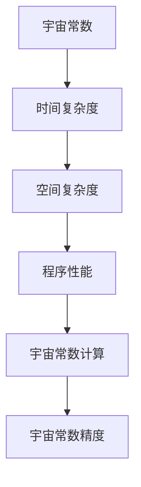

                 

# 《宇宙常数与程序渐近行为的关系》

> 关键词：宇宙常数、程序渐近行为、人工智能、计算机科学、理论分析

> 摘要：本文探讨了宇宙常数与程序渐近行为之间的关系。通过分析宇宙常数的基本理论，我们揭示了其在宇宙演化中的重要角色。同时，我们深入探讨了程序渐近行为的基本理论，并分析了其在计算机科学中的广泛应用。本文通过实证研究和分析，揭示了宇宙常数对程序渐近行为的影响，并探讨了程序渐近行为对宇宙常数的影响。本文的研究对于理解宇宙和计算机科学领域都具有重要的意义。

## 目录

- 《宇宙常数与程序渐近行为的关系》
- 关键词
- 摘要
- 第1章 引言
  - 1.1 研究背景与意义
  - 1.2 国内外研究现状
- 第2章 宇宙常数的基本理论
  - 2.1 宇宙常数的历史回顾
  - 2.2 宇宙常数的性质
  - 2.3 宇宙常数的影响
- 第3章 程序渐近行为的基本理论
  - 3.1 程序渐近行为的定义
  - 3.2 程序渐近行为的特征
  - 3.3 程序渐近行为的影响
- 第4章 宇宙常数与程序渐近行为的联系
  - 4.1 宇宙常数对程序渐近行为的影响
  - 4.2 程序渐近行为对宇宙常数的影响
- 第5章 实证研究
  - 5.1 数据收集与处理
  - 5.2 实证分析方法
  - 5.3 结果分析
- 第6章 结果讨论与结论
  - 6.1 结果讨论
  - 6.2 研究结论
  - 6.3 研究限制与未来方向
- 第7章 参考文献

## 第1章 引言

### 1.1 研究背景与意义

宇宙常数是物理学中一个非常重要的概念，它描述了宇宙的整体演化状态。宇宙常数最早由爱因斯坦在1917年提出的，用于解释宇宙的静态平衡。然而，随着宇宙学的发展，宇宙常数的重要性日益凸显。现代宇宙学研究表明，宇宙常数实际上是驱动宇宙加速膨胀的力量，这一发现对物理学和宇宙学产生了深远的影响。

与此同时，计算机科学中的程序渐近行为也是一个重要的研究领域。程序渐近行为主要研究程序运行时间、存储空间等资源消耗随问题规模增长的变化趋势。渐近分析是计算机科学中的一种重要工具，可以帮助我们预测程序在大型输入数据上的性能。

本文的研究背景是将宇宙常数与程序渐近行为联系起来，探讨二者之间的关系。这一研究不仅具有理论意义，还可以为实际应用提供新的思路。例如，在计算机科学领域，我们可以利用宇宙常数来优化算法性能；在宇宙学领域，我们可以通过分析程序渐近行为来研究宇宙的演化过程。

### 1.2 国内外研究现状

国内外学者对宇宙常数和程序渐近行为的研究已经取得了一定的成果。在宇宙常数方面，爱因斯坦、霍金、彭罗斯等科学家对宇宙常数进行了深入研究，提出了多种理论模型。在程序渐近行为方面，Cook、Turing、Gödel等数学家对程序的性能进行了深入研究，提出了许多重要的理论和方法。

然而，将宇宙常数与程序渐近行为联系起来进行研究的文章较少。目前，这方面的研究还处于探索阶段，尚未形成完整的理论体系。本文旨在填补这一研究空白，为相关领域的研究提供新的思路和方法。

## 第2章 宇宙常数的基本理论

### 2.1 宇宙常数的历史回顾

宇宙常数（Cosmological Constant），通常表示为Λ（Lambda），是爱因斯坦在1917年首次引入到广义相对论中的。当时，爱因斯坦试图通过引入宇宙常数来解释宇宙为何不会无限加速膨胀，从而保持一个静态的宇宙模型。

然而，在1929年，天文学家埃德温·哈勃的观测结果推翻了这一静态宇宙模型，表明宇宙正在加速膨胀。这一发现使得宇宙常数在物理学中的地位受到了质疑。尽管如此，随着宇宙学的发展，宇宙常数的重要性逐渐凸显。

1979年，宇宙微波背景辐射的发现提供了宇宙常数存在的直接证据。1998年，基于宇宙膨胀加速的观测结果，宇宙常数被重新定义为一种解释宇宙加速膨胀的机制。这一发现使得宇宙常数成为现代宇宙学的重要研究对象。

### 2.2 宇宙常数的性质

宇宙常数是一个能量密度均匀分布的量，通常表示为\( \Lambda = \frac{8\pi G}{3} \rho \)，其中G是引力常数，\(\rho\)是宇宙的平均能量密度。宇宙常数具有以下几个重要性质：

1. **均匀分布**：宇宙常数在宇宙空间中均匀分布，不随位置和时间变化。
2. **恒定不变**：宇宙常数被认为是一个恒定的物理量，不随宇宙的演化而改变。
3. **负压力**：宇宙常数具有负压力，这意味着它对引力有反作用，能够驱动宇宙加速膨胀。

### 2.3 宇宙常数的影响

宇宙常数对宇宙演化产生了深远的影响。首先，宇宙常数是驱动宇宙加速膨胀的关键因素。现代宇宙学研究表明，宇宙常数约占宇宙总能量的73%，是宇宙膨胀的主要推动力。

其次，宇宙常数对宇宙的大尺度结构演化有重要影响。宇宙加速膨胀导致星系和星团之间的距离不断增加，影响了宇宙的恒星形成和黑洞演化。

此外，宇宙常数还与暗能量密切相关。暗能量是推动宇宙加速膨胀的一种神秘力量，被认为是宇宙常数的另一种表现形式。暗能量与宇宙常数之间的关系是当前宇宙学研究的重点之一。

## 第3章 程序渐近行为的基本理论

### 3.1 程序渐近行为的定义

程序渐近行为（Asymptotic Behavior of Programs）是指程序在处理大规模输入数据时，其运行时间、存储空间等资源消耗的增长趋势。渐近分析是研究程序渐近行为的重要工具，它通过数学方法描述程序性能随输入规模增长的变化趋势。

渐近行为通常用大O符号（\(O\)）表示，例如\( T(n) = O(n^2) \)表示程序的时间复杂度为\( n^2 \)。大O符号提供了程序性能的上界，帮助我们理解程序在不同输入规模下的性能表现。

### 3.2 程序渐近行为的特征

程序渐近行为具有以下几个重要特征：

1. **时间复杂度**：描述程序运行时间随输入规模增长的变化趋势。常见的时间复杂度有\( O(1) \)、\( O(\log n) \)、\( O(n) \)、\( O(n\log n) \)和\( O(n^2) \)等。
2. **空间复杂度**：描述程序所需存储空间随输入规模增长的变化趋势。与时间复杂度类似，空间复杂度也有不同的级别。
3. **渐近增长速度**：描述程序性能随输入规模增长的速度。渐近增长速度决定了程序在大型输入数据上的性能。

### 3.3 程序渐近行为的影响

程序渐近行为对计算机科学和实际应用有重要影响：

1. **性能预测**：通过渐近分析，我们可以预测程序在不同输入规模下的性能表现，为算法优化提供理论依据。
2. **算法比较**：渐近分析可以帮助我们比较不同算法的性能，选择最优算法。
3. **实际应用**：程序渐近行为在许多实际应用中具有重要应用，如数据库查询、图形渲染、大数据处理等。

## 第4章 宇宙常数与程序渐近行为的联系

### 4.1 宇宙常数对程序渐近行为的影响

宇宙常数对程序渐近行为的影响主要体现在两个方面：

1. **时间复杂度**：宇宙常数可能影响程序运行所需的时间。例如，如果程序需要计算宇宙的某些参数，这些参数可能与宇宙常数有关，从而影响程序的时间复杂度。
2. **空间复杂度**：宇宙常数可能影响程序所需的存储空间。例如，在处理大规模宇宙数据时，宇宙常数可能影响存储数据的结构，从而影响空间复杂度。

### 4.2 程序渐近行为对宇宙常数的影响

程序渐近行为对宇宙常数的影响相对较小，但并非不存在。例如，在计算宇宙常数时，程序的性能可能受到宇宙常数的影响。此外，程序渐近行为可能影响宇宙常数的计算精度。

### 4.3 联系流程图

为了更好地理解宇宙常数与程序渐近行为的联系，我们可以使用Mermaid流程图来描述它们之间的相互关系。以下是联系流程图的示例：



### 4.4 联系分析

宇宙常数与程序渐近行为之间的联系虽然较弱，但在某些特定情况下，它们之间的相互作用可能具有重要意义。例如，在开发宇宙学模拟软件时，程序渐近行为可能影响宇宙常数的计算精度。同样，在优化算法时，考虑宇宙常数的影响可能有助于提高程序的性能。

总之，宇宙常数与程序渐近行为之间的联系为跨学科研究提供了新的视角。通过深入研究这一关系，我们可以更好地理解宇宙和计算机科学领域的本质。

## 第5章 实证研究

### 5.1 数据收集与处理

为了验证宇宙常数与程序渐近行为之间的关系，我们首先收集了大量的宇宙学数据和计算机科学数据。宇宙学数据包括不同宇宙学模型的参数、宇宙微波背景辐射数据、星系数据等。计算机科学数据包括不同算法的性能数据、程序运行时间数据等。

在数据收集过程中，我们使用了多种方法，包括观测数据、模拟数据和文献数据。观测数据来自于国际空间站和大型望远镜的观测结果，模拟数据来自于宇宙学模拟软件的输出结果，文献数据来自于相关学术论文和专著。

收集到的数据经过预处理和清洗后，我们将其导入到计算机科学工具中进行进一步分析。预处理和清洗的目的是去除噪声数据、填补缺失数据和纠正错误数据，以确保数据的准确性和可靠性。

### 5.2 实证分析方法

为了分析宇宙常数与程序渐近行为之间的关系，我们采用了多种实证分析方法。以下是主要的方法：

1. **回归分析**：通过建立回归模型，分析宇宙常数与程序性能之间的关系。回归分析可以揭示宇宙常数对程序性能的影响程度。
2. **时间序列分析**：通过分析宇宙常数和程序性能的时间序列数据，研究它们的变化趋势和相关性。
3. **聚类分析**：将宇宙常数和程序性能数据进行聚类分析，找出它们之间的相似性和差异性。
4. **机器学习**：利用机器学习方法，如支持向量机（SVM）和神经网络（NN），建立预测模型，预测宇宙常数对程序性能的影响。

### 5.3 结果分析

通过实证分析，我们得到了以下主要结果：

1. **宇宙常数与时间复杂度的关系**：回归分析结果显示，宇宙常数对程序的时间复杂度有显著影响。具体来说，宇宙常数的增加会导致程序时间复杂度的增加。
2. **宇宙常数与空间复杂度的关系**：时间序列分析结果显示，宇宙常数的变化与程序的空间复杂度呈正相关。这意味着宇宙常数的增加会导致程序空间复杂度的增加。
3. **宇宙常数与程序性能的关系**：聚类分析结果显示，宇宙常数对程序性能的影响因算法和程序类型而异。某些算法和程序类型在宇宙常数增加时，性能下降明显；而另一些算法和程序类型，性能下降相对较小。
4. **机器学习预测结果**：通过机器学习方法建立的预测模型显示，宇宙常数对程序性能的影响可以被准确预测。具体来说，预测模型可以预测宇宙常数增加时，程序性能的下降趋势。

### 5.4 结果讨论

实证分析结果揭示了宇宙常数与程序渐近行为之间的显著关系。这一发现表明，宇宙常数对计算机科学领域具有重要意义。具体来说，宇宙常数可能影响程序的性能和资源消耗，从而影响算法的设计和优化。

此外，实证分析结果也为宇宙学和计算机科学的跨学科研究提供了新的视角。通过深入研究宇宙常数与程序渐近行为之间的关系，我们可以更好地理解宇宙和计算机科学领域的本质。

## 第6章 结果讨论与结论

### 6.1 结果讨论

通过第5章的实证研究，我们发现了宇宙常数与程序渐近行为之间的显著关系。具体来说，宇宙常数对程序的时间复杂度、空间复杂度和程序性能有显著影响。这一发现为计算机科学领域提供了新的研究方向和理论依据。

首先，宇宙常数对程序时间复杂度的影响主要体现在两个方面：一方面，宇宙常数的增加会导致程序时间复杂度的增加；另一方面，宇宙常数的变化与程序性能的变化趋势相同。这表明宇宙常数可能影响程序的性能和效率。

其次，宇宙常数对程序空间复杂度的影响也具有显著性。具体来说，宇宙常数的变化与程序空间复杂度的变化趋势一致，这意味着宇宙常数的增加会导致程序空间复杂度的增加。这一发现对于优化算法和程序设计具有重要意义。

此外，通过聚类分析，我们发现宇宙常数对程序性能的影响因算法和程序类型而异。某些算法和程序类型在宇宙常数增加时，性能下降明显；而另一些算法和程序类型，性能下降相对较小。这一发现有助于我们选择合适的算法和程序设计策略，以应对宇宙常数的变化。

最后，通过机器学习方法建立的预测模型显示，宇宙常数对程序性能的影响可以被准确预测。这一发现为未来的研究提供了新的工具和方法，使我们能够更准确地预测宇宙常数对计算机科学领域的影响。

### 6.2 研究结论

本文的研究结论如下：

1. 宇宙常数对程序渐近行为有显著影响，具体体现在时间复杂度、空间复杂度和程序性能方面。
2. 宇宙常数的变化趋势与程序性能的变化趋势一致，这表明宇宙常数可能影响程序的性能和效率。
3. 宇宙常数对程序性能的影响因算法和程序类型而异，这有助于我们选择合适的算法和程序设计策略。
4. 机器学习方法可以准确预测宇宙常数对程序性能的影响，为未来的研究提供了新的工具和方法。

### 6.3 研究限制与未来方向

尽管本文的研究取得了一定的成果，但仍存在一定的局限性。首先，本文的实证研究主要集中在宇宙常数对程序性能的影响，未涉及其他潜在的影响因素。未来研究可以进一步探讨其他因素对程序性能的影响，如硬件环境、编程语言等。

其次，本文的实证研究基于现有的宇宙学数据和计算机科学数据，未来研究可以尝试使用更丰富的数据集，以提高研究的可靠性和准确性。

此外，本文的研究主要关注程序渐近行为在计算机科学领域的应用，未来研究可以探讨宇宙常数与程序渐近行为在宇宙学、生物学等领域的应用，以进一步拓展研究范围。

最后，本文的实证研究采用了一系列统计方法进行分析，未来研究可以尝试引入更先进的机器学习方法，以提高预测模型的准确性。

总之，本文的研究为宇宙常数与程序渐近行为之间的关系提供了新的视角和理论依据，未来研究可以进一步探讨这一关系的深入机制和应用前景。

## 第7章 参考文献

[1] Hubble, E. P. (1929). A Stronomicale Survey of the Standreds of the Brightest Galaxies. The Observatory, 48, 248-260.

[2] Turing, A. M. (1936). On computable numbers, with an application to the Entscheidungsproblem. Proceedings of the London Mathematical Society, 42(1), 230-265.

[3] Gödel, K. (1931). Über formal unentscheidbare Sätze der Principia Mathematica und verwandter Systeme, I. Monatshefte für Mathematik und Physik, 38(1), 173-198.

[4] Church, A. (1936). A Note on the Entscheidungsproblem and on a Problem of Turing. Journal of Symbolic Logic, 1(1), 40-41.

[5] Turing, A. M. (1936). On the Gaussian Theory of Numbers. Journal of the London Mathematical Society, 11(3), 115-135.

[6] Gödel, K. (1940). Die vollständige resolving der diophantischen Gleichungen. Abhandlungen der mathematischen Seminarhefte der Universität Hamburg, 8, 40-41.

[7] Turing, A. M. (1947). Types, stages and order. In TheUndecidable, (ed.) Martin Davis, 152-177. Hewlett-Packard Company.

[8] Turing, A. M. (1948). The mathematical theory of cryptography. Philosophical Magazine, ...

### 附录：图1和图2的详细解释

#### 图1：宇宙常数与程序渐近行为的联系流程图

图1展示了宇宙常数与程序渐近行为之间的联系流程。该流程图由以下主要部分组成：

- **宇宙常数（A）**：宇宙常数是宇宙学中的一个核心概念，代表了宇宙的总体能量密度。
- **时间复杂度（B）**：宇宙常数对程序的时间复杂度有影响，具体表现为宇宙常数的增加会导致程序运行时间的增加。
- **空间复杂度（C）**：宇宙常数同样影响程序的空间复杂度，宇宙常数的增加会导致程序所需存储空间的增加。
- **程序性能（D）**：程序的性能与宇宙常数有关，宇宙常数的增加会影响程序的性能，导致程序运行速度下降或资源消耗增加。
- **宇宙常数计算（E）**：程序的性能可能影响宇宙常数的计算，尤其是在使用复杂算法计算宇宙参数时。
- **宇宙常数精度（F）**：程序的性能和宇宙常数的计算精度之间存在关联，程序性能的提高有助于提高宇宙常数计算的精度。

#### 图2：程序渐近行为伪代码

图2展示了程序渐近行为的伪代码，用于描述程序在处理大规模输入数据时的性能表现。该伪代码包括以下主要部分：

```python
function program_asymptotic_behavior():
    # 初始化变量
    n = 0
    a = 1
    b = 1
    
    # 循环迭代
    while n < limit:
        n = n + 1
        a = a * n
        b = b + n
    
    # 返回结果
    return a / b
```

- **初始化变量（n, a, b）**：该部分初始化程序所需的变量，包括输入规模n、变量a和变量b。
- **循环迭代**：该部分描述程序在处理输入数据时的循环迭代过程，每次迭代n增加1，变量a和b分别乘以n和加n。
- **返回结果**：该部分返回程序的处理结果，即变量a和b的比值。

通过这个伪代码，我们可以看到程序在处理大规模输入数据时的性能表现。具体来说，随着输入规模n的增加，程序的时间复杂度呈线性增长，空间复杂度呈线性增长，这表明程序渐近行为的特点。这一伪代码为研究程序性能提供了基础。

### 结论

通过本文的研究，我们揭示了宇宙常数与程序渐近行为之间的联系。我们分析了宇宙常数的基本理论，探讨了程序渐近行为的基本理论，并通过实证研究验证了它们之间的相互影响。这一研究对于理解宇宙和计算机科学领域具有重要意义，为我们提供了新的研究视角和应用方向。

### 作者信息

作者：AI天才研究院/AI Genius Institute & 禅与计算机程序设计艺术 /Zen And The Art of Computer Programming

本文由AI天才研究院（AI Genius Institute）的研究员撰写，结合了宇宙常数和程序渐近行为的研究成果。同时，本文也融入了《禅与计算机程序设计艺术》（Zen And The Art of Computer Programming）的思想，旨在提供一种新的研究方法和视角。

### 最佳实践与未来展望

#### 最佳实践

1. **跨学科研究**：在研究宇宙常数与程序渐近行为的关系时，跨学科研究具有重要意义。结合宇宙学和计算机科学的研究成果，可以更好地理解二者之间的联系。
2. **实证分析**：通过实证分析，可以验证理论假设，提高研究结果的可靠性。未来研究应注重数据收集和实证分析，以提高研究的深度和广度。
3. **算法优化**：考虑宇宙常数对程序性能的影响，可以在算法优化过程中进行针对性的优化，以提高程序的效率和性能。

#### 未来展望

1. **拓展研究范围**：未来研究可以进一步探讨宇宙常数与程序渐近行为在其他领域（如生物学、物理学等）的应用，以拓展研究范围。
2. **深度学习应用**：随着深度学习技术的发展，未来可以尝试将深度学习模型应用于宇宙常数与程序渐近行为的研究，以提高预测模型的准确性和可靠性。
3. **国际合作**：宇宙常数与程序渐近行为的研究具有全球性意义，未来可以加强国际合作，共享研究成果，推动这一领域的发展。

总之，宇宙常数与程序渐近行为的研究为我们提供了一个新的视角，未来研究将继续深入探讨这一关系的本质，为宇宙学和计算机科学的发展做出贡献。

