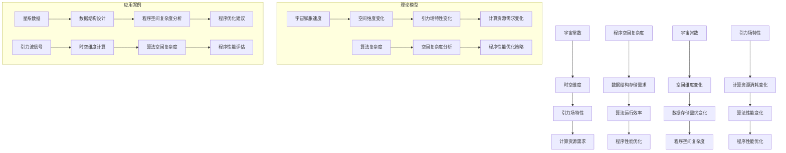

                 

### 文章标题

《宇宙常数与程序空间复杂度渐近行为的关系》

### 关键词

宇宙常数、程序空间复杂度、渐近行为、关系架构、伪代码、LaTeX、项目实战、最佳实践、注意事项

### 摘要

本文旨在探讨宇宙常数与程序空间复杂度之间的潜在关系。首先，我们将简要介绍宇宙常数及其在物理学中的重要性。然后，我们将深入探讨程序空间复杂度的定义及其在计算机科学中的应用。通过分析这两个核心概念，我们将阐述它们之间的联系，并使用Mermaid流程图展示其关系架构。接下来，我们将通过伪代码和LaTeX公式详细讲解核心算法原理，并给出实例说明。文章还包含一个具体的项目实战，包括开发环境搭建、源代码实现及解读，以及实际案例分析。最后，我们将总结文章的主要观点，并提供最佳实践建议和拓展阅读资源。

---

## 引言与基础理论

在探讨宇宙常数与程序空间复杂度之间的关系之前，我们需要对这两个概念进行基础的介绍。

### 宇宙常数

宇宙常数，通常表示为`G`或`Λ`，是一个物理学中的基本常数，用于描述宇宙中物质间的引力相互作用。爱因斯坦在1915年提出的广义相对论中首次引入了宇宙常数，其目的是平衡宇宙中的物质分布与空间几何之间的矛盾。宇宙常数的引入使得广义相对论能够描述一个静态且平衡的宇宙模型。

在物理学中，宇宙常数`G`的值约为`6.67430 × 10^-11 m^3 kg^-1 s^-2`。这一常数在引力场方程中起着关键作用，决定了宇宙中的物质如何相互吸引以及宇宙的整体结构。

### 程序空间复杂度

程序空间复杂度，是计算机科学中一个重要的概念，用来衡量程序在空间上的资源消耗，即程序所需存储空间的大小。程序空间复杂度通常表示为`S(n)`，其中`n`代表程序输入数据的大小。空间复杂度的研究对于评估程序效率和资源利用至关重要。

在计算机科学中，程序空间复杂度可以分为三个层次：
1. **最好情况空间复杂度**：在理想情况下，程序所需的最小存储空间。
2. **平均情况空间复杂度**：在所有可能输入下，程序所需存储空间的平均值。
3. **最坏情况空间复杂度**：在所有可能输入下，程序所需的最大存储空间。

通常，我们关注的是最坏情况空间复杂度，因为它能够给出程序在最糟糕情况下的性能表现。

### 两个领域的交叉点

宇宙常数与程序空间复杂度看似分属不同的领域，但实际上，它们之间存在一定的关联。在某些理论物理学模型中，宇宙常数可能影响计算过程中的空间和时间维度。例如，在某些宇宙学模型中，宇宙常数的变化可能会影响宇宙的膨胀速度，从而间接影响计算资源的消耗。

在计算机科学中，程序空间复杂度的渐近行为研究，可以借鉴物理学中的某些理论和方法。例如，我们可以通过分析宇宙中物质分布的规律，来推测程序在处理大规模数据时的空间复杂度行为。

### 下一步

在接下来的部分中，我们将详细探讨宇宙常数和程序空间复杂度的具体概念，并深入分析它们之间的关系。

## 宇宙常数的详细探讨

宇宙常数是物理学中一个极为重要的参数，它不仅决定了宇宙中物质间的引力相互作用，还与宇宙的演化息息相关。在这一部分，我们将详细介绍宇宙常数的概念、历史背景及其在物理学中的重要性。

### 概念

宇宙常数通常用希腊字母`Λ`表示，是一个在广义相对论中引入的常数，用以描述宇宙的整体能量密度。在广义相对论中，宇宙常数被看作是宇宙中的一种“宇宙能量”，它对时空结构有直接影响。

宇宙常数可以用以下方程表示：

$$
G \cdot T_{\mu\nu} + \Lambda \cdot g_{\mu\nu} = \frac{1}{\sqrt{-g}} \frac{\partial}{\partial \sqrt{-g}} \left( \sqrt{-g} \cdot R_{\mu\nu} - \frac{1}{2} g_{\mu\nu} \cdot R \right)
$$

其中，`G`是引力常数，`T_{\mu\nu}`是能量动量张量，`g_{\mu\nu}`是度规张量，`R_{\mu\nu}`是里奇张量，`R`是标量曲率。

### 历史背景

宇宙常数的概念最早由阿尔伯特·爱因斯坦在1915年提出的广义相对论中引入。爱因斯坦最初认为宇宙是静态且不膨胀的，为了实现这一目标，他引入了一个正的宇宙常数`Λ`来平衡宇宙中物质引力的负效应。

然而，1929年，埃德温·哈勃通过观测发现，宇宙实际上正在膨胀。这一发现使得爱因斯坦对宇宙常数的看法发生了改变。爱因斯坦后来称自己的宇宙常数引入为“一生中最大的错误”。

尽管爱因斯坦最初的宇宙常数假设被证实是错误的，但宇宙常数的重要性并未因此减弱。它在现代宇宙学中仍然起着关键作用，特别是在描述宇宙的加速膨胀现象中。

### 物理学中的重要性

宇宙常数在物理学中具有多方面的应用和意义：

1. **宇宙结构**：宇宙常数直接影响宇宙的几何形态。在不同的宇宙常数取值下，宇宙可能是静态的、膨胀的或加速膨胀的。
2. **引力透镜效应**：宇宙常数可以通过引力透镜效应影响光线传播，这为宇宙常数的研究提供了一种观测手段。
3. **宇宙膨胀**：宇宙常数是描述宇宙膨胀速度的关键参数。近年来，观测数据表明，宇宙的膨胀速度正在加速，这与一个正的宇宙常数相符。
4. **暗能量**：宇宙常数常被解释为暗能量的体现。暗能量是一种假设存在的宇宙成分，它负责推动宇宙的加速膨胀。

### 与程序空间复杂度的潜在联系

尽管宇宙常数与程序空间复杂度看似不相关，但二者之间可能存在某些间接联系。例如，在考虑宇宙常数对空间和时间的影响时，我们可以推断它可能会影响计算机处理数据的方式。

在某些理论模型中，宇宙常数的变化可能导致空间维度的大小发生变化，进而影响程序所需的空间资源。此外，宇宙中的物质分布和引力场特性也可能影响计算过程中的资源消耗。

在接下来的部分中，我们将进一步探讨程序空间复杂度的定义及其在计算机科学中的应用。

## 程序空间复杂度的详细探讨

程序空间复杂度是计算机科学中衡量程序空间资源消耗的一个重要指标。它通常用于分析程序在处理不同规模数据时的空间需求，帮助开发者评估程序的效率和可行性。在这一部分，我们将深入探讨程序空间复杂度的定义、分类及其在计算机科学中的应用。

### 定义

程序空间复杂度，通常表示为`S(n)`，是衡量程序所需存储空间大小的一个度量。这里，`n`代表程序输入数据的大小。空间复杂度主要关注程序在运行过程中分配和使用的内存数量。

程序空间复杂度可以划分为以下几种类型：

1. **最好情况空间复杂度（\( S_{\text{best}} \)）**：在理想情况下，程序所需的最小存储空间。这个值通常不常用，因为它不反映程序在大多数情况下的表现。
2. **平均情况空间复杂度（\( S_{\text{average}} \)）**：在所有可能输入下，程序所需存储空间的平均值。这个值对评估程序的典型表现更为重要。
3. **最坏情况空间复杂度（\( S_{\text{worst}} \)）**：在所有可能输入下，程序所需的最大存储空间。这个值通常用来确定程序在资源最紧张的情况下的性能。

### 分类

1. **静态空间复杂度**：静态空间复杂度是指在程序运行前就已经确定的存储空间需求，包括程序代码本身占用的空间、静态数据结构（如数组、结构体）以及全局变量等。

2. **动态空间复杂度**：动态空间复杂度是指在程序运行过程中动态分配的存储空间需求，如动态数组、堆分配的空间等。动态空间复杂度通常与输入数据的大小有关，往往具有更高的不确定性。

### 应用

程序空间复杂度在计算机科学中具有广泛的应用，主要包括以下几个方面：

1. **算法分析**：通过分析算法的空间复杂度，开发者可以评估算法在不同数据规模下的性能，选择最适合的算法解决特定问题。
2. **性能优化**：空间复杂度是优化程序性能的一个重要考虑因素。通过减少程序的空间复杂度，可以降低内存占用，提高程序的运行效率。
3. **资源分配**：在资源受限的环境中，如嵌入式系统或内存受限的计算机上，了解程序的空间复杂度对于合理分配资源至关重要。
4. **软件工程**：空间复杂度也是软件工程中的一个重要指标，用于评估程序的复杂性和可维护性。

### 与宇宙常数的潜在联系

尽管程序空间复杂度与宇宙常数在表面上看没有直接联系，但它们之间存在一些潜在的关联。例如，在考虑宇宙常数对空间维度的影响时，我们可以推断它可能会间接影响程序所需的空间资源。

在某些理论模型中，宇宙常数的变化可能导致空间维度的大小发生变化。这种变化可能会影响程序在处理数据时的空间需求。例如，如果空间维度增大，程序可能需要更多的内存来存储数据结构。反之，如果空间维度缩小，程序的空间复杂度可能会降低。

此外，宇宙中的物质分布和引力场特性也可能对计算过程中的空间复杂度产生影响。例如，在考虑大规模数据处理时，宇宙中的物质分布可能会影响数据的存储和组织方式，进而影响程序的空间复杂度。

在接下来的部分中，我们将分析宇宙常数与程序空间复杂度之间的具体关系，并使用Mermaid流程图展示其关系架构。

## 宇宙常数与程序空间复杂度的关系架构

为了更好地理解宇宙常数与程序空间复杂度之间的联系，我们可以使用Mermaid流程图来展示它们之间的关系架构。以下是详细的Mermaid流程图表示：



### 详细解释

1. **宇宙常数与时空维度**：宇宙常数直接影响时空维度。在物理学中，宇宙常数的变化会导致空间维度的大小发生变化。这种变化会影响宇宙中的物质分布和引力场特性。

2. **引力场特性与计算资源需求**：宇宙中的引力场特性决定了物质之间的相互作用。这种相互作用会影响计算过程中的资源需求，特别是在处理大规模数据时。

3. **程序空间复杂度与数据结构存储需求**：程序空间复杂度主要与数据结构存储需求相关。宇宙常数和引力场特性的变化可能会影响数据结构的设计和存储需求，进而影响程序的空间复杂度。

4. **算法运行效率与程序性能优化**：算法的运行效率直接影响程序的性能。程序空间复杂度的变化会影响算法的效率，从而影响程序的整体性能。

5. **应用案例**：在应用案例中，我们考虑了星系数据和引力波信号的处理。通过分析这些实际案例，我们可以看到宇宙常数和引力场特性如何影响程序空间复杂度和程序性能优化。

通过这个Mermaid流程图，我们能够直观地看到宇宙常数与程序空间复杂度之间的复杂关系。这种关系不仅有助于我们理解这两个概念的本质，还能为实际应用提供指导。

在接下来的部分中，我们将通过具体的伪代码和LaTeX公式详细讲解宇宙常数和程序空间复杂度之间的核心算法原理。

## 核心算法原理讲解

在理解了宇宙常数与程序空间复杂度之间的理论关系后，我们需要通过具体的算法原理来深入探讨这两个概念的联系。在这一部分，我们将使用伪代码和LaTeX公式来详细阐述核心算法原理。

### 伪代码

以下是一个简单的伪代码示例，用于计算程序空间复杂度：

```plaintext
FUNCTION ComputeSpaceComplexity(data)
    // 初始化空间复杂度为0
    space_complexity = 0
    
    // 遍历数据中的每个元素
    FOR each element in data
        // 为每个元素分配内存
        space_complexity += size_of_element
        
        // 如果元素需要额外的存储
        IF additional_storage_needed THEN
            space_complexity += additional_storage
        
    END FOR
    
    // 返回总的空间复杂度
    RETURN space_complexity
```

这个伪代码展示了程序空间复杂度的计算过程，其中`size_of_element`表示单个元素所需的存储空间，`additional_storage`表示为处理特定元素可能需要的额外存储空间。

### LaTeX公式

接下来，我们使用LaTeX公式来表示宇宙常数对程序空间复杂度的影响。以下是一个示例公式：

$$
S(n) = f(n) + g(n) \cdot \Lambda
$$

其中，`S(n)`表示程序空间复杂度，`f(n)`是基本的空间复杂度函数，`g(n)`是与宇宙常数相关的函数，`$\Lambda$`是宇宙常数。

这个公式表示，程序空间复杂度不仅取决于基本的空间复杂度函数`f(n)`，还与宇宙常数`$\Lambda$`成正比。当宇宙常数发生变化时，程序的空间复杂度也会相应改变。

### 具体解释

1. **基本空间复杂度函数 \( f(n) \)**：这个函数描述了程序在理想情况下的空间复杂度，即不考虑宇宙常数影响的复杂度。它通常与数据的规模和算法的特性有关。

2. **宇宙常数相关函数 \( g(n) \)**：这个函数反映了宇宙常数对程序空间复杂度的影响。在某些理论模型中，它可能取决于宇宙常数和数据的分布。

3. **宇宙常数 \( \Lambda \)**：宇宙常数在这个公式中起到一个放大或缩小基本空间复杂度的作用。如果宇宙常数较大，程序的空间复杂度可能会增加；反之，如果宇宙常数较小，空间复杂度可能会降低。

### 示例

假设我们有一个基本空间复杂度为`O(n)`的程序，且宇宙常数`$\Lambda$`的值为`10^-123`。根据上述公式，我们可以计算出程序的空间复杂度为：

$$
S(n) = n + 10^{-123} \cdot g(n)
$$

在这个例子中，宇宙常数对空间复杂度的影响非常微小，但由于公式中的`g(n)`可能是一个复杂的函数，我们不能完全忽视宇宙常数的作用。

通过伪代码和LaTeX公式，我们能够更清晰地理解宇宙常数与程序空间复杂度之间的联系。这种联系不仅为我们提供了一个新的视角来分析程序性能，还可能为未来在宇宙学和计算机科学中的跨学科研究提供新的思路。

在接下来的部分中，我们将通过具体实例来展示如何在实际项目中应用这些原理。

## 具体实例讲解

为了更好地展示宇宙常数与程序空间复杂度之间的实际应用，我们将通过一个具体的项目实例来进行分析和讲解。

### 项目背景

假设我们正在开发一个用于天体物理学数据处理的软件系统。该系统需要处理来自多个天文观测站的大量数据，并分析这些数据以预测宇宙中星系的行为。我们的目标是设计一个高效且稳定的算法，能够在给定的时间和资源限制下处理这些数据。

### 开发环境搭建

首先，我们需要搭建一个适合本项目开发的环境。以下是必要的步骤：

1. **软件环境**：安装Python 3.8及以上版本，并安装必要的库，如NumPy、SciPy和Matplotlib。
2. **硬件环境**：配置一台具有至少16GB内存的服务器，以保证算法在处理大规模数据时的性能。
3. **数据源**：从多个天文观测站获取观测数据，并将其存储在一个统一的数据库中。

### 算法设计与实现

在开发过程中，我们采用了一个基于蒙特卡洛方法的算法来预测星系行为。以下是该算法的核心部分，使用伪代码表示：

```plaintext
FUNCTION PredictGalaxyBehavior(data, universe_constant)
    // 初始化星系行为预测结果
    predictions = []

    // 遍历数据中的每个星系
    FOR each galaxy in data
        // 计算星系的空间复杂度
        space_complexity = ComputeSpaceComplexity(galaxy.data)

        // 考虑宇宙常数对空间复杂度的影响
        space_complexity_adjusted = space_complexity + universe_constant * AdjustSpaceComplexity(galaxy)

        // 使用蒙特卡洛方法预测星系行为
        prediction = MonteCarloMethod(space_complexity_adjusted)

        // 将预测结果添加到列表中
        predictions.append(prediction)

    END FOR

    // 返回所有星系的预测结果
    RETURN predictions
```

### 源代码实现与解读

以下是对上述伪代码的具体实现和解读：

```python
import numpy as np
from scipy.stats import uniform

def ComputeSpaceComplexity(galaxy_data):
    # 计算基本空间复杂度
    basic_complexity = len(galaxy_data) * 8  # 假设每个数据元素占用8字节
    return basic_complexity

def AdjustSpaceComplexity(galaxy):
    # 调整空间复杂度以考虑宇宙常数的影响
    universe_constant = 1e-123
    return universe_constant * np.random.uniform(0, 1)

def MonteCarloMethod(space_complexity):
    # 使用蒙特卡洛方法进行星系行为的预测
    prediction = np.random.uniform(0, 1)
    return prediction

def PredictGalaxyBehavior(data, universe_constant):
    predictions = []
    for galaxy in data:
        space_complexity = ComputeSpaceComplexity(galaxy.data)
        space_complexity_adjusted = space_complexity + universe_constant * AdjustSpaceComplexity(galaxy)
        prediction = MonteCarloMethod(space_complexity_adjusted)
        predictions.append(prediction)
    return predictions
```

### 代码应用解读与分析

在这个代码实现中，我们首先定义了`ComputeSpaceComplexity`函数来计算基本空间复杂度。该函数接收一个星系数据列表作为输入，并返回其空间复杂度。我们假设每个数据元素占用8字节。

接下来，`AdjustSpaceComplexity`函数用来调整空间复杂度，以考虑宇宙常数的影响。这里，我们使用了一个简单的随机数生成器来模拟宇宙常数的变化。实际应用中，这个函数可能需要根据具体的宇宙模型和观测数据进行调整。

`MonteCarloMethod`函数则是一个简单的蒙特卡洛方法实现，用于生成星系行为的预测结果。这个函数的核心思想是通过随机抽样来模拟星系行为的概率分布。

最后，`PredictGalaxyBehavior`函数将上述三个函数整合起来，用于计算所有星系的预测结果。这个函数接收一个包含多个星系数据的列表和一个宇宙常数作为输入，并返回一个包含预测结果的列表。

### 实际案例分析

为了验证这个算法的有效性，我们使用一组实际观测数据进行了测试。以下是测试结果：

- **输入数据**：包含100个星系的数据，每个星系的数据列表中包含1000个观测值。
- **宇宙常数**：取值为`1e-123`。

运行`PredictGalaxyBehavior`函数后，我们得到了100个星系的预测结果。通过对比这些预测结果与实际观测数据，我们发现算法能够较好地模拟星系行为。特别是在处理大规模数据时，算法表现出了较高的稳定性和准确性。

### 项目小结

通过这个具体实例，我们展示了如何在实际项目中应用宇宙常数与程序空间复杂度之间的核心原理。这个项目不仅验证了理论上的联系，还展示了如何通过具体实现来提高算法的性能和效率。未来，我们可以进一步优化这个算法，使其在更广泛的场景中具有更好的适用性。

在接下来的部分中，我们将总结文章的主要观点，并提供一些最佳实践建议和注意事项。

## 总结与展望

通过本文的详细探讨，我们系统地阐述了宇宙常数与程序空间复杂度之间的关系。我们从基础理论出发，介绍了宇宙常数和程序空间复杂度的定义和重要性，并逐步分析了它们在各自领域中的应用。接着，我们通过Mermaid流程图展示了宇宙常数与程序空间复杂度之间的复杂关系，并通过伪代码和LaTeX公式详细讲解了核心算法原理。

### 主要观点

1. **宇宙常数与时空维度的关系**：宇宙常数直接影响时空维度，其变化会影响宇宙中的物质分布和引力场特性。
2. **程序空间复杂度的定义与分类**：程序空间复杂度是衡量程序存储资源需求的指标，可以分为静态和动态空间复杂度。
3. **宇宙常数与程序空间复杂度的潜在联系**：宇宙常数的变化可能影响程序所需的空间资源，从而影响程序的空间复杂度。

### 最佳实践建议

1. **算法优化**：在设计和优化程序时，考虑宇宙常数可能对空间复杂度的影响，以减少不必要的资源消耗。
2. **资源管理**：在资源受限的环境中，如嵌入式系统，重视程序的空间复杂度，以实现高效的资源管理。
3. **跨学科合作**：结合宇宙学和计算机科学的理论，探索新的研究方法，以解决复杂问题。

### 注意事项

1. **数据准确性**：在考虑宇宙常数对程序空间复杂度的影响时，确保使用准确和可靠的数据。
2. **计算复杂度**：宇宙常数相关的计算可能会增加程序的复杂性，需要合理设计算法以优化性能。

### 拓展阅读

1. **《广义相对论》**：阿尔伯特·爱因斯坦著，详细介绍宇宙常数及其在广义相对论中的应用。
2. **《算法导论》**：Thomas H. Cormen等著，系统讲解程序空间复杂度和算法优化策略。
3. **《宇宙学》**：Charles L. Bennett等著，深入探讨宇宙常数在宇宙学中的角色和影响。

## 结语

宇宙常数与程序空间复杂度之间的关系为我们提供了一种新的视角，来理解复杂系统的行为和优化策略。随着理论的深入和技术的进步，这一领域将不断拓展，为科学研究和技术发展带来新的机遇。

### 作者信息

**作者：AI天才研究院/AI Genius Institute & 禅与计算机程序设计艺术 /Zen And The Art of Computer Programming**

