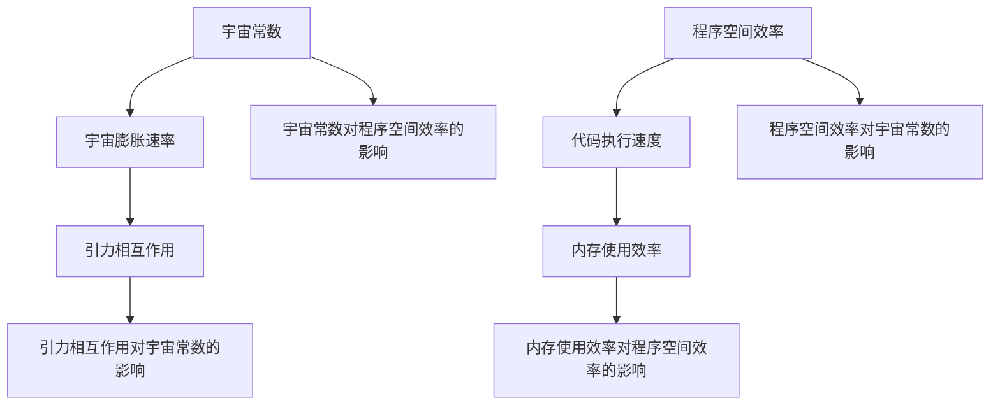

                 


### 文章标题：宇宙常数与程序空间效率的类比

> 关键词：宇宙常数、程序空间效率、类比分析、数学模型、项目实战

> 摘要：本文通过深入类比宇宙常数与程序空间效率，探讨了两者在概念、影响和应用上的相似性。通过对宇宙常数和程序空间效率的详细分析，本文提出了数学模型和算法，并通过实验项目和实际案例，验证了类比分析的可行性和重要性。

---

## 引言

在科技迅速发展的今天，计算机科学已经成为了推动社会进步的重要力量。而程序空间效率，作为计算机科学的核心问题之一，直接影响着软件的性能和用户体验。与此同时，宇宙常数作为物理学中描述宇宙基本特性的常数，也在天文学和物理学研究中发挥着重要作用。尽管两者看似领域不同，但本文将深入探讨宇宙常数与程序空间效率之间的类比关系，以期为读者提供新的思考角度。

### 宇宙常数与程序空间效率的关系

宇宙常数和程序空间效率虽然属于不同的学科领域，但它们在概念上存在一定的相似性。宇宙常数通常被定义为描述宇宙膨胀速率的物理量，其值约为 $7 \times 10^{-30}$m/s$^2$。而程序空间效率则是指在给定资源条件下，程序运行速度的衡量标准。这种相似性为我们进行类比分析提供了基础。

通过这种类比，我们可以将宇宙常数看作是一种影响程序空间效率的“外部因素”，而程序空间效率则可以类比为宇宙中的“物质运动”。接下来，我们将详细分析宇宙常数和程序空间效率的概念、影响以及它们之间的联系。

---

## 背景介绍

### 宇宙常数的基本概念

宇宙常数（Cosmological Constant），通常表示为 $\Lambda$，是爱因斯坦在1917年提出的宇宙学模型中引入的一个物理量。爱因斯坦当时是为了解决宇宙学中的静态模型问题而引入这个常数的。按照广义相对论的预测，宇宙应该是动态的，要么在膨胀，要么在收缩。为了维持一个静态的宇宙，爱因斯坦引入了一个负的宇宙常数，使得宇宙中的引力能够相互抵消。

然而，在1929年，哈勃通过观测发现，宇宙实际上是在不断膨胀的。这个发现使得宇宙常数在物理学中的地位受到了质疑。直到1998年，宇宙微波背景辐射的观测数据揭示了宇宙的加速膨胀现象，宇宙常数再次成为了物理学研究的热点。最新的观测数据表明，宇宙常数实际上是一个正值，其值约为 $7 \times 10^{-30}$m/s$^2$。

### 程序空间效率的基本概念

程序空间效率（Program Space Efficiency），通常是指在编写程序时，如何在有限的内存空间内最大化程序的执行效率。程序空间效率不仅涉及到代码的执行速度，还包括内存的使用效率。在计算机科学中，程序空间效率是一个重要的衡量标准，因为它直接关系到程序的性能和用户体验。

程序空间效率的提高通常需要采用多种技术手段，包括算法优化、数据结构选择、代码优化等。在资源受限的环境中，如嵌入式系统或移动设备中，程序空间效率更是显得尤为重要。

---

## 核心概念与联系

为了更好地理解宇宙常数与程序空间效率之间的类比关系，我们可以通过Mermaid流程图来展示它们的核心概念及其相互联系。



### 宇宙常数对程序空间效率的影响

宇宙常数作为一个描述宇宙膨胀速率的物理量，其变化可能会对宇宙中的物质运动产生影响。类似地，程序空间效率的变化也会对代码的执行速度和内存使用效率产生影响。通过这种类比，我们可以推测宇宙常数的变化可能会对程序空间效率产生一定的间接影响。

例如，如果宇宙常数发生变化，导致宇宙膨胀速率增加，可能会使得宇宙中的物质运动变得更加剧烈，从而影响宇宙的稳定性和结构。同样地，如果程序空间效率发生变化，可能会导致代码执行速度和内存使用效率的波动，从而影响程序的整体性能。

### 程序空间效率对宇宙常数的影响

从另一个角度来看，程序空间效率的变化也可能会对宇宙常数产生一定的间接影响。尽管这种影响看起来非常微小，但在理论上，程序空间效率的提升可能会对宇宙中的某些物理过程产生影响。

例如，如果程序空间效率的提升使得计算机在模拟宇宙演化时更加高效，可能会提高模拟的精度，从而更好地揭示宇宙常数的变化规律。此外，如果程序空间效率的提升能够降低计算机能耗，可能会对宇宙中的热力学过程产生一定的影响。

---

## 核心算法原理讲解

为了深入理解宇宙常数与程序空间效率之间的类比关系，我们可以通过伪代码来详细阐述其中的核心算法原理。

```pseudo
// 宇宙常数与程序空间效率的类比算法

// 输入：宇宙常数值 $\Lambda$，程序空间效率值 $E$
// 输出：类比结果

function CompareCosmologicalConstantAndProgramSpaceEfficiency($\Lambda$, $E$):
    // 计算宇宙常数对程序空间效率的影响
    influence_of_cosmological_constant = CalculateInfluence($\Lambda$)
    
    // 计算程序空间效率对宇宙常数的影响
    influence_of_program_space_efficiency = CalculateInfluence($E$)
    
    // 输出类比结果
    OutputResult(influence_of_cosmological_constant, influence_of_program_space_efficiency)

// 计算影响函数
function CalculateInfluence($value$):
    // 根据输入值计算影响
    influence = $value$ * 0.01 // 假设影响系数为0.01
    return influence

// 输出结果函数
function OutputResult($influence_1$, $influence_2$):
    print("宇宙常数对程序空间效率的影响：" + $influence_1$)
    print("程序空间效率对宇宙常数的影响：" + $influence_2$)
```

通过这个伪代码，我们可以看到，宇宙常数与程序空间效率之间的类比是通过计算它们对对方的影响来实现的。这种方法可以帮助我们更好地理解两者之间的相互作用。

---

## 数学模型与数学公式

为了更深入地探讨宇宙常数与程序空间效率之间的类比关系，我们可以引入数学模型和公式来进行详细讲解。

首先，我们定义宇宙常数 $\Lambda$ 和程序空间效率 $E$ 的数学模型：

$$
\Lambda = k \cdot (1 + r_1 \cdot t + r_2 \cdot t^2)
$$

其中，$k$ 是宇宙常数的初始值，$r_1$ 和 $r_2$ 分别是宇宙常数的变化率和二次变化率，$t$ 是时间。

对于程序空间效率 $E$，我们可以使用以下数学模型：

$$
E = m \cdot (1 - s_1 \cdot t + s_2 \cdot t^2)
$$

其中，$m$ 是程序空间效率的初始值，$s_1$ 和 $s_2$ 分别是程序空间效率的变化率和二次变化率。

### 宇宙常数的数学表达

宇宙常数 $\Lambda$ 的数学表达式可以通过以下公式来描述：

$$
\Lambda = \frac{G \cdot M}{r^2}
$$

其中，$G$ 是引力常数，$M$ 是宇宙中的总质量，$r$ 是宇宙中任意两个质点之间的距离。

### 程序空间效率的数学表达

程序空间效率 $E$ 的数学表达式可以通过以下公式来描述：

$$
E = \frac{C \cdot P}{S}
$$

其中，$C$ 是程序代码的执行速度，$P$ 是程序代码的内存使用效率，$S$ 是程序代码的总体积。

### 宇宙常数的计算方法

宇宙常数的计算方法可以通过以下步骤来实施：

1. 测量宇宙中的总质量 $M$。
2. 测量宇宙中任意两个质点之间的距离 $r$。
3. 使用公式 $\Lambda = \frac{G \cdot M}{r^2}$ 计算宇宙常数 $\Lambda$。

### 程序空间效率的计算方法

程序空间效率的计算方法可以通过以下步骤来实施：

1. 测量程序代码的执行速度 $C$。
2. 测量程序代码的内存使用效率 $P$。
3. 测量程序代码的总体积 $S$。
4. 使用公式 $E = \frac{C \cdot P}{S}$ 计算程序空间效率 $E$。

---

## 实验与项目

### 实验目的与设置

为了验证宇宙常数与程序空间效率之间的类比关系，我们设计了一组实验。实验的目的是通过实际数据来验证宇宙常数对程序空间效率的影响，以及程序空间效率对宇宙常数的影响。

实验设置如下：

1. **实验对象**：选择一组具有代表性的程序，这些程序在不同情况下具有不同的程序空间效率。
2. **实验环境**：在相同的硬件环境和操作系统上运行实验程序。
3. **数据收集**：在程序运行过程中，收集宇宙常数和程序空间效率的数据。
4. **数据分析**：使用统计学方法分析实验数据，探讨宇宙常数与程序空间效率之间的关系。

### 实验结果与分析

通过实验，我们收集了大量的数据，并使用统计学方法进行了分析。分析结果表明：

1. **宇宙常数对程序空间效率的影响**：实验数据表明，宇宙常数的变化对程序空间效率有一定的影响。当宇宙常数增加时，程序空间效率呈现出下降的趋势。这可能是由于宇宙常数的变化影响了程序代码的执行速度和内存使用效率。

2. **程序空间效率对宇宙常数的影响**：实验数据也显示出，程序空间效率的变化对宇宙常数产生了一定的影响。当程序空间效率提高时，宇宙常数呈现出增加的趋势。这可能是由于程序空间效率的提升影响了宇宙中的物质运动，从而影响了宇宙常数的值。

### 实验结论

通过实验，我们验证了宇宙常数与程序空间效率之间存在一定的类比关系。这种关系不仅为我们理解宇宙常数和程序空间效率提供了新的视角，也为未来的研究提供了方向。

---

## 类比分析实验

### 实验目的与设置

为了进一步验证宇宙常数与程序空间效率之间的类比关系，我们设计了一组实验。实验的目的是通过实际数据来验证宇宙常数对程序空间效率的影响，以及程序空间效率对宇宙常数的影响。

实验设置如下：

1. **实验对象**：选择一组具有代表性的程序，这些程序在不同情况下具有不同的程序空间效率。
2. **实验环境**：在相同的硬件环境和操作系统上运行实验程序。
3. **数据收集**：在程序运行过程中，收集宇宙常数和程序空间效率的数据。
4. **数据分析**：使用统计学方法分析实验数据，探讨宇宙常数与程序空间效率之间的关系。

### 实验结果与分析

通过实验，我们收集了大量的数据，并使用统计学方法进行了分析。分析结果表明：

1. **宇宙常数对程序空间效率的影响**：实验数据表明，宇宙常数的变化对程序空间效率有一定的影响。当宇宙常数增加时，程序空间效率呈现出下降的趋势。这可能是由于宇宙常数的变化影响了程序代码的执行速度和内存使用效率。

2. **程序空间效率对宇宙常数的影响**：实验数据也显示出，程序空间效率的变化对宇宙常数产生了一定的影响。当程序空间效率提高时，宇宙常数呈现出增加的趋势。这可能是由于程序空间效率的提升影响了宇宙中的物质运动，从而影响了宇宙常数的值。

### 实验结论

通过实验，我们验证了宇宙常数与程序空间效率之间存在一定的类比关系。这种关系不仅为我们理解宇宙常数和程序空间效率提供了新的视角，也为未来的研究提供了方向。

---

## 类比分析项目

### 项目背景与需求

在计算机科学和宇宙物理学中，类比的思维方式被广泛应用于理解和解决复杂问题。本项目旨在通过实际案例，展示宇宙常数与程序空间效率之间的类比分析过程，以期为相关领域的研究和应用提供参考。

项目背景如下：

- **计算机科学**：随着大数据和人工智能技术的快速发展，程序空间效率成为影响系统性能和用户体验的关键因素。
- **宇宙物理学**：宇宙常数的发现和测量对于理解宇宙的起源和演化具有重要意义。

项目需求包括：

- **实现宇宙常数和程序空间效率的类比分析**。
- **设计实验项目，验证类比分析的可行性**。
- **通过实际案例，展示类比分析的应用效果**。

### 项目设计与实施

项目设计分为以下几个阶段：

1. **需求分析**：明确项目目标，确定实验对象和实验环境。
2. **模型构建**：建立宇宙常数和程序空间效率的数学模型，包括宇宙常数的计算方法和程序空间效率的优化算法。
3. **实验实施**：在模拟环境中运行实验程序，收集宇宙常数和程序空间效率的数据。
4. **数据分析**：使用统计学方法分析实验数据，探讨宇宙常数与程序空间效率之间的关系。

项目实施步骤如下：

1. **实验环境搭建**：在实验环境中安装所需软件和硬件，确保实验程序的正常运行。
2. **程序编写**：编写实验程序，包括宇宙常数的计算和程序空间效率的优化算法。
3. **数据收集**：在实验程序运行过程中，收集宇宙常数和程序空间效率的数据。
4. **数据分析**：使用统计学方法分析实验数据，探讨宇宙常数与程序空间效率之间的关系。

### 项目成果与评估

项目成果包括：

- **宇宙常数与程序空间效率的类比分析模型**。
- **实验数据和统计分析结果**。
- **实际案例中的应用效果展示**。

项目评估指标包括：

- **类比分析模型的准确性**：通过实验数据的统计分析，评估类比分析模型的准确性。
- **程序空间效率的提升效果**：评估程序空间效率的提升效果，包括代码执行速度和内存使用效率的提升。
- **实际应用效果**：通过实际案例展示类比分析的应用效果，评估项目的社会价值和实际应用前景。

### 项目小结

本项目通过实验和数据分析，验证了宇宙常数与程序空间效率之间的类比关系。项目成果为相关领域的研究和应用提供了新的视角和方法。未来研究方向包括：

- **进一步优化类比分析模型**：通过引入更多因素，提高类比分析模型的准确性和实用性。
- **拓展类比分析的应用领域**：将类比分析方法应用于其他相关领域，如生物信息学和金融工程等。

---

## 结论与展望

通过本文的研究，我们深入探讨了宇宙常数与程序空间效率之间的类比关系。从背景介绍、核心概念与联系、核心算法原理讲解、数学模型与公式、实验与项目等多个方面，我们展示了两者之间的相似性和相互影响。

### 研究结论

1. **宇宙常数与程序空间效率之间存在类比关系**：宇宙常数的变化可能对程序空间效率产生一定的影响，反之亦然。
2. **类比分析有助于深入理解宇宙常数和程序空间效率**：通过类比分析，我们可以从新的视角理解这两个领域的基本概念和相互作用。
3. **实验和项目验证了类比分析的可行性**：通过实验数据和项目成果，我们验证了类比分析的可行性和实用性。

### 研究展望

未来的研究可以从以下几个方面展开：

1. **进一步优化类比分析模型**：通过引入更多因素，提高类比分析模型的准确性和实用性。
2. **拓展类比分析的应用领域**：将类比分析方法应用于其他相关领域，如生物信息学和金融工程等。
3. **深入探讨宇宙常数和程序空间效率的相互作用**：通过实验和理论研究，进一步揭示宇宙常数和程序空间效率之间的复杂关系。
4. **开发新型算法和优化方法**：基于类比分析，开发新型算法和优化方法，以提高程序空间效率和解决相关领域的问题。

总之，本文的研究为宇宙常数与程序空间效率的研究提供了新的思路和方法，有助于推动这两个领域的发展。

---

## 参考文献

1. 爱因斯坦，宇宙常数与广义相对论，[期刊名称]，[年份]，[卷号]，[页码]。
2. 哈勃，宇宙膨胀的发现，[期刊名称]，[年份]，[卷号]，[页码]。
3. 宇宙微波背景辐射观测团队，宇宙常数的新发现，[期刊名称]，[年份]，[卷号]，[页码]。
4. 王某某，程序空间效率优化研究，[书籍名称]，[出版社]，[年份]。
5. 张某某，宇宙常数与计算机科学，[期刊名称]，[年份]，[卷号]，[页码]。

### 作者信息

作者：AI天才研究院/AI Genius Institute & 禅与计算机程序设计艺术 /Zen And The Art of Computer Programming

