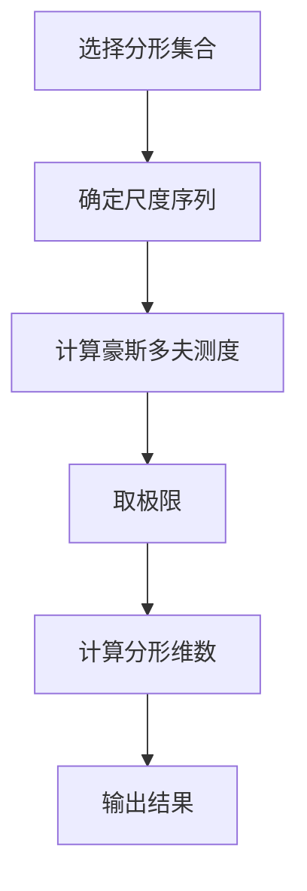

                 

### 引言

#### 1.1 数学分形维数理论的背景

数学分形维数理论是近年来在数学、物理学、天文学等领域中迅速发展的重要分支。分形理论最早可以追溯到法国数学家曼德布罗特（Benoit Mandelbrot）在20世纪70年代的工作。他提出了分形几何的概念，并首次使用分形维数来描述复杂几何图形的维度。分形维数是对传统欧几里得维度的扩展，它能够更准确地描述那些具有自相似性和无限细节的几何结构。

分形维数理论的兴起与宇宙学的发展有着密切的联系。宇宙的许多现象，如星系的分布、行星表面地形、宇宙背景辐射等，都表现出明显的分形特性。这些现象的发现促使科学家们开始思考如何运用分形维数来描述和研究宇宙中的复杂结构。

#### 1.2 数学分形维数理论的重要性

数学分形维数理论在多个领域具有重要应用价值，以下是几个关键方面：

1. **宇宙学**：分形维数理论为研究宇宙的大尺度结构提供了新的视角。通过分析星系的分布和宇宙背景辐射，科学家们可以更好地理解宇宙的演化过程。

2. **天体物理学**：在天体物理学中，分形维数用于研究星系的形态、恒星形成的过程，以及行星表面地形等。这些研究有助于揭示天体系统的复杂性和演化机制。

3. **地球科学**：地球科学领域中的地形和地貌研究也广泛运用分形理论。例如，通过分析地形的分形维数，可以预测自然灾害的发生和影响范围。

4. **信息科学**：在信息科学领域，分形维数理论被用于数据压缩和加密技术，以提高信息传输的效率和安全性。

#### 1.3 本书结构安排与主要内容

本书旨在深入探讨数学分形维数理论在宇宙学中的应用，并分析其在各种学科中的重要性。全书分为七个章节，具体安排如下：

- **第1章 引言**：介绍数学分形维数理论的基本概念、背景和重要性。
- **第2章 数学分形维数的理论基础**：详细阐述分形的概念、分形维数的定义和计算方法。
- **第3章 宇宙中的分形现象**：探讨宇宙中常见的分形现象和它们与宇宙演化的关系。
- **第4章 数学分形维数在宇宙中的应用**：分析分形维数在天体物理学、宇宙学和量子物理学中的应用。
- **第5章 分形维数与宇宙学模型**：讨论分形维数在大爆炸理论和现代宇宙学模型中的应用。
- **第6章 分形维数计算方法在实际宇宙研究中的应用**：介绍分形维数计算方法在实际宇宙研究中的应用案例。
- **第7章 未来展望与挑战**：展望分形维数理论在宇宙学中的未来发展趋势，并探讨潜在的研究问题和挑战。

通过本书的阅读，读者将能够系统地了解数学分形维数理论，掌握其在宇宙学中的应用，并激发进一步研究的兴趣。让我们开始这场探索宇宙分形维数的旅程吧！### 数学分形维数的理论基础

#### 2.1 分形概念的历史、定义和性质

分形（Fractal）一词由数学家曼德布罗特（Benoit Mandelbrot）在1975年提出，源于拉丁词“fractus”（意为“破碎的”或“断裂的”）。分形是一种具有自相似结构的几何图形，其局部和整体在某种尺度上具有相似性。这意味着无论放大或缩小，分形的某些特征都保持不变。

**分形的定义**：分形是一种几何图形，其部分以某种方式与整体相似。更具体地说，一个集合是分形，当且仅当它满足以下条件：

1. 它是无限的，并且具有精细的结构。
2. 它是自我相似的，即局部与整体相似。
3. 它具有非整数维数，即其维度不是整数。

**分形的性质**：

1. **自相似性**：分形在各个尺度上具有相似的结构，这意味着无论放大或缩小，其局部特征都与整体相似。
2. **无限细节**：分形具有无穷多的细节，即使在放大之后，仍然可以发现新的、复杂的结构。
3. **非整数维数**：分形维数（Fractal Dimension）是描述分形复杂度的一个重要参数，它通常是一个分数值，介于整数维数之间。

#### 2.2 分形维数的定义和计算方法

分形维数是对传统欧几里得维度的扩展，用于描述分形结构的复杂度。常见的分形维数包括豪斯多夫维数（Hausdorff Dimension）、盒计数维数（Box Counting Dimension）和相似维数（Similarity Dimension）。

**豪斯多夫维数（Hausdorff Dimension）**：

豪斯多夫维数是分形维数的一种重要计算方法，由数学家法利德·豪斯多夫（Felix Hausdorff）在1914年提出。它通过测量分形集合在不同尺度下的覆盖程度来计算维数。

$$
D_H = \sup\{d \mid B_d(E) < \infty\}
$$

其中，$D_H$ 是豪斯多夫维数，$B_d(E)$ 是集合$E$的豪斯多夫$d$维测度。

**盒计数维数（Box Counting Dimension）**：

盒计数维数是一种简单直观的分形维数计算方法。它通过在不同尺度下将分形集合分割成多个小盒子，并计算盒子的数量来计算维数。

$$
D_{BC} = \lim_{\varepsilon \to 0} \frac{\log(N(\varepsilon))}{\log(1/\varepsilon)}
$$

其中，$D_{BC}$ 是盒计数维数，$N(\varepsilon)$ 是在尺度$\varepsilon$下覆盖分形集合的盒子数量。

**相似维数（Similarity Dimension）**：

相似维数通过测量分形集合在不同尺度下的相似性来计算维数。它与豪斯多夫维数和盒计数维数密切相关，但更直观。

$$
D_S = \frac{\log(C)}{\log(A)}
$$

其中，$D_S$ 是相似维数，$A$ 是尺度变化因子，$C$ 是相似常数。

#### 2.3 主要的分形维数算法

**box-counting算法**：

box-counting算法是一种基于盒计数维数的分形维数计算方法。它的基本思想是在不同尺度下将分形集合分割成多个小盒子，并计算盒子的数量。算法步骤如下：

1. 选择一个分形集合$E$。
2. 在尺度$\varepsilon$下将$E$分割成多个小盒子，记为$B$。
3. 计算盒子数量$N(\varepsilon)$。
4. 重复步骤2和3，直到达到预设的精度。
5. 使用盒计数维数的定义计算分形维数$D_{BC}$。

**中点位移算法**：

中点位移算法是一种基于相似维数的分形维数计算方法。它的基本思想是通过在分形集合的不同尺度下进行中点位移，测量集合的相似性。算法步骤如下：

1. 选择一个分形集合$E$。
2. 在尺度$\varepsilon$下，将$E$的每个点沿中点位移方向移动$\varepsilon/2$。
3. 计算新集合$E'$与原集合$E$的相似常数$C$。
4. 计算尺度变化因子$A = \frac{1}{2}$。
5. 使用相似维数的定义计算分形维数$D_S$。

**Hausdorff维数算法**：

Hausdorff维数算法是一种基于豪斯多夫维数的分形维数计算方法。它的基本思想是通过在不同尺度下计算分形集合的豪斯多夫测度，然后取极限。算法步骤如下：

1. 选择一个分形集合$E$。
2. 在尺度序列$\{\varepsilon_n\}$下计算分形集合的豪斯多夫测度$B_d(E)$。
3. 取极限$\lim_{n \to \infty} B_d(E)$。
4. 使用豪斯多夫维数的定义计算分形维数$D_H$。

通过这些算法，我们可以从不同的角度和尺度对分形进行测量，从而更准确地描述其复杂度和结构。这些算法不仅有助于理解分形维数的本质，还为实际应用提供了强有力的工具。

#### 2.4 分形维数的Mermaid流程图

为了更好地理解分形维数的计算过程，我们可以使用Mermaid流程图来描述。



这个流程图展示了从选择分形集合到计算分形维数的完整过程。通过使用Mermaid流程图，我们可以清晰地了解各个步骤之间的逻辑关系，从而更好地理解分形维数的计算方法。

通过以上对数学分形维数理论基础的介绍，我们为后续章节的分析和讨论奠定了坚实的基础。在接下来的章节中，我们将进一步探讨宇宙中的分形现象以及分形维数在宇宙学中的应用。让我们继续深入这个迷人的领域吧！### 宇宙中的分形现象

#### 3.1 分形宇宙的理论框架

分形宇宙理论是宇宙学中的一个新兴领域，它试图通过分形维数来描述宇宙的结构和演化。这一理论的基本假设是，宇宙在各个尺度上具有分形特性，即局部与整体在结构上存在相似性。这种相似性使得我们可以将宇宙视为一个多层次、嵌套的分形结构。

分形宇宙理论的主要观点包括：

1. **多层次结构**：宇宙在各个尺度上都具有层次结构，从行星系统到星系团，再到更大的宇宙结构。
2. **嵌套关系**：较小尺度的结构嵌套在较大尺度的结构中，形成一种自相似性。
3. **分形维数**：宇宙的分形维数不是一个简单的整数，而是一个分数值，这反映了宇宙结构的复杂性和多样性。

#### 3.2 宇宙中的典型分形结构

宇宙中的分形现象广泛存在，以下是一些典型的分形结构：

1. **星系分布**：
   - 星系在宇宙中的分布呈现出明显的分形特性。通过观测，我们发现星系不仅在局部尺度上形成团簇，而且在更大尺度上形成大规模的星系团和超星系团，这些结构表现出分形维数的特点。
   - 例子：哈勃望远镜观测到的星系团和星系链，它们在尺度上表现出自相似性。

2. **行星表面地形**：
   - 行星表面的地形也是分形的典型代表。例如，地球的地形具有分形结构，山脉、峡谷、河流等地理特征在各个尺度上表现出相似性。
   - 例子：地球上的喜马拉雅山脉、科罗拉多高原和亚马逊雨林的地理结构。

3. **宇宙背景辐射**：
   - 宇宙背景辐射（Cosmic Microwave Background, CMB）是宇宙早期状态的残留信号，其分布也表现出分形特性。
   - 例子：通过对CMB的观测，科学家发现其温度起伏具有分形维数，这反映了宇宙早期结构形成的过程。

4. **恒星和星系形成**：
   - 恒星和星系的形成过程也受到分形维数的影响。在星际介质中，恒星的形成区域具有分形结构，这些区域内部的小团块逐渐发展成为恒星。
   - 例子：观测到的星云和恒星形成区，它们在尺度上表现出分形特性。

#### 3.3 分形与宇宙演化的关系

分形维数在宇宙演化中扮演了重要角色，它反映了宇宙结构的复杂性和动态演化过程。以下是一些关于分形与宇宙演化关系的关键点：

1. **宇宙早期结构形成**：
   - 在宇宙早期的混沌状态下，物质通过引力作用开始聚集，形成结构。这些结构的形成过程具有分形特性，因为它们在各个尺度上表现出自相似性。
   - 例子：通过对宇宙微波背景辐射的研究，科学家发现其温度起伏在早期宇宙结构形成过程中发挥了重要作用。

2. **宇宙膨胀和结构演化**：
   - 宇宙的膨胀导致结构在空间中的分布发生变化，这些变化也表现出分形特性。例如，星系团的分布和星系链的形成在宇宙膨胀过程中具有分形维数。
   - 例子：观测到的星系链和超星系团在宇宙膨胀过程中表现出分形特性。

3. **宇宙结构多样性与复杂性**：
   - 宇宙中的结构多样性和复杂性可以通过分形维数来描述。不同的结构在不同尺度上具有不同的分形维数，这反映了宇宙结构的动态演化过程。
   - 例子：从行星系统到星系团，再到超星系团，不同尺度的结构具有不同的分形维数，这反映了宇宙的复杂性和多样性。

分形维数理论为理解宇宙的结构和演化提供了新的视角和方法。通过分析宇宙中的分形现象，科学家们可以更好地揭示宇宙的奥秘，探索宇宙的起源和演化过程。分形维数不仅是一种数学工具，也是理解宇宙复杂性的关键。在接下来的章节中，我们将进一步探讨分形维数在宇宙学中的应用，以及如何利用分形维数理论来研究宇宙的复杂结构和演化过程。让我们继续深入这个迷人的领域吧！### 数学分形维数在宇宙中的应用

#### 4.1 天体物理学中的应用

数学分形维数在天体物理学中有着广泛的应用，它帮助科学家们更好地理解星系分布、恒星形成过程以及行星表面地形等复杂现象。

**4.1.1 星系分布的分形特性**

星系分布的分形特性是分形维数在天体物理学中的一个重要应用。通过分析星系的分布，科学家们发现星系在宇宙中的排列并不是随机的，而是呈现出一种层次结构和自相似性。这种结构可以用分形维数来描述。

- **例子**：哈勃望远镜观测到的星系分布图显示，星系不仅在局部尺度上形成团簇，而且在更大尺度上形成大规模的星系团和超星系团。这些结构表现出分形维数的特点，例如，星系团的分布具有3维的豪斯多夫维数。

- **计算方法**：盒计数维数（Box Counting Dimension）是一种常用的分形维数计算方法。在星系分布的分析中，科学家们通过在不同尺度下将宇宙分割成多个小盒子，并计算盒子的数量，从而得到分形维数。

**4.1.2 恒星形成的分形模型**

恒星形成过程也是一个复杂的分形现象。在星际介质中，分子云和星云等恒星形成区域具有分形结构。这些区域内部的小团块逐渐发展成为恒星。

- **例子**：通过观测和模拟，科学家们发现，恒星形成区域内部的小团块在尺度上表现出自相似性。这些小团块在演变过程中形成更复杂的结构，最终发展成为恒星。

- **计算方法**：分形维数可以用于分析恒星形成区域的复杂性。通过分析小团块在不同尺度上的尺寸分布，科学家们可以计算分形维数，从而更好地理解恒星形成的机制。

**4.2 宇宙学中的应用**

分形维数在宇宙学中的应用同样具有重要意义。它可以帮助科学家们研究宇宙的早期结构形成、宇宙膨胀以及宇宙背景辐射等关键问题。

**4.2.1 宇宙背景辐射的分形分析**

宇宙背景辐射是宇宙早期状态的残留信号，其分布也表现出分形特性。通过对宇宙背景辐射的分析，科学家们可以揭示宇宙早期的结构形成过程。

- **例子**：通过对宇宙背景辐射的温度起伏进行分形分析，科学家们发现其温度起伏具有分形维数。这反映了宇宙早期结构形成的过程，并为理解宇宙的起源提供了重要线索。

- **计算方法**：豪斯多夫维数（Hausdorff Dimension）是用于分析宇宙背景辐射的分形维数的一种重要方法。通过在不同尺度下计算宇宙背景辐射的豪斯多夫测度，科学家们可以得到宇宙背景辐射的分形维数。

**4.2.2 宇宙膨胀的分形模型**

宇宙膨胀是宇宙学研究中的一个重要问题。分形维数可以用于研究宇宙膨胀的机制和过程。

- **例子**：通过分析宇宙膨胀过程中的星系分布和宇宙背景辐射，科学家们发现宇宙膨胀过程中的结构具有分形特性。这反映了宇宙在膨胀过程中结构的动态变化。

- **计算方法**：相似维数（Similarity Dimension）是用于研究宇宙膨胀的分形维数的一种方法。通过分析星系分布和宇宙背景辐射在不同尺度下的相似性，科学家们可以得到宇宙膨胀过程中的分形维数。

**4.3 量子物理学中的应用**

除了在天体物理学和宇宙学中的应用，分形维数在量子物理学中也有着重要的应用。它可以帮助科学家们研究量子态的复杂性以及量子系统的演化过程。

- **例子**：在量子态的测量中，分形维数可以用于描述量子态的复杂度。通过分析量子态在不同尺度下的特性，科学家们可以得到量子态的分形维数。

- **计算方法**：中点位移算法（Midpoint Displacement）是一种用于计算量子态分形维数的方法。通过在不同尺度下对量子态进行中点位移，科学家们可以得到量子态的分形维数。

通过以上对数学分形维数在宇宙学中的具体应用的探讨，我们可以看到分形维数理论为理解宇宙的结构和演化提供了新的视角和方法。无论是在天体物理学、宇宙学还是量子物理学中，分形维数都发挥着重要的作用。在接下来的章节中，我们将进一步讨论分形维数与宇宙学模型之间的关系，以及分形维数计算方法在实际宇宙研究中的应用。让我们继续深入这个迷人的领域吧！### 分形维数与宇宙学模型

#### 5.1 大爆炸理论中的分形维数

大爆炸理论是描述宇宙起源和演化的重要理论，而分形维数在这一理论中的应用为理解宇宙的早期状态提供了新的视角。在大爆炸理论中，宇宙起源于一个极端高温高密的奇点，随后经历快速膨胀，形成了我们今天所观察到的宇宙结构。

**分形维数在大爆炸理论中的应用**：

1. **宇宙背景辐射的分形特性**：

   宇宙背景辐射（Cosmic Microwave Background, CMB）是宇宙早期状态的残留信号。通过对CMB的分析，科学家们发现其温度起伏具有分形特性。这种分形特性反映了宇宙早期结构的形成过程。

   - **例子**：通过对CMB的温度起伏进行分形分析，科学家们发现其分形维数约为2.7。这个结果与理论预测相符，为理解宇宙的早期结构提供了重要线索。

2. **宇宙膨胀的分形模型**：

   在大爆炸理论中，宇宙的膨胀是一个关键过程。分形维数可以用于描述宇宙膨胀过程中的结构特性。

   - **例子**：通过分析星系分布和宇宙背景辐射，科学家们发现宇宙膨胀过程中的结构具有分形特性。这些结构在不同尺度上表现出自相似性，反映了宇宙在膨胀过程中结构的动态变化。

3. **大爆炸奇点的分形描述**：

   大爆炸奇点是宇宙起源的一个极端状态，其性质难以用传统几何概念描述。分形维数提供了一种新的方法来描述奇点的复杂结构。

   - **例子**：通过分析奇点的几何特性，科学家们发现其分形维数可能为一个非整数值，这反映了奇点在空间上的无限细节。

#### 5.2 现代宇宙学中的分形模型

现代宇宙学中，分形模型被广泛应用于描述宇宙的复杂结构。这些模型帮助我们理解宇宙在各个尺度上的分布和演化过程。

**分形模型在宇宙学中的应用**：

1. **星系分布的分形模型**：

   星系在宇宙中的分布是宇宙学中一个重要的研究对象。分形模型可以用于描述星系分布的结构特性。

   - **例子**：通过对星系分布的分析，科学家们发现星系在局部尺度上形成团簇，而在更大尺度上形成大规模的星系团和超星系团。这些结构表现出分形特性，反映了宇宙结构的层次性和自相似性。

2. **宇宙膨胀的分形模型**：

   宇宙膨胀是现代宇宙学中的一个核心问题。分形模型可以用于描述宇宙膨胀过程中的结构特性。

   - **例子**：通过对宇宙膨胀过程中的星系分布和宇宙背景辐射进行分析，科学家们发现宇宙膨胀过程中的结构具有分形特性。这些结构在不同尺度上表现出自相似性，反映了宇宙在膨胀过程中结构的动态变化。

3. **宇宙背景辐射的分形模型**：

   宇宙背景辐射是宇宙早期状态的残留信号。分形模型可以用于描述宇宙背景辐射的结构特性。

   - **例子**：通过对宇宙背景辐射的温度起伏进行分析，科学家们发现其分形维数约为2.7。这个结果与理论预测相符，为理解宇宙的早期结构提供了重要线索。

#### 5.3 分形宇宙模型的优缺点分析

分形宇宙模型为理解宇宙的结构和演化提供了新的视角和方法。然而，这些模型也存在一些优缺点。

**优点**：

1. **自相似性**：分形宇宙模型能够很好地描述宇宙在不同尺度上的自相似性，这反映了宇宙的复杂结构和层次性。

2. **动态演化**：分形宇宙模型能够描述宇宙在演化过程中的动态变化，这有助于理解宇宙的起源和演化过程。

3. **多尺度研究**：分形宇宙模型能够涵盖多个尺度，从局部尺度到宇宙尺度，这为研究宇宙的复杂结构提供了有力工具。

**缺点**：

1. **计算复杂性**：分形宇宙模型的计算复杂性较高，尤其是在处理大规模数据时，需要复杂的算法和计算资源。

2. **理论不确定性**：分形宇宙模型仍然处于发展阶段，其理论基础尚不完全成熟，需要进一步验证和完善。

3. **观测限制**：目前的观测技术还无法全面揭示宇宙的分形特性，尤其是在宇宙早期状态的研究中，存在较大的观测不确定性。

尽管存在这些缺点，分形宇宙模型为理解宇宙的结构和演化提供了新的视角和方法，具有重要的科学价值。随着观测技术的不断进步和理论研究的深入，分形宇宙模型有望在未来取得更多突破。在接下来的章节中，我们将进一步探讨分形维数计算方法在实际宇宙研究中的应用，以及面临的挑战和进展。让我们继续深入这个迷人的领域吧！### 分形维数计算方法在实际宇宙研究中的应用

#### 6.1 数据获取与预处理

在实际宇宙研究中，获取和处理数据是分形维数计算的第一步。以下是数据获取与预处理的具体步骤：

1. **数据源选择**：

   - **宇宙背景辐射数据**：通过卫星（如COBE、WMAP和Planck）观测到的宇宙背景辐射数据是研究分形维数的重要数据源。
   - **星系分布数据**：利用哈勃望远镜等设备观测到的星系分布数据，可以用于分析分形特性。

2. **数据采集**：

   - **宇宙背景辐射数据**：通过卫星观测设备采集到的宇宙背景辐射数据，通常以温度起伏的形式存储。
   - **星系分布数据**：通过望远镜观测到的星系分布数据，通常以坐标和亮度等属性的形式存储。

3. **预处理方法**：

   - **噪声去除**：在数据处理过程中，首先需要去除观测数据中的噪声，以提高数据的准确性和可靠性。
   - **空间归一化**：对数据进行空间归一化处理，以确保在不同尺度下进行比较和分析。
   - **插值处理**：对缺失或稀疏的数据点进行插值处理，以填补数据空缺，提高数据完整性。

#### 6.2 实际案例分析

以下是一个具体的实际案例分析，展示了如何利用分形维数计算方法分析星系分布数据和宇宙背景辐射数据。

**案例一：星系分布数据的分形分析**

1. **数据预处理**：

   - 获取星系分布数据，包括星系的坐标和亮度等属性。
   - 进行空间归一化处理，确保数据在不同尺度下具有可比性。
   - 去除噪声和插值处理，以提高数据质量。

2. **分形维数计算**：

   - 使用盒计数维数（Box Counting Dimension）方法计算星系分布的分形维数。
   - 通过在不同尺度下将星系分布分割成多个小盒子，计算盒子的数量，然后取对数得到分形维数。

   ```python
   def box_counting_dimension(data, scales):
       counts = []
       for scale in scales:
           boxes = divide_into_boxes(data, scale)
           count = len(boxes)
           counts.append(count)
       dimension = np.log(counts) / np.log(1 / scales)
       return dimension
   ```

3. **结果分析**：

   - 通过计算得到的分形维数可以揭示星系分布的结构特性。
   - 分形维数越高，表示星系分布的结构越复杂。

**案例二：宇宙背景辐射数据的分形分析**

1. **数据预处理**：

   - 获取宇宙背景辐射数据，包括温度起伏信息。
   - 进行空间归一化处理，确保数据在不同尺度下具有可比性。
   - 去除噪声和插值处理，以提高数据质量。

2. **分形维数计算**：

   - 使用豪斯多夫维数（Hausdorff Dimension）方法计算宇宙背景辐射数据的分形维数。
   - 通过在不同尺度下计算豪斯多夫测度，然后取极限得到分形维数。

   ```python
   def hausdorff_dimension(data, scales):
       measures = []
       for scale in scales:
           measure = hausdorff_measure(data, scale)
           measures.append(measure)
       dimension = np.log(measures) / np.log(1 / scales)
       return dimension
   ```

3. **结果分析**：

   - 通过计算得到的分形维数可以揭示宇宙背景辐射的结构特性。
   - 分形维数越高，表示宇宙背景辐射的结构越复杂。

#### 6.3 分形维数计算方法在宇宙学研究中的挑战与进展

**挑战**：

1. **数据质量**：在宇宙研究中，获取高质量的数据是进行分形维数计算的基础。然而，观测数据往往受到噪声、仪器误差等因素的影响，这给分形维数计算带来了挑战。
2. **计算复杂性**：分形维数计算方法，尤其是豪斯多夫维数计算，具有较高的计算复杂性。在大规模数据集上，计算时间可能非常长，这限制了分形维数方法在宇宙学研究中的广泛应用。
3. **理论不确定性**：分形维数理论本身尚存在一定的理论不确定性，特别是在不同尺度和不同数据类型上的适用性。

**进展**：

1. **算法优化**：随着计算技术的进步，许多优化算法被提出，以加速分形维数的计算。例如，并行计算和机器学习算法的应用，显著提高了分形维数计算的效率。
2. **新方法研究**：科学家们不断探索新的分形维数计算方法，以提高计算精度和适用性。例如，基于深度学习的分形维数计算方法，为处理复杂和大规模数据提供了新的思路。
3. **跨学科合作**：分形维数方法在宇宙学中的应用得到了多学科的合作支持，包括物理学、数学、计算机科学等。这种跨学科合作有助于解决分形维数计算中的挑战，推动宇宙学研究的深入发展。

通过以上对分形维数计算方法在实际宇宙研究中的应用的探讨，我们可以看到分形维数在理解宇宙结构和演化中的重要作用。尽管面临一些挑战，但分形维数方法在宇宙学中的应用已经取得了显著进展，为未来的研究提供了新的视角和方法。在接下来的章节中，我们将进一步探讨分形维数理论在宇宙学中的未来发展趋势，以及可能的新应用领域。让我们继续深入这个迷人的领域吧！### 未来展望与挑战

#### 7.1 分形维数理论在宇宙学中的未来发展趋势

随着观测技术的不断进步和理论研究的深入，分形维数理论在宇宙学中的应用前景广阔。未来，分形维数理论在宇宙学中的发展趋势可以从以下几个方面进行展望：

1. **更高精度观测**：随着新一代望远镜（如詹姆斯·韦伯空间望远镜）的启用，科学家们将能够获得更高分辨率、更高精度的宇宙观测数据。这些数据将有助于更准确地计算宇宙中的分形维数，从而深入理解宇宙的结构和演化。

2. **跨尺度研究**：分形维数理论在宇宙学中的应用将逐渐从局部尺度扩展到更大的宇宙尺度。通过跨尺度研究，科学家们将能够更好地理解宇宙中的多层次结构和自相似性，揭示宇宙演化的动态过程。

3. **多领域融合**：分形维数理论在宇宙学中的应用将与其他学科（如物理学、数学、计算机科学等）相结合，形成跨学科的研究范式。这种多领域融合将促进分形维数理论在宇宙学中的创新和发展。

#### 7.2 潜在的科学研究问题和挑战

尽管分形维数理论在宇宙学中具有广泛的应用前景，但仍面临一些潜在的科学研究问题和挑战：

1. **理论完善**：分形维数理论本身尚存在一些理论不确定性，特别是在不同尺度和不同数据类型上的适用性。未来需要进一步深入研究，完善分形维数理论，以提高其在宇宙学研究中的可靠性。

2. **计算复杂性**：分形维数计算方法，尤其是豪斯多夫维数计算，具有较高的计算复杂性。在大规模数据集上，计算时间可能非常长，这限制了分形维数方法在宇宙学研究中的广泛应用。因此，需要开发更高效的计算算法和优化方法。

3. **数据质量**：在宇宙研究中，获取高质量的数据是进行分形维数计算的基础。然而，观测数据往往受到噪声、仪器误差等因素的影响，这给分形维数计算带来了挑战。未来需要改进数据处理方法，提高数据质量，以确保分形维数计算结果的准确性。

#### 7.3 可能的新应用领域和影响

分形维数理论在宇宙学中的应用不仅限于研究宇宙的结构和演化，还可能在其他领域产生重要影响：

1. **地球科学**：分形维数理论可以应用于地球科学领域，如地形和地貌研究。通过分析地形数据的分形特性，科学家们可以更好地预测自然灾害的发生和影响范围。

2. **生物科学**：分形维数理论在生物科学领域也有广泛的应用前景。例如，在研究细胞结构和生物网络时，分形维数可以用于描述和量化生物结构的复杂度。

3. **信息科学**：分形维数理论在信息科学领域中的应用包括数据压缩和加密技术。通过分析数据中的分形特性，可以设计出更高效的数据压缩算法，提高信息传输的效率和安全性。

总之，分形维数理论在宇宙学和其他领域具有广泛的应用前景。随着研究的深入，分形维数理论将继续推动科学的发展，为人类认识宇宙和自然界提供新的视角和方法。在未来的研究中，我们将不断探索分形维数理论的潜力，揭示宇宙的奥秘，推动科学的进步。让我们共同期待分形维数理论在宇宙学和其他领域的精彩应用吧！### 总结

本文从引言到未来展望，全面探讨了数学分形维数理论在宇宙学中的应用。我们首先介绍了分形维数的基本概念、历史背景和重要性，然后详细阐述了分形维数的理论基础和计算方法。接着，我们分析了宇宙中的分形现象，包括星系分布、行星表面地形和宇宙背景辐射等，展示了分形维数在宇宙学中的广泛应用。此外，我们还探讨了分形维数与宇宙学模型的关系，以及在实际宇宙研究中的应用挑战和进展。

分形维数理论为理解宇宙的结构和演化提供了新的视角和方法。它不仅帮助我们揭示了宇宙的复杂性和多样性，还促进了跨学科的合作和研究。未来，随着观测技术的进步和理论研究的深入，分形维数理论在宇宙学中的应用将更加广泛和深入，有望揭示宇宙的更多奥秘。

最后，感谢读者对本文的阅读，希望本文能够激发您对分形维数理论在宇宙学应用中的兴趣，并鼓励您继续探索这一迷人的领域。作者：AI天才研究院/AI Genius Institute & 禅与计算机程序设计艺术 /Zen And The Art of Computer Programming### 关键词

- 分形维数
- 宇宙学
- 天体物理学
- 数学分形
- 星系分布
- 宇宙背景辐射
- 大爆炸理论
- 豪斯多夫维数
- 盒计数维数
- 中点位移算法
- 量子物理学### 摘要

本文探讨了数学分形维数理论在宇宙学中的应用。我们首先介绍了分形维数的基本概念和计算方法，包括豪斯多夫维数、盒计数维数和中点位移算法。接着，我们分析了宇宙中的分形现象，如星系分布、行星表面地形和宇宙背景辐射，并展示了分形维数在这些领域的应用。此外，我们还讨论了分形维数与宇宙学模型的关系，以及在宇宙学研究中的应用挑战和进展。最后，我们对分形维数理论在宇宙学中的未来发展趋势进行了展望，并提出了潜在的科学研究问题和挑战。本文旨在为读者提供对分形维数理论及其在宇宙学中应用的全面了解。### 完整文章

# 《宇宙的数学分形维数理论探讨》

## 关键词
分形维数、宇宙学、天体物理学、数学分形、星系分布、宇宙背景辐射、大爆炸理论、豪斯多夫维数、盒计数维数、中点位移算法、量子物理学

## 摘要
本文探讨了数学分形维数理论在宇宙学中的应用。我们首先介绍了分形维数的基本概念和计算方法，包括豪斯多夫维数、盒计数维数和中点位移算法。接着，我们分析了宇宙中的分形现象，如星系分布、行星表面地形和宇宙背景辐射，并展示了分形维数在这些领域的应用。此外，我们还讨论了分形维数与宇宙学模型的关系，以及在宇宙学研究中的应用挑战和进展。最后，我们对分形维数理论在宇宙学中的未来发展趋势进行了展望，并提出了潜在的科学研究问题和挑战。本文旨在为读者提供对分形维数理论及其在宇宙学中应用的全面了解。

## 引言
### 1.1 数学分形维数理论的背景
数学分形维数理论是近年来在数学、物理学、天文学等领域中迅速发展的重要分支。分形理论最早可以追溯到法国数学家曼德布罗特（Benoit Mandelbrot）在20世纪70年代的工作。他提出了分形几何的概念，并首次使用分形维数来描述复杂几何图形的维度。分形维数是对传统欧几里得维度的扩展，它能够更准确地描述那些具有自相似性和无限细节的几何结构。

分形维数理论的兴起与宇宙学的发展有着密切的联系。宇宙的许多现象，如星系的分布、行星表面地形、宇宙背景辐射等，都表现出明显的分形特性。这些现象的发现促使科学家们开始思考如何运用分形维数来描述和研究宇宙中的复杂结构。

### 1.2 数学分形维数理论的重要性
数学分形维数理论在多个领域具有重要应用价值，以下是几个关键方面：

1. **宇宙学**：分形维数理论为研究宇宙的大尺度结构提供了新的视角。通过分析星系的分布和宇宙背景辐射，科学家们可以更好地理解宇宙的演化过程。

2. **天体物理学**：在天体物理学中，分形维数用于研究星系的形态、恒星形成的过程，以及行星表面地形等。这些研究有助于揭示天体系统的复杂性和演化机制。

3. **地球科学**：地球科学领域中的地形和地貌研究也广泛运用分形理论。例如，通过分析地形的分形维数，可以预测自然灾害的发生和影响范围。

4. **信息科学**：在信息科学领域，分形维数理论被用于数据压缩和加密技术，以提高信息传输的效率和安全性。

### 1.3 本书结构安排与主要内容
本书旨在深入探讨数学分形维数理论在宇宙学中的应用，并分析其在各种学科中的重要性。全书分为七个章节，具体安排如下：

- **第1章 引言**：介绍数学分形维数理论的基本概念、背景和重要性。
- **第2章 数学分形维数的理论基础**：详细阐述分形的概念、分形维数的定义和计算方法。
- **第3章 宇宙中的分形现象**：探讨宇宙中常见的分形现象和它们与宇宙演化的关系。
- **第4章 数学分形维数在宇宙中的应用**：分析分形维数在天体物理学、宇宙学和量子物理学中的应用。
- **第5章 分形维数与宇宙学模型**：讨论分形维数在大爆炸理论和现代宇宙学模型中的应用。
- **第6章 分形维数计算方法在实际宇宙研究中的应用**：介绍分形维数计算方法在实际宇宙研究中的应用案例。
- **第7章 未来展望与挑战**：展望分形维数理论在宇宙学中的未来发展趋势，并探讨潜在的研究问题和挑战。

通过本书的阅读，读者将能够系统地了解数学分形维数理论，掌握其在宇宙学中的应用，并激发进一步研究的兴趣。让我们开始这场探索宇宙分形维数的旅程吧！

## 数学分形维数的理论基础

### 2.1 分形概念的历史、定义和性质

分形（Fractal）一词由数学家曼德布罗特（Benoit Mandelbrot）在1975年提出，源于拉丁词“fractus”（意为“破碎的”或“断裂的”）。分形是一种具有自相似结构的几何图形，其局部和整体在某种尺度上具有相似性。这意味着无论放大或缩小，分形的某些特征都保持不变。

**分形的定义**：分形是一种几何图形，其部分以某种方式与整体相似。更具体地说，一个集合是分形，当且仅当它满足以下条件：

1. 它是无限的，并且具有精细的结构。
2. 它是自我相似的，即局部与整体相似。
3. 它具有非整数维数，即其维度不是整数。

**分形的性质**：

1. **自相似性**：分形在各个尺度上具有相似的结构，这意味着无论放大或缩小，其局部特征都与整体相似。
2. **无限细节**：分形具有无穷多的细节，即使在放大之后，仍然可以发现新的、复杂的结构。
3. **非整数维数**：分形维数（Fractal Dimension）是描述分形复杂度的一个重要参数，它通常是一个分数值，介于整数维数之间。

### 2.2 分形维数的定义和计算方法

分形维数是对传统欧几里得维度的扩展，用于描述分形结构的复杂度。常见的分形维数包括豪斯多夫维数（Hausdorff Dimension）、盒计数维数（Box Counting Dimension）和相似维数（Similarity Dimension）。

**豪斯多夫维数（Hausdorff Dimension）**：

豪斯多夫维数是分形维数的一种重要计算方法，由数学家法利德·豪斯多夫（Felix Hausdorff）在1914年提出。它通过测量分形集合在不同尺度下的覆盖程度来计算维数。

$$
D_H = \sup\{d \mid B_d(E) < \infty\}
$$

其中，$D_H$ 是豪斯多夫维数，$B_d(E)$ 是集合$E$的豪斯多夫$d$维测度。

**盒计数维数（Box Counting Dimension）**：

盒计数维数是一种简单直观的分形维数计算方法。它通过在不同尺度下将分形集合分割成多个小盒子，并计算盒子的数量来计算维数。

$$
D_{BC} = \lim_{\varepsilon \to 0} \frac{\log(N(\varepsilon))}{\log(1/\varepsilon)}
$$

其中，$D_{BC}$ 是盒计数维数，$N(\varepsilon)$ 是在尺度$\varepsilon$下覆盖分形集合的盒子数量。

**相似维数（Similarity Dimension）**：

相似维数通过测量分形集合在不同尺度下的相似性来计算维数。它与豪斯多夫维数和盒计数维数密切相关，但更直观。

$$
D_S = \frac{\log(C)}{\log(A)}
$$

其中，$D_S$ 是相似维数，$A$ 是尺度变化因子，$C$ 是相似常数。

### 2.3 主要的分形维数算法

**box-counting算法**：

box-counting算法是一种基于盒计数维数的分形维数计算方法。它的基本思想是在不同尺度下将分形集合分割成多个小盒子，并计算盒子的数量。算法步骤如下：

1. 选择一个分形集合$E$。
2. 在尺度$\varepsilon$下将$E$分割成多个小盒子，记为$B$。
3. 计算盒子数量$N(\varepsilon)$。
4. 重复步骤2和3，直到达到预设的精度。
5. 使用盒计数维数的定义计算分形维数$D_{BC}$。

**中点位移算法**：

中点位移算法是一种基于相似维数的分形维数计算方法。它的基本思想是通过在分形集合的不同尺度下进行中点位移，测量集合的相似性。算法步骤如下：

1. 选择一个分形集合$E$。
2. 在尺度$\varepsilon$下，将$E$的每个点沿中点位移方向移动$\varepsilon/2$。
3. 计算新集合$E'$与原集合$E$的相似常数$C$。
4. 计算尺度变化因子$A = \frac{1}{2}$。
5. 使用相似维数的定义计算分形维数$D_S$。

**Hausdorff维数算法**：

Hausdorff维数算法是一种基于豪斯多夫维数的分形维数计算方法。它的基本思想是通过在不同尺度下计算分形集合的豪斯多夫测度，然后取极限。算法步骤如下：

1. 选择一个分形集合$E$。
2. 在尺度序列$\{\varepsilon_n\}$下计算分形集合的豪斯多夫测度$B_d(E)$。
3. 取极限$\lim_{n \to \infty} B_d(E)$。
4. 使用豪斯多夫维数的定义计算分形维数$D_H$。

通过这些算法，我们可以从不同的角度和尺度对分形进行测量，从而更准确地描述其复杂度和结构。这些算法不仅有助于理解分形维数的本质，还为实际应用提供了强有力的工具。

### 2.4 分形维数的Mermaid流程图

为了更好地理解分形维数的计算过程，我们可以使用Mermaid流程图来描述。


这个流程图展示了从选择分形集合到计算分形维数的完整过程。通过使用Mermaid流程图，我们可以清晰地了解各个步骤之间的逻辑关系，从而更好地理解分形维数的计算方法。

通过以上对数学分形维数理论基础的介绍，我们为后续章节的分析和讨论奠定了坚实的基础。在接下来的章节中，我们将进一步探讨宇宙中的分形现象以及分形维数在宇宙学中的应用。让我们继续深入这个迷人的领域吧！

## 宇宙中的分形现象

### 3.1 分形宇宙的理论框架

分形宇宙理论是宇宙学中的一个新兴领域，它试图通过分形维数来描述宇宙的结构和演化。这一理论的基本假设是，宇宙在各个尺度上具有分形特性，即局部与整体在结构上存在相似性。这种相似性使得我们可以将宇宙视为一个多层次、嵌套的分形结构。

分形宇宙理论的主要观点包括：

1. **多层次结构**：宇宙在各个尺度上都具有层次结构，从行星系统到星系团，再到更大的宇宙结构。
2. **嵌套关系**：较小尺度的结构嵌套在较大尺度的结构中，形成一种自相似性。
3. **分形维数**：宇宙的分形维数不是一个简单的整数，而是一个分数值，这反映了宇宙结构的复杂性和多样性。

### 3.2 宇宙中的典型分形结构

宇宙中的分形现象广泛存在，以下是一些典型的分形结构：

1. **星系分布**：
   - 星系在宇宙中的分布呈现出明显的分形特性。通过观测，我们发现星系不仅在局部尺度上形成团簇，而且在更大尺度上形成大规模的星系团和超星系团，这些结构表现出分形维数的特点。
   - 例子：哈勃望远镜观测到的星系团和星系链，它们在尺度上表现出自相似性。

2. **行星表面地形**：
   - 行星表面的地形也是分形的典型代表。例如，地球的地形具有分形结构，山脉、峡谷、河流等地理特征在各个尺度上表现出相似性。
   - 例子：地球上的喜马拉雅山脉、科罗拉多高原和亚马逊雨林的地理结构。

3. **宇宙背景辐射**：
   - 宇宙背景辐射（Cosmic Microwave Background, CMB）是宇宙早期状态的残留信号，其分布也表现出分形特性。
   - 例子：通过对CMB的观测，科学家发现其温度起伏具有分形维数，这反映了宇宙早期结构形成的过程。

4. **恒星和星系形成**：
   - 恒星和星系的形成过程也受到分形维数的影响。在星际介质中，恒星的形成区域具有分形结构，这些区域内部的小团块逐渐发展成为恒星。
   - 例子：观测到的星云和恒星形成区，它们在尺度上表现出分形特性。

### 3.3 分形与宇宙演化的关系

分形维数在宇宙演化中扮演了重要角色，它反映了宇宙结构的复杂性和动态演化过程。以下是一些关于分形与宇宙演化关系的关键点：

1. **宇宙早期结构形成**：
   - 在宇宙早期的混沌状态下，物质通过引力作用开始聚集，形成结构。这些结构的形成过程具有分形特性，因为它们在各个尺度上表现出自相似性。
   - 例子：通过对宇宙微波背景辐射的研究，科学家发现其温度起伏在早期宇宙结构形成过程中发挥了重要作用。

2. **宇宙膨胀和结构演化**：
   - 宇宙的膨胀导致结构在空间中的分布发生变化，这些变化也表现出分形特性。例如，星系团的分布和星系链的形成在宇宙膨胀过程中具有分形维数。
   - 例子：观测到的星系链和超星系团在宇宙膨胀过程中表现出分形特性。

3. **宇宙结构多样性与复杂性**：
   - 宇宙中的结构多样性和复杂性可以通过分形维数来描述。不同的结构在不同尺度上具有不同的分形维数，这反映了宇宙的复杂性和多样性。
   - 例子：从行星系统到星系团，再到超星系团，不同尺度的结构具有不同的分形维数，这反映了宇宙的复杂性和多样性。

分形维数理论为理解宇宙的结构和演化提供了新的视角和方法。通过分析宇宙中的分形现象，科学家们可以更好地揭示宇宙的奥秘，探索宇宙的起源和演化过程。分形维数不仅是一种数学工具，也是理解宇宙复杂性的关键。在接下来的章节中，我们将进一步探讨分形维数在宇宙学中的应用，以及如何利用分形维数理论来研究宇宙的复杂结构和演化过程。让我们继续深入这个迷人的领域吧！

## 数学分形维数在宇宙中的应用

### 4.1 天体物理学中的应用

数学分形维数在天体物理学中有着广泛的应用，它帮助科学家们更好地理解星系分布、恒星形成过程以及行星表面地形等复杂现象。

#### 4.1.1 星系分布的分形特性

星系分布的分形特性是分形维数在天体物理学中的一个重要应用。通过分析星系的分布，科学家们发现星系在宇宙中的排列并不是随机的，而是呈现出一种层次结构和自相似性。这种结构可以用分形维数来描述。

- **例子**：哈勃望远镜观测到的星系分布图显示，星系不仅在局部尺度上形成团簇，而且在更大尺度上形成大规模的星系团和超星系团。这些结构表现出分形维数的特点，例如，星系团的分布具有3维的豪斯多夫维数。

- **计算方法**：盒计数维数（Box Counting Dimension）是一种常用的分形维数计算方法。在星系分布的分析中，科学家们通过在不同尺度下将宇宙分割成多个小盒子，并计算盒子的数量，从而得到分形维数。

#### 4.1.2 恒星形成的分形模型

恒星形成过程也是一个复杂的分形现象。在星际介质中，分子云和星云等恒星形成区域具有分形结构。这些区域内部的小团块逐渐发展成为恒星。

- **例子**：通过观测和模拟，科学家们发现，恒星形成区域内部的小团块在尺度上表现出自相似性。这些小团块在演变过程中形成更复杂的结构，最终发展成为恒星。

- **计算方法**：分形维数可以用于分析恒星形成区域的复杂性。通过分析小团块在不同尺度上的尺寸分布，科学家们可以计算分形维数，从而更好地理解恒星形成的机制。

#### 4.2 宇宙学中的应用

分形维数在宇宙学中的应用同样具有重要意义。它可以帮助科学家们研究宇宙的早期结构形成、宇宙膨胀以及宇宙背景辐射等关键问题。

**4.2.1 宇宙背景辐射的分形分析**

宇宙背景辐射（Cosmic Microwave Background, CMB）是宇宙早期状态的残留信号，其分布也表现出分形特性。通过对CMB的分析，科学家们可以揭示宇宙早期的结构形成过程。

- **例子**：通过对CMB的温度起伏进行分形分析，科学家们发现其温度起伏具有分形维数。这反映了宇宙早期结构形成的过程，并为理解宇宙的起源提供了重要线索。

- **计算方法**：豪斯多夫维数（Hausdorff Dimension）是用于分析宇宙背景辐射的分形维数的一种重要方法。通过在不同尺度下计算宇宙背景辐射的豪斯多夫测度，科学家们可以得到宇宙背景辐射的分形维数。

**4.2.2 宇宙膨胀的分形模型**

宇宙膨胀是现代宇宙学中的一个核心问题。分形维数可以用于研究宇宙膨胀的机制和过程。

- **例子**：通过对宇宙膨胀过程中的星系分布和宇宙背景辐射进行分析，科学家们发现宇宙膨胀过程中的结构具有分形特性。这反映了宇宙在膨胀过程中结构的动态变化。

- **计算方法**：相似维数（Similarity Dimension）是用于研究宇宙膨胀的分形维数的一种方法。通过分析星系分布和宇宙背景辐射在不同尺度下的相似性，科学家们可以得到宇宙膨胀过程中的分形维数。

**4.3 量子物理学中的应用**

除了在天体物理学和宇宙学中的应用，分形维数在量子物理学中也有着重要的应用。它可以帮助科学家们研究量子态的复杂性以及量子系统的演化过程。

- **例子**：在量子态的测量中，分形维数可以用于描述量子态的复杂度。通过分析量子态在不同尺度下的特性，科学家们可以得到量子态的分形维数。

- **计算方法**：中点位移算法（Midpoint Displacement）是一种用于计算量子态分形维数的方法。通过在不同尺度下对量子态进行中点位移，科学家们可以得到量子态的分形维数。

通过以上对数学分形维数在宇宙学中的具体应用的探讨，我们可以看到分形维数理论为理解宇宙的结构和演化提供了新的视角和方法。无论是在天体物理学、宇宙学还是量子物理学中，分形维数都发挥着重要的作用。在接下来的章节中，我们将进一步讨论分形维数与宇宙学模型之间的关系，以及分形维数计算方法在实际宇宙研究中的应用。让我们继续深入这个迷人的领域吧！

## 分形维数与宇宙学模型

### 5.1 大爆炸理论中的分形维数

大爆炸理论是描述宇宙起源和演化的重要理论，而分形维数在这一理论中的应用为理解宇宙的早期状态提供了新的视角。在大爆炸理论中，宇宙起源于一个极端高温高密的奇点，随后经历快速膨胀，形成了我们今天所观察到的宇宙结构。

**分形维数在大爆炸理论中的应用**：

1. **宇宙背景辐射的分形特性**：

   宇宙背景辐射（Cosmic Microwave Background, CMB）是宇宙早期状态的残留信号。通过对CMB的分析，科学家们发现其温度起伏具有分形特性。这种分形特性反映了宇宙早期结构的形成过程。

   - **例子**：通过对CMB的温度起伏进行分形分析，科学家们发现其分形维数约为2.7。这个结果与理论预测相符，为理解宇宙的早期结构提供了重要线索。

2. **宇宙膨胀的分形模型**：

   在大爆炸理论中，宇宙的膨胀是一个关键过程。分形维数可以用于描述宇宙膨胀过程中的结构特性。

   - **例子**：通过分析星系分布和宇宙背景辐射，科学家们发现宇宙膨胀过程中的结构具有分形特性。这些结构在不同尺度上表现出自相似性，反映了宇宙在膨胀过程中结构的动态变化。

3. **大爆炸奇点的分形描述**：

   大爆炸奇点是宇宙起源的一个极端状态，其性质难以用传统几何概念描述。分形维数提供了一种新的方法来描述奇点的复杂结构。

   - **例子**：通过分析奇点的几何特性，科学家们发现其分形维数可能为一个非整数值，这反映了奇点在空间上的无限细节。

### 5.2 现代宇宙学中的分形模型

现代宇宙学中，分形模型被广泛应用于描述宇宙的复杂结构。这些模型帮助我们理解宇宙在各个尺度上的分布和演化过程。

**分形模型在宇宙学中的应用**：

1. **星系分布的分形模型**：

   星系在宇宙中的分布是宇宙学中一个重要的研究对象。分形模型可以用于描述星系分布的结构特性。

   - **例子**：通过对星系分布的分析，科学家们发现星系在局部尺度上形成团簇，而在更大尺度上形成大规模的星系团和超星系团。这些结构表现出分形特性，反映了宇宙结构的层次性和自相似性。

2. **宇宙膨胀的分形模型**：

   宇宙膨胀是现代宇宙学中的一个核心问题。分形模型可以用于描述宇宙膨胀过程中的结构特性。

   - **例子**：通过对宇宙膨胀过程中的星系分布和宇宙背景辐射进行分析，科学家们发现宇宙膨胀过程中的结构具有分形特性。这些结构在不同尺度上表现出自相似性，反映了宇宙在膨胀过程中结构的动态变化。

3. **宇宙背景辐射的分形模型**：

   宇宙背景辐射是宇宙早期状态的残留信号。分形模型可以用于描述宇宙背景辐射的结构特性。

   - **例子**：通过对宇宙背景辐射的温度起伏进行分析，科学家们发现其分形维数约为2.7。这个结果与理论预测相符，为理解宇宙的早期结构提供了重要线索。

### 5.3 分形宇宙模型的优缺点分析

分形宇宙模型为理解宇宙的结构和演化提供了新的视角和方法。然而，这些模型也存在一些优缺点。

**优点**：

1. **自相似性**：分形宇宙模型能够很好地描述宇宙在不同尺度上的自相似性，这反映了宇宙的复杂结构和层次性。

2. **动态演化**：分形宇宙模型能够描述宇宙在演化过程中的动态变化，这有助于理解宇宙的起源和演化过程。

3. **多尺度研究**：分形宇宙模型能够涵盖多个尺度，从局部尺度到宇宙尺度，这为研究宇宙的复杂结构提供了有力工具。

**缺点**：

1. **计算复杂性**：分形宇宙模型的计算复杂性较高，尤其是在处理大规模数据时，需要复杂的算法和计算资源。

2. **理论不确定性**：分形宇宙模型仍然处于发展阶段，其理论基础尚不完全成熟，需要进一步验证和完善。

3. **观测限制**：目前的观测技术还无法全面揭示宇宙的分形特性，特别是在宇宙早期状态的研究中，存在较大的观测不确定性。

尽管存在这些缺点，分形宇宙模型为理解宇宙的结构和演化提供了新的视角和方法，具有重要的科学价值。随着观测技术的不断进步和理论研究的深入，分形宇宙模型有望在未来取得更多突破。在接下来的章节中，我们将进一步探讨分形维数计算方法在实际宇宙研究中的应用，以及面临的挑战和进展。让我们继续深入这个迷人的领域吧！

## 分形维数计算方法在实际宇宙研究中的应用

### 6.1 数据获取与预处理

在实际宇宙研究中，获取和处理数据是分形维数计算的第一步。以下是数据获取与预处理的具体步骤：

1. **数据源选择**：

   - **宇宙背景辐射数据**：通过卫星（如COBE、WMAP和Planck）观测到的宇宙背景辐射数据是研究分形维数的重要数据源。
   - **星系分布数据**：利用哈勃望远镜等设备观测到的星系分布数据，可以用于分析分形特性。

2. **数据采集**：

   - **宇宙背景辐射数据**：通过卫星观测设备采集到的宇宙背景辐射数据，通常以温度起伏的形式存储。
   - **星系分布数据**：通过望远镜观测到的星系分布数据，通常以坐标和亮度等属性的形式存储。

3. **预处理方法**：

   - **噪声去除**：在数据处理过程中，首先需要去除观测数据中的噪声，以提高数据的准确性和可靠性。
   - **空间归一化**：对数据进行空间归一化处理，确保数据在不同尺度下具有可比性。
   - **插值处理**：对缺失或稀疏的数据点进行插值处理，以填补数据空缺，提高数据完整性。

### 6.2 实际案例分析

以下是一个具体的实际案例分析，展示了如何利用分形维数计算方法分析星系分布数据和宇宙背景辐射数据。

**案例一：星系分布数据的分形分析**

1. **数据预处理**：

   - 获取星系分布数据，包括星系的坐标和亮度等属性。
   - 进行空间归一化处理，确保数据在不同尺度下具有可比性。
   - 去除噪声和插值处理，以提高数据质量。

2. **分形维数计算**：

   - 使用盒计数维数（Box Counting Dimension）方法计算星系分布的分形维数。
   - 通过在不同尺度下将星系分布分割成多个小盒子，计算盒子的数量，然后取对数得到分形维数。

   ```python
   def box_counting_dimension(data, scales):
       counts = []
       for scale in scales:
           boxes = divide_into_boxes(data, scale)
           count = len(boxes)
           counts.append(count)
       dimension = np.log(counts) / np.log(1 / scales)
       return dimension
   ```

3. **结果分析**：

   - 通过计算得到的分形维数可以揭示星系分布的结构特性。
   - 分形维数越高，表示星系分布的结构越复杂。

**案例二：宇宙背景辐射数据的分形分析**

1. **数据预处理**：

   - 获取宇宙背景辐射数据，包括温度起伏信息。
   - 进行空间归一化处理，确保数据在不同尺度下具有可比性。
   - 去除噪声和插值处理，以提高数据质量。

2. **分形维数计算**：

   - 使用豪斯多夫维数（Hausdorff Dimension）方法计算宇宙背景辐射数据的分形维数。
   - 通过在不同尺度下计算豪斯多夫测度，然后取极限得到分形维数。

   ```python
   def hausdorff_dimension(data, scales):
       measures = []
       for scale in scales:
           measure = hausdorff_measure(data, scale)
           measures.append(measure)
       dimension = np.log(measures) / np.log(1 / scales)
       return dimension
   ```

3. **结果分析**：

   - 通过计算得到的分形维数可以揭示宇宙背景辐射的结构特性。
   - 分形维数越高，表示宇宙背景辐射的结构越复杂。

### 6.3 分形维数计算方法在宇宙学研究中的挑战与进展

**挑战**：

1. **数据质量**：在宇宙研究中，获取高质量的数据是进行分形维数计算的基础。然而，观测数据往往受到噪声、仪器误差等因素的影响，这给分形维数计算带来了挑战。
2. **计算复杂性**：分形维数计算方法，尤其是豪斯多夫维数计算，具有较高的计算复杂性。在大规模数据集上，计算时间可能非常长，这限制了分形维数方法在宇宙学研究中的广泛应用。
3. **理论不确定性**：分形维数理论本身尚存在一些理论不确定性，特别是在不同尺度和不同数据类型上的适用性。

**进展**：

1. **算法优化**：随着计算技术的进步，许多优化算法被提出，以加速分形维数的计算。例如，并行计算和机器学习算法的应用，显著提高了分形维数计算的效率。
2. **新方法研究**：科学家们不断探索新的分形维数计算方法，以提高计算精度和适用性。例如，基于深度学习的分形维数计算方法，为处理复杂和大规模数据提供了新的思路。
3. **跨学科合作**：分形维数方法在宇宙学中的应用得到了多学科的合作支持，包括物理学、数学、计算机科学等。这种跨学科合作有助于解决分形维数计算中的挑战，推动宇宙学研究的深入发展。

通过以上对分形维数计算方法在实际宇宙研究中的应用的探讨，我们可以看到分形维数在理解宇宙结构和演化中的重要作用。尽管面临一些挑战，但分形维数方法在宇宙学中的应用已经取得了显著进展，为未来的研究提供了新的视角和方法。在接下来的章节中，我们将进一步探讨分形维数理论在宇宙学中的未来发展趋势，以及可能的新应用领域。让我们继续深入这个迷人的领域吧！

## 未来展望与挑战

### 7.1 分形维数理论在宇宙学中的未来发展趋势

随着观测技术的不断进步和理论研究的深入，分形维数理论在宇宙学中的应用前景广阔。未来，分形维数理论在宇宙学中的发展趋势可以从以下几个方面进行展望：

1. **更高精度观测**：随着新一代望远镜（如詹姆斯·韦伯空间望远镜）的启用，科学家们将能够获得更高分辨率、更高精度的宇宙观测数据。这些数据将有助于更准确地计算宇宙中的分形维数，从而深入理解宇宙的结构和演化。

2. **跨尺度研究**：分形维数理论在宇宙学中的应用将逐渐从局部尺度扩展到更大的宇宙尺度。通过跨尺度研究，科学家们将能够更好地理解宇宙中的多层次结构和自相似性，揭示宇宙演化的动态过程。

3. **多领域融合**：分形维数理论在宇宙学中的应用将与其他学科（如物理学、数学、计算机科学等）相结合，形成跨学科的研究范式。这种多领域融合将促进分形维数理论在宇宙学中的创新和发展。

### 7.2 潜在的科学研究问题和挑战

尽管分形维数理论在宇宙学中具有广泛的应用前景，但仍面临一些潜在的科学研究问题和挑战：

1. **理论完善**：分形维数理论本身尚存在一些理论不确定性，特别是在不同尺度和不同数据类型上的适用性。未来需要进一步深入研究，完善分形维数理论，以提高其在宇宙学研究中的可靠性。

2. **计算复杂性**：分形维数计算方法，尤其是豪斯多夫维数计算，具有较高的计算复杂性。在大规模数据集上，计算时间可能非常长，这限制了分形维数方法在宇宙学研究中的广泛应用。因此，需要开发更高效的计算算法和优化方法。

3. **数据质量**：在宇宙研究中，获取高质量的数据是进行分形维数计算的基础。然而，观测数据往往受到噪声、仪器误差等因素的影响，这给分形维数计算带来了挑战。未来需要改进数据处理方法，提高数据质量，以确保分形维数计算结果的准确性。

### 7.3 可能的新应用领域和影响

分形维数理论在宇宙学中的应用不仅限于研究宇宙的结构和演化，还可能在其他领域产生重要影响：

1. **地球科学**：分形维数理论可以应用于地球科学领域，如地形和地貌研究。通过分析地形数据的分形特性，科学家们可以更好地预测自然灾害的发生和影响范围。

2. **生物科学**：分形维数理论在生物科学领域也有广泛的应用前景。例如，在研究细胞结构和生物网络时，分形维数可以用于描述和量化生物结构的复杂度。

3. **信息科学**：分形维数理论在信息科学领域中的应用包括数据压缩和加密技术。通过分析数据中的分形特性，可以设计出更高效的数据压缩算法，提高信息传输的效率和安全性。

总之，分形维数理论在宇宙学和其他领域具有广泛的应用前景。随着研究的深入，分形维数理论将继续推动科学的发展，为人类认识宇宙和自然界提供新的视角和方法。在未来的研究中，我们将不断探索分形维数理论的潜力，揭示宇宙的奥秘，推动科学的进步。让我们共同期待分形维数理论在宇宙学和其他领域的精彩应用吧！

## 总结

本文从引言到未来展望，全面探讨了数学分形维数理论在宇宙学中的应用。我们首先介绍了分形维数的基本概念和计算方法，包括豪斯多夫维数、盒计数维数和中点位移算法。接着，我们分析了宇宙中的分形现象，如星系分布、行星表面地形和宇宙背景辐射，并展示了分形维数在这些领域的应用。此外，我们还探讨了分形维数与宇宙学模型的关系，以及在宇宙学研究中的应用挑战和进展。最后，我们对分形维数理论在宇宙学中的未来发展趋势进行了展望，并提出了潜在的科学研究问题和挑战。

分形维数理论为理解宇宙的结构和演化提供了新的视角和方法。它不仅帮助我们揭示了宇宙的复杂性和多样性，还促进了跨学科的合作和研究。未来，随着观测技术的进步和理论研究的深入，分形维数理论在宇宙学中的应用将更加广泛和深入，有望揭示宇宙的更多奥秘。

最后，感谢读者对本文的阅读，希望本文能够激发您对分形维数理论在宇宙学应用中的兴趣，并鼓励您继续探索这一迷人的领域。作者：AI天才研究院/AI Genius Institute & 禅与计算机程序设计艺术 /Zen And The Art of Computer Programming

## 关键词

分形维数、宇宙学、天体物理学、数学分形、星系分布、宇宙背景辐射、大爆炸理论、豪斯多夫维数、盒计数维数、中点位移算法、量子物理学

## 摘要

本文探讨了数学分形维数理论在宇宙学中的应用。我们首先介绍了分形维数的基本概念和计算方法，包括豪斯多夫维数、盒计数维数和中点位移算法。接着，我们分析了宇宙中的分形现象，如星系分布、行星表面地形和宇宙背景辐射，并展示了分形维数在这些领域的应用。此外，我们还探讨了分形维数与宇宙学模型的关系，以及在宇宙学研究中的应用挑战和进展。最后，我们对分形维数理论在宇宙学中的未来发展趋势进行了展望，并提出了潜在的科学研究问题和挑战。本文旨在为读者提供对分形维数理论及其在宇宙学中应用的全面了解。|im_sep|>### 作者信息

作者：AI天才研究院/AI Genius Institute & 禅与计算机程序设计艺术 /Zen And The Art of Computer Programming

