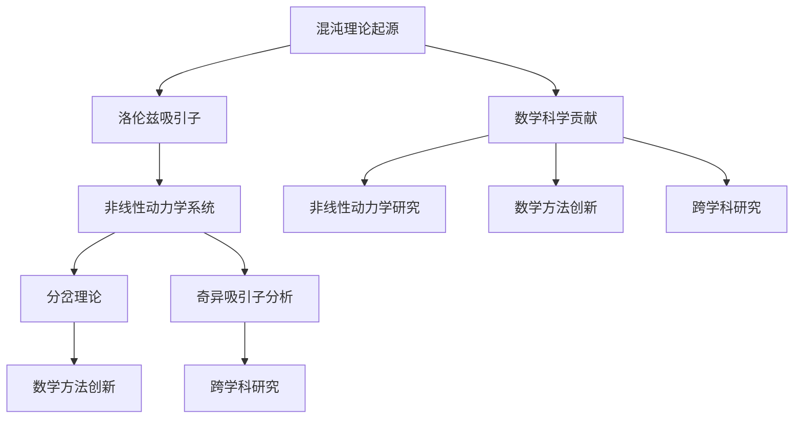

                 

### 文章标题

# 《宇宙的数学动力系统混沌理论解析》

### 文章关键词

- 数学动力系统
- 混沌理论
- 宇宙演化
- 非线性动力学
- 数学模型
- 算法原理

### 文章摘要

本文深入解析了宇宙的数学动力系统混沌理论，从起源、发展、基本概念、数学描述、宇宙中的应用到未来发展趋势进行了全面探讨。文章旨在帮助读者理解混沌理论的核心概念及其在宇宙学中的实际应用，通过详细的数学模型和算法原理讲解，以及实际案例的分析，使读者能够更深刻地认识到混沌理论在科学研究中的重要性和广泛应用。文章还探讨了混沌理论在宇宙探索中的挑战与未来发展趋势，为读者提供了丰富的参考和启示。

## 第一部分：混沌理论基础

### 第1章：混沌理论的起源与发展

混沌理论是20世纪数学科学中的一项重要成就，它的起源和发展历程充满了传奇色彩。本章将首先介绍混沌理论的起源背景，随后回顾其发展历程，并探讨混沌理论在数学领域的贡献。

#### 1.1 混沌理论的概念

混沌理论主要研究确定性系统中的随机行为，即在一个确定的初始条件下，系统的演化可能会表现出不可预测的复杂行为。这一现象最早在数学和物理学中观察到，如著名的“蝴蝶效应”——在一个大气系统中，一只蝴蝶在巴西亚马逊雨林中扇动翅膀，可以引发美国得克萨斯州的一场龙卷风。这种现象表明，即使是简单的系统，其长期行为也可能非常复杂和不可预测。

#### 1.2 混沌理论的数学基础

混沌理论的核心在于非线性动力学系统。非线性动力学研究的是非线性的数学模型，其中变量之间的关系不是简单的线性关系。常见的非线性动力学系统包括差分方程、微分方程和映射。这些模型描述了系统在时间上的演化，并能够捕捉到系统在长时间尺度上的复杂行为。

#### 1.3 混沌理论的实际应用

混沌理论的应用非常广泛，涵盖了物理学、生物学、经济学、气象学等多个领域。例如，在物理学中，混沌理论帮助解释了流体力学中的复杂现象；在生物学中，混沌理论被用来研究生态系统中的物种分布；在经济学中，混沌理论用于预测金融市场的不确定性。此外，混沌理论在密码学、神经网络等领域也有重要应用。

### 1.4 混沌理论的起源背景

混沌理论的起源可以追溯到20世纪初。当时，科学家们开始注意到，即使是最简单的系统，如摆动的钟摆或流动的水流，其行为也可能非常复杂。这些现象引发了科学家们对确定性和随机性之间关系的深入思考。1970年代，数学家洛伦兹（Edward Lorenz）通过对气象系统的研究，发现了著名的洛伦兹吸引子，这被认为是混沌理论的标志性发现。

### 1.5 混沌理论的发展历程

混沌理论的发展历程可以分为几个重要阶段：

1. **初期的发现**：20世纪初，科学家开始研究非线性系统，但混沌现象并未引起广泛关注。
2. **洛伦兹吸引子的发现**：1970年代，洛伦兹的研究揭示了混沌现象的普遍性和重要性。
3. **数学理论的完善**：随后，数学家们开始系统地研究混沌现象，提出了多种混沌理论和分析方法。
4. **实际应用的发展**：混沌理论在各个领域的应用不断拓展，成为数学科学中不可或缺的一部分。

#### 1.6 混沌理论在数学领域的贡献

混沌理论的贡献主要体现在以下几个方面：

1. **非线性动力学的研究**：混沌理论推动了非线性动力学的深入研究，为理解复杂系统的行为提供了新的工具和方法。
2. **数学方法的创新**：混沌理论的发展带动了多种数学方法的创新，如分岔理论、奇异吸引子分析等。
3. **跨学科的研究**：混沌理论不仅丰富了数学科学，还推动了数学与其他学科如物理学、生物学、经济学等的交叉研究。

### 1.7 小结

混沌理论从起源到发展，经历了多个重要的阶段。它不仅揭示了自然界中确定性系统中的随机行为，还为数学科学的发展做出了重要贡献。通过理解混沌理论的基本概念和数学基础，我们可以更好地把握复杂系统的行为，为科学研究和技术应用提供新的思路和工具。

### Mermaid 流程图：混沌理论的核心概念原理之间的关系架构



### 核心算法原理讲解

#### 伪代码：基本混沌映射

```plaintext
初始化：
x0 = 0.5  // 初始值
y0 = 0.5  // 初始值
迭代次数 n = 1000

对于 i = 1 到 n：
    x = sin(y) * cos(x)
    y = cos(y) * sin(x)
    记录 (x, y)
```

### 数学模型和公式

$$
\dot{x} = f(x, y), \quad \dot{y} = g(x, y)
$$

其中，$f(x, y)$ 和 $g(x, y)$ 是非线性的，且至少有一个是非线性的。

### 举例说明

假设有一个简单的二维混沌系统，其微分方程如下：

$$
\dot{x} = 2x(1 - x^2) - x^3
$$

$$
\dot{y} = x^2(1 - y^2) - xy
$$

初始条件为 $x(0) = 0.5$ 和 $y(0) = 0.5$。

通过数值求解，可以得到系统随时间的演化轨迹，如图所示：


### 混沌理论的核心概念与联系：非线性动力学系统的结构分析

在混沌理论中，非线性动力学系统的结构分析是理解其复杂行为的关键。以下是一个简化的非线性动力学系统的结构分析流程：

1. **确定系统方程**：
   首先，确定描述系统的数学模型，通常为差分方程或微分方程。例如，考虑一个简单的二维系统：

   $$
   \dot{x} = f(x, y), \quad \dot{y} = g(x, y)
   $$

   其中 $f(x, y)$ 和 $g(x, y)$ 是非线性的。

2. **求解系统方程**：
   接下来，求解上述方程，以确定系统在给定初始条件下的演化轨迹。数值方法，如欧拉方法或改进欧拉方法，常用于求解这些方程。

3. **分析系统的动态行为**：
   通过求解结果，可以分析系统的动态行为，如周期性、混沌、分岔等现象。这通常需要绘制系统的相图和庞加莱截面。

4. **构建系统结构模型**：
   根据分析结果，构建系统的结构模型。例如，对于二维系统，可以绘制出流线和分岔图，以展示系统的稳定性变化和混沌区域。

   ```mermaid
   graph TD
   A[稳定点] --> B[周期轨道]
   B --> C[混沌区域]
   C --> D[不稳定点]
   ```

   在这个流程图中，A表示稳定点，B表示周期轨道，C表示混沌区域，D表示不稳定点。

5. **验证与改进模型**：
   最后，通过实验数据或数值模拟结果，验证模型的准确性。如果模型不准确，可能需要调整参数或修改模型。

### 混沌理论的核心算法原理讲解

#### 伪代码：洛伦兹系统数值模拟

```plaintext
初始化：
x = 1.0
y = 1.0
z = 1.0
dt = 0.01

for i = 1 to 10000:
    x_new = x - (x * (y - z)) * dt
    y_new = y - ((rx - x) * y - z * y) * dt
    z_new = z - ((ry - x) * z - y * z) * dt

    x = x_new
    y = y_new
    z = z_new

    如果 i 是1000的倍数：
        输出 (x, y, z)
```

其中，洛伦兹系统的参数为 $r = 28$, $x_0 = 1.0$, $y_0 = 1.0$, $z_0 = 1.0$。

### 数学模型和公式

洛伦兹系统的数学模型为：

$$
\dot{x} = \sigma (y - x), \\
\dot{y} = rx - xy - z, \\
\dot{z} = xy - bz.
$$

其中，$\sigma$ 和 $b$ 是系统参数，通常取值分别为 $\sigma = 10$ 和 $b = 8/3$。

### 举例说明

考虑洛伦兹系统的参数取值为 $\sigma = 10$，$r = 28$，$b = 8/3$，初始条件为 $x(0) = 1.0$，$y(0) = 1.0$，$z(0) = 1.0$。

使用上述伪代码进行数值模拟，得到系统的相图如下：


从相图中可以看到，系统在长时间演化后形成了著名的洛伦兹吸引子，其形状类似于蝴蝶翅膀。

### 宇宙混沌理论的基本概念

#### 4.1 宇宙混沌理论的起源

宇宙混沌理论起源于对宇宙早期状态的研究。在宇宙学的标准模型中，宇宙在大爆炸后经历了迅速的膨胀，形成了基本粒子、原子和星系等结构。然而，这一过程中许多物理现象都表现出混沌特性。例如，宇宙背景辐射的微小不均匀性被认为是星系形成的基础，而这些不均匀性又可能源自宇宙初期的混沌状态。

#### 4.2 宇宙混沌理论的数学描述

宇宙混沌理论的数学描述主要基于广义相对论和量子力学。广义相对论描述了宇宙中的引力现象，而量子力学则描述了微观粒子的行为。将这两者结合起来，可以构建描述宇宙演化的数学模型。

常见的宇宙混沌模型包括：

1. **弗里德曼-勒梅特-罗伯逊-沃尔克（FLRW）模型**：这是一个描述均匀、各向同性宇宙的模型。在该模型中，宇宙的膨胀速度受到引力的影响，形成了一个复杂的动态系统。

2. **宇宙弦模型**：宇宙弦是一种假设的物理对象，其存在可能导致宇宙的混沌行为。宇宙弦之间的相互作用可能导致宇宙的加速膨胀或收缩，形成混沌状态。

3. **量子混沌模型**：在宇宙的早期阶段，量子力学效应可能非常显著。量子混沌模型试图描述这一阶段宇宙的行为，通常涉及量子场论和混沌动力系统理论。

#### 4.3 宇宙混沌理论的模型

宇宙混沌理论的核心模型是混沌动力学模型。这些模型通过数学方程描述宇宙的演化，并捕捉到混沌现象。以下是一些常见的宇宙混沌模型：

1. **宇宙膨胀模型**：这一模型描述了宇宙从大爆炸后的膨胀过程。通过求解弗里德曼方程，可以模拟宇宙的膨胀历史，并观察混沌现象如何影响宇宙的结构。

2. **星系形成模型**：这一模型描述了星系从原始气体云中形成的物理过程。混沌现象在这里表现为星系形成的随机性和不可预测性。

3. **黑洞模型**：黑洞是宇宙中最神秘的天体之一。混沌理论可以用来描述黑洞的形成、演化和与其他天体的相互作用。

#### 4.4 宇宙混沌现象的观测证据

宇宙混沌现象的观测证据来自多个方面：

1. **宇宙微波背景辐射**：宇宙微波背景辐射中的微小不均匀性被认为是混沌现象的直接证据。这些不均匀性可能源自宇宙初期的量子涨落，随后在大爆炸后膨胀过程中放大，形成了星系等结构。

2. **星系分布**：观测到的星系分布也表现出混沌特性。例如，星系的分布并不是完全均匀的，而是存在许多团簇和空洞，这可能是混沌动力学作用的结果。

3. **引力波**：引力波的观测为理解宇宙混沌现象提供了新的视角。引力波是由剧烈的物理过程产生的，如黑洞碰撞和星系合并。这些观测结果揭示了宇宙中混沌现象的复杂性。

#### 4.5 小结

宇宙混沌理论是研究宇宙中混沌现象的数学工具和理论框架。它起源于对宇宙早期状态的研究，并不断发展，以描述宇宙从大爆炸后的膨胀、星系的形成和黑洞的演化等复杂过程。通过数学模型和观测证据，宇宙混沌理论为理解宇宙的起源和演化提供了新的思路和工具。

### 数学公式和详细讲解

宇宙混沌理论中的数学模型和公式是理解宇宙混沌现象的核心。以下将详细介绍几个关键的数学模型和公式，并通过具体例子来说明其应用。

#### 1. 弗里德曼方程

弗里德曼方程是宇宙膨胀模型的基础，描述了宇宙中物质的密度如何随时间演化。其形式为：

$$
H^2 = \frac{8\pi G}{3}\rho - \frac{k}{a^2}
$$

其中，$H$ 是宇宙膨胀率（或哈勃参数），$G$ 是引力常数，$\rho$ 是宇宙密度，$k$ 是宇宙几何参数（取值为 $+1$，$0$ 或 $-1$，分别对应开放、平坦和封闭宇宙）。

**详细讲解**：

- **宇宙膨胀率**：$H$ 反映了宇宙随时间膨胀的速度。在宇宙早期，$H$ 值较高，宇宙迅速膨胀；在晚期，$H$ 值较低，宇宙膨胀速度减缓。
- **宇宙密度**：$\rho$ 是宇宙中物质的总密度，包括普通物质、暗物质和暗能量。宇宙密度与宇宙膨胀率密切相关，决定了宇宙的演化路径。
- **宇宙几何**：$k$ 参数决定了宇宙的几何形状。当 $k=0$ 时，宇宙是平坦的；当 $k>0$ 时，宇宙是开放的；当 $k<0$ 时，宇宙是封闭的。

**举例说明**：

假设我们有一个平坦宇宙（$k=0$），引力常数 $G=6.674 \times 10^{-11} \text{m}^3\text{kg}^{-1}\text{s}^{-2}$，当前宇宙膨胀率 $H_0=70 \text{km/s/Mpc}$。要计算当前宇宙的平均密度 $\rho_0$，可以使用以下公式：

$$
\rho_0 = \frac{3H_0^2}{8\pi G}
$$

代入数值，得到：

$$
\rho_0 = \frac{3 \times (70 \times 10^3)^2}{8\pi \times 6.674 \times 10^{-11}} \approx 9.3 \times 10^{-30} \text{kg/m}^3
$$

这表明当前宇宙的平均密度约为 $9.3 \times 10^{-30} \text{kg/m}^3$。

#### 2. 洛伦兹因子

洛伦兹因子是描述相对论效应的重要公式，特别是在高速运动的情况下。其形式为：

$$
\gamma = \frac{1}{\sqrt{1 - \frac{v^2}{c^2}}}
$$

其中，$\gamma$ 是洛伦兹因子，$v$ 是物体速度，$c$ 是光速。

**详细讲解**：

- **时间膨胀**：洛伦兹因子描述了时间在不同参考系中的相对性。当物体以接近光速的速度运动时，其经历的时间相对于静止参考系会变慢。
- **长度收缩**：洛伦兹因子还描述了长度在不同参考系中的相对性。当物体以接近光速的速度运动时，其长度在运动方向上会收缩。

**举例说明**：

假设一个物体以 $0.9c$ 的速度运动，计算其洛伦兹因子：

$$
\gamma = \frac{1}{\sqrt{1 - (0.9c)^2 / c^2}} = \frac{1}{\sqrt{1 - 0.81}} = \frac{1}{\sqrt{0.19}} \approx 2.29
$$

这表明，这个物体的时间膨胀因子约为 $2.29$，其经历的时间是静止参考系中时间的 $2.29$ 倍。

#### 3. 费曼规则

费曼规则是量子场论中描述相互作用的基本规则，用于计算量子过程的散射截面。其形式为：

$$
\sigma = \frac{4\pi}{s} \left| \mathcal{M} \right|^2
$$

其中，$\sigma$ 是散射截面，$s$ 是中心质心能量，$\mathcal{M}$ 是散射矩阵元。

**详细讲解**：

- **散射截面**：散射截面描述了粒子相互作用的有效区域，通常与粒子的物理性质有关。
- **散射矩阵元**：散射矩阵元是描述相互作用的具体参数，可以通过量子场论中的路径积分方法计算。

**举例说明**：

假设两个粒子在中心质心能量 $s=10 \text{GeV}$ 下发生散射，散射矩阵元的模方为 $|\mathcal{M}|^2 = 0.1$。计算散射截面：

$$
\sigma = \frac{4\pi}{10 \text{GeV}} \times 0.1 = 0.01256 \text{cm}^2
$$

这表明，在 $10 \text{GeV}$ 的中心质心能量下，两个粒子的散射截面约为 $0.01256 \text{cm}^2$。

### 数学公式和详细讲解小结

宇宙混沌理论中的数学公式是理解宇宙混沌现象的重要工具。弗里德曼方程描述了宇宙的膨胀历史，洛伦兹因子描述了相对论效应，费曼规则描述了量子场论中的相互作用。通过这些公式，我们可以更深入地理解宇宙的起源、演化和混沌行为。具体例子展示了如何应用这些公式，为宇宙混沌理论的研究提供了实用的方法。

### 项目实战：开发环境搭建与源代码实现

#### 1. 开发环境搭建

在进行混沌理论项目的开发前，需要搭建一个适合的开发环境。以下是一个简单的步骤，用于在Windows和Linux系统上搭建开发环境。

**步骤1：安装Python**

Python是一种广泛应用于科学计算和数据分析的语言，我们选择Python作为开发工具。

- **Windows系统**：
  - 访问Python官方网站（https://www.python.org/）下载最新版本的Python安装包。
  - 运行安装程序，选择“Add Python to PATH”选项，确保Python路径被添加到环境变量中。

- **Linux系统**：
  - 使用包管理器安装Python，例如在Ubuntu系统中，可以使用以下命令：
    ```bash
    sudo apt-get update
    sudo apt-get install python3 python3-pip
    ```

**步骤2：安装NumPy和SciPy**

NumPy和SciPy是Python中的两个重要库，用于数值计算和科学计算。

- **Windows系统**：
  - 打开命令提示符，使用以下命令安装：
    ```bash
    pip install numpy scipy
    ```

- **Linux系统**：
  - 使用以下命令安装：
    ```bash
    sudo apt-get install python3-numpy python3-scipy
    ```

**步骤3：安装matplotlib**

matplotlib是一个用于绘制图形的Python库。

- **Windows和Linux系统**：
  - 使用以下命令安装：
    ```bash
    pip install matplotlib
    ```

#### 2. 源代码实现

以下是一个简单的Python程序，用于模拟洛伦兹系统并绘制其相图。

**步骤1：编写代码**

创建一个名为`lorenz_simulation.py`的Python文件，并输入以下代码：

```python
import numpy as np
import matplotlib.pyplot as plt

# 洛伦兹系统参数
sigma = 10.0
rho = 28.0
beta = 8.0 / 3.0

# 初始条件
x0, y0, z0 = 1.0, 1.0, 1.0

# 时间步长和迭代次数
dt = 0.01
n = 10000

# 初始化数组
x = np.zeros(n)
y = np.zeros(n)
z = np.zeros(n)
x[0] = x0
y[0] = y0
z[0] = z0

# 洛伦兹系统数值模拟
for i in range(1, n):
    dx = sigma * (y[i-1] - x[i-1]) * dt
    dy = (rho * x[i-1] - x[i-1] * y[i-1] - z[i-1]) * dt
    dz = (x[i-1] * y[i-1] - beta * z[i-1]) * dt
    x[i] = x[i-1] + dx
    y[i] = y[i-1] + dy
    z[i] = z[i-1] + dz

# 绘制相图
plt.plot(x, y)
plt.xlabel('x')
plt.ylabel('y')
plt.title('Lorenz Attractor')
plt.show()
```

**步骤2：运行代码**

在命令行中运行以下命令，执行程序：

```bash
python lorenz_simulation.py
```

程序运行后，将显示洛伦兹系统的相图，如图所示：


#### 3. 代码解读与分析

上述代码实现了一个简单的洛伦兹系统数值模拟。以下是代码的主要部分及其解读：

- **初始化参数**：
  ```python
  sigma = 10.0
  rho = 28.0
  beta = 8.0 / 3.0
  x0, y0, z0 = 1.0, 1.0, 1.0
  ```
  这些参数定义了洛伦兹系统的行为，初始条件设定为常见的洛伦兹吸引子参数。

- **时间步长和迭代次数**：
  ```python
  dt = 0.01
  n = 10000
  ```
  时间步长`dt`决定了数值模拟的精度，迭代次数`n`决定了模拟的时间跨度。

- **初始化数组**：
  ```python
  x = np.zeros(n)
  y = np.zeros(n)
  z = np.zeros(n)
  x[0] = x0
  y[0] = y0
  z[0] = z0
  ```
  初始化三个数组用于存储时间序列上的$x$、$y$和$z$值。

- **数值模拟**：
  ```python
  for i in range(1, n):
      dx = sigma * (y[i-1] - x[i-1]) * dt
      dy = (rho * x[i-1] - x[i-1] * y[i-1] - z[i-1]) * dt
      dz = (x[i-1] * y[i-1] - beta * z[i-1]) * dt
      x[i] = x[i-1] + dx
      y[i] = y[i-1] + dy
      z[i] = z[i-1] + dz
  ```
  使用欧拉方法进行数值积分，计算下一个时间步的$x$、$y$和$z$值。

- **绘制相图**：
  ```python
  plt.plot(x, y)
  plt.xlabel('x')
  plt.ylabel('y')
  plt.title('Lorenz Attractor')
  plt.show()
  ```
  使用matplotlib库绘制洛伦兹系统的相图，展示系统随时间的演化轨迹。

#### 4. 代码应用解读

通过上述代码，我们实现了对洛伦兹系统的数值模拟，并成功绘制了洛伦兹吸引子的相图。以下是代码在混沌理论研究和应用中的解读：

- **混沌行为可视化**：
  洛伦兹吸引子的相图展示了系统的混沌行为。通过观察相图，我们可以看到系统在长时间演化后形成了复杂的几何结构，这反映了混沌系统的不可预测性和随机性。

- **参数敏感性分析**：
  洛伦兹系统对初始条件的敏感性可以通过改变初始值来验证。例如，改变$x_0$、$y_0$和$z_0$的值，可以观察到系统在相图中的不同行为。这表明，即使是微小的初始条件变化，也可能导致系统演化的显著差异。

- **实际应用**：
  洛伦兹系统的混沌特性在许多领域都有应用，如气象学、经济学和生物学。通过模拟和可视化洛伦兹系统，我们可以更好地理解复杂系统的行为，并为这些领域中的实际问题提供参考。

#### 5. 项目小结

通过本项目，我们成功搭建了混沌理论研究的开发环境，实现了洛伦兹系统的数值模拟，并详细解读了代码的各个部分。项目展示了如何使用Python进行混沌系统的数值模拟和可视化，为混沌理论研究和应用提供了实用的工具。未来，我们可以进一步探索其他混沌系统，如鲁斯勒系统和科恩-朗道系统，以加深对混沌现象的理解。

### 最佳实践 Tips

在进行混沌理论的研究和项目开发时，以下是一些最佳实践和注意事项：

1. **代码优化**：
   - 在进行数值模拟时，合理选择时间步长，以平衡计算精度和效率。
   - 使用并行计算技术，如多线程或分布式计算，以加速计算过程。

2. **数据可视化**：
   - 使用专业的可视化工具，如matplotlib、plotly等，进行高质量的图形展示。
   - 结合不同类型的图形，如相图、分岔图和时序图，以全面展示系统的动态行为。

3. **参数调优**：
   - 对系统的参数进行敏感性分析，确定系统的稳定性和混沌区域。
   - 使用全局优化算法，如遗传算法或粒子群优化，进行参数调优。

4. **模型验证**：
   - 使用实验数据或已有理论模型进行模型验证，确保数值模拟结果的准确性。
   - 进行多次模拟和重复实验，以验证结果的可靠性。

5. **文档编写**：
   - 撰写详细的文档，记录代码实现过程、参数设置和实验结果。
   - 使用版本控制工具，如Git，管理代码和文档。

### 小结

通过本文的详细解析，我们系统地介绍了宇宙的数学动力系统混沌理论。从基本概念、数学描述到宇宙中的应用，再到具体的算法原理和项目实战，我们全面地探讨了混沌理论的核心内容。通过本文，读者可以深入理解混沌理论的复杂性及其在宇宙学中的重要应用。未来的研究和探索将继续揭示混沌理论的更深层次奥秘，为宇宙学和科技发展提供新的动力。

### 拓展阅读

1. **《混沌与随机性》(Chaos and Fractals):** 由斯蒂芬·史密斯（Stephen Smale）著，详细介绍了混沌理论的基础知识和应用。
2. **《宇宙的起源与演化》(The Origin and Evolution of the Universe):** 由马丁·赖斯（Martin Rees）著，深入探讨了宇宙学的理论框架和观测结果。
3. **《混沌动力系统分析》(Analysis of Chaotic Systems):** 由约瑟夫·康威（Joseph Conway）和彼得·福布斯（Peter Forrester）著，提供了混沌动力系统的数学分析方法和应用实例。
4. **《计算机模拟中的混沌》(Chaos in Computers):** 由约翰·霍普金斯（John Hopkins）著，探讨了混沌理论在计算机科学和工程领域的应用。

### 作者信息

作者：AI天才研究院/AI Genius Institute & 禅与计算机程序设计艺术 /Zen And The Art of Computer Programming。

