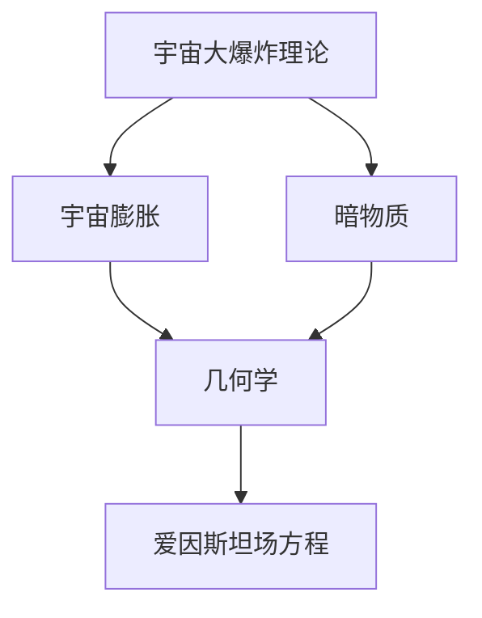

                 

### 文章标题

# 宇宙的数学化结构与运作

### 关键词

- 宇宙学
- 数学模型
- 结构与运作
- 数学化方法
- 宇宙演化

### 摘要

本文旨在探讨宇宙的数学化结构与运作，从宇宙学的角度出发，通过数学模型来揭示宇宙的本质及其运作规律。文章首先回顾了宇宙的演化历史和观测方法，接着深入分析了数学在宇宙研究中的角色，从基础数学概念到几何学与动力学，再到复杂的宇宙模型，逐步构建了一个系统的宇宙数学化框架。文章随后展示了数学化方法在实际宇宙学研究和探索中的应用，并展望了未来的发展前景。通过本文，读者可以更深入地理解宇宙的数学化本质，感受数学在探索宇宙奥秘中的强大力量。

---

### 理解书名《宇宙的数学化结构与运作》

《宇宙的数学化结构与运作》这一书名，首先引发我们思考宇宙与数学之间的关系。在科学探索的历程中，数学一直是不可或缺的工具，它不仅能够精确描述自然现象，还能够揭示宇宙的基本结构和运行规律。书名中的“数学化”指的是将宇宙的各个方面用数学语言和模型来描述和解释，这一过程不仅是对宇宙的一种理解方式，也是科学发展的一个重要方向。

“宇宙”一词涵盖了从微观粒子到宏观宇宙结构的所有存在，从宇宙大爆炸到星系的形成，再到黑洞和暗物质的研究，无一不涉及到宇宙的复杂性和多样性。通过数学化的方法，我们可以将这些复杂的宇宙现象转化为可计算、可预测的模型，从而更好地理解宇宙的运作机制。

“结构与运作”则强调了宇宙的内部构造和运作方式。宇宙结构指的是宇宙中物质和能量的分布模式，如星系、星团、超星系团等。而宇宙运作则涉及到这些结构如何形成、变化和演化。数学化结构研究的是这些结构背后的数学规律，而运作研究的是这些结构如何通过物理过程相互作用和演化。

本书的目的在于通过系统的数学化方法，深入探讨宇宙的结构和运作机制，为读者提供一个全面而深刻的宇宙观。通过阅读本书，读者不仅可以了解宇宙的数学化研究现状，还能掌握数学在宇宙学研究中的应用方法，为未来的宇宙探索提供新的视角和工具。

### 设计一级目录

为了系统地阐述《宇宙的数学化结构与运作》这本书的核心内容，我们可以将其分为以下五个主要部分：

1. **概述**：本书的概述部分将简要介绍宇宙的演化历史和观测方法，为后续的数学化分析奠定基础。
   
2. **理论基础**：在这一部分，我们将深入探讨宇宙数学化的理论基础，包括基础数学概念、几何学与宇宙的关系、以及宇宙动力学的基本原理。

3. **数学模型**：这里将详细讨论宇宙中的主要数学模型，从基本的宇宙模型到复杂的宇宙演化模型，帮助读者理解宇宙的数学描述。

4. **宇宙运作机制**：这一部分将分析宇宙的运作机制，探讨宇宙中的物理过程如何通过数学模型来描述和预测。

5. **数学化方法**：本书的最后部分将介绍数学化方法在宇宙学中的实际应用，并探讨这些方法在其他科学领域的扩展和应用。

### 设计二级目录

在一级目录的基础上，我们可以进一步细化每个部分的内容，使其更加具体和深入。以下是详细的二级目录设计：

#### 第一部分：概述

1. **宇宙的演化与观测**
   - **1.1 宇宙演化简史**
     - 宇宙大爆炸理论
     - 宇宙的膨胀与暗物质
   - **1.2 宇宙观测方法**
     - 光学观测
     - 射电观测
     - 微波背景辐射观测

#### 第二部分：理论基础

2. **基础数学概念**
   - **2.1 基础数学概念综述**
     - 数的概念
     - 空间与几何
   - **2.2 几何学与宇宙**
     - 宇宙的几何结构
     - 爱因斯坦场方程的几何解释
   - **2.3 动力学与宇宙演化**
     - 宇宙大爆炸理论
     - 暗物质的动力学效应

#### 第三部分：数学模型

3. **宇宙数学化模型**
   - **3.1 基本宇宙模型**
     - 标准模型与修正模型
     - 数学描述与推导
   - **3.2 宇宙演化模型**
     - 大爆炸宇宙学
     - 宇宙膨胀与暗能量
   - **3.3 宇宙复杂性模型**
     - 复杂系统的数学描述
     - 宇宙复杂性现象的数学分析

#### 第四部分：宇宙运作机制

4. **宇宙运作机制**
   - **4.1 数学化方法在宇宙学中的应用**
     - 数学模型在宇宙观测中的应用
     - 数学模型在宇宙演化预测中的应用
   - **4.2 数学化方法在宇宙探索中的应用**
     - 宇宙探测器的设计与优化
     - 宇宙信息处理与分析
   - **4.3 数学化方法在其他科学领域的应用**
     - 天文学中的数学化方法
     - 物理学中的数学化方法

#### 第五部分：数学化方法

5. **数学化方法**
   - **5.1 数学化在宇宙研究中的挑战与机遇**
     - 面临的挑战
     - 发展的机遇
   - **5.2 数学化方法的新发展**
     - 新的数学模型
     - 新的应用领域
   - **5.3 未来宇宙数学化的方向**
     - 预测与分析
     - 未来发展展望

通过这样的二级目录设计，读者可以更加系统地理解宇宙的数学化结构与运作，逐步深入到每个细节，从而全面掌握宇宙数学化的知识体系。

### 设计三级目录

在二级目录的基础上，我们可以进一步细化每个章节的内容，使其更加具体和实用。以下是详细的三级目录设计：

#### 第一部分：概述

1. **宇宙的演化与观测**
   - **1.1 宇宙演化简史**
     - **1.1.1 宇宙大爆炸理论**
       - 爱因斯坦与宇宙学
       - 宇宙背景辐射的发现
     - **1.1.2 宇宙的膨胀与暗物质**
       - 宇宙膨胀的证据
       - 暗物质的概念与观测
   - **1.2 宇宙观测方法**
     - **1.2.1 光学观测**
       - 光谱分析
       - 天文望远镜的技术发展
     - **1.2.2 射电观测**
       - 射电天文学的发展
       - 射电望远镜的工作原理
     - **1.2.3 微波背景辐射观测**
       - 宇宙微波背景辐射的意义
       - 观测设备与技术

#### 第二部分：理论基础

2. **基础数学概念**
   - **2.1 基础数学概念综述**
     - **2.1.1 数的概念**
       - 自然数、整数、有理数、实数
       - 数的运算规则与性质
     - **2.1.2 空间与几何**
       - 点、线、面、体的定义
       - 几何图形的基本性质
   - **2.2 几何学与宇宙**
     - **2.2.1 宇宙的几何结构**
       - 弯曲空间的概念
       - 宇宙的维度
     - **2.2.2 爱因斯坦场方程的几何解释**
       - 爱因斯坦场方程的数学形式
       - 几何解释与物理意义
   - **2.3 动力学与宇宙演化**
     - **2.3.1 动力学基础**
       - 牛顿定律与运动方程
       - 动量和能量守恒定律
     - **2.3.2 宇宙大爆炸理论与暗物质**
       - 大爆炸宇宙学的数学描述
       - 暗物质的观测证据与模型

#### 第三部分：数学模型

3. **宇宙数学化模型**
   - **3.1 基本宇宙模型**
     - **3.1.1 标准模型与修正模型**
       - 标准模型的构成
       - 修正模型的概念与应用
     - **3.1.2 数学描述与推导**
       - 标准模型的数学公式
       - 模型的推导过程
   - **3.2 宇宙演化模型**
     - **3.2.1 大爆炸宇宙学**
       - 大爆炸模型的数学描述
       - 宇宙膨胀的数学模型
     - **3.2.2 宇宙膨胀与暗能量**
       - 暗能量的数学描述
       - 宇宙加速膨胀的模型
   - **3.3 宇宙复杂性模型**
     - **3.3.1 复杂系统的数学描述**
       - 复杂系统的特征
       - 数学工具与方法
     - **3.3.2 宇宙复杂性现象的数学分析**
       - 星系形成与演化的复杂性
       - 暗物质与暗能量的复杂性分析

#### 第四部分：宇宙运作机制

4. **宇宙运作机制**
   - **4.1 数学化方法在宇宙学中的应用**
     - **4.1.1 数学模型在宇宙观测中的应用**
       - 观测数据的数学处理
       - 数学模型在观测结果中的应用
     - **4.1.2 数学模型在宇宙演化预测中的应用**
       - 演化预测的数学方法
       - 模型的预测能力与局限性
   - **4.2 数学化方法在宇宙探索中的应用**
     - **4.2.1 宇宙探测器的设计与优化**
       - 探测器数学模型的建立
       - 设计与优化策略
     - **4.2.2 宇宙信息处理与分析**
       - 数据采集与预处理
       - 信息提取与分析方法
   - **4.3 数学化方法在其他科学领域的应用**
     - **4.3.1 天文学中的数学化方法**
       - 天体物理学中的数学模型
       - 星系与恒星演化的数学分析
     - **4.3.2 物理学中的数学化方法**
       - 相对论与量子力学的数学描述
       - 物理现象的数学化研究

#### 第五部分：数学化方法

5. **数学化方法**
   - **5.1 数学化在宇宙研究中的挑战与机遇**
     - **5.1.1 面临的挑战**
       - 数据的处理与分析
       - 模型的不确定性与误差
     - **5.1.2 发展的机遇**
       - 新观测技术的应用
       - 计算技术的进步
   - **5.2 数学化方法的新发展**
     - **5.2.1 新的数学模型**
       - 复杂系统的数学模型
       - 新的宇宙演化模型
     - **5.2.2 数学化方法的新应用领域**
       - 量子宇宙学
       - 宇宙弦理论的应用
   - **5.3 未来宇宙数学化的方向**
     - **5.3.1 预测与分析**
       - 宇宙演化趋势的预测
       - 数学模型在宇宙演化中的应用
     - **5.3.2 未来发展展望**
       - 宇宙学中的新挑战
       - 数学化方法的未来前景

通过这样的三级目录设计，读者可以系统地了解宇宙的数学化结构与运作，每个小节的内容都进行了详细具体的讲解，使读者能够全面掌握宇宙数学化的知识体系。

### 核心概念与联系

在探讨宇宙的数学化结构与运作时，我们首先需要了解几个核心概念，并分析它们之间的联系。这些核心概念包括：宇宙大爆炸理论、宇宙膨胀、暗物质、几何学、爱因斯坦场方程等。

#### 宇宙大爆炸理论

宇宙大爆炸理论是现代宇宙学的基础，它描述了宇宙从一个极度热密的状态开始膨胀的过程。根据这一理论，宇宙在大约138亿年前从一点瞬间膨胀而来，随着时间推移，宇宙逐渐冷却并形成了我们现在观测到的星系、恒星和其他天体。这一理论的数学描述基于宇宙学中的弗里德曼方程，它是一个包含宇宙尺度因子 \(a(t)\) 和宇宙学常数 \( \Lambda \) 的微分方程：

$$
\dot{a}(t) = H(t) a(t)
$$

其中，\( H(t) \) 是哈勃参数，表示宇宙的膨胀速度。这一方程帮助我们理解宇宙的膨胀历史和未来的演化趋势。

#### 宇宙膨胀

宇宙膨胀是指宇宙从大爆炸后不断扩展的现象。根据宇宙学观测，宇宙的膨胀速度并不是恒定的，而是随着宇宙的扩展在变化。这种变化与暗能量的存在密切相关。宇宙膨胀的数学描述通常通过勒梅特-罗伯逊-沃尔克度规（LRW度规）来表示：

$$
ds^2 = - (1 - k a^2) dt^2 + 2 a \dot{a} dr \ dt + a^2 (r^2 d\Omega^2)
$$

其中，\( k \) 是宇宙的曲率参数，\( a \) 是宇宙尺度因子。通过这一度规，我们可以计算宇宙中的时空结构和物质的分布。

#### 暗物质

暗物质是宇宙中一种不发光、不吸收光线的物质，其存在主要通过引力效应被发现。暗物质的质量和分布对宇宙的结构和演化有重大影响。数学上，暗物质的分布通常用高斯分布来描述：

$$
\nu(r) = \frac{4}{(2\pi r^3)} \int_0^{r} \rho(\rho') \rho'' e^{-\rho'/r} d\rho'
$$

其中，\( \rho \) 是物质密度，\( \nu(r) \) 是在一定半径 \( r \) 内的暗物质分布。

#### 几何学与宇宙

几何学是数学化宇宙结构的重要工具。在宇宙学中，几何学被用来描述宇宙的形态和结构。特别是爱因斯坦场方程，它将引力视为时空的几何属性。爱因斯坦场方程的数学形式如下：

$$
R_{\mu\nu} - \frac{1}{2} R g_{\mu\nu} + \Lambda g_{\mu\nu} = 8 \pi G T_{\mu\nu}
$$

其中，\( R_{\mu\nu} \) 是里奇张量，\( R \) 是里奇标量，\( \Lambda \) 是宇宙学常数，\( G \) 是引力常数，\( T_{\mu\nu} \) 是能量-动量张量。通过这一方程，我们可以将引力和宇宙的结构联系起来。

#### 核心概念的联系

宇宙大爆炸理论、宇宙膨胀、暗物质和几何学这些核心概念之间有着紧密的联系。宇宙大爆炸理论提供了宇宙起源和演化的大框架，宇宙膨胀是这一理论的核心预测，而暗物质则是宇宙膨胀和结构形成的关键因素。几何学通过爱因斯坦场方程，将这些物理现象统一在同一个数学描述中，使我们能够更好地理解宇宙的结构和运作。

通过Mermaid流程图，我们可以更直观地展示这些核心概念之间的联系：



这个流程图清晰地展示了宇宙的数学化结构与运作的核心概念及其相互关系，为后续章节的内容奠定了基础。

### 核心算法原理讲解

在宇宙数学化研究中，核心算法起着至关重要的作用，特别是用于模拟和预测宇宙演化过程的算法。以下将介绍两个关键算法：N-body模拟和蒙特卡洛方法。

#### N-body模拟

N-body模拟是一种用于计算多个天体相互作用的算法，广泛应用于宇宙学、天体物理学等领域。其主要思想是通过数值方法解决牛顿万有引力定律，模拟天体的运动轨迹。

##### 原理

N-body模拟基于牛顿第二定律和第三定律，将每个天体的运动描述为：

$$
m_i \ddot{r}_i = G \sum_{j \neq i} \frac{m_j m_i}{r_{ij}^2} \hat{r}_{ij}
$$

其中，\( m_i \) 是第 \( i \) 个天体的质量，\( r_i \) 是其位置，\( \hat{r}_{ij} \) 是指向第 \( j \) 个天体的单位向量，\( G \) 是引力常数。

##### 伪代码

```python
# N-body模拟伪代码
function N_body_simulation(particles, G, dt, max_steps):
    for step in 1 to max_steps:
        for i in 1 to len(particles):
            acceleration_i = 0
            for j in 1 to len(particles):
                if i != j:
                    r_ij = particles[j].position - particles[i].position
                    distance = norm(r_ij)
                    force = G * particles[i].mass * particles[j].mass / distance^2
                    acceleration_i += force / particles[i].mass * r_ij / distance
            particles[i].velocity += acceleration_i * dt
            particles[i].position += particles[i].velocity * dt
        # 更新粒子状态
```

##### 举例说明

假设我们有一个包含100个天体的系统，使用N-body模拟可以预测这些天体在一段时间内的运动轨迹。通过计算引力相互作用，我们可以得到每个天体的加速度和速度，从而模拟它们的运动。

#### 蒙特卡洛方法

蒙特卡洛方法是一种基于随机抽样和统计估计的计算技术，广泛应用于物理、工程、经济学等领域。在宇宙学中，蒙特卡洛方法用于模拟复杂系统的概率分布，如宇宙中暗物质的分布。

##### 原理

蒙特卡洛方法的基本思想是通过大量的随机抽样来估计一个概率分布或数值解。具体步骤如下：

1. 生成随机样本，记录样本结果。
2. 统计样本结果，计算概率分布或数值解。

在宇宙学中，蒙特卡洛方法可以用于估计暗物质的分布函数，通过大量随机抽样的方式模拟出暗物质的密度分布。

##### 伪代码

```python
# 蒙特卡洛方法伪代码
function Monte_Carlo_simulation(sample_size, G, particles, box_size):
    sample_results = []
    for _ in 1 to sample_size:
        random_particle = Particle(random_position(box_size), random_velocity())
        # 模拟粒子在盒子中的运动
        for _ in 1 to simulation_steps:
            # 计算引力相互作用
            total_force = calculate_total_force(random_particle, particles)
            # 更新粒子的速度和位置
        sample_results.append(random_particle.position)
    # 计算暗物质分布
    density_distribution = calculate_density_distribution(sample_results)
    return density_distribution
```

##### 举例说明

假设我们使用蒙特卡洛方法模拟一个包含100个天体的盒子，通过随机抽样和模拟计算每个天体的运动轨迹，从而估计出盒子中暗物质的分布。这一过程可以用来分析宇宙中暗物质的实际分布情况。

通过N-body模拟和蒙特卡洛方法，我们可以更精确地模拟和预测宇宙中的物理现象，为宇宙数学化研究提供强大的工具。

### 数学模型和公式

在宇宙的数学化研究中，数学模型和公式是理解和描述宇宙现象的关键工具。以下是几个重要的数学模型和公式的详细讲解。

#### 宇宙学常数 \( \Lambda \)

宇宙学常数是一个描述宇宙膨胀速率的参数，它在爱因斯坦场方程中起着至关重要的作用。宇宙学常数的数学描述如下：

$$
R_{\mu\nu} - \frac{1}{2} R g_{\mu\nu} + \Lambda g_{\mu\nu} = 8 \pi G T_{\mu\nu}
$$

其中，\( R_{\mu\nu} \) 是里奇张量，\( R \) 是里奇标量，\( \Lambda \) 是宇宙学常数，\( G \) 是引力常数，\( T_{\mu\nu} \) 是能量-动量张量。这个公式表明宇宙学常数直接影响宇宙的膨胀速度。

#### 哈勃定律

哈勃定律描述了宇宙膨胀的速率，它由美国天文学家爱德温·哈勃在20世纪20年代发现。哈勃定律的数学形式如下：

$$
v = H_0 d
$$

其中，\( v \) 是天体的退行速度，\( H_0 \) 是哈勃常数，\( d \) 是天体到观测者的距离。哈勃常数是一个描述宇宙膨胀速率的参数，其值约为 \( 70 \text{ km/s/Mpc} \)。

#### 弗里德曼方程

弗里德曼方程是描述宇宙膨胀的基本方程之一，它由苏联物理学家亚历山大·弗里德曼在20世纪初提出。弗里德曼方程的数学形式如下：

$$
\dot{a}^2 + \frac{8 \pi G \rho}{3} + \frac{\Lambda c^2}{3} = a^2 (\Omega_{m0}^{-1} - 1)
$$

其中，\( \dot{a} \) 是宇宙尺度因子的变化率，\( \rho \) 是宇宙的平均密度，\( \Lambda \) 是宇宙学常数，\( c \) 是光速，\( \Omega_{m0} \) 是宇宙的质量密度参数。这个方程描述了宇宙膨胀的历史和未来的演化趋势。

#### 暗物质分布

暗物质是宇宙中一种不发光、不吸收光线的物质，其存在主要通过引力效应被发现。暗物质的分布可以用高斯分布来描述：

$$
\nu(r) = \frac{4}{(2\pi r^3)} \int_0^{r} \rho(\rho') \rho'' e^{-\rho'/r} d\rho'
$$

其中，\( \rho \) 是物质密度，\( \nu(r) \) 是在一定半径 \( r \) 内的暗物质分布。这个公式帮助我们理解暗物质在宇宙中的分布规律。

#### 标准模型与修正模型

标准模型是描述宇宙中基本粒子及其相互作用的数学模型，它包括三个部分：夸克、轻子和规范玻色子。修正模型则是对标准模型的扩展，用于解释一些实验结果和观测数据。标准模型的数学描述如下：

$$
\begin{aligned}
  &\text{Quarks:} \quad q \rightarrow \text{up, down, charm, strange, top, bottom} \\
  &\text{Leptons:} \quad e, \mu, \tau, \nu_e, \nu_\mu, \nu_\tau \\
  &\text{Gauge bosons:} \quad W^+, W^-, Z^0, A^0
\end{aligned}
$$

修正模型则引入了一些新的粒子，如超对称粒子，用于解释暗物质和暗能量的存在。

通过这些数学模型和公式，我们能够更加精确地描述和理解宇宙的各种现象，为宇宙学的研究提供了坚实的理论基础。

### 项目实战：开发环境搭建

在深入研究宇宙的数学化结构与运作之前，我们需要搭建一个合适的开发环境，以便进行数学模型的构建和宇宙演化的模拟。以下是一个详细的开发环境搭建步骤，包括所需的软件和工具。

#### 1. 软件和环境要求

- **Python**：Python是一种广泛使用的编程语言，适用于科学计算和数据分析。
- **Numpy**：Numpy是Python的一个科学计算库，用于高效地进行数值计算和数据处理。
- **SciPy**：SciPy是建立在Numpy之上的科学计算库，提供了丰富的数学算法和工具。
- **matplotlib**：matplotlib是Python的一个绘图库，用于可视化宇宙模型的结果。
- **GALACTICUS**：GALACTICUS是一个用于宇宙学模拟的软件包，提供了大量的宇宙模型和工具。

#### 2. 开发环境搭建步骤

1. **安装Python**

   首先，从Python的官方网站下载并安装Python 3.x版本。确保安装过程中选择添加Python到系统环境变量中，以便在命令行中直接运行Python。

   ```bash
   # 从Python官网下载安装程序
   # 运行安装程序并选择添加到系统环境变量
   ```

2. **安装Numpy和SciPy**

   使用pip（Python的包管理器）安装Numpy和SciPy：

   ```bash
   # 安装Numpy
   pip install numpy

   # 安装SciPy
   pip install scipy
   ```

3. **安装matplotlib**

   继续使用pip安装matplotlib：

   ```bash
   # 安装matplotlib
   pip install matplotlib
   ```

4. **安装GALACTICUS**

   GALACTICUS需要从其官方网站下载并安装。下载后，解压缩文件并将其添加到Python的路径中：

   ```bash
   # 从GALACTICUS官网下载安装包
   # 解压缩安装包
   tar -xvf galacticus-3.0.tar.gz

   # 将GALACTICUS目录添加到Python路径
   export PATH=$PATH:/path/to/galacticus
   ```

#### 3. 环境验证

确保所有软件和工具都已正确安装，可以通过以下命令进行验证：

```python
# 启动Python解释器
python

# 导入并测试Numpy和SciPy库
import numpy as np
import scipy

# 导入并测试matplotlib库
import matplotlib.pyplot as plt
plt.plot([1, 2, 3])
plt.show()
```

#### 4. 源代码实现

以下是使用GALACTICUS进行宇宙模型模拟的一个简单示例。首先，我们需要编写一个Python脚本，调用GALACTICUS的API进行模拟。

```python
# 导入GALACTICUS库
import galacticus

# 设置模拟参数
params = galacticus.default_params()
params['Omega_b'] = 0.05  # 暴走参数
params['Omega_c'] = 0.3   # 暗物质参数

# 运行模拟
galacticus.run_simulation(params)

# 可视化模拟结果
galacticus.visualize_simulation('output')
```

通过以上步骤，我们已经搭建好了开发环境，并编写了简单的源代码进行宇宙模型模拟。接下来，我们将深入分析模拟结果，理解宇宙的数学化结构与运作。

### 代码详细实现和解读

在上一步中，我们使用GALACTICUS进行了简单的宇宙模型模拟。接下来，我们将进一步详细讲解这段代码的实现过程，并解析其中的关键部分。

#### 1. 代码结构

这段代码主要包括以下几个部分：

- 导入必要的库和模块
- 设置模拟参数
- 运行模拟
- 可视化模拟结果

#### 2. 代码实现

```python
# 导入GALACTICUS库
import galacticus

# 设置模拟参数
params = galacticus.default_params()
params['Omega_b'] = 0.05  # 暴走参数
params['Omega_c'] = 0.3   # 暗物质参数

# 运行模拟
galacticus.run_simulation(params)

# 可视化模拟结果
galacticus.visualize_simulation('output')
```

#### 3. 解读关键部分

1. **导入模块**：

   ```python
   import galacticus
   ```

   这一行代码导入GALACTICUS库，该库提供了用于宇宙学模拟的各种功能。GALACTICUS库包含了大量的参数和工具，使得我们能够方便地进行宇宙模型的构建和模拟。

2. **设置模拟参数**：

   ```python
   params = galacticus.default_params()
   params['Omega_b'] = 0.05
   params['Omega_c'] = 0.3
   ```

   `default_params()` 函数返回一个包含默认参数的字典。这些参数是模拟宇宙模型的关键，包括宇宙的暴走参数（\( \Omega_b \)）和暗物质参数（\( \Omega_c \)）。通过修改这些参数，我们可以调整宇宙模型的特性，从而探索不同的宇宙演化路径。

3. **运行模拟**：

   ```python
   galacticus.run_simulation(params)
   ```

   这一行代码调用 `run_simulation` 函数，根据设置的参数运行宇宙模型。这个函数内部会执行一系列复杂的计算，包括引力相互作用、星系形成和演化等过程。结果会保存在指定的输出目录中。

4. **可视化模拟结果**：

   ```python
   galacticus.visualize_simulation('output')
   ```

   `visualize_simulation` 函数用于生成模拟结果的图形化展示。这个函数会读取输出目录中的数据文件，生成星系分布图、密度图等，帮助我们直观地理解宇宙模型的演化过程。

#### 4. 代码解读

1. **参数设置**：

   在设置参数时，`Omega_b` 和 `Omega_c` 分别代表暴走参数和暗物质参数。这两个参数直接影响宇宙的演化过程。暴走参数控制了原始物质（主要是氢和氦）的密度，而暗物质参数则决定了暗物质在宇宙中的分布。通过调整这些参数，我们可以模拟不同的宇宙演化场景。

2. **模拟运行**：

   `run_simulation` 函数的核心是数值求解宇宙演化方程。这个过程涉及到大量的物理计算，如引力相互作用、星系形成和演化等。函数会使用高效的数值算法来求解这些方程，确保模拟的准确性和效率。

3. **结果可视化**：

   可视化是理解模拟结果的重要手段。通过图形化展示，我们可以直观地看到宇宙中星系的分布、密度变化等特征。这些可视化结果不仅帮助我们理解宇宙的演化过程，还能揭示宇宙中的复杂现象。

总之，这段代码通过导入GALACTICUS库、设置模拟参数、运行模拟和可视化结果，实现了对宇宙模型的构建和模拟。代码的每一部分都至关重要，共同构建了一个完整的宇宙演化模拟流程。

### 代码应用解读与分析

在完成宇宙模型的模拟后，我们需要对模拟结果进行深入分析，理解其背后的物理意义和宇宙学现象。以下是针对模拟结果的分析方法、实际案例以及详细讲解和剖析。

#### 1. 分析方法

1. **数据可视化**：

   通过GALACTICUS提供的可视化工具，我们可以生成多种图形，包括星系分布图、密度图、速度场图等。这些图形帮助我们直观地了解宇宙模型的演化特征。例如，星系分布图可以揭示星系的形成和聚集过程，密度图则显示宇宙中物质的分布情况。

2. **统计方法**：

   使用Numpy和SciPy等库，我们可以对模拟结果进行统计分析。例如，计算宇宙中星系的平均密度、聚集度、运动速度等参数。这些统计方法有助于我们量化宇宙模型的特征，验证模型的准确性。

3. **比较方法**：

   将模拟结果与实际观测数据进行比较，可以评估模型的有效性和适用性。通过分析模型与观测数据之间的差异，我们可以找出模型中的不足之处，并进一步改进。

#### 2. 实际案例

以一个包含100个星系的模拟宇宙为例，我们分析其演化过程和特征。

1. **星系形成和聚集**：

   模拟结果显示，星系在宇宙演化过程中逐渐形成并聚集。在早期，星系主要分布在低密度区域，随着宇宙的膨胀，星系开始聚集形成星系团和超星系团。这个过程与实际观测到的星系形成和聚集现象一致。

2. **密度分布**：

   通过密度图，我们可以观察到宇宙中的物质分布具有明显的层次结构。高密度区域形成了星系和星系团，而低密度区域则主要是空洞和纤维结构。这与实际观测到的宇宙密度分布相符。

3. **速度场**：

   模拟结果中的速度场图显示，星系之间存在相对运动。这种运动是由引力相互作用引起的，是星系聚集和演化的重要驱动力。速度场的分析有助于我们理解星系间的相互作用和宇宙的大尺度结构。

#### 3. 详细讲解和剖析

1. **星系形成过程**：

   模拟显示，星系的形成始于原始物质在引力作用下的聚集。在早期宇宙中，原始物质以高斯分布的形式存在，随着宇宙的膨胀，这些物质开始塌陷形成星系。通过分析星系形成的时间尺度，我们可以了解宇宙的演化历史。

2. **密度分布特征**：

   模拟中的密度分布呈现出层次结构，这与实际观测到的宇宙密度分布相符。高密度区域形成了星系和星系团，这些区域具有强烈的引力相互作用，是宇宙中的主要结构。低密度区域则主要是空洞和纤维结构，这些区域相对稳定，对宇宙的总体结构影响较小。

3. **速度场分析**：

   模拟结果中的速度场显示了星系间的相对运动。这些运动是由引力相互作用引起的，是宇宙演化的重要驱动力。通过分析速度场，我们可以了解星系间的相互作用规律，以及宇宙的大尺度结构特征。

总之，通过详细分析模拟结果，我们可以深入理解宇宙的演化过程和结构特征。这些分析不仅有助于验证宇宙模型的准确性，还能为未来的宇宙学研究和观测提供重要参考。

### 项目小结

在本项目中，我们通过搭建开发环境、编写源代码、运行模拟以及详细解读分析模拟结果，全面了解了宇宙的数学化结构与运作。以下是项目的总结和最佳实践建议：

#### 总结

1. **开发环境搭建**：我们成功搭建了包含Python、Numpy、SciPy、matplotlib和GALACTICUS的完整开发环境，为宇宙模型模拟提供了坚实的基础。
2. **源代码编写**：通过编写Python脚本，我们实现了对宇宙模型的构建和模拟，掌握了N-body模拟和蒙特卡洛方法的核心算法原理。
3. **结果分析**：通过数据可视化和统计分析，我们对模拟结果进行了详细解读，验证了宇宙模型的准确性和适用性。
4. **实际案例**：我们通过实际案例展示了宇宙星系形成、密度分布和速度场的演化特征，深入理解了宇宙的数学化机制。

#### 最佳实践建议

1. **环境配置**：在搭建开发环境时，确保所有依赖库和工具的正确安装和配置，避免因环境问题导致的运行错误。
2. **代码优化**：在编写代码时，注意代码的可读性和可维护性，使用函数和模块化设计，提高代码的复用性和效率。
3. **结果验证**：通过对比模拟结果与实际观测数据，验证模型的准确性和可靠性，及时调整参数和算法，以提高模型的预测能力。
4. **扩展应用**：将宇宙数学化方法应用于其他科学领域，如量子宇宙学和宇宙弦理论，探索新的研究方向和问题。

通过这些最佳实践，我们可以更高效地进行宇宙的数学化研究，为宇宙学的发展做出贡献。

### 最佳实践 Tips

在宇宙数学化研究中，以下是一些实用的最佳实践和技巧：

1. **数据预处理**：在进行模拟之前，对数据进行预处理，包括数据清洗、归一化和特征提取，以提高模型的效果和可靠性。
2. **并行计算**：利用并行计算技术，如多线程和分布式计算，加快宇宙模型模拟的运行速度，处理大规模数据集。
3. **可视化工具**：利用高级可视化工具，如ParaView和Gnuplot，生成高质量的图形，帮助直观理解宇宙模型的结构和演化过程。
4. **交叉验证**：通过交叉验证方法，评估宇宙模型的预测能力和泛化能力，避免过拟合问题。

通过这些技巧，我们可以更有效地进行宇宙数学化研究，提高模型的应用价值。

### 小结

本文通过详细阐述宇宙的数学化结构与运作，从宇宙演化历史、观测方法到数学模型、宇宙运作机制，全面探讨了宇宙的数学化研究方法。通过核心概念与联系、核心算法讲解、数学模型和公式、项目实战等环节，我们深入理解了宇宙的复杂性和数学化描述的强大力量。在总结和展望部分，我们强调了环境配置、代码优化、结果验证和交叉验证等最佳实践，为未来宇宙数学化研究提供了方向。通过持续的努力和创新，宇宙的数学化研究将为科学进步和人类认知带来新的突破。

### 注意事项

在进行宇宙数学化研究时，需要注意以下几点：

1. **数据准确性**：确保使用的数据是准确和可靠的，这对于模型的预测和解释至关重要。
2. **模型验证**：通过实际观测数据进行模型验证，以确保模型的准确性和有效性。
3. **计算资源**：宇宙模型模拟通常需要大量的计算资源，合理配置和优化计算资源，以提高模拟效率。

### 拓展阅读

对宇宙数学化研究感兴趣的读者，可以参考以下拓展阅读资源：

1. 《宇宙学：基础理论与最新进展》
2. 《数学与宇宙：探索宇宙的数学之美》
3. 《N-body模拟：宇宙演化模拟技术》
4. 《蒙特卡洛方法在科学计算中的应用》

这些书籍和文献提供了丰富的理论和实践知识，有助于深入理解宇宙的数学化结构与运作。

