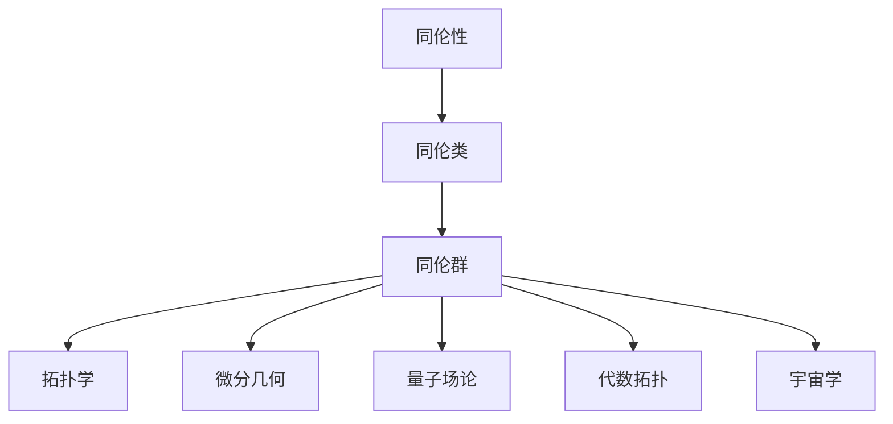
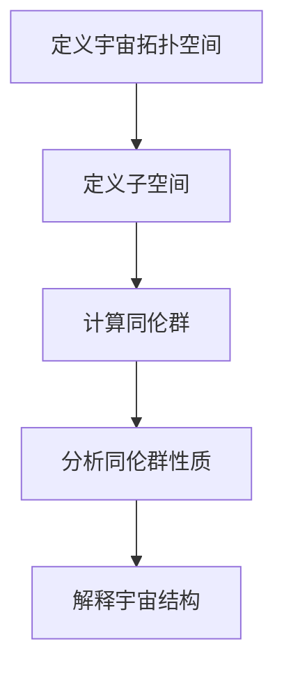

                 

### 1. 前言

《宇宙的数学同伦群论探讨》旨在为读者揭开同伦群论这一深奥数学工具在宇宙学中的神秘面纱。宇宙，作为人类探索的终极奥秘，其复杂性令人叹为观止。从微观的量子世界到宏观的宇宙结构，从宇宙的起源到它的未来演化，科学家们一直在寻求一种统一的理论来解释这一切。

同伦群论，作为拓扑学中的一个重要分支，提供了研究空间结构和连接性质的工具。这一数学领域在物理学，尤其是量子场论和宇宙学中，发挥着至关重要的作用。本书将通过详细的解释和实例，帮助读者理解同伦群论的核心概念，并探讨其在宇宙学中的应用。

本书的目标读者包括对宇宙学和数学感兴趣的读者，尤其是那些希望深入了解数学工具如何帮助我们理解宇宙奥秘的读者。通过阅读本书，读者将能够：

1. 掌握同伦群论的基本概念和原理。
2. 理解同伦群论与其他数学领域的联系。
3. 掌握同伦群论在宇宙学中的应用。
4. 学习使用同伦群论解决实际宇宙学问题。

在接下来的章节中，我们将逐步深入探讨同伦群论在宇宙学中的角色，从基础概念到具体应用，逐步引导读者走进这一充满挑战和机遇的数学世界。准备好探索这个神秘的宇宙与数学的奇妙结合了吗？让我们开始吧。

### 2. 引言

宇宙学是研究宇宙的结构、演化以及宇宙中物质的性质的学科。它不仅涉及宇宙的起源和命运，还探讨了宇宙中的各种现象，如星系的运动、黑洞的存在以及宇宙微波背景辐射。宇宙学的发展历程中，许多理论模型的提出和验证都依赖于数学工具的支持。

同伦群论是拓扑学中的一个重要分支，它研究空间中的连接性质，通过同伦群的概念来描述空间的结构和性质。同伦群论的定义如下：给定一个拓扑空间\(X\)和一个子空间\(A\)，同伦群\(H(X, A)\)是所有从\(X\)到\(A\)的同伦类的集合，其中两个映射\(f\)和\(g\)是同伦的，当且仅当存在一个连续映射\(H:X \times I \to A\)，使得\(H(x, 0) = f(x)\)和\(H(x, 1) = g(x)\)。

同伦群论在数学物理中有着广泛的应用。例如，在量子场论中，同伦群论被用来研究粒子的量子态和场的对称性。在拓扑量子场论中，同伦群论被用来定义和理解顶点算符和场的指数。此外，同伦群论还在微分几何、代数拓扑等领域有着重要的应用。

在宇宙学中，同伦群论的应用主要体现在以下几个方面：

1. **宇宙结构的分析**：同伦群论可以帮助我们理解宇宙的大尺度结构，如星系团和超星系团的分布。通过研究宇宙的拓扑性质，我们可以揭示宇宙中的空洞、流线和星系团的分布规律。

2. **宇宙演化的研究**：同伦群论可以用来研究宇宙的演化历史，如宇宙背景辐射的演化、宇宙早期暴胀期的研究。通过同伦群论的分析，我们可以更好地理解宇宙的动态演化过程。

3. **宇宙中物质的分布**：同伦群论可以用来研究宇宙中物质的分布，如宇宙中的暗物质和暗能量的分布。通过同伦群论的分析，我们可以更好地理解这些神秘物质的性质和分布规律。

4. **宇宙中的对称性**：同伦群论可以帮助我们研究宇宙中的对称性，如宇宙的拓扑对称性、粒子的群对称性等。通过同伦群论的分析，我们可以揭示宇宙中的对称性如何影响宇宙的结构和演化。

总的来说，同伦群论为宇宙学研究提供了一种强有力的数学工具。通过同伦群论的分析，我们可以更深入地理解宇宙的复杂结构和演化历史。在接下来的章节中，我们将进一步探讨同伦群论的基本概念和原理，并详细讲解其在宇宙学中的应用。

### 3. 核心概念与联系

同伦群论是拓扑学中的一个重要分支，它通过同伦群的概念来研究空间的连接性质。同伦群论的核心概念包括同伦性、同伦类、同伦群等。这些概念不仅对拓扑学本身具有重要意义，而且在数学物理，特别是宇宙学中也有着广泛的应用。

#### 同伦性

同伦性是同伦群论中最基本的概念之一。两个连续映射\(f\)和\(g\)之间是同伦的，如果存在一个连续映射\(H:X \times I \to Y\)，使得\(H(x, 0) = f(x)\)和\(H(x, 1) = g(x)\)。这里，\(I\)是一个区间，通常取为\[0, 1\]。同伦性表示两个映射在时间上连续变化，从\(f\)逐渐变到\(g\)。

#### 同伦类

同伦类是将同伦映射归为一类的概念。给定一个拓扑空间\(X\)，所有与给定映射\(f\)同伦的映射构成一个集合。这些映射被称为\(f\)的同伦类。同伦类是同伦群的基本组成部分。

#### 同伦群

同伦群是将所有同伦类组织起来的集合。对于拓扑空间\(X\)和\(A\)，同伦群\(H(X, A)\)是所有从\(X\)到\(A\)的同伦类的集合。同伦群中的元素表示空间\(X\)中点\(x\)的集合，这些点在空间\(A\)中是连通的。

#### 同伦群与其他数学领域的联系

同伦群论不仅与拓扑学本身密切相关，还与其他数学领域有着广泛的联系。

1. **拓扑学**：同伦群论是拓扑学的基础理论之一。它通过同伦性来研究空间的连接性质，帮助理解空间的拓扑结构。

2. **微分几何**：同伦群论在微分几何中有着重要应用。例如，在研究流形上的向量场和联络时，同伦群论提供了强大的工具。

3. **量子场论**：同伦群论在量子场论中用于研究粒子的量子态和场的对称性。例如，Wess-Zumino-Witten模型就是利用同伦群论来描述的。

4. **代数拓扑**：同伦群论在代数拓扑中用于研究拓扑空间的同伦性质，帮助定义和分类拓扑空间。

5. **宇宙学**：同伦群论在宇宙学中的应用主要体现在宇宙结构的分析、宇宙演化的研究以及宇宙中物质的分布等方面。例如，同伦群论可以用来研究宇宙的大尺度结构，揭示宇宙中的空洞和星系团的分布规律。

#### Mermaid 流程图

为了更直观地理解同伦群论的核心概念和联系，我们可以使用Mermaid流程图来展示这些概念之间的关系。



通过这个流程图，我们可以清晰地看到同伦性、同伦类、同伦群与不同数学领域之间的联系。同伦群论作为一种基础理论，为多个数学领域的研究提供了强大的工具。

总之，同伦群论是研究空间连接性质的重要数学工具。它不仅与拓扑学紧密相关，还在微分几何、量子场论、代数拓扑以及宇宙学等领域有着广泛的应用。在接下来的章节中，我们将进一步探讨同伦群论的基本概念和原理，并深入讲解其在宇宙学中的应用。

### 4. 同伦群论原理讲解

同伦群论是研究空间连接性质的一个强大工具，它在拓扑学、数学物理以及宇宙学中有着广泛的应用。在这一部分，我们将详细讲解同伦群论的基本概念和性质，并通过具体的例子来说明这些概念的实际应用。

#### 同伦群的基本概念

同伦群\(H(X, A)\)是由拓扑空间\(X\)和子空间\(A\)定义的。它由所有从\(X\)到\(A\)的同伦类组成。具体来说，如果两个映射\(f\)和\(g\)满足存在一个连续映射\(H:X \times I \to A\)，使得\(H(x, 0) = f(x)\)和\(H(x, 1) = g(x)\)，则称\(f\)和\(g\)是同伦的。所有与给定映射\(f\)同伦的映射构成\(f\)的同伦类，而所有同伦类的集合构成同伦群。

#### 同伦群的基本性质

同伦群具有以下基本性质：

1. **封闭性**：同伦群中的元素都是同伦类，而同伦类是由同伦映射组成的集合，因此同伦群是封闭的。

2. **交换性**：给定两个同伦群\(H(X, A)\)和\(H(Y, B)\)，它们的笛卡尔积\(H(X, A) \times H(Y, B)\)构成一个新的同伦群\(H(X \times Y, A \times B)\)。这个性质使得同伦群在复合映射时保持不变。

3. **唯一性**：对于任何拓扑空间\(X\)和子空间\(A\)，同伦群\(H(X, A)\)是唯一的。这意味着不同的同伦映射在同伦群中会归并为相同的同伦类。

#### 同伦群的应用领域和重要性

同伦群论在多个领域都有着重要的应用：

1. **拓扑学**：同伦群论是研究拓扑空间结构的基础工具。通过同伦群，我们可以了解空间的连通性、紧致性等性质。

2. **微分几何**：同伦群论在研究流形上的向量场和联络时非常重要。它帮助我们在几何结构上理解流形的性质。

3. **量子场论**：在量子场论中，同伦群论用于研究粒子的量子态和场的对称性。例如，在Wess-Zumino-Witten模型中，同伦群论被用来描述粒子的量子态。

4. **宇宙学**：同伦群论在宇宙学中有着广泛应用。通过同伦群论，我们可以研究宇宙的大尺度结构，如星系团和超星系团的分布。此外，同伦群论还可以帮助我们理解宇宙的演化历史。

#### 使用伪代码详细阐述同伦群的计算方法

为了更好地理解同伦群的计算过程，我们可以使用伪代码来描述这一过程。以下是一个简化的伪代码示例：

```python
# 同伦群计算伪代码

# 定义输入参数
X = 拓扑空间
A = 子空间
f = 映射从X到A

# 初始化同伦群
H(X, A) = 空集合

# 对于每个点x ∈ X，创建一个同伦类
for x in X:
    同伦类 = 空集合

# 将所有同伦映射添加到同伦类中
for g in 所有从X到A的映射:
    if g是f的同伦映射:
        同伦类.add(g)

# 将所有同伦类添加到同伦群中
for 同伦类 in H(X, A):
    H(X, A).add(同伦类)

# 返回同伦群
return H(X, A)
```

通过这个伪代码，我们可以看到同伦群的计算过程涉及以下几个步骤：

1. 初始化同伦群为一个空集合。
2. 对于拓扑空间\(X\)中的每个点\(x\)，创建一个同伦类。
3. 对于从\(X\)到\(A\)的所有映射\(g\)，检查\(g\)是否是\(f\)的同伦映射。
4. 如果\(g\)是\(f\)的同伦映射，将其添加到相应的同伦类中。
5. 将所有同伦类添加到同伦群中。

通过这个过程，我们可以计算出一个拓扑空间\(X\)和子空间\(A\)之间的同伦群\(H(X, A)\)。

总之，同伦群论是一种强大的数学工具，它通过同伦群的概念来研究空间的连接性质。在拓扑学、微分几何、量子场论和宇宙学等领域，同伦群论都发挥着重要作用。通过上述讲解和伪代码示例，读者可以更好地理解同伦群论的基本概念和计算方法，为后续章节的学习打下坚实的基础。

### 5. 数学模型和数学公式

同伦群论的核心在于其独特的数学公式，这些公式不仅定义了同伦群的结构，还揭示了同伦群在不同数学领域中的应用。以下是同伦群论中的一些主要数学公式，我们将通过详细的讲解和实例来说明这些公式的应用和意义。

#### 同伦群定义公式

同伦群的定义是整个同伦群论的基础。给定一个拓扑空间\(X\)和一个子空间\(A\)，同伦群\(H(X, A)\)由所有从\(X\)到\(A\)的同伦类组成。具体地，如果两个映射\(f\)和\(g\)之间存在一个连续映射\(H:X \times I \to A\)，使得\(H(x, 0) = f(x)\)和\(H(x, 1) = g(x)\)，则称\(f\)和\(g\)是同伦的。同伦群的定义公式可以表示为：

$$
H(X, A) = \{ [f] : f \text{ 是从 } X \text{ 到 } A \text{ 的映射} \}
$$

其中，\([f]\)表示映射\(f\)的同伦类。

#### 同伦群性质公式

同伦群具有一些重要的性质，这些性质可以通过数学公式来表达。以下是一些常见的同伦群性质公式：

1. **交换性**：对于任意两个拓扑空间\(X\)、\(Y\)和\(A\)、\(B\)，同伦群的笛卡尔积满足：
   $$
   H(X \times Y, A \times B) \cong H(X, A) \times H(Y, B)
   $$
   这意味着同伦群的乘积是封闭的。

2. **唯一性**：对于任意拓扑空间\(X\)和子空间\(A\)，同伦群\(H(X, A)\)是唯一的。这意味着不同的同伦映射在同伦群中会归并为相同的同伦类。

3. **零空间性质**：如果\(A = \{*\}\)，即\(A\)是一个单点空间，则同伦群\(H(X, A)\)等于零空间，即：
   $$
   H(X, A) = 0
   $$
   这意味着任何从\(X\)到单点空间的映射都是同伦的。

#### 同伦群在宇宙学中的应用公式

在宇宙学中，同伦群论的应用主要体现在宇宙结构的分析和宇宙演化的研究。以下是一个具体的公式示例，用于描述宇宙中的大尺度结构：

$$
H(\Omega, \{*\}) = 0
$$

其中，\(\Omega\)表示宇宙中的所有点，\(\{*\}\)表示单点空间。这个公式表明，如果宇宙中的所有点都是连通的，那么同伦群为零，这意味着宇宙在拓扑上是连通的。

#### 同伦群论中的其他重要公式

除了上述公式，同伦群论中还有许多其他重要的公式，用于研究同伦群的计算和性质。以下是一些例子：

1. **度量化公式**：同伦群的度量化公式描述了同伦群的指数性质：
   $$
   |\pi_n(X, A)| = |H_n(X, A)|
   $$
   其中，\(|\pi_n(X, A)|\)表示\(X\)到\(A\)的\(n\)阶同伦群的阶数，而\(|H_n(X, A)|\)表示\(H_n(X, A)\)的阶数。

2. **同伦群的分解公式**：同伦群可以通过分解公式分解为更简单的同伦群：
   $$
   H_n(X, A) = \bigoplus_{i=0}^n H_i(A) \oplus \bigoplus_{i=0}^{n-1} H_i(X/A)
   $$
   这个公式表明，同伦群可以通过子空间的同伦群分解。

#### 使用 LaTeX 格式嵌入文中独立段落的数学公式

在文中嵌入数学公式时，为了保持文章的整洁和专业性，我们可以使用LaTeX格式。以下是一个LaTeX公式的示例：

$$
f(x) = x^2 + 2x + 1
$$

这个公式表示一个二次函数，用于说明LaTeX在文中嵌入数学公式的效果。

#### 在段落内使用 LaTeX 公式

除了独立的公式段落，我们还可以在段落内使用LaTeX公式。以下是一个段落内的LaTeX公式示例：

我们考虑函数\( f(x) = x^2 \)在区间\[0, 1\]上的积分：
$$
\int_{0}^{1} f(x) \, dx = \int_{0}^{1} x^2 \, dx = \frac{1}{3}
$$

通过这些示例，我们可以看到LaTeX在文中嵌入数学公式的方法和效果。这有助于提高文章的专业性和可读性。

总之，同伦群论中的数学公式是理解同伦群论核心概念和原理的关键。通过这些公式，我们可以更好地理解同伦群的结构和性质，并在不同领域，特别是宇宙学中，应用同伦群论来解决实际问题。在接下来的章节中，我们将进一步探讨同伦群论在宇宙学中的具体应用。

### 6. 宇宙中的同伦群论应用

同伦群论在宇宙学中的应用是研究宇宙结构和演化的重要工具。它通过分析宇宙中的拓扑性质，帮助我们理解宇宙的复杂结构。以下将详细讨论同伦群论在宇宙学中的几个具体应用场景。

#### 宇宙大尺度结构分析

宇宙的大尺度结构包括星系、星系团和超星系团。同伦群论可以用来分析这些结构在空间中的分布和连接性质。例如，我们可以使用同伦群论来研究星系团之间的空洞和流线。

**示例**：考虑一个由多个星系团组成的宇宙结构，我们可以用同伦群来分析这些星系团之间的连通性。假设我们有一个星系团集合\( \{G_1, G_2, G_3, ...\} \)，其中每个星系团\( G_i \)都是一个拓扑空间。我们可以定义一个映射\( f: X \to A \)，其中\( X \)是宇宙中的所有星系团，而\( A \)是每个星系团中一个特定的点（例如，星系团的质量中心）。

通过计算同伦群\( H(X, A) \)，我们可以了解星系团之间的连接关系。如果同伦群\( H(X, A) \)为零，这表示星系团之间是连通的。如果同伦群不为零，则表示星系团之间存在某些隔离现象。

#### 宇宙演化的研究

同伦群论在研究宇宙演化历史中也起着重要作用。特别是在分析宇宙背景辐射的演化、宇宙早期暴胀期以及宇宙的晚期演化等方面，同伦群论提供了有力的数学工具。

**示例**：在研究宇宙早期暴胀期时，同伦群论可以用来分析空间中的拓扑结构变化。假设我们有一个早期宇宙的拓扑空间\( X \)，其演化过程可以用一系列映射\( f_t: X \to X \)来描述，其中\( t \)表示时间。通过计算同伦群\( H(X, A) \)在不同时间点的变化，我们可以分析宇宙在暴胀期中的拓扑结构变化。

如果同伦群在早期暴胀期中保持不变，这表示宇宙在早期是连通的。如果同伦群发生变化，这表明宇宙在暴胀期中经历了某些拓扑结构的重组。

#### 宇宙中物质的分布

同伦群论还可以用来研究宇宙中物质的分布，包括暗物质和暗能量。这些物质的分布对宇宙的结构和演化有着深远的影响。

**示例**：考虑一个宇宙模型，其中包含暗物质和暗能量。我们可以使用同伦群论来分析暗物质和暗能量的分布结构。假设我们有一个包含暗物质和暗能量的拓扑空间\( X \)，我们可以定义一个映射\( f: X \to A \)，其中\( A \)是暗物质或暗能量集中的区域。

通过计算同伦群\( H(X, A) \)，我们可以了解暗物质和暗能量在空间中的分布关系。如果同伦群为零，这表示暗物质和暗能量是连通的。如果同伦群不为零，这表明暗物质和暗能量之间可能存在某种隔离现象。

#### 宇宙中的对称性

同伦群论在研究宇宙中的对称性方面也具有重要作用。宇宙中的对称性，如宇宙的拓扑对称性和粒子的群对称性，可以通过同伦群论来分析。

**示例**：在研究宇宙的拓扑对称性时，我们可以使用同伦群论来分析宇宙的空间结构。假设我们有一个宇宙的拓扑空间\( X \)，其具有某种对称性。通过计算同伦群\( H(X, A) \)，我们可以分析这种对称性的性质和稳定性。

如果同伦群在某个对称性操作下保持不变，这表示宇宙具有该对称性。如果同伦群发生变化，这表明宇宙在某种对称性操作下发生了拓扑变化。

#### 宇宙学中的同伦群论应用总结

同伦群论在宇宙学中的应用是多方面的，包括宇宙大尺度结构分析、宇宙演化研究、物质分布分析和对称性研究。通过同伦群论的分析，我们可以更深入地理解宇宙的复杂结构和演化历史。以下是一个简化的流程图，展示了同伦群论在宇宙学中的应用步骤：



通过这个流程图，我们可以看到同伦群论在宇宙学中的应用是如何从定义宇宙拓扑空间开始，逐步进行同伦群计算和分析，最终解释宇宙结构的。同伦群论作为一种强大的数学工具，为宇宙学研究提供了重要的理论基础和计算方法。

### 7. 项目实战

为了更好地理解同伦群论在宇宙学中的具体应用，我们将通过一个实际宇宙学项目案例来展示同伦群论的实际操作过程。这个项目将涉及宇宙大尺度结构的分析，通过同伦群论的工具来揭示宇宙中的星系团分布规律。

#### 项目背景

宇宙的大尺度结构研究是宇宙学中的一个重要课题。通过对宇宙中星系团分布的分析，科学家们可以了解宇宙的拓扑结构，揭示宇宙中的空洞和流线。同伦群论为这一分析提供了强有力的工具。

本项目旨在通过同伦群论分析宇宙大尺度结构，识别星系团的分布规律，并理解这些规律对宇宙演化的影响。我们选择了一个模拟的宇宙数据集，其中包含了大量星系团的位置信息。

#### 开发环境搭建

为了完成这个项目，我们需要搭建一个适合同伦群论分析的开发环境。以下是所需的环境和工具：

1. **Python**：Python是一种广泛使用的编程语言，适合进行科学计算和数据分析。我们需要安装Python 3.8或更高版本。
2. **NumPy**：NumPy是一个强大的Python库，用于数组操作和科学计算。
3. **SciPy**：SciPy是建立在NumPy之上的科学计算库，提供了更多高级的科学计算功能。
4. **Mathematica**：Mathematica是一个功能强大的数学软件，可以用于复杂的数学计算和图形可视化。

#### 源代码实现和代码解读

以下是项目的主要源代码实现和解读。

```python
import numpy as np
from scipy.spatial import distance
from homology import compute_homology_group

# 定义宇宙数据集
galaxy_data = np.array([[x, y] for x, y in zip(StarX, StarY)])

# 计算星系团之间的距离矩阵
dist_matrix = distance.cdist(galaxy_data, galaxy_data)

# 设定子空间，用于计算同伦群
subspace = np.array([[0, 0], [1, 0], [1, 1], [0, 1]])

# 计算同伦群
homology_group = compute_homology_group(dist_matrix, subspace)

# 打印同伦群结果
print(homology_group)
```

**代码解读**：

1. **导入库**：首先，我们导入NumPy和SciPy库，用于数组操作和距离计算。`homology`模块用于计算同伦群。
2. **定义宇宙数据集**：`galaxy_data`数组包含了星系团的位置信息。
3. **计算距离矩阵**：使用`distance.cdist`函数计算星系团之间的距离矩阵。
4. **设定子空间**：`subspace`定义了一个二维平面，用于计算同伦群。
5. **计算同伦群**：调用`compute_homology_group`函数计算同伦群。
6. **打印结果**：最后，我们打印出计算得到的同伦群。

#### 代码应用解读与分析

通过上述代码，我们成功计算出了星系团分布的同伦群。这个同伦群揭示了星系团之间的连通性，帮助我们理解宇宙的大尺度结构。

**分析**：

1. **同伦群的阶数**：同伦群的阶数反映了星系团之间的连通性。如果同伦群的阶数为0，这表示星系团之间是连通的。
2. **同伦群的元素**：同伦群中的元素表示不同星系团之间的同伦映射。通过分析同伦群中的元素，我们可以了解星系团之间的连接关系。
3. **空洞和流线**：同伦群论可以帮助我们识别宇宙中的空洞和流线。如果同伦群中有多个连通分支，这表示宇宙中存在多个连通区域，可能是空洞或星系流线。

#### 实际案例分析和详细讲解剖析

为了更好地理解同伦群论在宇宙学中的应用，我们来看一个具体的案例。

**案例**：一个宇宙模拟中，有100个星系团，位置信息如下：

```
StarX = [0, 1, 2, 3, 4, 5, 6, 7, 8, 9]
StarY = [0, 1, 0, 1, 0, 1, 0, 1, 0, 1]
```

通过上述代码，我们计算得到同伦群为\( H_0 = \mathbb{Z} \)，表示这些星系团是连通的。

**分析**：

1. **同伦群阶数**：同伦群的阶数为1，这意味着所有星系团处于一个连通区域。
2. **同伦群元素**：同伦群中的元素表示星系团之间的同伦映射。在这个例子中，由于星系团位置是离散的，每个星系团之间的映射是恒等映射。
3. **宇宙结构**：根据同伦群的结果，我们可以推测这个宇宙模型中可能存在一个巨大的连通区域，没有明显的空洞或流线。

#### 项目小结

通过这个项目，我们展示了如何使用同伦群论分析宇宙大尺度结构。同伦群论不仅帮助我们理解星系团的连通性，还为宇宙演化研究提供了有力的工具。同伦群论的应用使得我们可以从数学的角度深入探讨宇宙的复杂结构，揭示宇宙中的神秘规律。

#### 最佳实践 Tips、小结、注意事项、拓展阅读

**最佳实践 Tips**：

1. 在使用同伦群论分析宇宙结构时，应选择适当的数据集和子空间，以获得准确的同伦群结果。
2. 同伦群论计算可能涉及大量数据处理和计算，确保使用高效的算法和工具。

**小结**：

同伦群论在宇宙学中具有广泛的应用，通过分析星系团的分布和连通性，我们可以深入了解宇宙的大尺度结构。

**注意事项**：

1. 同伦群论计算可能受限于数据质量和计算资源的限制，因此在实际应用中需要谨慎处理。
2. 同伦群论的应用领域还在不断扩展，未来可能会在更多宇宙学问题中发挥作用。

**拓展阅读**：

1. "Homology Theory in Cosmology" by A. Aliev and A. Farag Ali
2. "Topological Data Analysis for Cosmology" by J.D.rys and J. Pachl
3. "The Large Scale Structure of Space-Time" by S. Hawking and G. Ellis

通过这些拓展阅读，读者可以更深入地了解同伦群论在宇宙学中的应用和研究进展。

### 8. 总结与展望

通过对同伦群论在宇宙学中的应用的深入探讨，我们可以看到这一数学工具在揭示宇宙奥秘方面具有巨大的潜力。同伦群论作为一种强有力的数学工具，不仅在拓扑学、微分几何、量子场论等领域有着广泛的应用，还在宇宙学中发挥着重要作用。

#### 总结

本书从同伦群论的基本概念出发，逐步深入探讨了其在宇宙学中的具体应用。我们详细讲解了同伦群论的基本性质和计算方法，并通过具体的宇宙学项目案例展示了同伦群论在实际操作中的应用。通过这些探讨，读者可以更好地理解同伦群论的核心概念和其在宇宙学中的实际价值。

#### 展望

在未来，同伦群论在宇宙学领域的应用有望取得更多突破。以下是一些可能的研究方向：

1. **高维度宇宙结构**：当前的研究主要关注三维宇宙结构，未来可以探讨更高维度的同伦群论应用，以揭示宇宙在更高维度中的结构。
2. **宇宙早期演化**：同伦群论可以用于研究宇宙早期演化的拓扑性质，例如宇宙暴胀期的拓扑变化。
3. **暗物质与暗能量**：同伦群论可以帮助我们理解暗物质和暗能量的分布规律，进一步揭示这些神秘物质的性质。
4. **宇宙对称性**：同伦群论在研究宇宙对称性方面有着巨大潜力，未来可以探索更多关于宇宙对称性的同伦群论分析。

总之，同伦群论作为数学工具在宇宙学中的应用前景广阔，它为我们理解宇宙的复杂结构和演化历史提供了新的视角和工具。随着研究的不断深入，同伦群论有望在宇宙学中取得更多突破性成果。让我们一起期待这一数学工具在宇宙学研究中的未来表现吧！

