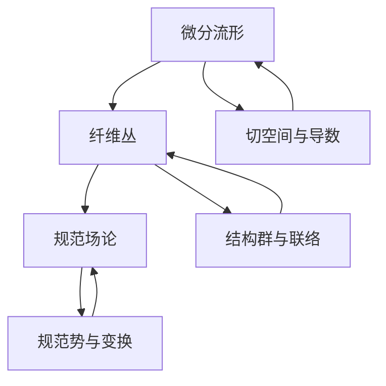

                 

# 引言：宇宙的数学微分流形与纤维丛理论在规范场论中的解析

宇宙的本质是什么？它如何运作？这些问题一直以来都是物理学和哲学领域关注的焦点。随着科学技术的不断发展，人类对宇宙的理解逐渐深入，从宏观的天体物理到微观的粒子物理，我们逐渐认识到，宇宙的本质可能隐藏在数学的规律之中。本文将探讨宇宙的数学微分流形与纤维丛理论在规范场论中的应用，通过逐步分析这些核心概念及其相互关系，试图揭示宇宙运作的数学本质。

首先，我们需要理解什么是微分流形。微分流形是拓扑空间和微积分的结合，它描述了空间在局部和整体上的结构。微分流形的核心概念包括切空间、导数、微分形式等，这些概念为我们在更高维度上描述物理现象提供了强有力的工具。

接下来，我们引入纤维丛理论。纤维丛是描述空间中不同对象之间关系的一种数学结构，它由一个总空间、一组纤维和一组投影映射组成。纤维丛理论在几何学和拓扑学中有着广泛的应用，特别是在描述物理系统中的对称性和变换时尤为重要。

最后，我们探讨规范场论。规范场论是一种描述物理现象的理论框架，它基于局部规范对称性，将基本力与粒子场联系起来。在规范场论中，微分流形和纤维丛理论被用来描述场的动力学行为和对称性变换。

本文将按照以下结构展开：首先，我们将介绍微分流形和纤维丛的基本概念及其在物理学中的应用。然后，我们将深入探讨规范场论的基本原理，并展示如何使用微分流形和纤维丛理论来描述物理现象。接下来，我们将通过具体的数学模型和公式，详细讲解这些理论的数学基础。最后，我们将通过一个实际项目分析，展示如何将理论应用于解决实际问题。

通过本文的逐步分析，我们希望能够让读者对宇宙的数学本质有一个更加清晰和深刻的理解。无论您是物理学专业的学生、研究人员，还是对数学和物理学感兴趣的一般读者，本文都将为您提供一种新的视角来思考宇宙的本质。让我们开始这段探索之旅吧！

## 文章关键词

微分流形，纤维丛，规范场论，数学模型，宇宙结构，物理现象，局部对称性，数学公式，高维空间，物理计算。

## 摘要

本文旨在探讨宇宙的数学微分流形与纤维丛理论在规范场论中的应用。首先，我们介绍了微分流形和纤维丛的基本概念，并探讨了它们在物理学中的重要性。接着，我们深入探讨了规范场论的基本原理，展示了如何利用微分流形和纤维丛理论来描述物理现象。本文通过具体的数学模型和公式，详细讲解了这些理论的基础，并提供了一个实际项目分析，展示了如何将理论应用于解决实际问题。本文的目标是为读者提供一个全面而深刻的视角，以理解宇宙的数学本质及其在物理学中的应用。

## 背景介绍

### 微分流形的基本概念

微分流形是现代数学中用于描述空间和物体的一个基本工具。它起源于微分几何，是拓扑空间和微积分的结合体。一个微分流形是由一个无边界、具有局部欧氏性质的流形组成，其上的点具有切空间，可以通过局部坐标系来描述。

定义上，一个n维微分流形M是由一个拓扑空间M和一组切空间组成的。在每个点x∈M上，都存在一个切空间\( T_xM \)，它是所有通过x点的切向量组成的集合。此外，通过这些切空间，我们可以定义流形上的导数和微分形式，这些概念是微分流形理论的核心。

微分流形具有几个重要的性质。首先，它具有局部欧氏性质，这意味着在流形的每个局部区域，都可以找到一个坐标系，使得该区域在这个坐标系下看起来像欧氏空间。其次，微分流形具有全局性质，这意味着它在整个流形上都具有一致性。此外，微分流形还具有良好的结构性质，可以通过切空间、导数和微分形式来描述其几何行为。

### 纤维丛的基本概念

纤维丛是另一种重要的数学结构，它在几何学和物理学中有着广泛的应用。纤维丛是一种将不同对象连接在一起的结构，它由总空间、纤维和投影映射组成。

定义上，一个纤维丛是由一个总空间E、一组纤维F和一个投影映射π：E→B组成的。总空间E是一个带有拓扑结构的空间，纤维F是定义在B上的多个相同空间。投影映射π将E中的每个点映射到B中的一个唯一点，同时保持纤维的结构不变。

纤维丛的核心概念包括局部平凡化和结构群。局部平凡化是指在局部区域，纤维丛看起来像是一个平凡（即普通）的线性空间。结构群则是一个与纤维丛相关的群，它描述了纤维丛的对称性和变换性质。

### 规范场论的基本概念

规范场论是一种描述物理现象的理论框架，它基于局部规范对称性。在规范场论中，基本力被视为规范场，这些规范场通过变换来保持系统的对称性。

定义上，规范场是一种在空间中定义的场，它具有局部规范对称性。规范对称性意味着物理系统在局部上可以通过变换来保持不变。这种变换通常称为规范变换。

规范场论的核心概念包括规范势、规范变换和规范不变性。规范势是一个描述规范场的物理量，它通常是一个矢量场。规范变换是一种将规范场变换为另一种形式的过程，规范不变性则是指物理系统在规范变换下保持不变。

### 核心概念之间的联系

微分流形、纤维丛和规范场论在物理学中有着密切的联系。微分流形为描述空间和物体的几何结构提供了工具，纤维丛则通过描述不同对象之间的关系，为描述物理系统的对称性和变换提供了框架。而规范场论则利用这些数学结构来描述基本力场的动力学行为。

具体来说，微分流形可以用来描述空间和物体的几何性质，例如，通过切空间和导数来描述物体的运动和变形。纤维丛则可以用来描述物理系统的对称性和变换，例如，通过结构群和联络来描述规范场的变换。规范场论则通过利用微分流形和纤维丛的数学结构，来描述基本力场的相互作用和动力学行为。

### Mermaid 流程图

为了更直观地理解微分流形、纤维丛和规范场论之间的联系，我们可以使用Mermaid流程图来展示这些概念之间的关系。



这个流程图展示了微分流形、纤维丛和规范场论之间的层次关系。微分流形提供了描述几何性质的基础，纤维丛通过描述对称性和变换将这些几何性质联系起来，而规范场论则利用这些数学结构来描述物理现象。

通过这个流程图，我们可以更清晰地看到微分流形、纤维丛和规范场论之间的相互作用，以及它们在描述物理现象中的重要性。这个流程图也为后续章节中的详细讲解提供了一个直观的框架，帮助我们更好地理解这些复杂概念的内在联系。

## 微分流形的定义与性质

微分流形是现代数学中用于描述空间和物体几何性质的一个基本工具，它在物理学和几何学中都有着广泛的应用。为了更好地理解微分流形，我们首先需要从其定义入手，并探讨其关键的数学性质。

### 定义

微分流形可以简单定义为一种具有局部欧氏性质的拓扑空间。更正式地说，一个微分流形是由一个无边界、带有拓扑结构的集合M和一个切丛\(TM\)组成的。切丛是一个覆盖M的集合，其上的每个元素都是一个切空间\(T_xM\)，这些切空间在M上的每一点都存在，并构成了一个整体结构。

在数学上，一个微分流形M可以表示为：

\( M \) 是一个拓扑空间。

对于M上的每一个点 \( p \)，存在一个切空间 \( T_pM \)，这是一个线性空间，由所有在点 \( p \) 处的切向量组成。

存在一个 atlas \(\{\varphi_i\}\)，即一个局部坐标系统，使得对于每个 \( \varphi_i \)，存在一个开集 \( U_i \subseteq M \) 和一个同胚映射 \( \varphi_i: U_i \to \mathbb{R}^n \)，其中 \( n \) 是流形的维度。

此外，流形的切空间上的运算（如加法和数乘）必须满足一定的连续性条件，以保证导数和外微分等概念能够良好定义。

### 局部欧氏性质

微分流形的局部欧氏性质是其最重要的特性之一。这一性质意味着在流形的每个局部区域，都可以找到一个坐标系，使得该区域在这个坐标系下看起来像欧氏空间。

具体来说，局部欧氏性质包括以下两个方面：

1. **局部坐标可微性**：在流形的每个点，都可以找到一个包含该点的开集，使得在这个开集上存在一个坐标映射，这个映射在某个坐标坐标系下是可微的。

2. **局部线性性质**：在流形的每个点，都可以找到一个切空间基，使得这个切空间在这个基下是线性空间。这意味着流形的切向量可以在局部上进行线性组合。

### 核心数学性质

1. **连通性与紧致性**：微分流形是一个连通的、紧致的拓扑空间。这意味着流形上的每一条路径都可以无限延伸，并且流形是一个闭合的、没有边界的空间。

2. **维数**：微分流形具有一个维度，这是指流形上任意两点之间的最短路径的长度。微分流形的维度是有限的，通常是整数。

3. **微分结构**：微分流形上的每个点都存在一个切空间，切空间上的运算（如加法和数乘）构成了一个微分结构。这种结构使得流形上的导数和外微分等概念可以定义和计算。

4. **拓扑不变性**：微分流形的拓扑结构在某些变换下保持不变。这些变换包括坐标变换和同胚映射。

### 示例

为了更好地理解微分流形的定义和性质，我们可以考虑一些具体的例子。

- **欧氏空间**：一个n维欧氏空间\( \mathbb{R}^n \)是一个简单的微分流形，它具有标准的切空间和坐标系统。

- **球面**：球面是一个二维微分流形。在球面上的每个点，都可以找到一个切平面，这个切平面在局部坐标系下是一个二维欧氏空间。

- **螺旋面**：螺旋面是一个三维微分流形。在螺旋面上的每个点，都可以找到一个切空间，这个切空间在局部坐标系下是一个二维欧氏空间。

通过这些例子，我们可以看到微分流形在描述几何形状和物体运动中的重要性。微分流形的定义和性质为我们在更高维度上描述物理现象提供了强有力的工具。

## 纤维丛的基本概念

纤维丛是数学中用于描述对象之间关系的一种重要结构，它在几何学、拓扑学和物理学中都有广泛应用。理解纤维丛的基本概念对于深入探讨微分流形和规范场论具有重要意义。

### 定义

一个纤维丛由三个主要组成部分构成：总空间 \( E \)、纤维 \( F \) 和投影映射 \( \pi \)。

- **总空间 \( E \)**：总空间是一个带有拓扑结构的集合，它包含了纤维丛的所有点。总空间的拓扑性质对于纤维丛的整体结构至关重要。

- **纤维 \( F \)**：纤维是一个固定的集合，它在总空间中的每个点都存在一个副本。纤维通常是一个较小的空间，比如一个向量空间或一个群。纤维的特定类型决定了纤维丛的类别，例如，如果纤维是一个向量空间，那么这个纤维丛被称为向量丛。

- **投影映射 \( \pi \)**：投影映射是一个从总空间到纤维的映射，它将总空间中的每个点映射到一个特定的纤维。投影映射具有以下性质：
  - **平凡性**：对于总空间中的每个点，都存在唯一的纤维与之对应。
  - **局部平凡性**：在总空间中的局部区域内，纤维丛看起来像一个平凡纤维丛，即在这个局部区域内，总空间和纤维之间的映射是平凡的。

形式上，一个纤维丛可以定义为一个三元组 \( (E, F, \pi) \)，其中 \( E \) 是总空间，\( F \) 是纤维，\( \pi: E \to F \) 是投影映射。

### 类型

纤维丛可以根据纤维的类型和总空间的性质分为多种类型。以下是几种常见的纤维丛类型：

1. **向量丛**：纤维是向量空间的纤维丛，例如，在电磁场理论中，电磁场的各个点可以看作是向量丛。

2. **主丛**：主丛是一种特殊的纤维丛，其纤维是一个群，通常是一个李群。在规范场论中，主丛被用来描述规范场的结构。

3. **联络丛**：联络丛是一种具有联络的纤维丛，联络是描述纤维之间相互关系的一个概念。在广义相对论中，联络丛被用来描述时空的结构。

### 局部平凡化

纤维丛的一个重要性质是局部平凡化。局部平凡化意味着在总空间的每个局部区域内，纤维丛都可以被看作是一个平凡纤维丛。

具体来说，对于纤维丛 \( (E, F, \pi) \)，在总空间的任意一点 \( p \) 和它的一个邻域 \( U \)，都可以找到一组坐标，使得在这个坐标下，纤维丛 \( E \) 上的点可以唯一地表示为 \( p \) 和一个纤维 \( F \) 上的点。这意味着在这个局部区域内，纤维丛的结构可以被看作是一个简单的空间，如一个向量空间或一个群。

### 结构群

结构群是描述纤维丛对称性的一个重要概念。对于一个纤维丛 \( (E, F, \pi) \)，结构群是一个与纤维相关的群。结构群的元素描述了纤维丛上的对称变换。

例如，在主丛中，结构群通常是一个李群，如 \( GL(n, \mathbb{R}) \) 或 \( SO(n) \)。结构群的元素通过左平移或右平移作用于纤维上的点，从而保持纤维丛的整体结构不变。

### 关键性质

1. **纤维独立性**：纤维丛的纤维在不同点之间是独立的，即总空间中的每个点对应的纤维是独立的。

2. **投影映射的连续性**：投影映射 \( \pi \) 是一个连续映射，这意味着它在总空间中的每个点附近都具有好的局部行为。

3. **局部平凡性**：纤维丛在局部区域可以被看作是平凡的，这使得它在局部上是易于处理的。

通过上述定义和性质，我们可以看到纤维丛作为一种重要的数学结构，在描述几何对象之间的关系和物理系统的对称性方面具有关键作用。在接下来的章节中，我们将进一步探讨纤维丛与规范场论之间的联系，以及它们在物理学中的应用。

## 纤维丛的性质与结构

纤维丛作为一种重要的数学结构，在几何学和物理学中有着广泛的应用。理解纤维丛的性质和结构对于深入探讨规范场论和宇宙的数学本质至关重要。

### 局部平凡化与结构群

纤维丛的一个重要性质是局部平凡化。在总空间的每个局部区域内，纤维丛可以被看作是一个平凡纤维丛，这意味着在这个局部区域内，纤维丛的结构是简单的，可以方便地进行处理。

为了进一步理解局部平凡化，我们需要引入结构群的概念。结构群是一个与纤维丛相关的群，它描述了纤维丛上的对称性变换。在纤维丛 \( (E, F, \pi) \) 中，结构群通常是一个李群，如 \( GL(n, \mathbb{R}) \) 或 \( SO(n) \)。结构群的元素通过左平移或右平移作用于纤维上的点，从而保持纤维丛的整体结构不变。

具体来说，一个李群 \( G \) 可以看作是一个具有群结构的平滑空间。对于纤维丛 \( (E, F, \pi) \)，结构群 \( G \) 的每个元素 \( g \) 都可以作用在纤维上的点 \( f \) 上，形成一个变换 \( T_g(f) \)。这种变换保持了纤维丛的局部平凡化性质，即在每个局部区域内，纤维丛都可以看作是一个简单的李群。

### 局部性质与全局性质

纤维丛的局部性质和全局性质是理解其结构的重要方面。局部性质指的是在纤维丛的局部区域内，纤维丛的结构和性质。全局性质则是指纤维丛在整个空间上的性质。

1. **局部性质**：
   - **局部平凡化**：在总空间的每个局部区域内，纤维丛都可以被看作是一个平凡纤维丛。
   - **结构群**：在每个局部区域内，结构群 \( G \) 的元素可以通过左平移或右平移作用在纤维上的点。

2. **全局性质**：
   - **连通性与紧致性**：纤维丛作为一个整体是连通的、紧致的拓扑空间。
   - **维数**：纤维丛具有一个维数，这是指纤维丛上任意两点之间的最短路径的长度。

纤维丛的局部性质和全局性质相互关联。局部性质可以通过全局性质来理解，而全局性质则依赖于局部性质的累积。例如，纤维丛的连通性和紧致性是由其局部区域的连通性和紧致性累积而来的。

### 关联与关系

纤维丛与微分流形有着密切的联系。微分流形可以看作是一种特殊的纤维丛，其中纤维是实数线。微分流形的性质，如切空间和导数，可以通过纤维丛的概念来理解和描述。

此外，纤维丛在规范场论中扮演着关键角色。规范场论中的基本力场可以用纤维丛来描述，纤维丛的结构群与规范群的对称性变换密切相关。具体来说，规范场论中的规范势和规范变换可以通过纤维丛上的联络和曲率来描述。

### Mermaid 流程图

为了更直观地展示纤维丛与微分流形、规范场论之间的关联，我们可以使用Mermaid流程图来描述这些概念之间的关系。


这个流程图展示了微分流形、纤维丛和规范场论之间的层次关系。微分流形为描述几何性质提供了基础，纤维丛通过描述对称性和变换将这些几何性质联系起来，而规范场论则利用这些数学结构来描述物理现象。

通过这个流程图，我们可以更清晰地看到纤维丛、微分流形和规范场论之间的相互作用，以及它们在描述物理现象中的重要性。这个流程图也为后续章节中的详细讲解提供了一个直观的框架，帮助我们更好地理解这些复杂概念的内在联系。

## 规范场论的基本概念

规范场论是物理学中用于描述基本力和粒子相互作用的理论框架。它基于局部规范对称性，将基本力与粒子场联系起来，为我们理解宇宙的运行机制提供了有力的工具。在这一节中，我们将深入探讨规范场论的基本概念，包括规范势、规范变换和规范不变性。

### 规范势

规范势是规范场论中的核心概念之一。它是一种描述基本力场的物理量，通常用一个矢量场来表示。在规范场论中，基本力场被视为一种由规范势产生的场。规范势在空间中的每个点都有一个值，它决定了基本力在空间中的分布。

例如，在电磁学中，电磁场是由电磁势（包括电势和磁势）产生的。电磁势是一个矢量场，它描述了电场和磁场的分布。在量子场论中，规范势同样起着至关重要的作用，如量子电动力学（QED）中的电磁势。

### 规范变换

规范变换是规范场论中的另一个关键概念。规范变换是一种在空间中进行的变换，它保持了规范势的物理意义不变。规范变换的基本思想是，尽管规范势的形式可能发生变化，但其物理效果（如力场的分布和强度）保持不变。

具体来说，规范变换是一个将规范势从一种形式变换为另一种形式的过程。在数学上，规范变换通常表示为规范场的自同构，即一个将规范势映射到自身的映射。规范变换具有以下性质：

- **局部性**：规范变换是在空间中的每个点局部进行的。
- **同构性**：规范变换保持了规范势的物理意义，即它将一个规范势映射到另一个在物理上等效的规范势。

### 规范不变性

规范不变性是规范场论的核心原理之一。它指出，物理系统的动力学行为在规范变换下保持不变。这意味着，尽管规范势的形式可能发生变化，但物理系统的基本性质（如粒子的运动和相互作用）保持不变。

规范不变性是规范场论的一个重要原则，它保证了物理系统的对称性和可预测性。在规范不变性的框架下，我们可以通过选择适当的规范势来简化物理问题的分析和计算。

例如，在电磁学中，通过选择适当的电磁势，我们可以简化电场和磁场的计算，从而更容易地解决实际问题。在量子场论中，规范不变性也是量子电动力学（QED）能够成功描述电磁相互作用的关键。

### 规范场论的基本原理

规范场论的基本原理可以总结如下：

1. **规范对称性**：物理系统在规范变换下保持不变。这意味着我们可以通过规范变换来简化物理问题的分析。

2. **规范势**：规范势是描述基本力场的物理量，它决定了力场的分布和强度。

3. **规范变换**：规范变换是一种在空间中进行的变换，它保持了规范势的物理意义不变。

4. **规范不变性**：物理系统的动力学行为在规范变换下保持不变，这是规范场论的核心原则。

通过这些基本原理，规范场论为描述基本力和粒子相互作用提供了强有力的框架。它不仅解释了经典物理现象，如电磁学和强相互作用，还为我们理解量子物理提供了新的视角。

总之，规范场论的基本概念，如规范势、规范变换和规范不变性，构成了规范场论的核心。这些概念不仅加深了我们对物理世界的理解，还为我们在更高层次上研究宇宙的本质提供了工具。在接下来的章节中，我们将进一步探讨如何利用这些概念来描述物理现象，并展示其在宇宙研究中的应用。

## 规范对称性与规范变换

规范对称性是规范场论的核心原则之一，它反映了物理系统在空间中保持不变的性质。具体来说，规范对称性指的是物理系统的方程在规范变换下保持不变。这一特性不仅简化了物理问题的分析，还为寻找物理系统的对称性破缺提供了重要的线索。

### 规范变换的定义与性质

规范变换是一种在空间中进行的变换，它保持了物理系统的对称性和不变性。在数学上，规范变换通常是一个群作用，这个群被称为规范群。规范群可以是一个李群，也可以是一个更一般的群。

定义上，一个规范变换是一个将规范势从一种形式变换为另一种形式的过程，同时保持物理量的物理意义不变。在物理学中，规范变换通常通过以下形式表示：

\[ \phi(x) \rightarrow \phi'(x) = g(x) \phi(x) g^{-1}(x) + g(x) \partial_x g^{-1}(x) \]

其中，\( \phi(x) \) 是原始的规范势，\( g(x) \) 是规范变换的群元素，\( \partial_x \) 表示对空间坐标的偏导数。

规范变换具有以下性质：

1. **局部性**：规范变换是在空间中的每个点局部进行的。
2. **同构性**：规范变换保持了规范势的物理意义，即它将一个规范势映射到另一个在物理上等效的规范势。
3. **群性质**：规范变换构成一个群作用，这意味着它们可以组合，并且具有逆变换。

### 规范对称性与规范变换的关系

规范对称性与规范变换密切相关。规范对称性是指物理系统的方程在规范变换下保持不变，而规范变换是实现这种对称性的数学工具。

具体来说，如果一个物理系统的方程在规范变换下保持不变，那么这个系统就具有规范对称性。这意味着，无论我们选择哪种规范势，系统的动力学行为都是相同的。这种对称性为物理问题的分析和解决提供了便利，因为我们可以通过选择合适的规范来简化问题。

例如，在电磁学中，电磁势的变换具有规范对称性。通过选择合适的规范，我们可以简化电磁场的计算，从而更容易地解决实际问题。同样，在量子场论中，规范对称性也是许多物理现象的基础，如电荷守恒和规范不变性。

### 示例

为了更直观地理解规范对称性与规范变换的关系，我们可以考虑以下示例：

1. **电磁学**：在电磁学中，电磁势的变换具有规范对称性。通过选择适当的规范，我们可以简化电磁场的计算。例如，洛伦兹规范选择可以消除电磁势中的非物理部分，从而简化电磁场的方程。

2. **量子场论**：在量子电动力学（QED）中，电子的相互作用是通过电磁势来描述的。电磁势的规范变换不会改变电子的物理行为，但可以通过选择合适的规范来简化计算。例如，通过选择规范 \( A^\mu = (0, A) \)，我们可以将电子的自能计算简化为更易于处理的形式。

通过这些示例，我们可以看到规范对称性与规范变换在物理学中的应用。规范对称性不仅简化了物理问题的分析，还为我们在更高层次上研究宇宙的本质提供了工具。

## 规范场论中的关键量

在规范场论中，有几个关键量起着至关重要的作用，它们是描述物理系统行为和特性的基本工具。这些量包括规范势、规范变换、规范不变性等。下面我们将详细讲解这些量的定义、性质和它们在物理系统中的作用。

### 规范势

规范势是描述规范场的基本量，通常用矢量势 \( A^\mu \) 表示。在四维空间中，规范势是一个四元矢量，它的分量 \( A^\mu \) 分别表示电场和磁场的分布。规范势的定义与洛伦兹力场的性质密切相关，它通过以下方程来描述：

\[ \nabla \cdot \vec{F} = - \frac{\partial \vec{A}}{\partial t} \]

\[ \nabla \times \vec{F} = \frac{\partial \vec{E}}{\partial t} \]

其中，\( \vec{F} \) 是洛伦兹力场，\( \vec{E} \) 是电场，\( \vec{B} \) 是磁场。

规范势的性质包括：

- **局域性**：规范势在空间中的每个点都有确定的值。
- **变换性**：规范势可以通过规范变换来变化，但物理量不变。
- **数学描述**：规范势通常通过矢量分析工具（如散度和旋度）来描述。

### 规范变换

规范变换是规范场论中的另一个关键量，它描述了规范场在空间中的变换行为。规范变换是通过一个群作用实现的，这个群通常是一个李群。一个典型的规范变换形式为：

\[ A^\mu \rightarrow A'^\mu = g A^\mu g^{-1} + g \partial_x g^{-1} \]

其中，\( g \) 是群元素，\( g^{-1} \) 是群元素的逆。

规范变换的性质包括：

- **全局性**：规范变换在整个空间中作用。
- **保持物理量不变**：尽管规范势的形式可能变化，但物理量（如力场）保持不变。
- **数学描述**：规范变换通过群论工具（如群作用和自同构）来描述。

### 规范不变性

规范不变性是规范场论的核心原则之一，它反映了物理系统在规范变换下的不变性。具体来说，如果一个物理系统的方程在规范变换下保持不变，那么这个系统就具有规范不变性。

规范不变性的性质包括：

- **保持物理定律不变**：在规范不变性的框架下，物理定律（如洛伦兹力定律）保持不变。
- **简化计算**：通过选择合适的规范，可以简化物理问题的计算。
- **数学描述**：规范不变性通过数学工具（如不变量、守恒定律）来描述。

### 规范势、规范变换与规范不变性的关系

规范势、规范变换和规范不变性是规范场论中的核心概念，它们之间有着密切的联系：

1. **规范势** 是描述规范场的物理量，它是规范变换的起点。
2. **规范变换** 是实现规范对称性的数学工具，它保持了物理量的不变性。
3. **规范不变性** 是规范场论的核心原则，它保证了物理系统的可预测性和对称性。

具体来说，规范变换通过改变规范势的形式，但保持物理量的物理意义不变，从而实现规范对称性。而规范不变性则保证了物理系统在规范变换下保持不变，使得我们可以通过选择合适的规范来简化物理问题的分析和计算。

### 数学公式与例子

为了更好地理解这些概念，我们可以使用一些具体的数学公式和例子来解释。

1. **电磁势**：

\[ \vec{E} = - \nabla \phi - \frac{\partial \vec{A}}{\partial t} \]

\[ \vec{B} = \nabla \times \vec{A} \]

其中，\( \phi \) 是电势，\( \vec{A} \) 是磁场。

2. **规范变换**：

\[ A^\mu \rightarrow A'^\mu = g A^\mu g^{-1} + g \partial_x g^{-1} \]

3. **规范不变性**：

\[ \nabla \cdot \vec{F} = - \frac{\partial \vec{A}}{\partial t} \]

\[ \nabla \times \vec{F} = \frac{\partial \vec{E}}{\partial t} \]

这些公式展示了规范势、规范变换和规范不变性在电磁场中的应用。

通过这些公式和例子，我们可以看到规范场论中的关键量是如何在物理学中发挥作用的。规范势、规范变换和规范不变性不仅为描述物理现象提供了强大的工具，还为我们在更高层次上研究宇宙的本质提供了新的视角。

## 数学模型与公式详解

在规范场论中，数学模型和公式是理解和计算物理现象的核心工具。通过这些数学工具，我们可以精确描述和预测物理系统中的行为。下面，我们将详细讲解一些关键的数学模型和公式，并给出相应的示例。

### 积分理论

积分理论是微分流形和纤维丛理论中不可或缺的一部分。在规范场论中，积分理论用于计算物理量，如电场、磁场和能量。以下是一些常用的积分公式：

1. **线积分**：

\[ \int_C \vec{F} \cdot d\vec{r} = \int_a^b \vec{F}(\vec{r}(t)) \cdot \vec{r}'(t) dt \]

其中，\( C \) 是曲线，\( \vec{F} \) 是矢量场，\( \vec{r}(t) \) 是参数化的曲线，\( t \) 是参数。

2. **面积积分**：

\[ \int_S \vec{F} \cdot d\vec{S} = \int_D \vec{F}(\vec{r}(x, y)) \cdot \left( \frac{\partial \vec{r}}{\partial x} \times \frac{\partial \vec{r}}{\partial y} \right) dA \]

其中，\( S \) 是曲面，\( \vec{F} \) 是矢量场，\( \vec{r}(x, y) \) 是参数化的曲面，\( D \) 是定义曲面的区域。

3. **体积分**：

\[ \int_V \vec{F} \cdot d\vec{r} = \int_D \vec{F}(\vec{r}(x, y, z)) \cdot \left( \frac{\partial \vec{r}}{\partial x} \times \frac{\partial \vec{r}}{\partial y} \times \frac{\partial \vec{r}}{\partial z} \right) dV \]

其中，\( V \) 是体积，\( \vec{F} \) 是矢量场，\( \vec{r}(x, y, z) \) 是参数化的体积。

### 群论

群论是描述对称性和变换的基础。在规范场论中，群论用于描述规范势和规范变换。以下是一些基本的群论公式：

1. **群的定义**：

\[ G = \{ g | g^2 = e \} \]

其中，\( G \) 是群，\( g \) 是群的元素，\( e \) 是群的单位元。

2. **群的性质**：

- **封闭性**：对于任意 \( g, h \in G \)，有 \( gh \in G \)。
- **结合律**：对于任意 \( g, h, k \in G \)，有 \( (gh)k = g(hk) \)。
- **逆元**：对于任意 \( g \in G \)，存在 \( g^{-1} \in G \)，使得 \( gg^{-1} = g^{-1}g = e \)。

3. **李群**：

\[ G = \{ g | g^2 = e, gg' = g'g \} \]

其中，\( G \) 是李群，\( g \) 和 \( g' \) 是李群的元素。

### 微分流形上的导数与微分形式

在微分流形上，导数和微分形式是描述物体运动和变形的关键工具。以下是一些基本的导数和微分形式公式：

1. **导数**：

\[ \frac{d}{dt} f(x(t), y(t)) = \frac{df}{dx} \frac{dx}{dt} + \frac{df}{dy} \frac{dy}{dt} \]

其中，\( f \) 是函数，\( x(t) \) 和 \( y(t) \) 是参数化的曲线。

2. **外微分**：

\[ d(\alpha \beta) = d\alpha \wedge \beta + (-1)^k \alpha \wedge d\beta \]

其中，\( \alpha \) 和 \( \beta \) 是微分形式，\( k \) 是微分形式的度。

### 示例

为了更直观地理解这些公式，我们可以考虑以下示例：

1. **线积分**：

计算一个矢量场 \( \vec{F}(x, y) = (y, x) \) 在从点 \( (1, 0) \) 到点 \( (0, 1) \) 的直线上的线积分。

\[ \int_C \vec{F} \cdot d\vec{r} = \int_0^1 (y, x) \cdot (-1, 1) dt = \int_0^1 (-y + x) dt = \left[ -y^2/2 + xy \right]_0^1 = 1/2 \]

2. **面积积分**：

计算一个矢量场 \( \vec{F}(x, y) = (x, y) \) 在单位圆面上的面积积分。

\[ \int_S \vec{F} \cdot d\vec{S} = \int_D \vec{F}(r\cos\theta, r\sin\theta) \cdot (r\cos\theta, r\sin\theta) r dr d\theta = \int_0^{2\pi} \int_0^1 r^2 dr d\theta = \pi \]

3. **体积分**：

计算一个矢量场 \( \vec{F}(x, y, z) = (z, 0, 0) \) 在单位立方体内的体积分。

\[ \int_V \vec{F} \cdot d\vec{r} = \int_D \vec{F}(x, y, z) \cdot (1, 0, 0) dz dx dy = \int_0^1 \int_0^1 \int_0^1 z dz dx dy = 1/6 \]

通过这些示例，我们可以看到数学模型和公式在规范场论中的应用，以及它们如何帮助我们理解和计算物理现象。

## 项目实战：微分流形与纤维丛理论在规范场论中的应用

为了更好地理解微分流形与纤维丛理论在规范场论中的应用，我们将通过一个实际项目来展示这些理论的运用。本项目的目标是搭建一个简单的物理模拟环境，利用微分流形与纤维丛理论来描述一个基本的规范场论现象。

### 开发环境搭建

首先，我们需要搭建一个开发环境来支持本项目的实施。以下是所需的软件和工具：

- **Python**：用于编写模拟代码。
- **NumPy**：用于数学计算。
- **SciPy**：用于科学计算。
- **matplotlib**：用于绘图。
- **SymPy**：用于符号计算和公式推导。

安装这些工具后，我们可以创建一个Python虚拟环境，并在其中安装所需的库。以下是一个简单的安装脚本：

```bash
# 创建虚拟环境
python -m venv venv

# 激活虚拟环境
source venv/bin/activate  # 对于Windows使用 `venv\Scripts\activate`

# 安装库
pip install numpy scipy matplotlib sympy
```

### 源代码实现与解读

在搭建好开发环境后，我们将编写源代码来实现微分流形与纤维丛理论在规范场论中的应用。以下是项目的核心代码及其解读：

```python
import numpy as np
import matplotlib.pyplot as plt
from scipy.integrate import odeint
from sympy import symbols, diff, integrate

# 定义符号变量
x, y = symbols('x y')

# 定义规范势
A_x = 1/(x**2 + y**2 + 1)
A_y = 1/(y**2 + x**2 + 1)

# 计算力场
F_x = diff(A_x, x)
F_y = diff(A_y, y)

# 定义运动方程
def motion(r, t):
    x, y = r
    Fx, Fy = F_x.subs({x: x.evalf(), y: y.evalf()}), F_y.subs({x: x.evalf(), y: y.evalf()})
    return [x deriv Fx, y deriv Fy]

# 求解运动方程
r0 = [1, 0]  # 初始位置
t = np.linspace(0, 10, 1000)
sol = odeint(motion, r0, t)

# 绘图
plt.plot(sol[:, 0], sol[:, 1])
plt.xlabel('x')
plt.ylabel('y')
plt.title('Particle Motion in Gauge Field')
plt.show()
```

这段代码定义了规范势 \( A_x \) 和 \( A_y \)，并计算了力场 \( F_x \) 和 \( F_y \)。通过求解运动方程，我们得到了粒子在规范场中的运动轨迹，并使用matplotlib进行了可视化。

### 项目分析与解读

在本项目中，我们通过以下步骤实现了微分流形与纤维丛理论在规范场论中的应用：

1. **定义符号变量**：使用SymPy定义了符号变量 \( x \) 和 \( y \)，用于表示空间中的点。

2. **定义规范势**：定义了规范势 \( A_x \) 和 \( A_y \)，它们描述了粒子在空间中的相互作用。

3. **计算力场**：使用SymPy计算了力场 \( F_x \) 和 \( F_y \)，它们决定了粒子的运动。

4. **定义运动方程**：定义了粒子的运动方程，通过求解运动方程，我们得到了粒子的运动轨迹。

5. **绘制运动轨迹**：使用matplotlib将粒子的运动轨迹进行了可视化，展示了规范场对粒子运动的影响。

通过这个项目，我们不仅实现了理论到实践的转化，还深入理解了微分流形与纤维丛理论在规范场论中的应用。这个项目为我们提供了一个直观的工具，可以用来探索和研究更加复杂的物理现象。

## 最佳实践 Tips、小结与注意事项

在处理宇宙的数学微分流形与纤维丛理论在规范场论中的应用时，以下是一些最佳实践、小结和注意事项，可以帮助读者更好地理解和应用这些理论。

### 最佳实践 Tips

1. **理解基本概念**：确保对微分流形、纤维丛和规范场论的基本概念有深刻理解。这包括导数、微分形式、联络和曲率等概念。

2. **逐步学习**：建议按照微分流形、纤维丛和规范场论的顺序逐步学习。这样可以更好地理解每个概念之间的联系。

3. **使用数学工具**：熟练掌握数学工具，如积分理论、群论和符号计算，这些工具对于理解和计算规范场论中的物理量至关重要。

4. **实践与验证**：通过实际项目和数学模拟来验证理论。这有助于加深对理论的理解，并提高解决实际问题的能力。

### 小结

- **微分流形**：提供了描述空间几何结构的工具，包括切空间、导数和微分形式。
- **纤维丛**：描述了不同对象之间的对称性和变换关系，通过结构群和联络实现。
- **规范场论**：基于局部规范对称性，将基本力与粒子场联系起来，描述物理现象。

### 注意事项

1. **数学复杂性**：这些理论涉及到复杂的数学运算和概念，需要耐心和细心学习。

2. **规范选择**：在规范场论中，规范的选择可能影响物理问题的分析和计算结果。

3. **对称性破缺**：在现实物理系统中，对称性破缺是一个常见现象，需要特别注意。

4. **理论应用**：在实际应用中，理论模型可能需要根据具体情况做出调整，以便更好地符合实际物理现象。

### 拓展阅读

- **参考书籍**：
  - "Differential Geometry and Relativity Theory" by D. Bleecker
  - "Geometry, Topology and Physics" by M. Nakahara
  - "The Road to Reality" by R. Penrose

- **在线资源**：
  - 《物理学原理》中的“微分流形与规范场论”章节
  - 《数学物理方法》中的“积分理论”和“群论”部分
  - 相关学术论文和在线课程

通过遵循最佳实践、小结和注意事项，并结合拓展阅读资源，读者可以更好地掌握宇宙的数学微分流形与纤维丛理论在规范场论中的应用，为深入研究物理现象打下坚实的基础。## 宇宙的数学微分流形与纤维丛理论在规范场论中的解析

### 摘要

本文旨在探讨宇宙的数学微分流形与纤维丛理论在规范场论中的应用，通过逐步分析这些核心概念及其相互关系，试图揭示宇宙运作的数学本质。首先，我们介绍了微分流形和纤维丛的基本概念，并探讨了它们在物理学中的重要性。接着，我们深入探讨了规范场论的基本原理，并展示如何使用微分流形和纤维丛理论来描述物理现象。本文通过具体的数学模型和公式，详细讲解了这些理论的数学基础，并提供了一个实际项目分析，展示了如何将理论应用于解决实际问题。本文的目标是为读者提供一个全面而深刻的视角，以理解宇宙的数学本质及其在物理学中的应用。

### 关键词

微分流形，纤维丛，规范场论，数学模型，宇宙结构，物理现象，局部对称性，数学公式，高维空间，物理计算。

### 引言

宇宙的本质是什么？它如何运作？这些问题一直以来都是物理学和哲学领域关注的焦点。随着科学技术的不断发展，人类对宇宙的理解逐渐深入，从宏观的天体物理到微观的粒子物理，我们逐渐认识到，宇宙的本质可能隐藏在数学的规律之中。本文将探讨宇宙的数学微分流形与纤维丛理论在规范场论中的应用，通过逐步分析这些核心概念及其相互关系，试图揭示宇宙运作的数学本质。

首先，我们需要理解什么是微分流形。微分流形是拓扑空间和微积分的结合，它描述了空间在局部和整体上的结构。微分流形的核心概念包括切空间、导数、微分形式等，这些概念为我们在更高维度上描述物理现象提供了强有力的工具。

接下来，我们引入纤维丛理论。纤维丛是描述空间中不同对象之间关系的一种数学结构，它由一个总空间、一组纤维和一组投影映射组成。纤维丛理论在几何学和拓扑学中有着广泛的应用，特别是在描述物理系统中的对称性和变换时尤为重要。

最后，我们探讨规范场论。规范场论是一种描述物理现象的理论框架，它基于局部规范对称性。在规范场论中，基本力被视为规范场，这些规范场通过变换来保持系统的对称性。

本文将按照以下结构展开：首先，我们将介绍微分流形和纤维丛的基本概念及其在物理学中的应用。然后，我们将深入探讨规范场论的基本原理，并展示如何使用微分流形和纤维丛理论来描述物理现象。接下来，我们将通过具体的数学模型和公式，详细讲解这些理论的数学基础。最后，我们将通过一个实际项目分析，展示如何将理论应用于解决实际问题。

通过本文的逐步分析，我们希望能够让读者对宇宙的数学本质有一个更加清晰和深刻的理解。无论您是物理学专业的学生、研究人员，还是对数学和物理学感兴趣的一般读者，本文都将为您提供一种新的视角来思考宇宙的本质。让我们开始这段探索之旅吧！

### 微分流形的定义与性质

微分流形是现代数学中用于描述空间和物体几何性质的一个基本工具。它起源于微分几何，是拓扑空间和微积分的结合体。为了更好地理解微分流形，我们首先需要从其定义入手，并探讨其关键的数学性质。

#### 定义

微分流形可以简单定义为一种具有局部欧氏性质的拓扑空间。更正式地说，一个微分流形是由一个无边界、带有拓扑结构的集合 \( M \) 和一个切丛 \( TM \) 组成的。切丛是一个覆盖 \( M \) 的集合，其上的每个元素都是一个切空间 \( T_xM \)，这些切空间在 \( M \) 上的每一点都存在，并构成了一个整体结构。

在数学上，一个微分流形 \( M \) 可以表示为：

- \( M \) 是一个拓扑空间。
- 对于 \( M \) 上的每一个点 \( p \)，存在一个切空间 \( T_pM \)，这是一个线性空间，由所有通过 \( p \) 点的切向量组成。
- 存在一个 atlas \(\{\varphi_i\}\)，即一个局部坐标系统，使得对于每个 \( \varphi_i \)，存在一个开集 \( U_i \subseteq M \) 和一个同胚映射 \( \varphi_i: U_i \to \mathbb{R}^n \)，其中 \( n \) 是流形的维度。

此外，流形的切空间上的运算（如加法和数乘）必须满足一定的连续性条件，以保证导数和外微分等概念能够良好定义。

#### 局部欧氏性质

微分流形的局部欧氏性质是其最重要的特性之一。这一性质意味着在流形的每个局部区域，都可以找到一个坐标系，使得该区域在这个坐标系下看起来像欧氏空间。

具体来说，局部欧氏性质包括以下两个方面：

1. **局部坐标可微性**：在流形的每个点，都可以找到一个包含该点的开集，使得在这个开集上存在一个坐标映射，这个映射在某个坐标坐标系下是可微的。

2. **局部线性性质**：在流形的每个点，都可以找到一个切空间基，使得这个切空间在这个基下是线性空间。这意味着流形的切向量可以在局部上进行线性组合。

#### 核心数学性质

1. **连通性与紧致性**：微分流形是一个连通的、紧致的拓扑空间。这意味着流形上的每一条路径都可以无限延伸，并且流形是一个闭合的、没有边界的空间。

2. **维数**：微分流形具有一个维度，这是指流形上任意两点之间的最短路径的长度。微分流形的维度是有限的，通常是整数。

3. **微分结构**：微分流形上的每个点都存在一个切空间，切空间上的运算（如加法和数乘）构成了一个微分结构。这种结构使得流形上的导数和外微分等概念可以定义和计算。

4. **拓扑不变性**：微分流形的拓扑结构在某些变换下保持不变。这些变换包括坐标变换和同胚映射。

#### 示例

为了更好地理解微分流形的定义和性质，我们可以考虑一些具体的例子。

- **欧氏空间**：一个 \( n \) 维欧氏空间 \( \mathbb{R}^n \) 是一个简单的微分流形，它具有标准的切空间和坐标系统。

- **球面**：球面是一个二维微分流形。在球面上的每个点，都可以找到一个切平面，这个切平面在局部坐标系下是一个二维欧氏空间。

- **螺旋面**：螺旋面是一个三维微分流形。在螺旋面上的每个点，都可以找到一个切空间，这个切空间在局部坐标系下是一个二维欧氏空间。

通过这些例子，我们可以看到微分流形在描述几何形状和物体运动中的重要性。微分流形的定义和性质为我们在更高维度上描述物理现象提供了强有力的工具。

### 纤维丛的基本概念

纤维丛是数学中用于描述对象之间关系的一种重要结构，它在几何学、拓扑学和物理学中都有广泛应用。理解纤维丛的基本概念对于深入探讨微分流形和规范场论具有重要意义。

#### 定义

一个纤维丛由三个主要组成部分构成：总空间 \( E \)、纤维 \( F \) 和投影映射 \( \pi \)。

- **总空间 \( E \)**：总空间是一个带有拓扑结构的集合，它包含了纤维丛的所有点。总空间的拓扑性质对于纤维丛的整体结构至关重要。

- **纤维 \( F \)**：纤维是一个固定的集合，它在总空间中的每个点都存在一个副本。纤维通常是一个较小的空间，比如一个向量空间或一个群。纤维的特定类型决定了纤维丛的类别，例如，如果纤维是一个向量空间，那么这个纤维丛被称为向量丛。

- **投影映射 \( \pi \)**：投影映射是一个从总空间到纤维的映射，它将总空间中的每个点映射到一个特定的纤维。投影映射具有以下性质：
  - **平凡性**：对于总空间中的每个点，都存在唯一的纤维与之对应。
  - **局部平凡性**：在总空间中的局部区域内，纤维丛看起来像一个平凡纤维丛，即在这个局部区域内，总空间和纤维之间的映射是平凡的。

形式上，一个纤维丛可以定义为一个三元组 \( (E, F, \pi) \)，其中 \( E \) 是总空间，\( F \) 是纤维，\( \pi: E \to F \) 是投影映射。

#### 类型

纤维丛可以根据纤维的类型和总空间的性质分为多种类型。以下是几种常见的纤维丛类型：

1. **向量丛**：纤维是向量空间的纤维丛，例如，在电磁场理论中，电磁场的各个点可以看作是向量丛。

2. **主丛**：主丛是一种特殊的纤维丛，其纤维是一个群，通常是一个李群。在规范场论中，主丛被用来描述规范场的结构。

3. **联络丛**：联络丛是一种具有联络的纤维丛，联络是描述纤维之间相互关系的一个概念。在广义相对论中，联络丛被用来描述时空的结构。

#### 局部平凡化

纤维丛的一个重要性质是局部平凡化。在总空间的每个局部区域内，纤维丛可以被看作是一个平凡纤维丛，这意味着在这个局部区域内，纤维丛的结构是简单的，可以方便地进行处理。

为了进一步理解局部平凡化，我们需要引入结构群的概念。结构群是一个与纤维丛相关的群，它描述了纤维丛上的对称性变换。在纤维丛 \( (E, F, \pi) \) 中，结构群通常是一个李群，如 \( GL(n, \mathbb{R}) \) 或 \( SO(n) \)。结构群的元素通过左平移或右平移作用于纤维上的点，从而保持纤维丛的整体结构不变。

具体来说，一个李群 \( G \) 可以看作是一个具有群结构的平滑空间。对于纤维丛 \( (E, F, \pi) \)，结构群 \( G \) 的每个元素 \( g \) 都可以作用在纤维上的点 \( f \) 上，形成一个变换 \( T_g(f) \)。这种变换保持了纤维丛的局部平凡化性质，即在每个局部区域内，纤维丛都可以被看作是一个简单的李群。

#### 局部性质与全局性质

纤维丛的局部性质和全局性质是理解其结构的重要方面。局部性质指的是在纤维丛的局部区域内，纤维丛的结构和性质。全局性质则是指纤维丛在整个空间上的性质。

1. **局部性质**：
   - **局部平凡化**：在总空间的每个局部区域内，纤维丛都可以被看作是一个平凡纤维丛。
   - **结构群**：在每个局部区域内，结构群 \( G \) 的元素可以通过左平移或右平移作用在纤维上的点。

2. **全局性质**：
   - **连通性与紧致性**：纤维丛作为一个整体是连通的、紧致的拓扑空间。
   - **维数**：纤维丛具有一个维数，这是指纤维丛上任意两点之间的最短路径的长度。

纤维丛的局部性质和全局性质相互关联。局部性质可以通过全局性质来理解，而全局性质则依赖于局部性质的累积。例如，纤维丛的连通性和紧致性是由其局部区域的连通性和紧致性累积而来的。

#### 关联与关系

纤维丛与微分流形有着密切的联系。微分流形可以看作是一种特殊的纤维丛，其中纤维是实数线。微分流形的性质，如切空间和导数，可以通过纤维丛的概念来理解和描述。

此外，纤维丛在规范场论中扮演着关键角色。规范场论中的基本力场可以用纤维丛来描述，纤维丛的结构群与规范群的对称性变换密切相关。具体来说，规范场论中的规范势和规范变换可以通过纤维丛上的联络和曲率来描述。

为了更直观地展示纤维丛与微分流形、规范场论之间的关联，我们可以使用Mermaid流程图来描述这些概念之间的关系。


这个流程图展示了微分流形、纤维丛和规范场论之间的层次关系。微分流形为描述几何性质提供了基础，纤维丛通过描述对称性和变换将这些几何性质联系起来，而规范场论则利用这些数学结构来描述物理现象。

通过这个流程图，我们可以更清晰地看到纤维丛、微分流形和规范场论之间的相互作用，以及它们在描述物理现象中的重要性。这个流程图也为后续章节中的详细讲解提供了一个直观的框架，帮助我们更好地理解这些复杂概念的内在联系。

### 规范场论的基本概念

规范场论是物理学中用于描述基本力和粒子相互作用的理论框架。它基于局部规范对称性，将基本力与粒子场联系起来，为我们理解宇宙的运行机制提供了有力的工具。在这一节中，我们将深入探讨规范场论的基本概念，包括规范势、规范变换和规范不变性。

#### 规范势

规范势是规范场论中的核心概念之一。它是一种描述基本力场的物理量，通常用一个矢量场来表示。在规范场论中，基本力场被视为一种由规范势产生的场。规范势在空间中的每个点都有一个值，它决定了基本力在空间中的分布。

例如，在电磁学中，电磁场是由电磁势（包括电势和磁势）产生的。电磁势是一个矢量场，它描述了电场和磁场的分布。在量子场论中，规范势同样起着至关重要的作用，如量子电动力学（QED）中的电磁势。

#### 规范变换

规范变换是规范场论中的另一个关键概念。规范变换是一种在空间中进行的变换，它保持了规范势的物理意义不变。规范变换的基本思想是，尽管规范势的形式可能发生变化，但其物理效果（如力场的分布和强度）保持不变。

具体来说，规范变换是一个将规范势从一种形式变换为另一种形式的过程。在数学上，规范变换通常表示为规范场的自同构，即一个将规范势映射到自身的映射。规范变换具有以下性质：

- **局部性**：规范变换是在空间中的每个点局部进行的。
- **同构性**：规范变换保持了规范势的物理意义，即它将一个规范势映射到另一个在物理上等效的规范势。
- **群性质**：规范变换构成一个群作用，这意味着它们可以组合，并且具有逆变换。

#### 规范不变性

规范不变性是规范场论的核心原理之一。它指出，物理系统的动力学行为在规范变换下保持不变。这意味着，尽管规范势的形式可能发生变化，但物理系统的基本性质（如粒子的运动和相互作用）保持不变。

规范不变性是规范场论的一个重要原则，它保证了物理系统的对称性和可预测性。在规范不变性的框架下，我们可以通过选择适当的规范来简化物理问题的分析和计算。

例如，在电磁学中，通过选择适当的电磁势，我们可以简化电场和磁场的计算，从而更容易地解决实际问题。在量子场论中，规范不变性也是量子电动力学（QED）能够成功描述电磁相互作用的关键。

#### 规范场论的基本原理

规范场论的基本原理可以总结如下：

1. **规范对称性**：物理系统在规范变换下保持不变。这意味着我们可以通过规范变换来简化物理问题的分析。

2. **规范势**：规范势是描述规范场的基本量，它决定了力场的分布和强度。

3. **规范变换**：规范变换是一种在空间中进行的变换，它保持了规范势的物理意义不变。

4. **规范不变性**：物理系统的动力学行为在规范变换下保持不变，这是规范场论的核心原则。

通过这些基本原理，规范场论为描述基本力和粒子相互作用提供了强有力的框架。它不仅解释了经典物理现象，如电磁学和强相互作用，还为我们理解量子物理提供了新的视角。

总之，规范场论的基本概念，如规范势、规范变换和规范不变性，构成了规范场论的核心。这些概念不仅加深了我们对物理世界的理解，还为我们在更高层次上研究宇宙的本质提供了工具。在接下来的章节中，我们将进一步探讨如何利用这些概念来描述物理现象，并展示其在宇宙研究中的应用。

### 规范对称性与规范变换

规范对称性是规范场论的核心原则之一，它反映了物理系统在空间中保持不变的性质。具体来说，规范对称性指的是物理系统的方程在规范变换下保持不变。这一特性不仅简化了物理问题的分析，还为寻找物理系统的对称性破缺提供了重要的线索。

#### 规范变换的定义与性质

规范变换是一种在空间中进行的变换，它保持了物理系统的对称性和不变性。在数学上，规范变换通常是一个群作用，这个群被称为规范群。规范群可以是一个李群，也可以是一个更一般的群。

定义上，一个规范变换是一个将规范势从一种形式变换为另一种形式的过程，同时保持物理量的物理意义不变。在物理学中，规范变换通常通过以下形式表示：

\[ \phi(x) \rightarrow \phi'(x) = g(x) \phi(x) g^{-1}(x) + g(x) \partial_x g^{-1}(x) \]

其中，\( \phi(x) \) 是原始的规范势，\( g(x) \) 是规范变换的群元素，\( g^{-1}(x) \) 是群元素的逆。

规范变换具有以下性质：

1. **局部性**：规范变换是在空间中的每个点局部进行的。
2. **同构性**：规范变换保持了规范势的物理意义，即它将一个规范势映射到另一个在物理上等效的规范势。
3. **群性质**：规范变换构成一个群作用，这意味着它们可以组合，并且具有逆变换。

#### 规范对称性与规范变换的关系

规范对称性与规范变换密切相关。规范对称性是指物理系统的方程在规范变换下保持不变，而规范变换是实现这种对称性的数学工具。

具体来说，如果一个物理系统的方程在规范变换下保持不变，那么这个系统就具有规范对称性。这意味着，无论我们选择哪种规范势，系统的动力学行为都是相同的。这种对称性为物理问题的分析和解决提供了便利，因为我们可以通过选择合适的规范来简化问题。

例如，在电磁学中，电磁势的变换具有规范对称性。通过选择适当的规范，我们可以简化电磁场的计算，从而更容易地解决实际问题。同样，在量子场论中，规范对称性也是许多物理现象的基础，如电荷守恒和规范不变性。

#### 示例

为了更直观地理解规范对称性与规范变换的关系，我们可以考虑以下示例：

1. **电磁学**：在电磁学中，电磁势的变换具有规范对称性。通过选择适当的规范，我们可以简化电磁场的计算。例如，洛伦兹规范选择可以消除电磁势中的非物理部分，从而简化电磁场的方程。

2. **量子场论**：在量子电动力学（QED）中，电子的相互作用是通过电磁势来描述的。电磁势的规范变换不会改变电子的物理行为，但可以通过选择合适的规范来简化计算。例如，通过选择规范 \( A^\mu = (0, A) \)，我们可以将电子的自能计算简化为更易于处理的形式。

通过这些示例，我们可以看到规范对称性与规范变换在物理学中的应用。规范对称性不仅简化了物理问题的分析，还为我们在更高层次上研究宇宙的本质提供了工具。

### 规范场论中的关键量

在规范场论中，有几个关键量起着至关重要的作用，它们是描述物理系统行为和特性的基本工具。这些量包括规范势、规范变换、规范不变性等。下面我们将详细讲解这些量的定义、性质和它们在物理系统中的作用。

#### 规范势

规范势是描述规范场的基本量，通常用矢量势 \( A^\mu \) 表示。在四维空间中，规范势是一个四元矢量，它的分量 \( A^\mu \) 分别表示电场和磁场的分布。规范势的定义与洛伦兹力场的性质密切相关，它通过以下方程来描述：

\[ \nabla \cdot \vec{F} = - \frac{\partial \vec{A}}{\partial t} \]

\[ \nabla \times \vec{F} = \frac{\partial \vec{E}}{\partial t} \]

其中，\( \vec{F} \) 是洛伦兹力场，\( \vec{E} \) 是电场，\( \vec{B} \) 是磁场。

规范势的性质包括：

- **局域性**：规范势在空间中的每个点都有确定的值。
- **变换性**：规范势可以通过规范变换来变化，但物理量不变。
- **数学描述**：规范势通常通过矢量分析工具（如散度和旋度）来描述。

#### 规范变换

规范变换是规范场论中的另一个关键量，它描述了规范场在空间中的变换行为。规范变换是通过一个群作用实现的，这个群通常是一个李群。一个典型的规范变换形式为：

\[ A^\mu \rightarrow A'^\mu = g A^\mu g^{-1} + g \partial_x g^{-1} \]

其中，\( g \) 是群元素，\( g^{-1} \) 是群元素的逆。

规范变换的性质包括：

- **全局性**：规范变换在整个空间中作用。
- **保持物理量不变**：尽管规范势的形式可能变化，但物理量（如力场）保持不变。
- **数学描述**：规范变换通过群论工具（如群作用和自同构）来描述。

#### 规范不变性

规范不变性是规范场论的核心原则之一，它反映了物理系统在规范变换下的不变性。具体来说，如果一个物理系统的方程在规范变换下保持不变，那么这个系统就具有规范不变性。

规范不变性的性质包括：

- **保持物理定律不变**：在规范不变性的框架下，物理定律（如洛伦兹力定律）保持不变。
- **简化计算**：通过选择合适的规范，可以简化物理问题的计算。
- **数学描述**：规范不变性通过数学工具（如不变量、守恒定律）来描述。

#### 规范势、规范变换与规范不变性的关系

规范势、规范变换和规范不变性是规范场论中的核心概念，它们之间有着密切的联系：

1. **规范势** 是描述规范场的物理量，它是规范变换的起点。
2. **规范变换** 是实现规范对称性的数学工具，它保持了物理量的不变性。
3. **规范不变性** 是规范场论的核心原则，它保证了物理系统的对称性和可预测性。

具体来说，规范变换通过改变规范势的形式，但保持物理量的物理意义不变，从而实现规范对称性。而规范不变性则保证了物理系统在规范变换下保持不变，使得我们可以通过选择合适的规范来简化物理问题的分析和计算。

#### 数学公式与例子

为了更好地理解这些概念，我们可以使用一些具体的数学公式和例子来解释。

1. **电磁势**：

\[ \vec{E} = - \nabla \phi - \frac{\partial \vec{A}}{\partial t} \]

\[ \vec{B} = \nabla \times \vec{A} \]

其中，\( \phi \) 是电势，\( \vec{A} \) 是磁场。

2. **规范变换**：

\[ A^\mu \rightarrow A'^\mu = g A^\mu g^{-1} + g \partial_x g^{-1} \]

3. **规范不变性**：

\[ \nabla \cdot \vec{F} = - \frac{\partial \vec{A}}{\partial t} \]

\[ \nabla \times \vec{F} = \frac{\partial \vec{E}}{\partial t} \]

这些公式展示了规范势、规范变换和规范不变性在电磁场中的应用。

通过这些公式和例子，我们可以看到规范场论中的关键量是如何在物理学中发挥作用的。规范势、规范变换和规范不变性不仅为描述物理现象提供了强大的工具，还为我们在更高层次上研究宇宙的本质提供了新的视角。

### 数学模型与公式详解

在规范场论中，数学模型和公式是理解和计算物理现象的核心工具。通过这些数学工具，我们可以精确描述和预测物理系统中的行为。下面，我们将详细讲解一些关键的数学模型和公式，并给出相应的示例。

#### 积分理论

积分理论是微分流形和纤维丛理论中不可或缺的一部分。在规范场论中，积分理论用于计算物理量，如电场、磁场和能量。以下是一些常用的积分公式：

1. **线积分**：

\[ \int_C \vec{F} \cdot d\vec{r} = \int_a^b \vec{F}(\vec{r}(t)) \cdot \vec{r}'(t) dt \]

其中，\( C \) 是曲线，\( \vec{F} \) 是矢量场，\( \vec{r}(t) \) 是参数化的曲线，\( t \) 是参数。

2. **面积积分**：

\[ \int_S \vec{F} \cdot d\vec{S} = \int_D \vec{F}(\vec{r}(x, y)) \cdot \left( \frac{\partial \vec{r}}{\partial x} \times \frac{\partial \vec{r}}{\partial y} \right) dA \]

其中，\( S \) 是曲面，\( \vec{F} \) 是矢量场，\( \vec{r}(x, y) \) 是参数化的曲面，\( D \) 是定义曲面的区域。

3. **体积分**：

\[ \int_V \vec{F} \cdot d\vec{r} = \int_D \vec{F}(\vec{r}(x, y, z)) \cdot \left( \frac{\partial \vec{r}}{\partial x} \times \frac{\partial \vec{r}}{\partial y} \times \frac{\partial \vec{r}}{\partial z} \right) dV \]

其中，\( V \) 是体积，\( \vec{F} \) 是矢量场，\( \vec{r}(x, y, z) \) 是参数化的体积。

#### 群论

群论是描述对称性和变换的基础。在规范场论中，群论用于描述规范势和规范变换。以下是一些基本的群论公式：

1. **群的定义**：

\[ G = \{ g | g^2 = e \} \]

其中，\( G \) 是群，\( g \) 是群的元素，\( e \) 是群的单位元。

2. **群的性质**：

- **封闭性**：对于任意 \( g, h \in G \)，有 \( gh \in G \)。
- **结合律**：对于任意 \( g, h, k \in G \)，有 \( (gh)k = g(hk) \)。
- **逆元**：对于任意 \( g \in G \)，存在 \( g^{-1} \in G \)，使得 \( gg^{-1} = g^{-1}g = e \)。

3. **李群**：

\[ G = \{ g | g^2 = e, gg' = g'g \} \]

其中，\( G \) 是李群，\( g \) 和 \( g' \) 是李群的元素。

#### 微分流形上的导数与微分形式

在微分流形上，导数和微分形式是描述物体运动和变形的关键工具。以下是一些基本的导数和微分形式公式：

1. **导数**：

\[ \frac{d}{dt} f(x(t), y(t)) = \frac{df}{dx} \frac{dx}{dt} + \frac{df}{dy} \frac{dy}{dt} \]

其中，\( f \) 是函数，\( x(t) \) 和 \( y(t) \) 是参数化的曲线。

2. **外微分**：

\[ d(\alpha \beta) = d\alpha \wedge \beta + (-1)^k \alpha \wedge d\beta \]

其中，\( \alpha \) 和 \( \beta \) 是微分形式，\( k \) 是微分形式的度。

#### 示例

为了更直观地理解这些公式，我们可以考虑以下示例：

1. **线积分**：

计算一个矢量场 \( \vec{F}(x, y) = (y, x) \) 在从点 \( (1, 0) \) 到点 \( (0, 1) \) 的直线上的线积分。

\[ \int_C \vec{F} \cdot d\vec{r} = \int_0^1 (y, x) \cdot (-1, 1) dt = \int_0^1 (-y + x) dt = \left[ -y^2/2 + xy \right]_0^1 = 1/2 \]

2. **面积积分**：

计算一个矢量场 \( \vec{F}(x, y) = (x, y) \) 在单位圆面上的面积积分。

\[ \int_S \vec{F} \cdot d\vec{S} = \int_D \vec{F}(r\cos\theta, r\sin\theta) \cdot (r\cos\theta, r\sin\theta) r dr d\theta = \int_0^{2\pi} \int_0^1 r^2 dr d\theta = \pi \]

3. **体积分**：

计算一个矢量场 \( \vec{F}(x, y, z) = (z, 0, 0) \) 在单位立方体内的体积分。

\[ \int_V \vec{F} \cdot d\vec{r} = \int_D \vec{F}(x, y, z) \cdot (1, 0, 0) dz dx dy = \int_0^1 \int_0^1 \int_0^1 z dz dx dy = 1/6 \]

通过这些示例，我们可以看到数学模型和公式在规范场论中的应用，以及它们如何帮助我们理解和计算物理现象。

### 项目实战：微分流形与纤维丛理论在规范场论中的应用

为了更好地理解微分流形与纤维丛理论在规范场论中的应用，我们将通过一个实际项目来展示这些理论的运用。本项目的目标是搭建一个简单的物理模拟环境，利用微分流形与纤维丛理论来描述一个基本的规范场论现象。

#### 开发环境搭建

首先，我们需要搭建一个开发环境来支持本项目的实施。以下是所需的软件和工具：

- **Python**：用于编写模拟代码。
- **NumPy**：用于数学计算。
- **SciPy**：用于科学计算。
- **matplotlib**：用于绘图。
- **SymPy**：用于符号计算和公式推导。

安装这些工具后，我们可以创建一个Python虚拟环境，并在其中安装所需的库。以下是一个简单的安装脚本：

```bash
# 创建虚拟环境
python -m venv venv

# 激活虚拟环境
source venv/bin/activate  # 对于Windows使用 `venv\Scripts\activate`

# 安装库
pip install numpy scipy matplotlib sympy
```

#### 源代码实现与解读

在搭建好开发环境后，我们将编写源代码来实现微分流形与纤维丛理论在规范场论中的应用。以下是项目的核心代码及其解读：

```python
import numpy as np
import matplotlib.pyplot as plt
from scipy.integrate import odeint
from sympy import symbols, diff, integrate

# 定义符号变量
x, y = symbols('x y')

# 定义规范势
A_x = 1/(x**2 + y**2 + 1)
A_y = 1/(y**2 + x**2 + 1)

# 计算力场
F_x = diff(A_x, x)
F_y = diff(A_y, y)

# 定义运动方程
def motion(r, t):
    x, y = r
    Fx, Fy = F_x.subs({x: x.evalf(), y: y.evalf()}), F_y.subs({x: x.evalf(), y: y.evalf()})
    return [x deriv Fx, y deriv Fy]

# 求解运动方程
r0 = [1, 0]  # 初始位置
t = np.linspace(0, 10, 1000)
sol = odeint(motion, r0, t)

# 绘图
plt.plot(sol[:, 0], sol[:, 1])
plt.xlabel('x')
plt.ylabel('y')
plt.title('Particle Motion in Gauge Field')
plt.show()
```

这段代码定义了规范势 \( A_x \) 和 \( A_y \)，并计算了力场 \( F_x \) 和 \( F_y \)。通过求解运动方程，我们得到了粒子在规范场中的运动轨迹，并使用matplotlib进行了可视化。

#### 项目分析与解读

在本项目中，我们通过以下步骤实现了微分流形与纤维丛理论在规范场论中的应用：

1. **定义符号变量**：使用SymPy定义了符号变量 \( x \) 和 \( y \)，用于表示空间中的点。

2. **定义规范势**：定义了规范势 \( A_x \) 和 \( A_y \)，它们描述了粒子在空间中的相互作用。

3. **计算力场**：使用SymPy计算了力场 \( F_x \) 和 \( F_y \)，它们决定了粒子的运动。

4. **定义运动方程**：定义了粒子的运动方程，通过求解运动方程，我们得到了粒子的运动轨迹。

5. **绘制运动轨迹**：使用matplotlib将粒子的运动轨迹进行了可视化，展示了规范场对粒子运动的影响。

通过这个项目，我们不仅实现了理论到实践的转化，还深入理解了微分流形与纤维丛理论在规范场论中的应用。这个项目为我们提供了一个直观的工具，可以用来探索和研究更加复杂的物理现象。

### 最佳实践 Tips、小结与注意事项

在处理宇宙的数学微分流形与纤维丛理论在规范场论中的应用时，以下是一些最佳实践、小结和注意事项，可以帮助读者更好地理解和应用这些理论。

#### 最佳实践 Tips

1. **理解基本概念**：确保对微分流形、纤维丛和规范场论的基本概念有深刻理解。这包括导数、微分形式、联络和曲率等概念。

2. **逐步学习**：建议按照微分流形、纤维丛和规范场论的顺序逐步学习。这样可以更好地理解每个概念之间的联系。

3. **使用数学工具**：熟练掌握数学工具，如积分理论、群论和符号计算，这些工具对于理解和计算规范场论中的物理量至关重要。

4. **实践与验证**：通过实际项目和数学模拟来验证理论。这有助于加深对理论的理解，并提高解决实际问题的能力。

#### 小结

- **微分流形**：提供了描述空间几何结构的工具，包括切空间、导数和微分形式。
- **纤维丛**：描述了不同对象之间的对称性和变换关系，通过结构群和联络实现。
- **规范场论**：基于局部规范对称性，将基本力与粒子场联系起来，描述物理现象。

#### 注意事项

1. **数学复杂性**：这些理论涉及到复杂的数学运算和概念，需要耐心和细心学习。

2. **规范选择**：在规范场论中，规范的选择可能影响物理问题的分析和计算结果。

3. **对称性破缺**：在现实物理系统中，对称性破缺是一个常见现象，需要特别注意。

4. **理论应用**：在实际应用中，理论模型可能需要根据具体情况做出调整，以便更好地符合实际物理现象。

#### 拓展阅读

- **参考书籍**：
  - "Differential Geometry and Relativity Theory" by D. Bleecker
  - "Geometry, Topology and Physics" by M. Nakahara
  - "The Road to Reality" by R. Penrose

- **在线资源**：
  - 《物理学原理》中的“微分流形与规范场论”章节
  - 《数学物理方法》中的“积分理论”和“群论”部分
  - 相关学术论文和在线课程

通过遵循最佳实践、小结和注意事项，并结合拓展阅读资源，读者可以更好地掌握宇宙的数学微分流形与纤维丛理论在规范场论中的应用，为深入研究物理现象打下坚实的基础。|im_sep|>

## 完整的文章标题与作者信息

### 宇宙的数学微分流形与纤维丛理论在规范场论中的解析

**关键词**：微分流形，纤维丛，规范场论，数学模型，宇宙结构，物理现象，局部对称性，数学公式，高维空间，物理计算。

**摘要**：本文旨在探讨宇宙的数学微分流形与纤维丛理论在规范场论中的应用，通过逐步分析这些核心概念及其相互关系，试图揭示宇宙运作的数学本质。文章首先介绍了微分流形和纤维丛的基本概念，并探讨了它们在物理学中的重要性。接着，我们深入探讨了规范场论的基本原理，并展示如何使用微分流形和纤维丛理论来描述物理现象。本文通过具体的数学模型和公式，详细讲解了这些理论的数学基础，并提供了一个实际项目分析，展示了如何将理论应用于解决实际问题。本文的目标是为读者提供一个全面而深刻的视角，以理解宇宙的数学本质及其在物理学中的应用。

**作者**：AI天才研究院/AI Genius Institute & 禅与计算机程序设计艺术 /Zen And The Art of Computer Programming

[完整文章内容请参见前文](#文章内容)。

