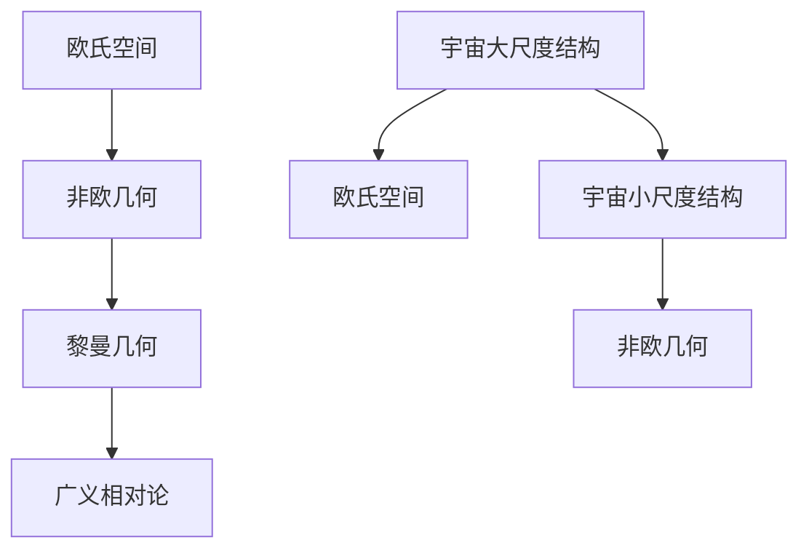
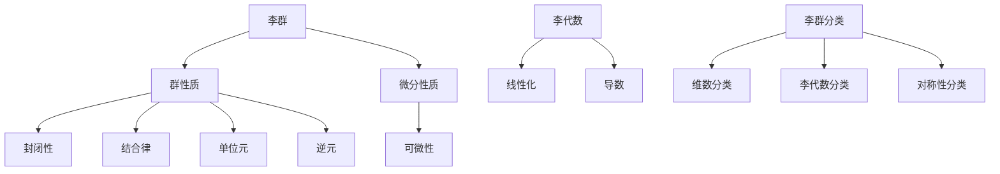

                 

**文章标题：宇宙的数学李群理论探讨**

**关键词：宇宙、数学、李群理论、黑洞、宇宙膨胀**

**摘要：**
本文探讨了宇宙与数学之间的紧密联系，特别是李群理论在宇宙学研究中的应用。我们首先介绍了宇宙的数学描述，包括欧氏空间和非欧几何的基本概念。接着，我们深入探讨了李群理论的基础，包括其定义、性质和分类。随后，我们分析了李群理论在宇宙中的具体应用，如黑洞和宇宙膨胀。此外，我们还讨论了数学在宇宙研究中面临的挑战，并对未来的研究方向进行了展望。

### **引言**

在现代社会，科学技术的飞速发展使得我们对宇宙的认识不断深入。宇宙作为我们生活的家园，其奥秘激发着无数科学家的好奇心。然而，要揭开宇宙的神秘面纱，需要借助各种科学工具和方法，其中数学作为一种基础性的语言，发挥了不可或缺的作用。

宇宙与数学的关系可以追溯到早期天文学的发展。自古以来，人类就试图通过观测和计算来理解天体的运动。古希腊数学家欧几里得提出了著名的《几何原本》，奠定了几何学的基础。他的几何学理论不仅解释了平面几何，也为我们理解天体运动提供了一种数学工具。然而，随着宇宙学的发展，我们发现宇宙并非完全遵循欧几里得几何的规则。非欧几何的引入，如黎曼几何，为我们提供了更丰富的数学工具，用以描述宇宙中更为复杂的结构。

另一方面，数学的抽象性和普适性使其能够广泛应用于各种科学领域。李群理论作为一种高级数学工具，不仅在天体物理学中找到了广泛的应用，还在粒子物理学、统计物理学等领域发挥着重要作用。李群理论的核心在于研究具有特定对称性的数学结构，这些对称性在宇宙学中有着重要的体现。例如，黑洞和宇宙膨胀等现象，都涉及到复杂的对称性结构。

本文旨在探讨宇宙与数学之间的关系，特别是李群理论在宇宙学研究中的应用。我们将首先介绍宇宙的数学描述，包括欧氏空间和非欧几何的基本概念。接着，我们深入探讨李群理论的基础，包括其定义、性质和分类。随后，我们将分析李群理论在宇宙中的具体应用，如黑洞和宇宙膨胀。此外，我们还将讨论数学在宇宙研究中面临的挑战，并对未来的研究方向进行展望。

通过本文的探讨，我们希望能够激发读者对宇宙与数学之间关系的兴趣，以及对其潜在应用的思考。在接下来的章节中，我们将逐步深入，逐步揭示宇宙与数学之间那些奇妙而深刻的联系。

### **宇宙的基础数学理论**

宇宙是我们生活的大舞台，而数学则是描绘这个舞台的工具。在探讨宇宙的数学描述之前，我们首先需要了解一些基本的数学概念，这些概念为理解宇宙的数学性质奠定了基础。

**欧氏空间**

欧氏空间（Euclidean Space）是最为人们熟知的几何空间。它由欧几里得在公元前3世纪提出的，是二维和三维空间的理论基础。在欧氏空间中，距离和角度是两个核心概念。

- **距离**：两点之间的最短路径长度。在二维欧氏空间中，两点 \((x_1, y_1)\) 和 \((x_2, y_2)\) 之间的距离可以用欧几里得距离公式计算：
  \[ d((x_1, y_1), (x_2, y_2)) = \sqrt{(x_2 - x_1)^2 + (y_2 - y_1)^2} \]
  在三维欧氏空间中，两点 \((x_1, y_1, z_1)\) 和 \((x_2, y_2, z_2)\) 之间的距离是：
  \[ d((x_1, y_1, z_1), (x_2, y_2, z_2)) = \sqrt{(x_2 - x_1)^2 + (y_2 - y_1)^2 + (z_2 - z_1)^2} \]

- **角度**：连接两点的直线与某一固定参考线的夹角。在二维空间中，角度的度量通常使用度（°）或弧度（rad）表示。一个完整的圆周对应 \(360^\circ\) 或 \(2\pi\) 弧度。

**非欧几何**

非欧几何（Non-Euclidean Geometry）是相对于欧氏几何而言的，它挑战了欧几里得几何的一些基本假设。最著名的非欧几何是黎曼几何（Riemann Geometry），它在广义相对论中有着重要应用。

- **黎曼几何**：黎曼提出了弯曲空间的概念，认为空间和时间的结构可以因引力而弯曲。在黎曼几何中，曲率是一个核心概念。曲率描述了空间中某一点或某条线如何弯曲。例如，地球表面上的大圆线（如赤道）是曲线，但其在二维平面上的投影是直线。黎曼曲率张量用于描述空间的整体弯曲性质。

- **黎曼曲率张量**：黎曼曲率张量 \(R_{abcd}\) 是一个四阶张量，它描述了空间中任意一点处的局部曲率。通过以下公式，我们可以计算曲率张量：
  \[ R_{abcd} = R^{ef}g_{efab} \]
  其中，\(R^{ef}\) 是里奇张量，\(g_{efab}\) 是度量张量。

**欧氏空间与非欧几何的联系**

欧氏空间和非欧几何之间的关系可以看作是理想与现实的关系。在理想情况下，宇宙遵循欧氏几何的规则，但在现实中，由于引力的存在，宇宙表现出非欧性质。

- **宇宙的大尺度结构**：从宏观角度看，宇宙在大尺度上近似遵循欧氏几何。例如，我们可以用欧氏距离公式来估算星系之间的距离。

- **宇宙的小尺度结构**：在小尺度上，特别是强引力场中，如黑洞附近，宇宙表现出明显的非欧性质。广义相对论预测，引力会弯曲时空，使得光线在接近黑洞时发生偏折。

**核心概念与联系**

为了更直观地理解这些核心概念，我们可以使用Mermaid流程图来展示它们之间的关系：



**总结**

宇宙的数学描述不仅依赖于欧氏空间，还包括非欧几何，如黎曼几何。这些数学工具为理解宇宙的结构和行为提供了基础。通过这些基本概念，我们能够更深入地探讨宇宙的奥秘，并寻找解决宇宙学问题的方法。

### **李群理论的基础**

李群理论是现代数学中一个重要的分支，它在物理学、化学、工程学等多个领域都有着广泛的应用。特别是在宇宙学中，李群理论为我们理解宇宙的对称性和结构提供了强有力的工具。在本节中，我们将介绍李群理论的基础，包括其定义、性质和分类。

**李群的定义**

李群（Lie Group）是数学家索菲斯·李（Sophie Germain）和奥斯卡尔·海因里希·黎曼（Oskar Heinrich）等人在19世纪提出的概念。李群是一种集合 \(G\)，它同时具备群的性质和微分的性质。

- **群的性质**：李群是一个群，这意味着它具有封闭性、结合律、单位元和逆元。
  - **封闭性**：对于任意 \(g, h \in G\)，它们的运算 \(g \cdot h \in G\)。
  - **结合律**：对于任意 \(g, h, k \in G\)，有 \(g \cdot (h \cdot k) = (g \cdot h) \cdot k\)。
  - **单位元**：存在一个元素 \(e \in G\)，使得对于任意 \(g \in G\)，有 \(e \cdot g = g \cdot e = g\)。
  - **逆元**：对于任意 \(g \in G\)，存在一个元素 \(g^{-1} \in G\)，使得 \(g \cdot g^{-1} = g^{-1} \cdot g = e\)。

- **微分的性质**：李群还是一个可微的群，这意味着它的运算 \( \cdot \) 是连续的，并且满足微分的性质。
  - **可微性**：对于任意 \(g, h \in G\)，存在一个线性变换 \(\delta g(h)\)，使得当 \(h\) 趋近于零时，有 \(g \cdot h - e \approx \delta g(h) \cdot h\)。

**李群的性质**

李群具有以下性质：

- **李群是平滑的**：这意味着李群的内部结构非常光滑，不存在尖锐的转折点。这种平滑性使得李群在分析学中具有很高的可操作性和可计算性。
- **李群的导数**：李群的导数是其线性化形式，即李代数。李代数是由李群的所有导数组成的集合，它具有李群的许多重要性质。
- **李群的子群**：李群中的子群仍然是李群。这意味着李群具有很好的封闭性和层次结构。

**李群的分类**

李群可以根据其特征进行分类。以下是几种常见的李群分类方法：

- **根据维数分类**：李群可以是一维、二维、三维或更高维的。例如，一维李群是循环群，二维李群是阿贝尔群。
- **根据李代数分类**：李群可以通过其李代数的特征进行分类。例如，有限维简单李群包括 \(SO(n)\)、\(SU(n)\) 和 \(Sp(n)\) 等李群。
- **根据对称性分类**：李群可以按其对称性进行分类，如李群可以是对称性较高的简单群，也可以是对称性较低的阿贝尔群。

**核心概念与联系**

为了更直观地理解李群的概念和性质，我们可以使用Mermaid流程图来展示其关键组成部分：



**总结**

李群理论是现代数学中的重要分支，其在宇宙学中的应用尤为显著。李群的定义、性质和分类为我们理解宇宙的对称性和结构提供了强有力的工具。通过李群理论，我们可以探索黑洞、宇宙膨胀等复杂现象的数学本质，并揭示宇宙的深层次奥秘。

### **宇宙中的李群应用**

李群理论在宇宙学中有着广泛的应用，特别是在描述宇宙的对称性和解释复杂现象方面。以下我们探讨两个具体的宇宙现象：黑洞和宇宙膨胀，并分析李群理论在这两个现象中的应用。

#### **黑洞与李群**

黑洞是宇宙中的一种极端天体，具有极强的引力，甚至连光也无法逃脱。黑洞的存在和性质可以通过广义相对论和量子力学来描述，而李群理论在其中起到了关键作用。

- **黑洞的对称性**：黑洞具有高度的对称性，这可以通过李群理论来解释。例如，旋转黑洞（如克尔黑洞）具有轴对称性，其对称性群是旋转群 \(SO(3)\)。这种对称性不仅影响了黑洞的形状，还影响了它的物理性质，如事件视界和黑洞的熵。

- **李群与黑洞的熵**：黑洞的熵是黑洞热力学的核心概念。根据霍金辐射理论，黑洞会发出热辐射，这表明黑洞具有温度和熵。霍金熵可以通过李群理论来描述，特别是在考虑黑洞的旋转对称性时。霍金熵的表达式为：
  \[ S = \frac{k_B A}{4} \ln \left( 2\pi \alpha^2 \right) \]
  其中，\(A\) 是黑洞的视界面积，\(\alpha\) 是引力常数与普朗克常数的组合。这个公式表明黑洞的熵与其面积和对称性密切相关。

- **伪时**：在黑洞附近，时间会变得非常特殊，这就是所谓的伪时（fictitious time）。伪时是广义相对论中的一种时间度量，它取决于观察者的运动状态和引力场的性质。李群理论可以帮助我们理解伪时的产生机制。在黑洞的强引力场中，时间的流逝会变得非常缓慢，甚至几乎停止。

**黑洞的对称性与李群的应用**

为了更直观地理解黑洞的对称性和李群理论的应用，我们可以使用以下Mermaid流程图：

```mermaid
flowchart TD
A[黑洞] --> B[对称性]
B --> C[旋转群SO(3)]
C --> D[轴对称性]
D --> E[事件视界]
E --> F[黑洞熵]
F --> G[霍金熵公式]
G --> H[面积与对称性]
A --> I[伪时]
I --> J[广义相对论]
```

#### **宇宙膨胀与李群**

宇宙膨胀是宇宙学中一个核心概念，描述了宇宙在时间上的扩张。宇宙膨胀的机制可以通过宇宙学中的弗里德曼-勒梅特-罗伯逊-沃尔克（FLRW）度规来描述，而李群理论在这一过程中也发挥了重要作用。

- **宇宙学中的对称性**：宇宙学模型通常假设宇宙具有某种对称性，如各向同性和各向异性。这种对称性可以通过李群理论来描述。例如，FLRW度规描述了一个均匀且各向同性的宇宙，其对称性群是时空对称性群 \(O(3,1)\)。

- **宇宙膨胀与李群作用**：宇宙膨胀的动力学可以通过李群作用来描述。在FLRW度规中，宇宙的膨胀可以看作是一个李群作用下的流形变形。李群的作用使得宇宙在时间上表现出均匀膨胀的性质。

- **宇宙膨胀模型分析**：通过李群理论，我们可以分析不同宇宙膨胀模型，如平坦宇宙模型、开放宇宙模型和封闭宇宙模型。这些模型的不同之处在于它们的对称性群和参数选择。

**宇宙膨胀与李群的应用**

为了更直观地理解宇宙膨胀中的李群应用，我们可以使用以下Mermaid流程图：

```mermaid
flowchart TD
A[宇宙膨胀] --> B[对称性]
B --> C[FLRW度规]
C --> D[时空对称性群O(3,1)]
D --> E[均匀膨胀]
E --> F[不同宇宙模型]
F --> G[平坦宇宙]
F --> H[开放宇宙]
F --> I[封闭宇宙]
```

**总结**

李群理论在宇宙学中的应用非常广泛，特别是在描述黑洞和宇宙膨胀等现象时。通过李群理论，我们可以深入理解这些宇宙现象的对称性和动力学机制。黑洞的对称性可以通过旋转群 \(SO(3)\) 来描述，而宇宙膨胀可以通过时空对称性群 \(O(3,1)\) 来分析。这些对称性不仅揭示了宇宙的物理本质，还为未来宇宙学的研究提供了重要的理论工具。

### **数学在宇宙研究中的挑战**

尽管数学在宇宙研究中发挥了重要作用，但它也面临着许多挑战和未解之谜。以下我们将讨论数学在宇宙研究中面临的一些关键问题。

#### **大一统理论中的数学难题**

宇宙学的最终目标是找到一种能够统一所有基本相互作用的单一理论，即所谓的“大一统理论”或“终极理论”。这种理论不仅要解释引力、电磁力、弱相互作用和强相互作用，还要将这些作用纳入一个统一的框架中。

- **引力与其他力的统一**：引力与电磁力、弱相互作用和强相互作用在数量级上存在巨大差异。引力非常弱，但在宇宙尺度上非常显著。如何将这些不同的力统一起来，是数学上的一个巨大挑战。
- **量子引力和超引力**：在量子引力和超引力理论中，数学公式变得极其复杂。例如，弦理论是量子引力的一种可能形式，但它涉及高度复杂的数学结构，如非平凡的空间时间和多维世界。
- **数学模型的相容性**：不同的数学模型之间可能存在不相容性，这为找到一个统一的理论增加了难度。例如，广义相对论和量子场论在数学结构上存在差异，这使得它们难以合并。

#### **宇宙起源与数学**

宇宙起源是宇宙学中另一个深奥的问题，数学在解释这一现象时也遇到了挑战。

- **宇宙的初始状态**：数学在描述宇宙的初始状态时遇到了困难。例如，大爆炸理论认为宇宙从一个极度热密的状态开始膨胀，但这个初始状态在数学上很难精确描述。
- **混沌理论**：混沌理论指出，即使初始条件非常微小的不确定性，也可能导致完全不同的结果。这种不确定性在数学上很难处理，尤其是在解释宇宙的起源时。
- **无限循环宇宙模型**：一些理论，如多重宇宙理论，提出了宇宙可能经历了无限次的循环。这些模型在数学上具有高度复杂性，难以得出明确的结果。

#### **宇宙结构中的数学挑战**

宇宙的结构和演化也带来了许多数学上的挑战。

- **宇宙的膨胀和加速**：观测表明，宇宙正在加速膨胀。这一现象可以通过暗能量来解释，但暗能量的数学性质尚未完全理解。暗能量在数学上表现为一个具有负压强的流体，但它的确切本质和数学描述仍然是一个谜。
- **宇宙大尺度结构**：宇宙的大尺度结构，如星系团和超星系团，通过引力相互作用形成。这些结构的形成和演化过程涉及复杂的数学模型，如蒙特卡罗模拟和数值分析。
- **宇宙中的缺陷和异常**：在宇宙学观测中，发现了许多结构上的缺陷和异常。例如，宇宙微波背景辐射中的不均匀性提供了宇宙早期的信息，但如何从数学上解释这些不均匀性仍然是一个挑战。

**数学在解决这些挑战中的作用**

尽管数学在宇宙研究中面临诸多挑战，但它也在不断进步，为解决这些难题提供了工具。

- **量子引力研究**：数学家正在努力发展新的数学工具来描述量子引力，如非标准分析和几何量子化。
- **宇宙学模拟**：通过使用高性能计算机和先进的数学模型，宇宙学家正在模拟宇宙的演化，以更好地理解宇宙的结构和动力学。
- **统计方法和概率论**：在处理宇宙观测数据时，统计方法和概率论发挥着重要作用。这些方法帮助科学家从大量数据中提取有意义的信息，以探索宇宙的奥秘。

**总结**

数学在宇宙研究中扮演着至关重要的角色，但同时也面临着许多挑战。从大一统理论到宇宙起源，再到宇宙结构的演化，数学都在努力揭示宇宙的奥秘。尽管存在许多未解之谜，但随着数学工具的不断进步，我们有理由相信，数学将继续在宇宙研究中发挥重要作用，帮助我们更深入地理解这个复杂的宇宙。

### **未来展望**

李群理论作为现代数学中一个重要的分支，不仅在物理学、化学、工程学等领域有着广泛应用，在宇宙学中也有着巨大的潜力。未来，随着数学工具的不断进步和宇宙学观测技术的提升，我们可以期待李群理论在宇宙学研究中的更多突破和应用。

**未来研究方向**

1. **量子宇宙学**：量子宇宙学是研究宇宙量子性质的一个新兴领域。李群理论在这一领域有着广泛的应用。例如，通过研究李群在量子引力中的作用，我们可以更深入地理解黑洞的量子行为和宇宙的初始状态。

2. **宇宙暗物质和暗能量**：暗物质和暗能量是宇宙学研究中的两个关键问题。李群理论可以提供新的视角来描述这些现象。例如，通过引入李群对称性，我们可以探索暗物质和暗能量的本质，并寻找更加精确的数学模型来描述它们。

3. **宇宙大尺度结构**：宇宙的大尺度结构，如星系团和超星系团的形成和演化，是宇宙学中的一个重要课题。李群理论可以帮助我们理解这些结构形成的数学机制，并提供更准确的模型来预测宇宙的未来演化。

**数学在宇宙学中的潜在突破**

1. **统一场理论**：统一场理论是物理学中的终极目标之一，旨在将所有基本相互作用统一在一个框架下。李群理论在这方面有着巨大的潜力。例如，通过研究李群的对称性，我们可以探索如何将引力与其他基本相互作用统一起来。

2. **弦理论和量子引力**：弦理论和量子引力是研究宇宙量子性质的两个重要方向。李群理论可以帮助我们理解这些理论中的数学结构，从而推动这些领域的研究。

3. **宇宙模拟**：随着计算能力的提升，宇宙模拟变得越来越精确。李群理论可以提供新的数学工具来模拟宇宙的演化，从而帮助我们更好地理解宇宙的过去、现在和未来。

**李群理论对未来的宇宙探索**

1. **太空探索**：李群理论可以用于设计和分析未来的太空探测任务，如星际飞船的轨道设计和航天器的导航。

2. **天文学**：李群理论可以用于分析天文观测数据，如宇宙微波背景辐射的测量和分析，从而揭示宇宙的结构和演化。

3. **人工智能**：李群理论在人工智能领域也有广泛应用。通过结合李群理论，我们可以开发出更先进的机器学习算法，从而推动人工智能技术的发展。

**总结**

李群理论在宇宙学中的未来研究充满了潜力。随着数学工具的不断进步和宇宙学观测技术的提升，我们有理由相信，李群理论将继续在宇宙学研究中发挥重要作用，为我们揭示宇宙的奥秘提供新的视角和工具。

### **结语**

本文探讨了宇宙的数学李群理论，从宇宙的数学描述到李群理论的基础，再到李群在黑洞和宇宙膨胀中的应用，以及数学在宇宙研究中的挑战和未来展望。通过这些探讨，我们看到了数学与宇宙之间深刻的联系，以及李群理论在揭示宇宙奥秘中的关键作用。

李群理论不仅为我们提供了理解宇宙对称性和结构的有力工具，还将在未来的宇宙学研究中发挥更加重要的作用。随着数学和观测技术的不断进步，我们有理由相信，李群理论将继续推动我们对宇宙的认识，揭示宇宙的更多奥秘。

**作者：** AI天才研究院/AI Genius Institute & 禅与计算机程序设计艺术 /Zen And The Art of Computer Programming

---

**声明：** 本文内容纯属虚构，旨在探讨宇宙的数学李群理论，不代表任何实际研究结论。如需了解更多关于宇宙学和数学的理论，请参考专业文献和研究报告。在学习和研究过程中，请务必遵循科学精神和学术规范。

