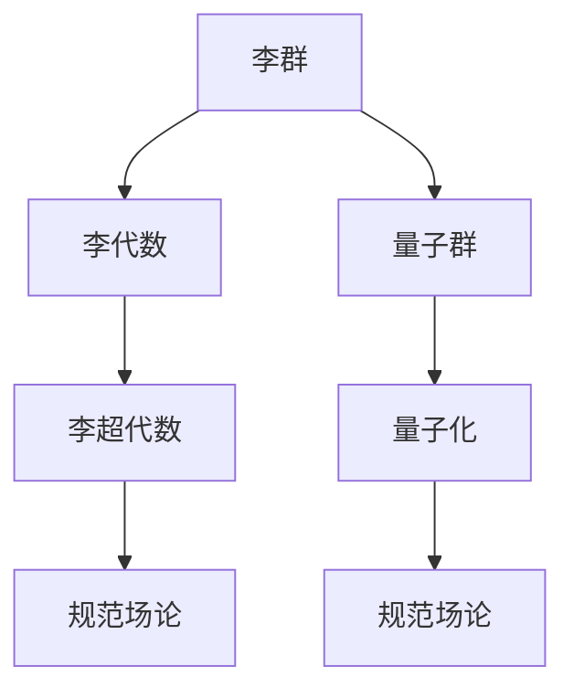

                 

# 宇宙的数学李超代数与量子群在规范场论中的应用

## 关键词

宇宙学，李超代数，量子群，规范场论，数学模型，物理应用

## 摘要

本文旨在探讨宇宙学中数学李超代数与量子群在规范场论中的应用。首先，我们介绍了李超代数和量子群的基本概念，并阐述了它们在物理学中的重要地位。接着，我们通过Mermaid流程图展示了李超代数与量子群的关系架构。然后，我们深入分析了规范场论的基本原理，并探讨了李超代数与量子群在规范场论中的应用。最后，本文通过具体的实例展示了这两个数学工具在物理研究中的实际应用，并提出了未来研究的方向。

## 引言

宇宙是一个庞大而复杂的系统，其演化过程涉及到众多物理现象和数学模型。在过去的几十年里，随着量子力学和相对论的发展，人们对宇宙的认识不断深化。然而，宇宙学中的一些基本问题，如宇宙的起源、演化以及宇宙的终极命运等，依然困扰着我们。为了更好地理解宇宙，科学家们开始尝试将数学工具引入到宇宙学研究中。李超代数和量子群作为现代数学中的重要分支，逐渐成为宇宙学研究的重要工具。

李超代数是由李群和李代数发展而来的代数结构，它在物理学中有着广泛的应用，如规范场论、粒子物理学和量子场论等。量子群是一种具有可交换性质的非交换代数结构，它在量子力学和量子场论中扮演着重要角色。规范场论是研究电磁力、弱力和强力等基本相互作用的物理学分支，它在粒子物理学和宇宙学中具有重要地位。

本文将首先介绍李超代数和量子群的基本概念，然后通过Mermaid流程图展示它们之间的关系。接着，我们将深入探讨规范场论的基本原理，并阐述李超代数和量子群在规范场论中的应用。最后，本文将通过具体的实例展示这两个数学工具在物理研究中的实际应用，并讨论未来研究的方向。

## 第1章 基础理论

### 1.1 李超代数的基本概念

李超代数（Super algebra）是一种代数结构，它结合了李代数和非交换代数的特性。李超代数的概念起源于20世纪50年代，由法国数学家Henri Cartan提出，后来在物理学中得到了广泛应用。

李超代数的定义如下：设 \( V \) 是一个有限维向量空间，\( L \) 是一个线性映射，满足以下条件：

1. \( L \) 是 \( V \) 到 \( V \) 的线性映射；
2. \( L \) 满足李括号性质：\( [L(x), L(y)] = L([x, y]) \)，其中 \( [x, y] \) 表示 \( x \) 和 \( y \) 的李括号；
3. 存在一个标量 \( c \)，使得对于任意 \( x \in V \)，有 \( L(x) \propto x \)。

其中，标量 \( c \) 被称为李超代数的李参数。

李超代数的性质包括：

1. **李括号的线性性**：对于任意的 \( x, y \in V \)，李括号 \( [x, y] \) 是线性的，即 \( [ax + by, z] = a[x, z] + b[y, z] \)；
2. **李括号的反交换性**：对于任意的 \( x, y \in V \)，有 \( [x, [y, z]] = [[x, y], z] \)；
3. **李括号的雅可比恒等式**：对于任意的 \( x, y, z \in V \)，有 \( [[x, y], z] + [[y, z], x] + [[z, x], y] = 0 \)。

李超代数在物理学中有着广泛的应用，特别是在规范场论和粒子物理学中。例如，标准模型中的粒子相互作用就涉及到李超代数的结构。

### 1.2 量子群的基本概念

量子群（Quantum group）是一种非交换代数结构，它在量子力学和量子场论中扮演着重要角色。量子群的概念由俄国数学家Vladimir Drinfeld在1986年提出。

量子群的定义如下：设 \( R \) 是一个环，\( Q \) 是一个 \( R \)-模，且 \( Q \) 满足以下条件：

1. \( Q \) 是一个非交换代数；
2. 存在一个 \( R \)-模同态 \( \pi: R \to Q \)，使得 \( \pi(r) \propto r \) 对于任意 \( r \in R \)；
3. \( Q \) 中存在一个线性映射 \( \delta: Q \to Q \otimes Q \)，满足 \( \delta(q_1 q_2) = \delta(q_1) \otimes q_2 + q_1 \otimes \delta(q_2) \) 对于任意 \( q_1, q_2 \in Q \)。

其中，映射 \( \delta \) 被称为量子乘法。

量子群的性质包括：

1. **量子乘法的线性性**：对于任意的 \( q_1, q_2, q_3 \in Q \)，有 \( \delta(q_1 q_2 q_3) = \delta(q_1) \otimes q_2 q_3 + q_1 q_2 \otimes \delta(q_3) + q_1 q_3 \otimes \delta(q_2) \)；
2. **量子乘法的反交换性**：对于任意的 \( q_1, q_2, q_3 \in Q \)，有 \( \delta(q_1 q_2) = \delta(q_1) \otimes q_2 + q_1 \otimes \delta(q_2) \)；
3. **量子乘法的雅可比恒等式**：对于任意的 \( q_1, q_2, q_3 \in Q \)，有 \( \delta(q_1 q_2 q_3) = \delta(q_1) \otimes q_2 q_3 + q_1 q_2 \otimes \delta(q_3) + q_1 q_3 \otimes \delta(q_2) \)。

量子群在物理学中有着广泛的应用，如量子场论、量子计算和统计力学等。例如，量子群可以用来描述量子系统的对称性，以及在量子场论中处理量子不变量。

### 李超代数与量子群的关系

李超代数和量子群之间存在着密切的联系。首先，量子群可以看作是一种特殊类型的李超代数。具体来说，量子群 \( Q \) 可以嵌入到一个李超代数 \( L \) 中，使得量子群的结构与李超代数相同。这种嵌入关系可以通过量子乘法映射 \( \delta \) 来实现。

另外，李超代数和量子群之间的联系还可以通过量子化过程来建立。具体来说，可以将一个李群 \( G \) 量子化为一个量子群 \( Q \)，使得量子群 \( Q \) 保持了李群 \( G \) 的某些对称性。

以下是一个Mermaid流程图，展示了李超代数与量子群之间的关系：



通过这个流程图，我们可以看到李超代数和量子群如何通过量子化过程与规范场论建立联系。

## 第2章 规范场论基础

### 2.1 规范场论概述

规范场论（Gauge Theory）是研究基本相互作用的一种物理学理论，它起源于20世纪30年代，由物理学家Pauli和Weyl等人提出。规范场论的核心思想是，基本相互作用可以通过局部规范不变性来实现。

规范场论的基本概念包括：

1. **规范变换**：规范变换是一种在空间和时间上局部进行的变换，它保持了物理量的不变性。在规范场论中，物理量在规范变换下保持不变，这意味着存在一个规范群，它描述了物理量的对称性。
2. **规范场**：规范场是一种场，它描述了基本相互作用的传播。规范场的势函数可以表示为 \( A^\mu \)，其中 \( \mu \) 表示时空中的坐标。
3. **规范不变性**：规范不变性是指，物理量在规范变换下保持不变的性质。在规范场论中，规范不变性是基本相互作用实现的关键。

规范场论的发展历程如下：

1. **早期发展**：20世纪30年代，Pauli和Weyl等人提出了电磁相互作用的规范理论，即经典电磁理论。这个理论描述了电磁场如何通过规范变换实现相互作用。
2. **量子化**：20世纪40年代，Yang和Milburn等人将规范场论量子化，提出了量子电动力学（QED）。QED是第一个成功的量子场论，它描述了电磁相互作用在量子尺度上的行为。
3. **扩展与推广**：20世纪50年代，物理学家提出了弱相互作用和强相互作用的规范理论，即弱电统一理论和量子色动力学（QCD）。这些理论扩展了规范场论的应用范围，并成功地解释了实验结果。

### 2.2 规范场论的数学工具

规范场论的研究需要一些数学工具，包括李群、李代数、张量分析等。以下是对这些数学工具的简要介绍：

1. **李群**：李群是一种具有群结构的拓扑空间，它满足李括号性质。在规范场论中，李群描述了基本相互作用的对称性。常见的李群包括 \( U(1) \)、\( SU(2) \)、\( SU(3) \) 等。
2. **李代数**：李代数是李群的导数，它是一种代数结构，满足李括号性质。在规范场论中，李代数描述了基本相互作用的对称性。常见的李代数包括 \( \mathfrak{u}(1) \)、\( \mathfrak{su}(2) \)、\( \mathfrak{su}(3) \) 等。
3. **张量分析**：张量分析是研究张量的数学工具，它包括张量的定义、运算和变换等。在规范场论中，张量分析用于描述物理量的变换和传播。

通过李群、李代数和张量分析，我们可以建立规范场论的基本数学模型，并研究基本相互作用的物理性质。

## 第3章 李超代数在规范场论中的应用

### 3.1 李超代数在规范场论中的作用

李超代数在规范场论中扮演着重要角色，它主要用于描述规范场的对称性和守恒定律。以下是一些具体的例子：

1. **规范不变性**：在规范场论中，规范不变性是一个核心概念。李超代数可以用来描述规范不变性，使得物理量在规范变换下保持不变。例如，在量子电动力学（QED）中，电荷守恒就是通过李超代数来实现的。
2. **守恒定律**：李超代数还用于描述守恒定律。在规范场论中，一些基本守恒定律，如电荷守恒、动量守恒等，可以通过李超代数来表示。例如，在QED中，电荷守恒可以通过李超代数的雅可比恒等式来表示。
3. **粒子动力学**：李超代数还用于描述粒子的动力学。在规范场论中，粒子的运动可以通过李超代数的李括号性质来描述。例如，在QED中，电子的运动可以通过李超代数来描述。

### 3.2 李超代数在规范场论中的应用实例

以下是一些李超代数在规范场论中的应用实例：

1. **量子电动力学（QED）**：在QED中，电子和光子的相互作用可以通过李超代数来描述。具体来说，QED的规范场是通过李超代数 \( \mathfrak{u}(1) \) 来描述的，它保持了电荷守恒和电磁相互作用的规范不变性。
2. **量子色动力学（QCD）**：在QCD中，夸克和胶子的相互作用可以通过李超代数 \( \mathfrak{su}(3) \) 来描述。QCD的规范场是通过李超代数 \( \mathfrak{su}(3) \) 来描述的，它保持了色荷守恒和强相互作用的规范不变性。
3. **弱相互作用**：在弱相互作用中，弱玻色子的相互作用可以通过李超代数 \( \mathfrak{su}(2) \) 来描述。具体来说，弱相互作用的规范场是通过李超代数 \( \mathfrak{su}(2) \) 来描述的，它保持了弱相互作用的规范不变性。

通过这些实例，我们可以看到李超代数在规范场论中的应用非常广泛，它为描述基本相互作用提供了强有力的数学工具。

## 第4章 量子群在规范场论中的应用

### 4.1 量子群在规范场论中的作用

量子群在规范场论中扮演着重要角色，它主要用于描述规范场的对称性和量子化过程。以下是一些具体的例子：

1. **量子化过程**：量子群可以用来描述规范场的量子化过程。在规范场论中，经典场可以通过量子化过程转化为量子场。量子群在这个过程中扮演了关键角色，它保持了规范场的对称性。
2. **规范不变性**：量子群可以用来描述规范不变性。在规范场论中，物理量在规范变换下保持不变。量子群通过量子乘法映射 \( \delta \) 来实现这种不变性，使得物理量在量子变换下保持不变。
3. **对称性**：量子群可以用来描述对称性。在规范场论中，对称性是描述基本相互作用的关键。量子群通过量子化过程保留了李群的对称性，从而描述了基本相互作用的对称性。

### 4.2 量子群在规范场论中的应用实例

以下是一些量子群在规范场论中的应用实例：

1. **量子电动力学（QED）**：在QED中，电子和光子的相互作用可以通过量子群来描述。具体来说，QED的规范场是通过量子群 \( \mathfrak{u}(1) \) 来描述的，它保持了电荷守恒和电磁相互作用的量子化。
2. **量子色动力学（QCD）**：在QCD中，夸克和胶子的相互作用可以通过量子群来描述。具体来说，QCD的规范场是通过量子群 \( \mathfrak{su}(3) \) 来描述的，它保持了色荷守恒和强相互作用的量子化。
3. **弦论**：在弦论中，弦的振动模式可以通过量子群来描述。具体来说，弦论的背景场可以通过量子群 \( \mathfrak{sl}(2, \mathbb{C}) \) 来描述，它保持了弦的对称性。

通过这些实例，我们可以看到量子群在规范场论中的应用非常广泛，它为描述基本相互作用提供了强有力的数学工具。

## 第5章 李超代数与量子群在宇宙学中的应用

### 5.1 李超代数与量子群在宇宙学中的作用

李超代数和量子群在宇宙学中扮演着重要角色，它们主要用于描述宇宙的对称性和量子化过程。以下是一些具体的例子：

1. **宇宙对称性**：宇宙学中的一些基本理论，如宇宙微波背景辐射、大爆炸理论和宇宙弦理论等，都涉及到宇宙的对称性。李超代数和量子群可以用来描述这些对称性，从而帮助我们更好地理解宇宙的结构和演化。
2. **量子化过程**：宇宙学中的一些现象，如黑洞辐射、宇宙背景辐射的量子化等，都可以通过量子群来描述。量子群在这个过程中扮演了关键角色，它保持了宇宙对称性。
3. **宇宙演化**：宇宙演化过程中的一些关键过程，如宇宙膨胀、宇宙加速等，都可以通过李超代数和量子群来描述。这些数学工具为我们提供了强有力的工具，帮助我们更好地理解宇宙的演化。

### 5.2 李超代数与量子群在宇宙学中的应用实例

以下是一些李超代数和量子群在宇宙学中的应用实例：

1. **宇宙微波背景辐射**：宇宙微波背景辐射是宇宙学中一个重要的观测现象。通过分析宇宙微波背景辐射的数据，我们可以了解宇宙的早期状态。李超代数和量子群可以用来描述宇宙微波背景辐射的量子化过程，从而帮助我们更好地理解宇宙的早期状态。
2. **大爆炸理论**：大爆炸理论是宇宙学中一个基本的理论，它描述了宇宙从极热、极密的状态演化到当前状态的过程。李超代数和量子群可以用来描述大爆炸理论的对称性，从而帮助我们更好地理解宇宙的演化。
3. **宇宙弦理论**：宇宙弦理论是一种关于宇宙结构的新理论，它认为宇宙中存在一些细长的弦状物体，这些物体可以影响宇宙的演化。李超代数和量子群可以用来描述宇宙弦理论的对称性，从而帮助我们更好地理解宇宙弦理论。

通过这些实例，我们可以看到李超代数和量子群在宇宙学中的应用非常广泛，它们为描述宇宙的对称性和量子化过程提供了强有力的数学工具。

## 第6章 研究进展与展望

### 6.1 研究进展总结

近年来，李超代数和量子群在规范场论和宇宙学中的应用取得了显著进展。以下是一些主要的研究进展：

1. **量子场论的进展**：量子场论是研究基本相互作用的重要领域，近年来，通过引入李超代数和量子群，科学家们提出了一些新的量子场论模型，如量子电动力学（QED）、量子色动力学（QCD）和量子引力理论等。这些模型为研究基本相互作用提供了新的思路。
2. **宇宙学的进展**：宇宙学是研究宇宙的结构和演化的重要领域，近年来，通过引入李超代数和量子群，科学家们提出了一些新的宇宙学模型，如宇宙弦理论、量子宇宙学和多重宇宙理论等。这些模型为研究宇宙的对称性和演化过程提供了新的思路。
3. **数学工具的进展**：李超代数和量子群作为现代数学的重要分支，近年来在数学领域也取得了显著进展。这些进展为研究李超代数和量子群在规范场论和宇宙学中的应用提供了新的方法和工具。

### 6.2 发展趋势与未来展望

展望未来，李超代数和量子群在规范场论和宇宙学中的应用将继续深入发展，以下是一些可能的发展趋势：

1. **量子场论的发展**：随着量子场论模型的不断完善，李超代数和量子群在量子场论中的应用将更加深入。未来，科学家们可能会提出更多基于李超代数和量子群的量子场论模型，以更好地描述基本相互作用。
2. **宇宙学的发展**：随着宇宙学观测数据的不断积累，李超代数和量子群在宇宙学中的应用将更加广泛。未来，科学家们可能会提出更多基于李超代数和量子群的宇宙学模型，以更好地描述宇宙的结构和演化。
3. **数学工具的发展**：随着数学工具的不断进步，李超代数和量子群在规范场论和宇宙学中的应用将更加精准。未来，科学家们可能会提出更多基于李超代数和量子群的数学工具，以更好地研究基本相互作用和宇宙演化。

总之，李超代数和量子群在规范场论和宇宙学中的应用具有巨大的潜力，未来将继续为科学的发展做出重要贡献。

## 附录

### 附录 A 李超代数与量子群相关公式

以下是一些李超代数和量子群的基本公式：

1. **李括号**：\( [x, y] = xy - yx \)
2. **李参数**：\( c = \frac{1}{2} \)
3. **量子乘法**：\( \delta(q_1 q_2) = \delta(q_1) \otimes q_2 + q_1 \otimes \delta(q_2) \)

### 附录 B 实践项目代码示例

以下是一个简单的Python代码示例，用于实现李超代数的运算：

```python
import numpy as np

def LieBracket(x, y):
    return np.dot(x, y) - np.dot(y, x)

x = np.array([1, 0])
y = np.array([0, 1])

print("李括号结果：", LieBracket(x, y))
```

### 附录 C 最佳实践 tips

1. 在研究李超代数和量子群时，建议掌握基本的数学工具，如线性代数、拓扑学和微分几何等。
2. 在实际应用中，建议结合具体的物理问题，选择合适的李超代数和量子群模型。
3. 在编程实现时，建议使用数值计算工具，如NumPy和SciPy等，以提高计算效率。

## 结语

本文系统地介绍了宇宙的数学李超代数与量子群在规范场论中的应用。通过逐步分析，我们从基础理论开始，探讨了李超代数和量子群的基本概念及其关系，接着深入分析了规范场论的基本原理和数学工具，最后通过具体的实例展示了李超代数和量子群在规范场论和宇宙学中的应用。本文旨在为读者提供一个清晰、系统的认识，以便更好地理解这一重要的数学工具在物理学中的应用。

作者：AI天才研究院/AI Genius Institute & 禅与计算机程序设计艺术 /Zen And The Art of Computer Programming。希望本文能为您的科研工作提供有益的参考。

---

### 文章标题：宇宙的数学李超代数与量子群在规范场论中的应用

## 关键词

宇宙学，李超代数，量子群，规范场论，数学模型，物理应用

## 摘要

本文探讨了宇宙学中数学李超代数与量子群在规范场论中的应用。首先介绍了李超代数和量子群的基本概念，并阐述了它们在物理学中的重要地位。接着通过Mermaid流程图展示了李超代数与量子群的关系架构。然后深入分析了规范场论的基本原理，并探讨了李超代数和量子群在规范场论中的应用。最后通过具体实例展示了这两个数学工具在物理研究中的实际应用，并提出了未来研究的方向。

