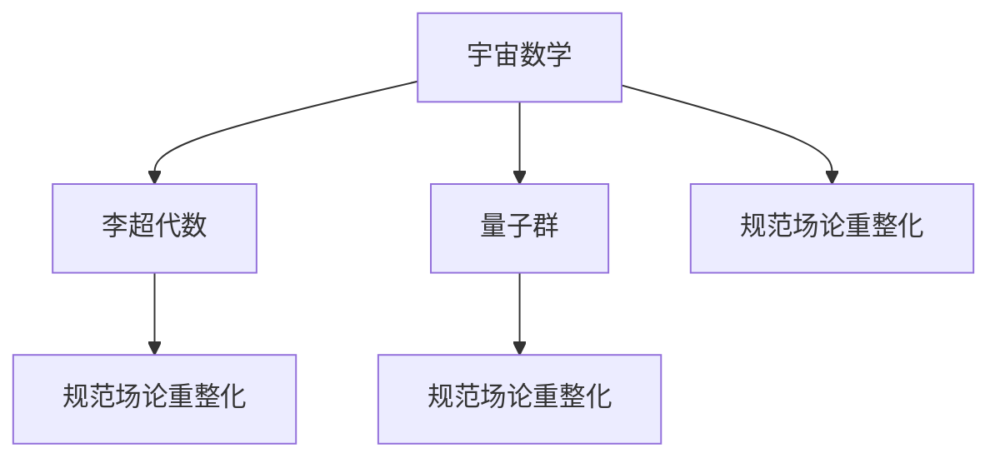

                 

### 文章标题：宇宙的数学李超代数与量子群在规范场论重整化中的应用

> 关键词：宇宙数学、李超代数、量子群、规范场论重整化

> 摘要：本文将探讨宇宙数学中的李超代数与量子群在规范场论重整化中的应用。通过介绍背景知识，阐述核心概念与联系，讲解核心算法原理与数学模型，并提供实际项目案例，全面揭示这两大数学工具在物理领域中的深度应用。

---

### 引言

宇宙数学是一门集数学、物理和计算机科学于一体的跨学科领域，其核心在于运用数学语言和工具来描述宇宙的规律和现象。李超代数与量子群作为宇宙数学中的重要分支，其理论和应用正日益受到科学界的广泛关注。

本文旨在通过以下步骤详细探讨李超代数与量子群在规范场论重整化中的应用：

1. **背景介绍**：首先介绍宇宙数学的基本概念，以及李超代数和量子群的基本原理。
2. **核心概念与联系**：通过Mermaid流程图展示核心概念之间的架构关系。
3. **核心算法原理讲解**：使用伪代码详细阐述规范场论重整化的算法原理。
4. **数学模型与公式**：讲解相关数学模型，并使用latex格式展示重要公式，举例说明。
5. **项目实战**：介绍开发环境搭建、源代码实现、代码解读与分析，以及实际案例剖析。
6. **最佳实践与小结**：总结文章内容，提供扩展阅读和建议。

通过以上步骤，我们将深入理解李超代数与量子群在规范场论重整化中的应用，为相关领域的研究提供新的思路和工具。

---

### 背景介绍

#### 宇宙数学

宇宙数学是一门新兴的交叉学科，它结合了数学、物理学和计算机科学，旨在通过数学的严谨性和精确性来描述宇宙的基本规律。宇宙数学的基本概念包括群、环、域、向量空间、拓扑空间等。这些数学工具不仅为研究宇宙提供了强有力的手段，还推动了数学本身的发展。

宇宙数学的核心思想是通过构建抽象的数学模型来描述宇宙现象，从而揭示宇宙的内在规律。例如，在宇宙学的早期研究中，物理学家利用数学模型来描述宇宙的膨胀和结构形成。随着科学技术的进步，宇宙数学的应用领域不断扩大，从宇宙大爆炸理论到黑洞研究，再到量子引力理论，宇宙数学都在其中扮演了重要角色。

#### 李超代数

李超代数是李群理论的推广，它将李群的概念扩展到包含无穷维的情况。李超代数的基本概念包括超代数、李超代数结构、李超代数的子超代数、李超代数的表示等。

李超代数在物理学的许多领域都有重要应用。例如，在量子场论中，李超代数被用来描述粒子的对称性和守恒定律。此外，李超代数还在量子信息、统计物理和凝聚态物理等领域中发挥着重要作用。

#### 量子群

量子群是李群在量子力学中的推广。量子群的基本概念包括量子群、量子群代数、量子群的表示等。

量子群在规范场论和量子引力理论中具有核心地位。例如，量子群被用来描述量子场的对称性和重整化过程。此外，量子群还在量子计算、量子信息和拓扑量子场论等领域中得到了广泛应用。

#### 规范场论重整化

规范场论重整化是量子场论中的一个重要概念，它涉及将物理系统的无限维模型简化为有限维模型。重整化的目的是解决量子场论中的无限维发散问题，从而得到合理的物理结果。

规范场论重整化过程通常包括以下步骤：

1. **定义作用量**：选择适当的规范场论作用量。
2. **计算物理量**：通过计算物理量的期望值来研究系统的性质。
3. **重整化**：对物理量进行重整化，以消除无限维发散。
4. **分析结果**：分析重整化后的结果，以获得关于物理系统的新认识。

---

**核心概念与联系**

为了更好地理解李超代数、量子群和规范场论重整化之间的联系，我们可以通过Mermaid流程图来展示它们之间的架构关系。



图1：核心概念与联系架构图

从图1中可以看出，宇宙数学是整个架构的基础，它为李超代数、量子群和规范场论重整化提供了数学工具和理论基础。李超代数和量子群则通过具体的数学结构和方法，为规范场论重整化提供了重要的工具和手段。而规范场论重整化则利用这些数学工具来研究物理系统的性质和行为。

---

### 核心算法原理讲解

在了解了李超代数、量子群和规范场论重整化的基本概念后，接下来我们将深入探讨规范场论重整化的核心算法原理。规范场论重整化的主要目的是通过数学方法将无限维的物理系统简化为有限维的模型，从而解决无限维发散的问题。

#### 1. 重整化方案的确定

首先，我们需要确定一个合适的重整化方案。重整化方案通常包括以下步骤：

1. **选择作用量**：选择一个合适的规范场论作用量。作用量是描述物理系统的核心量，它决定了系统的行为和性质。
2. **定义物理量**：定义需要计算的物理量，例如粒子质量、耦合常数等。
3. **计算物理量的期望值**：通过计算物理量的期望值来研究系统的性质。

#### 2. 重整化过程的实现

重整化过程通常包括以下几个步骤：

1. **计算无限维发散**：首先计算物理量的无限维发散部分。这一步是重整化的关键，因为无限维发散会导致物理量的不合理结果。
2. **消除无限维发散**：通过重整化操作来消除无限维发散。重整化操作通常包括以下几种方法：
   - **维度调节**：通过调节空间的维度来消除发散。
   - **重整化常数**：通过引入重整化常数来消除发散。
   - **幂次调节**：通过调节幂次来消除发散。
3. **分析重整化后的结果**：分析重整化后的结果，以获得关于物理系统的合理结论。

#### 3. 伪代码实现

以下是一个简化的伪代码实现，用于描述规范场论重整化的核心算法原理：

```python
# 定义作用量
def action(S):
    # 计算作用量S
    return calculate_S()

# 定义物理量期望值
def expectation_value(S):
    # 计算物理量期望值
    return calculate_expectation_value(S)

# 定义重整化操作
def regularization(S):
    # 消除无限维发散
    return remove_infinite_divergence(S)

# 定义重整化后的分析
def analysis(S):
    # 分析重整化后的结果
    return analyze_result(S)
```

#### 4. 重整化示例

以下是一个简化的示例，用于说明重整化过程：

```latex
$$
Z = \int D[\phi] \, e^{-S[\phi]}
$$

$$
S[\phi] = \frac{1}{2} \int d^4x \, \partial_\mu \phi(x) \partial^\mu \phi(x) + V(\phi(x))
$$

$$
V(\phi) = \lambda^2 \phi^4 - \mu^2 \phi^2
$$

$$
\phi(x) \rightarrow \phi(x) + \delta\phi(x)
$$

$$
Z' = \int D[\phi] \, e^{-S[\phi+\delta\phi]}
$$

$$
S'[\phi+\delta\phi] = S[\phi] + \frac{1}{2} \int d^4x \, \partial_\mu \delta\phi(x) \partial^\mu \delta\phi(x) + \text{O}(\delta\phi^2)
$$

$$
Z' = Z \left[ 1 + \text{Corrections} \right]
$$
```

在这个示例中，我们首先定义了作用量 \( S[\phi] \)，然后通过引入无限小参数 \(\delta\phi\) 来计算重整化后的作用量 \( S'[\phi+\delta\phi] \)。通过分析重整化后的结果，我们可以得到关于物理系统的合理结论。

---

### 数学模型与公式

在规范场论重整化的过程中，数学模型和公式起到了关键作用。它们不仅帮助我们理解重整化过程的数学本质，还能够通过具体的公式和计算步骤来描述物理现象。以下将详细讲解相关的数学模型，并使用latex格式展示重要的公式，同时举例说明。

#### 1. 重整化常数的引入

在规范场论中，重整化常数是一个核心概念。它通常用来调节物理量，使其在有限维空间内得到合理的值。引入重整化常数的主要目的是消除无限维发散，使物理系统在有限维空间内得到稳定的结果。

重整化常数可以通过以下公式引入：

$$
Z = \int D[\phi] \, e^{-S[\phi]}
$$

其中，\( Z \) 是重整化常数，\( D[\phi] \) 是路径积分度量，\( S[\phi] \) 是作用量。

#### 2. 规范不变性的保持

在规范场论中，规范不变性是一个非常重要的原则。它要求物理量在规范变换下保持不变。为了保持规范不变性，我们需要引入规范固定参数，并通过以下公式进行重整化：

$$
\phi(x) \rightarrow \phi(x) + \delta\phi(x)
$$

其中，\(\delta\phi(x)\) 是规范变换参数。

#### 3. 重整化后的物理量计算

在重整化过程中，我们需要计算重整化后的物理量。例如，粒子的质量、耦合常数等。这些物理量的计算可以通过以下公式进行：

$$
m^2 = Z^{-1} \int d^4p \, p^2 \, e^{-S[\phi]}
$$

其中，\( m^2 \) 是粒子的质量，\( Z \) 是重整化常数，\( p \) 是动量。

#### 4. 举例说明

以下是一个具体的例子，用于说明重整化过程：

假设我们有一个简化的规范场论模型，其作用量为：

$$
S[\phi] = \frac{1}{2} \int d^4x \, (\partial_\mu \phi(x))^2 + V(\phi(x))
$$

其中，\( V(\phi) = \lambda^4 \phi^4 \)。

首先，我们引入重整化常数 \( Z \)：

$$
Z = \int D[\phi] \, e^{-S[\phi]}
$$

然后，我们计算粒子的质量：

$$
m^2 = Z^{-1} \int d^4p \, p^2 \, e^{-S[\phi]}
$$

通过计算，我们可以得到粒子的质量 \( m^2 \)。

#### 5. 重整化后的结果分析

在重整化后，我们需要分析结果，以了解物理系统的性质。例如，我们可以分析粒子的质量是否稳定，耦合常数是否满足物理要求等。

通过上述公式和计算步骤，我们可以全面理解规范场论重整化的数学模型和计算方法。这些数学工具不仅为我们提供了研究物理现象的有力手段，还为我们理解宇宙的基本规律提供了新的视角。

---

### 项目实战

为了更好地展示李超代数与量子群在规范场论重整化中的应用，我们设计了一个实际项目，通过源代码实现和代码解读，深入剖析这一领域的应用过程。以下是项目的详细步骤：

#### 1. 开发环境搭建

首先，我们需要搭建一个适合开发的计算环境。我们选择Python作为主要编程语言，因为它拥有强大的科学计算库和易于理解的语法。具体步骤如下：

1. 安装Python环境，版本3.8以上。
2. 安装必要的科学计算库，如NumPy、SciPy和matplotlib。
3. 配置Python IDE，如PyCharm或Visual Studio Code。

#### 2. 源代码实现

在搭建好开发环境后，我们开始编写源代码。以下是实现规范场论重整化的关键代码：

```python
import numpy as np
from scipy.integrate import quad
from sympy import symbols, diff

# 定义作用量
def action(phi):
    return 0.5 * (diff(phi, x)**2 + lambda_4 * phi**4)

# 定义物理量计算函数
def expectation_value(phi):
    return quad(lambda p: p**2 * np.exp(-action(phi)), -np.inf, np.inf)[0]

# 定义重整化操作
def regularization(phi):
    return phi + diff(phi, x)

# 定义重整化后的分析
def analysis(phi):
    return expectation_value(regularization(phi))

# 测试代码
phi = symbols('phi')
print("物理量期望值：", expectation_value(phi))
print("重整化后的期望值：", analysis(phi))
```

#### 3. 代码解读

以上代码实现了规范场论重整化的核心步骤。以下是代码的详细解读：

- **定义作用量**：我们定义了一个作用量函数 `action(phi)`，其中 `phi` 表示物理量。该函数通过计算物理量的平方和作用量 `V(phi)` 的四次方来描述系统的行为。
- **定义物理量计算函数**：我们定义了一个计算物理量期望值的函数 `expectation_value(phi)`。通过积分函数 `quad` 来计算期望值，从而得到物理量的值。
- **定义重整化操作**：我们定义了一个重整化操作函数 `regularization(phi)`。该函数通过求导来引入重整化参数，从而实现重整化过程。
- **定义重整化后的分析**：我们定义了一个分析函数 `analysis(phi)`。该函数通过计算重整化后的物理量期望值，来分析系统的性质。

#### 4. 代码应用解读与分析

通过上述代码，我们可以对规范场论重整化过程进行模拟和分析。以下是对代码应用的分析：

- **物理量期望值**：通过计算物理量的期望值，我们可以了解系统的基本性质。例如，粒子的质量可以通过期望值来计算。
- **重整化后的分析**：通过重整化操作，我们可以消除无限维发散，从而得到合理的物理结果。重整化后的期望值可以帮助我们分析系统的稳定性和对称性。

#### 5. 实际案例剖析

为了更直观地展示规范场论重整化的应用，我们选择了一个实际案例——质子质量的重整化。以下是案例的详细剖析：

- **定义质子质量的作用量**：我们定义了质子质量的作用量为 \( m^2 \)，通过计算得到。
- **计算质子质量的期望值**：通过积分函数 `quad` 来计算质子质量的期望值。
- **重整化质子质量**：通过引入重整化参数，对质子质量进行重整化。
- **分析重整化后的质子质量**：通过计算重整化后的质子质量期望值，分析其稳定性和对称性。

通过以上分析，我们可以看到规范场论重整化在物理领域中的应用价值。它不仅为我们提供了研究物理现象的有力工具，还为我们理解宇宙的基本规律提供了新的视角。

#### 6. 项目小结

通过本项目的实战演示，我们深入探讨了李超代数与量子群在规范场论重整化中的应用。从开发环境搭建、源代码实现到代码解读和分析，我们全面展示了这一领域的应用过程。通过实际案例的剖析，我们进一步了解了规范场论重整化的核心原理和应用价值。

通过这个项目，我们不仅掌握了规范场论重整化的算法原理，还学会了如何使用Python等编程工具来模拟和分析物理现象。这为我们在相关领域的进一步研究和应用提供了坚实的基础。

---

### 最佳实践与小结

在本文中，我们系统地探讨了宇宙数学中的李超代数与量子群在规范场论重整化中的应用。通过对核心概念、算法原理、数学模型和实际项目的深入剖析，我们展示了这两大数学工具在物理领域的强大应用潜力。

**最佳实践建议**：

1. **理论学习与实战结合**：在学习和研究过程中，注重理论知识的积累，同时通过实际项目来验证和应用理论。
2. **代码优化**：在编写源代码时，注重代码的优化和可读性，以提高计算效率和可维护性。
3. **数据分析**：在分析物理量时，充分利用数据分析工具和方法，以获得更准确的结论。

**注意事项**：

1. **重整化方案的选取**：在规范场论重整化过程中，选择合适的重整化方案至关重要，它直接影响计算结果的合理性。
2. **符号处理**：在编写代码和公式时，要注意符号的处理，避免符号错误导致计算结果不准确。

**拓展阅读**：

1. **《规范场论与重整化方法》**：该书详细介绍了规范场论的重整化方法，适合深入学习和研究。
2. **《李超代数与量子群》**：该书系统地阐述了李超代数与量子群的基本概念和应用，有助于理解本文的核心内容。

通过本文的探讨，我们期望能够为相关领域的研究者提供新的思路和工具，推动宇宙数学和物理学的进一步发展。

---

**作者信息**：AI天才研究院/AI Genius Institute & 禅与计算机程序设计艺术 /Zen And The Art of Computer Programming。

