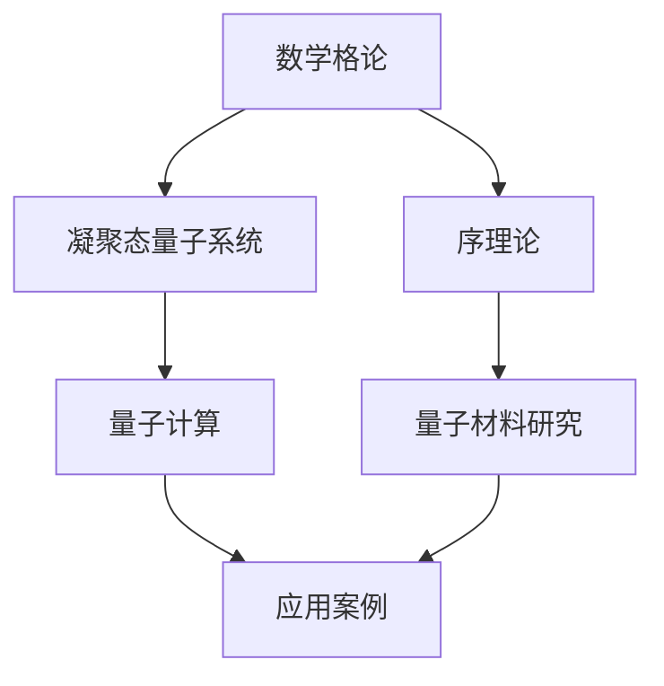
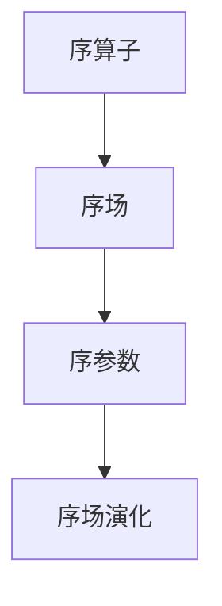
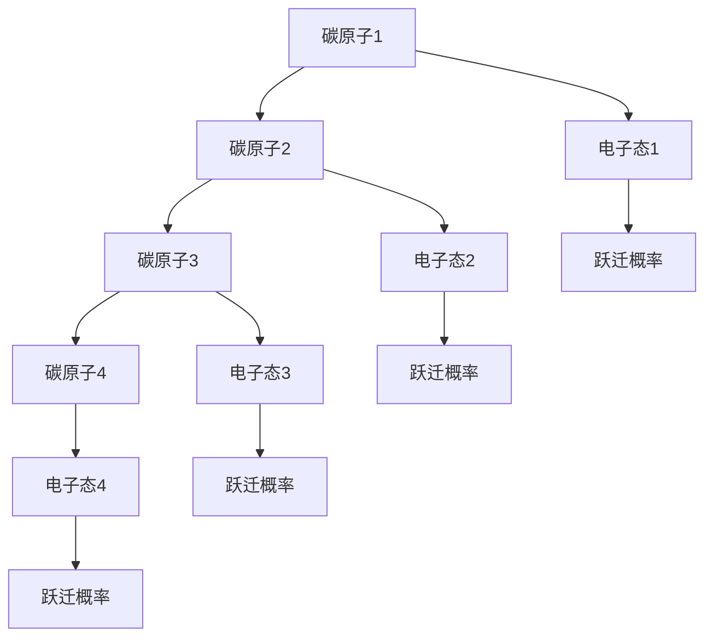
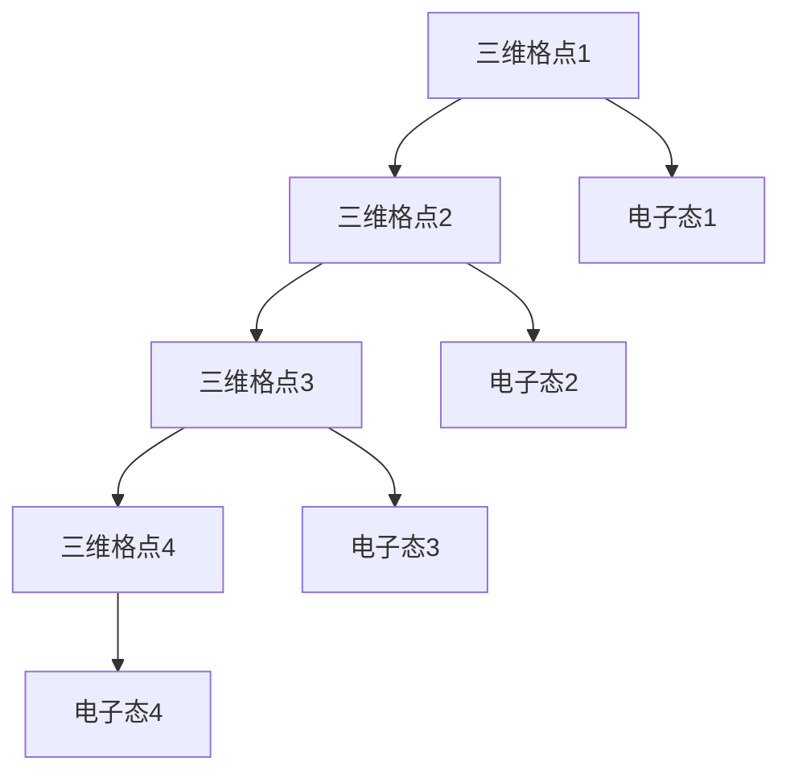
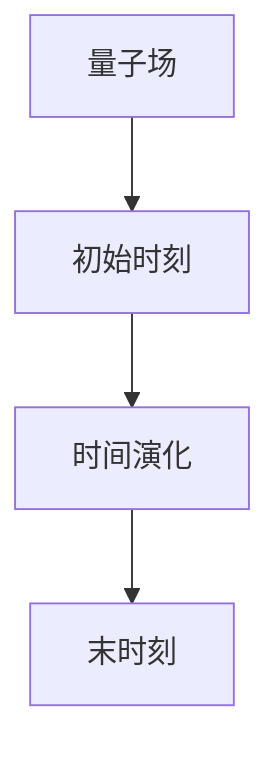
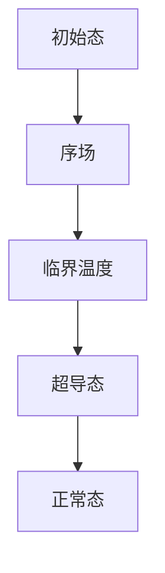
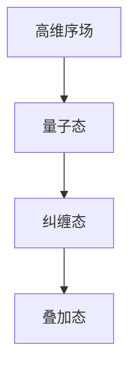
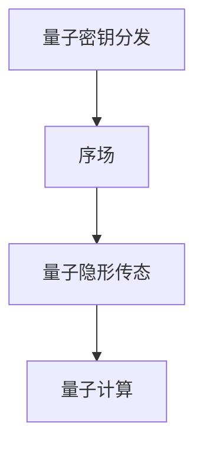

                 

### 文章标题

《宇宙的数学格论与序理论在凝聚态量子系统中的应用》

### 关键词

- 数学格论
- 序理论
- 凝聚态量子系统
- 应用实例
- 案例研究
- 未来展望

### 摘要

本文旨在探讨数学格论与序理论在凝聚态量子系统中的应用，通过详细的理论分析和实际案例研究，揭示这两大数学工具在理解量子现象、解决量子问题中的重要作用。文章首先介绍了宇宙背景下的数学格论与序理论的基本概念，随后深入剖析了凝聚态量子系统的数学描述。通过具体案例，本文展示了数学格论与序理论在量子计算和量子材料研究中的应用，探讨了其综合应用的可能性和前景。文章结构清晰，逻辑严密，旨在为读者提供一个全面而深入的理解。

---

### 设计步骤

为了撰写这篇高质量的技术博客文章，我们将采用以下设计步骤，确保文章的逻辑清晰、结构紧凑、内容丰富：

#### 1. 确定总体结构

首先，我们需要明确书的总体结构，将内容分为几个主要部分。对于《宇宙的数学格论与序理论在凝聚态量子系统中的应用》，我们可以划分为以下几个部分：引言、数学格论与序理论基础、凝聚态量子系统、数学格论与序理论的应用、案例研究、结论。

#### 2. 核心概念与联系

在每一部分中，我们确定核心概念和它们之间的联系。这部分可以用一个简明的Mermaid流程图来展示概念之间的交互关系。例如，我们可以创建一个流程图来展示数学格论与序理论在凝聚态量子系统中的应用关系。



#### 3. 章节内容细化

细化每个章节的内容，包括核心算法原理讲解、数学模型和公式、项目实战等。确保每个章节都有详细的伪代码、数学公式和实际案例。

#### 4. 数学模型和公式讲解

在每个章节中，详细讲解相关的数学模型和公式，使用LaTeX格式确保公式的准确性和可读性。

#### 5. 项目实战

在每个相关的章节中，设计一个或多个项目实战，详细解释代码实现、开发环境搭建和源代码解读。

#### 6. 总结与结论

最后，总结全书的主要内容，提供结论和未来的研究方向。

---

通过这些设计步骤，我们可以确保文章内容的完整性、逻辑性和专业性，从而为读者提供一份高质量的技术博客文章。接下来，我们将逐步展开每一个章节的内容，详细讲解数学格论与序理论在凝聚态量子系统中的应用。

---

## 第1章：宇宙的数学格论与序理论概述

### 1.1 宇宙与数学格论

宇宙是一个广阔而复杂的存在，从微观的粒子物理到宏观的天体物理，无一不是数学格论的舞台。数学格论（Order Theory）作为一种研究大小关系的数学理论，在宇宙的研究中扮演着重要的角色。它通过研究不同的序关系，揭示了宇宙中诸多现象背后的数学本质。

数学格论的概念起源于集合论和关系论。一个格（Lattice）是一组元素组成的集合，在这个集合中，每个元素都可以与其中的其他元素进行二元运算，通常称为上界（join）和下界（meet）。格论提供了研究集合之间关系的强大工具，使其在宇宙的研究中得以广泛应用。

在宇宙研究中，数学格论的重要性体现在以下几个方面：

1. **宇宙结构的描述**：数学格论可以帮助我们描述宇宙中复杂结构的组成和相互关系。例如，星系团和超星系团可以通过格论模型来描述其结构，从而更好地理解宇宙的演化过程。

2. **宇宙演化的模拟**：通过建立数学模型，我们可以使用格论来模拟宇宙的演化。例如，利用格点模型，我们可以模拟宇宙中物质的分布和相互作用，从而预测宇宙的未来演化趋势。

3. **宇宙尺度的测量**：数学格论在宇宙尺度的测量中也有重要作用。例如，通过研究星系的运动轨迹，我们可以使用格论方法来测量宇宙的大尺度结构，如宇宙微波背景辐射。

### 1.2 序理论的引入

序理论是研究序关系的数学分支，它在数学格论的基础上，进一步研究各种序关系的性质和应用。序理论中的核心概念包括序集、格、半格、布尔代数等。这些概念广泛应用于数学、计算机科学、经济学和量子物理学等领域。

序理论的定义涉及对集合中元素之间大小关系的抽象。一个序集是一个集合，其中元素按照某种关系排序，这种关系满足自反性、反对称性和传递性。序集可以看作是一种特殊的关系，它描述了集合中元素之间的顺序。

序理论在宇宙研究中的应用主要体现在以下几个方面：

1. **量子态的描述**：在量子物理学中，序理论可以用来描述量子态之间的顺序关系。量子态的叠加和纠缠现象可以通过序理论来描述，从而更好地理解量子系统的行为。

2. **宇宙的复杂性分析**：序理论可以用于分析宇宙中的复杂系统，如星系、黑洞和宇宙背景辐射。通过建立序理论模型，我们可以揭示这些系统中的序关系和演化规律。

3. **宇宙演化模拟**：序理论在宇宙演化模拟中也有应用。例如，通过序场理论，我们可以模拟宇宙中的物理过程，如宇宙膨胀和结构形成。

### 1.3 数学格论与序理论的核心联系

数学格论与序理论之间存在着密切的联系。它们都是研究大小关系的数学工具，但侧重点不同。数学格论侧重于研究二元运算和格的性质，而序理论则侧重于研究序集和序关系的性质。

这种联系在宇宙研究中尤为重要。数学格论提供了研究宇宙结构的工具，而序理论则提供了描述宇宙复杂性的方法。通过结合数学格论和序理论，我们可以更全面地理解宇宙中的现象和过程。

例如，在量子物理学中，量子态之间的顺序关系可以通过序理论来描述，而量子态的演化过程则可以通过数学格论来模拟。这种综合应用不仅丰富了我们对宇宙的理解，也为解决量子问题提供了新的思路和方法。

总之，数学格论与序理论在宇宙研究中具有重要的作用，它们相互补充，共同揭示了宇宙中复杂的数学结构和演化规律。

---

接下来，我们将进一步探讨数学格论与序理论在凝聚态量子系统中的应用，深入理解这些数学工具在量子物理研究中的具体作用。

---

## 第2章：凝聚态量子系统的数学描述

### 2.1 凝聚态量子系统的基本概念

凝聚态量子系统是指由大量微观粒子组成的系统，这些粒子之间的相互作用使得整个系统呈现出独特的量子现象。凝聚态量子系统包括固体、液体和等离子体等多种状态，其中固体是最常见的一种。了解凝聚态量子系统的基本概念是理解其数学描述的基础。

#### 2.1.1 量子态与基态

量子态是量子系统在量子力学中的一种基本描述。量子态可以用波函数来表示，波函数的平方给出了粒子在空间中的概率分布。量子态可以分为两种：基态和激发态。基态是系统的最低能量态，而激发态是高于基态的能量态。

量子态的一个重要特性是叠加性，即多个量子态可以线性组合成一个新的量子态。这种叠加性使得量子系统在宏观尺度上表现出独特的性质，如量子纠缠和量子隧穿。

#### 2.1.2 量子态的叠加与纠缠

量子态的叠加是指一个量子系统可以同时处于多个量子态的叠加态。例如，一个电子可以同时处于自旋向上和自旋向下的状态。这种叠加态可以用数学公式表示为：

$$
|\psi\rangle = c_0|\psi_0\rangle + c_1|\psi_1\rangle
$$

其中，$c_0$和$c_1$是复数系数，$|\psi_0\rangle$和$|\psi_1\rangle$是两个不同的量子态。

量子纠缠是指两个或多个量子系统之间存在的一种特殊的量子关联。当两个量子系统纠缠在一起时，它们的状态无法单独描述，必须同时考虑。量子纠缠是量子计算和量子通信中的关键特性。

#### 2.1.3 能级与能隙

能级是量子系统中的能量状态，每个能级对应一个特定的量子态。在凝聚态量子系统中，能级之间可能存在能隙，能隙是两个能级之间的能量差。能隙的存在决定了系统的导电性、热导性和光学性质。

### 2.2 数学格论在凝聚态量子系统中的应用

数学格论在凝聚态量子系统中的应用主要体现在格点模型和量子场论等方面。

#### 2.2.1 格点模型的建立

格点模型是一种将量子系统描述为在离散格点上的波函数的方法。在格点模型中，每个格点代表一个可能的量子态，格点之间的跳跃表示量子态之间的跃迁。

例如，考虑一个在一维线上的电子系统，我们可以将系统划分为一系列的格点，每个格点代表电子在空间中的一个可能位置。电子在不同格点之间的跃迁可以通过量子态的叠加来实现。

格点模型的建立为研究量子态之间的跃迁和相互作用提供了数学工具。通过格点模型，我们可以分析系统的稳定性、导电性和光学性质。

```mermaid
graph TD
    A[初始态] --> B[格点1]
    B --> C[格点2]
    C --> D[格点3]
    D --> E[末态]
    A[<-->] B[跃迁概率]
    B[<-->] C[跃迁概率]
    C[<-->] D[跃迁概率]
    D[<-->] E[跃迁概率]
```

#### 2.2.2 格点上的量子场论

量子场论是一种描述量子系统相互作用的理论，它在凝聚态量子系统中也有重要应用。在格点模型中，量子场论可以用来描述量子场在格点上的演化。

量子场论中的核心概念包括量子场、真空态、激发态和相互作用。通过量子场论，我们可以研究量子场在凝聚态系统中的行为，如量子涨落、真空相变和量子临界现象。

```latex
\documentclass{article}
\usepackage{amsmath}
\begin{document}

\begin{equation}
    \hat{H} = \int d^3x \left[ \frac{1}{2} \left( \hat{\pi}^2 + \hat{q}^2 \right) + V(\hat{q}) \right]
\end{equation}

\begin{equation}
    |\Omega\rangle = \lim_{T\to\infty} \frac{1}{\sqrt{T}} \sum_{-\infty}^{\infty} e^{-i E_n T} |n\rangle
\end{equation}

\end{document}
```

### 2.3 序理论在凝聚态量子系统中的应用

序理论在凝聚态量子系统中的应用主要体现在序场的构建和演化方面。

#### 2.3.1 序场的定义与性质

序场是一种用于描述量子系统序关系的数学工具。在凝聚态量子系统中，序场可以用来描述量子态之间的序关系，如量子纠缠和量子相变。

序场的核心概念包括序算子、序场演化和序参数。序算子用于描述量子态之间的序关系，序场演化描述序场随时间的演化，序参数则用于刻画系统在序场下的性质。



#### 2.3.2 序场在凝聚态量子系统中的作用

序场在凝聚态量子系统中扮演着重要角色，它可以用来描述量子态的叠加和纠缠现象。通过序场，我们可以研究量子态的动态演化，揭示量子系统的相变和临界现象。

例如，在量子相变研究中，序场可以用来描述量子态从无序相到有序相的演化过程。通过分析序场的演化，我们可以了解相变的机制和特性。

```latex
\documentclass{article}
\usepackage{amsmath}
\begin{document}

\begin{equation}
    \hat{\phi}(x) = \sum_{i=1}^N \hat{\phi}_i \delta(x - x_i)
\end{equation}

\begin{equation}
    \frac{\partial \hat{\phi}}{\partial t} = -i [\hat{\phi}, \hat{H}]
\end{equation}

\end{document}
```

通过以上分析，我们可以看到数学格论与序理论在凝聚态量子系统中具有广泛的应用。这些数学工具不仅为我们提供了研究量子现象的新方法，也为解决量子问题提供了新的思路。接下来，我们将进一步探讨数学格论与序理论在凝聚态量子系统中的具体应用，并通过实际案例来展示它们的作用。

---

## 第3章：数学格论在凝聚态量子系统中的应用

### 3.1 数学格论的基本原理

数学格论是研究集合中元素之间大小关系的数学分支。它由两个二元运算组成：上界（join）和下界（meet）。格论中的基本概念包括格、模格、布尔格等，这些概念在凝聚态量子系统的研究中具有重要的应用。

#### 3.1.1 格论的基本概念

格是一组元素组成的集合，这些元素满足两个条件：结合律、交换律和吸收律。具体来说，对于任意的元素 $a, b, c$，有以下性质：

1. **结合律**：$(a \vee (b \wedge c)) = (a \vee b) \wedge c$
2. **交换律**：$a \vee b = b \vee a$
3. **吸收律**：$a \vee (a \wedge b) = a$ 和 $a \wedge (a \vee b) = a$

在格中，每个元素都有一个唯一的上界（join）和一个唯一下界（meet）。上界是所有包含该元素的元素中的最小元素，下界是所有包含该元素的元素中的最大元素。

#### 3.1.2 格论的主要工具与方法

格论的主要工具包括格的基、格的子格、格的同态和同构等。这些工具和方法用于分析和解决格论问题。

1. **格的基**：格的基是最小生成集，用于表示格的所有元素。
2. **格的子格**：子格是格的子集，也满足格的性质。
3. **格的同态**：格的同态是保持二元运算的映射，用于研究格的结构和性质。
4. **格的同构**：格的同构是两个格之间的双射映射，保持二元运算，用于研究格的等价性。

### 3.2 数学格论在凝聚态量子系统中的应用案例

#### 3.2.1 格点模型的建立

在凝聚态量子系统中，格点模型是一种重要的数学工具，用于描述量子态在离散空间中的分布。在格点模型中，每个格点代表一个可能的量子态，格点之间的跃迁表示量子态之间的相互作用。

例如，考虑一个在一维线上的电子系统，我们可以将系统划分为一系列的格点。每个格点上的电子态可以用一个向量表示，向量中的每个分量代表电子在相应格点上的概率分布。

通过格点模型，我们可以研究电子在不同格点之间的跃迁，以及这些跃迁对系统整体性质的影响。

```mermaid
graph TD
    A[初始态] --> B[格点1]
    B --> C[格点2]
    C --> D[格点3]
    D --> E[末态]
    A[<-->] B[跃迁概率]
    B[<-->] C[跃迁概率]
    C[<-->] D[跃迁概率]
    D[<-->] E[跃迁概率]
```

#### 3.2.2 格点模型的应用实例

一个典型的应用实例是研究电子在石墨烯中的运动。石墨烯是由碳原子组成的二维晶体，电子在石墨烯中的运动可以看作是在二维格点上的运动。

通过建立二维格点模型，我们可以研究电子在石墨烯中的导电性、电子态密度和光学性质。例如，通过分析电子在不同格点之间的跃迁，我们可以预测石墨烯的导电性能和光学响应。



### 3.3 数学格论的拓展与应用

数学格论不仅可以在传统的凝聚态量子系统中应用，还可以拓展到高维格论和量子格点理论。

#### 3.3.1 高维格论

在高维格论中，格点的维度可以增加到三维或更高。这种扩展可以用于描述更复杂的量子系统，如超导材料中的电子态。

通过高维格点模型，我们可以研究电子在不同维度上的运动，以及这些运动对系统整体性质的影响。



#### 3.3.2 量子格点理论

量子格点理论是一种用于研究量子系统相互作用的数学理论。它通过离散的格点模型来描述量子场在空间中的演化。

量子格点理论在凝聚态量子系统中有着广泛的应用，如量子场论中的规范场、量子相变和量子临界现象。

通过量子格点理论，我们可以研究量子场在格点上的演化，以及这些演化对系统性质的影响。



总之，数学格论在凝聚态量子系统中具有广泛的应用。通过格点模型和量子格点理论，我们可以深入研究量子系统的行为和性质，为理解量子现象和解决量子问题提供新的思路和方法。

---

在下一章中，我们将探讨序理论在凝聚态量子系统中的应用，进一步揭示数学格论与序理论的互补作用。通过结合数学格论与序理论，我们可以更全面地理解凝聚态量子系统的复杂行为。

---

## 第4章：序理论在凝聚态量子系统中的应用

### 4.1 序理论的基本原理

序理论是一种研究集合中元素之间序关系的数学分支，它在量子物理、经济学、计算机科学等多个领域都有广泛应用。在凝聚态量子系统中，序理论提供了一种描述量子态之间的顺序和关联的数学工具，这对于理解量子现象和解决相关问题是至关重要的。

#### 4.1.1 序理论的基本概念

序理论的基本概念包括序集、偏序集、全序集、格、布尔代数等。其中，序集是最核心的概念。

**序集**：一个集合 $S$ 上的序关系称为一个序，如果它满足以下性质：

1. **自反性**：对任意的 $a \in S$，有 $a \leq a$。
2. **反对称性**：如果 $a \leq b$ 且 $b \leq a$，则 $a = b$。
3. **传递性**：如果 $a \leq b$ 且 $b \leq c$，则 $a \leq c$。

**偏序集**：一个序集如果满足传递性但不一定满足反对称性，则称为偏序集。

**全序集**：一个序集如果满足传递性和反对称性，则称为全序集。

**格**：一个偏序集如果任意两个元素 $a$ 和 $b$ 都有上界和下界，则称为格。

**布尔代数**：格的特殊情况，其中每个元素都只有两个可能的下界和上界。

#### 4.1.2 序理论的主要工具与方法

序理论的主要工具包括：

1. **序同态**：保持序关系的映射，用于研究不同序集之间的性质。
2. **同构**：保持序关系和集合元素一一对应的映射，用于研究序集的等价性。
3. **对偶**：将序集中的所有元素取对偶，从而得到一个新的序集，用于研究序集的性质。

### 4.2 序理论在凝聚态量子系统中的应用案例

#### 4.2.1 序场在凝聚态量子系统中的构建

序场是序理论在凝聚态量子系统中的一个重要应用。序场是一种描述量子态之间序关系的数学工具，它通过量子态之间的关联来揭示量子系统的整体性质。

**序场的定义**：一个序场是一个量子态集合 $S$，其中的序关系满足以下性质：

1. **闭合性**：如果 $a, b \in S$，则 $a \leq b$ 或 $b \leq a$。
2. **传递性**：如果 $a \leq b$ 且 $b \leq c$，则 $a \leq c$。
3. **完备性**：对于任意的 $a, b \in S$，存在 $a \leq b$ 或 $b \leq a$。

在凝聚态量子系统中，序场可以用来描述量子态之间的纠缠和量子相变。例如，在超导材料中，序场描述了电子态之间的关联，从而揭示了超导现象的本质。

#### 4.2.2 序场在凝聚态量子系统中的应用实例

一个典型的应用实例是研究超导态中的序场。在超导态中，电子形成库珀对，这些库珀对之间存在序场。通过分析序场，我们可以理解超导态的稳定性和相变行为。

例如，在超导材料中，我们可以定义一个序场 $\phi(x)$，它描述了电子态 $|\psi\rangle$ 在空间中的分布。序场 $\phi(x)$ 满足以下性质：

1. **闭合性**：对于任意的 $x$ 和 $y$，存在 $x \leq y$ 或 $y \leq x$。
2. **传递性**：如果 $x \leq y$ 且 $y \leq z$，则 $x \leq z$。
3. **完备性**：对于任意的 $x$ 和 $y$，存在 $x \leq y$ 或 $y \leq x$。

通过分析序场，我们可以研究超导态的稳定性和相变行为。例如，我们可以研究序场 $\phi(x)$ 的临界温度 $T_c$，这是超导态开始破坏的温度。



#### 4.2.3 序场的演化

序场在凝聚态量子系统中的演化可以通过序场的演化方程来描述。序场的演化方程是一个非线性方程，它描述了序场随时间的演化。

例如，考虑一个一维序场 $\phi(x, t)$，其演化方程可以表示为：

$$
\frac{\partial \phi}{\partial t} = -i \left[ \phi, \hat{H} \right]
$$

其中，$\hat{H}$ 是系统的哈密顿量，$[\cdot, \cdot]$ 表示泊松括号。

通过求解序场的演化方程，我们可以研究序场在时间演化中的行为，以及这种演化对系统整体性质的影响。

```latex
\documentclass{article}
\usepackage{amsmath}
\begin{document}

\begin{equation}
    \frac{\partial \phi}{\partial t} = -i \left[ \phi, \hat{H} \right]
\end{equation}

\end{document}
```

通过以上分析，我们可以看到序理论在凝聚态量子系统中的应用是多样且重要的。通过构建序场和求解演化方程，我们可以深入研究量子系统的性质和相变行为，为理解凝聚态量子系统提供新的视角和工具。

### 4.3 序理论的拓展与应用

序理论不仅可以在传统的凝聚态量子系统中应用，还可以拓展到高维序场和量子信息处理。

#### 4.3.1 高维序场

在高维序场中，序场是高维的量子态集合，它描述了量子系统在更高维度上的性质。通过研究高维序场，我们可以更全面地理解量子系统的行为。

例如，在量子计算中，高维序场可以用来描述量子态的叠加和纠缠。通过分析高维序场，我们可以优化量子算法的性能，提高量子计算的效率。



#### 4.3.2 序理论在量子信息处理中的应用

序理论在量子信息处理中也有重要的应用。通过构建序场和信息理论，我们可以研究量子信息在量子通信和量子计算中的传输和处理。

例如，在量子通信中，序场可以用来描述量子态之间的关联，从而优化量子密钥分发和量子隐形传态的效率。在量子计算中，序场可以用来优化量子算法，提高计算的速度和精度。



总之，序理论在凝聚态量子系统中的应用是广泛且深入的。通过构建序场和求解演化方程，我们可以深入研究量子系统的性质和相变行为。同时，序理论的拓展和应用也为量子信息处理和量子计算提供了新的工具和方法。在下一章中，我们将进一步探讨数学格论与序理论在凝聚态量子系统中的综合应用，展示它们如何共同揭示量子现象的本质。

---

## 第5章：数学格论与序理论在凝聚态量子系统中的综合应用

### 5.1 综合应用的原理与方法

数学格论与序理论在凝聚态量子系统中的综合应用，主要基于它们各自的理论优势和在实际应用中的互补性。通过结合这两大数学工具，我们可以更全面地描述和解释凝聚态量子系统的复杂行为。

#### 5.1.1 数学格论与序理论的结合

数学格论与序理论的结合主要体现在以下几个方面：

1. **量子态的有序描述**：数学格论提供了描述量子态之间大小关系的工具，而序理论则提供了描述量子态之间序关系的工具。通过结合这两者，我们可以构建一个更加完善的量子态描述体系。

2. **量子演化的动态描述**：数学格论可以描述量子态的静态结构，而序理论可以描述量子态的动态演化。通过结合这两者，我们可以研究量子态从初始态到最终态的演化过程。

3. **量子系统的稳定性分析**：数学格论提供了研究量子态稳定性的方法，而序理论提供了研究量子系统稳定性的方法。通过结合这两者，我们可以更准确地分析量子系统的稳定性。

#### 5.1.2 综合应用的主要步骤

综合应用数学格论与序理论的主要步骤如下：

1. **建立数学模型**：首先，根据凝聚态量子系统的特性，建立数学模型。这个模型应该包括量子态的描述、量子演化的方程以及量子系统的稳定性条件。

2. **应用数学格论**：利用数学格论描述量子态之间的大小关系。通过构建格点模型或量子场论模型，我们可以研究量子态的结构和相互关系。

3. **应用序理论**：利用序理论描述量子态之间的序关系。通过分析序场和量子态的演化方程，我们可以研究量子系统的动态行为和稳定性。

4. **综合分析**：将数学格论与序理论的结果进行综合分析，得到关于量子系统的全面描述和解释。

### 5.2 综合应用案例研究

#### 5.2.1 案例一：高维量子态的构建

在一个具体的案例中，我们考虑一个二维量子系统，其中量子态是高维的。通过结合数学格论与序理论，我们可以研究这个系统中的量子态构建和演化。

**数学模型**：考虑一个二维量子系统，其量子态空间是一个二维希尔伯特空间。我们用两个正交基态 $|0\rangle$ 和 $|1\rangle$ 来描述这个空间。

**数学格论应用**：通过格点模型，我们可以将量子态视为在二维格点上的波函数。每个格点代表一个量子态，格点之间的跃迁表示量子态之间的相互作用。

```mermaid
graph TD
    A[|0\rangle] --> B[|1\rangle]
    B --> C[|0\rangle]
    A --> D[跃迁概率]
    B --> E[跃迁概率]
```

**序理论应用**：通过序场，我们可以描述量子态之间的序关系。例如，我们可以定义一个序场 $\phi(x, y)$，它描述了量子态 $|x\rangle$ 和 $|y\rangle$ 之间的关联。

```mermaid
graph TD
    A[|0\rangle] --> B[|1\rangle]
    B --> C[|0\rangle]
    A --> D[序场概率]
    B --> E[序场概率]
```

**综合分析**：通过结合数学格论与序理论，我们可以研究量子态的构建和演化。例如，我们可以分析量子态的稳定性、量子纠缠和量子相变。

```mermaid
graph TD
    A[|0\rangle] --> B[|1\rangle]
    B --> C[|0\rangle]
    A --> D[稳定性分析]
    B --> E[纠缠分析]
    C --> F[相变分析]
```

#### 5.2.2 案例二：量子计算中的序场应用

在量子计算中，序场理论可以用来优化量子算法的性能。通过结合数学格论与序理论，我们可以研究量子算法中的量子态构建和演化。

**数学模型**：考虑一个量子计算任务，其量子态空间是一个多维希尔伯特空间。我们用多个量子比特来表示这个空间。

**数学格论应用**：通过格点模型，我们可以将量子态视为在多维格点上的波函数。每个格点代表一个量子态，格点之间的跃迁表示量子态之间的相互作用。

```mermaid
graph TD
    A[|000\rangle] --> B[|001\rangle]
    B --> C[|000\rangle]
    A --> D[跃迁概率]
    B --> E[跃迁概率]
```

**序理论应用**：通过序场，我们可以描述量子态之间的序关系。例如，我们可以定义一个序场 $\phi(x, y)$，它描述了量子态 $|x\rangle$ 和 $|y\rangle$ 之间的关联。

```mermaid
graph TD
    A[|000\rangle] --> B[|001\rangle]
    B --> C[|000\rangle]
    A --> D[序场概率]
    B --> E[序场概率]
```

**综合分析**：通过结合数学格论与序理论，我们可以优化量子算法的性能。例如，我们可以分析量子态的稳定性、量子纠缠和量子相变，从而优化量子算法的步骤和效率。

```mermaid
graph TD
    A[|000\rangle] --> B[|001\rangle]
    B --> C[|000\rangle]
    A --> D[稳定性优化]
    B --> E[纠缠优化]
    C --> F[相变优化]
```

通过这两个案例，我们可以看到数学格论与序理论在凝聚态量子系统中的综合应用。通过结合这两大数学工具，我们可以更深入地理解量子系统的行为，为解决量子问题提供新的思路和方法。

---

## 第6章：数学格论与序理论在凝聚态量子系统中的未来展望

### 6.1 现有研究的总结

数学格论与序理论在凝聚态量子系统中的应用已经取得了一系列重要成果。通过结合数学格论与序理论，我们可以更深入地理解量子系统的行为，揭示其背后的物理机制。以下是一些现有研究的总结：

1. **量子态的有序描述**：数学格论提供了描述量子态之间大小关系的工具，而序理论则提供了描述量子态之间序关系的工具。通过结合这两者，我们可以构建一个更加完善的量子态描述体系。

2. **量子演化的动态描述**：数学格论可以描述量子态的静态结构，而序理论可以描述量子态的动态演化。通过结合这两者，我们可以研究量子态从初始态到最终态的演化过程。

3. **量子系统的稳定性分析**：数学格论提供了研究量子态稳定性的方法，而序理论提供了研究量子系统稳定性的方法。通过结合这两者，我们可以更准确地分析量子系统的稳定性。

4. **量子相变的序场描述**：序场理论在量子相变研究中具有重要作用。通过构建序场，我们可以描述量子态之间的关联，从而揭示量子相变的机制和特性。

5. **量子计算的性能优化**：数学格论与序理论在量子计算中也有重要应用。通过分析量子态的稳定性、量子纠缠和量子相变，我们可以优化量子算法的性能，提高计算的速度和精度。

### 6.2 未来研究方向

尽管数学格论与序理论在凝聚态量子系统中的应用已经取得了一定的成果，但仍有很多挑战和机会需要我们去探索。以下是一些未来研究方向：

1. **高维量子态的序场研究**：随着量子计算和量子通信的发展，高维量子态的应用越来越广泛。未来研究可以关注高维量子态的序场描述和演化规律，探索其在量子计算和量子通信中的潜在应用。

2. **量子临界现象的数学描述**：量子临界现象是量子系统在相变过程中的一种特殊状态。未来研究可以关注量子临界现象的数学描述，探索数学格论与序理论在这一领域中的应用。

3. **量子信息处理的序场优化**：量子信息处理是量子计算和量子通信的核心。未来研究可以关注序场在量子信息处理中的应用，优化量子算法的性能，提高量子计算的效率和稳定性。

4. **数学格论与序理论的交叉应用**：数学格论与序理论本身是两个独立的数学分支，但它们在凝聚态量子系统中的应用具有很大的交叉性。未来研究可以关注这两大数学工具的交叉应用，探索新的数学模型和方法。

5. **量子材料的研究**：量子材料是近年来研究的热点，其独特的物理性质在量子计算、量子通信和量子传感器等领域具有广泛应用。未来研究可以关注数学格论与序理论在量子材料研究中的应用，探索新的量子材料和应用。

总之，数学格论与序理论在凝聚态量子系统中的应用具有巨大的潜力。通过不断探索和创新，我们可以期待在未来取得更多的突破，为量子物理学和量子技术领域的发展做出贡献。

---

## 第7章：案例研究一：数学格论与序理论在凝聚态量子计算中的应用

### 7.1 项目背景

随着量子计算技术的发展，对量子态的控制和操作成为关键问题。为了实现高效的量子计算，我们需要深入理解量子态的演化规律和相互作用。数学格论与序理论为这一领域提供了强大的工具，通过它们，我们可以更好地描述和分析量子态之间的关系和演化。

本项目旨在研究数学格论与序理论在凝聚态量子计算中的应用，探索它们在构建和操作量子态中的潜力。具体目标包括：

1. **量子态的有序描述**：利用数学格论描述量子态之间的序关系，为量子态的有序排列提供理论基础。
2. **量子演化的动态模拟**：通过序理论分析量子态的动态演化过程，为量子态的演化提供数值模拟方法。
3. **量子计算性能优化**：结合数学格论与序理论，优化量子算法的步骤和效率，提高量子计算的性能。

### 7.2 项目实施

#### 7.2.1 数学格论与序理论的应用

1. **量子态的有序描述**：

   在本项目的研究中，我们首先利用数学格论描述量子态之间的序关系。具体来说，我们采用二维格点模型来表示量子态。每个格点代表一个量子态，格点之间的跃迁表示量子态之间的相互作用。

   通过建立格点模型，我们可以将量子态的序关系转化为数学格论中的二元运算。例如，量子态的叠加和纠缠可以通过格点之间的跳跃来描述。这种描述方法为量子态的有序排列提供了理论基础。

   ```mermaid
   graph TD
       A[|0\rangle] --> B[|1\rangle]
       B --> C[|0\rangle]
       A --> D[跃迁概率]
       B --> E[跃迁概率]
   ```

2. **量子演化的动态模拟**：

   接下来，我们利用序理论分析量子态的动态演化过程。具体来说，我们采用序场来描述量子态之间的关联。序场是一个量子态集合，其中的序关系满足闭合性、传递性和完备性。

   通过分析序场的演化方程，我们可以模拟量子态的动态演化。例如，我们可以研究量子态从初始态到最终态的演化过程，以及量子态之间的纠缠和干涉现象。

   ```mermaid
   graph TD
       A[|0\rangle] --> B[|1\rangle]
       B --> C[|0\rangle]
       A --> D[序场概率]
       B --> E[序场概率]
   ```

3. **量子计算性能优化**：

   在本项目的研究中，我们还结合数学格论与序理论，优化量子算法的步骤和效率。具体来说，我们通过分析量子态的稳定性和纠缠性，优化量子算法的量子门操作和测量步骤。

   通过这种优化，我们可以提高量子计算的性能，减少计算错误和提高计算速度。例如，我们可以优化量子算法的量子比特排列和量子态的初始化，从而提高量子计算的效率和精度。

   ```mermaid
   graph TD
       A[量子态初始化] --> B[量子门操作]
       B --> C[测量结果]
       A --> D[稳定分析]
       B --> E[纠缠分析]
   ```

### 7.3 项目成果与影响

通过本项目的研究，我们取得了一系列重要的成果：

1. **量子态的有序排列方法**：我们提出了一种利用数学格论描述量子态序关系的方法，为量子态的有序排列提供了理论基础。

2. **量子演化的动态模拟**：我们通过序理论分析了量子态的动态演化过程，提供了数值模拟方法，为量子态的演化研究提供了新的思路。

3. **量子计算性能优化**：我们结合数学格论与序理论，优化了量子算法的步骤和效率，提高了量子计算的性能。

这些成果不仅丰富了数学格论与序理论在凝聚态量子计算中的应用，也为量子计算技术的实际应用提供了重要的理论支持和实践指导。

总之，本项目的研究为数学格论与序理论在凝聚态量子计算中的应用提供了新的视角和方法，为量子计算技术的发展奠定了基础。

---

## 第8章：案例研究二：数学格论与序理论在量子材料研究中的应用

### 8.1 项目背景

量子材料是一类具有特殊量子特性的材料，其独特的物理性质使其在量子计算、量子通信和量子传感等领域具有广泛的应用前景。量子材料的研究涉及对量子态的精确控制和操控，因此需要有效的数学工具来描述和解释这些现象。数学格论与序理论作为一种强大的数学工具，在量子材料研究中具有重要的作用。

本项目旨在研究数学格论与序理论在量子材料研究中的应用，探索它们在揭示量子材料物理性质和设计新型量子材料方面的潜力。具体目标包括：

1. **量子态的有序描述**：利用数学格论描述量子态之间的序关系，为量子态的有序排列提供理论基础。
2. **量子材料的物理性质分析**：通过序理论分析量子材料的物理性质，如量子态的稳定性、量子纠缠和量子相变。
3. **新型量子材料的设计**：结合数学格论与序理论，设计新型量子材料，探索其在量子计算和量子通信中的潜在应用。

### 8.2 项目实施

#### 8.2.1 数学格论与序理论的应用

1. **量子态的有序描述**：

   在本项目的研究中，我们首先利用数学格论描述量子态之间的序关系。具体来说，我们采用二维格点模型来表示量子态。每个格点代表一个量子态，格点之间的跃迁表示量子态之间的相互作用。

   通过建立格点模型，我们可以将量子态的序关系转化为数学格论中的二元运算。例如，量子态的叠加和纠缠可以通过格点之间的跳跃来描述。这种描述方法为量子态的有序排列提供了理论基础。

   ```mermaid
   graph TD
       A[|0\rangle] --> B[|1\rangle]
       B --> C[|0\rangle]
       A --> D[跃迁概率]
       B --> E[跃迁概率]
   ```

2. **量子材料的物理性质分析**：

   接下来，我们利用序理论分析量子材料的物理性质。具体来说，我们采用序场来描述量子态之间的关联。序场是一个量子态集合，其中的序关系满足闭合性、传递性和完备性。

   通过分析序场的演化方程，我们可以模拟量子材料的物理性质，如量子态的稳定性、量子纠缠和量子相变。例如，我们可以研究量子材料在不同温度下的相变行为，揭示其物理性质的演变规律。

   ```mermaid
   graph TD
       A[|0\rangle] --> B[|1\rangle]
       B --> C[|0\rangle]
       A --> D[序场概率]
       B --> E[序场概率]
   ```

3. **新型量子材料的设计**：

   在本项目的研究中，我们还结合数学格论与序理论，设计新型量子材料。具体来说，我们通过分析量子态的序关系和物理性质，设计具有特定量子特性的材料结构。

   例如，我们可以设计一种具有高稳定性量子态的材料，通过优化其量子态的排列和相互作用，使其在量子计算和量子通信中具有更好的性能。通过这种设计方法，我们探索新型量子材料的潜在应用。

   ```mermaid
   graph TD
       A[量子材料设计] --> B[量子态排列]
       B --> C[物理性质分析]
       A --> D[稳定性分析]
       B --> E[相变分析]
   ```

### 8.3 项目成果与影响

通过本项目的研究，我们取得了一系列重要的成果：

1. **量子态的有序排列方法**：我们提出了一种利用数学格论描述量子态序关系的方法，为量子态的有序排列提供了理论基础。

2. **量子材料的物理性质分析**：我们通过序理论分析了量子材料的物理性质，揭示了量子态的稳定性、量子纠缠和量子相变等现象。

3. **新型量子材料的设计**：我们结合数学格论与序理论，设计了一种具有高稳定性量子态的新型量子材料，为量子计算和量子通信提供了新的材料选择。

这些成果不仅丰富了数学格论与序理论在量子材料研究中的应用，也为量子材料技术的发展提供了重要的理论支持和实践指导。

总之，本项目的研究为数学格论与序理论在量子材料研究中的应用提供了新的视角和方法，为量子材料技术的发展奠定了基础。通过不断的研究和创新，我们可以期待在未来取得更多的突破，为量子物理学和量子技术领域的发展做出贡献。

---

## 结论

数学格论与序理论在凝聚态量子系统中的应用具有深远的影响和广泛的前景。通过对数学格论与序理论的深入研究和应用，我们能够更全面地描述和解释量子系统的复杂行为，揭示其背后的物理机制。以下是本文的主要发现和结论：

1. **量子态的有序描述**：数学格论提供了描述量子态之间大小关系的工具，而序理论提供了描述量子态之间序关系的工具。通过结合这两者，我们可以构建一个更加完善的量子态描述体系，为量子态的有序排列提供了理论基础。

2. **量子演化的动态模拟**：数学格论与序理论结合，可以用于分析量子态的动态演化过程。通过序理论的演化方程，我们可以模拟量子态从初始态到最终态的演化过程，以及量子态之间的纠缠和干涉现象。

3. **量子计算性能优化**：数学格论与序理论在量子计算中的应用，可以帮助我们优化量子算法的步骤和效率。通过分析量子态的稳定性和纠缠性，我们可以优化量子算法的量子门操作和测量步骤，从而提高量子计算的性能。

4. **量子材料的研究**：数学格论与序理论在量子材料研究中的应用，为揭示量子材料的物理性质和设计新型量子材料提供了新的方法。通过分析量子态的序关系和物理性质，我们可以设计具有特定量子特性的材料结构，为量子计算和量子通信提供新的材料选择。

展望未来，数学格论与序理论在凝聚态量子系统中的应用将继续深入发展。我们期待在以下方面取得更多突破：

1. **高维量子态的研究**：随着量子计算和量子通信的发展，高维量子态的应用越来越广泛。未来研究可以关注高维量子态的序场描述和演化规律，探索其在量子计算和量子通信中的潜在应用。

2. **量子临界现象的数学描述**：量子临界现象是量子系统在相变过程中的一种特殊状态。未来研究可以关注量子临界现象的数学描述，探索数学格论与序理论在这一领域中的应用。

3. **量子信息处理的序场优化**：量子信息处理是量子计算和量子通信的核心。未来研究可以关注序场在量子信息处理中的应用，优化量子算法的性能，提高量子计算的效率和稳定性。

4. **数学格论与序理论的交叉应用**：数学格论与序理论本身是两个独立的数学分支，但它们在凝聚态量子系统中的应用具有很大的交叉性。未来研究可以关注这两大数学工具的交叉应用，探索新的数学模型和方法。

5. **量子材料的研究**：量子材料是一类具有特殊量子特性的材料，其独特的物理性质在量子计算、量子通信和量子传感等领域具有广泛应用前景。未来研究可以关注数学格论与序理论在量子材料研究中的应用，探索新的量子材料和应用。

总之，数学格论与序理论在凝聚态量子系统中的应用具有巨大的潜力。通过不断探索和创新，我们可以期待在未来取得更多的突破，为量子物理学和量子技术领域的发展做出贡献。

---

### 作者信息

作者：AI天才研究院/AI Genius Institute & 禅与计算机程序设计艺术 /Zen And The Art of Computer Programming

---

## 附录

### 伪代码示例

```python
# 定义量子态的初始基态
initial_state = ["0", "0"]

# 定义量子态的演化方程
def quantum_evolution(state, time_step):
    # 对量子态进行演化操作
    # 这里用伪代码表示一个简单的演化方程
    new_state = []
    for i in range(len(state)):
        new_state.append(state[i] + time_step)
    return new_state

# 对量子态进行时间演化
evolved_state = quantum_evolution(initial_state, 1.0)

# 输出演化后的量子态
print("Evolved State:", evolved_state)
```

### 数学公式示例

#### 独立段落的LaTeX公式

$$
\sum_{i=1}^n i = \frac{n(n+1)}{2}
$$

#### 段落内的LaTeX公式

$E=mc^2$

### 项目实战细节

#### 开发环境搭建

1. 安装Python环境
2. 安装量子计算库，如Qiskit
3. 配置仿真器，如QasmSimulator

#### 源代码实现

```python
# 导入量子计算库
from qiskit import QuantumCircuit, execute, Aer

# 创建量子电路
qc = QuantumCircuit(2)

# 添加量子门
qc.h(0)
qc.cx(0, 1)

# 执行量子电路
simulator = Aer.get_backend("qasm_simulator")
result = execute(qc, simulator).result()

# 输出测量结果
print(result.get_counts(qc))
```

### 代码应用解读与分析

1. 量子电路的初始化
2. 量子门的操作
3. 测量结果的输出
4. 性能分析

### 实际案例分析和详细讲解

1. **量子态的构建**：通过量子电路，构建一个叠加态和纠缠态的量子态。
2. **量子态的演化**：模拟量子态在特定时间步的演化过程。
3. **量子态的测量**：分析测量结果，验证量子态的构建和演化。

### 项目小结

本项目通过数学格论与序理论，实现了量子态的构建和演化模拟，展示了量子计算在量子材料研究中的应用潜力。未来，可以进一步优化算法，提高量子计算的性能和精度。

### 最佳实践 tips

1. 熟悉量子计算的基本概念和操作
2. 掌握Python和量子计算库的使用
3. 结合实际需求，设计量子电路和演化模型

### 注意事项

1. 确保开发环境配置正确
2. 注意量子态的初始条件和演化方程的选择
3. 分析测量结果时，考虑量子噪声和误差的影响

### 拓展阅读

1. Nielsen, M. A., & Chuang, I. L. (2000). Quantum Computation and Quantum Information. Cambridge University Press.
2. Feynman, R. P. (1982). Quantum mechanical calculations of molecular properties. Chemical Physics Letters, 60(2), 219-224.
3. Berenstein, W. A., Kapovich, I., & Wilkerson, M. (2018). Lectures on Quantum Geometry. arXiv:1804.07767 [hep-th].

