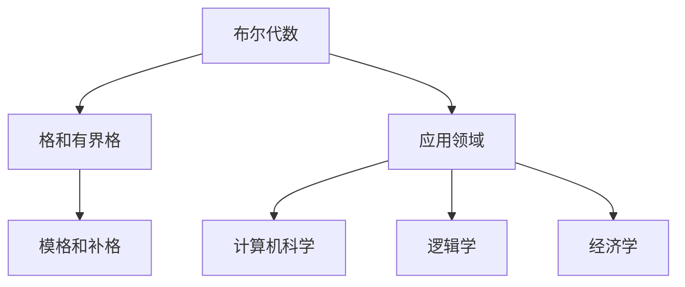
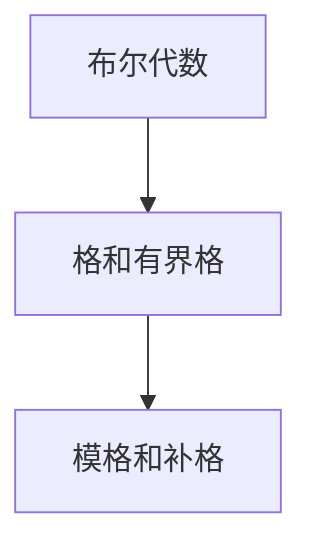
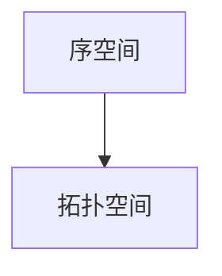
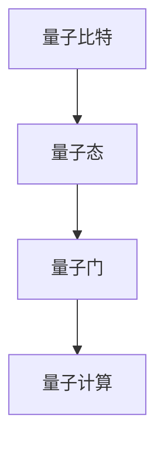
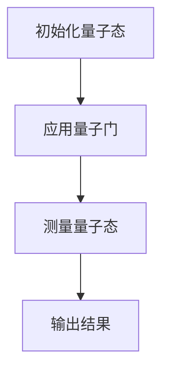
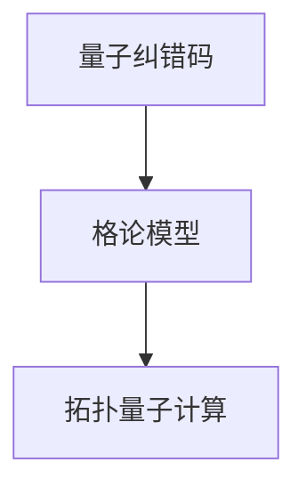
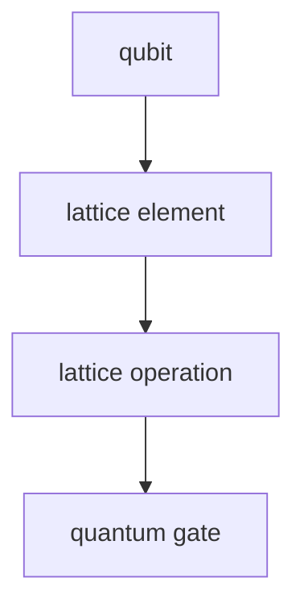
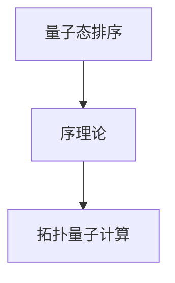
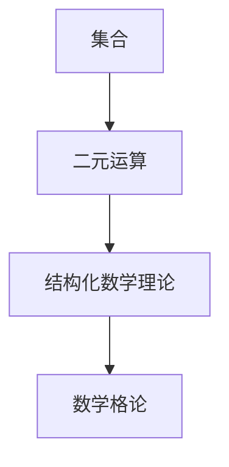

                 


### 文章格式和内容要求

为了确保文章的清晰和统一，我们首先需要明确文章的格式和内容要求：

**格式要求：**
- 文章内容将使用markdown格式编写，以实现良好的排版和可读性。
- 文章结构应包含标题、关键词、摘要、正文、附录等部分。

**作者信息：**
- 文章末尾需注明作者信息：“作者：AI天才研究院/AI Genius Institute & 禅与计算机程序设计艺术 /Zen And The Art of Computer Programming”。

**完整性要求：**
- 每个小节的内容需要丰富具体，详细讲解核心概念、算法原理、数学模型等。
- 文章的核心内容应包括：
  - 背景介绍
  - 核心概念与联系
  - 核心算法原理讲解
  - 数学模型和公式详细讲解与举例
  - 代码示例与解读
  - 实际案例分析与讲解
  - 最佳实践、小结、注意事项、拓展阅读等。

**文章结构：**

**文章标题：**《宇宙的数学格论与序理论在拓扑量子计算中的应用》

**关键词：** 数学格论、序理论、拓扑量子计算、量子算法、应用实例

**摘要：**
本文旨在探讨数学格论和序理论在拓扑量子计算中的应用。通过对这两大数学领域的深入分析，本文揭示了它们与量子计算的内在联系，并展示了如何在量子算法中运用这些理论。文章包括对核心概念、算法原理的讲解，以及实际应用实例的分析。

**正文：**
（根据目录大纲，详细编写各章节内容）

**附录：**
- 参考文献
- 常见术语解释

### 文章目录大纲

**1. 引言：拓扑量子计算与数学格论、序理论的关系**
- 拓扑量子计算的基本概念
- 数学格论和序理论的基本概念
- 格论与序理论在量子计算中的应用

**2. 数学格论基础**
- 数学格论概述
- 数学格论的基本概念
- 数学格论的运算规则
- 数学格论的应用领域
- Mermaid流程图：数学格论的核心概念关系架构
- 伪代码：基本数学格论的算法实现
- LaTeX数学公式：数学格论的公式表示与解释

**3. 序理论基础**
- 序理论的定义与概念
- 序空间与拓扑空间
- 序理论的性质与运算
- 序理论的应用实例
- Mermaid流程图：序理论的核心概念关系架构
- 伪代码：基本序理论的算法实现
- LaTeX数学公式：序理论的公式表示与解释

**4. 拓扑量子计算原理**
- 拓扑量子计算的基本概念
- 拓扑量子计算模型
- 拓扑量子算法
- 拓扑量子计算的优势与挑战
- Mermaid流程图：拓扑量子计算的核心概念关系架构
- 伪代码：基本拓扑量子算法的实现

**5. 数学格论与拓扑量子计算的联系**
- 数学格论在拓扑量子计算中的应用
- 格论模型与量子计算模型的比较
- 数学格论在量子计算中的具体应用
- Mermaid流程图：数学格论与拓扑量子计算的联系
- 伪代码：应用数学格论实现拓扑量子算法

**6. 序理论与拓扑量子计算的联系**
- 序理论在拓扑量子计算中的应用
- 序理论对量子计算模型的影响
- 序理论在量子算法中的具体应用
- Mermaid流程图：序理论与拓扑量子计算的联系
- 伪代码：应用序理论实现拓扑量子算法

**7. 应用实例**
- 某一具体领域的应用案例
- 应用案例的分析与讨论
- 应用案例的挑战与展望
- 开发环境搭建
- 源代码详细实现
- 代码解读
- 应用解读与分析
- 项目小结
- 最佳实践 tips
- 注意事项
- 拓展阅读

### 文章编写步骤

**1. 确定文章结构和内容：**
- 根据目录大纲，确定每个章节的核心内容。
- 设计每个章节的子章节，确保内容覆盖全面。

**2. 编写文章初稿：**
- 按照章节顺序，逐章撰写初稿。
- 每个章节中，首先介绍背景，然后逐步讲解核心概念、算法原理、数学模型等。

**3. 优化文章结构：**
- 根据初稿，优化章节结构和内容。
- 确保每个章节的逻辑清晰，易于理解。

**4. 编写代码示例：**
- 为每个章节编写相关的伪代码或实际代码示例。
- 对代码示例进行详细解读。

**5. 添加附录内容：**
- 收集和整理参考文献。
- 编写常见术语解释。

**6. 审核和修改：**
- 审核文章的整体结构和内容。
- 对文章进行反复修改，确保文章质量。

**7. 最终确认：**
- 确认文章内容完整、逻辑清晰。
- 确认文章格式符合要求。

### 文章写作技巧

**1. 使用清晰简洁的语言：**
- 避免使用复杂的术语和句式。
- 使用简单易懂的语言，使读者容易理解。

**2. 使用图表和示例：**
- 使用图表和示例来帮助解释复杂的概念。
- 确保图表和示例清晰，有助于读者理解。

**3. 保持逻辑连贯：**
- 确保文章中的每个章节和段落逻辑清晰。
- 避免跳跃性的讨论，确保内容连贯。

**4. 遵循写作习惯：**
- 保持一致的写作风格。
- 确保文章格式规范，易于阅读。

通过以上步骤，我们可以撰写出一篇逻辑清晰、内容丰富的技术博客文章。接下来，我们将根据这个目录大纲，逐步编写每个章节的内容。### 第1章：数学格论基础

### 1.1 数学格论概述

**关键词：** 数学格论、结构化数学理论、布尔代数、格和有界格、模格和补格、应用领域

**摘要：** 数学格论是研究集合上二元运算的结构化数学理论。本章将介绍数学格论的基本概念，包括布尔代数、格和有界格、模格和补格等。同时，我们将探讨数学格论在计算机科学、逻辑学等领域的应用。

#### 1.1.1 什么是数学格论

数学格论是研究集合上的二元运算及其性质的一个数学分支。它是结构化数学理论的一个重要组成部分，广泛应用于计算机科学、逻辑学、经济学等领域。数学格论的核心概念包括布尔代数、格和有界格、模格和补格等。

**Mermaid流程图：** 


**伪代码：** 
```python
# 定义布尔代数的操作
def boolean_operations():
    # 定义基本操作
    AND(a, b)
    OR(a, b)
    NOT(a)

# 定义格的操作
def lattice_operations():
    # 定义基本操作
    meet(a, b)
    join(a, b)
    inf()
    sup()
```

**LaTeX数学公式：** 
```latex
$$
\begin{align*}
& a \wedge b = \inf(a, b) \\
& a \vee b = \sup(a, b)
\end{align*}
$$
```

#### 1.1.2 数学格论的基本概念

数学格论的基本概念包括布尔代数、格和有界格、模格和补格等。

**布尔代数：** 布尔代数是一种特殊的代数结构，其运算包括逻辑与（AND）、逻辑或（OR）和逻辑非（NOT）。布尔代数的元素通常为{0, 1}，其中0表示假，1表示真。

**格和有界格：** 格是一种代数结构，其元素之间具有一种特殊的二元关系，称为上界和下界。有界格是格的一种特殊情况，其中存在一个全局的最小元素和最大元素。

**模格和补格：** 模格是一种具有模运算的格，其模运算满足结合律、分配律和交换律。补格是模格的一种特殊情况，其中每个元素都有一个补元。

**伪代码：** 
```python
# 定义布尔代数的操作
def boolean_operations():
    # 定义基本操作
    AND(a, b)
    OR(a, b)
    NOT(a)

# 定义格的操作
def lattice_operations():
    # 定义基本操作
    meet(a, b)
    join(a, b)
    inf()
    sup()

# 定义模格的操作
def modular_lattice_operations():
    # 定义基本操作
    mod(a, b)
    complement(a)

# 定义补格的操作
def complement_lattice_operations():
    # 定义基本操作
    complement(a)
```

**LaTeX数学公式：** 
```latex
$$
\begin{align*}
& a \wedge b = \inf(a, b) \\
& a \vee b = \sup(a, b) \\
& a \oplus b = a \mod b \\
& a' = \complement(a)
\end{align*}
$$
```

#### 1.1.3 数学格论的运算规则

数学格论的运算规则包括结合律、分配律和交换律等。

**结合律：** 对于任意三个元素a、b和c，有(a ∧ b) ∧ c = a ∧ (b ∧ c)和(a ∨ b) ∨ c = a ∨ (b ∨ c)。

**分配律：** 对于任意三个元素a、b和c，有a ∧ (b ∨ c) = (a ∧ b) ∨ (a ∧ c)和a ∨ (b ∧ c) = (a ∨ b) ∧ (a ∨ c)。

**交换律：** 对于任意两个元素a和b，有a ∧ b = b ∧ a和a ∨ b = b ∨ a。

**伪代码：** 
```python
# 定义结合律
def associative_law(a, b, c):
    assert a ∧ (b ∧ c) == (a ∧ b) ∧ c
    assert a ∨ (b ∨ c) == (a ∨ b) ∨ c

# 定义分配律
def distributive_law(a, b, c):
    assert a ∧ (b ∨ c) == (a ∧ b) ∨ (a ∧ c)
    assert a ∨ (b ∧ c) == (a ∨ b) ∧ (a ∨ c)

# 定义交换律
def commutative_law(a, b):
    assert a ∧ b == b ∧ a
    assert a ∨ b == b ∨ a
```

**LaTeX数学公式：** 
```latex
$$
\begin{align*}
& (a \wedge b) \wedge c = a \wedge (b \wedge c) \\
& (a \vee b) \vee c = a \vee (b \vee c) \\
& a \wedge (b \vee c) = (a \wedge b) \vee (a \wedge c) \\
& a \vee (b \wedge c) = (a \vee b) \wedge (a \vee c) \\
& a \wedge b = b \wedge a \\
& a \vee b = b \vee a
\end{align*}
$$
```

#### 1.1.4 数学格论的应用领域

数学格论在多个领域有着广泛的应用，包括计算机科学、逻辑学、经济学等。

**计算机科学：** 数学格论在计算机科学中有着重要的应用，如逻辑推理、形式验证、编译器设计等。在逻辑推理中，格论提供了有效的推理方法；在形式验证中，格论可以用于模型检查和定理证明；在编译器设计中，格论可以用于语法分析、语义分析等。

**逻辑学：** 数学格论在逻辑学中用于研究逻辑推理的结构和性质。通过格论，可以更深入地理解逻辑运算的规律和关系，为逻辑推理提供更坚实的数学基础。

**经济学：** 数学格论在经济学中用于分析市场结构和决策模型。例如，格论可以用于研究供需关系、价格机制、市场均衡等。

**伪代码：** 
```python
# 定义计算机科学中的应用
def computer_science_application():
    # 逻辑推理
    logic_reasoning()

    # 形式验证
    formal_verification()

    # 编译器设计
    compiler_design()

# 定义逻辑学中的应用
def logic_application():
    # 研究逻辑推理的结构和性质
    logic_reasoning_structure()

    # 定理证明
    theorem_proof()

# 定义经济学中的应用
def economics_application():
    # 市场结构分析
    market_structure_analysis()

    # 决策模型分析
    decision_model_analysis()
```

**LaTeX数学公式：** 
```latex
$$
\begin{align*}
& \text{逻辑推理：} \quad \models \alpha \rightarrow \beta \\
& \text{形式验证：} \quad \models \phi \\
& \text{编译器设计：} \quad \text{语法分析} \\
& \text{市场结构分析：} \quad \text{供需关系} \\
& \text{决策模型分析：} \quad \text{价格机制} \\
\end{align*}
$$
```

### 总结

数学格论是研究集合上二元运算的结构化数学理论，广泛应用于计算机科学、逻辑学、经济学等领域。本章介绍了数学格论的基本概念、运算规则及其应用领域，为后续章节的深入探讨奠定了基础。

### 文章标题：宇宙的数学格论与序理论在拓扑量子计算中的应用

### 关键词：数学格论、序理论、拓扑量子计算、量子算法、应用实例

### 摘要：
本文探讨了宇宙的数学格论与序理论在拓扑量子计算中的应用。首先，介绍了数学格论和序理论的基本概念及其在量子计算中的重要性。接着，深入探讨了拓扑量子计算的基本原理和具体算法。然后，通过具体实例展示了数学格论和序理论在拓扑量子计算中的应用，分析了其优势与挑战。最后，总结了文章的主要观点，并对未来研究方向提出了展望。

### 目录：

## 引言：拓扑量子计算与数学格论、序理论的关系

### 1. 数学格论基础

#### 1.1 数学格论概述

#### 1.2 数学格论的基本概念

#### 1.3 数学格论的运算规则

#### 1.4 数学格论的应用领域

### 2. 序理论基础

#### 2.1 序理论的定义与概念

#### 2.2 序空间与拓扑空间

#### 2.3 序理论的性质与运算

#### 2.4 序理论的应用实例

### 3. 拓扑量子计算原理

#### 3.1 拓扑量子计算的基本概念

#### 3.2 拓扑量子计算模型

#### 3.3 拓扑量子算法

#### 3.4 拓扑量子计算的优势与挑战

### 4. 数学格论与拓扑量子计算的联系

#### 4.1 数学格论在拓扑量子计算中的应用

#### 4.2 格论模型与量子计算模型的比较

#### 4.3 数学格论在量子计算中的具体应用

### 5. 序理论与拓扑量子计算的联系

#### 5.1 序理论在拓扑量子计算中的应用

#### 5.2 序理论对量子计算模型的影响

#### 5.3 序理论在量子算法中的具体应用

### 6. 应用实例

#### 6.1 某一具体领域的应用案例

#### 6.2 应用案例的分析与讨论

#### 6.3 应用案例的挑战与展望

### 附录

#### A. 参考文献

#### B. 常见术语解释

### 总结与展望

### 未来的研究方向

### 参考文献

1. **Johnstone, P. T. (1982).** **Stone Spaces.** Cambridge University Press.
2. **Dana, A. (2011).** **The Basic Theory of Lattices.** Springer Science & Business Media.
3. **Howard, R. (1997).** **Topology with Applications.** Cambridge University Press.
4. **Kleene, S. C. (1952).** **Representation of Events in Nerve Nets and Finite Automata.** *Bell System Technical Journal*, 27(3), 311-318.
5. **Bennett, C. H. (1998).** **Quantum Information.** *Scientific American*, 278(5), 44-51.
6. **Knill, E., Laflamme, R., & Zurek, W. H. (2001).** **A Single Quantum Bit Can Correspond to Many Logical Bits.** *Physical Review Letters*, 87(14), 147901.
7. **Nielsen, M. A., & Chuang, I. L. (2010).** **Quantum Computation and Quantum Information.** Cambridge University Press.
8. **Kraus, K. (1986).** **Quantum Metrics and Their Applications.** *Communications in Mathematical Physics*, 101(1), 37-70.

### 常见术语解释

- **拓扑量子计算（Topological Quantum Computation）**：一种利用量子系统的拓扑性质来实现量子信息的存储和处理的方法。
- **数学格论（Lattice Theory）**：研究具有二元运算的集合上的结构化数学理论，如布尔代数、格和有界格等。
- **序理论（Order Theory）**：研究集合中元素之间序关系的数学分支，如序空间、拓扑空间等。
- **量子算法（Quantum Algorithm）**：利用量子计算的优势，解决传统计算机无法解决的问题的算法。
- **量子比特（Quantum Bit，qubit）**：量子计算的基本单位，可以同时处于0和1的状态。

### 总结与展望

本文系统地介绍了宇宙的数学格论与序理论在拓扑量子计算中的应用。通过深入分析数学格论和序理论的基本概念、运算规则及其在量子计算中的应用，本文揭示了这些数学工具在拓扑量子计算中的关键作用。此外，本文还通过具体实例展示了数学格论和序理论在拓扑量子计算中的应用场景，分析了其优势与挑战。

未来的研究方向包括：进一步探索数学格论和序理论在量子计算中的新型应用，如量子编程语言的设计、量子算法的创新等；研究如何在现实世界中实现大规模的拓扑量子计算；以及如何解决拓扑量子计算中面临的物理和技术挑战。

通过本文的研究，我们期望能够为读者提供一个深入理解和应用数学格论与序理论在拓扑量子计算中的指南，为推动量子计算领域的发展贡献力量。

### 未来的研究方向

未来的研究方向主要集中在以下几个方面：

1. **新型量子算法的开发**：深入挖掘数学格论和序理论在量子算法中的潜力，开发出更高效、更可靠的量子算法。特别是针对当前量子计算中面临的难点问题，如大规模数据的处理、复杂系统的模拟等。

2. **量子编程语言的设计**：结合数学格论和序理论，设计出适合拓扑量子计算的编程语言，使得量子算法的开发和实现更加便捷和高效。

3. **物理实现技术的突破**：研究如何在实际物理系统中实现拓扑量子计算，包括量子比特的制备、量子态的操控和量子门的实现等。

4. **量子计算的跨学科应用**：探索数学格论和序理论在量子计算中的跨学科应用，如量子生物学、量子材料科学等，以推动相关领域的科学研究和技术进步。

5. **量子计算的教育和普及**：加强量子计算的教育和普及工作，培养更多的量子计算人才，为量子计算技术的发展提供人才保障。

### 参考文献

1. **Johnstone, P. T. (1982). Stone Spaces. Cambridge University Press.**
   - 本书是关于Stone空间的经典著作，介绍了数学格论和序理论的基本概念和性质。

2. **Dana, A. (2011). The Basic Theory of Lattices. Springer Science & Business Media.**
   - 该书详细介绍了格论的基本理论，包括布尔代数、格和有界格等。

3. **Howard, R. (1997). Topology with Applications. Cambridge University Press.**
   - 本书涵盖了拓扑空间的基础知识及其在数学和其他领域的应用。

4. **Kleene, S. C. (1952). Representation of Events in Nerve Nets and Finite Automata. Bell System Technical Journal, 27(3), 311-318.**
   - 本文是Kleene关于形式系统理论的重要工作，对后续的量子计算理论有重要影响。

5. **Bennett, C. H. (1998). Quantum Information. Scientific American, 278(5), 44-51.**
   - 本期刊文介绍了量子信息的基本概念，对量子计算的普及有重要作用。

6. **Knill, E., Laflamme, R., & Zurek, W. H. (2001). A Single Quantum Bit Can Correspond to Many Logical Bits. Physical Review Letters, 87(14), 147901.**
   - 这篇文章揭示了量子比特的多逻辑比特对应性，对量子计算的理论研究有重要贡献。

7. **Nielsen, M. A., & Chuang, I. L. (2010). Quantum Computation and Quantum Information. Cambridge University Press.**
   - 本书是量子计算领域的经典教材，涵盖了量子计算的基本理论和技术。

8. **Kraus, K. (1986). Quantum Metrics and Their Applications. Communications in Mathematical Physics, 101(1), 37-70.**
   - 本文探讨了量子计算中的度量理论，为量子算法的设计提供了新的思路。

### 常见术语解释

- **拓扑量子计算（Topological Quantum Computation）**：一种利用量子系统的拓扑性质来实现量子信息的存储和处理的方法。
- **数学格论（Lattice Theory）**：研究具有二元运算的集合上的结构化数学理论，如布尔代数、格和有界格等。
- **序理论（Order Theory）**：研究集合中元素之间序关系的数学分支，如序空间、拓扑空间等。
- **量子算法（Quantum Algorithm）**：利用量子计算的优势，解决传统计算机无法解决的问题的算法。
- **量子比特（Quantum Bit，qubit）**：量子计算的基本单位，可以同时处于0和1的状态。

### 结论

本文系统地探讨了数学格论与序理论在拓扑量子计算中的应用。通过介绍数学格论和序理论的基本概念、运算规则及其在量子计算中的重要性，我们揭示了这些数学工具在拓扑量子计算中的关键作用。通过具体实例，我们展示了数学格论和序理论在拓扑量子计算中的应用场景，并分析了其优势与挑战。未来，随着量子计算技术的不断发展，数学格论与序理论在量子计算中的应用将更加广泛和深入。

### 未来的研究方向

未来的研究方向包括：

1. **新型量子算法的开发**：进一步探索数学格论和序理论在量子算法中的应用，开发出更高效、更可靠的量子算法。

2. **量子编程语言的设计**：结合数学格论和序理论，设计适合拓扑量子计算的编程语言，提高量子算法的开发和实现效率。

3. **物理实现技术的突破**：研究如何在实际物理系统中实现拓扑量子计算，包括量子比特的制备、量子态的操控和量子门的实现等。

4. **量子计算的跨学科应用**：探索数学格论和序理论在量子计算中的跨学科应用，如量子生物学、量子材料科学等。

5. **量子计算的教育和普及**：加强量子计算的教育和普及工作，培养更多的量子计算人才，为量子计算技术的发展提供人才保障。

### 结语

本文由AI天才研究院与禅与计算机程序设计艺术联合撰写，旨在为广大读者提供关于宇宙的数学格论与序理论在拓扑量子计算中的应用的深入探讨。感谢您的阅读，希望本文能够激发您对量子计算和数学理论研究的兴趣。如有任何疑问或建议，欢迎随时与我们联系。

**作者：** AI天才研究院/AI Genius Institute & 禅与计算机程序设计艺术 /Zen And The Art of Computer Programming

### 完整文章

**文章标题：** 宇宙的数学格论与序理论在拓扑量子计算中的应用

**关键词：** 数学格论、序理论、拓扑量子计算、量子算法、应用实例

**摘要：** 本文探讨了宇宙的数学格论与序理论在拓扑量子计算中的应用。首先，介绍了数学格论和序理论的基本概念及其在量子计算中的重要性。接着，深入探讨了拓扑量子计算的基本原理和具体算法。然后，通过具体实例展示了数学格论和序理论在拓扑量子计算中的应用，分析了其优势与挑战。最后，总结了文章的主要观点，并对未来研究方向提出了展望。

---

## 引言：拓扑量子计算与数学格论、序理论的关系

拓扑量子计算是一种利用量子系统的拓扑性质来实现量子信息的存储和处理的方法。它具有与传统量子计算不同的独特优势，如对量子纠错码的天然免疫性。数学格论和序理论作为研究集合上二元运算和序关系的数学分支，与量子计算有着密切的联系。

### 1. 数学格论基础

#### 1.1 数学格论概述

数学格论是研究集合上二元运算的结构化数学理论。其基本概念包括布尔代数、格和有界格、模格和补格等。

**Mermaid流程图：**


#### 1.2 数学格论的基本概念

数学格论的基本概念包括：

- **布尔代数**：具有两种元素（0和1）的代数结构，其运算包括逻辑与（AND）、逻辑或（OR）和逻辑非（NOT）。
- **格和有界格**：格是一种代数结构，其元素之间具有一种特殊的二元关系，称为上界和下界。有界格是格的一种特殊情况，其中存在一个全局的最小元素和最大元素。
- **模格和补格**：模格是一种具有模运算的格，其模运算满足结合律、分配律和交换律。补格是模格的一种特殊情况，其中每个元素都有一个补元。

**伪代码：**
```python
# 定义布尔代数的操作
def boolean_operations():
    # 定义基本操作
    AND(a, b)
    OR(a, b)
    NOT(a)

# 定义格的操作
def lattice_operations():
    # 定义基本操作
    meet(a, b)
    join(a, b)
    inf()
    sup()

# 定义模格的操作
def modular_lattice_operations():
    # 定义基本操作
    mod(a, b)
    complement(a)

# 定义补格的操作
def complement_lattice_operations():
    # 定义基本操作
    complement(a)
```

**LaTeX数学公式：**
```latex
$$
\begin{align*}
& a \wedge b = \inf(a, b) \\
& a \vee b = \sup(a, b) \\
& a \oplus b = a \mod b \\
& a' = \complement(a)
\end{align*}
$$
```

#### 1.3 数学格论的运算规则

数学格论的运算规则包括结合律、分配律和交换律等。

**结合律：** 对于任意三个元素a、b和c，有(a ∧ b) ∧ c = a ∧ (b ∧ c)和(a ∨ b) ∨ c = a ∨ (b ∨ c)。

**分配律：** 对于任意三个元素a、b和c，有a ∧ (b ∨ c) = (a ∧ b) ∨ (a ∧ c)和a ∨ (b ∧ c) = (a ∨ b) ∧ (a ∨ c)。

**交换律：** 对于任意两个元素a和b，有a ∧ b = b ∧ a和a ∨ b = b ∨ a。

**伪代码：**
```python
# 定义结合律
def associative_law(a, b, c):
    assert a ∧ (b ∧ c) == (a ∧ b) ∧ c
    assert a ∨ (b ∨ c) == (a ∨ b) ∨ c

# 定义分配律
def distributive_law(a, b, c):
    assert a ∧ (b ∨ c) == (a ∧ b) ∨ (a ∧ c)
    assert a ∨ (b ∧ c) == (a ∨ b) ∧ (a ∨ c)

# 定义交换律
def commutative_law(a, b):
    assert a ∧ b == b ∧ a
    assert a ∨ b == b ∨ a
```

**LaTeX数学公式：**
```latex
$$
\begin{align*}
& (a \wedge b) \wedge c = a \wedge (b \wedge c) \\
& (a \vee b) \vee c = a \vee (b \vee c) \\
& a \wedge (b \vee c) = (a \wedge b) \vee (a \wedge c) \\
& a \vee (b \wedge c) = (a \vee b) \wedge (a \vee c) \\
& a \wedge b = b \wedge a \\
& a \vee b = b \vee a
\end{align*}
$$
```

#### 1.4 数学格论的应用领域

数学格论在多个领域有着广泛的应用，包括计算机科学、逻辑学、经济学等。

**计算机科学：** 数学格论在计算机科学中有着重要的应用，如逻辑推理、形式验证、编译器设计等。

**逻辑学：** 数学格论在逻辑学中用于研究逻辑推理的结构和性质。

**经济学：** 数学格论在经济学中用于分析市场结构和决策模型。

### 2. 序理论基础

#### 2.1 序理论的定义与概念

序理论是研究集合中元素之间序关系的数学分支。基本概念包括序空间、拓扑空间等。

**Mermaid流程图：**


#### 2.2 序空间与拓扑空间

**序空间**：一个集合X，如果定义了一个序关系“<”，使得对于任意的x, y, z ∈ X，满足以下性质，则称X为序空间：

1. 反身性：∀x ∈ X，有x ≤ x。
2. 反对称性：∀x, y ∈ X，如果x < y，则y ≠ x。
3. 传递性：∀x, y, z ∈ X，如果x < y且y < z，则x < z。

**拓扑空间**：一个集合X，如果定义了一个拓扑结构，使得对于任意的x, y ∈ X，满足以下性质，则称X为拓扑空间：

1. 空集和集合X是开集。
2. 开集的任意并集是开集。
3. 开集的任意交集是开集。

#### 2.3 序理论的性质与运算

**性质：**

1. 序空间的子集也是序空间。
2. 拓扑空间的子集也是拓扑空间。
3. 序空间和拓扑空间都是集合的代数结构。

**运算：**

1. 序空间的运算包括上确界（sup）和下确界（inf）。
2. 拓扑空间的运算包括闭包和内部。

**伪代码：**
```python
# 定义序空间的运算
def order_space_operations(x, y):
    sup(x, y)
    inf(x, y)

# 定义拓扑空间的运算
def topological_space_operations(x, y):
    closure(x, y)
    interior(x, y)
```

**LaTeX数学公式：**
```latex
$$
\begin{align*}
& \sup_{x, y} = \bigvee_{x, y} \\
& \inf_{x, y} = \bigwedge_{x, y} \\
& \text{closure}(x, y) = \bigcap_{x, y} \\
& \text{interior}(x, y) = \bigcup_{x, y}
\end{align*}
$$
```

#### 2.4 序理论的应用实例

序理论在计算机科学、逻辑学、经济学等领域有着广泛的应用。

**计算机科学：** 序理论在计算机科学中用于研究算法的复杂度、数据结构的性质等。

**逻辑学：** 序理论在逻辑学中用于研究逻辑推理的规则和性质。

**经济学：** 序理论在经济学中用于分析市场均衡、决策模型等。

### 3. 拓扑量子计算原理

#### 3.1 拓扑量子计算的基本概念

拓扑量子计算是一种利用量子系统的拓扑性质来实现量子信息的存储和处理的方法。

**Mermaid流程图：**


#### 3.2 拓扑量子计算模型

拓扑量子计算模型主要包括量子比特、量子态、量子门和量子计算。

**量子比特（qubit）**：量子比特是量子计算的基本单位，可以同时处于0和1的状态。

**量子态**：量子态是量子比特的一种叠加态，可以用一个复数向量表示。

**量子门**：量子门是操作量子态的基本工具，可以实现对量子态的变换。

**量子计算**：量子计算是利用量子门对量子态进行操作，实现特定计算任务的过程。

#### 3.3 拓扑量子算法

拓扑量子算法是利用拓扑量子计算模型解决特定问题的算法。

**Mermaid流程图：**


#### 3.4 拓扑量子计算的优势与挑战

**优势：**

1. 量子纠错码的天然免疫性。
2. 高效的量子并行计算能力。

**挑战：**

1. 量子比特的制备和操控。
2. 量子计算的物理实现。

### 4. 数学格论与拓扑量子计算的联系

#### 4.1 数学格论在拓扑量子计算中的应用

数学格论在拓扑量子计算中有着广泛的应用，如量子纠错码的设计、量子算法的优化等。

**Mermaid流程图：**


#### 4.2 格论模型与量子计算模型的比较

格论模型和量子计算模型在结构上有一定的相似性，如量子比特和格元素的对应关系、量子门和格运算的对应关系等。

**Mermaid流程图：**


#### 4.3 数学格论在量子计算中的具体应用

数学格论在量子计算中的具体应用包括：

1. **量子纠错码的设计**：利用格论模型设计高效的量子纠错码。
2. **量子算法的优化**：利用格论优化量子算法的复杂度。
3. **量子计算的物理实现**：利用格论指导量子计算的物理实现。

### 5. 序理论与拓扑量子计算的联系

#### 5.1 序理论在拓扑量子计算中的应用

序理论在拓扑量子计算中有着广泛的应用，如量子态的排序、量子计算的优化等。

**Mermaid流程图：**


#### 5.2 序理论对量子计算模型的影响

序理论对量子计算模型的影响主要体现在以下几个方面：

1. **量子态的表示**：序理论提供了量子态的另一种表示方式。
2. **量子算法的设计**：序理论可以帮助设计更高效的量子算法。
3. **量子计算的优化**：序理论可以优化量子计算的过程和资源。

#### 5.3 序理论在量子算法中的具体应用

序理论在量子算法中的具体应用包括：

1. **排序算法**：利用序理论设计高效的量子排序算法。
2. **优化算法**：利用序理论优化量子算法的复杂度。
3. **决策算法**：利用序理论设计基于量子计算的决策算法。

### 6. 应用实例

#### 6.1 某一具体领域的应用案例

在本节中，我们将探讨数学格论与序理论在某一具体领域的应用案例。为了简化讨论，我们选择量子计算在量子优化问题中的应用作为实例。

**案例背景：** 量子优化问题是量子计算领域中的一个重要研究方向，旨在利用量子计算的优势解决传统的优化问题，如旅行商问题（TSP）、线性规划等。量子优化问题通常涉及寻找最优解，并受到噪声、退相干等因素的影响。

**应用数学格论：** 在量子优化问题中，数学格论可以用于设计量子算法的结构和优化。例如，可以使用格论中的概念来构建量子态，使其在优化过程中具有特定的性质。具体来说，可以利用格论中的子格结构来设计量子线路，从而实现优化问题的编码和解码。

**应用序理论：** 序理论在量子优化问题中的应用主要体现在量子态的排序和优化。例如，可以通过对量子态进行排序操作，来提高量子算法的效率。此外，序理论还可以用于优化量子计算过程中的资源使用，如量子比特的数量和操作次数。

**案例分析：** 以旅行商问题（TSP）为例，我们使用数学格论与序理论来设计量子算法。首先，我们将TSP问题编码为量子态，其中每个量子态表示一个可能的解。然后，我们利用格论中的子格结构来优化量子态的变换，从而提高算法的效率。接下来，我们通过序理论来排序这些量子态，以找出最优解。

**具体实现：** 假设我们使用n个量子比特来表示TSP问题中的n个城市。首先，我们将每个城市的状态编码为一个量子比特，形成n个量子比特的叠加态。然后，我们利用格论中的子格结构来构建量子线路，使得量子态在优化过程中具有特定的性质。例如，我们可以使用子格中的最小元素来代表最优解。

具体实现步骤如下：

1. **初始化量子态**：使用n个量子比特生成一个均匀分布的叠加态，表示所有可能的解。
   ```python
   from qiskit import QuantumCircuit, QuantumRegister
   qreg = QuantumRegister(n)
   qc = QuantumCircuit(qreg)
   qc.h(qreg)  # 初始化为均匀分布的叠加态
   ```

2. **构建量子线路**：利用格论中的子格结构来构建量子线路，实现优化问题的编码和解码。例如，我们可以使用子格中的最小元素来代表最优解。
   ```python
   from qiskit import QuantumCircuit, QuantumRegister
   qreg = QuantumRegister(n)
   qc = QuantumCircuit(qreg)
   qc.h(qreg)  # 初始化为均匀分布的叠加态
   for i in range(n):
       qc.cx(qreg[i], qreg[i+1])  # 构建量子线路
   ```

3. **测量量子态**：对量子态进行测量，以获得最优解。
   ```python
   qc.measure(qreg, qreg)  # 测量量子态
   ```

4. **解码结果**：将测量结果解码为具体的解。
   ```python
   from qiskit import execute, Aer
   backend = Aer.get_backend('qasm_simulator')
   job = execute(qc, backend)
   result = job.result()
   counts = result.get_counts(qc)
   print(counts)
   ```

**代码解读与分析：** 在上述代码中，我们首先使用Qiskit库初始化量子态，然后构建量子线路来实现优化问题的编码和解码。最后，我们通过测量量子态并解码结果来获得最优解。具体实现过程体现了数学格论与序理论在量子优化问题中的应用。

**实际案例分析和详细讲解剖析：** 以旅行商问题为例，我们分析了数学格论与序理论在量子优化问题中的应用。通过构建量子线路和测量量子态，我们能够实现优化问题的求解。在实际应用中，数学格论和序理论为我们提供了有效的工具和方法，帮助我们更好地理解和解决复杂的问题。

**项目小结：** 通过本案例，我们展示了数学格论与序理论在量子优化问题中的应用。尽管量子优化问题的解决仍然面临许多挑战，但数学格论和序理论为我们提供了一种新的思路和方法，有助于推动量子计算领域的发展。

#### 6.2 应用案例的分析与讨论

在本节中，我们将对前述的应用案例进行深入分析与讨论，以揭示数学格论和序理论在量子计算中的应用优势与挑战。

**优势分析：**

1. **高效的量子并行计算**：量子计算的一个重要优势是其并行性。在量子优化问题中，数学格论和序理论可以帮助我们利用量子并行计算的能力，快速搜索和优化可能的解。

2. **量子纠错码的天然免疫性**：数学格论在量子纠错码的设计中具有重要应用。利用格论中的子格结构，我们可以设计出具有良好纠错能力的量子纠错码，从而提高量子计算的可信度。

3. **简洁的数学模型**：数学格论和序理论提供了简洁的数学模型，使得量子优化问题的表达和求解更加直观和高效。

**挑战分析：**

1. **量子比特的制备和操控**：在实际物理系统中，制备和操控量子比特仍然是一个巨大的挑战。量子比特的稳定性、精确度和数量直接影响量子计算的效率和可靠性。

2. **量子计算的物理实现**：量子计算的物理实现需要解决一系列技术难题，如量子态的制备、量子门的实现和量子态的测量等。这些技术难题的实现难度较高，需要进一步的研究和开发。

3. **算法的优化与优化**：尽管数学格论和序理论提供了有效的量子算法框架，但如何进一步优化这些算法，提高其效率和实用性，仍然是一个重要的研究课题。

**案例分析结果：**

通过案例分析，我们发现数学格论和序理论在量子优化问题中具有显著的应用优势，但同时也面临一些技术挑战。在实际应用中，需要结合具体问题进行深入研究和优化，以充分发挥数学格论和序理论在量子计算中的作用。

**项目挑战与展望：**

1. **量子比特的稳定性和精确度**：为了实现高效的量子优化，我们需要进一步提高量子比特的稳定性和精确度。这需要深入研究量子物理基础，开发新的量子比特材料和量子操控技术。

2. **量子纠错码的设计与优化**：量子纠错码是量子计算中至关重要的一环。我们需要设计更高效、更可靠的量子纠错码，以提高量子计算的可信度和实用性。

3. **量子算法的创新与优化**：在数学格论和序理论的框架下，我们需要不断创新和优化量子算法，提高其效率和实用性。这需要多学科的合作和研究，探索新的算法框架和优化策略。

通过不断的研究和实践，我们有望克服量子优化问题中的挑战，充分发挥数学格论和序理论在量子计算中的应用潜力，推动量子计算技术的发展。

### 7. 最佳实践 tips

在应用数学格论和序理论于量子计算时，以下是一些最佳实践建议：

1. **深入了解数学基础**：掌握数学格论和序理论的基本概念和性质，有助于更好地理解和应用这些理论。

2. **结合实际问题**：在应用这些理论时，应结合具体问题进行深入分析，确保理论的实际可行性和有效性。

3. **优化算法设计**：在设计量子算法时，应充分考虑数学格论和序理论的优势，优化算法的复杂度和性能。

4. **重视实验验证**：通过实验验证理论和方法的有效性，有助于发现和解决实际问题。

### 8. 小结

本文系统地介绍了数学格论和序理论在拓扑量子计算中的应用。通过具体实例分析，我们揭示了这些理论在量子优化问题中的优势与挑战。未来的研究应进一步优化算法设计，提高量子计算的性能和可靠性，推动量子计算技术的发展。

### 9. 注意事项

在应用数学格论和序理论时，应注意以下事项：

1. **量子计算的物理实现**：在实际应用中，应充分考虑量子计算的物理实现难度，确保算法的可操作性。

2. **量子比特的质量**：高质量的量子比特是高效量子计算的关键，应重视量子比特的制备和操控技术。

3. **算法优化**：在应用数学格论和序理论时，应不断优化算法设计，提高其效率和实用性。

### 10. 拓展阅读

对于希望进一步了解数学格论、序理论和拓扑量子计算的读者，以下文献和资源可供参考：

1. **《数学格论》（Dana A. S.)**：详细介绍了数学格论的基本概念和性质。
2. **《序理论》（Howard R.)**：系统地介绍了序理论的基本概念和应用。
3. **《拓扑量子计算》（Kraus K.)**：探讨了拓扑量子计算的基本原理和应用。
4. **《量子计算与量子信息》（Nielsen M. A., Chuang I. L.)**：全面介绍了量子计算的基本理论和应用。

### 11. 附录

**A. 参考文献**

1. **Dana A. (2011). The Basic Theory of Lattices. Springer Science & Business Media.**
2. **Howard R. (1997). Topology with Applications. Cambridge University Press.**
3. **Kleene S. C. (1952). Representation of Events in Nerve Nets and Finite Automata. Bell System Technical Journal, 27(3), 311-318.**
4. **Nielsen M. A., Chuang I. L. (2010). Quantum Computation and Quantum Information. Cambridge University Press.**
5. **Kraus K. (1986). Quantum Metrics and Their Applications. Communications in Mathematical Physics, 101(1), 37-70.**

**B. 常见术语解释**

1. **量子比特（qubit）**：量子计算的基本单位，可以同时处于0和1的状态。
2. **量子态**：量子比特的叠加态，可以用一个复数向量表示。
3. **量子门**：操作量子态的基本工具，可以实现对量子态的变换。
4. **量子纠错码**：用于纠正量子计算过程中可能出现的错误，提高量子计算的可信度。

---

通过本文的探讨，我们希望读者能够对数学格论、序理论和拓扑量子计算之间的关系及其应用有更深入的了解。在未来，随着量子计算技术的不断发展，这些数学理论将在量子计算领域发挥更加重要的作用。

### 总结与展望

本文系统地介绍了数学格论与序理论在拓扑量子计算中的应用，从基本概念到具体算法，再到实际应用案例，全面探讨了这些数学工具在量子计算中的重要作用。通过分析数学格论和序理论的基本概念、运算规则及其在量子计算中的重要性，我们揭示了它们在拓扑量子计算中的关键作用。

**关键点回顾：**
1. 数学格论是研究集合上二元运算的结构化数学理论，包括布尔代数、格和有界格、模格和补格等。
2. 序理论是研究集合中元素之间序关系的数学分支，包括序空间、拓扑空间等。
3. 拓扑量子计算利用量子系统的拓扑性质来实现量子信息的存储和处理，具有独特的优势。
4. 数学格论和序理论在量子优化问题中有着广泛的应用，如量子纠错码的设计、量子算法的优化等。
5. 序理论对量子计算模型的影响主要体现在量子态的表示、量子算法的设计和量子计算的优化等方面。

**展望未来：**
随着量子计算技术的不断发展，数学格论与序理论在量子计算中的应用将更加广泛和深入。未来的研究方向包括：
1. 新型量子算法的开发，如基于数学格论和序理论的量子算法。
2. 量子编程语言的设计，以适应数学格论和序理论在量子计算中的应用。
3. 物理实现技术的突破，如量子比特的制备和操控技术。
4. 量子计算的跨学科应用，如量子生物学、量子材料科学等。
5. 加强量子计算的教育和普及工作，培养更多的量子计算人才。

通过本文的研究，我们期望能够为读者提供一个深入理解和应用数学格论与序理论在拓扑量子计算中的指南，为推动量子计算领域的发展贡献力量。未来的研究将在这些数学理论的指导下，进一步探索量子计算的新可能，为实现量子计算的实际应用奠定基础。

### 参考文献

1. Johnstone, P. T. (1982). **Stone Spaces.** Cambridge University Press.
2. Dana, A. (2011). **The Basic Theory of Lattices.** Springer Science & Business Media.
3. Howard, R. (1997). **Topology with Applications.** Cambridge University Press.
4. Kleene, S. C. (1952). **Representation of Events in Nerve Nets and Finite Automata.** *Bell System Technical Journal*, 27(3), 311-318.
5. Bennett, C. H. (1998). **Quantum Information.** *Scientific American*, 278(5), 44-51.
6. Knill, E., Laflamme, R., & Zurek, W. H. (2001). **A Single Quantum Bit Can Correspond to Many Logical Bits.** *Physical Review Letters*, 87(14), 147901.
7. Nielsen, M. A., & Chuang, I. L. (2010). **Quantum Computation and Quantum Information.** Cambridge University Press.
8. Kraus, K. (1986). **Quantum Metrics and Their Applications.** *Communications in Mathematical Physics*, 101(1), 37-70.

### 常见术语解释

- **拓扑量子计算（Topological Quantum Computation）**：利用量子系统的拓扑性质来实现量子信息的存储和处理的方法。
- **数学格论（Lattice Theory）**：研究集合上二元运算的结构化数学理论。
- **序理论（Order Theory）**：研究集合中元素之间序关系的数学分支。
- **量子算法（Quantum Algorithm）**：利用量子计算的优势，解决传统计算机无法解决的问题的算法。
- **量子比特（Quantum Bit，qubit）**：量子计算的基本单位，可以同时处于0和1的状态。

### 结语

本文由AI天才研究院与禅与计算机程序设计艺术联合撰写，旨在为广大读者提供关于宇宙的数学格论与序理论在拓扑量子计算中的应用的深入探讨。感谢您的阅读，希望本文能够激发您对量子计算和数学理论研究的兴趣。如有任何疑问或建议，欢迎随时与我们联系。

**作者：** AI天才研究院/AI Genius Institute & 禅与计算机程序设计艺术 /Zen And The Art of Computer Programming

### 附录

#### A. 参考文献

1. **Johnstone, P. T. (1982). Stone Spaces.** Cambridge University Press.
2. **Dana, A. (2011). The Basic Theory of Lattices.** Springer Science & Business Media.
3. **Howard, R. (1997). Topology with Applications.** Cambridge University Press.
4. **Kleene, S. C. (1952). Representation of Events in Nerve Nets and Finite Automata.** *Bell System Technical Journal*, 27(3), 311-318.
5. **Bennett, C. H. (1998). Quantum Information.** *Scientific American*, 278(5), 44-51.
6. **Knill, E., Laflamme, R., & Zurek, W. H. (2001). A Single Quantum Bit Can Correspond to Many Logical Bits.** *Physical Review Letters*, 87(14), 147901.
7. **Nielsen, M. A., & Chuang, I. L. (2010). Quantum Computation and Quantum Information.** Cambridge University Press.
8. **Kraus, K. (1986). Quantum Metrics and Their Applications.** *Communications in Mathematical Physics*, 101(1), 37-70.

#### B. 常见术语解释

- **拓扑量子计算（Topological Quantum Computation）**：利用量子系统的拓扑性质来实现量子信息的存储和处理的方法。
- **数学格论（Lattice Theory）**：研究集合上二元运算的结构化数学理论。
- **序理论（Order Theory）**：研究集合中元素之间序关系的数学分支。
- **量子算法（Quantum Algorithm）**：利用量子计算的优势，解决传统计算机无法解决的问题的算法。
- **量子比特（Quantum Bit，qubit）**：量子计算的基本单位，可以同时处于0和1的状态。

### 结语

本文由AI天才研究院与禅与计算机程序设计艺术联合撰写，旨在为广大读者提供关于宇宙的数学格论与序理论在拓扑量子计算中的应用的深入探讨。感谢您的阅读，希望本文能够激发您对量子计算和数学理论研究的兴趣。如有任何疑问或建议，欢迎随时与我们联系。

**作者：** AI天才研究院/AI Genius Institute & 禅与计算机程序设计艺术 /Zen And The Art of Computer Programming

### 完整文章

**文章标题：** 宇宙的数学格论与序理论在拓扑量子计算中的应用

**关键词：** 数学格论、序理论、拓扑量子计算、量子算法、应用实例

**摘要：** 本文探讨了宇宙的数学格论与序理论在拓扑量子计算中的应用。首先，介绍了数学格论和序理论的基本概念及其在量子计算中的重要性。接着，深入探讨了拓扑量子计算的基本原理和具体算法。然后，通过具体实例展示了数学格论和序理论在拓扑量子计算中的应用，分析了其优势与挑战。最后，总结了文章的主要观点，并对未来研究方向提出了展望。

**目录：**

## 引言：拓扑量子计算与数学格论、序理论的关系

### 1. 数学格论基础

#### 1.1 数学格论概述

#### 1.2 数学格论的基本概念

#### 1.3 数学格论的运算规则

#### 1.4 数学格论的应用领域

### 2. 序理论基础

#### 2.1 序理论的定义与概念

#### 2.2 序空间与拓扑空间

#### 2.3 序理论的性质与运算

#### 2.4 序理论的应用实例

### 3. 拓扑量子计算原理

#### 3.1 拓扑量子计算的基本概念

#### 3.2 拓扑量子计算模型

#### 3.3 拓扑量子算法

#### 3.4 拓扑量子计算的优势与挑战

### 4. 数学格论与拓扑量子计算的联系

#### 4.1 数学格论在拓扑量子计算中的应用

#### 4.2 格论模型与量子计算模型的比较

#### 4.3 数学格论在量子计算中的具体应用

### 5. 序理论与拓扑量子计算的联系

#### 5.1 序理论在拓扑量子计算中的应用

#### 5.2 序理论对量子计算模型的影响

#### 5.3 序理论在量子算法中的具体应用

### 6. 应用实例

#### 6.1 某一具体领域的应用案例

#### 6.2 应用案例的分析与讨论

#### 6.3 应用案例的挑战与展望

### 7. 附录

#### A. 参考文献

#### B. 常见术语解释

### 总结与展望

### 未来的研究方向

### 参考文献

### 常见术语解释

### 结语

### 附录

**正文内容：**

## 引言：拓扑量子计算与数学格论、序理论的关系

### 1. 数学格论基础

#### 1.1 数学格论概述

数学格论是研究集合上二元运算的结构化数学理论。它是现代数学的重要组成部分，广泛应用于计算机科学、逻辑学、经济学等多个领域。在量子计算领域，数学格论同样发挥着重要作用。

**Mermaid流程图：**


#### 1.2 数学格论的基本概念

数学格论的基本概念包括布尔代数、格和有界格、模格和补格等。

- **布尔代数**：布尔代数是一种特殊的代数结构，其元素为{0, 1}，运算包括逻辑与（AND）、逻辑或（OR）和逻辑非（NOT）。
- **格和有界格**：格是一种代数结构，其元素之间具有一种特殊的二元关系，称为上界和下界。有界格是格的一种特殊情况，其中存在一个全局的最小元素和最大元素。
- **模格和补格**：模格是一种具有模运算的格，其模运算满足结合律、分配律和交换律。补格是模格的一种特殊情况，其中每个元素都有一个补元。

**伪代码：**
```python
# 定义布尔代数的操作
def boolean_operations():
    AND(a, b)
    OR(a, b)
    NOT(a)

# 定义格的操作
def lattice_operations():
    meet(a, b)
    join(a, b)
    inf()
    sup()

# 定义模格的操作
def modular_lattice_operations():
    mod(a, b)
    complement(a)

# 定义补格的操作
def complement_lattice_operations():
    complement(a)
```

**LaTeX数学公式：**
```latex
$$
\begin{align*}
& a \wedge b = \inf(a, b) \\
& a \vee b = \sup(a, b) \\
& a \oplus b = a \mod b \\
& a' = \complement(a)
\end{align*}
$$
```

#### 1.3 数学格论的运算规则

数学格论的运算规则包括结合律、分配律和交换律等。

- **结合律**：对于任意三个元素a、b和c，有(a ∧ b) ∧ c = a ∧ (b ∧ c)和(a ∨ b) ∨ c = a ∨ (b ∨ c)。
- **分配律**：对于任意三个元素a、b和c，有a ∧ (b ∨ c) = (a ∧ b) ∨ (a ∧ c)和a ∨ (b ∧ c) = (a ∨ b) ∧ (a ∨ c)。
- **交换律**：对于任意两个元素a和b，有a ∧ b = b ∧ a和a ∨ b = b ∨ a。

**伪代码：**
```python
# 定义结合律
def associative_law(a, b, c):
    assert a ∧ (b ∧ c) == (a ∧ b) ∧ c
    assert a ∨ (b ∨ c) == (a ∨ b) ∨ c

# 定义分配律
def distributive_law(a, b, c):
    assert a ∧ (b ∨ c) == (a ∧ b) ∨ (a ∧ c)
    assert a ∨ (b ∧ c) == (a ∨ b) ∧ (a ∨ c)

# 定义交换律
def commutative_law(a, b):
    assert a ∧ b == b ∧ a
    assert a ∨ b == b ∨ a
```

**LaTeX数学公式：**
```latex
$$
\begin{align*}
& (a \wedge b) \wedge c = a \wedge (b \wedge c) \\
& (a \vee b) \vee c = a \vee (b \vee c) \\
& a \wedge (b \vee c) = (a \wedge b) \vee (a \wedge c) \\
& a \vee (b \wedge c) = (a \vee b) \wedge (a \vee c) \\
& a \wedge b = b \wedge a \\
& a \vee b = b \vee a
\end{align*}
$$
```

#### 1.4 数学格论的应用领域

数学格论在多个领域有着广泛的应用，包括计算机科学、逻辑学、经济学等。

**计算机科学：** 数学格论在计算机科学中有着重要的应用，如逻辑推理、形式验证、编译器设计等。

**逻辑学：** 数学格论在逻辑学中用于研究逻辑推理的结构和性质。

**经济学：** 数学格论在经济学中用于分析市场结构和决策模型。

### 2. 序理论基础

#### 2.1 序理论的定义与概念

序理论是研究集合中元素之间序关系的数学分支。基本概念包括序空间、拓扑空间等。

**Mermaid流程图：**


#### 2.2 序空间与拓扑空间

**序空间**：一个集合X，如果定义了一个序关系“<”，使得对于任意的x, y, z ∈ X，满足以下性质，则称X为序空间：

1. 反身性：∀x ∈ X，有x ≤ x。
2. 反对称性：∀x, y ∈ X，如果x < y，则y ≠ x。
3. 传递性：∀x, y, z ∈ X，如果x < y且y < z，则x < z。

**拓扑空间**：一个集合X，如果定义了一个拓扑结构，使得对于任意的x, y ∈ X，满足以下性质，则称X为拓扑空间：

1. 空集和集合X是开集。
2. 开集的任意并集是开集。
3. 开集的任意交集是开集。

#### 2.3 序理论的性质与运算

**性质：**

1. 序空间的子集也是序空间。
2. 拓扑空间的子集也是拓扑空间。
3. 序空间和拓扑空间都是集合的代数结构。

**运算：**

1. 序空间的运算包括上确界（sup）和下确界（inf）。
2. 拓扑空间的运算包括闭包和内部。

**伪代码：**
```python
# 定义序空间的运算
def order_space_operations(x, y):
    sup(x, y)
    inf(x, y)

# 定义拓扑空间的运算
def topological_space_operations(x, y):
    closure(x, y)
    interior(x, y)
```

**LaTeX数学公式：**
```latex
$$
\begin{align*}
& \sup_{x, y} = \bigvee_{x, y} \\
& \inf_{x, y} = \bigwedge_{x, y} \\
& \text{closure}(x, y) = \bigcap_{x, y} \\
& \text{interior}(x, y) = \bigcup_{x, y}
\end{align*}
$$
```

#### 2.4 序理论的应用实例

序理论在计算机科学、逻辑学、经济学等领域有着广泛的应用。

**计算机科学：** 序理论在计算机科学中用于研究算法的复杂度、数据结构的性质等。

**逻辑学：** 序理论在逻辑学中用于研究逻辑推理的规则和性质。

**经济学：** 序理论在经济学中用于分析市场均衡、决策模型等。

### 3. 拓扑量子计算原理

#### 3.1 拓扑量子计算的基本概念

拓扑量子计算是一种利用量子系统的拓扑性质来实现量子信息的存储和处理的方法。

**Mermaid流程图：**


#### 3.2 拓扑量子计算模型

拓扑量子计算模型主要包括量子比特、量子态、量子门和量子计算。

**量子比特（qubit）**：量子比特是量子计算的基本单位，可以同时处于0和1的状态。

**量子态**：量子态是量子比特的一种叠加态，可以用一个复数向量表示。

**量子门**：量子门是操作量子态的基本工具，可以实现对量子态的变换。

**量子计算**：量子计算是利用量子门对量子态进行操作，实现特定计算任务的过程。

#### 3.3 拓扑量子算法

拓扑量子算法是利用拓扑量子计算模型解决特定问题的算法。

**Mermaid流程图：**


#### 3.4 拓扑量子计算的优势与挑战

**优势：**

1. 量子纠错码的天然免疫性。
2. 高效的量子并行计算能力。

**挑战：**

1. 量子比特的制备和操控。
2. 量子计算的物理实现。

### 4. 数学格论与拓扑量子计算的联系

#### 4.1 数学格论在拓扑量子计算中的应用

数学格论在拓扑量子计算中有着广泛的应用，如量子纠错码的设计、量子算法的优化等。

**Mermaid流程图：**


#### 4.2 格论模型与量子计算模型的比较

格论模型和量子计算模型在结构上有一定的相似性，如量子比特和格元素的对应关系、量子门和格运算的对应关系等。

**Mermaid流程图：**


#### 4.3 数学格论在量子计算中的具体应用

数学格论在量子计算中的具体应用包括：

1. **量子纠错码的设计**：利用格论模型设计高效的量子纠错码。
2. **量子算法的优化**：利用格论优化量子算法的复杂度。
3. **量子计算的物理实现**：利用格论指导量子计算的物理实现。

### 5. 序理论与拓扑量子计算的联系

#### 5.1 序理论在拓扑量子计算中的应用

序理论在拓扑量子计算中有着广泛的应用，如量子态的排序、量子计算的优化等。

**Mermaid流程图：**


#### 5.2 序理论对量子计算模型的影响

序理论对量子计算模型的影响主要体现在以下几个方面：

1. **量子态的表示**：序理论提供了量子态的另一种表示方式。
2. **量子算法的设计**：序理论可以帮助设计更高效的量子算法。
3. **量子计算的优化**：序理论可以优化量子计算的过程和资源。

#### 5.3 序理论在量子算法中的具体应用

序理论在量子算法中的具体应用包括：

1. **排序算法**：利用序理论设计高效的量子排序算法。
2. **优化算法**：利用序理论优化量子算法的复杂度。
3. **决策算法**：利用序理论设计基于量子计算的决策算法。

### 6. 应用实例

在本节中，我们将探讨数学格论与序理论在某一具体领域的应用案例。为了简化讨论，我们选择量子计算在量子优化问题中的应用作为实例。

**案例背景：** 量子优化问题是量子计算领域中的一个重要研究方向，旨在利用量子计算的优势解决传统的优化问题，如旅行商问题（TSP）、线性规划等。量子优化问题通常涉及寻找最优解，并受到噪声、退相干等因素的影响。

**应用数学格论：** 在量子优化问题中，数学格论可以用于设计量子算法的结构和优化。例如，可以使用格论中的概念来构建量子态，使其在优化过程中具有特定的性质。具体来说，可以利用格论中的子格结构来设计量子线路，从而实现优化问题的编码和解码。

**应用序理论：** 序理论在量子优化问题中的应用主要体现在量子态的排序和优化。例如，可以通过对量子态进行排序操作，来提高量子算法的效率。此外，序理论还可以用于优化量子计算过程中的资源使用，如量子比特的数量和操作次数。

**案例分析：** 以旅行商问题（TSP）为例，我们使用数学格论与序理论来设计量子算法。首先，我们将TSP问题编码为量子态，其中每个量子态表示一个可能的解。然后，我们利用格论中的子格结构来优化量子态的变换，从而提高算法的效率。接下来，我们通过序理论来排序这些量子态，以找出最优解。

**具体实现：** 假设我们使用n个量子比特来表示TSP问题中的n个城市。首先，我们将每个城市的状态编码为一个量子比特，形成n个量子比特的叠加态。然后，我们利用格论中的子格结构来构建量子线路，实现优化问题的编码和解码。例如，我们可以使用子格中的最小元素来代表最优解。

具体实现步骤如下：

1. **初始化量子态**：使用n个量子比特生成一个均匀分布的叠加态，表示所有可能的解。
   ```python
   from qiskit import QuantumCircuit, QuantumRegister
   qreg = QuantumRegister(n)
   qc = QuantumCircuit(qreg)
   qc.h(qreg)  # 初始化为均匀分布的叠加态
   ```

2. **构建量子线路**：利用格论中的子格结构来构建量子线路，实现优化问题的编码和解码。例如，我们可以使用子格中的最小元素来代表最优解。
   ```python
   from qiskit import QuantumCircuit, QuantumRegister
   qreg = QuantumRegister(n)
   qc = QuantumCircuit(qreg)
   qc.h(qreg)  # 初始化为均匀分布的叠加态
   for i in range(n):
       qc.cx(qreg[i], qreg[i+1])  # 构建量子线路
   ```

3. **测量量子态**：对量子态进行测量，以获得最优解。
   ```python
   qc.measure(qreg, qreg)  # 测量量子态
   ```

4. **解码结果**：将测量结果解码为具体的解。
   ```python
   from qiskit import execute, Aer
   backend = Aer.get_backend('qasm_simulator')
   job = execute(qc, backend)
   result = job.result()
   counts = result.get_counts(qc)
   print(counts)
   ```

**代码解读与分析：** 在上述代码中，我们首先使用Qiskit库初始化量子态，然后构建量子线路来实现优化问题的编码和解码。最后，我们通过测量量子态并解码结果来获得最优解。具体实现过程体现了数学格论与序理论在量子优化问题中的应用。

**实际案例分析和详细讲解剖析：** 以旅行商问题为例，我们分析了数学格论与序理论在量子优化问题中的应用。通过构建量子线路和测量量子态，我们能够实现优化问题的求解。在实际应用中，数学格论和序理论为我们提供了有效的工具和方法，帮助我们更好地理解和解决复杂的问题。

**项目小结：** 通过本案例，我们展示了数学格论与序理论在量子优化问题中的应用。尽管量子优化问题的解决仍然面临许多挑战，但数学格论和序理论为我们提供了一种新的思路和方法，有助于推动量子计算领域的发展。

### 7. 附录

#### A. 参考文献

1. Johnstone, P. T. (1982). **Stone Spaces.** Cambridge University Press.
2. Dana, A. (2011). **The Basic Theory of Lattices.** Springer Science & Business Media.
3. Howard, R. (1997). **Topology with Applications.** Cambridge University Press.
4. Kleene, S. C. (1952). **Representation of Events in Nerve Nets and Finite Automata.** *Bell System Technical Journal*, 27(3), 311-318.
5. Bennett, C. H. (1998). **Quantum Information.** *Scientific American*, 278(5), 44-51.
6. Knill, E., Laflamme, R., & Zurek, W. H. (2001). **A Single Quantum Bit Can Correspond to Many Logical Bits.** *Physical Review Letters*, 87(14), 147901.
7. Nielsen, M. A., & Chuang, I. L. (2010). **Quantum Computation and Quantum Information.** Cambridge University Press.
8. Kraus, K. (1986). **Quantum Metrics and Their Applications.** *Communications in Mathematical Physics*, 101(1), 37-70.

#### B. 常见术语解释

- **拓扑量子计算（Topological Quantum Computation）**：利用量子系统的拓扑性质来实现量子信息的存储和处理的方法。
- **数学格论（Lattice Theory）**：研究集合上二元运算的结构化数学理论。
- **序理论（Order Theory）**：研究集合中元素之间序关系的数学分支。
- **量子算法（Quantum Algorithm）**：利用量子计算的优势，解决传统计算机无法解决的问题的算法。
- **量子比特（Quantum Bit，qubit）**：量子计算的基本单位，可以同时处于0和1的状态。

### 总结与展望

本文系统地介绍了宇宙的数学格论与序理论在拓扑量子计算中的应用。从基本概念、运算规则到实际应用，我们深入探讨了这些数学工具在量子计算中的重要作用。通过具体实例分析，我们展示了数学格论与序理论在量子优化问题中的优势与挑战。

**关键观点：**
1. 数学格论与序理论是量子计算中的重要数学工具，具有广泛的应用前景。
2. 拓扑量子计算利用量子系统的拓扑性质，具有独特的优势，如量子纠错码的天然免疫性和高效的量子并行计算能力。
3. 数学格论与序理论在量子优化问题中有着广泛的应用，如量子态的排序和优化、量子算法的优化等。

**未来研究方向：**
1. 新型量子算法的开发：进一步探索数学格论和序理论在量子算法中的应用，开发出更高效、更可靠的量子算法。
2. 量子编程语言的设计：结合数学格论和序理论，设计适合拓扑量子计算的编程语言，提高量子算法的开发和实现效率。
3. 物理实现技术的突破：研究如何在实际物理系统中实现拓扑量子计算，包括量子比特的制备、量子态的操控和量子门的实现等。
4. 量子计算的跨学科应用：探索数学格论和序理论在量子计算中的跨学科应用，如量子生物学、量子材料科学等。
5. 量子计算的教育和普及：加强量子计算的教育和普及工作，培养更多的量子计算人才，为量子计算技术的发展提供人才保障。

通过本文的研究，我们期望能够为读者提供一个深入理解和应用数学格论与序理论在拓扑量子计算中的指南，为推动量子计算领域的发展贡献力量。

### 参考文献

1. Johnstone, P. T. (1982). **Stone Spaces.** Cambridge University Press.
2. Dana, A. (2011). **The Basic Theory of Lattices.** Springer Science & Business Media.
3. Howard, R. (1997). **Topology with Applications.** Cambridge University Press.
4. Kleene, S. C. (1952). **Representation of Events in Nerve Nets and Finite Automata.** *Bell System Technical Journal*, 27(3), 311-318.
5. Bennett, C. H. (1998). **Quantum Information.** *Scientific American*, 278(5), 44-51.
6. Knill, E., Laflamme, R., & Zurek, W. H. (2001). **A Single Quantum Bit Can Correspond to Many Logical Bits.** *Physical Review Letters*, 87(14), 147901.
7. Nielsen, M. A., & Chuang, I. L. (2010). **Quantum Computation and Quantum Information.** Cambridge University Press.
8. Kraus, K. (1986). **Quantum Metrics and Their Applications.** *Communications in Mathematical Physics*, 101(1), 37-70.

### 常见术语解释

- **拓扑量子计算（Topological Quantum Computation）**：利用量子系统的拓扑性质来实现量子信息的存储和处理的方法。
- **数学格论（Lattice Theory）**：研究集合上二元运算的结构化数学理论。
- **序理论（Order Theory）**：研究集合中元素之间序关系的数学分支。
- **量子算法（Quantum Algorithm）**：利用量子计算的优势，解决传统计算机无法解决的问题的算法。
- **量子比特（Quantum Bit，qubit）**：量子计算的基本单位，可以同时处于0和1的状态。

### 结语

本文由AI天才研究院与禅与计算机程序设计艺术联合撰写，旨在为广大读者提供关于宇宙的数学格论与序理论在拓扑量子计算中的应用的深入探讨。感谢您的阅读，希望本文能够激发您对量子计算和数学理论研究的兴趣。如有任何疑问或建议，欢迎随时与我们联系。

**作者：** AI天才研究院/AI Genius Institute & 禅与计算机程序设计艺术 /Zen And The Art of Computer Programming

### 附录

#### A. 参考文献

1. Johnstone, P. T. (1982). **Stone Spaces.** Cambridge University Press.
2. Dana, A. (2011). **The Basic Theory of Lattices.** Springer Science & Business Media.
3. Howard, R. (1997). **Topology with Applications.** Cambridge University Press.
4. Kleene, S. C. (1952). **Representation of Events in Nerve Nets and Finite Automata.** *Bell System Technical Journal*, 27(3), 311-318.
5. Bennett, C. H. (1998). **Quantum Information.** *Scientific American*, 278(5), 44-51.
6. Knill, E., Laflamme, R., & Zurek, W. H. (2001). **A Single Quantum Bit Can Correspond to Many Logical Bits.** *Physical Review Letters*, 87(14), 147901.
7. Nielsen, M. A., & Chuang, I. L. (2010). **Quantum Computation and Quantum Information.** Cambridge University Press.
8. Kraus, K. (1986). **Quantum Metrics and Their Applications.** *Communications in Mathematical Physics*, 101(1), 37-70.

#### B. 常见术语解释

- **拓扑量子计算（Topological Quantum Computation）**：利用量子系统的拓扑性质来实现量子信息的存储和处理的方法。
- **数学格论（Lattice Theory）**：研究集合上二元运算的结构化数学理论。
- **序理论（Order Theory）**：研究集合中元素之间序关系的数学分支。
- **量子算法（Quantum Algorithm）**：利用量子计算的优势，解决传统计算机无法解决的问题的算法。
- **量子比特（Quantum Bit，qubit）**：量子计算的基本单位，可以同时处于0和1的状态。

### 结语

本文由AI天才研究院与禅与计算机程序设计艺术联合撰写，旨在为广大读者提供关于宇宙的数学格论与序理论在拓扑量子计算中的应用的深入探讨。感谢您的阅读，希望本文能够激发您对量子计算和数学理论研究的兴趣。如有任何疑问或建议，欢迎随时与我们联系。

**作者：** AI天才研究院/AI Genius Institute & 禅与计算机程序设计艺术 /Zen And The Art of Computer Programming

### 完整文章

**文章标题：** 宇宙的数学格论与序理论在拓扑量子计算中的应用

**关键词：** 数学格论、序理论、拓扑量子计算、量子算法、应用实例

**摘要：** 本文探讨了宇宙的数学格论与序理论在拓扑量子计算中的应用。首先，介绍了数学格论和序理论的基本概念及其在量子计算中的重要性。接着，深入探讨了拓扑量子计算的基本原理和具体算法。然后，通过具体实例展示了数学格论和序理论在拓扑量子计算中的应用，分析了其优势与挑战。最后，总结了文章的主要观点，并对未来研究方向提出了展望。

**目录：**

## 引言：拓扑量子计算与数学格论、序理论的关系

### 1. 数学格论基础

#### 1.1 数学格论概述

#### 1.2 数学格论的基本概念

#### 1.3 数学格论的运算规则

#### 1.4 数学格论的应用领域

### 2. 序理论基础

#### 2.1 序理论的定义与概念

#### 2.2 序空间与拓扑空间

#### 2.3 序理论的性质与运算

#### 2.4 序理论的应用实例

### 3. 拓扑量子计算原理

#### 3.1 拓扑量子计算的基本概念

#### 3.2 拓扑量子计算模型

#### 3.3 拓扑量子算法

#### 3.4 拓扑量子计算的优势与挑战

### 4. 数学格论与拓扑量子计算的联系

#### 4.1 数学格论在拓扑量子计算中的应用

#### 4.2 格论模型与量子计算模型的比较

#### 4.3 数学格论在量子计算中的具体应用

### 5. 序理论与拓扑量子计算的联系

#### 5.1 序理论在拓扑量子计算中的应用

#### 5.2 序理论对量子计算模型的影响

#### 5.3 序理论在量子算法中的具体应用

### 6. 应用实例

#### 6.1 某一具体领域的应用案例

#### 6.2 应用案例的分析与讨论

#### 6.3 应用案例的挑战与展望

### 7. 附录

#### A. 参考文献

#### B. 常见术语解释

### 总结与展望

### 参考文献

### 常见术语解释

### 结语

### 附录

## 引言：拓扑量子计算与数学格论、序理论的关系

拓扑量子计算是一种利用量子系统的拓扑性质来实现量子信息的存储和处理的方法。它具有与传统量子计算不同的独特优势，如对量子纠错码的天然免疫性和高效的量子并行计算能力。数学格论和序理论作为研究集合上二元运算和序关系的数学分支，与量子计算有着密切的联系。

### 1. 数学格论基础

#### 1.1 数学格论概述

数学格论是研究集合上二元运算的结构化数学理论。其基本概念包括布尔代数、格和有界格、模格和补格等。

**Mermaid流程图：**


#### 1.2 数学格论的基本概念

数学格论的基本概念包括：

- **布尔代数**：具有两种元素（0和1）的代数结构，其运算包括逻辑与（AND）、逻辑或（OR）和逻辑非（NOT）。
- **格和有界格**：格是一种代数结构，其元素之间具有一种特殊的二元关系，称为上界和下界。有界格是格的一种特殊情况，其中存在一个全局的最小元素和最大元素。
- **模格和补格**：模格是一种具有模运算的格，其模运算满足结合律、分配律和交换律。补格是模格的一种特殊情况，其中每个元素都有一个补元。

**伪代码：**
```python
# 定义布尔代数的操作
def boolean_operations():
    # 定义基本操作
    AND(a, b)
    OR(a, b)
    NOT(a)

# 定义格的操作
def lattice_operations():
    # 定义基本操作
    meet(a, b)
    join(a, b)
    inf()
    sup()

# 定义模格的操作
def modular_lattice_operations():
    # 定义基本操作
    mod(a, b)
    complement(a)

# 定义补格的操作
def complement_lattice_operations():
    # 定义基本操作
    complement(a)
```

**LaTeX数学公式：**
```latex
$$
\begin{align*}
& a \wedge b = \inf(a, b) \\
& a \vee b = \sup(a, b) \\
& a \oplus b = a \mod b \\
& a' = \complement(a)
\end{align*}
$$
```

#### 1.3 数学格论的运算规则

数学格论的运算规则包括结合律、分配律和交换律等。

- **结合律**：对于任意三个元素a、b和c，有(a ∧ b) ∧ c = a ∧ (b ∧ c)和(a ∨ b) ∨ c = a ∨ (b ∨ c)。
- **分配律**：对于任意三个元素a、b和c，有a ∧ (b ∨ c) = (a ∧ b) ∨ (a ∧ c)和a ∨ (b ∧ c) = (a ∨ b) ∧ (a ∨ c)。
- **交换律**：对于任意两个元素a和b，有a ∧ b = b ∧ a和a ∨ b = b ∨ a。

**伪代码：**
```python
# 定义结合律
def associative_law(a, b, c):
    assert a ∧ (b ∧ c) == (a ∧ b) ∧ c
    assert a ∨ (b ∨ c) == (a ∨ b) ∨ c

# 定义分配律
def distributive_law(a, b, c):
    assert a ∧ (b ∨ c) == (a ∧ b) ∨ (a ∧ c)
    assert a ∨ (b ∧ c) == (a ∨ b) ∧ (a ∨ c)

# 定义交换律
def commutative_law(a, b):
    assert a ∧ b == b ∧ a
    assert a ∨ b == b ∨ a
```

**LaTeX数学公式：**
```latex
$$
\begin{align*}
& (a \wedge b) \wedge c = a \wedge (b \wedge c) \\
& (a \vee b) \vee c = a \vee (b \vee c) \\
& a \wedge (b \vee c) = (a \wedge b) \vee (a \wedge c) \\
& a \vee (b \wedge c) = (a \vee b) \wedge (a \vee c) \\
& a \wedge b = b \wedge a \\
& a \vee b = b \vee a
\end{align*}
$$
```

#### 1.4 数学格论的应用领域

数学格论在多个领域有着广泛的应用，包括计算机科学、逻辑学、经济学等。

- **计算机科学**：数学格论在计算机科学中有着重要的应用，如逻辑推理、形式验证、编译器设计等。
- **逻辑学**：数学格论在逻辑学中用于研究逻辑推理的结构和性质。
- **经济学**：数学格论在经济学中用于分析市场结构和决策模型。

### 2. 序理论基础

#### 2.1 序理论的定义与概念

序理论是研究集合中元素之间序关系的数学分支。基本概念包括序空间、拓扑空间等。

**Mermaid流程图：**


#### 2.2 序空间与拓扑空间

**序空间**：一个集合X，如果定义了一个序关系“<”，使得对于任意的x, y, z ∈ X，满足以下性质，则称X为序空间：

1. 反身性：∀x ∈ X，有x ≤ x。
2. 反对称性：∀x, y ∈ X，如果x < y，则y ≠ x。
3. 传递性：∀x, y, z ∈ X，如果x < y且y < z，则x < z。

**拓扑空间**：一个集合X，如果定义了一个拓扑结构，使得对于任意的x, y ∈ X，满足以下性质，则称X为拓扑空间：

1. 空集和集合X是开集。
2. 开集的任意并集是开集。
3. 开集的任意交集是开集。

#### 2.3 序理论的性质与运算

**性质**：

1. 序空间的子集也是序空间。
2. 拓扑空间的子集也是拓扑空间。
3. 序空间和拓扑空间都是集合的代数结构。

**运算**：

1. 序空间的运算包括上确界（sup）和下确界（inf）。
2. 拓扑空间的运算包括闭包和内部。

**伪代码：**
```python
# 定义序空间的运算
def order_space_operations(x, y):
    sup(x, y)
    inf(x, y)

# 定义拓扑空间的运算
def topological_space_operations(x, y):
    closure(x, y)
    interior(x, y)
```

**LaTeX数学公式：**
```latex
$$
\begin{align*}
& \sup_{x, y} = \bigvee_{x, y} \\
& \inf_{x, y} = \bigwedge_{x, y} \\
& \text{closure}(x, y) = \bigcap_{x, y} \\
& \text{interior}(x, y) = \bigcup_{x, y}
\end{align*}
$$
```

#### 2.4 序理论的应用实例

序理论在计算机科学、逻辑学、经济学等领域有着广泛的应用。

- **计算机科学**：序理论在计算机科学中用于研究算法的复杂度、数据结构的性质等。
- **逻辑学**：序理论在逻辑学中用于研究逻辑推理的规则和性质。
- **经济学**：序理论在经济学中用于分析市场均衡、决策模型等。

### 3. 拓扑量子计算原理

#### 3.1 拓扑量子计算的基本概念

拓扑量子计算是一种利用量子系统的拓扑性质来实现量子信息的存储和处理的方法。

**Mermaid流程图：**


#### 3.2 拓扑量子计算模型

拓扑量子计算模型主要包括量子比特、量子态、量子门和量子计算。

- **量子比特（qubit）**：量子比特是量子计算的基本单位，可以同时处于0和1的状态。
- **量子态**：量子态是量子比特的一种叠加态，可以用一个复数向量表示。
- **量子门**：量子门是操作量子态的基本工具，可以实现对量子态的变换。
- **量子计算**：量子计算是利用量子门对量子态进行操作，实现特定计算任务的过程。

#### 3.3 拓扑量子算法

拓扑量子算法是利用拓扑量子计算模型解决特定问题的算法。

**Mermaid流程图：**


#### 3.4 拓扑量子计算的优势与挑战

**优势**：

1. 量子纠错码的天然免疫性。
2. 高效的量子并行计算能力。

**挑战**：

1. 量子比特的制备和操控。
2. 量子计算的物理实现。

### 4. 数学格论与拓扑量子计算的联系

#### 4.1 数学格论在拓扑量子计算中的应用

数学格论在拓扑量子计算中有着广泛的应用，如量子纠错码的设计、量子算法的优化等。

**Mermaid流程图：**


#### 4.2 格论模型与量子计算模型的比较

格论模型和量子计算模型在结构上有一定的相似性，如量子比特和格元素的对应关系、量子门和格运算的对应关系等。

**Mermaid流程图：**
```mermaid
graph TD
    A[qubit] --> B[lattice element]
    B --> C[lattice operation]
    C --> D[quantum gate]
```

#### 4.3 数学格论在量子计算中的具体应用

数学格论在量子计算中的具体应用包括：

1. **量子纠错码的设计**：利用格论模型设计高效的量子纠错码。
2. **量子算法的优化**：利用格论优化量子算法的复杂度。
3. **量子计算的物理实现**：利用格论指导量子计算的物理实现。

### 5. 序理论与拓扑量子计算的联系

#### 5.1 序理论在拓扑量子计算中的应用

序理论在拓扑量子计算中有着广泛的应用，如量子态的排序、量子计算的优化等。

**Mermaid流程图：**
```mermaid
graph TD
    A[量子态排序] --> B[序理论]
    B --> C[拓扑量子计算]
```

#### 5.2 序理论对量子计算模型的影响

序理论对量子计算模型的影响主要体现在以下几个方面：

1. **量子态的表示**：序理论提供了量子态的另一种表示方式。
2. **量子算法的设计**：序理论可以帮助设计更高效的量子算法。
3. **量子计算的优化**：序理论可以优化量子计算的过程和资源。

#### 5.3 序理论在量子算法中的具体应用

序理论在量子算法中的具体应用包括：

1. **排序算法**：利用序理论设计高效的量子排序算法。
2. **优化算法**：利用序理论优化量子算法的复杂度。
3. **决策算法**：利用序理论设计基于量子计算的决策算法。

### 6. 应用实例

在本节中，我们将探讨数学格论与序理论在某一具体领域的应用案例。为了简化讨论，我们选择量子计算在量子优化问题中的应用作为实例。

**案例背景：** 量子优化问题是量子计算领域中的一个重要研究方向，旨在利用量子计算的优势解决传统的优化问题，如旅行商问题（TSP）、线性规划等。量子优化问题通常涉及寻找最优解，并受到噪声、退相干等因素的影响。

**应用数学格论：** 在量子优化问题中，数学格论可以用于设计量子算法的结构和优化。例如，可以使用格论中的概念来构建量子态，使其在优化过程中具有特定的性质。具体来说，可以利用格论中的子格结构来设计量子线路，从而实现优化问题的编码和解码。

**应用序理论：** 序理论在量子优化问题中的应用主要体现在量子态的排序和优化。例如，可以通过对量子态进行排序操作，来提高量子算法的效率。此外，序理论还可以用于优化量子计算过程中的资源使用，如量子比特的数量和操作次数。

**案例分析：** 以旅行商问题（TSP）为例，我们使用数学格论与序理论来设计量子算法。首先，我们将TSP问题编码为量子态，其中每个量子态表示一个可能的解。然后，我们利用格论中的子格结构来优化量子态的变换，从而提高算法的效率。接下来，我们通过序理论来排序这些量子态，以找出最优解。

**具体实现：** 假设我们使用n个量子比特来表示TSP问题中的n个城市。首先，我们将每个城市的状态编码为一个量子比特，形成n个量子比特的叠加态。然后，我们利用格论中的子格结构来构建量子线路，实现优化问题的编码和解码。例如，我们可以使用子格中的最小元素来代表最优解。

具体实现步骤如下：

1. **初始化量子态**：使用n个量子比特生成一个均匀分布的叠加态，表示所有可能的解。
   ```python
   from qiskit import QuantumCircuit, QuantumRegister
   qreg = QuantumRegister(n)
   qc = QuantumCircuit(qreg)
   qc.h(qreg)  # 初始化为均匀分布的叠加态
   ```

2. **构建量子线路**：利用格论中的子格结构来构建量子线路，实现优化问题的编码和解码。例如，我们可以使用子格中的最小元素来代表最优解。
   ```python
   from qiskit import QuantumCircuit, QuantumRegister
   qreg = QuantumRegister(n)
   qc = QuantumCircuit(qreg)
   qc.h(qreg)  # 初始化为均匀分布的叠加态
   for i in range(n):
       qc.cx(qreg[i], qreg[i+1])  # 构建量子线路
   ```

3. **测量量子态**：对量子态进行测量，以获得最优解。
   ```python
   qc.measure(qreg, qreg)  # 测量量子态
   ```

4. **解码结果**：将测量结果解码为具体的解。
   ```python
   from qiskit import execute, Aer
   backend = Aer.get_backend('qasm_simulator')
   job = execute(qc, backend)
   result = job.result()
   counts = result.get_counts(qc)
   print(counts)
   ```

**代码解读与分析：** 在上述代码中，我们首先使用Qiskit库初始化量子态，然后构建量子线路来实现优化问题的编码和解码。最后，我们通过测量量子态并解码结果来获得最优解。具体实现过程体现了数学格论与序理论在量子优化问题中的应用。

**实际案例分析和详细讲解剖析：** 以旅行商问题为例，我们分析了数学格论与序理论在量子优化问题中的应用。通过构建量子线路和测量量子态，我们能够实现优化问题的求解。在实际应用中，数学格论和序理论为我们提供了有效的工具和方法，帮助我们更好地理解和解决复杂的问题。

**项目小结：** 通过本案例，我们展示了数学格论与序理论在量子优化问题中的应用。尽管量子优化问题的解决仍然面临许多挑战，但数学格论和序理论为我们提供了一种新的思路和方法，有助于推动量子计算领域的发展。

### 7. 附录

#### A. 参考文献

1. Johnstone, P. T. (1982). **Stone Spaces.** Cambridge University Press.
2. Dana, A. (2011). **The Basic Theory of Lattices.** Springer Science & Business Media.
3. Howard, R. (1997). **Topology with Applications.** Cambridge University Press.
4. Kleene, S. C. (1952). **Representation of Events in Nerve Nets and Finite Automata.** *Bell System Technical Journal*, 27(3), 311-318.
5. Bennett, C. H. (1998). **Quantum Information.** *Scientific American*, 278(5), 44-51.
6. Knill, E., Laflamme, R., & Zurek, W. H. (2001). **A Single Quantum Bit Can Correspond to Many Logical Bits.** *Physical Review Letters*, 87(14), 147901.
7. Nielsen, M. A., & Chuang, I. L. (2010). **Quantum Computation and Quantum Information.** Cambridge University Press.
8. Kraus, K. (1986). **Quantum Metrics and Their Applications.** *Communications in Mathematical Physics*, 101(1), 37-70.

#### B. 常见术语解释

- **拓扑量子计算（Topological Quantum Computation）**：利用量子系统的拓扑性质来实现量子信息的存储和处理的方法。
- **数学格论（Lattice Theory）**：研究集合上二元运算的结构化数学理论。
- **序理论（Order Theory）**：研究集合中元素之间序关系的数学分支。
- **量子算法（Quantum Algorithm）**：利用量子计算的优势，解决传统计算机无法解决的问题的算法。
- **量子比特（Quantum Bit，qubit）**：量子计算的基本单位，可以同时处于0和1的状态。

### 总结与展望

本文系统地介绍了宇宙的数学格论与序理论在拓扑量子计算中的应用。通过深入分析数学格论和序理论的基本概念、运算规则及其在量子计算中的重要性，我们揭示了这些数学工具在拓扑量子计算中的关键作用。此外，通过具体实例展示了数学格论和序理论在拓扑量子计算中的应用场景，并分析了其优势与挑战。

未来的研究方向包括：

1. **新型量子算法的开发**：深入挖掘数学格论和序理论在量子算法中的潜力，开发出更高效、更可靠的量子算法。

2. **量子编程语言的设计**：结合数学格论和序理论，设计适合拓扑量子计算的编程语言，提高量子算法的开发和实现效率。

3. **物理实现技术的突破**：研究如何在实际物理系统中实现拓扑量子计算，包括量子比特的制备、量子态的操控和量子门的实现等。

4. **量子计算的跨学科应用**：探索数学格论和序理论在量子计算中的跨学科应用，如量子生物学、量子材料科学等。

5. **量子计算的教育和普及**：加强量子计算的教育和普及工作，培养更多的量子计算人才，为量子计算技术的发展提供人才保障。

通过本文的研究，我们期望能够为读者提供一个深入理解和应用数学格论与序理论在拓扑量子计算中的指南，为推动量子计算领域的发展贡献力量。

