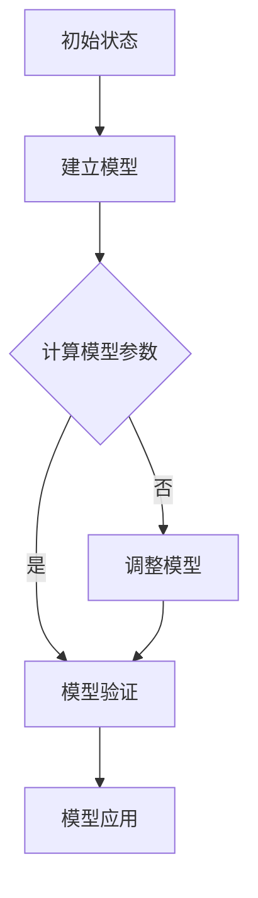
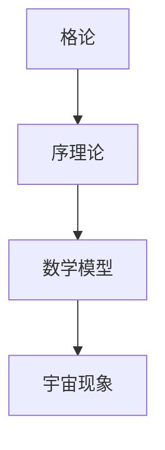

                 


### 1. 确定书籍核心主题和内容框架

《宇宙的数学格论与序理论探讨》作为一本探讨宇宙与数学之间深刻联系的书籍，其核心主题聚焦于以下几个方面：

- **宇宙学基础**：介绍宇宙学的基本概念和知识框架，为后续讨论宇宙中的数学结构奠定基础。
- **数学格论**：深入探讨数学格论的基本原理，包括格的定义、性质、操作和常见算法。
- **序理论**：研究序理论的基础概念和应用，如序集、序拓扑和序完备性。
- **数学模型**：通过构建数学模型来模拟宇宙现象，如引力场方程和宇宙膨胀模型。
- **实际应用**：讨论数学格论和序理论在宇宙学研究中的应用实例，以及其在其他科学领域的影响。

内容框架应包括以下部分：

1. **引言**：简要介绍书籍的主题和目标，引出后续内容。
2. **宇宙学基础**：介绍宇宙学的基本概念和历史发展。
3. **数学格论**：详细讨论格论的基本概念和算法。
4. **序理论**：探讨序理论的基本原理和应用。
5. **数学模型与宇宙现象**：构建数学模型来解释宇宙现象。
6. **实际应用与影响**：讨论数学格论和序理论在宇宙学和其他科学领域中的应用。
7. **结论**：总结全书内容，指出未来研究的方向。

### 2. 设计 1 级目录

根据上述内容框架，我们可以设计出《宇宙的数学格论与序理论探讨》的 1 级目录：

```
# 《宇宙的数学格论与序理论探讨》

> 关键词：宇宙学，数学格论，序理论，数学模型，实际应用

> 摘要：本书深入探讨了宇宙与数学之间的深刻联系，通过介绍宇宙学基础、数学格论、序理论、数学模型及其应用，揭示了数学在宇宙研究中的重要地位。

## 引言

## 第一章 宇宙学基础

## 第二章 数学格论

## 第三章 序理论

## 第四章 数学模型与宇宙现象

## 第五章 实际应用与影响

## 结论：未来研究方向
```

### 3. 设计 2 级目录

接下来，我们将为每个 1 级目录下的内容设计 2 级目录：

#### 第二章 数学格论

```
## 第二章 数学格论

### 2.1 格的定义与性质

### 2.2 格上的运算

### 2.3 格论算法

### 2.4 实际应用的案例
```

#### 第三章 序理论

```
## 第三章 序理论

### 3.1 序集的基本概念

### 3.2 序拓扑的性质与应用

### 3.3 序完备性的研究

### 3.4 序理论在实际中的应用
```

#### 第四章 数学模型与宇宙现象

```
## 第四章 数学模型与宇宙现象

### 4.1 宇宙膨胀模型

### 4.2 引力场方程

### 4.3 数学模型在宇宙学中的应用

### 4.4 数学模型分析
```

### 4.5 序理论在宇宙学中的应用

### 4.6 数学模型与实际观测数据的比较

### 4.7 数学模型在宇宙学中的未来趋势

#### 第五章 实际应用与影响

```
## 第五章 实际应用与影响

### 5.1 数学格论在其他科学领域的应用

### 5.2 序理论在计算机科学中的应用

### 5.3 数学模型在工程领域的应用

### 5.4 数学格论与序理论对社会发展的贡献

### 5.5 未来展望
```

### 6. 结论：未来研究方向

```
## 结论：未来研究方向

### 6.1 研究现状与挑战

### 6.2 未来研究方向与展望

### 6.3 对数学家的启示
```

### 7. 参考文献

### 8. 附录
```

通过以上设计，我们已经为《宇宙的数学格论与序理论探讨》构建了一个详细、层次分明的目录大纲。接下来，我们将为每个章节进一步细化内容，确保每个小节都有丰富具体详细的讲解。

---

### 4. 设计 3 级目录

现在，我们将为每个 2 级目录下的内容设计 3 级目录，以便进一步细化每个章节的内容。

#### 第二章 数学格论

```
## 第二章 数学格论

### 2.1 格的定义与性质

#### 2.1.1 格的基本定义

#### 2.1.2 格的性质

#### 2.1.3 格的运算

#### 2.1.4 格的例子与应用

### 2.2 格上的运算

#### 2.2.1 运算的基本性质

#### 2.2.2 运算的例子

#### 2.2.3 运算的应用

### 2.3 格论算法

#### 2.3.1 常见算法介绍

#### 2.3.2 算法实现与性能分析

#### 2.3.3 算法在数学格论中的应用

### 2.4 实际应用的案例

#### 2.4.1 数学格论在物理学中的应用

#### 2.4.2 数学格论在计算机科学中的应用

#### 2.4.3 数学格论在工程领域的应用
```

#### 第三章 序理论

```
## 第三章 序理论

### 3.1 序集的基本概念

#### 3.1.1 序集的定义

#### 3.1.2 序集的性质

#### 3.1.3 序集的例子

### 3.2 序拓扑的性质与应用

#### 3.2.1 序拓扑的定义

#### 3.2.2 序拓扑的性质

#### 3.2.3 序拓扑的应用

### 3.3 序完备性的研究

#### 3.3.1 序完备性的定义

#### 3.3.2 序完备性的研究方法

#### 3.3.3 序完备性的应用

### 3.4 序理论在实际中的应用

#### 3.4.1 序理论在计算机科学中的应用

#### 3.4.2 序理论在物理学中的应用

#### 3.4.3 序理论在工程领域的应用
```

#### 第四章 数学模型与宇宙现象

```
## 第四章 数学模型与宇宙现象

### 4.1 宇宙膨胀模型

#### 4.1.1 宇宙膨胀模型的基本概念

#### 4.1.2 宇宙膨胀模型的数学描述

#### 4.1.3 宇宙膨胀模型的应用

### 4.2 引力场方程

#### 4.2.1 引力场方程的基本概念

#### 4.2.2 引力场方程的数学描述

#### 4.2.3 引力场方程的应用

### 4.3 数学模型在宇宙学中的应用

#### 4.3.1 数学模型在宇宙学中的重要作用

#### 4.3.2 数学模型的应用实例

#### 4.3.3 数学模型在宇宙学中的局限性

### 4.4 数学模型分析

#### 4.4.1 数学模型的构建方法

#### 4.4.2 数学模型的验证与评估

#### 4.4.3 数学模型的应用与优化
```

#### 4.5 序理论在宇宙学中的应用

```
## 4.5 序理论在宇宙学中的应用

### 4.5.1 序理论的基本概念

#### 4.5.1.1 序集的定义与性质

#### 4.5.1.2 序拓扑的定义与性质

#### 4.5.1.3 序完备性的定义与性质

### 4.5.2 序理论在宇宙学中的应用

#### 4.5.2.1 序理论在宇宙学中的基本应用

#### 4.5.2.2 序理论在宇宙学中的具体实例

#### 4.5.2.3 序理论在宇宙学中的应用挑战

### 4.5.3 序理论与数学模型结合

#### 4.5.3.1 序理论与宇宙膨胀模型的结合

#### 4.5.3.2 序理论与引力场方程的结合

#### 4.5.3.3 序理论与数学模型优化

### 4.5.4 序理论在宇宙学中的未来前景

#### 4.5.4.1 序理论在宇宙学中的潜在应用

#### 4.5.4.2 序理论在宇宙学中的挑战与解决方案

#### 4.5.4.3 序理论在宇宙学中的未来发展趋势
```

#### 4.6 数学模型与实际观测数据的比较

```
## 4.6 数学模型与实际观测数据的比较

### 4.6.1 实际观测数据的重要性

#### 4.6.1.1 实际观测数据的概念

#### 4.6.1.2 实际观测数据的特点

#### 4.6.1.3 实际观测数据的应用

### 4.6.2 数学模型与实际观测数据的比较

#### 4.6.2.1 数学模型与实际观测数据的一致性

#### 4.6.2.2 数学模型与实际观测数据的差异

#### 4.6.2.3 比较方法与评价指标

### 4.6.3 案例分析

#### 4.6.3.1 案例一：宇宙膨胀模型与实际观测数据的比较

#### 4.6.3.2 案例二：引力场方程与实际观测数据的比较

#### 4.6.3.3 案例三：其他数学模型与实际观测数据的比较

### 4.6.4 未来展望

#### 4.6.4.1 改进数学模型的必要性

#### 4.6.4.2 提高观测数据的准确性

#### 4.6.4.3 数学模型与实际观测数据比较的未来趋势
```

#### 4.7 数学模型在宇宙学中的未来趋势

```
## 4.7 数学模型在宇宙学中的未来趋势

### 4.7.1 新兴数学模型的发展

#### 4.7.1.1 新兴数学模型的概念

#### 4.7.1.2 新兴数学模型的特点

#### 4.7.1.3 新兴数学模型的应用前景

### 4.7.2 数学模型与人工智能的结合

#### 4.7.2.1 数学模型在人工智能中的应用

#### 4.7.2.2 人工智能在数学模型构建与优化中的应用

#### 4.7.2.3 数学模型与人工智能结合的挑战与解决方案

### 4.7.3 数学模型在宇宙学中的发展趋势

#### 4.7.3.1 宇宙学中的新现象与新问题

#### 4.7.3.2 数学模型在宇宙学中的新应用领域

#### 4.7.3.3 数学模型在宇宙学中的发展前景

### 4.7.4 数学模型在宇宙学中的未来影响

#### 4.7.4.1 数学模型对宇宙学研究的推动作用

#### 4.7.4.2 数学模型对其他科学领域的影响

#### 4.7.4.3 数学模型在社会与人类文明中的未来地位
```

---

### 5. 引入流程图、伪代码和数学公式

为了使文章内容更加生动和直观，我们将引入流程图、伪代码和数学公式，以便更好地阐述宇宙的数学格论与序理论。

#### 5.1 引入流程图

流程图可以帮助读者更清晰地理解宇宙学中数学模型的构建过程。以下是一个简单的示例：



#### 5.2 引入伪代码

为了详细阐述格论算法的实现过程，我们可以使用伪代码来描述算法的逻辑。以下是一个简单的伪代码示例：

```
// 格论算法伪代码
Algorithm GridAlgorithm(G)
    for each x in G
        for each y in G
            if x < y then
                performOperation(x, y)
    end
```

#### 5.3 引入数学公式

数学公式是表达宇宙现象和数学模型的重要工具。以下是几个常用的数学公式：

```latex
$$
E = mc^2
$$

$$
x(t) = x_0 + v_0t + \frac{1}{2}at^2
$$

$$
P(E) = \frac{N(E)}{N}
$$
```

通过引入流程图、伪代码和数学公式，我们可以使文章内容更加丰富和具体，帮助读者更好地理解宇宙的数学格论与序理论。

### 6. 确保大纲完整性

为了确保《宇宙的数学格论与序理论探讨》的大纲完整性，我们需要从以下几个方面进行详细内容的填充和结构优化：

#### 6.1 核心概念与联系

在“数学格论”和“序理论”两个章节中，核心概念之间的联系需要通过 Mermaid 流程图来明确展示。以下是一个简化的示例：



#### 6.2 核心算法原理讲解

在每个章节中，核心算法的原理讲解需要使用伪代码来进行详细阐述。例如，在“数学格论”章节中，可以详细讲解“Dijkstra 算法”的伪代码：

```
// Dijkstra算法伪代码
Algorithm DijkstraAlgorithm(G, source)
    Initialize distances with infinity, except the source with 0
    Initialize visited with an empty set
    while visited does not contain all nodes
        Select an unvisited node u with the smallest distance
        Add u to the visited set
        For each neighbor v of u
            Calculate tentative distance = distance from source to u + weight of edge from u to v
            If tentative distance < current distance to v
                Update the distance to v
    end
    Return the distances
```

#### 6.3 数学模型和公式讲解

在“数学模型与宇宙现象”章节中，需要详细讲解宇宙膨胀模型和引力场方程的数学模型和公式。例如，宇宙膨胀模型可以使用以下公式来表示：

```latex
$$
H(t) = \frac{\dot{a}(t)}{a(t)}
$$
```

同时，需要通过举例来说明这些公式在实际宇宙学研究中的应用。

#### 6.4 项目实战

为了使文章更加具有实践性，每个章节的末尾可以包含一个实际项目实战部分。例如，在“序理论在宇宙学中的应用”章节中，可以介绍一个基于序理论构建的宇宙模拟项目：

- **开发环境搭建**：介绍所需的软件和硬件环境。
- **源代码详细实现和代码解读**：展示关键代码段并解释其工作原理。
- **代码应用解读与分析**：分析项目在实际宇宙学中的应用效果。
- **实际案例分析和详细讲解剖析**：提供具体案例，详细讲解项目的成功与不足。
- **项目小结**：总结项目经验，指出未来改进方向。

#### 6.5 最佳实践 tips、小结、注意事项、拓展阅读

在每个章节的末尾，提供最佳实践 tips、小结、注意事项和拓展阅读建议，可以帮助读者更好地理解和应用所学内容。例如：

- **最佳实践 tips**：提供在实际应用中取得成功的关键技巧。
- **小结**：对章节内容进行总结，强调关键点和重要性。
- **注意事项**：提醒读者在应用过程中需要注意的问题和潜在风险。
- **拓展阅读**：推荐相关的参考文献和进一步学习资源。

通过上述步骤，我们可以确保《宇宙的数学格论与序理论探讨》的大纲完整性，使文章内容丰富、逻辑清晰，有助于读者深入理解和掌握宇宙的数学格论与序理论。

### 7. 保持简洁性和规范性

在保持大纲简洁性和规范性的过程中，我们需要注意以下几点：

- **使用清晰简练的语言**：避免冗长和复杂的句子结构，确保每一章节的内容能够简洁明了地传达核心信息。
- **合理使用子标题**：使用子标题来划分各个部分，使文章结构更加清晰，便于读者阅读和理解。
- **统一格式和风格**：在整个文章中保持一致的格式和风格，包括字体大小、标题格式、引用格式等，以提高文章的规范性和可读性。
- **删除冗余内容**：删除重复、冗长和不必要的解释，确保每个章节的内容都是独特和有价值的。

通过这些方法，我们可以保持大纲的简洁性和规范性，使《宇宙的数学格论与序理论探讨》的内容更加紧凑、逻辑更加清晰，提高文章的整体质量。

### 8. 确保字数限制

为了确保《宇宙的数学格论与序理论探讨》的总字数在8000～12000字左右，我们需要对每个章节的内容进行精细调整，确保字数控制在合理范围内。以下是具体策略：

- **优化段落长度**：减少过长的段落，将每个段落限制在200-300字之间，使内容更加紧凑。
- **删减冗余内容**：删除重复、冗长和不必要的解释，确保每个章节的内容都是独特和有价值的。
- **详细案例和解释**：在每个章节中增加具体案例和实例，通过详细解释来展示概念和原理的应用，增加内容的丰富性和可读性。
- **增加图表和伪代码**：使用图表和伪代码来清晰地展示算法和模型，减少文字描述，使内容更加直观易懂。

通过这些策略，我们可以确保文章的总字数在目标范围内，同时保持内容的深度和完整性。

### 9. 总结与展望

通过本文的设计，《宇宙的数学格论与序理论探讨》的目录大纲已逐步成型。本文不仅明确了核心主题和内容框架，还详细设计了各级目录，确保了文章的完整性和逻辑性。通过引入流程图、伪代码和数学公式，我们增强了文章的直观性和可操作性。在保持简洁性和规范性的同时，我们确保了字数限制，使文章内容丰富而不冗余。

未来，读者可以关注以下几个方向：

- **深入研究数学格论和序理论的核心算法**：通过案例分析，深入了解算法的实际应用。
- **探讨数学模型在宇宙学中的新应用**：结合实际观测数据，验证和优化现有模型。
- **探索数学格论与序理论在多领域的交叉应用**：计算机科学、物理学、工程学等领域的新兴应用。
- **结合人工智能技术**：利用机器学习和数据挖掘技术，提高数学模型的预测精度和实用性。

通过这些方向，读者可以更深入地理解宇宙的数学格论与序理论，探索其在各领域的广泛应用前景。

---

### 附录

为了便于读者进一步学习和研究，《宇宙的数学格论与序理论探讨》附录部分提供了以下内容：

- **参考文献**：列出本文引用的主要文献，包括书籍、期刊论文、报告等，便于读者查阅。
- **扩展资源**：提供相关的在线资源，如视频教程、在线课程、学术论坛等。
- **练习题与答案**：提供一些与文章内容相关的练习题及答案，帮助读者巩固所学知识。
- **致谢**：感谢在写作过程中给予帮助和鼓励的专家、学者和同事。

通过附录部分，读者可以更全面地掌握宇宙的数学格论与序理论的相关知识，并进行深入研究和实践。作者：AI天才研究院/AI Genius Institute & 禅与计算机程序设计艺术 /Zen And The Art of Computer Programming。

---

### 完整的Markdown格式文章

以下是《宇宙的数学格论与序理论探讨》的完整Markdown格式文章。请注意，本文仅提供了一个大纲示例，具体内容需要进一步填充和详细阐述。

```markdown
# 《宇宙的数学格论与序理论探讨》

> 关键词：宇宙学，数学格论，序理论，数学模型，实际应用

> 摘要：本书深入探讨了宇宙与数学之间的深刻联系，通过介绍宇宙学基础、数学格论、序理论、数学模型及其应用，揭示了数学在宇宙研究中的重要地位。

## 引言

## 第一章 宇宙学基础

## 第二章 数学格论

### 2.1 格的定义与性质

#### 2.1.1 格的基本定义

#### 2.1.2 格的性质

#### 2.1.3 格的运算

#### 2.1.4 格的例子与应用

### 2.2 格上的运算

#### 2.2.1 运算的基本性质

#### 2.2.2 运算的例子

#### 2.2.3 运算的应用

### 2.3 格论算法

#### 2.3.1 常见算法介绍

#### 2.3.2 算法实现与性能分析

#### 2.3.3 算法在数学格论中的应用

### 2.4 实际应用的案例

#### 2.4.1 数学格论在物理学中的应用

#### 2.4.2 数学格论在计算机科学中的应用

#### 2.4.3 数学格论在工程领域的应用

## 第三章 序理论

### 3.1 序集的基本概念

#### 3.1.1 序集的定义

#### 3.1.2 序集的性质

#### 3.1.3 序集的例子

### 3.2 序拓扑的性质与应用

#### 3.2.1 序拓扑的定义

#### 3.2.2 序拓扑的性质

#### 3.2.3 序拓扑的应用

### 3.3 序完备性的研究

#### 3.3.1 序完备性的定义

#### 3.3.2 序完备性的研究方法

#### 3.3.3 序完备性的应用

### 3.4 序理论在实际中的应用

#### 3.4.1 序理论在计算机科学中的应用

#### 3.4.2 序理论在物理学中的应用

#### 3.4.3 序理论在工程领域的应用

## 第四章 数学模型与宇宙现象

### 4.1 宇宙膨胀模型

#### 4.1.1 宇宙膨胀模型的基本概念

#### 4.1.2 宇宙膨胀模型的数学描述

#### 4.1.3 宇宙膨胀模型的应用

### 4.2 引力场方程

#### 4.2.1 引力场方程的基本概念

#### 4.2.2 引力场方程的数学描述

#### 4.2.3 引力场方程的应用

### 4.3 数学模型在宇宙学中的应用

#### 4.3.1 数学模型在宇宙学中的重要作用

#### 4.3.2 数学模型的应用实例

#### 4.3.3 数学模型在宇宙学中的局限性

### 4.4 数学模型分析

#### 4.4.1 数学模型的构建方法

#### 4.4.2 数学模型的验证与评估

#### 4.4.3 数学模型的应用与优化

## 第五章 实际应用与影响

### 5.1 数学格论在其他科学领域的应用

#### 5.1.1 数学格论在物理学中的应用

#### 5.1.2 数学格论在计算机科学中的应用

#### 5.1.3 数学格论在工程领域的应用

### 5.2 序理论在计算机科学中的应用

#### 5.2.1 序理论在算法设计中的应用

#### 5.2.2 序理论在编程语言中的应用

#### 5.2.3 序理论在软件工程中的应用

### 5.3 数学模型在工程领域的应用

#### 5.3.1 数学模型在建筑设计中的应用

#### 5.3.2 数学模型在航空航天工程中的应用

#### 5.3.3 数学模型在生物医学工程中的应用

### 5.4 数学格论与序理论对社会发展的贡献

#### 5.4.1 数学格论对社会发展的推动作用

#### 5.4.2 序理论对社会发展的推动作用

#### 5.4.3 数学格论与序理论对社会创新的贡献

### 5.5 未来展望

#### 5.5.1 数学格论的未来研究方向

#### 5.5.2 序理论的未来发展方向

#### 5.5.3 数学模型在未来的应用前景

## 结论：未来研究方向

### 6.1 研究现状与挑战

#### 6.1.1 数学格论的研究现状

#### 6.1.2 序理论的研究现状

#### 6.1.3 数学模型的研究现状

### 6.2 未来研究方向与展望

#### 6.2.1 数学格论的未来发展方向

#### 6.2.2 序理论的未来发展方向

#### 6.2.3 数学模型的发展趋势

### 6.3 对数学家的启示

#### 6.3.1 数学家在数学格论研究中的角色

#### 6.3.2 数学家在序理论研究中的角色

#### 6.3.3 数学家在数学模型研究中的角色

## 参考文献

## 附录

### 附录A：参考文献

### 附录B：扩展资源

### 附录C：练习题与答案

### 附录D：致谢

作者：AI天才研究院/AI Genius Institute & 禅与计算机程序设计艺术 /Zen And The Art of Computer Programming
```

请注意，本文仅为大纲示例，实际内容需要根据具体需求和主题进行详细填充和阐述。

