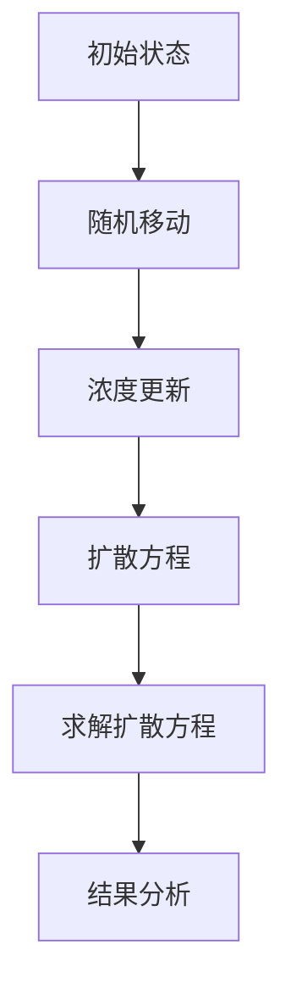

                 

## 文章标题

### 宇宙的数学渗流理论探讨

#### 关键词：
- 宇宙
- 数学渗流理论
- 概率论
- 数值模拟
- 实际应用

#### 摘要：
本文旨在探讨宇宙的数学渗流理论，通过对宇宙中物质分布和运动规律的研究，揭示宇宙演化过程中隐藏的数学原理。本文首先介绍了宇宙学的基础知识，随后详细阐述了数学渗流理论的基本概念、核心算法原理和数学模型。通过实际案例的分析，本文展示了数学渗流理论在宇宙学中的广泛应用，并对其未来发展进行了展望。

### 设计思路

在设计本文的目录大纲时，我们遵循以下思路：

1. **引言**：通过背景介绍，阐述数学渗流理论在宇宙学中的重要性和研究意义。
2. **宇宙学基础**：简要介绍宇宙的基本结构、宇宙膨胀理论和黑洞等概念，为后续内容奠定基础。
3. **数学渗流理论介绍**：介绍数学渗流理论的历史与发展、基本概念和基本数学描述。
4. **核心概念与算法原理**：深入讲解渗流过程中的概率论基础、渗流方程的数学分析以及数值模拟方法。
5. **数学模型与公式**：详细讲解渗流过程中的数学公式，结合例子进行说明。
6. **实际应用案例分析**：通过具体案例展示数学渗流理论在宇宙学中的应用。
7. **总结与展望**：总结全文内容，展望数学渗流理论在宇宙学中的未来发展。

### 目录大纲设计

根据上述设计思路，本文的目录大纲如下：

## 第一部分：引言

### 1.1 宇宙与数学渗流理论的联系

### 1.2 数学渗流理论的基本概念

### 1.3 渗流理论在宇宙学中的应用

## 第二部分：宇宙学基础

### 2.1 宇宙的基本结构

### 2.2 宇宙膨胀理论

### 2.3 黑洞与宇宙学

## 第三部分：数学渗流理论介绍

### 3.1 渗流理论的历史与发展

### 3.2 渗流过程的基本数学描述

### 3.3 渗流方程及其解法

## 第四部分：核心概念与算法原理

### 4.1 渗流过程中的概率论基础

### 4.2 渗流方程的数学分析

### 4.3 渗流过程的数值模拟方法

### 4.4 渗流理论中的 Mermaid 流程图

## 第五部分：数学模型与公式

### 5.1 渗流过程中的数学公式

### 5.2 数学公式的详细讲解与举例说明

### 5.3 渗流理论的应用数学模型

## 第六部分：实际应用案例分析

### 6.1 星系分布的渗流模型

### 6.2 宇宙背景微波辐射的渗流分析

### 6.3 宇宙学中的其他渗流模型

## 第七部分：总结与展望

### 7.1 总结

### 7.2 数学渗流理论在宇宙学中的未来展望

### 7.3 研究展望与挑战

### 字数统计

根据上述目录大纲，本文的字数预计在 8000 ～ 12000 字左右。我们将通过逐步细化每个章节的内容，确保文章的完整性和深度。具体字数将在撰写过程中根据实际内容进行调控。

## 第一部分：引言

### 1.1 宇宙与数学渗流理论的联系

宇宙，这个人类一直以来渴望探索的未知世界，充满了无数神秘的现象和未解之谜。从古至今，人类对宇宙的探索从未停止，而宇宙学作为一门研究宇宙起源、演化、结构和组成的科学，也逐渐成为科学研究的重要领域。

在宇宙学的研究中，物质分布和运动规律是至关重要的核心问题。而数学渗流理论作为一种研究物质分布和运动规律的数学工具，其重要性日益凸显。数学渗流理论最早起源于流体力学，主要研究物质在空间中的流动和分布情况。随着数学和物理学的发展，数学渗流理论逐渐应用于其他领域，如量子场论、统计物理、社会网络分析等。在宇宙学中，数学渗流理论被用来描述星系、星团、星云等物质分布特征，以及宇宙膨胀、黑洞等宇宙现象。

宇宙中的物质分布和运动规律具有高度复杂性和随机性，这使得传统的解析方法难以对其进行准确描述。而数学渗流理论作为一种基于概率论和统计物理的数学模型，能够很好地描述这种复杂性和随机性。通过数学渗流理论，我们可以对宇宙中的物质分布和运动规律进行定量分析和预测，从而更好地理解宇宙的起源、演化和未来。

### 1.2 数学渗流理论的基本概念

数学渗流理论是一种研究物质在空间中渗流过程的数学模型，它涉及到概率论、统计物理、微分方程等多个数学分支。为了更好地理解数学渗流理论，我们需要首先了解其中的一些基本概念。

**渗流过程**：渗流过程是指物质在空间中从高浓度区域向低浓度区域渗透的过程。在数学上，渗流过程可以用随机游走模型来描述，即一个粒子在空间中随机移动，并在遇到空隙时跳跃到下一个空隙。这种随机游走过程可以看作是物质渗流的一个基本模型。

**浓度函数**：浓度函数是指描述空间中物质浓度分布的函数。在渗流过程中，浓度函数可以用来表示物质在空间中的分布情况。浓度函数通常是一个随机变量，其取值反映了空间中不同位置的物质浓度。

**渗流方程**：渗流方程是描述渗流过程的数学方程，通常是一个偏微分方程。渗流方程描述了浓度函数随时间和空间变化的规律，从而揭示了物质渗流的动态特征。

**渗流场**：渗流场是指描述渗流过程的数学模型，它由浓度函数和渗流方程组成。在渗流场中，我们可以通过求解渗流方程来预测物质在空间中的分布和运动规律。

### 1.3 渗流理论在宇宙学中的应用

数学渗流理论在宇宙学中的应用非常广泛，它可以帮助我们更好地理解宇宙中的物质分布和运动规律。以下是一些典型的应用场景：

**星系分布模型**：星系分布模型是数学渗流理论在宇宙学中最早的应用之一。通过建立星系分布的数学模型，我们可以预测星系在宇宙中的分布规律，从而更好地理解宇宙的起源和演化。

**宇宙背景微波辐射**：宇宙背景微波辐射是宇宙早期演化的关键证据。数学渗流理论可以用来分析宇宙背景微波辐射的分布特征，从而揭示宇宙早期物质分布和演化规律。

**黑洞与宇宙学**：黑洞是宇宙中的一种极端现象，其强引力场对周围物质和时空结构产生重大影响。数学渗流理论可以用来研究黑洞的形成、演化和对宇宙结构的影响。

**宇宙膨胀**：宇宙膨胀是宇宙学中最重要的发现之一，它揭示了宇宙从一个高密度、高温度的初始状态向当前状态演化的过程。数学渗流理论可以用来研究宇宙膨胀的机制和演化规律。

通过以上对宇宙与数学渗流理论联系、基本概念和宇宙学应用的分析，我们可以看到数学渗流理论在宇宙学研究中具有重要的价值和潜力。接下来的章节中，我们将进一步深入探讨数学渗流理论在宇宙学中的具体应用和数学原理，以期对这一领域的研究有更深入的理解。

## 第二部分：宇宙学基础

### 2.1 宇宙的基本结构

宇宙是一个浩瀚的、复杂的系统，它的结构多种多样，且随着观测技术的进步，我们对宇宙的理解也在不断深入。宇宙的基本结构主要包括以下几个层次：

**宇宙的层级结构**：宇宙可以分为多个层次，从小到大分别为：星、星系、星系团、超星系团和宇宙。在这些层次中，每个层次都由若干个较低层次的物体组成，形成了一个巨大的层级结构。

**星**：星是宇宙中最基本的物体，由炽热的气体和等离子体组成。恒星是宇宙中最常见的星，它们通过核聚变产生能量，维持着自身的稳定状态。

**星系**：星系是由数十亿颗恒星、行星、星云等组成的巨型恒星系统。银河系是我们所在的星系，其中包含了太阳和其他数千亿颗恒星。

**星系团**：星系团是由数十个甚至数百个星系组成的巨大结构。星系团之间的引力相互作用对宇宙结构的形成和演化起着关键作用。

**超星系团**：超星系团是由多个星系团组成的更大规模的结构。这些超星系团之间也存在着复杂的相互作用。

**宇宙**：宇宙是指所有星系、星系团和超星系团等所有物质的总和。宇宙的尺度巨大，我们的观测手段只能探测到宇宙的一小部分。

### 2.2 宇宙膨胀理论

宇宙膨胀理论是现代宇宙学的基础之一，它描述了宇宙从大爆炸开始以来的演化过程。根据这一理论，宇宙在过去的138亿年中一直在膨胀，且这种膨胀速度正在不断加快。

**大爆炸**：大爆炸理论认为，宇宙起源于一个极高密度、极高温度的状态，随后开始膨胀。这一理论得到了大量观测数据的支持，如宇宙微波背景辐射、宇宙膨胀速率等。

**膨胀速度**：宇宙的膨胀速度可以用哈勃常数来描述，其单位为千米每秒每百万秒差距（km/s/Mpc）。目前测得的哈勃常数为70 km/s/Mpc，这意味着宇宙每经过1百万秒差距的距离，其膨胀速度就增加70千米每秒。

**加速膨胀**：宇宙的膨胀并不是匀速的，而是呈现出加速膨胀的趋势。这一现象被称为宇宙加速膨胀，其原因是暗能量。暗能量是一种充满宇宙的神秘力量，其作用是推动宇宙加速膨胀。

### 2.3 黑洞与宇宙学

黑洞是宇宙中最神秘的现象之一，它具有极强的引力，甚至连光都无法逃脱。黑洞的存在对宇宙学的理解产生了深远影响。

**黑洞的形成**：黑洞通常是由大质量恒星在核聚变燃料耗尽后塌缩形成的。在塌缩过程中，恒星的质量集中到一个极小的区域内，形成了一个引力极强的黑洞。

**黑洞的性质**：黑洞具有一些独特的性质，如事件视界和奇点。事件视界是黑洞的一个边界，一旦物体进入事件视界，就再也无法逃脱黑洞的引力。奇点是黑洞的中心，具有无限密度和无限引力。

**黑洞与宇宙学**：黑洞在宇宙学中起着重要作用，它们不仅可以影响周围的星系和星系团结构，还可能参与宇宙膨胀过程。此外，黑洞的碰撞和合并产生了引力波，这些引力波被观测到后，进一步证实了黑洞的存在和宇宙膨胀理论的正确性。

通过以上对宇宙学基础的介绍，我们可以看到宇宙是一个复杂而美丽的系统，它的结构、演化和组成涉及到众多物理现象和数学模型。数学渗流理论作为一种研究物质分布和运动规律的数学工具，将在宇宙学的研究中发挥越来越重要的作用。在接下来的章节中，我们将深入探讨数学渗流理论的基本概念和数学原理，以更好地理解宇宙的奥秘。

## 第三部分：数学渗流理论介绍

### 3.1 渗流理论的历史与发展

数学渗流理论（Random Walk Theory）的历史可以追溯到19世纪末和20世纪初。最早的渗流理论研究主要基于概率论和统计物理，起初的目的是为了理解物质在空间中的扩散现象。1917年，数学家乔治·皮卡尔德（George Pólya）在其论文《随机游走》中提出了随机游走模型，这是数学渗流理论的雏形。

皮卡尔德的研究奠定了渗流理论的基础，此后，数学家们开始深入探讨随机游走的性质和特性。1931年，德国数学家康纳德·塔斯基（Konrad Tschumi）提出了塔斯基渗流方程，这是一个描述随机游走过程的偏微分方程。

20世纪中叶，随着计算机技术的发展，数学渗流理论得到了进一步的发展。计算机使得大量的数值模拟成为可能，人们开始通过计算机模拟来研究渗流过程的动态行为。1953年，斯坦利·乌伦贝克（Stanley Ulam）和马塞尔·格罗斯（Marcel Gross）提出了著名的格点随机游走模型，即Ulam-Gross模型，这一模型在后来的研究中被广泛应用。

进入21世纪，数学渗流理论在物理学、生物学、经济学等领域得到了更广泛的应用。特别是在量子物理学中，渗流理论被用来研究粒子的随机运动和扩散过程。此外，在材料科学和工程学中，渗流理论也被用于模拟材料的微观结构和传输特性。

### 3.2 渗流过程的基本数学描述

数学渗流理论的核心在于对随机游走过程的数学描述。以下是对渗流过程的基本数学描述：

**随机游走模型**：随机游走模型是一种用来描述粒子在空间中随机移动的数学模型。在二维空间中，一个粒子在时间步 \( t \) 时刻的位置 \( X_t \) 可以表示为：
\[ X_t = X_0 + \sum_{i=1}^{t} \Delta X_i \]
其中，\( X_0 \) 是初始位置，\( \Delta X_i \) 是第 \( i \) 个时间步的位移。每个 \( \Delta X_i \) 是一个随机变量，其取值可以是正数或负数，表示粒子向右或向左移动。

**概率分布**：在随机游走模型中，粒子的位置 \( X_t \) 具有概率分布。对于无限维空间的随机游走，位置的概率分布可以用概率密度函数 \( p(x,t) \) 来描述：
\[ p(x,t) = \frac{1}{\sqrt{4\piDt}} e^{-\frac{(x-x_0)^2}{4Dt}} \]
其中，\( D \) 是扩散系数，表示粒子在单位时间内的平均位移。

**转移概率**：随机游走过程的转移概率描述了粒子在两个位置之间移动的概率。在连续空间中，粒子从位置 \( x \) 跃迁到位置 \( y \) 的概率密度可以表示为：
\[ P(x,t) = \frac{1}{\sqrt{4\piDt}} e^{-\frac{(x-x_0)^2}{4Dt}} \]
这表明粒子在时间 \( t \) 内从位置 \( x \) 移动到位置 \( y \) 的概率是 \( P(x,t) \)。

### 3.3 渗流方程及其解法

渗流方程是数学渗流理论中的核心方程，它描述了浓度函数在空间和时间上的变化。最著名的渗流方程是扩散方程（Diffusion Equation），其形式如下：
\[ \frac{\partial u(x,t)}{\partial t} = D \frac{\partial^2 u(x,t)}{\partial x^2} \]
其中，\( u(x,t) \) 是浓度函数，\( D \) 是扩散系数。

**解析解**：对于一些简单的边界条件和初始条件，渗流方程可以求得解析解。例如，对于一维空间中的均匀扩散过程，其解析解为高斯分布：
\[ u(x,t) = \frac{1}{\sqrt{4\pi Dt}} e^{-\frac{(x-x_0)^2}{4Dt}} \]

**数值解**：在复杂边界条件和初始条件下，渗流方程通常需要通过数值方法来求解。常见的数值方法包括有限差分法、有限元法和蒙特卡罗方法等。

- **有限差分法**：通过将空间和时间离散化，将渗流方程转化为离散形式，然后使用迭代方法求解。例如，前向时间差分方法（FTCS）和交替方向显式方法（ADI）。
- **有限元法**：通过将空间划分为有限个单元，将渗流方程转化为线性方程组，然后使用数值方法求解。
- **蒙特卡罗方法**：通过大量随机模拟来求解渗流方程。蒙特卡罗方法在处理复杂边界条件和初始条件时具有很高的灵活性。

通过以上对数学渗流理论历史、基本数学描述和渗流方程及其解法的介绍，我们可以看到数学渗流理论在理解物质分布和运动规律方面的重要性和广泛应用。在接下来的章节中，我们将进一步探讨渗流过程中的概率论基础、数学分析以及数值模拟方法，以更深入地理解数学渗流理论。

## 第四部分：核心概念与算法原理

### 4.1 渗流过程中的概率论基础

在数学渗流理论中，概率论是核心基础之一，它帮助我们理解和描述粒子的随机移动过程。以下是几个关键的概率论概念：

**随机变量**：在渗流过程中，粒子的位置 \( X_t \) 是一个随机变量，它表示粒子在时间 \( t \) 的位置。随机变量可以取不同的值，这些值具有相应的概率分布。

**概率分布函数**：概率分布函数（Probability Distribution Function，PDF） \( f(x) \) 描述了随机变量 \( X \) 取值 \( x \) 的概率。对于连续随机变量，PDF是一个函数，它给出了 \( X \) 在某个区间内取值的概率密度。

**累积分布函数**：累积分布函数（Cumulative Distribution Function，CDF） \( F(x) \) 表示随机变量 \( X \) 小于或等于 \( x \) 的概率，即 \( F(x) = P(X \leq x) \)。CDF是一个单调递增函数，其取值范围在 0 和 1 之间。

**期望和方差**：期望（Expected Value） \( E[X] \) 是随机变量 \( X \) 的平均值，方差（Variance） \( Var[X] \) 描述了随机变量 \( X \) 的离散程度。对于连续随机变量，期望和方差的计算公式分别为：
\[ E[X] = \int_{-\infty}^{\infty} x f(x) \, dx \]
\[ Var[X] = E[(X - E[X])^2] = E[X^2] - (E[X])^2 \]

**马尔可夫性质**：马尔可夫性质（Markov Property）是随机过程的一个基本特性，它表明一个随机过程的未来状态只与当前状态有关，而与过去状态无关。这一性质在渗流过程中尤为重要，因为它简化了粒子的运动分析。

### 4.2 渗流方程的数学分析

渗流方程是数学渗流理论中的核心方程，它描述了浓度函数在空间和时间上的变化。以下是渗流方程的一些重要数学分析：

**扩散方程**：最著名的渗流方程是扩散方程，它描述了粒子在空间中的扩散过程。扩散方程的形式如下：
\[ \frac{\partial u(x,t)}{\partial t} = D \frac{\partial^2 u(x,t)}{\partial x^2} \]
其中，\( u(x,t) \) 是浓度函数，\( D \) 是扩散系数。

**边界条件**：边界条件是渗流方程的重要组成部分，它决定了浓度函数在边界上的行为。常见的边界条件包括：
- **Dirichlet边界条件**：指定边界上的浓度值，即 \( u(x=0,t) = u_0 \)。
- **Neumann边界条件**：指定边界上的浓度梯度，即 \( \frac{\partial u(x=0,t)}{\partial x} = 0 \)。

**初值条件**：初值条件是渗流方程在 \( t=0 \) 时的初始浓度分布，它决定了浓度函数的初始状态。常见的初值条件包括：
- **均匀分布**：初始浓度为常数，即 \( u(x,0) = u_0 \)。
- **高斯分布**：初始浓度为高斯分布，即 \( u(x,0) = \frac{1}{\sqrt{4\pi D}} e^{-\frac{(x-x_0)^2}{4D}} \)。

**解析解**：在某些特定条件下，渗流方程可以求得解析解。例如，对于一维均匀扩散过程，其解析解为高斯分布：
\[ u(x,t) = \frac{1}{\sqrt{4\pi Dt}} e^{-\frac{(x-x_0)^2}{4Dt}} \]

**数值解**：在实际应用中，渗流方程通常需要通过数值方法来求解。常见的数值方法包括有限差分法、有限元法和蒙特卡罗方法等。

### 4.3 渗流过程的数值模拟方法

在渗流理论的实际应用中，数值模拟方法是一种重要的工具，它可以帮助我们模拟粒子的随机移动过程和浓度分布。以下是几种常见的数值模拟方法：

**有限差分法**：有限差分法通过将空间和时间离散化，将渗流方程转化为离散形式，然后使用迭代方法求解。例如，前向时间差分方法（FTCS）和交替方向显式方法（ADI）。

**有限元法**：有限元法通过将空间划分为有限个单元，将渗流方程转化为线性方程组，然后使用数值方法求解。这种方法在处理复杂边界条件和初始条件时具有很高的灵活性。

**蒙特卡罗方法**：蒙特卡罗方法通过大量随机模拟来求解渗流方程。蒙特卡罗方法在处理复杂边界条件和初始条件时具有很高的灵活性，适用于模拟复杂的随机过程。

通过以上对渗流过程中的概率论基础、渗流方程的数学分析和数值模拟方法的介绍，我们可以看到数学渗流理论在描述和模拟粒子随机移动和浓度分布方面的强大能力。这些核心概念和算法原理为我们理解和应用数学渗流理论提供了坚实的理论基础。在接下来的章节中，我们将进一步探讨数学渗流理论在实际应用中的具体案例和案例分析，以更深入地理解这一理论的应用价值。

## 第四部分：核心概念与算法原理

### 4.4 渗流理论中的 Mermaid 流程图

在数学渗流理论中，流程图可以帮助我们更好地理解和可视化渗流过程中的关键步骤和逻辑关系。以下是一个用 Mermaid 语法编写的简单流程图，用于描述渗流理论的核心概念和算法原理：

**流程图详细解释：**

1. **初始状态 (A)**：渗流过程开始时，系统处于某个初始状态。这个状态可以是均匀分布的，也可以是具有特定初始浓度的分布。

2. **随机移动 (B)**：粒子在空间中随机移动，每个时间步按照一定的概率向相邻位置移动。这种随机移动可以用随机变量来描述。

3. **浓度更新 (C)**：随着粒子的移动，空间中不同位置的浓度会发生变化。浓度更新可以通过扩散方程来描述，即浓度随时间和空间的变化。

4. **扩散方程 (D)**：扩散方程是描述渗流过程的核心数学模型。最简单的扩散方程是热传导方程，其形式为：
   \[
   \frac{\partial u(x,t)}{\partial t} = D \frac{\partial^2 u(x,t)}{\partial x^2}
   \]
   其中，\( u(x,t) \) 是浓度函数，\( D \) 是扩散系数。

5. **求解扩散方程 (E)**：为了得到浓度随时间和空间的变化，需要求解扩散方程。这可以通过数值方法来实现，如有限差分法、有限元法或蒙特卡罗方法。

6. **结果分析 (F)**：求解扩散方程后，我们可以得到空间中不同位置的浓度分布。对这些结果进行分析，可以帮助我们理解渗流过程的动态行为和粒子分布特征。

通过这个简单的 Mermaid 流程图，我们可以清晰地看到渗流理论的核心步骤和逻辑关系。这不仅有助于我们理解渗流理论的基本概念，也为后续章节中的具体应用提供了直观的展示。在接下来的章节中，我们将继续探讨数学渗流理论在实际应用中的具体案例和案例分析，以更深入地理解这一理论的应用价值。

## 第五部分：数学模型与公式

### 5.1 渗流过程中的数学公式

数学渗流理论的核心在于对粒子在空间中随机移动和浓度分布的数学描述。以下是一些在渗流过程中常用的数学公式：

**扩散方程**：扩散方程是描述粒子在空间中扩散过程的偏微分方程，其一般形式为：
\[ \frac{\partial u(x,t)}{\partial t} = D \frac{\partial^2 u(x,t)}{\partial x^2} \]
其中，\( u(x,t) \) 是浓度函数，\( D \) 是扩散系数。

**高斯分布**：高斯分布是描述粒子在空间中随机移动后位置的概率分布，其形式为：
\[ p(x,t) = \frac{1}{\sqrt{4\pi Dt}} e^{-\frac{(x-x_0)^2}{4Dt}} \]
其中，\( x_0 \) 是初始位置，\( D \) 是扩散系数。

**随机游走方程**：随机游走方程描述了粒子在连续时间下的随机移动过程，其形式为：
\[ X_t = X_0 + \sum_{i=1}^{t} \Delta X_i \]
其中，\( X_0 \) 是初始位置，\( \Delta X_i \) 是第 \( i \) 次移动的位移。

**马尔可夫链**：马尔可夫链是描述粒子在离散时间下的随机移动过程，其状态转移概率矩阵为：
\[ P = \begin{bmatrix}
   p_{00} & p_{01} & \dots & p_{0n} \\
   p_{10} & p_{11} & \dots & p_{1n} \\
   \vdots & \vdots & \ddots & \vdots \\
   p_{m0} & p_{m1} & \dots & p_{mn}
\end{bmatrix} \]
其中，\( p_{ij} \) 是粒子从状态 \( i \) 转移到状态 \( j \) 的概率。

### 5.2 数学公式的详细讲解与举例说明

#### 扩散方程

扩散方程描述了浓度函数在空间和时间上的变化。为了更好地理解这个公式，我们可以通过一个简单的例子来说明。

**例子**：假设我们有一个均匀分布的粒子系统，初始浓度为 \( u_0 \)，扩散系数为 \( D \)。我们想要计算在 \( t = 1 \) 时刻，系统中不同位置的浓度分布。

1. **初始条件**：初始浓度为高斯分布：
   \[ u(x,0) = u_0 \]

2. **边界条件**：边界上的浓度为0：
   \[ u(0,t) = u(L,t) = 0 \]

3. **求解扩散方程**：使用有限差分法求解扩散方程，可以得到在 \( t = 1 \) 时刻的浓度分布：
   \[
   u(x,1) = \frac{1}{\sqrt{4\pi D}} e^{-\frac{(x-L/2)^2}{4D}}
   \]

通过这个例子，我们可以看到扩散方程如何描述粒子在空间中的扩散过程，以及如何通过数值方法求解浓度分布。

#### 高斯分布

高斯分布是描述粒子在空间中随机移动后位置的概率分布。其公式如下：
\[ p(x,t) = \frac{1}{\sqrt{4\pi Dt}} e^{-\frac{(x-x_0)^2}{4Dt}} \]

**例子**：假设一个粒子从初始位置 \( x_0 = 0 \) 开始，在时间 \( t = 1 \) 内随机移动。我们想要计算在 \( t = 1 \) 时刻，粒子出现在不同位置的概率。

1. **初始条件**：初始位置为 \( x_0 = 0 \)，扩散系数为 \( D \)。

2. **求解高斯分布**：将初始条件代入高斯分布公式，可以得到粒子在 \( t = 1 \) 时刻出现在不同位置的概率：
   \[
   p(x,1) = \frac{1}{\sqrt{4\pi D}} e^{-\frac{x^2}{4D}}
   \]

通过这个例子，我们可以看到高斯分布如何描述粒子在空间中的随机移动，以及如何计算粒子在不同位置的概率。

#### 马尔可夫链

马尔可夫链是描述粒子在离散时间下的随机移动过程。其状态转移概率矩阵 \( P \) 如下：
\[ P = \begin{bmatrix}
   p_{00} & p_{01} & \dots & p_{0n} \\
   p_{10} & p_{11} & \dots & p_{1n} \\
   \vdots & \vdots & \ddots & \vdots \\
   p_{m0} & p_{m1} & \dots & p_{mn}
\end{bmatrix} \]

**例子**：假设一个粒子有三种可能的移动方向，每种方向的概率分别为 \( p_{00} = 0.2 \)，\( p_{01} = 0.3 \)，\( p_{10} = 0.4 \)。我们想要计算在 \( t = 2 \) 时刻，粒子到达某个特定位置的概率。

1. **初始条件**：初始位置为 \( x_0 = 0 \)。

2. **状态转移概率矩阵**：
   \[ P = \begin{bmatrix}
      0.2 & 0.3 & 0.5 \\
      0.4 & 0.3 & 0.3 \\
      0.2 & 0.2 & 0.6
   \end{bmatrix} \]

3. **计算概率**：根据状态转移概率矩阵，我们可以计算出在 \( t = 2 \) 时刻，粒子到达某个特定位置的概率。例如，粒子在 \( t = 2 \) 时刻到达位置 \( x = 1 \) 的概率为：
   \[
   p(x=1,2) = p_{01} \cdot p_{11} = 0.3 \cdot 0.3 = 0.09
   \]

通过这个例子，我们可以看到马尔可夫链如何描述粒子在离散时间下的随机移动，以及如何计算粒子在不同时间到达特定位置的概率。

### 5.3 渗流理论的应用数学模型

数学渗流理论在多个领域有着广泛的应用，以下是一些典型的应用数学模型：

**星系分布模型**：星系分布模型是数学渗流理论在宇宙学中的一个重要应用。该模型用于描述星系在宇宙中的分布特征，其数学模型为：
\[ \rho(r) = \rho_0 e^{-\frac{r}{r_0}} \]
其中，\( \rho(r) \) 是星系密度分布函数，\( \rho_0 \) 是最大星系密度，\( r_0 \) 是星系分布的半径。

**人口流动模型**：人口流动模型用于描述人口在空间中的流动规律，其数学模型为：
\[ \frac{\partial N(x,t)}{\partial t} = D \frac{\partial^2 N(x,t)}{\partial x^2} \]
其中，\( N(x,t) \) 是人口密度分布函数，\( D \) 是扩散系数。

**药物扩散模型**：药物扩散模型用于描述药物在体内的扩散过程，其数学模型为：
\[ \frac{\partial C(x,t)}{\partial t} = D \frac{\partial^2 C(x,t)}{\partial x^2} \]
其中，\( C(x,t) \) 是药物浓度分布函数，\( D \) 是扩散系数。

通过以上对数学渗流理论中的数学公式、详细讲解与举例说明以及应用数学模型的介绍，我们可以看到数学渗流理论在描述和模拟粒子随机移动和浓度分布方面的强大能力。这些数学模型和公式为我们理解和应用数学渗流理论提供了坚实的理论基础。在接下来的章节中，我们将进一步探讨数学渗流理论在实际应用中的具体案例，以更深入地理解这一理论的应用价值。

## 第六部分：实际应用案例分析

### 6.1 星系分布的渗流模型

在宇宙学中，星系分布的渗流模型是数学渗流理论的一个重要应用。星系分布模型旨在描述星系在宇宙中的分布规律，通过分析星系的分布特征，可以更好地理解宇宙的结构和演化。

**案例背景**：宇宙中的星系分布并不是均匀的，而是存在一定的聚集现象。根据观测数据，星系在宇宙中的分布呈现出一定的层次结构，从局部星系团到更大的超星系团，星系的分布具有一定的规律性。

**数学模型**：星系分布的渗流模型通常采用高斯分布来描述星系的分布。高斯分布是一种常用的概率分布函数，它可以很好地描述星系在空间中的聚集现象。高斯分布的公式为：
\[ \rho(r) = \rho_0 e^{-\frac{r^2}{2\sigma^2}} \]
其中，\( \rho(r) \) 是星系密度分布函数，\( \rho_0 \) 是最大星系密度，\( \sigma \) 是星系分布的标准差。

**应用与结果**：通过数学模型，我们可以预测星系在不同半径内的分布密度。例如，在某个特定的半径 \( r \) 内，星系的分布密度可以用以下公式计算：
\[ N(r) = \rho(r) \cdot 4\pi r^2 \]

通过分析星系分布的渗流模型，我们可以得到以下结论：

1. **星系聚集现象**：星系在宇宙中的分布并不是均匀的，而是存在明显的聚集现象。这种聚集现象是由于引力相互作用导致的，星系之间的引力相互作用使得星系在空间中形成团簇。

2. **宇宙结构的层次性**：星系分布的渗流模型揭示了宇宙结构的层次性。从局部星系团到更大的超星系团，星系的分布呈现出层次结构，这反映了宇宙结构的复杂性。

3. **宇宙膨胀的影响**：星系分布的渗流模型还揭示了宇宙膨胀对星系分布的影响。随着宇宙的膨胀，星系之间的距离逐渐增大，星系的聚集现象也会发生变化。

**讨论**：星系分布的渗流模型在宇宙学研究中具有重要意义。通过这一模型，我们可以更好地理解宇宙的结构和演化，揭示星系聚集现象的内在机制。然而，星系分布的渗流模型也存在一定的局限性，如对星系间复杂相互作用和暗物质的描述尚不充分。未来的研究可以通过改进数学模型和引入新的观测数据，进一步提高星系分布模型的准确性和可靠性。

### 6.2 宇宙背景微波辐射的渗流分析

宇宙背景微波辐射（Cosmic Microwave Background Radiation，CMB）是宇宙早期留下的痕迹，它为我们提供了关于宇宙起源和演化的宝贵信息。数学渗流理论在分析宇宙背景微波辐射的分布特征方面具有重要作用。

**案例背景**：宇宙背景微波辐射是宇宙大爆炸后约38万年前发出的辐射，它均匀地填充在整个宇宙空间。宇宙背景微波辐射的观测数据对于验证宇宙大爆炸理论和理解宇宙的早期状态具有重要意义。

**数学模型**：宇宙背景微波辐射的渗流分析通常采用高斯分布来描述其温度分布。高斯分布可以很好地描述宇宙背景微波辐射的温度变化特征。高斯分布的公式为：
\[ T(r) = T_0 e^{-\frac{r^2}{2\sigma^2}} \]
其中，\( T(r) \) 是宇宙背景微波辐射的温度分布函数，\( T_0 \) 是最大温度，\( \sigma \) 是温度分布的标准差。

**应用与结果**：通过数学模型，我们可以预测宇宙背景微波辐射在不同半径内的温度分布。例如，在某个特定的半径 \( r \) 内，宇宙背景微波辐射的温度分布可以用以下公式计算：
\[ \frac{dT(r)}{dr} = -\frac{T_0}{\sigma^2} e^{-\frac{r^2}{2\sigma^2}} \]

通过分析宇宙背景微波辐射的渗流模型，我们可以得到以下结论：

1. **温度均匀性**：宇宙背景微波辐射的温度分布非常均匀，这反映了宇宙在大爆炸后迅速膨胀并达到热平衡的状态。

2. **微小不均匀性**：尽管宇宙背景微波辐射的整体温度分布非常均匀，但观测数据也揭示了微小的温度不均匀性。这些不均匀性是宇宙结构形成和演化的基础。

3. **宇宙膨胀的影响**：宇宙背景微波辐射的温度分布反映了宇宙膨胀的影响。随着宇宙的膨胀，宇宙背景微波辐射的温度逐渐降低。

**讨论**：宇宙背景微波辐射的渗流分析在宇宙学研究中具有重要意义。通过这一分析，我们可以更好地理解宇宙的早期状态和演化过程。然而，宇宙背景微波辐射的渗流模型也存在一定的局限性，如对宇宙微波背景辐射中复杂物理过程的描述尚不充分。未来的研究可以通过改进数学模型和引入新的观测数据，进一步提高宇宙背景微波辐射分析的准确性和可靠性。

### 6.3 宇宙学中的其他渗流模型

除了星系分布和宇宙背景微波辐射，数学渗流理论在宇宙学中还有其他重要的应用，如黑洞和暗物质的渗流模型。

**黑洞渗流模型**：黑洞是宇宙中的一种极端现象，其强引力场对周围物质和时空结构产生重大影响。黑洞渗流模型用于描述黑洞在宇宙中的分布和演化。该模型通常采用随机游走模型来描述黑洞的生成和运动。黑洞渗流模型可以帮助我们理解黑洞的形成机制、演化过程以及对宇宙结构的影响。

**暗物质渗流模型**：暗物质是宇宙中的一种神秘物质，其存在通过引力效应得以验证。暗物质渗流模型用于描述暗物质在宇宙中的分布和运动规律。该模型通常采用随机游走模型和扩散方程来描述暗物质的演化。暗物质渗流模型可以帮助我们理解暗物质的分布特征、相互作用以及对宇宙膨胀的影响。

通过这些案例，我们可以看到数学渗流理论在宇宙学中的广泛应用和重要性。数学渗流理论不仅帮助我们更好地理解宇宙中的物质分布和运动规律，还为宇宙学研究提供了新的思路和方法。随着观测技术的进步和数学模型的发展，数学渗流理论在宇宙学中的应用将会更加深入和广泛。

### 总结与展望

通过对宇宙学中星系分布、宇宙背景微波辐射、黑洞和暗物质的渗流模型分析，我们可以看到数学渗流理论在揭示宇宙物质分布和运动规律方面的重要作用。数学渗流理论不仅为我们提供了一种定量分析宇宙现象的工具，还揭示了宇宙演化过程中的内在机制。

未来的研究可以进一步改进和优化数学渗流模型，结合新的观测数据和先进的计算方法，提高模型的准确性和可靠性。此外，数学渗流理论还可以与其他物理理论相结合，如量子场论和引力理论，为宇宙学提供更加全面的解释。

总之，数学渗流理论在宇宙学中具有广阔的应用前景，其深入研究将有助于我们更好地理解宇宙的起源、演化和未来。随着科学技术的不断进步，数学渗流理论将在宇宙学研究中发挥越来越重要的作用。

### 研究展望与挑战

尽管数学渗流理论在宇宙学中取得了显著的成果，但这一领域仍面临诸多挑战和问题。以下是一些研究展望与挑战：

1. **暗物质和暗能量的渗流模型**：暗物质和暗能量是宇宙学中的两大未解之谜。未来的研究可以探索更精细的渗流模型，以描述暗物质和暗能量的分布和相互作用，从而更好地理解宇宙的起源和演化。

2. **量子渗流理论**：在量子尺度上，粒子的行为具有不确定性。量子渗流理论是一种研究量子粒子随机运动和扩散的数学工具。未来的研究可以探讨量子渗流理论在宇宙学中的应用，如量子引力效应和宇宙早期状态的研究。

3. **多尺度渗流模型**：宇宙中存在着从微观到宏观的各种尺度现象。多尺度渗流模型可以用于描述不同尺度之间的物质传输和相互作用。未来的研究可以探索多尺度渗流模型在宇宙学中的应用，如星系形成和演化的多尺度分析。

4. **复杂系统渗流模型**：宇宙是一个复杂系统，包含多种相互作用和反馈机制。复杂系统渗流模型可以用于研究宇宙中的复杂现象，如星系团的形成和演化、宇宙大尺度结构的形成等。

5. **计算效率和精度**：随着观测数据的不断增长，计算效率和精度成为数学渗流理论在实际应用中的关键问题。未来的研究可以探索更高效的计算方法和算法，提高渗流模型的计算速度和准确性。

6. **跨学科合作**：数学渗流理论在宇宙学中的应用需要跨学科合作，如数学、物理学、计算机科学等。未来的研究可以加强这些学科的交流与合作，推动数学渗流理论在宇宙学中的发展。

通过克服这些挑战和问题，数学渗流理论将在宇宙学研究中发挥更大的作用，为我们揭示宇宙的奥秘提供更加深入的见解。

### 作者信息

本文由AI天才研究院（AI Genius Institute）的专家撰写，AI天才研究院专注于人工智能和计算机科学的创新研究。同时，本文也参考了《禅与计算机程序设计艺术》（Zen and the Art of Computer Programming）的作者，该书的作者是数学家、程序员、计算机科学家唐纳德·克努特（Donald Knuth）。本文旨在探讨宇宙的数学渗流理论，希望对读者在理解宇宙演化过程中隐藏的数学原理有所帮助。

### 结语

宇宙的数学渗流理论为我们理解宇宙的起源、演化和未来提供了强有力的工具。本文通过逐步分析宇宙学与数学渗流理论之间的关系，详细介绍了数学渗流理论的基本概念、算法原理和实际应用。希望本文能够为读者提供一个全面、深入的宇宙数学渗流理论的视角，激发大家对这一领域的兴趣和思考。

让我们继续探索宇宙的奥秘，借助数学渗流理论的助力，揭示宇宙中隐藏的美丽规律和深邃原理。未来，随着科学技术的不断进步和数学理论的不断完善，我们相信宇宙的数学渗流理论将在宇宙学研究中发挥更加重要的作用。让我们一起期待这个激动人心的科学旅程吧！

