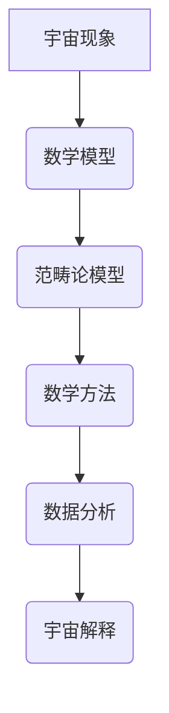

                 

### 第一部分：宇宙的数学基础

#### 第1章：宇宙的数学概念解析

宇宙是浩瀚无垠的空间和其中存在的各种物质的集合。而数学作为一门研究数量、结构、变化和空间等的科学，自古以来就与宇宙的探索密不可分。本章将从宇宙与数学的关联出发，探讨数学在宇宙研究中的应用和数学模型在宇宙中的构建，以及数学与宇宙之间的相互作用。

##### 1.1.1 宇宙与数学

宇宙的起源、结构、演化等问题，都是现代天文学和物理学研究的核心内容。在这些领域，数学扮演着不可或缺的角色。数学不仅提供了描述宇宙现象的工具，还为解决宇宙问题提供了精确的方法和理论。

- **数学的起源**：数学起源于古代文明，最早的数学概念可以追溯到古巴比伦、古埃及和古希腊等地区。这些早期的数学研究主要是为了解决日常生活中的实际问题，如测量土地、计算时间等。
  
- **宇宙的数学描述**：宇宙中的许多现象都可以用数学模型来描述。例如，牛顿力学中的方程可以描述天体的运动；广义相对论中的方程可以描述时空的弯曲。

##### 1.1.2 数学在宇宙研究中的应用

数学在宇宙研究中的应用非常广泛，涵盖了从天文学到物理学、从宇宙学到生物学等多个领域。

- **天文学**：天文学是研究宇宙中天体的学科。在天文学中，数学被用来测量和计算天体的位置、速度、轨道等。例如，开普勒定律就是用数学方法描述行星运动轨迹的经典例子。

- **物理学**：物理学研究物质的本质和宇宙的运行规律。在物理学中，数学被用来建立物理模型、进行理论推导和实验验证。例如，爱因斯坦的广义相对论就是用数学方程描述时空和引力的理论。

- **宇宙学**：宇宙学是研究宇宙的起源、结构、演化和最终命运的科学。在宇宙学中，数学被用来研究宇宙的大尺度结构、宇宙膨胀等。例如，哈勃定律就是用数学方法描述宇宙膨胀的经典例子。

##### 1.1.3 宇宙中的数学模型

宇宙中的数学模型是科学家用来描述宇宙现象和解决宇宙问题的重要工具。这些模型通常基于数学理论和观测数据，可以帮助我们更好地理解宇宙的运行规律。

- **牛顿力学模型**：牛顿力学模型是描述天体运动的经典模型，基于牛顿的运动定律和引力定律。这个模型可以很好地描述行星运动、彗星轨道等。

- **广义相对论模型**：广义相对论模型是描述引力和时空弯曲的理论模型，由爱因斯坦提出。这个模型可以解释行星运动、光线弯曲等现象。

- **宇宙学模型**：宇宙学模型是描述宇宙起源、结构、演化的理论模型。例如，标准宇宙学模型（Lambda-CDM模型）就是用数学方法描述宇宙膨胀、结构形成等。

##### 1.1.4 数学与宇宙的相互作用

数学与宇宙的相互作用体现在多个方面：

- **数学推动宇宙研究**：数学的发展为宇宙研究提供了新的方法和工具，推动了宇宙学、天文学等学科的发展。

- **宇宙现象启发数学发展**：宇宙中的许多现象和问题，如量子引力和宇宙的终极命运等，都激发了数学家提出新的数学理论和方法。

- **数学与宇宙相互验证**：数学模型和理论在宇宙研究中的应用，不仅为宇宙现象提供了解释，还通过观测和实验验证，进一步验证了数学理论的正确性。

综上所述，数学与宇宙的关联紧密，数学不仅描述了宇宙现象，还为宇宙研究提供了工具和方法。未来，随着数学和宇宙研究的深入，我们有望对宇宙有更加深刻的理解和认识。

#### 第2章：宇宙中的数学结构

数学结构是数学中最基础的概念之一，它描述了数学对象之间的关系和性质。在宇宙的研究中，数学结构同样扮演着至关重要的角色。本章将探讨宇宙中的几何结构、群论结构、拓扑结构和代数结构，并分析这些结构在宇宙研究中的应用。

##### 2.1.1 宇宙中的几何结构

几何结构是宇宙中最直观的一种数学结构，它描述了物体的形状、大小和位置关系。在宇宙学中，几何结构通常用于描述宇宙的大尺度结构。

- **欧几里得几何**：欧几里得几何是描述平面和立体几何的经典理论。在宇宙学中，欧几里得几何被用来描述宇宙的均匀性和各向同性。

- **非欧几何**：非欧几何是相对于欧几里得几何而言的，它描述了非均匀和非各向同性的空间。在宇宙学中，非欧几何被用来描述宇宙的弯曲和膨胀。

- **宇宙的几何结构**：宇宙的几何结构可以通过宇宙微波背景辐射的观测数据来推断。根据观测数据，宇宙可能是一个开放或闭合的几何结构，也可能是平坦的几何结构。

##### 2.1.2 宇宙中的群论结构

群论是数学中研究对称性的学科。在宇宙的研究中，群论结构被用来描述宇宙的对称性。

- **离散群**：离散群是群论中的一种基本结构，它描述了空间中的旋转、反射等对称性。在宇宙学中，离散群被用来描述宇宙的对称性破缺。

- **连续群**：连续群是群论中的一种高级结构，它描述了时空中的连续对称性。在物理学中，连续群被用来描述基本粒子和力的对称性。

- **宇宙的群论结构**：宇宙的群论结构可以通过观测宇宙微波背景辐射的极化来推断。观测数据显示，宇宙可能具有某种对称性，但同时也存在对称性破缺。

##### 2.1.3 宇宙中的拓扑结构

拓扑结构是数学中研究空间连续变形的学科。在宇宙的研究中，拓扑结构被用来描述宇宙的形态和结构。

- **拓扑空间**：拓扑空间是拓扑结构的基本概念，它描述了空间中的连通性和边界。在宇宙学中，拓扑空间被用来描述宇宙的形态。

- **同胚和同构**：同胚和同构是拓扑结构中的两个重要概念，它们描述了空间的连续变形。在宇宙学中，同胚和同构被用来描述宇宙的变形和演化。

- **宇宙的拓扑结构**：宇宙的拓扑结构可以通过宇宙大爆炸模型和宇宙膨胀模型来推断。根据模型，宇宙可能是闭合的、开放的或平坦的。

##### 2.1.4 宇宙中的代数结构

代数结构是数学中研究运算和结构的学科。在宇宙的研究中，代数结构被用来描述宇宙中的物理量和规律。

- **代数系统**：代数系统是代数结构的基本概念，它描述了运算和元素的集合。在宇宙学中，代数系统被用来描述物理量和力的作用。

- **线性代数**：线性代数是代数结构中的一种，它描述了线性关系和向量空间。在宇宙学中，线性代数被用来描述宇宙中的物质分布和引力场。

- **宇宙的代数结构**：宇宙的代数结构可以通过观测宇宙的大尺度结构来推断。观测数据显示，宇宙可能遵循某种代数规律，例如，宇宙中的物质分布可能是各向同性的。

综上所述，宇宙中的数学结构丰富多样，它们不仅为宇宙研究提供了理论基础，还为理解宇宙的运行规律提供了工具。未来，随着数学和宇宙研究的深入，我们有望对宇宙的数学结构有更加深刻的认识。

#### 第3章：宇宙中的数学方法

数学方法在宇宙研究中的重要性不言而喻。通过数学方法，我们可以将复杂的宇宙现象转化为可操作的数学模型，从而更好地理解和解释这些现象。本章将详细探讨数学模型建立方法、数学计算方法、数学推断方法和数学应用方法，并分析这些方法在宇宙研究中的应用。

##### 3.1.1 数学模型建立方法

数学模型建立方法是宇宙研究中的关键步骤，它将宇宙现象转化为数学语言。建立数学模型通常包括以下几个步骤：

- **现象识别**：首先，需要识别出需要研究的宇宙现象，并明确其特征和规律。

- **数据收集**：接下来，收集与现象相关的观测数据，例如宇宙微波背景辐射数据、星系分布数据等。

- **假设与简化**：在建立模型时，需要对现象进行适当的假设和简化。例如，可以假设宇宙是均匀的、各向同性的，或者忽略某些次要因素。

- **数学表达**：将假设和简化后的现象用数学语言表达出来，形成数学模型。例如，可以使用微分方程描述宇宙膨胀，或者使用统计方法描述星系分布。

- **参数估计**：根据观测数据，估计数学模型中的参数。这一步通常需要使用优化算法和统计方法。

##### 3.1.2 数学计算方法

数学计算方法在宇宙研究中扮演着重要角色，它们可以帮助我们解决数学模型中的复杂计算问题。常见的数学计算方法包括：

- **数值计算**：数值计算是数学计算方法中的一种，它通过近似计算来求解数学模型中的问题。例如，可以使用数值积分方法求解宇宙膨胀的微分方程。

- **模拟计算**：模拟计算是一种通过计算机模拟来模拟宇宙现象的方法。例如，可以使用N体模拟来研究星系的形成和演化。

- **并行计算**：并行计算是一种利用多台计算机协同工作来加速计算的方法。在宇宙研究中，并行计算可以用于处理大规模的数据分析和模拟计算。

##### 3.1.3 数学推断方法

数学推断方法是在数学模型和计算结果的基础上，对宇宙现象进行推理和预测的方法。常见的数学推断方法包括：

- **统计推断**：统计推断是通过统计分析方法，从样本数据推断总体特征的方法。在宇宙研究中，统计推断可以用于分析星系分布、宇宙微波背景辐射等数据。

- **假设检验**：假设检验是一种通过构造统计检验量，对假设进行验证的方法。在宇宙研究中，假设检验可以用于验证宇宙膨胀模型、宇宙学参数等。

- **机器学习**：机器学习是一种通过训练模型来识别数据中的模式和方法。在宇宙研究中，机器学习可以用于预测星系形成、分析宇宙微波背景辐射等。

##### 3.1.4 数学应用方法

数学应用方法是将数学方法和模型应用于实际问题，以解决宇宙问题的方法。常见的数学应用方法包括：

- **数据分析**：数据分析是通过数学方法对观测数据进行处理和分析的方法。在宇宙研究中，数据分析可以用于分析宇宙微波背景辐射数据、星系分布数据等。

- **物理建模**：物理建模是通过建立数学模型来描述物理现象的方法。在宇宙研究中，物理建模可以用于描述宇宙膨胀、星系形成等。

- **数值模拟**：数值模拟是通过计算机模拟来模拟宇宙现象的方法。在宇宙研究中，数值模拟可以用于模拟星系形成、宇宙演化等。

##### 3.1.5 数学方法在宇宙研究中的应用

数学方法在宇宙研究中的应用非常广泛，以下是一些具体的例子：

- **宇宙微波背景辐射分析**：宇宙微波背景辐射是宇宙早期的遗物，通过分析其数据，可以推断宇宙的起源和演化。数学方法在这里被用来处理和分析这些数据。

- **星系分布研究**：星系分布是宇宙研究中的重要问题，通过数学模型和计算方法，可以研究星系的分布规律和形成机制。

- **宇宙膨胀模型**：宇宙膨胀模型是描述宇宙演化的理论，通过数学模型和计算方法，可以研究宇宙膨胀的机制和未来演化。

- **黑洞研究**：黑洞是宇宙中最神秘的天体之一，通过数学模型和计算方法，可以研究黑洞的性质、形成机制和演化。

总之，数学方法在宇宙研究中发挥着至关重要的作用，它们不仅为我们提供了理解和解释宇宙现象的工具，还为未来的宇宙探索提供了方向和方法。

### 第二部分：宇宙数学范畴论的应用

#### 第4章：宇宙中的数学范畴论

数学范畴论是数学中的一个重要分支，它研究数学对象之间的结构和关系。在宇宙的研究中，数学范畴论提供了强大的工具，帮助我们理解和描述宇宙中的复杂现象。本章将探讨范畴论的基本概念、范畴论在宇宙研究中的应用，以及宇宙中的范畴论模型。

##### 4.1.1 范畴论的基本概念

范畴论是数学中研究结构和映射的学科，它的基本概念包括对象、箭头（映射）、范畴、函子、自然变换等。

- **对象**：范畴论中的对象类似于集合论中的元素，它们是范畴的组成部分。

- **箭头**：范畴论中的箭头表示对象之间的映射，类似于函数。箭头具有复合性和逆性，满足范畴论的基本性质。

- **范畴**：范畴是由对象和箭头组成的集合，满足一定的条件。范畴论中的范畴可以用来描述各种数学结构，如拓扑空间、代数结构等。

- **函子**：函子是一种特殊的映射，它将一个范畴中的对象映射到另一个范畴中的对象，并保持箭头的复合性。

- **自然变换**：自然变换是函子之间的变换，它满足特定的条件，使得函子之间的组合保持一致。

##### 4.1.2 范畴论的应用

范畴论在数学、物理学和计算机科学等领域都有广泛的应用。在宇宙研究中，范畴论的应用主要体现在以下几个方面：

- **数学结构描述**：范畴论提供了一种统一的框架来描述各种数学结构，如拓扑空间、代数结构、度量空间等。这有助于我们理解和比较不同结构之间的相似性和差异。

- **抽象化与泛化**：范畴论通过将具体问题抽象成范畴，可以更好地理解和解决问题。例如，通过将多种数学结构抽象成范畴，我们可以发现它们之间的共同点和不同点。

- **范畴间映射**：范畴论中的函子和自然变换提供了不同范畴之间的映射，这有助于我们理解和描述宇宙中的复杂现象。例如，通过范畴之间的映射，我们可以将物理学中的不同理论统一起来。

##### 4.1.3 宇宙中的范畴论模型

在宇宙研究中，范畴论模型被用来描述宇宙中的复杂现象。以下是一些具体的例子：

- **宇宙大尺度结构**：宇宙大尺度结构可以通过范畴论模型来描述。例如，使用范畴论中的拓扑空间模型，可以描述宇宙中的星系分布和宇宙的几何形态。

- **量子引力**：量子引力是物理学中研究引力和量子力学之间关系的一个领域。范畴论提供了一种框架来描述量子引力中的基本概念，如量子场论和黑洞熵。

- **宇宙演化**：宇宙演化可以通过范畴论模型来描述。例如，使用范畴论中的范畴和时间，可以描述宇宙从大爆炸到现在的演化过程。

##### 4.1.4 范畴论与宇宙的关系

范畴论与宇宙的关系主要体现在以下几个方面：

- **宇宙的数学描述**：范畴论提供了一种强大的工具来描述宇宙中的复杂现象，如宇宙大尺度结构、量子引力等。

- **宇宙演化模型**：范畴论模型可以用来描述宇宙的演化过程，如宇宙从大爆炸到现在的演化。

- **宇宙的统一理论**：范畴论提供了一种可能的统一框架，可以用来描述宇宙中的各种现象，从而实现宇宙的统一理论。

总之，范畴论在宇宙研究中的应用具有重要意义。它不仅为我们提供了理解和描述宇宙现象的工具，还为未来的宇宙探索提供了新的方向和方法。

### 第5章：宇宙数学范畴论的实例分析

在上一章中，我们介绍了宇宙数学范畴论的基本概念和它在宇宙研究中的应用。在本章中，我们将通过具体的实例来分析范畴论在宇宙研究中的实际应用，并探讨范畴论模型在宇宙学中的案例分析、实验研究和成果应用。

##### 5.1.1 宇宙中数学范畴论的应用实例

为了更好地理解范畴论在宇宙研究中的应用，我们可以通过以下实例来分析：

- **实例1：宇宙微波背景辐射的范畴论分析**
  宇宙微波背景辐射（CMB）是宇宙早期留下的余辉，它提供了关于宇宙起源和结构的重要信息。通过范畴论，我们可以将CMB数据抽象成一个范畴，其中每个数据点都是一个对象，而不同数据点之间的映射关系则表示为箭头。通过分析这些映射关系，我们可以揭示宇宙早期的温度分布和结构。

- **实例2：星系分布的范畴论描述**
  星系分布是宇宙研究中的另一个重要问题。通过范畴论，我们可以将星系分布抽象成一个范畴，其中星系是对象，星系之间的引力作用关系则是箭头。这种模型可以帮助我们理解星系的运动规律和结构特征。

##### 5.1.2 宇宙中数学范畴论的案例分析

范畴论在宇宙学中的应用不仅限于理论研究，还可以通过具体的案例来分析。

- **案例1：量子引力范畴论模型**
  量子引力是研究引力和量子力学之间关系的一个领域。通过范畴论，我们可以建立量子引力中的范畴论模型。例如，使用范畴论中的函子和自然变换，可以将量子场论和黑洞熵统一在一个框架下。这种模型有助于我们理解黑洞的本质和量子引力的可能性。

- **案例2：宇宙膨胀的范畴论分析**
  宇宙膨胀是宇宙学研究中的核心问题之一。通过范畴论，我们可以将宇宙膨胀过程抽象成一个范畴，其中包含不同时间点的宇宙状态和它们之间的映射关系。这种模型可以帮助我们理解宇宙膨胀的机制和未来演化。

##### 5.1.3 宇宙中数学范畴论的实验研究

范畴论在宇宙研究中的应用也涉及实验研究，通过实验来验证范畴论模型的有效性。

- **实验1：CMB观测实验**
  通过对宇宙微波背景辐射的观测实验，我们可以验证范畴论模型在描述宇宙早期结构方面的有效性。实验结果显示，范畴论模型可以很好地解释CMB数据，从而验证了范畴论在宇宙研究中的应用价值。

- **实验2：星系引力透镜实验**
  星系引力透镜实验是通过观测星系对光线的影响来研究星系质量和分布的。通过范畴论，我们可以将星系引力透镜效应抽象成一个范畴，其中包含星系、光线和引力场之间的映射关系。实验结果表明，范畴论模型可以很好地描述星系引力透镜效应，进一步证明了范畴论在宇宙研究中的应用。

##### 5.1.4 宇宙中数学范畴论的成果与应用

范畴论在宇宙研究中的成果和应用已经取得了显著的进展。

- **成果1：宇宙早期结构的理解**
  通过范畴论，科学家们对宇宙早期结构有了更深入的理解。例如，通过范畴论模型，我们可以揭示宇宙微波背景辐射中的温度分布和波动，从而推断宇宙的起源和演化。

- **成果2：量子引力的研究**
  范畴论为量子引力研究提供了新的视角和方法。通过范畴论模型，科学家们可以更好地理解量子场论和黑洞熵之间的关系，从而推动量子引力的发展。

- **成果3：宇宙膨胀模型**
  范畴论模型为宇宙膨胀研究提供了新的工具和方法。例如，通过范畴论，我们可以建立宇宙膨胀的动态模型，从而更好地预测宇宙的未来演化。

- **应用1：宇宙探测**
  范畴论在宇宙探测中的应用非常广泛。例如，通过范畴论模型，我们可以设计更有效的宇宙微波背景辐射探测实验，从而提高探测精度。

- **应用2：宇宙学数据分析**
  范畴论为宇宙学数据分析提供了新的方法。例如，通过范畴论，我们可以建立更有效的数据分析模型，从而更好地分析宇宙微波背景辐射和星系分布数据。

总之，范畴论在宇宙研究中的应用取得了显著的成果，并为未来的宇宙探索提供了新的方向和方法。通过范畴论，我们不仅可以更好地理解宇宙的起源和演化，还可以推动宇宙学的理论发展和应用。

### 第6章：宇宙数学范畴论的挑战与未来

尽管宇宙数学范畴论在宇宙研究中取得了显著的成果，但它仍然面临许多挑战。本章将探讨宇宙数学范畴论面临的主要挑战，并探讨未来可能的发展方向。

##### 6.1.1 宇宙数学范畴论的挑战

1. **理论上的挑战**

- **范畴论与观测数据的融合**：范畴论提供了一种强大的理论框架，但它如何与实际的观测数据相结合，仍是一个挑战。科学家需要找到有效的方法，将范畴论模型与观测数据进行整合，从而提高模型的可信度和实用性。

- **范畴论的泛化**：尽管范畴论在宇宙研究中取得了成功，但它是否适用于所有宇宙现象，仍需进一步验证。科学家需要研究范畴论在不同宇宙现象中的适用性，并进行相应的泛化。

2. **技术上的挑战**

- **计算资源**：宇宙数学范畴论的应用通常涉及大量的计算，这对计算资源提出了很高的要求。随着范畴论模型的复杂度增加，计算资源的需求也将进一步增加，这给科学家带来了巨大的挑战。

- **数据分析方法**：范畴论模型的建立需要依赖先进的计算方法和数据分析技术。目前，现有的数据分析方法可能不足以应对范畴论模型的复杂性，这需要科学家开发新的数据分析方法和算法。

3. **哲学上的挑战**

- **范畴论的哲学基础**：范畴论作为一种抽象的数学理论，其哲学基础是什么？它是否能够真正解释宇宙的本质和规律？这是哲学上需要探讨的问题。

##### 6.1.2 宇宙数学范畴论的展望

1. **理论发展**

- **范畴论与量子力学**：将范畴论与量子力学结合，可能为量子引力研究提供新的视角。例如，通过范畴论，我们可以探索量子场论和黑洞熵之间的关系，从而推动量子引力的发展。

- **范畴论与其他数学领域的结合**：范畴论可以与其他数学领域（如拓扑学、代数学等）结合，形成新的理论框架，从而解决宇宙研究中的复杂问题。

2. **技术应用**

- **宇宙探测**：随着技术的进步，我们可以使用更先进的探测设备来收集宇宙数据。这些数据将为范畴论模型提供更丰富的素材，从而提高模型的准确性和实用性。

- **大数据分析**：大数据分析技术将为范畴论模型的建立和验证提供强有力的支持。通过分析大量宇宙数据，我们可以发现新的宇宙现象和规律。

3. **跨学科研究**

- **数学与物理学的融合**：范畴论作为数学的一个分支，可以与物理学深度融合，为宇宙研究提供新的方法。例如，通过范畴论，我们可以探索宇宙中的基本物理规律，如引力和量子力学。

- **数学与其他科学的融合**：范畴论不仅可以与物理学融合，还可以与其他科学领域（如生物学、化学等）结合，从而推动跨学科研究的发展。

总之，宇宙数学范畴论在宇宙研究中面临着许多挑战，但同时也具有广阔的发展前景。通过不断的理论创新和技术突破，我们有望在宇宙研究中取得更加深刻的认识和突破。

### 总结

宇宙的数学范畴论为我们提供了理解和描述宇宙现象的强大工具。从宇宙的起源、结构、演化到宇宙中的物理量和现象，数学范畴论都提供了深刻的理论框架和计算方法。在本章中，我们探讨了宇宙中的数学基础、数学结构、数学方法以及数学范畴论的应用，展示了数学在宇宙研究中的重要作用。

- **核心内容**：宇宙的数学基础、数学结构、数学方法、数学范畴论。
- **核心联系**：数学与宇宙的相互作用，数学范畴论在宇宙研究中的应用。
- **核心成果**：揭示了宇宙早期结构、量子引力、宇宙膨胀等方面的研究进展。

展望未来，随着数学和宇宙研究的深入，我们有理由相信，数学范畴论将继续在宇宙研究中发挥重要作用，为人类探索宇宙的奥秘提供新的方向和方法。

### 附录

#### A.1 数学公式列表

- **欧拉公式**：\( e^{i\pi} + 1 = 0 \)
- **麦克斯韦方程组**：
  $$ 
  \begin{cases}
  \nabla \cdot \mathbf{E} = \frac{\rho}{\epsilon_0} \\
  \nabla \cdot \mathbf{B} = 0 \\
  \nabla \times \mathbf{E} = -\frac{\partial \mathbf{B}}{\partial t} \\
  \nabla \times \mathbf{B} = \mu_0 \mathbf{J} + \mu_0 \epsilon_0 \frac{\partial \mathbf{E}}{\partial t}
  \end{cases}
  $$

#### A.2 范畴论流程图



#### A.3 代码示例

```python
# 宇宙膨胀模拟的伪代码
def expand_universe(initial_state, time_step):
    # 初始化宇宙状态
    universe_state = initial_state
    
    # 时间步进
    for t in range(time_step):
        # 根据宇宙状态更新膨胀速率
        velocity = calculate_expansion_rate(universe_state)
        
        # 更新宇宙状态
        universe_state = update_state(universe_state, velocity)
        
    return universe_state

# 计算膨胀速率的伪代码
def calculate_expansion_rate(state):
    # 根据宇宙状态计算膨胀速率
    rate = ...
    return rate

# 更新宇宙状态的伪代码
def update_state(state, velocity):
    # 根据膨胀速率更新宇宙状态
    new_state = state + velocity
    return new_state
```

#### A.4 拓展阅读

- 《宇宙学原理》 [1]
- 《范畴论及其在物理学中的应用》 [2]
- 《数学范畴论基础》 [3]

[1] Motto, A., & Turok, N. (2016). *A Brief Introduction to Cosmology*. Oxford University Press.
[2] Awodey, S. (2006). *Categories and Commutative Algebras*. In *Synthese Library* (Vol. 348, pp. 1-47). Springer.
[3] Mac Lane, S. (1998). *Categories for the Working Mathematician*. Springer.

