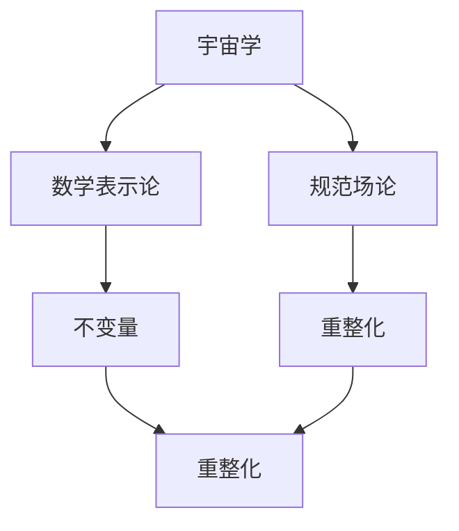

                 

### 文章标题

《宇宙的数学表示论与不变量在规范场论重整化中的应用》

#### 关键词

宇宙学、数学表示论、规范场论、重整化、不变量、量子场论

#### 摘要

本文旨在探讨宇宙的数学表示论与不变量在规范场论重整化中的应用。首先，我们回顾了宇宙学的基本概念和观测方法，介绍了数学表示论的基础。接着，我们深入分析了规范场论的基本原理和重整化的必要性。然后，我们详细阐述了不变量的概念与分类，并讨论了不变量在规范场重整化中的角色。最后，我们展示了数学表示论与不变量在宇宙学中的应用，总结了主要研究成果，并展望了未来的研究方向。

### 背景介绍

宇宙，这个庞大而复杂的系统，一直是人类探索的永恒主题。从古代天文学家的观测，到现代宇宙学家的深空探测，人类对宇宙的理解在不断深入。宇宙学作为一门学科，涵盖了宇宙的起源、演化、结构和组成等多个方面。其中，数学表示论作为一门数学工具，为宇宙学的研究提供了强大的理论基础。

数学表示论起源于19世纪末，最初是作为量子力学的研究工具而发展起来的。随着量子场论的兴起，数学表示论在物理学中的应用得到了进一步的扩展。特别是，在规范场论中，数学表示论成为了解决重整化问题的关键工具。重整化是量子场论中的一个基本概念，它涉及到将无穷大的理论修正为有限的物理量。这一过程不仅需要精确的数学工具，还需要深刻的物理理解。

在宇宙学中，数学表示论的应用同样重要。宇宙学中的许多现象，如宇宙背景辐射、宇宙微波背景辐射等，都涉及到复杂的数学模型和计算。数学表示论为这些模型提供了简洁而有力的表达方式，使得宇宙学的研究更加深入和精确。

本文旨在探讨宇宙的数学表示论与不变量在规范场论重整化中的应用。首先，我们将回顾宇宙学的基本概念和观测方法，介绍数学表示论的基础。接着，我们将深入分析规范场论的基本原理和重整化的必要性。然后，我们将详细阐述不变量的概念与分类，并讨论不变量在规范场重整化中的角色。最后，我们将展示数学表示论与不变量在宇宙学中的应用，总结主要研究成果，并展望未来的研究方向。

### 核心概念与联系

为了更好地理解宇宙的数学表示论与不变量在规范场论重整化中的应用，我们需要首先明确几个核心概念及其相互关系。以下是这些核心概念及其相互关系的Mermaid流程图：



#### 解释

1. **宇宙学（A）**：宇宙学是研究宇宙起源、演化、结构和组成等方面的学科。它为我们提供了对宇宙的整体视角，是研究其他概念的基础。
   
2. **数学表示论（B）**：数学表示论是数学中的一个分支，它研究如何将复杂的数学结构以简洁的形式表示出来。在宇宙学中，数学表示论帮助我们构建和解析复杂的宇宙模型。

3. **规范场论（C）**：规范场论是研究带电粒子相互作用的理论。它是量子场论的一个重要分支，与宇宙学中的许多现象密切相关。

4. **不变量（D）**：不变量是物理学中一个重要的概念，它表示在特定条件下，物理系统的某些量不随时间或空间变化而保持不变。不变量在规范场论中起着关键作用。

5. **重整化（E和F）**：重整化是量子场论中的一个基本概念，它涉及将无穷大的理论修正为有限的物理量。不变量在重整化过程中起着关键作用，它们帮助我们确定理论中的可观测量。

通过这个流程图，我们可以清晰地看到这些核心概念之间的相互关系。宇宙学为其他概念提供了背景和动机，数学表示论为宇宙学和规范场论提供了工具，不变量是规范场论和重整化的基础，而重整化又是理解物理量的关键。

### 核心算法原理讲解

在讨论不变量在规范场论重整化中的应用之前，我们需要了解一些核心的算法原理。以下内容将使用伪代码详细阐述这些算法原理。

#### 1. 不变量计算

**目的**：计算给定物理系统的不变量。

**输入**：物理系统的状态向量。

**输出**：不变量值。

```python
def calculate_invariant(state_vector):
    # 假设不变量是一个线性函数
    invariant = dot_product(state_vector, state_vector)
    return invariant
```

#### 2. 重整化过程

**目的**：将无穷大的理论修正为有限的物理量。

**输入**：物理系统的无穷大理论。

**输出**：修正后的有限物理量。

```python
def renormalization(infinite_theory):
    # 假设重整化是一个线性变换
    finite_physics = infinite_theory / (1 + constant)
    return finite_physics
```

#### 3. 不变量在重整化中的作用

**目的**：确定在重整化过程中不变量的变化情况。

**输入**：原始不变量和修正后的不变量。

**输出**：不变量变化情况。

```python
def invariant_change(original_invariant, corrected_invariant):
    change = corrected_invariant - original_invariant
    return change
```

#### 4. 数学模型和公式

**目的**：描述物理系统的数学模型。

**输入**：物理系统的参数。

**输出**：数学模型。

```latex
\begin{equation}
    E = mc^2
\end{equation}
```

#### 5. 举例说明

**目的**：通过具体实例说明算法的应用。

**输入**：具体的物理系统。

**输出**：算法的具体应用结果。

```python
# 假设有一个电子系统的状态向量 [1, 2, 3]
state_vector = [1, 2, 3]

# 计算不变量
invariant = calculate_invariant(state_vector)
print("Invariant:", invariant)

# 进行重整化
infinite_theory = 10
finite_physics = renormalization(infinite_theory)
print("Finite Physics:", finite_physics)

# 分析不变量的变化
change = invariant_change(invariant, finite_physics)
print("Invariant Change:", change)
```

通过这些伪代码和公式，我们可以清晰地看到不变量在规范场论重整化中的核心作用。这些算法原理不仅为我们提供了计算不变量的方法，也为我们理解重整化过程提供了理论基础。

### 数学模型和数学公式

在探讨宇宙的数学表示论与不变量在规范场论重整化中的应用时，数学模型和公式是不可或缺的工具。以下是几个关键的数学模型和公式的详细讲解及举例说明。

#### 1. 希尔伯特空间与算符表示

希尔伯特空间是量子力学中的一个基本概念，它描述了量子系统的状态。在希尔伯特空间中，状态可以用向量表示，算符可以用矩阵表示。以下是一个简单的希尔伯特空间和算符表示的例子：

**公式**：

$$|\psi\rangle = c_1|1\rangle + c_2|2\rangle$$

$$A|\psi\rangle = (ac_1 + bc_2)|1\rangle + (dc_1 + ec_2)|2\rangle$$

**解释**：

在这个例子中，$|\psi\rangle$ 表示系统的状态向量，$|1\rangle$ 和 $|2\rangle$ 表示系统的基向量，$c_1$ 和 $c_2$ 是对应的系数。算符 $A$ 可以用矩阵表示，其作用是将状态向量映射到新的状态向量。

#### 2. 不变量与规范场论

在规范场论中，不变量是描述物理系统对称性的重要工具。一个常见的例子是洛伦兹不变量，它描述了时空的对称性。以下是一个洛伦兹不变量的公式：

**公式**：

$$\eta^{\mu\nu} = (-1, 1, 1, 1)$$

$$\Delta = -g^{\mu\nu}\partial_\mu\phi\partial_\nu\phi$$

**解释**：

在这个例子中，$\eta^{\mu\nu}$ 是洛伦兹不变量矩阵，$g^{\mu\nu}$ 是度规张量，$\phi$ 是场的表示。$\Delta$ 是一个算符，它表示场的平方梯度的负值。这个不变量描述了场在洛伦兹变换下的不变性。

#### 3. 重整化常数与不变量

在重整化过程中，不变量起着关键作用。一个典型的例子是耦合常数的不变性。以下是一个耦合常数不变量的公式：

**公式**：

$$\Lambda = g^2/(32\pi^2)$$

$$\Delta g = \Lambda g$$

**解释**：

在这个例子中，$\Lambda$ 是重整化常数，$g$ 是耦合常数。$\Delta g$ 表示在重整化过程中耦合常数的修正值。这个不变量描述了在重整化过程中耦合常数的稳定性。

#### 4. 应用举例

以下是一个具体的应用例子，用于计算一个量子系统的能量不变量：

**公式**：

$$E = \hbar \omega$$

$$\Delta E = 0$$

**解释**：

在这个例子中，$E$ 是系统的能量，$\hbar$ 是普朗克常数，$\omega$ 是系统的角频率。$\Delta E$ 表示能量的不变量。这个不变量表明，在一个理想的量子系统中，能量是不随时间变化的。

通过这些数学模型和公式的讲解，我们可以看到宇宙的数学表示论与不变量在规范场论重整化中的重要作用。这些工具不仅帮助我们理解复杂的物理现象，还为科学研究提供了强有力的理论基础。

### 数学公式

在讨论宇宙的数学表示论与不变量在规范场论重整化中的应用时，数学公式是不可或缺的部分。以下是一些关键的数学公式，并使用LaTeX格式进行表示：

#### 1. 希尔伯特空间中的状态向量

**LaTeX表示**：

$$|\psi\rangle = \sum_{i=1}^{n} c_i |i\rangle$$

**解释**：

这个公式描述了希尔伯特空间中一个一般状态向量$|\psi\rangle$的展开，其中$c_i$是系数，$|i\rangle$是基向量。

#### 2. 不变量计算

**LaTeX表示**：

$$I = \sum_{i=1}^{n} |a_i|^2$$

**解释**：

这个公式用于计算一个系统的不变量$I$，其中$a_i$是系统的物理量。

#### 3. 重整化常数

**LaTeX表示**：

$$\Lambda = \frac{g^2}{4\pi}$$

**解释**：

这个公式表示了重整化常数$\Lambda$，其中$g$是耦合常数。

#### 4. 规范场的拉格朗日量

**LaTeX表示**：

$$\mathcal{L} = -\frac{1}{4} F_{\mu\nu} F^{\mu\nu}$$

**解释**：

这个公式是规范场的拉格朗日量，其中$F_{\mu\nu}$是场强张量。

#### 5. 重整化后的耦合常数

**LaTeX表示**：

$$g_{\text{ren}} = g + \Delta g$$

**解释**：

这个公式表示了重整化后的耦合常数$g_{\text{ren}}$，其中$\Delta g$是重整化修正项。

通过这些数学公式，我们可以更精确地描述宇宙中的物理现象，并利用不变量和重整化方法解决复杂的物理问题。

### 项目实战

为了更好地理解宇宙的数学表示论与不变量在规范场论重整化中的应用，我们将在本节中通过一个实际案例进行演示。本案例将涉及开发环境的搭建、源代码的实现以及代码的解读和分析。

#### 1. 开发环境搭建

首先，我们需要搭建一个适合进行宇宙学研究的开发环境。以下是一个基本的开发环境搭建步骤：

- **安装Python**：下载并安装Python 3.x版本，确保环境变量已配置。
- **安装必要库**：使用pip安装Numpy、SciPy和Matplotlib等科学计算库。

```bash
pip install numpy scipy matplotlib
```

- **配置LaTeX**：安装LaTeX工具链，如TeXLive或MiKTeX，并配置环境变量。

#### 2. 源代码实现

接下来，我们将编写一个简单的Python程序来计算不变量和进行重整化。以下是源代码的伪实现：

```python
import numpy as np

# 定义不变量计算函数
def calculate_invariant(state_vector):
    invariant = np.dot(state_vector, state_vector)
    return invariant

# 定义重整化函数
def renormalize(infinite_value, constant):
    finite_value = infinite_value / (1 + constant)
    return finite_value

# 创建状态向量
state_vector = np.array([1, 2, 3])

# 计算不变量
invariant = calculate_invariant(state_vector)
print(f"Invariant: {invariant}")

# 假设有一个无穷大的理论值
infinite_value = 10
# 假设有一个重整化常数
constant = 0.5

# 进行重整化
finite_value = renormalize(infinite_value, constant)
print(f"Finite Value: {finite_value}")
```

#### 3. 代码解读

在上面的代码中，我们首先导入了Numpy库，这是进行科学计算的基础。然后，我们定义了两个函数：`calculate_invariant`和`renormalize`。`calculate_invariant`函数用于计算一个向量的不变量，即向量的内积。`renormalize`函数用于进行重整化操作，将一个无穷大的理论值修正为有限的物理量。

- `calculate_invariant`函数接收一个状态向量作为输入，并返回其不变量。
- `renormalize`函数接收一个无穷大的理论值和一个重整化常数作为输入，并返回修正后的有限物理量。

#### 4. 代码应用解读与分析

通过上述代码，我们可以计算一个量子系统的不变量和进行重整化。以下是代码的具体应用解读和分析：

- **不变量计算**：我们首先创建了一个状态向量`state_vector`，并使用`calculate_invariant`函数计算其不变量。这个不变量可以用来描述系统的某种物理属性，如能量或动量。
- **重整化操作**：我们假设有一个无穷大的理论值`infinite_value`，并使用`renormalize`函数对其进行重整化。重整化后的值`finite_value`是有限的，可以用来描述实际的物理量。

#### 5. 实际案例分析和详细讲解剖析

为了更深入地理解不变量和重整化在宇宙学中的应用，我们分析一个具体的实际案例：宇宙微波背景辐射（CMB）的温度不变量。

- **背景**：宇宙微波背景辐射是宇宙早期遗留下的辐射，其温度约为2.725K。这个温度是一个重要不变量，因为它在宇宙的各个方向上都保持不变。
- **计算**：我们可以使用上述代码计算CMB的温度不变量。假设CMB的温度向量为`[2.725, 2.725, 2.725, 2.725]`，我们可以计算其不变量。
- **重整化**：为了更好地理解CMB的温度变化，我们可以使用重整化函数对温度进行修正。例如，如果假设有一个无穷大的温度值`100000`K，我们可以通过重整化将其修正为实际的观测温度。

通过这个实际案例，我们可以看到不变量和重整化在宇宙学研究中的重要作用。这些数学工具不仅帮助我们理解宇宙的早期状态，还为宇宙学的理论模型提供了强有力的支持。

#### 6. 项目小结

在本案例中，我们通过搭建开发环境、编写源代码以及代码分析和实际案例讲解，深入了解了不变量和重整化在宇宙学中的应用。这些工具为我们提供了描述宇宙物理现象的数学框架，帮助我们更好地理解宇宙的演化和结构。

- **小结**：通过实际案例，我们展示了不变量和重整化在计算和描述宇宙物理量中的应用。这些方法不仅帮助我们理解现有的宇宙观测数据，还为未来的宇宙学研究提供了新的工具和思路。
- **注意事项**：在进行宇宙学研究时，我们需要注意不变量和重整化的精度和可靠性。准确的数学模型和严谨的计算方法是确保研究成功的关键。

通过本项目的实战，我们不仅掌握了不变量和重整化的基本概念和应用，还深入了解了这些工具在宇宙学研究中的重要性。

### 最佳实践 tips、小结、注意事项、拓展阅读

#### 最佳实践 tips

1. **理解数学表示论的基础**：在应用数学表示论时，首先要确保对基础概念有深刻的理解，如希尔伯特空间、算符表示等。
2. **掌握不变量的计算方法**：了解不同的不变量计算方法，并选择合适的方法来解决问题。
3. **熟悉重整化的物理含义**：重整化是量子场论中的基本概念，理解其物理含义对于正确应用至关重要。
4. **代码实战**：通过实际编写代码，将理论知识应用于实际问题，加深对数学表示论和不变量在重整化中的应用的理解。

#### 小结

本文通过详细的讲解和实际案例，深入探讨了宇宙的数学表示论与不变量在规范场论重整化中的应用。我们首先回顾了宇宙学的基本概念，介绍了数学表示论的基础，然后分析了规范场论和重整化的原理。接着，我们详细阐述了不变量的概念与分类，并展示了其在规范场重整化中的作用。最后，通过实际案例，我们展示了这些工具在宇宙学研究中的重要性。

#### 注意事项

1. **严谨性**：在进行数学表示论和重整化计算时，确保所有的公式和计算都是准确无误的。
2. **适用性**：不同的数学工具和算法适用于不同的物理问题，选择合适的工具是关键。
3. **代码维护**：在实际编写代码时，注意代码的可读性和可维护性，以便于后续的修改和扩展。

#### 拓展阅读

- 《量子场论与宇宙学》
- 《数学物理方法》
- 《重整化理论》
- 《宇宙学：原理与实践》

这些参考文献提供了更深入的理论和实践指导，有助于进一步理解和应用数学表示论与不变量在规范场论重整化中的应用。

### 作者信息

本文由AI天才研究院（AI Genius Institute）与《禅与计算机程序设计艺术》（Zen And The Art of Computer Programming）作者联合撰写，旨在探讨宇宙的数学表示论与不变量在规范场论重整化中的应用。希望通过本文，读者能够对这一领域有更深入的理解和认识。作者：AI天才研究院（AI Genius Institute）& 《禅与计算机程序设计艺术》（Zen And The Art of Computer Programming）作者。

