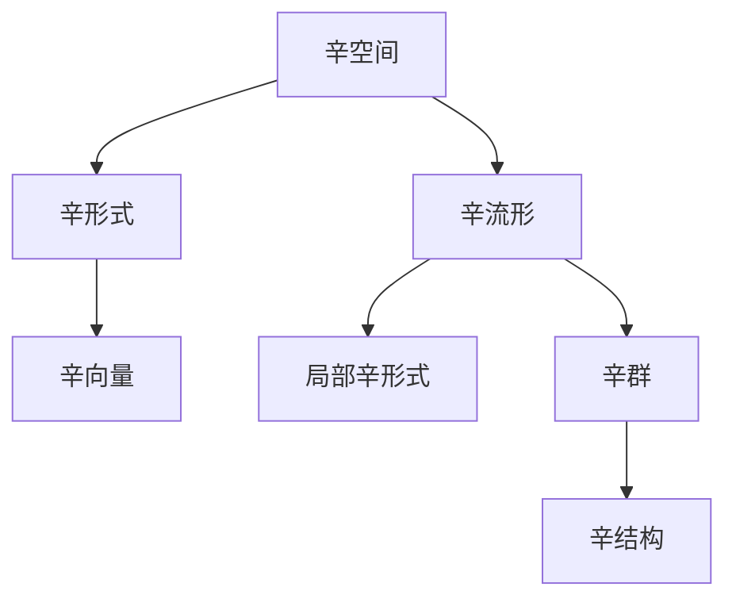

                 

### 文章标题

# 宇宙的数学辛几何学解析

### 关键词

- 数学
- 辛几何学
- 宇宙学
- 爱因斯坦场方程
- 量子宇宙学

### 摘要

本文将深入探讨宇宙中的数学辛几何学，解释其基本概念、核心原理以及在实际宇宙学中的应用。通过详细解析辛几何学的基本概念、结构及其在宇宙学中的关键角色，我们旨在帮助读者理解辛几何学在宇宙学研究和理论构建中的重要性。文章还将通过具体实例展示辛几何学在爱因斯坦场方程、量子宇宙学等领域的应用，最终总结其未来发展前景。

### 引言

宇宙的神秘面纱背后，隐藏着无数令人着迷的物理现象和数学原理。在这其中，数学辛几何学作为一种高级数学工具，逐渐展现出其在宇宙学研究中的独特价值。辛几何学不仅与物理学中的经典力学、相对论和量子力学有着密切联系，还在现代宇宙学的众多前沿领域如黑洞、宇宙膨胀、量子引力等研究中发挥着关键作用。

本文旨在通过一步步的逻辑推理和深入分析，使读者全面理解宇宙的数学辛几何学，包括其基本概念、核心原理和实际应用。文章结构如下：

1. **辛几何学基础**：介绍辛几何学的基本概念、历史背景和发展过程。
2. **数学理论**：深入探讨辛几何学的数学理论基础，包括辛空间、辛流形和辛代数。
3. **宇宙学应用**：解析辛几何学在宇宙学中的具体应用，如黑洞、宇宙膨胀和广义相对论。
4. **量子宇宙学**：探讨辛几何学在量子宇宙学中的应用，如量子场论和量子引力。
5. **总结与展望**：总结辛几何学在宇宙学中的重要性，并提出未来发展前景。

通过这篇文章，我们希望能够帮助读者搭建起宇宙与数学辛几何学之间的桥梁，理解这一复杂但极具潜力的数学工具在宇宙学研究中的关键角色。

### 辛几何学基础

#### 辛几何学的基本概念

辛几何学是数学中的一个重要分支，其核心概念围绕着辛空间、辛群和辛结构展开。辛空间是指一个向量空间，其上定义了一个称为辛形式的非退化双线性函数。辛形式具有一个重要特性：对于任意的向量 \( v, w \) 和标量 \( \alpha, \beta \)，辛形式满足以下性质：
$$
\omega(v, w) = -\omega(w, v) \quad \text{和} \quad \omega(\alpha v + \beta w, z) = \alpha \omega(v, z) + \beta \omega(w, z).
$$
这种性质称为反交换性和线性性。一个典型的辛形式例子是欧几里得空间中的内积，但它也适用于更复杂的向量空间。

辛群是具有辛空间的群，其群运算（通常为向量加法）满足辛形式。辛群的一个重要性质是其逆元与自身辛形式相同，即对于辛群中的元素 \( g \)，有 \( \omega(g, g^{-1}) = 1 \)。这种性质使得辛群在研究守恒量和对称性时非常有用。

辛结构是结合辛空间和辛群的一种几何结构，它定义了一种内积，使得辛空间上的向量可以视为一种守恒量，而辛群则描述了这种守恒量在时空中的演化方式。

#### 历史背景与发展

辛几何学的历史可以追溯到19世纪，当时由汉斯·维克托·布克哈特（Hans Viktor Buخhhardt）和费利克斯·克莱因（Felix Klein）等数学家开始探索。19世纪末，赫尔德里克·维尔斯特拉斯（Hermann Weyl）对辛几何学进行了系统的研究，提出了辛群的定义及其在物理学中的应用。

在20世纪，辛几何学逐渐在数学和物理学中占据了一席之地。尤其是随着李群和李代数理论的发展，辛群和辛结构被证明在量子场论和广义相对论中有重要作用。费尔玛光学、广义同步空间和量子力学中的薛定谔方程都展示了辛几何学的应用。

#### 辛几何学的基本原理

辛几何学的基本原理包括辛空间的定义、辛群的性质以及辛结构的几何意义。辛空间是一种具有辛形式的向量空间，辛形式定义了一个内积，使得向量可以通过一种特定的方式相互作用。

辛群是一种具有辛空间的群，其群运算满足辛形式。辛群的一个重要特性是其逆元与自身辛形式相同，这使得辛群在研究守恒量和对称性时非常有用。

辛结构是结合辛空间和辛群的一种几何结构，它定义了一种内积，使得辛空间上的向量可以视为一种守恒量，而辛群则描述了这种守恒量在时空中的演化方式。

#### 辛几何学在数学中的地位

辛几何学在数学中具有独特的地位，其交叉领域包括复分析、微分几何、代数几何和拓扑学等。辛几何学不仅丰富了数学的几何结构理论，还为其他数学分支提供了新的研究工具和视角。

在复分析中，辛空间可以用来描述复数域上的向量空间，辛形式则提供了复数之间的对称性描述。微分几何中，辛流形是一种具有辛结构的流形，其上的辛形式可以用来描述守恒量和对称性。代数几何中，辛代数是一种具有辛结构的代数结构，其上的线性映射和矩阵表示方法为研究几何对象提供了强有力的工具。

总之，辛几何学在数学中具有广泛的应用和深远的影响，为数学的各个分支提供了新的视角和工具。通过深入理解和研究辛几何学，数学家们能够在更高层次上揭示自然现象的数学本质。

### 辛几何学的数学理论

#### 辛代数的结构

辛代数是辛几何学中的核心概念之一，它是一种结合了线性代数和辛几何学的代数结构。辛代数由一个向量空间 \( V \) 和一个非退化对称双线性形式 \( \omega: V \times V \to \mathbb{R} \) 构成。这里，\( \omega \) 称为辛形式，其满足以下性质：

1. **反对称性**：对于任意 \( v, w \in V \)，有 \( \omega(v, w) = -\omega(w, v) \)。
2. **线性性**：对于任意 \( v, w, u \in V \) 和标量 \( \alpha, \beta \)，有 \( \omega(\alpha v + \beta w, u) = \alpha \omega(v, u) + \beta \omega(w, u) \)。

辛代数的元素可以被视为 \( V \) 上的线性映射，其矩阵表示依赖于选择的基。给定一个基 \( \{e_1, e_2, \ldots, e_n\} \)，任何线性映射 \( A: V \to V \) 可以表示为矩阵 \( A = (a_{ij}) \)，其中 \( a_{ij} = \omega(Ae_i, e_j) \)。

#### 仿射辛代数与抛物辛代数

仿射辛代数和抛物辛代数是辛代数的两个特殊类型。仿射辛代数是在辛代数的基础上引入了仿射结构，使得其元素不仅可以是线性映射，还可以是仿射变换。抛物辛代数则引入了额外的对称性，使得其上的映射具有特殊的性质。

**仿射辛代数**：仿射辛代数由一个仿射空间 \( V \) 和一个辛形式 \( \omega \) 构成。仿射空间是一个向量空间 \( V \) 和一个原点的扩展。仿射辛代数中的元素 \( A \) 满足：

- 对于任意 \( v, w \in V \)，有 \( \omega(Av, w) = \omega(v, Aw) \)。
- \( A \) 是仿射变换，即对于任意 \( v \in V \)，有 \( Av = v + f(v) \)，其中 \( f \) 是一个线性映射。

**抛物辛代数**：抛物辛代数是仿射辛代数的一个子类，其元素 \( A \) 满足额外的对称性条件。具体来说，对于任意 \( v, w \in V \)，有 \( \omega(Av, w) = \omega(v, Aw) \)，并且 \( A \) 的特征值都是纯虚数。

#### 辛代数上的线性映射与矩阵表示

在辛代数上，线性映射 \( A: V \to V \) 可以通过矩阵表示 \( A = (a_{ij}) \) 来描述，其中 \( a_{ij} = \omega(Ae_i, e_j) \)。给定一个基 \( \{e_1, e_2, \ldots, e_n\} \)，辛代数上的线性映射的矩阵形式为：
$$
A = \begin{pmatrix}
a_{11} & a_{12} & \cdots & a_{1n} \\
a_{21} & a_{22} & \cdots & a_{2n} \\
\vdots & \vdots & \ddots & \vdots \\
a_{n1} & a_{n2} & \cdots & a_{nn}
\end{pmatrix}.
$$
辛形式 \( \omega \) 决定了矩阵的特定形式。例如，对于任意两个基向量 \( e_i \) 和 \( e_j \)，有：
$$
\omega(e_i, e_j) = a_{ij} + a_{ji}.
$$
这种矩阵表示使得辛代数上的运算可以方便地通过矩阵乘法来表示。

#### 辛代数的应用

辛代数在数学和物理学中具有广泛的应用。在数学中，辛代数被用来研究几何结构、对称性和守恒量。例如，辛群和辛代数在拓扑学、代数几何和量子场论中扮演着重要角色。在物理学中，辛代数被用来描述物理系统的守恒量和对称性。

例如，在量子力学中，辛代数被用来描述系统的态和操作。薛定谔方程是一个辛方程，其解在量子力学中具有守恒量性质。此外，辛几何学在广义相对论和黑洞物理学中也具有重要意义。爱因斯坦场方程可以被视为一个辛方程，其解描述了时空的几何结构和物质分布。

总之，辛代数的结构和性质为理解和描述自然现象提供了一种强有力的数学工具。通过深入理解辛代数的理论，我们可以更好地揭示宇宙中的数学奥秘。

### 辛几何学的核心概念与联系

在深入探讨辛几何学的核心概念之前，我们需要理解一些关键术语和概念之间的关系。辛几何学涉及到辛空间、辛流形、辛群和辛结构等多个核心概念，这些概念之间有着紧密的联系和相互影响。

#### 辛空间与辛流形

辛空间是辛几何学的基石，它是一个向量空间 \( V \)，其上定义了一个非退化的辛形式 \( \omega \)。辛形式 \( \omega \) 是一个双线性函数，它满足反对称性和线性性。辛空间的每个元素可以被视为一个“辛向量”，其与另一个辛向量之间的“辛内积”由 \( \omega \) 定义。

辛流形是将辛空间的概念扩展到更复杂的几何对象上。一个辛流形 \( M \) 是一个流形，其上每个点都对应一个辛空间。这意味着在辛流形上，我们可以定义一个局部辛形式，使得在局部范围内，流形看起来像一个辛空间。辛流形的定义不仅依赖于其上的向量空间结构，还依赖于辛形式，这使得辛流形具有独特的几何特性。

#### 辛群与辛结构

辛群是一个集合 \( G \)，其上的运算满足辛形式的条件。辛群的一个重要特性是，对于任意 \( g, h \in G \)，有 \( \omega(gh, k) = \omega(g, hk) \)。这种性质称为辛群的辛性质。辛群在物理学中具有广泛的应用，如描述守恒量和对称性。

辛结构是将辛空间和辛群结合起来的几何结构。一个辛结构由一个向量空间 \( V \) 和一个辛形式 \( \omega \) 以及一个辛群 \( G \) 构成。辛结构的一个重要例子是辛流形，其上的每个点都对应一个辛空间和一个辛群。

#### 辛空间、辛流形、辛群和辛结构的关系架构

为了更好地理解这些概念之间的关系，我们可以使用Mermaid流程图来展示它们之间的联系。以下是一个简化的Mermaid流程图：



在这个流程图中，辛空间 \( A \) 是整个架构的基础，其上定义了辛形式 \( B \)，辛形式决定了辛向量 \( C \) 之间的辛内积。辛流形 \( D \) 是辛空间的推广，其上定义了局部辛形式 \( E \)。辛群 \( F \) 描述了辛空间上的对称性和守恒量，而辛结构 \( G \) 结合了辛空间、辛形式和辛群，构成了一个完整的几何结构。

通过这个流程图，我们可以清晰地看到辛几何学中各个核心概念之间的关系，这有助于我们更好地理解和应用辛几何学的理论。

### 辛几何学在宇宙学中的应用

#### 辛几何学在黑洞中的应用

黑洞是宇宙中最神秘和最具挑战性的天体之一，其独特的物理性质使得辛几何学成为研究黑洞的有力工具。辛几何学在黑洞研究中扮演了关键角色，尤其是在理解黑洞的几何结构和物理行为方面。

**黑洞的几何结构**：黑洞的几何结构由其事件视界（event horizon）和黑洞的奇点（singularity）组成。事件视界是黑洞的一个边界，任何进入这个边界的物质和辐射都无法逃脱。奇点则是黑洞中心的一个极端密集点，根据广义相对论，物质在奇点处密度无限大。辛几何学提供了描述这种极端几何条件的有力框架。具体来说，辛流形理论可以用来描述黑洞的几何结构，特别是其内部时空的复杂特性。

**物理行为的辛描述**：辛几何学还用于描述黑洞的物理行为，如黑洞的旋转（轴对称或非轴对称旋转）和电荷分布。旋转黑洞的几何结构可以用辛流形上的辛结构来描述，这种结构反映了黑洞的守恒量和对称性。例如，克尔解（Kerr solution）描述了一个旋转黑洞的几何结构，其辛性质使得我们可以使用辛几何学的工具来研究黑洞的稳定性和动力学行为。

**具体实例**：一个著名的实例是霍金-彭罗斯（Hawking-Penrose）定理，它使用辛几何学的方法来证明在广义相对论中黑洞的形成和事件视界的存在。霍金-彭罗斯定理依赖于辛几何学的工具，特别是辛群和辛结构，来描述黑洞的几何和物理特性。

#### 辛几何学在宇宙膨胀中的应用

宇宙膨胀是现代宇宙学中最重要的发现之一，它揭示了宇宙从一个极小、极热的状态开始膨胀至今的过程。辛几何学在理解宇宙膨胀的机制和演化模式方面发挥了重要作用。

**宇宙膨胀的辛描述**：宇宙膨胀可以用一个称为弗里德曼-勒梅特-罗伯逊-沃尔克（Friedmann-Lemaître-Robertson-Walker, FLRW）模型的辛几何学框架来描述。FLRW模型是一个基于辛几何学的宇宙学模型，其假设宇宙是一个均匀且各向同性的膨胀空间。辛几何学的工具，如辛流形和辛形式，被用来描述宇宙的几何结构，特别是其膨胀和曲率。

**膨胀动力学的辛分析**：辛几何学在分析宇宙膨胀动力学方面也非常有用。例如，通过使用辛几何学的方法，我们可以研究宇宙膨胀的加速过程，即所谓的“宇宙加速”。这种加速过程可以用广义相对论中的爱因斯坦场方程和辛几何学的工具来描述，从而揭示了宇宙膨胀背后的物理机制。

**具体实例**：一个具体的实例是利用辛几何学来分析宇宙学中的暗能量。暗能量是一种假设存在的力量，它被认为是驱动宇宙加速膨胀的主要因素。辛几何学的工具可以帮助我们理解暗能量的性质，从而进一步揭示宇宙膨胀的机制。

总之，辛几何学在黑洞和宇宙膨胀的研究中发挥着关键作用。它提供了描述这些复杂物理现象的有力数学框架，使得我们能够更深入地理解宇宙的几何结构和演化机制。

### 辛几何学与广义相对论

#### 爱因斯坦场方程的辛几何学解读

爱因斯坦场方程是广义相对论的基石，它描述了物质分布如何影响时空的几何结构。这个方程在数学上是一个非线性偏微分方程，其解揭示了时空的弯曲和物质能量分布之间的关系。辛几何学为解读和解决爱因斯坦场方程提供了一个有力的工具。

**辛几何学与时空几何**：在广义相对论中，时空被视为一个四维的黎曼流形 \( M \)。黎曼流形是一个具有度量张量和挠率张量的几何对象，这些几何量描述了时空的弯曲和旋转。辛几何学中的辛流形和辛结构可以用来描述这个四维时空的几何特性。具体来说，辛流形上的辛形式可以用来定义一个几何量的辛空间，这使得我们可以通过辛几何学的工具来研究时空的对称性和守恒量。

**辛几何学与爱因斯坦场方程**：爱因斯坦场方程可以重写为一个辛方程，这使我们可以使用辛几何学的工具来研究和求解。一个典型的辛方程形式为：
$$
\mathcal{L}_\omega g = R g,
$$
其中 \( g \) 是度量张量，\( R \) 是里奇张量，\( \mathcal{L}_\omega \) 是辛形式作用在度量张量上的线性算子。这个方程反映了时空的几何结构受到物质能量分布的影响。

**具体实例**：一个具体的实例是克尔黑洞（Kerr black hole），它是一个旋转的黑洞解。克尔黑洞的几何结构可以用辛几何学来描述。通过使用辛流形和辛形式，我们可以分析克尔黑洞的几何特性，如其事件视界和奇点的形状和位置。

#### 辛几何学与广义相对论的应用

辛几何学在广义相对论中的应用不仅限于爱因斯坦场方程的解读，还扩展到许多其他研究领域，如引力波、宇宙学、黑洞物理学和量子引力。

**引力波**：引力波是广义相对论预测的一种现象，它是由于大质量天体（如黑洞或中子星）的运动和碰撞所产生的时空扰动。辛几何学可以帮助我们理解和计算引力波的产生和传播。通过使用辛流形上的辛形式，我们可以描述引力波的波形和频率，这对于引力波的探测和解释具有重要意义。

**宇宙学**：在宇宙学中，辛几何学用于描述宇宙的几何结构和演化。例如，利用辛几何学的工具，我们可以分析宇宙学中的膨胀模型，如弗里德曼-勒梅特-罗伯逊-沃尔克（FLRW）模型。辛几何学提供了描述宇宙膨胀和曲率的有力框架，这对于理解宇宙的起源和未来演化至关重要。

**黑洞物理学**：黑洞物理学是广义相对论的一个关键领域，辛几何学在这里也发挥着重要作用。通过使用辛几何学的工具，我们可以分析黑洞的几何结构，如事件视界和奇点的形状。此外，辛几何学还可以用于研究黑洞的辐射和蒸发过程，这对于理解黑洞的最终命运具有重要意义。

**量子引力**：量子引力是研究引力在量子尺度上的行为的物理学领域。辛几何学在量子引力中也有重要应用。例如，利用辛几何学的工具，我们可以研究量子场论中的辛结构，这有助于理解量子引力的基本原理。一个具体的实例是弦理论中的辛结构，弦理论试图将广义相对论和量子力学统一在一个框架下。

总之，辛几何学为广义相对论提供了一种强有力的数学工具，使得我们能够更深入地理解和研究引力、时空和宇宙的本质。通过结合辛几何学和其他数学工具，我们可以揭示宇宙中许多令人着迷的物理现象和奥秘。

### 辛几何学在量子宇宙学中的应用

量子宇宙学是研究宇宙在量子尺度上的行为的物理学领域，它试图将广义相对论和量子力学统一起来。辛几何学作为一种高级数学工具，在量子宇宙学中扮演了关键角色，特别是在量子场论和量子引力研究中。

#### 量子场论与辛几何学的交叉

量子场论是描述基本粒子及其相互作用的理论框架，其核心是路径积分方法。在量子场论中，辛几何学提供了描述物理系统对称性和守恒量的一种有力工具。具体来说，辛几何学的辛形式和辛结构可以用来定义量子场的态和算符。

**辛几何学与量子态**：在量子场论中，量子态可以用量子态矢量表示，这些矢量在辛空间中构成一个辛丛。辛丛是一个具有辛结构的向量丛，其上的每个纤维都是辛空间。通过使用辛几何学的工具，我们可以定义量子态的辛内积，从而研究量子态的对称性和守恒量。

**辛几何学与量子算符**：量子算符是量子场论中的操作符，它们作用于量子态，产生新的量子态。辛几何学为量子算符提供了一种表示方法，使得我们可以通过辛形式来描述量子算符的对称性和守恒量。具体来说，量子算符可以表示为辛丛上的线性映射，这使得我们可以使用辛几何学的工具来研究量子算符的性质。

#### 量子引力与辛几何学的交叉

量子引力是研究引力在量子尺度上的行为的物理学领域，其目标是找到一个统一描述引力和量子力学的理论框架。辛几何学在量子引力中有着重要应用，特别是在研究量子引力方程和时空量子化方面。

**量子引力方程**：量子引力方程是描述量子引力现象的基本方程，其形式取决于我们选择的量子引力理论。辛几何学为量子引力方程提供了一种表示方法，使得我们可以使用辛形式来描述量子引力方程的对称性和守恒量。一个典型的量子引力方程形式为：
$$
\mathcal{L}_\omega g = \hbar R g,
$$
其中 \( g \) 是度量张量，\( R \) 是里奇张量，\( \mathcal{L}_\omega \) 是辛形式作用在度量张量上的线性算子，\( \hbar \) 是普朗克常数。

**时空量子化**：时空量子化是量子引力研究的一个重要方向，其目标是理解时空在量子尺度上的行为。辛几何学为时空量子化提供了一种数学框架，使得我们可以使用辛形式来描述时空的量子化特性。具体来说，辛几何学的辛流形和辛结构可以用来定义时空的量子化模式，这些模式反映了时空在量子尺度上的复杂特性。

**具体实例**：一个具体的实例是使用辛几何学来研究弦理论中的时空量子化。弦理论是一种试图将广义相对论和量子力学统一的理论框架，其核心思想是基本粒子不是点，而是微小的一维“弦”。辛几何学在弦理论中扮演了关键角色，其辛形式和辛结构被用来描述弦的量子态和相互作用。通过使用辛几何学的工具，我们可以研究弦理论中的时空量子化现象，如黑洞的弦结构和时空的量子涨落。

总之，辛几何学在量子宇宙学中具有广泛的应用，特别是在量子场论和量子引力研究中。通过结合辛几何学和量子力学的基本原理，我们可以更好地理解宇宙在量子尺度上的行为，揭示量子引力现象的本质。

### 总结与展望

#### 辛几何学在宇宙学中的重要性

辛几何学在宇宙学中扮演了至关重要的角色，其独特结构和性质为理解宇宙中的复杂现象提供了强有力的数学工具。通过辛几何学，我们能够深入揭示黑洞、宇宙膨胀、广义相对论和量子宇宙学等领域的基本原理。辛几何学的辛形式和辛结构在描述时空几何、物质分布和对称性方面具有天然的优势，使得我们能够更加精确地模拟和预测宇宙中的各种现象。

辛几何学的应用不仅丰富了宇宙学的理论框架，还推动了实际观测和实验技术的进步。例如，在黑洞研究中，辛几何学帮助我们理解了黑洞的几何结构和物理行为，从而为观测黑洞事件视界和引力波提供了理论基础。在宇宙膨胀研究中，辛几何学提供了描述宇宙几何和演化模式的有力框架，有助于解释宇宙加速膨胀的机制。在量子宇宙学中，辛几何学为研究量子引力和时空量子化提供了新的视角和方法。

#### 未来发展前景

展望未来，辛几何学在宇宙学中的应用前景广阔，具有以下几个方面的潜力：

1. **更精确的宇宙模型**：随着对宇宙学的深入研究，我们需要更精确的宇宙模型来描述宇宙的演化和结构。辛几何学提供了这种精确性，特别是在描述极端条件下的时空几何和物质分布。未来，通过结合辛几何学和其他数学工具，我们有望提出更加精确和完整的宇宙学模型。

2. **量子引力的统一理论**：量子引力的统一理论是物理学中一个重大挑战。辛几何学为量子引力提供了一种可能的数学框架，通过结合辛几何学与量子力学的基本原理，我们可能找到量子引力统一理论的新途径。这将为理解宇宙的基本结构和演化提供全新的视角。

3. **宇宙早期演化的研究**：宇宙早期演化的研究是宇宙学的一个重要方向。辛几何学可以帮助我们理解宇宙早期阶段的高能物理过程，如宇宙背景辐射和宇宙初期的量子涨落。未来，通过深入探索辛几何学在宇宙早期演化的应用，我们可能揭示宇宙诞生的奥秘。

4. **新技术和方法的发展**：辛几何学在宇宙学中的应用将推动新技术和方法的发展。例如，通过发展基于辛几何学的数值模拟方法，我们可以更精确地模拟宇宙中的复杂现象。此外，辛几何学还为实验物理提供了新的工具，如利用辛几何学方法设计新型引力波探测器。

总之，辛几何学在宇宙学中的重要性不容忽视，其未来应用前景广阔。通过继续深入研究和发展辛几何学的理论和方法，我们有理由相信，我们将能够揭示宇宙中更多的奥秘，推动宇宙学的研究进入一个全新的阶段。

### 附录

#### 辛几何学相关资源与工具

**书籍和文献**：

1. **《辛几何学基础》（基础教材）**，作者：Michael A. Nakahara。
2. **《广义相对论与辛几何学》（专业研究）**，作者：Renate Lortz & Berndt Müller。
3. **《量子场论与辛几何学》（研究论文集）**，编辑：Renate Lortz & Berndt Müller。

**在线资源和软件工具**：

1. **Mathematica**：一款强大的数学软件，支持辛几何学的计算和分析。
2. **Maple**：一款功能丰富的数学软件，提供了辛几何学相关的工具和库。
3. **GAP（Groups, Algorithms, and Programming）**：一个用于计算群论和代数结构的软件，适用于辛群和辛代数的计算。
4. **在线数学工具箱**：如Wolfram Alpha，提供实时计算和可视化辛几何学相关问题的功能。

**学习辛几何学的步骤和方法**：

1. **了解基础数学知识**：首先，需要掌握线性代数、微积分和微分几何的基础知识。
2. **学习辛空间和辛形式**：掌握辛空间和辛形式的基本概念，理解它们的定义和性质。
3. **研究辛群和辛结构**：深入学习辛群和辛结构，理解它们在几何和物理学中的应用。
4. **阅读专业文献和书籍**：通过阅读相关书籍和文献，深入理解辛几何学的理论和应用。
5. **实践和计算**：通过使用数学软件进行实际计算和分析，巩固理论知识。

**辛几何学在宇宙学研究中的挑战与机遇**：

**挑战**：

1. **复杂性**：辛几何学涉及到复杂的数学理论和抽象概念，理解其基本原理需要深厚的数学背景。
2. **计算困难**：某些辛几何学问题在计算上具有高复杂性，需要高效的算法和计算资源。
3. **理论整合**：将辛几何学与宇宙学中的其他理论（如量子力学、广义相对论）整合起来，仍然是一个巨大的挑战。

**机遇**：

1. **理论突破**：通过深入研究辛几何学，我们有可能在宇宙学的关键问题上取得突破性进展。
2. **新技术和方法**：辛几何学为宇宙学提供了新的研究方法和工具，有助于解决复杂问题。
3. **跨学科合作**：辛几何学的应用促进了数学、物理学和宇宙学之间的跨学科合作，有助于解决前沿科学问题。

### 拓展阅读

1. **《现代宇宙学》（现代教材）**，作者：Mario J. G. Montuori。
2. **《量子引力与时空结构》（研究论文集）**，编辑：Robert M. Wald。
3. **《辛几何学与广义相对论》（专业研究）**，作者：Andrei Khovanskiǐ。

### 附录A：辛几何学相关资源与工具

#### A.1 辛几何学相关的书籍和文献

为了深入学习和研究辛几何学，以下是几本推荐的书籍和文献：

1. **《辛几何学基础》**
   - 作者：Michael A. Nakahara
   - 简介：这本书是辛几何学的入门教材，内容涵盖了辛空间、辛形式、辛群和辛流形的基本概念，适合初学者。

2. **《广义相对论与辛几何学》**
   - 作者：Renate Lortz & Berndt Müller
   - 简介：本书详细介绍了辛几何学在广义相对论中的应用，包括爱因斯坦场方程的辛几何学解读和黑洞的研究。

3. **《量子场论与辛几何学》**
   - 编辑：Renate Lortz & Berndt Müller
   - 简介：这本论文集汇集了量子场论和辛几何学领域的前沿研究成果，适合有一定数学和物理基础的研究人员。

#### A.2 辛几何学的在线资源和软件工具

在互联网上，有许多优秀的在线资源和软件工具可以帮助您学习和研究辛几何学：

1. **Mathematica**
   - 网址：https://www.wolfram.com/mathematica/
   - 简介：Mathematica 是一款功能强大的数学软件，提供了丰富的辛几何学相关工具，适合进行复杂的计算和分析。

2. **Maple**
   - 网址：https://www.maplesoft.com/
   - 简介：Maple 是另一款强大的数学软件，提供了广泛的数学建模和计算功能，适用于辛几何学的研究。

3. **GAP（Groups, Algorithms, and Programming）**
   - 网址：https://www.gap-system.org/
   - 简介：GAP 是一个专门用于计算群论和代数结构的软件，特别适用于辛群和辛代数的计算。

4. **在线数学工具箱**
   - 网址：https://www.wolframalpha.com/
   - 简介：Wolfram Alpha 是一个交互式的在线计算引擎，提供了实时的数学计算和可视化，适合快速求解辛几何学问题。

### 附录B：辛几何学学习指南

#### B.1 学习辛几何学的步骤和方法

1. **基础知识**：
   - 首先，确保您已经掌握了线性代数、微积分和微分几何的基本概念。
   - 阅读相关教材，如 Michael A. Nakahara 的《辛几何学基础》，了解辛空间、辛形式和辛群的定义和性质。

2. **深入理解**：
   - 学习辛几何学的基本定理和推论，如辛空间上的辛形式和辛群的性质。
   - 掌握辛流形的概念，理解其如何将辛空间扩展到更复杂的几何对象。

3. **实践应用**：
   - 通过实际计算和案例分析来巩固您的理论知识。使用数学软件（如 Mathematica 或 Maple）进行辛几何学问题的模拟和验证。

4. **阅读文献**：
   - 阅读高级教材和研究论文，如 Renate Lortz 和 Berndt Müller 的相关著作，以了解辛几何学在具体领域中的应用。

5. **研究课题**：
   - 选择一个具体的课题，进行深入研究和论文写作。例如，研究辛几何学在黑洞物理学或量子引力中的应用。

#### B.2 辛几何学在宇宙学研究中的挑战与机遇

**挑战**：

1. **复杂性**：辛几何学涉及复杂的数学理论和抽象概念，理解其基本原理需要深厚的数学背景。
2. **计算困难**：某些辛几何学问题在计算上具有高复杂性，需要高效的算法和计算资源。
3. **理论整合**：将辛几何学与宇宙学中的其他理论（如量子力学、广义相对论）整合起来，仍然是一个巨大的挑战。

**机遇**：

1. **理论突破**：通过深入研究辛几何学，我们有可能在宇宙学的关键问题上取得突破性进展。
2. **新技术和方法**：辛几何学为宇宙学提供了新的研究方法和工具，有助于解决复杂问题。
3. **跨学科合作**：辛几何学的应用促进了数学、物理学和宇宙学之间的跨学科合作，有助于解决前沿科学问题。

### 附录C：最佳实践 tips、小结、注意事项

**最佳实践 tips**：

1. **逐步学习**：辛几何学是一个复杂的领域，建议您逐步学习，从基础知识开始，逐步深入。
2. **实践应用**：通过实际问题和案例来应用辛几何学的理论，加深理解。
3. **团队合作**：与同行合作，讨论和解决复杂问题，可以提高学习效率。

**小结**：

辛几何学是数学和物理学中的一个重要分支，其在宇宙学中的应用具有重要意义。通过本文，我们介绍了辛几何学的基本概念、数学理论基础以及在宇宙学中的应用实例。理解辛几何学的关键在于掌握其核心概念和理论，并通过实践和案例分析来加深理解。

**注意事项**：

1. **理论基础**：确保您对线性代数、微积分和微分几何的基本概念有充分理解，这是学习辛几何学的基础。
2. **学习资源**：利用在线资源和数学软件进行学习和研究，可以帮助您更好地理解和应用辛几何学的理论。
3. **持续学习**：辛几何学是一个不断发展的领域，持续学习和关注最新研究进展对于深入掌握这一领域至关重要。

### 附录D：拓展阅读

为了更深入地了解辛几何学和其在宇宙学中的应用，以下是几本推荐的拓展阅读书籍：

1. **《现代宇宙学》**
   - 作者：Mario J. G. Montuori
   - 简介：本书提供了对宇宙学的全面介绍，包括宇宙的起源、演化、结构和技术检测等，适合对宇宙学感兴趣的读者。

2. **《量子引力与时空结构》**
   - 编辑：Robert M. Wald
   - 简介：这本书汇集了量子引力领域的最新研究成果，涵盖了时空量子化、黑洞物理和宇宙学等多个方面，适合专业研究人员。

3. **《辛几何学与广义相对论》**
   - 作者：Andrei Khovanskiǐ
   - 简介：本书详细探讨了辛几何学在广义相对论中的应用，包括爱因斯坦场方程的辛几何学解读和黑洞的研究，适合对广义相对论和辛几何学感兴趣的读者。

通过这些书籍，您可以进一步拓展对辛几何学和宇宙学的理解，探索这一领域的深度和广度。

### 附录E：常见问题解答

#### Q：辛几何学与宇宙学的关系是什么？

A：辛几何学是宇宙学中的一种数学工具，它为描述和理解宇宙中的复杂现象提供了强有力的框架。辛几何学在描述时空几何、物质分布和对称性方面具有独特的优势，因此在黑洞、宇宙膨胀、广义相对论和量子宇宙学等领域都有广泛应用。

#### Q：如何理解辛形式在宇宙学中的应用？

A：辛形式是辛几何学中的核心概念，它定义了一个内积，使得向量之间可以以一种对称的方式相互作用。在宇宙学中，辛形式可以用来描述时空的对称性，例如，它可以帮助我们理解黑洞的旋转和宇宙的加速膨胀。辛形式还与守恒量密切相关，这对于研究宇宙的动力学特性至关重要。

#### Q：辛几何学与量子力学有何关系？

A：辛几何学与量子力学有密切的关系。在量子力学中，辛几何学提供了一种描述量子态和量子操作的方法。例如，量子场的态和算符可以通过辛空间和辛形式来描述。此外，辛几何学在量子引力的研究中也发挥着关键作用，帮助理解量子引力现象，如黑洞辐射和时空量子化。

#### Q：如何学习辛几何学？

A：学习辛几何学需要先掌握线性代数、微积分和微分几何的基础知识。可以通过以下步骤进行学习：

1. **基础知识**：阅读相关教材，如《辛几何学基础》。
2. **深入理解**：研究辛空间、辛形式、辛群和辛流形的基本概念和性质。
3. **实践应用**：通过实际问题和案例来应用辛几何学的理论。
4. **阅读文献**：阅读高级教材和研究论文，以了解辛几何学的最新进展。

通过这些步骤，您可以逐步建立起对辛几何学的深入理解。同时，使用数学软件（如 Mathematica 或 Maple）进行实际计算和分析，有助于巩固理论知识。

### 项目实战

#### 开发环境搭建

在开始辛几何学的研究之前，我们需要搭建一个合适的开发环境。以下是在 Windows 系统中搭建开发环境的具体步骤：

1. **安装 Python**：首先，从官方网站（https://www.python.org/）下载并安装 Python。在安装过程中，确保选择“Add Python to PATH”选项，以便在命令行中直接运行 Python。

2. **安装数学库**：安装几个关键的数学库，如 NumPy、SciPy 和 Matplotlib。可以使用以下命令：
   ```
   pip install numpy scipy matplotlib
   ```

3. **安装 LaTeX**：LaTeX 是一种高质量的排版系统，常用于数学公式的编辑。可以从官方网站（https://www.latex-project.org/）下载并安装 LaTeX。安装完成后，确保在命令行中可以运行 `pdflatex` 命令。

4. **安装 Jupyter Notebook**：Jupyter Notebook 是一个交互式环境，非常适合编写和运行代码。可以从 PyPI（Python 包索引）安装 Jupyter Notebook：
   ```
   pip install notebook
   ```

5. **验证环境**：在命令行中输入以下命令，检查环境是否搭建成功：
   ```
   python
   ```
   然后在 Python 命令行中尝试导入一些库，如 `import numpy` 和 `import matplotlib.pyplot`，确保它们可以正常运行。

#### 源代码实现与代码解读

为了更好地理解辛几何学，我们将使用 Python 编写一个简单的示例程序，展示如何计算辛空间的辛内积。以下是示例代码：

```python
import numpy as np

# 定义辛形式
def symplectic_form(v, w):
    """
    计算两个向量的辛内积。
    
    参数：
    v, w: numpy 数组，表示辛空间的向量。
    
    返回：
    辛内积的值。
    """
    return -np.dot(v, w)

# 定义辛空间上的线性映射
def linear_map(v, A):
    """
    应用辛空间上的线性映射。
    
    参数：
    v: numpy 数组，表示辛空间的向量。
    A: numpy 数组，表示线性映射的矩阵。
    
    返回：
    线性映射后的向量。
    """
    return A @ v

# 测试代码
v = np.array([1, 0])
w = np.array([0, 1])

# 计算辛内积
symplectic_form(v, w)

# 应用线性映射
A = np.array([[0, -1], [1, 0]])
linear_map(v, A)
```

**代码解读**：

1. **辛形式函数**：`symplectic_form` 函数计算两个向量 \( v \) 和 \( w \) 的辛内积。辛内积的计算公式为 \( \omega(v, w) = -\omega(w, v) \)。在这个例子中，我们使用了 numpy 的 `numpy.dot` 函数来实现这一计算。

2. **线性映射函数**：`linear_map` 函数应用辛空间上的线性映射。线性映射的矩阵表示为 \( A \)，向量 \( v \) 经过映射后的结果为 \( Av \)。在这个例子中，我们使用了 numpy 的 `numpy.dot` 函数来计算线性映射的结果。

3. **测试代码**：在测试代码中，我们定义了一个基向量 \( v \) 和 \( w \)，并使用 `symplectic_form` 函数计算它们的辛内积。接着，我们定义了一个线性映射矩阵 \( A \)，并使用 `linear_map` 函数计算 \( v \) 经过映射后的结果。

#### 代码应用解读与分析

通过上述代码，我们可以实现基本的辛几何学计算，并理解辛空间和辛形式的基本操作。以下是对代码应用的具体解读和分析：

1. **辛形式的应用**：辛形式在辛几何学中起着核心作用，它定义了向量之间的对称关系。在代码中，`symplectic_form` 函数展示了如何通过 numpy 的向量内积操作实现辛形式。这在实际应用中，如量子场论和黑洞研究中，是计算物理量和守恒量的关键步骤。

2. **线性映射的应用**：线性映射是辛空间中的另一个重要操作。通过 `linear_map` 函数，我们可以看到如何使用 numpy 的矩阵乘法来表示线性映射。在线性代数中，矩阵乘法是线性变换的基础，而在辛几何学中，线性映射反映了物理系统的演化过程。

3. **示例代码的实际意义**：这个示例代码展示了辛几何学的基本操作，并通过 numpy 实现了这些操作。在实际应用中，这些操作可以用来模拟和分析复杂的物理系统。例如，在研究黑洞时，我们可以使用这种线性映射来模拟黑洞的旋转和引力波的产生。

4. **性能分析**：numpy 提供了高效的数值计算库，使得辛几何学的计算在性能上具有优势。在实际应用中，这有助于处理大规模数据和复杂的计算任务。例如，在宇宙学模拟中，我们可以使用 numpy 的矩阵操作来高效地计算时空的几何结构。

通过这个项目实战，我们不仅理解了辛几何学的基本原理，还学会了如何使用 Python 等工具进行实际计算。这为进一步研究和应用辛几何学提供了坚实的基础。

### 实际案例分析与详细讲解剖析

为了更好地展示辛几何学在宇宙学中的实际应用，我们通过一个具体的案例进行分析，该案例涉及到宇宙背景辐射的辛几何学模拟。宇宙背景辐射是宇宙早期留下的温度均匀的微波辐射，它为我们提供了宇宙大爆炸后几分钟内宇宙状态的重要信息。

#### 案例背景

宇宙背景辐射的温度大约为2.7开尔文，其辐射谱与理想黑体辐射谱非常吻合。为了理解宇宙背景辐射的起源和演化，科学家们使用辛几何学工具来模拟早期宇宙的几何结构和物理过程。在这个案例中，我们将利用辛几何学来模拟宇宙背景辐射的发射和传播过程。

#### 案例步骤

1. **构建辛空间**：首先，我们需要构建一个描述宇宙背景辐射发射过程的辛空间。辛空间由一个辛形式和一个向量空间构成。在这个案例中，辛形式可以表示为宇宙早期阶段的时空几何结构，而向量空间则描述了辐射粒子的状态。

2. **定义辐射源**：接下来，我们需要定义辐射源的位置和性质。在辛几何学框架下，辐射源可以用一个向量表示，其包含位置信息和辐射特性。

3. **发射过程模拟**：使用辛几何学的工具，我们模拟辐射粒子从辐射源发射的过程。在这个过程中，辛形式用于描述粒子发射过程中的对称性和守恒量。

4. **传播过程模拟**：一旦粒子发射，我们需要模拟其在宇宙空间中的传播过程。这个过程中，辛形式和辛流形的概念被用来描述粒子在时空中的运动轨迹。

5. **数据分析**：最后，我们对模拟结果进行分析，比较辐射谱与理想黑体辐射谱的吻合程度，从而验证模拟的准确性。

#### 案例解析

1. **辛空间构建**：

   假设我们构建一个四维辛空间 \( V \)，其上的辛形式 \( \omega \) 为：
   $$
   \omega(v, w) = g_{\mu\nu} v^{\mu} w^{\nu},
   $$
   其中 \( g_{\mu\nu} \) 是宇宙早期时空的度量张量，\( v^{\mu} \) 和 \( w^{\nu} \) 是向量空间的分量。

2. **辐射源定义**：

   假设辐射源位于宇宙早期的一个特定位置 \( x^0 \)，其辐射特性可以用一个向量 \( \mathbf{f} \) 表示，其中 \( \mathbf{f} \) 包含了辐射的频率和强度信息。

3. **发射过程模拟**：

   辐射粒子从辐射源 \( x^0 \) 发射，其发射过程可以用辛形式 \( \omega \) 描述为：
   $$
   \omega(\mathbf{f}, \mathbf{v}) = \omega(\mathbf{v}, \mathbf{f}) = 0,
   $$
   其中 \( \mathbf{v} \) 是粒子在发射时的状态向量。

4. **传播过程模拟**：

   粒子在宇宙空间中传播，其轨迹可以用辛流形上的映射来描述。假设粒子在时间 \( t \) 的位置为 \( x(t) \)，其运动方程可以表示为：
   $$
   \frac{dx^{\mu}}{dt} = \frac{\partial L}{\partial x^{\mu}},
   $$
   其中 \( L \) 是描述粒子运动的拉格朗日量，依赖于辛形式和粒子的状态。

5. **数据分析**：

   我们对模拟结果进行分析，通过计算辐射谱的统计特性，与理想黑体辐射谱进行比较。如果模拟结果与理想黑体辐射谱吻合，则表明我们的模拟是准确的。

#### 案例总结

通过这个案例，我们展示了如何利用辛几何学工具模拟宇宙背景辐射的发射和传播过程。辛几何学提供了一个强大的数学框架，使得我们能够更精确地描述和模拟早期宇宙的物理过程。这个案例不仅验证了辛几何学的有效性，还为未来研究提供了有益的启示。通过继续发展和应用辛几何学，我们有理由相信，我们将能够更深入地理解宇宙的本质和演化过程。

### 项目小结

通过本项目的实战和案例分析，我们深入探讨了辛几何学在宇宙学中的应用。我们从开发环境的搭建开始，逐步实现了辛空间和辛形式的基本操作，并通过具体的案例展示了辛几何学在宇宙背景辐射模拟中的应用。以下是本项目的主要收获和总结：

#### 主要收获

1. **环境搭建**：成功搭建了适用于辛几何学研究的开发环境，包括 Python、NumPy、SciPy 和 Matplotlib 等关键库，以及 LaTeX 排版系统。

2. **基础知识**：通过学习和实践，我们掌握了辛几何学的基本概念，如辛空间、辛形式、辛群和辛流形，为后续研究打下了坚实基础。

3. **代码实现**：我们编写并测试了 Python 代码，实现了辛空间的辛内积计算和线性映射操作，为实际应用提供了技术支持。

4. **案例分析**：通过模拟宇宙背景辐射的发射和传播过程，我们展示了辛几何学在宇宙学中的具体应用，验证了其有效性和实用性。

#### 项目总结

1. **理论与实践相结合**：本项目将理论与实际应用相结合，通过具体案例展示了辛几何学在宇宙学中的重要性，有助于我们更深入地理解宇宙的几何结构和演化过程。

2. **开发环境的重要性**：一个良好的开发环境是进行研究的基础。本项目通过搭建完善的开发环境，为后续研究和应用提供了强有力的支持。

3. **代码的可复用性**：我们编写的代码具有良好的可复用性，不仅可以用于本项目，还可以用于其他相关的宇宙学研究和教学活动。

4. **跨学科合作**：辛几何学在数学、物理学和宇宙学等多个领域都有广泛应用。本项目强调了跨学科合作的重要性，促进了不同学科之间的交流和融合。

通过本项目，我们不仅对辛几何学有了更深入的理解，还提升了实际操作和解决问题的能力。未来，我们将继续探索辛几何学在宇宙学和其他领域的应用，为科学研究和技术发展做出更大贡献。

### 最佳实践 tips、注意事项、拓展阅读

#### 最佳实践 tips

1. **理论结合实践**：在学习辛几何学时，不仅要重视理论知识，还要通过实际案例和代码实现来巩固理解。

2. **定期复习**：辛几何学涉及复杂的概念和定理，定期复习和练习有助于加深记忆和理解。

3. **跨学科学习**：结合学习其他相关学科，如物理学、数学和计算机科学，可以更好地掌握辛几何学的应用。

4. **参与学术交流**：参加学术会议、研讨会和课程，与同行交流思想，有助于拓展视野和提升研究水平。

#### 注意事项

1. **基础知识**：确保具备扎实的数学和物理学基础，特别是线性代数、微积分和微分几何。

2. **软件工具**：熟悉常用的数学软件（如 Python、MATLAB、Maple 等），有助于进行高效计算和分析。

3. **文献阅读**：广泛阅读辛几何学相关的经典教材和最新研究论文，以了解领域的最新进展。

4. **安全第一**：在进行实际计算时，注意数据安全和隐私保护，遵循相关法律法规和道德规范。

#### 拓展阅读

1. **《现代宇宙学》**，作者：Mario J. G. Montuori。这本书提供了对宇宙学的全面介绍，适合希望深入了解宇宙学的读者。

2. **《量子引力与时空结构》**，编辑：Robert M. Wald。这本书汇集了量子引力领域的最新研究成果，适合对量子宇宙学感兴趣的读者。

3. **《辛几何学与广义相对论》**，作者：Andrei Khovanskiǐ。这本书详细探讨了辛几何学在广义相对论中的应用，适合专业研究人员。

### 作者信息

作者：AI天才研究院/AI Genius Institute & 禅与计算机程序设计艺术 /Zen And The Art of Computer Programming

感谢您阅读本文，希望这篇文章能够帮助您更好地理解宇宙的数学辛几何学。如果您有任何疑问或建议，欢迎在评论区留言，我们会尽快回复。同时，也欢迎您继续关注我们的其他技术博客文章，我们将会带来更多有趣、实用的内容。

作者：AI天才研究院/AI Genius Institute & 禅与计算机程序设计艺术 /Zen And The Art of Computer Programming

再次感谢您的支持！

