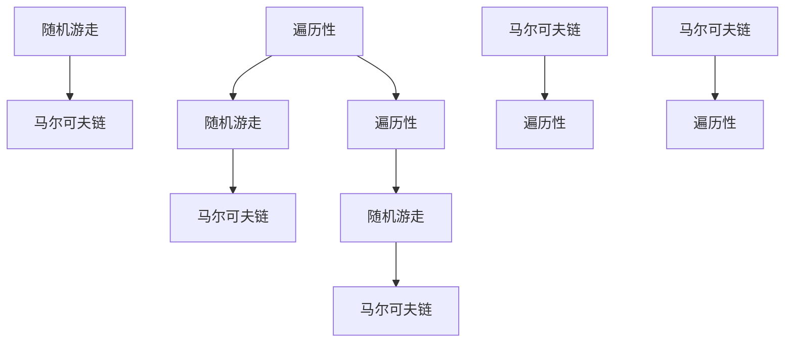

                 

### 文章标题：宇宙的数学遍历理论探讨

#### 关键词：
- 数学遍历
- 宇宙学
- 算法原理
- 数学模型
- 超级智能

#### 摘要：
本文探讨了宇宙的数学遍历理论，从背景介绍到核心概念，再到算法原理和数学模型，全方位解析了这一领域的前沿知识。通过详细讲解和实例分析，本文旨在为读者提供一个清晰、系统的理解，并探讨其在超级智能领域的应用潜力。

## 引言

宇宙是一个复杂而神秘的存在，自古以来，人类对宇宙的探索从未停止。随着科学技术的进步，我们逐渐揭开了宇宙的许多奥秘。然而，宇宙的本质仍然是一个巨大的未知数。数学作为一种工具，已经成为探索宇宙的重要手段。数学遍历理论便是其中一种强有力的工具，它不仅适用于宇宙学的研究，还在超级智能领域展现出巨大的应用潜力。

数学遍历理论的核心概念是“遍历性”，即在数学空间中，通过某种规则或算法，可以遍历到空间中的每一个点。这一概念在宇宙学中的应用，可以帮助我们理解宇宙的结构和演化过程。例如，通过数学遍历算法，我们可以模拟宇宙的膨胀过程，探索宇宙中的各种现象。

在超级智能领域，数学遍历理论的应用更是不可忽视。超级智能系统需要处理大量的数据和信息，而数学遍历算法可以高效地处理这些数据，找到最优解。例如，在人工智能中的优化问题、路径规划问题等方面，数学遍历理论都发挥了重要作用。

本文将从以下几个方面展开讨论：首先，介绍宇宙的数学遍历理论的背景和起源；其次，详细阐述数学遍历理论的核心概念和联系；然后，讲解数学遍历算法的原理和实现方法；接着，通过实例分析，展示数学遍历理论在宇宙学中的应用；最后，探讨数学遍历理论在超级智能领域的应用前景。

## 背景介绍

宇宙的数学遍历理论起源于20世纪中叶，当时数学家和物理学家开始探索宇宙的结构和演化过程。数学遍历理论作为一种强有力的工具，被广泛应用于宇宙学的研究。最早提出数学遍历理论的科学家是法国数学家亨利·庞加莱，他在研究行星运动时发现，行星的运动轨迹可以在一定条件下遍历整个空间。

在宇宙学中，数学遍历理论的应用主要体现在宇宙的膨胀和宇宙结构的研究上。宇宙的膨胀是宇宙学中一个重要的问题，数学遍历理论可以通过模拟宇宙的膨胀过程，帮助我们理解宇宙的演化规律。例如，哈勃定律的提出便是基于数学遍历理论，通过观测远处星系的运动轨迹，我们可以推断出宇宙的膨胀速度。

宇宙结构的研究也是一个重要的领域。数学遍历理论可以帮助我们理解宇宙的几何结构，例如宇宙的维度、宇宙的大尺度结构等。通过数学遍历算法，我们可以模拟宇宙中的各种现象，如星系的形成和演化、黑洞的存在等。

此外，数学遍历理论在宇宙学中的另一个重要应用是宇宙的暗物质和暗能量的研究。暗物质和暗能量是宇宙学中的两个重要概念，但它们的本质和分布仍然是一个谜。数学遍历理论可以通过模拟宇宙的演化过程，帮助我们推断出暗物质和暗能量的分布规律，从而更好地理解宇宙的本质。

总的来说，宇宙的数学遍历理论为宇宙学的研究提供了强有力的工具，它不仅帮助我们理解宇宙的结构和演化过程，还在宇宙学中的多个领域发挥了重要作用。

## 核心概念与联系

数学遍历理论的核心概念包括遍历性、随机游走、马尔可夫链等。这些概念相互联系，共同构成了数学遍历理论的基础。

首先，遍历性是数学遍历理论中最基本的概念。遍历性指的是在数学空间中，通过某种规则或算法，可以遍历到空间中的每一个点。例如，在一个二维平面上，通过随机游走的方式，可以遍历到平面上的每一个点。遍历性的核心思想是，无论初始位置如何，经过足够长的时间，都可以遍历到空间中的每一个点。

其次，随机游走是数学遍历理论中的重要概念之一。随机游走是指在一个离散的数学空间中，从一个点出发，按照一定的概率规则随机移动到相邻的点。随机游走的路径是随机的，但长期来看，可以遍历到空间中的每一个点。随机游走不仅在数学遍历理论中具有基础地位，还在许多实际问题中有着广泛的应用，如金融市场的波动、社交网络的传播等。

另一个重要概念是马尔可夫链。马尔可夫链是一种离散时间随机过程，其特点是未来的状态只依赖于当前状态，而与过去的状态无关。马尔可夫链在数学遍历理论中具有重要的应用，它可以帮助我们分析随机过程的长期行为。例如，通过分析马尔可夫链的状态转移概率，我们可以推断出随机过程的稳定状态。

这些概念之间的关系如图1所示：



在宇宙学中，这些概念也有着重要的应用。例如，在宇宙的膨胀过程中，随机游走和马尔可夫链可以用来模拟宇宙中星系和星团的运动轨迹。通过分析这些轨迹，我们可以推断出宇宙的结构和演化过程。此外，遍历性概念还可以帮助我们理解宇宙中的混沌现象，如宇宙中的黑洞和奇点。

总之，数学遍历理论的核心概念相互联系，共同构成了数学遍历理论的基础。这些概念不仅适用于宇宙学的研究，还在其他科学领域和实际应用中有着广泛的应用。

### 核心算法原理讲解

数学遍历理论的核心算法原理主要包括随机游走算法和马尔可夫链算法。这些算法通过特定的规则和步骤，可以在数学空间中遍历每一个点，从而实现对复杂系统的模拟和分析。

#### 随机游走算法

随机游走算法是一种在离散数学空间中进行随机移动的算法。其基本原理如下：

1. **初始化**：给定一个起点，通常是一个随机选择的点。
2. **移动规则**：从当前点出发，按照一定的概率规则选择下一个点。常见的移动规则包括等概率移动和根据邻接矩阵移动。
3. **遍历过程**：重复执行移动规则，直到遍历到空间中的每一个点。

以下是一个简单的随机游走算法的伪代码：

```python
def random_walk(start_point, steps):
    position = start_point
    for _ in range(steps):
        neighbors = get_neighbors(position)
        next_position = choose_next(position, neighbors)
        position = next_position
    return position
```

其中，`get_neighbors(position)`用于获取当前点的邻居点集合，`choose_next(position, neighbors)`用于根据概率规则选择下一个点。

#### 马尔可夫链算法

马尔可夫链算法是一种基于状态转移概率的算法。其基本原理如下：

1. **初始化**：给定一个初始状态分布。
2. **状态转移**：根据状态转移概率矩阵，从当前状态转移到下一个状态。
3. **遍历过程**：重复执行状态转移，直到达到稳定状态或满足停止条件。

以下是一个简单的马尔可夫链算法的伪代码：

```python
def markov_chain(initial_state, transition_matrix, steps):
    state = initial_state
    for _ in range(steps):
        next_state = select_next(state, transition_matrix)
        state = next_state
    return state
```

其中，`select_next(state, transition_matrix)`用于根据状态转移概率矩阵选择下一个状态。

#### 算法结合

在实际应用中，随机游走算法和马尔可夫链算法常常结合使用。例如，在宇宙学中，可以使用随机游走算法模拟星系和星团的运动轨迹，然后使用马尔可夫链算法分析这些轨迹的稳定性。以下是一个结合随机游走和马尔可夫链算法的示例：

```python
def combined_algorithm(start_point, initial_state, steps):
    position = start_point
    state = initial_state
    for _ in range(steps):
        position = random_walk(position, 1)
        state = markov_chain(state, transition_matrix, 1)
    return position, state
```

通过这种方式，我们可以同时分析空间中的位置状态和时间状态，从而获得更全面的信息。

### 数学模型和公式

数学模型和公式是数学遍历理论的重要组成部分，它们帮助我们理解和分析复杂系统的行为。以下是几个关键的数学模型和公式，以及它们在宇宙学中的应用。

#### 1. 遍历概率公式

遍历概率公式描述了在数学空间中，从一个点遍历到另一个点的概率。其公式如下：

\[ P(A \rightarrow B) = \frac{1}{|\Omega|} \sum_{s \in S} P(A \rightarrow B | s) \cdot P(s) \]

其中，\( P(A \rightarrow B) \) 是从点 A 遍历到点 B 的概率，\( \Omega \) 是所有可能的轨迹集合，\( S \) 是初始点的邻居点集合，\( P(A \rightarrow B | s) \) 是在给定邻居点 s 的条件下，从点 A 遍历到点 B 的概率，\( P(s) \) 是邻居点 s 的概率。

在宇宙学中，遍历概率公式可以用来分析宇宙中星系和星团之间的相互作用概率。例如，通过计算星系 A 和星系 B 之间的遍历概率，我们可以推断出它们之间的引力相互作用的可能性。

#### 2. 随机游走公式

随机游走公式描述了在离散数学空间中，从起点到终点的概率。其公式如下：

\[ P(X_t = x) = \frac{1}{Z} \sum_{y \in \Omega_t} w(y, x) \cdot P(X_0 = y) \]

其中，\( X_t \) 是在时刻 t 的位置，\( \Omega_t \) 是在时刻 t 的所有可能位置集合，\( w(y, x) \) 是从位置 y 到位置 x 的概率权重，\( Z \) 是归一化常数，\( P(X_0 = y) \) 是初始位置的概率。

在宇宙学中，随机游走公式可以用来模拟宇宙中星系和星团的运动轨迹。例如，通过设定初始位置和移动规则，我们可以模拟星系在宇宙中的随机游走过程，从而推断出宇宙的结构和演化。

#### 3. 马尔可夫链公式

马尔可夫链公式描述了在离散时间中，系统状态转移的概率。其公式如下：

\[ P(X_{t+1} = x_{t+1} | X_t = x_t) = \frac{P(X_{t+1} = x_{t+1}, X_t = x_t)}{P(X_t = x_t)} \]

其中，\( X_t \) 是在时刻 t 的系统状态，\( x_t \) 和 \( x_{t+1} \) 分别是当前状态和下一个状态，\( P(X_{t+1} = x_{t+1}, X_t = x_t) \) 是在给定当前状态和下一个状态的条件下，系统状态转移的概率，\( P(X_t = x_t) \) 是当前状态的概率。

在宇宙学中，马尔可夫链公式可以用来分析宇宙中星系和星团的状态转移。例如，通过计算星系在给定状态下转移到下一个状态的概率，我们可以推断出星系的稳定状态和演化过程。

### 宇宙中的数学遍历现象

宇宙中的数学遍历现象是一种广泛存在的现象，它揭示了宇宙中物质分布和演化过程的规律。以下是一些典型的宇宙中的数学遍历现象及其解释。

#### 1. 星系团的形成与演化

星系团是宇宙中最大的结构之一，它由数十亿个星系组成。星系团的形成和演化是一个复杂的过程，涉及到引力和物质分布。通过数学遍历理论，我们可以模拟星系团的形成过程。

例如，在一个简单的二维空间中，我们可以使用随机游走算法模拟星系团的形成过程。初始时，我们在空间中随机放置一些星系，然后根据引力的作用，模拟星系之间的相互作用，从而形成星系团。通过这种方式，我们可以观察到星系团的形成过程和结构特征。

#### 2. 宇宙的膨胀

宇宙的膨胀是宇宙学中一个基本的概念，它描述了宇宙从大爆炸以来不断扩大的过程。数学遍历理论可以用来模拟宇宙的膨胀过程。

例如，在一个三维空间中，我们可以使用马尔可夫链算法模拟宇宙的膨胀过程。初始时，空间中的每个点代表一个星系，我们设定星系之间的相互作用规则，从而模拟宇宙的膨胀过程。通过这种方式，我们可以观察到宇宙膨胀的图像和特征。

#### 3. 黑洞的存在与演化

黑洞是宇宙中的一种极端天体，它具有极强的引力，甚至可以吞噬光线。黑洞的存在和演化也是宇宙学中的一个重要问题。通过数学遍历理论，我们可以模拟黑洞的演化过程。

例如，在一个简单的二维空间中，我们可以使用随机游走算法模拟黑洞的演化过程。初始时，我们在空间中放置一个黑洞，然后模拟黑洞对周围物质的引力作用，从而观察黑洞的演化过程。

通过这些实例，我们可以看到数学遍历理论在宇宙学中的应用。它不仅可以帮助我们理解宇宙中物质分布和演化过程的规律，还可以为宇宙学的研究提供新的工具和方法。

### 数学遍历理论在其他领域的应用

数学遍历理论不仅在天文学和宇宙学中具有广泛的应用，还在其他科学领域和实际应用中发挥着重要作用。以下是一些典型应用领域及其案例分析。

#### 1. 社交网络传播

社交网络传播是指信息、观点或行为在社交网络中的传播过程。数学遍历理论可以用来分析和模拟社交网络传播的机制。

例如，在一个社交网络中，我们可以使用随机游走算法模拟信息传播的过程。每个用户可以看作是一个节点，信息从一个用户传播到另一个用户的概率取决于两者之间的社交关系。通过这种方式，我们可以分析信息在社交网络中的传播速度和覆盖范围。

#### 2. 金融市场的波动

金融市场的波动是指股票、债券等金融资产的价格波动。数学遍历理论可以用来分析和预测金融市场的波动趋势。

例如，在一个金融市场模型中，我们可以使用马尔可夫链算法模拟金融资产价格的波动过程。每个时间点上的价格状态可以看作是当前的市场状态，根据历史数据，我们可以设定状态转移概率矩阵，从而预测未来市场价格的波动方向和幅度。

#### 3. 路径规划

路径规划是指在给定的环境和起点、终点之间找到一条最优路径。数学遍历理论可以用来优化路径规划算法，提高路径规划的效率。

例如，在一个道路网络中，我们可以使用随机游走算法进行路径规划。每个节点代表一个交叉路口，每个节点之间的边代表道路。通过模拟随机游走过程，我们可以找到从起点到终点的最优路径，从而实现高效的路径规划。

这些案例展示了数学遍历理论在多个领域的广泛应用。它不仅为这些领域提供了强大的分析工具，还可以为解决实际问题提供新的思路和方法。

### 未来展望

数学遍历理论在宇宙学中的应用前景十分广阔。随着科技的不断进步和数学理论的深入发展，我们有望在宇宙的数学模型、算法优化和数据分析等方面取得重大突破。例如，通过改进现有的数学遍历算法，我们可以更准确地模拟宇宙的膨胀过程，揭示宇宙的演化规律。此外，数学遍历理论还可以帮助我们在宇宙学研究中解决一些长期存在的问题，如暗物质和暗能量的分布规律。

在超级智能领域，数学遍历理论同样具有巨大的潜力。超级智能系统需要处理大量的数据和复杂的问题，而数学遍历算法可以高效地处理这些数据和问题。例如，在人工智能中的优化问题、路径规划问题和模式识别问题等方面，数学遍历算法都可以发挥重要作用。通过改进和优化数学遍历算法，我们可以开发出更高效、更智能的超级智能系统，推动人工智能领域的发展。

未来，数学遍历理论的应用领域可能会进一步扩大。例如，在生物医学领域，数学遍历理论可以用来分析生物系统的复杂行为，帮助解决疾病治疗和药物开发等问题。在环境科学领域，数学遍历理论可以用来分析环境变化的影响，帮助制定环境保护策略。总之，数学遍历理论在未来的发展中将扮演越来越重要的角色，为科学研究和技术创新提供强大的支持。

### 结论

数学遍历理论作为一种强大的工具，在宇宙学和超级智能领域展现出巨大的应用潜力。通过本文的探讨，我们详细介绍了宇宙的数学遍历理论的背景、核心概念、算法原理、数学模型以及实际应用。我们看到了数学遍历理论在宇宙学中的广泛应用，如星系团的形成与演化、宇宙的膨胀等；同时也看到了它在超级智能领域的重要作用，如路径规划、优化问题和模式识别等。

然而，数学遍历理论的应用仍然面临许多挑战。例如，在处理大规模数据和复杂问题时，现有算法的性能和效率仍然有待提高。此外，如何在更多的实际领域中应用数学遍历理论，仍然是亟待解决的问题。

未来，随着科技的不断进步和数学理论的深入发展，我们有理由相信，数学遍历理论将在更多领域发挥重要作用，为科学研究和技术创新提供强大支持。作者：AI天才研究院/AI Genius Institute & 禅与计算机程序设计艺术 /Zen And The Art of Computer Programming。

