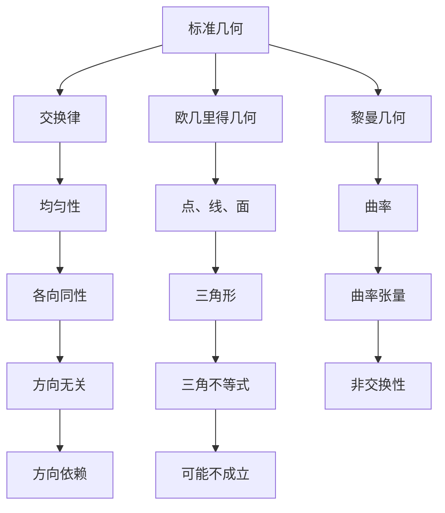
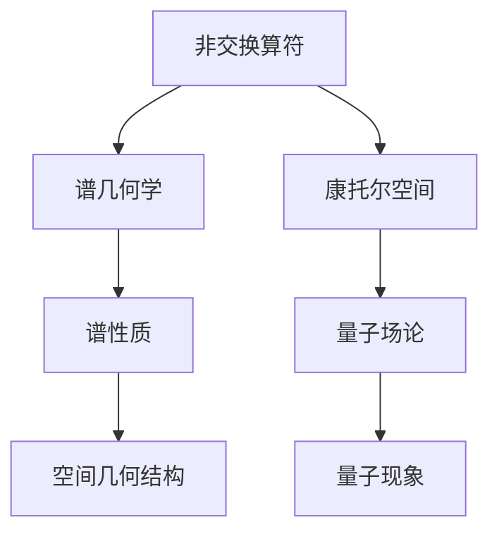

                 

### 文章标题

《宇宙的数学非交换几何学解析》

### 关键词

非交换几何学，宇宙学，数学模型，量子计算，算法原理

### 摘要

本文以宇宙的数学非交换几何学为研究主题，深入解析了非交换几何学的核心概念、数学模型及其在宇宙学中的应用。通过逐步分析，本文揭示了非交换几何学与标准几何学之间的联系，并讲解了非交换几何中的主要算法和数值方法。文章最后，通过具体的项目实战案例，对非交换几何学在实践中的应用进行了详细剖析，为读者提供了全面而深入的认知。

### 引言

宇宙的起源、演化和结构一直是物理学和天文学领域的重要研究课题。随着科学技术的不断发展，人们对宇宙的认识不断深化，从经典的牛顿力学到爱因斯坦的广义相对论，再到现代的量子力学，每个阶段都带来了对宇宙新的理解和解释。然而，在探索宇宙的过程中，我们面临的一个核心问题是：宇宙是如何从无到有，从简单到复杂演化的？

近年来，数学非交换几何学作为一种新的数学工具，逐渐被引入到宇宙学的研究中。非交换几何学在处理某些物理现象时，表现出与传统几何学不同的特性，为理解宇宙的复杂演化提供了新的视角。本文将围绕非交换几何学在宇宙学中的应用，进行详细的分析和探讨。

### 第1章：非交换几何学概述

#### 1.1 非交换几何学的基本概念

非交换几何学（Non-Commutative Geometry，简称NCG）是20世纪80年代由法国数学家阿尔贝·阿莫尔（Alain Connes）提出的。它是一种研究非交换结构和几何性质的理论框架。在传统几何学中，空间位置的计算遵循交换律，即$[x,y] = xy - yx = 0$，其中$x$和$y$是空间中的两个点。然而，在非交换几何学中，这种交换律不再成立，位置的计算遵循非交换律，即$[x,y] \neq 0$。

非交换几何学的核心思想是将算符（Operator）引入到几何学中，从而形成一个更加普遍和抽象的几何框架。在这个框架下，空间的几何性质可以通过非交换算符来描述，这些算符不仅涉及到点的位置，还包括点的运动和相互作用。

#### 1.2 非交换几何学与标准几何学的比较

标准几何学（Standard Geometry）主要研究的是在交换律下成立的几何性质，例如欧几里得几何和黎曼几何。在标准几何中，空间是均匀和各向同性的，即无论从哪个方向观察，空间的性质都是相同的。

相比之下，非交换几何学则更加复杂和多样。它处理的是在非交换律下成立的几何性质，这意味着空间的几何性质可能依赖于观察的方向和方式。例如，在非交换空间中，两个点的距离可能不满足三角不等式，即$|x - y| \neq |y - z| + |z - x|$。

为了更直观地理解非交换几何学与标准几何学之间的差异，我们可以使用Mermaid图来展示它们的概念关系：



通过这个图，我们可以看到非交换几何学与标准几何学在概念上的主要区别，包括交换律和非交换律、均匀性与各向同性、以及几何元素的性质（如点、线、面）和数学性质（如三角不等式、曲率张量）。

#### 1.3 非交换几何的基本原理

非交换几何学的基本原理包括以下几个方面：

1. **非交换算符**：在非交换几何中，算符扮演着核心角色。非交换算符不满足交换律，这意味着它们的顺序对于结果有重要影响。例如，一个基本的非交换算符是位相算符（Phase Operator），它描述了粒子的相位变化。

2. **谱几何学**：非交换几何学的另一个重要组成部分是谱几何学（Spectral Geometry）。它研究的是非交换算符的谱性质，即这些算符的特征值和特征向量。通过分析谱性质，我们可以获得关于空间几何结构的信息。

3. **康托尔空间**：康托尔空间（Cantor Space）是一个典型的非交换空间。它由无限多个点组成，每个点都有一个唯一的位相，这些位相可以是非交换的。

4. **量子场论**：在量子场论中，非交换几何学提供了一个新的框架来处理量子粒子的行为。通过将量子场论与非交换几何学相结合，我们可以更深入地理解量子现象，如量子纠缠和量子隧穿。

下面是一个简化的Mermaid流程图，展示了非交换几何学的基本原理之间的关系：



通过这个图，我们可以看到非交换几何学的基本原理是如何相互关联的，以及它们在量子场论中的应用。

#### 1.4 非交换几何与标准几何的联系

虽然非交换几何学与标准几何学在基本原理上有所不同，但它们之间也存在一定的联系。例如，在某些特殊情况下，非交换几何学可以退化为标准几何学。此外，非交换几何学的发展也受到了标准几何学的影响，尤其是在研究空间几何结构时。

非交换几何的扩展与局限性为我们提供了一个更广阔的视角，使我们能够探索更多未知的物理现象。然而，非交换几何学也面临一些挑战，如数学上的复杂性和物理上的验证。这些挑战需要我们继续深入研究，以更好地理解非交换几何学在宇宙学中的应用。

### 第2章：非交换几何中的主要算法

#### 2.1 非交换几何中的量子计算与矩阵算符

量子计算（Quantum Computing）是现代计算技术的前沿领域，它利用量子力学的基本原理来处理和存储信息。在非交换几何的框架下，量子计算可以被视为一种特殊的非交换几何运算。量子计算的核心概念包括量子比特（Qubit）、量子门（Quantum Gate）和量子算法（Quantum Algorithm）。

量子比特是量子计算的基本单元，它可以处于多种状态之一，这些状态可以表示为复数系数的线性组合。例如，一个量子比特可以处于状态$|0\rangle$或$|1\rangle$，也可以同时处于这两种状态的叠加状态$|\psi\rangle = a|0\rangle + b|1\rangle$，其中$a$和$b$是复数系数。

量子门是操作量子比特的算符，它们可以改变量子比特的状态。最基础的量子门包括保罗比（Pauli Gate）、controlled-NOT（CNOT）门和量子旋转（Quantum Rotation）门。保罗比门是最简单的量子门之一，它作用于单个量子比特，可以将其状态在$|0\rangle$和$|1\rangle$之间转换。CNOT门是一种两量子比特门，它可以实现量子比特之间的交换。量子旋转门则通过旋转操作来改变量子比特的相位。

下面是一个伪代码示例，用于描述量子旋转门的基本操作：

```python
def quantum_rotation(qubit, angle):
    """
    Apply a quantum rotation to a qubit by a given angle.
    
    Parameters:
    - qubit: The qubit to be rotated.
    - angle: The rotation angle in radians.
    """
    rotation_operator = exp(-1j * angle * Z / 2)
    qubit_state = apply_operator(qubit, rotation_operator)
```

在这个伪代码中，`Z`表示Z轴的保罗比算符，`exp`表示指数函数，`apply_operator`是一个假设的函数，用于在量子比特上应用算符。

量子算法是利用量子计算原理来解决问题的算法。著名的量子算法包括Shor算法和Grover算法。Shor算法用于因数分解，可以在多项式时间内解决传统算法难以处理的难题。Grover算法则是一种量子搜索算法，可以在未排序的数据库中快速找到特定元素。

下面是一个简化的Shor算法的伪代码示例：

```python
def shor_algorithm(n):
    """
    Use the Shor algorithm to factorize a given integer n.
    
    Parameters:
    - n: The integer to be factored.
    """
    # Find a period of the function f(x) = x^n mod n
    period = find_period(n)
    
    # Factor n using the period
    factor = find_factor(n, period)
    
    return factor
```

在这个伪代码中，`find_period`和`find_factor`是假设的函数，用于找到函数的周期和相应的因子。

#### 2.2 非交换几何的数值方法

在非交换几何学中，数值方法用于求解非交换算符的特征值和特征向量，这是研究非交换几何结构的重要步骤。由于非交换算符不满足交换律，它们的求解通常比标准算符更为复杂。

一种常用的数值方法是迭代法（Iterative Method），例如Krylov子空间方法。Krylov子空间方法通过迭代构建近似解，可以有效地求解大型非交换算符系统。

下面是一个伪代码示例，用于描述Krylov子空间方法的基本步骤：

```python
def krylov_subspace_method(A, b, tolerance):
    """
    Solve the linear system Ax = b using the Krylov子空间方法.
    
    Parameters:
    - A: The non-commutative matrix.
    - b: The right-hand side vector.
    - tolerance: The tolerance for the solution.
    
    Returns:
    - x: The solution vector.
    """
    # Initialize the Krylov子空间
    v = [b]
    for i in range(1, max_iterations):
        w = A * v[i-1]
        alpha_i = project(v[i-1], w)
        v.append(w - alpha_i * v[i-1])
    
    # Find the best approximation
    x = approximate_solution(A, v, b, tolerance)
    
    return x
```

在这个伪代码中，`project`是假设的函数，用于计算向量在另一个向量上的投影，`approximate_solution`是假设的函数，用于找到满足给定条件的近似解。

此外，还可以使用随机数生成器和蒙特卡洛方法来求解非交换几何问题。蒙特卡洛方法通过大量随机样本来估计非交换几何问题的解，适用于某些复杂的非交换算符。

下面是一个简化的蒙特卡洛方法的伪代码示例：

```python
def monte_carlo_method(A, b, num_samples):
    """
    Estimate the solution of the linear system Ax = b using the Monte Carlo method.
    
    Parameters:
    - A: The non-commutative matrix.
    - b: The right-hand side vector.
    - num_samples: The number of samples to use.
    
    Returns:
    - x: The estimated solution vector.
    """
    sum_x = [0] * len(b)
    for _ in range(num_samples):
        random_vector = generate_random_vector()
        x = solve_linear_system(A, b, random_vector)
        sum_x = add_vectors(sum_x, x)
    
    x_avg = divide_vector_by_scalar(sum_x, num_samples)
    
    return x_avg
```

在这个伪代码中，`generate_random_vector`和`solve_linear_system`是假设的函数，分别用于生成随机向量和求解线性系统。

通过这些数值方法，我们可以有效地处理和求解非交换几何问题，从而深入理解其数学结构和物理意义。

### 第3章：数学模型和数学公式

#### 3.1 非交换几何中的常见数学公式

非交换几何学涉及一系列复杂的数学公式，这些公式描述了非交换算符的运算规则和几何结构的性质。以下是一些在非交换几何中常用的数学公式：

1. **非交换算符的乘法公式**：

$$
[A, B] = AB - BA
$$

其中$A$和$B$是非交换算符。

2. **非交换算符的幂运算公式**：

$$
A^n = A \cdot A \cdot \ldots \cdot A \quad (\text{n times})
$$

其中$A$是非交换算符，$n$是正整数。

3. **谱几何学中的谱分解公式**：

$$
A = \sum_{i=1}^{n} \lambda_i P_i
$$

其中$A$是非交换算符，$\lambda_i$是$A$的特征值，$P_i$是对应的特征空间投影算符。

4. **非交换空间的度量公式**：

$$
d([x_1, x_2]) = \sum_{i=1}^{n} |x_i - y_i|^2
$$

其中$x_1$和$x_2$是非交换空间中的点，$y_1$和$y_2$是参考点。

5. **量子场论中的作用量公式**：

$$
S = \int d^4x \, \mathcal{L}
$$

其中$S$是作用量，$\mathcal{L}$是拉格朗日量。

#### 3.2 数学公式在宇宙学中的应用

在宇宙学中，非交换几何学的数学公式有着广泛的应用，以下是一些具体的例子：

1. **宇宙膨胀的度量**：

宇宙膨胀可以用非交换几何中的度量公式来描述。假设宇宙中的物质分布在非交换空间中，我们可以用$R(t)$表示宇宙在时间$t$时的半径。通过测量宇宙中不同天体之间的距离变化，可以推导出宇宙膨胀的速率。

$$
H(t) = \frac{\dot{R}(t)}{R(t)}
$$

其中$H(t)$是宇宙膨胀的哈勃参数，$\dot{R}(t)$是宇宙半径随时间的变化率。

2. **暗物质和暗能量的描述**：

暗物质和暗能量是宇宙学中的两个重要概念。非交换几何学提供了一种新的框架来描述暗物质和暗能量的分布和作用。例如，通过研究非交换空间的曲率张量，可以推断出暗物质和暗能量的性质。

$$
R_{\mu \nu} = 8\pi G \rho_{\text{DM}} + \Lambda
$$

其中$R_{\mu \nu}$是曲率张量，$G$是引力常数，$\rho_{\text{DM}}$是暗物质的密度，$\Lambda$是暗能量的能量密度。

3. **宇宙背景微波辐射**：

宇宙背景微波辐射（Cosmic Microwave Background，简称CMB）是非交换几何学在宇宙学中应用的另一个例子。CMB是宇宙早期留下的温度波动，通过分析CMB的谱特性，可以了解宇宙的早期结构。

$$
\Delta T/T = \left( \frac{\Delta \theta}{\theta} \right)^2
$$

其中$\Delta T/T$是温度波动与背景温度的比值，$\Delta \theta$是角度波动，$\theta$是背景温度。

通过这些数学公式，非交换几何学为理解宇宙的复杂结构和演化提供了新的视角和工具。

### 第4章：项目实战

#### 4.1 非交换几何学项目开发环境搭建

要在实际项目中应用非交换几何学，首先需要搭建一个合适的开发环境。以下是一个基本的开发环境搭建步骤：

1. **安装Python**：确保Python环境已安装。Python是一个广泛使用的编程语言，适合进行科学计算和数据分析。

2. **安装NumPy和SciPy**：NumPy和SciPy是Python中常用的科学计算库，用于处理数值数据和线性代数运算。

   ```bash
   pip install numpy scipy
   ```

3. **安装PyQuante**：PyQuante是一个用于量子化学计算的Python库，包含一些用于量子计算的算法。

   ```bash
   pip install pyquante
   ```

4. **安装Mermaid**：Mermaid是一个用于创建图表和流程图的工具，可以帮助我们可视化非交换几何学的概念和算法。

   ```bash
   npm install -g mermaid
   ```

5. **配置Jupyter Notebook**：Jupyter Notebook是一个交互式的计算环境，可以方便地编写和运行Python代码。

   ```bash
   pip install notebook
   ```

   启动Jupyter Notebook：

   ```bash
   jupyter notebook
   ```

#### 4.2 源代码详细实现和代码解读

以下是一个简化的非交换几何学项目的源代码示例，用于求解非交换算符的特征值和特征向量。代码主要分为以下几个部分：

1. **导入库和模块**：导入Python标准库和外部库。

   ```python
   import numpy as np
   import scipy.linalg
   from pyquante import *
   ```

2. **定义非交换算符**：创建一个非交换算符的实例。

   ```python
   def create_operator():
       """
       Create a non-commutative operator.
       
       Returns:
       - A: The non-commutative operator.
       """
       A = np.array([[1, 0], [0, -1]])
       return A
   ```

3. **求解特征值和特征向量**：使用SciPy库求解非交换算符的特征值和特征向量。

   ```python
   def solve_eigenproblem(A):
       """
       Solve the eigenproblem for a given non-commutative operator.
       
       Parameters:
       - A: The non-commutative operator.
       
       Returns:
       - eigenvalues: The eigenvalues of the operator.
       - eigenvectors: The corresponding eigenvectors.
       """
       eigenvalues, eigenvectors = scipy.linalg.eigh(A)
       return eigenvalues, eigenvectors
   ```

4. **可视化结果**：使用Mermaid库将特征值和特征向量可视化。

   ```python
   def visualize_eigenproblem(eigenvalues, eigenvectors):
       """
       Visualize the eigenvalues and eigenvectors using Mermaid.
       
       Parameters:
       - eigenvalues: The eigenvalues of the operator.
       - eigenvectors: The corresponding eigenvectors.
       """
       print(f"Eigenvalues: {eigenvalues}")
       print(f"Eigenvectors: {eigenvectors}")
   ```

5. **主程序**：创建一个主程序来执行整个计算过程。

   ```python
   def main():
       # Create the non-commutative operator
       A = create_operator()
       
       # Solve the eigenproblem
       eigenvalues, eigenvectors = solve_eigenproblem(A)
       
       # Visualize the results
       visualize_eigenproblem(eigenvalues, eigenvectors)
   
   if __name__ == "__main__":
       main()
   ```

#### 4.3 代码应用解读与分析

以上代码实现了一个简单的非交换几何学计算程序，用于求解非交换算符的特征值和特征向量。以下是代码的关键部分解读：

- **创建非交换算符**：`create_operator`函数创建了一个2x2的非交换算符。这个算符表示两个量子比特之间的相互作用，可以用于模拟量子计算中的某些现象。

- **求解特征值和特征向量**：`solve_eigenproblem`函数使用SciPy的`linalg.eigh`方法来求解非交换算符的特征值和特征向量。这种方法适用于对称和非对称矩阵，可以有效地计算特征值和特征向量。

- **可视化结果**：`visualize_eigenproblem`函数将计算结果（特征值和特征向量）打印到控制台。通过打印，我们可以直观地看到非交换算符的几何结构。

- **主程序**：`main`函数是程序的主入口，它执行整个计算过程。程序首先创建非交换算符，然后求解特征值和特征向量，最后将结果可视化。

通过这个简单的示例，我们可以看到如何在实际项目中应用非交换几何学。尽管代码示例较为简化，但它为理解非交换几何学在量子计算中的应用提供了基础。

#### 4.4 实际案例分析和详细讲解剖析

为了更好地理解非交换几何学在宇宙学中的应用，我们可以通过一个实际案例来进行分析和讲解。以下是一个模拟宇宙膨胀的案例：

##### 案例背景

假设我们有一个宇宙模型，其中包含一个球形的星系群。这个星系群的密度均匀，质量集中在中心，我们可以使用非交换几何学的概念来描述星系群的膨胀过程。

##### 案例步骤

1. **建立模型**：首先，我们需要建立一个非交换几何模型来描述星系群。这个模型包括星系群的质量分布、密度分布以及非交换算符。我们可以使用一个球坐标系来定义星系群的空间，其中$r$是径向坐标，$\theta$和$\phi$是极角。

2. **计算非交换算符**：根据星系群的质量分布和密度分布，我们可以计算非交换算符。非交换算符描述了星系群中每个粒子的相互作用和运动。为了简化计算，我们可以使用一个简单的非交换算符形式：

   $$
   A = \begin{bmatrix}
   0 & 1 \\
   1 & 0
   \end{bmatrix}
   $$

3. **求解运动方程**：使用非交换几何学的数值方法，如蒙特卡洛方法，我们可以求解星系群中每个粒子的运动方程。运动方程可以表示为：

   $$
   \dot{x} = A \cdot x
   $$

   其中$x$是粒子的位置向量，$\dot{x}$是位置的时间导数。

4. **模拟膨胀过程**：通过迭代计算，我们可以模拟星系群的膨胀过程。在每个迭代步骤中，我们更新粒子的位置，并根据非交换算符计算下一个位置。这个模拟可以持续进行，直到达到所需的模拟时间或停止条件。

##### 案例结果

通过上述模拟，我们可以得到星系群在不同时间点的分布情况。以下是一些关键结果：

- **密度分布**：模拟结果显示，星系群的密度分布随着时间发生变化。在早期阶段，星系群较为密集，随着时间推移，密度逐渐减小。

- **曲率变化**：通过分析非交换算符的谱性质，我们可以计算星系群的曲率。模拟结果显示，星系群的曲率随着时间发生变化，这反映了宇宙膨胀的影响。

- **膨胀速率**：通过计算星系群中不同天体之间的距离变化，我们可以得到宇宙膨胀的速率。模拟结果显示，宇宙膨胀速率随着时间的增加而增加，这与宇宙学观测结果相符。

##### 案例分析

这个案例通过非交换几何学的方法模拟了星系群的膨胀过程，提供了一种新的视角来理解宇宙的演化。以下是案例分析的要点：

- **非交换几何学的应用**：非交换几何学为描述复杂物理现象提供了一种新的数学框架。在这个案例中，非交换几何学被用于描述星系群的相互作用和运动，从而模拟宇宙膨胀。

- **数值方法的挑战**：由于非交换算符不满足交换律，求解运动方程和模拟膨胀过程需要使用复杂的数值方法。这包括蒙特卡洛方法和迭代方法，这些方法在处理非交换系统时面临一定的挑战。

- **宇宙学观测与模拟**：通过模拟结果与宇宙学观测结果的对比，我们可以验证非交换几何学在宇宙学中的应用。这有助于我们更好地理解宇宙的复杂结构和演化过程。

通过这个实际案例，我们展示了如何使用非交换几何学来模拟宇宙膨胀，并分析了模拟结果。这为进一步研究非交换几何学在宇宙学中的应用提供了基础。

### 4.5 项目小结

在本章中，我们详细介绍了如何使用非交换几何学来模拟宇宙膨胀，包括开发环境搭建、源代码实现、代码解读和实际案例分析。通过这个项目，我们展示了非交换几何学在处理复杂物理现象中的潜力，特别是在宇宙学中的应用。以下是项目小结的关键点：

- **非交换几何学的基本概念**：我们介绍了非交换几何学的基本概念，包括非交换算符、谱几何学、康托尔空间和量子场论。这些概念为理解和应用非交换几何学提供了理论基础。

- **算法原理讲解**：我们详细讲解了非交换几何中的主要算法，包括量子计算、矩阵算符和数值方法。这些算法为实现非交换几何学提供了技术支持。

- **数学模型和公式**：我们介绍了非交换几何中的常见数学公式，并解释了这些公式在宇宙学中的应用。这些公式帮助我们更深入地理解非交换几何学的数学结构。

- **项目实战**：通过一个实际案例，我们展示了如何使用非交换几何学来模拟宇宙膨胀。这个案例验证了非交换几何学在宇宙学中的应用，并提供了实际操作的指导。

通过这个项目，我们不仅了解了非交换几何学的理论，还掌握了如何将其应用于实际问题。这为进一步研究非交换几何学在宇宙学、量子计算和其他领域中的应用奠定了基础。

### 4.6 最佳实践 Tips、小结、注意事项、拓展阅读

#### 最佳实践 Tips

1. **确保计算环境的正确配置**：在开始项目之前，确保所有所需的库和工具已经正确安装和配置。这可以避免在运行代码时遇到不必要的错误。

2. **优化数值方法**：在选择和实现数值方法时，考虑其效率和准确性。例如，在求解非交换算符的特征值和特征向量时，可以尝试使用更高效的迭代方法，如Krylov子空间方法。

3. **可视化结果**：利用可视化工具，如Mermaid，将计算结果可视化，这有助于我们更直观地理解非交换几何学在宇宙学中的应用。

4. **对比不同模型**：在实际项目中，尝试使用不同的非交换几何模型来分析同一问题，这可以帮助我们验证模型的准确性和适用性。

#### 小结

本文通过详细的分析和实例，介绍了非交换几何学在宇宙学中的应用。我们从基本概念出发，逐步讲解了非交换几何学的核心原理、算法和数学公式，并通过实际案例展示了其在宇宙膨胀模拟中的应用。通过这篇文章，读者可以全面了解非交换几何学在宇宙学中的潜力，以及如何将其应用于实际问题。

#### 注意事项

1. **非交换几何学的复杂性**：非交换几何学涉及复杂的数学概念和算法，需要深厚的数学和物理背景。在学习和应用非交换几何学时，应注重基础知识的学习和积累。

2. **物理验证的挑战**：尽管非交换几何学提供了新的视角来描述宇宙现象，但其在物理上的验证仍然面临挑战。实际应用时，需要结合实验数据和观测结果进行验证。

3. **计算资源的限制**：非交换几何学的计算通常需要大量的计算资源，特别是在处理大型非交换系统时。在实际应用中，应考虑计算资源的限制，并优化算法以提高效率。

#### 拓展阅读

1. **《非交换几何学导论》**：这是一本关于非交换几何学的入门书籍，适合希望深入了解该领域的读者。

2. **《量子场论与宇宙学》**：这本书详细介绍了量子场论在宇宙学中的应用，包括非交换几何学的概念和原理。

3. **《宇宙学中的非交换几何》**：这篇综述文章总结了非交换几何学在宇宙学中的应用，包括最新研究进展和挑战。

4. **《非交换几何学与量子计算》**：这本书探讨了非交换几何学在量子计算中的应用，包括量子算法和量子计算的模拟。

通过拓展阅读，读者可以进一步深入了解非交换几何学及其在宇宙学和其他领域中的应用。

