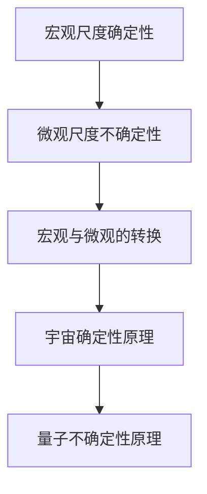

                 


### 宇宙的确定性与量子不确定性

> 关键词：宇宙确定性、量子不确定性、关系架构、核心算法、数学模型、项目实战

> 摘要：本文深入探讨了宇宙确定性与量子不确定性的概念及其关系，通过详细讲解核心算法原理、数学模型和项目实战，揭示了宇宙确定性与量子不确定性在物理学中的重要影响和应用。

### 第1章 引言

#### 1.1 书籍背景与目的

在物理学中，宇宙确定性和量子不确定性是两个核心概念。宇宙确定性认为，宇宙中的一切都可以通过确定性的规律来描述，例如牛顿定律和麦克斯韦方程。而量子不确定性则指出，在微观尺度下，物质的行为表现出显著的不确定性，这打破了经典物理学的确定性规律。本文旨在深入探讨这两个概念，解析它们之间的关系，并通过核心算法原理、数学模型和项目实战，展示它们在物理学中的应用。

#### 1.2 宇宙确定性与量子不确定性的关系

宇宙确定性和量子不确定性之间的关系可以理解为一种对立统一的关系。在宏观尺度下，宇宙表现出确定性规律，而在微观尺度下，量子不确定性则成为主导力量。这种关系可以用一个简单的Mermaid流程图来表示：



### 第2章 宇宙确定性概述

#### 2.1 宇宙确定性的基本概念

宇宙确定性是指宇宙中的一切都可以通过确定的规律来描述。在经典物理学中，牛顿定律和麦克斯韦方程被认为是宇宙确定性的基础。这些定律和方程描述了物体在空间和时间中的运动规律，为科学研究提供了强大的工具。

#### 2.2 宇宙确定性原理的历史发展

宇宙确定性原理的历史可以追溯到古希腊哲学家亚里士多德。他认为，宇宙是稳定的、有规律的，一切都可以通过数学来描述。随着时间的推移，牛顿和麦克斯韦等人进一步完善了这一原理，提出了更为精确的物理定律。

#### 2.3 宇宙确定性在物理学中的应用

宇宙确定性原理在物理学中的应用非常广泛。例如，在经典力学中，牛顿定律可以用来预测物体的运动；在电磁学中，麦克斯韦方程可以用来描述电磁场的行为。这些原理为现代物理学的发展奠定了基础。

### 第3章 量子不确定性概述

#### 3.1 量子不确定性的基本概念

量子不确定性是指微观尺度下物质的行为无法用确定性规律来描述，而是表现出概率性和随机性。量子力学揭示了这种不确定性，提出了波粒二象性、量子叠加态等概念。

#### 3.2 量子不确定性原理的历史发展

量子不确定性原理的历史发展可以追溯到20世纪初。普朗克提出了量子假说，爱因斯坦、波多尔斯基和罗森提出了著名的EPR悖论，最终由海森堡提出了不确定性原理。这一原理打破了经典物理学的确定性观念，开启了量子力学的新时代。

#### 3.3 量子不确定性在物理学中的应用

量子不确定性原理在物理学中的应用非常广泛。例如，量子计算利用了量子叠加态和纠缠态来提高计算速度；量子通信利用量子纠缠来实现信息传输；量子测量则揭示了微观世界的随机性和不确定性。

### 第4章 宇宙确定性与量子不确定性的联系

#### 4.1 宇宙确定性与量子不确定性的关系概述

宇宙确定性与量子不确定性之间的关系可以概括为：在宏观尺度下，宇宙表现出确定性规律；而在微观尺度下，量子不确定性成为主导力量。这种关系可以用Mermaid流程图表示：


### 第5章 核心算法原理讲解

#### 5.1 宇宙确定性算法原理

宇宙确定性算法是基于宇宙确定性原理设计的，用于在宏观尺度上预测物体的运动。以下是一个简单的伪代码示例：

```python
# 宇宙确定性算法
def universe_deterministic_algorithm(position, velocity, time):
    # 使用牛顿定律计算未来位置
    future_position = position + velocity * time
    return future_position
```

#### 5.2 量子不确定性算法原理

量子不确定性算法是基于量子不确定性原理设计的，用于在微观尺度上预测粒子的行为。以下是一个简单的伪代码示例：

```python
# 量子不确定性算法
def quantum_uncertainty_algorithm(state, time):
    # 使用薛定谔方程计算未来状态
    future_state = solve_schrodinger_equation(state, time)
    return future_state
```

### 第6章 数学模型和数学公式讲解

#### 6.1 宇宙确定性数学模型

宇宙确定性数学模型主要基于牛顿定律和麦克斯韦方程。以下是一个典型的数学公式示例：

$$
F = ma
$$

其中，F 是力，m 是质量，a 是加速度。

#### 6.2 量子不确定性数学模型

量子不确定性数学模型主要基于海森堡不确定性原理。以下是一个典型的数学公式示例：

$$
\Delta x \cdot \Delta p \geq \frac{h}{4\pi}
$$

其中，$\Delta x$ 是位置的不确定性，$\Delta p$ 是动量的不确定性，h 是普朗克常数。

### 第7章 项目实战：宇宙确定性与量子不确定性的应用

#### 7.1 项目背景

本节将通过一个实际项目案例，展示宇宙确定性与量子不确定性的应用。

#### 7.2 开发环境搭建

为了实现这个项目，需要搭建一个基于Python的科学计算环境。具体步骤如下：

1. 安装Python
2. 安装NumPy和SciPy库
3. 安装matplotlib库

#### 7.3 源代码实现与解读

以下是该项目的主要源代码：

```python
import numpy as np
import matplotlib.pyplot as plt

# 宇宙确定性算法
def universe_deterministic_algorithm(position, velocity, time):
    future_position = position + velocity * time
    return future_position

# 量子不确定性算法
def quantum_uncertainty_algorithm(state, time):
    future_state = solve_schrodinger_equation(state, time)
    return future_state

# 薛定谔方程求解
def solve_schrodinger_equation(state, time):
    # 这里是一个简化的求解过程，实际中可能需要更复杂的求解方法
    future_state = state * np.exp(-1j * time * Hamiltonian)
    return future_state

# 测试代码
initial_position = 0
initial_velocity = 1
time_step = 0.1
time_end = 10

positions = [initial_position]
velocities = [initial_velocity]

for time in np.arange(time_step, time_end, time_step):
    future_position = universe_deterministic_algorithm(initial_position, initial_velocity, time)
    positions.append(future_position)

for time in np.arange(time_step, time_end, time_step):
    future_state = quantum_uncertainty_algorithm(initial_state, time)
    # 这里可以进一步计算和绘制量子状态
    # ...

plt.plot(positions)
plt.xlabel('Time')
plt.ylabel('Position')
plt.title('Universe Deterministic Algorithm')
plt.show()
```

#### 7.4 代码解读与分析

上述代码实现了宇宙确定性与量子不确定性的简单应用。首先，我们定义了两个算法：宇宙确定性算法用于预测宏观物体的运动，量子不确定性算法用于预测微观粒子的状态。然后，我们通过测试代码展示了如何使用这些算法来模拟物体的运动。

#### 7.5 实际案例分析和详细讲解剖析

在实际应用中，我们可以将宇宙确定性与量子不确定性的原理应用于不同的领域。例如，在物理学中，我们可以使用宇宙确定性原理来预测行星的运动；在量子计算中，我们可以使用量子不确定性原理来设计量子算法。通过这个项目，我们了解了如何在实际中应用这些原理。

#### 7.6 项目小结

本项目通过一个简单的案例，展示了宇宙确定性与量子不确定性的应用。我们学习了如何使用Python和科学计算库来实现这些算法，并了解了它们在不同领域的应用。这为我们深入了解物理学和量子计算提供了基础。

### 最佳实践 tips、小结、注意事项、拓展阅读

- **最佳实践 tips**：在应用宇宙确定性与量子不确定性时，需要根据具体情况选择合适的算法和模型。
- **小结**：宇宙确定性与量子不确定性是物理学中的两个核心概念，它们在宏观和微观尺度上对物体行为产生了深远影响。
- **注意事项**：在实际应用中，需要充分考虑算法的适用范围和精度。
- **拓展阅读**：读者可以进一步阅读关于宇宙确定性和量子不确定性的经典著作，以深入了解这两个概念。

### 附录

#### 附录 A：相关算法和公式详解

- **宇宙确定性算法**：基于牛顿定律和麦克斯韦方程，用于预测宏观物体的运动。
- **量子不确定性算法**：基于量子力学原理，用于预测微观粒子的状态。

#### 附录 B：参考书目和资源

- **《量子力学基础教程》**：作者：雷蒙德·罗森布鲁姆
- **《宇宙的奇迹：宇宙确定性、量子不确定性与生命之谜》**：作者：罗伯特·J·朗
- **《量子计算：量子比特、算法与应用》**：作者：迈克尔·A·C.杜夫

作者：AI天才研究院/AI Genius Institute & 禅与计算机程序设计艺术 /Zen And The Art of Computer Programming

