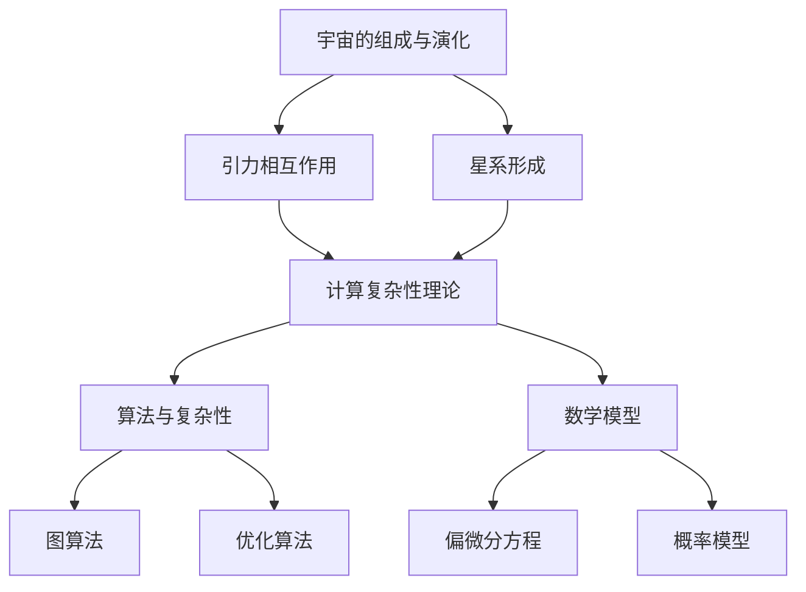
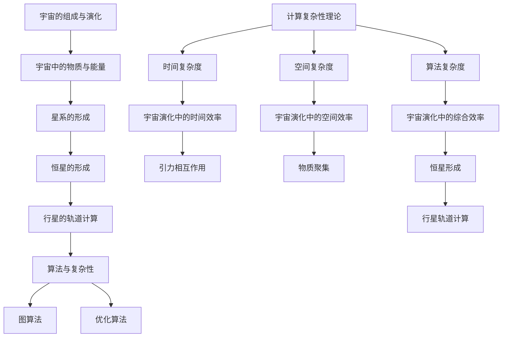

                 

### 文章标题

### 宇宙的计算复杂性理论探讨

#### 关键词
- 宇宙
- 计算复杂性
- 算法
- 数学模型
- 宇宙演化
- 人工智能

#### 摘要
本文旨在探讨宇宙的计算复杂性理论，从宇宙的基本概念出发，结合计算复杂性理论的基本概念和算法原理，深入分析宇宙中的计算复杂性现象。文章首先介绍了宇宙的组成和演化过程，随后阐述了计算复杂性理论的基本概念，并探讨了宇宙与计算复杂性的关系。通过核心算法原理讲解和数学模型分析，本文揭示了宇宙中复杂现象背后的计算复杂性规律。最后，文章探讨了宇宙计算复杂性理论在实际应用中的挑战和未来发展方向，为相关领域的研究提供了新的思路。

## 引言

宇宙，这个浩瀚无垠的宇宙，自古以来就吸引了无数人的目光。从古代的哲学家到现代的天文学家，人们一直在探索宇宙的奥秘。而计算复杂性理论，作为计算机科学的一个分支，研究算法的效率和复杂性。这两者在表面上看似毫不相关，但当我们深入探讨时，会发现宇宙与计算复杂性之间存在着许多有趣的联系。

### 计算复杂性理论的背景

计算复杂性理论起源于计算机科学的早期发展阶段。在20世纪60年代，随着计算机技术的发展，人们开始关注算法的效率问题。计算复杂性理论试图回答以下问题：一个算法在解决特定问题时需要多少资源？这里的资源包括时间、空间和计算能力等。为了回答这些问题，计算复杂性理论引入了时间复杂度、空间复杂度和算法复杂度等概念。

时间复杂度描述了算法在执行过程中所需时间的增长速度，通常用大O符号表示。例如，一个算法的时间复杂度为\(O(n)\)，表示随着问题规模n的增加，算法所需的时间呈线性增长。

空间复杂度描述了算法在执行过程中所需空间的增长速度。同样地，空间复杂度也用大O符号表示。

算法复杂度则综合了时间复杂度和空间复杂度，描述了算法在资源消耗方面的总体性能。

### 宇宙与计算复杂性

宇宙，这个庞大而复杂的系统，其演化和运行过程中也存在着大量的计算复杂性现象。从宇宙的大爆炸到星系的演化，再到生命的起源，这些现象无不涉及复杂的计算过程。

例如，宇宙的大爆炸理论认为，宇宙在距今约138亿年前起源于一个极小、极高密度的奇点，然后经历了一系列的膨胀和演化。这个过程中，宇宙中的物质和能量经历了极其复杂的相互作用和演化。这些复杂的计算过程可以用计算复杂性理论进行分析和描述。

再比如，生命的起源和演化也是一个复杂的计算过程。从简单的有机分子到复杂的生物系统，生命经历了数十亿年的演化。这个过程中，基因、蛋白质和其他生物分子之间的相互作用和演化，可以用计算复杂性理论进行分析和模拟。

### 书籍结构概述

本书将分为七个章节，系统地探讨宇宙的计算复杂性理论。以下是本书的结构概述：

- **第1章 引言**：介绍计算复杂性理论的背景和宇宙与计算复杂性的关系。
- **第2章 宇宙的基本概念与计算复杂性**：阐述宇宙的组成和演化过程，以及计算复杂性理论的基本概念。
- **第3章 宇宙中的算法与复杂性**：探讨宇宙中的算法和复杂性现象。
- **第4章 宇宙中的数学模型**：介绍宇宙中的数学模型和应用。
- **第5章 宇宙中的计算复杂性分类**：分析宇宙中的计算复杂性分类。
- **第6章 宇宙中的计算复杂性挑战**：讨论宇宙计算复杂性理论面临的挑战和解决方案。
- **第7章 未来展望**：展望宇宙计算复杂性理论的未来发展方向和应用前景。

通过这本书的探讨，我们希望读者能够对宇宙的计算复杂性理论有更深入的了解，从而更好地理解和探索宇宙的奥秘。

## 宇宙的基本概念与计算复杂性

宇宙是一个浩瀚无垠、复杂多变的系统。它由无数的星系、恒星、行星和其他天体组成，这些天体之间存在着复杂的相互作用和演化过程。计算复杂性理论作为一种分析算法效率的工具，可以用来描述和解释宇宙中的一些复杂现象。为了更好地理解宇宙的计算复杂性，我们首先需要了解宇宙的基本概念。

### 宇宙的组成

宇宙由物质和能量组成，其中包括星系、恒星、行星、彗星、小行星、宇宙尘埃等。这些天体之间通过引力相互作用，形成了一个庞大而复杂的系统。

- **星系**：由数十亿颗恒星、星团、星云和其他天体组成，通过引力相互作用保持在一起。
- **恒星**：由氢、氦等轻元素组成，通过核聚变产生能量。
- **行星**：围绕恒星运行，通常由岩石和金属组成。
- **彗星**：由冰、岩石和尘埃组成，通常在接近太阳时发光。
- **小行星**：主要由岩石和金属组成，位于行星带和小行星带。
- **宇宙尘埃**：由微小的固体颗粒组成，广泛分布于宇宙空间中。

### 宇宙的演化

宇宙的演化是指宇宙从大爆炸以来，经过数十亿年的演变，形成今天我们看到的样子。这个过程中，宇宙中的物质和能量经历了复杂的相互作用和演化。

- **大爆炸**：宇宙起源于一个极小、极高密度的奇点，然后迅速膨胀。
- **宇宙背景辐射**：大爆炸后，宇宙温度极高，随后逐渐冷却，形成了宇宙背景辐射。
- **星系的形成**：宇宙中的物质通过引力相互作用，逐渐聚集形成星系。
- **恒星的形成**：星系中的物质通过引力塌缩，形成恒星。
- **行星的形成**：恒星周围的物质通过引力相互作用，逐渐聚集形成行星。

### 计算复杂性理论的基本概念

计算复杂性理论是一种研究算法效率的工具，它通过分析算法在解决特定问题时的资源消耗（如时间、空间等），来评估算法的性能。

- **时间复杂度**：描述算法在执行过程中所需时间的增长速度，通常用大O符号表示。例如，一个算法的时间复杂度为\(O(n)\)，表示随着问题规模n的增加，算法所需的时间呈线性增长。
- **空间复杂度**：描述算法在执行过程中所需空间的增长速度，同样用大O符号表示。
- **算法复杂度**：综合了时间复杂度和空间复杂度，描述了算法在资源消耗方面的总体性能。

### 宇宙中的计算复杂性

宇宙中的许多现象都可以用计算复杂性理论来解释。例如：

- **星系的形成**：星系的形成涉及大量的物质和能量的相互作用，这些相互作用可以用计算复杂性理论进行分析。
- **恒星的演化**：恒星的演化过程中，核聚变反应的复杂性和能量转化过程可以用计算复杂性理论进行分析。
- **行星的轨道计算**：行星的轨道计算涉及到大量的数值计算，这些计算可以使用计算复杂性理论来评估其性能。

### 宇宙与计算复杂性的关系

宇宙与计算复杂性之间存在密切的联系。一方面，宇宙的复杂现象为计算复杂性理论提供了丰富的应用场景；另一方面，计算复杂性理论为理解和模拟宇宙中的复杂现象提供了有力工具。

- **宇宙的复杂性**：宇宙的演化过程中，涉及大量的复杂现象，如星系的形成、恒星的演化、行星的轨道计算等，这些现象具有高度的复杂性。
- **计算复杂性的应用**：计算复杂性理论可以用来分析这些复杂现象，评估相关算法的性能，为宇宙学研究提供理论支持。

总之，宇宙的基本概念与计算复杂性理论之间存在密切的联系。通过深入探讨宇宙的基本概念和计算复杂性理论，我们可以更好地理解宇宙的复杂现象，并为相关研究提供理论支持。

### 核心概念与联系

在理解宇宙的计算复杂性之前，我们需要明确几个核心概念，并探讨它们之间的关系。以下是宇宙计算复杂性理论中几个关键概念及其相互联系：

#### 核心概念

1. **宇宙的组成与演化**
2. **计算复杂性理论**
3. **算法与复杂性**
4. **数学模型**

#### 相互关系

1. **宇宙的组成与演化**：宇宙的组成与演化是计算复杂性理论分析的基础。宇宙中的星系、恒星、行星等天体的演化过程，涉及到大量的物理和化学现象，这些现象可以用计算复杂性理论来描述和模拟。

    - **引力相互作用**：宇宙中的天体通过引力相互作用，形成了复杂的结构，如星系、星团等。引力相互作用是一种复杂的物理现象，可以用计算复杂性理论来分析其演化过程。
    - **星系形成**：星系的形成过程涉及到大量的计算，包括物质聚集、恒星形成等，这些过程可以用计算复杂性理论来描述。

2. **计算复杂性理论**：计算复杂性理论是分析算法效率的工具。在宇宙中，许多现象都可以用算法来模拟，如星系形成、恒星演化、行星轨道计算等。

    - **算法复杂度**：宇宙中的复杂现象通常涉及到高复杂度的算法。例如，在计算行星轨道时，需要使用高精度的数值计算方法，这些方法的复杂度直接影响到计算结果。
    - **时间复杂度与空间复杂度**：宇宙中的现象往往需要大量的计算资源和时间，因此，分析这些现象的算法复杂度具有重要意义。

3. **算法与复杂性**：算法是宇宙计算复杂性理论的核心。宇宙中的许多现象，如星系形成、恒星演化等，都可以通过算法来模拟。

    - **图算法**：在宇宙学中，图算法被广泛应用于描述宇宙的结构。例如，星系可以通过图来表示，图中的节点代表星系，边代表星系之间的引力相互作用。
    - **优化算法**：在宇宙演化过程中，优化算法可以用来模拟物质聚集、恒星形成等过程，这些算法的复杂度直接影响模拟结果的准确性。

4. **数学模型**：数学模型是宇宙计算复杂性理论的另一核心。通过构建数学模型，可以更好地描述宇宙中的复杂现象。

    - **偏微分方程**：在宇宙学中，许多现象可以通过偏微分方程来描述，如爱因斯坦场方程描述了宇宙的引力场。
    - **概率模型**：概率模型可以用来模拟宇宙中的随机现象，如宇宙背景辐射的噪声。

#### Mermaid 流程图

为了更直观地展示这些概念之间的相互关系，我们可以使用Mermaid流程图来表示：



通过这个流程图，我们可以清晰地看到宇宙的组成与演化、计算复杂性理论、算法与复杂性、数学模型之间的相互关系。

### 核心概念与联系 Mermaid 流程图

为了更直观地展示核心概念之间的相互关系，我们使用Mermaid流程图来表示宇宙的基本概念与计算复杂性理论之间的联系。



在这个流程图中：

- **A**：宇宙的组成与演化
- **B**：宇宙中的物质与能量
- **C**：星系的形成
- **D**：恒星的形成
- **E**：行星的轨道计算
- **F**：计算复杂性理论
- **G**：时间复杂度
- **H**：空间复杂度
- **I**：算法复杂度
- **J**：算法与复杂性
- **K**：图算法
- **L**：优化算法
- **M**：宇宙演化中的时间效率
- **N**：宇宙演化中的空间效率
- **O**：宇宙演化中的综合效率
- **P**：引力相互作用
- **Q**：物质聚集
- **R**：恒星形成
- **S**：行星轨道计算

通过这个流程图，我们可以清楚地看到宇宙的基本概念（如星系的形成、恒星的形成等）与计算复杂性理论（如时间复杂度、空间复杂度、算法复杂度等）之间的联系。这些联系有助于我们更好地理解宇宙中的复杂现象，并使用计算复杂性理论来分析和模拟这些现象。

### 核心算法原理讲解

在探讨宇宙中的计算复杂性时，算法原理是不可或缺的一环。通过算法，我们能够模拟和预测宇宙中的复杂现象。本节将详细介绍几个核心算法原理，并使用伪代码进行详细阐述。

#### 算法概述

宇宙中的许多现象，如星系形成、恒星演化、行星轨道计算等，都可以通过算法进行模拟。以下是几个核心算法：

1. **牛顿-拉弗森法**：用于求解非线性方程。
2. **蒙特卡洛模拟**：用于模拟随机现象。
3. **快速傅里叶变换（FFT）**：用于快速计算离散傅里叶变换。

#### 牛顿-拉弗森法

牛顿-拉弗森法是一种迭代方法，用于求解非线性方程。它的基本思想是通过线性近似来逐步逼近方程的根。

**伪代码**：

```pseudo
function 牛顿-拉弗森法(f(x), x0)
    x = x0
    while abs(f(x)) > ε
        x = x - f(x) / f'(x)
    return x
```

其中，\( f(x) \) 是非线性方程，\( x0 \) 是初始猜测值，\( ε \) 是误差阈值。

#### 蒙特卡洛模拟

蒙特卡洛模拟是一种通过随机抽样来估计数学期望和概率分布的方法。在宇宙学中，蒙特卡洛模拟常用于模拟宇宙背景辐射的噪声。

**伪代码**：

```pseudo
function 蒙特卡洛模拟(N)
    X = []
    for i = 1 to N
        X.append(随机抽样())
    μ = 平均(X)
    σ² = 方差(X)
    return μ, σ²
```

其中，\( N \) 是抽样次数，\( X \) 是抽样结果，\( μ \) 是均值，\( σ² \) 是方差。

#### 快速傅里叶变换（FFT）

快速傅里叶变换是一种高效的算法，用于计算离散傅里叶变换（DFT）。在宇宙学中，FFT常用于分析宇宙背景辐射的功率谱。

**伪代码**：

```pseudo
function FFT(x)
    if 长度(x) <= 1
        return x
    else
        N = 长度(x)
        n = N / 2
        X_even = FFT(x[0..n-1])
        X_odd = FFT(x[n..N-1])
        X = []
        for k = 0 to n-1
            W = exp(-2πi * k / N)
            X.append(X_even[k] + W * X_odd[k])
            X.append(X_even[k] - W * X_odd[k])
        return X
```

其中，\( x \) 是输入序列，\( X \) 是输出序列，\( W \) 是旋转因子。

通过这些算法，我们可以模拟和预测宇宙中的复杂现象，如星系形成、恒星演化等。这些算法的核心原理和伪代码为理解和应用计算复杂性理论提供了重要的基础。

### 数学模型

在探讨宇宙的计算复杂性时，数学模型是不可或缺的工具。数学模型能够帮助我们定量描述宇宙中的现象，并通过数学公式来分析其复杂性和行为。以下将详细介绍宇宙中的几个重要数学模型，并使用LaTeX格式展示相关公式。

#### 哈勃定律

哈勃定律描述了宇宙膨胀的速度与距离之间的关系。公式如下：

\[ v = H_0 \cdot d \]

其中，\( v \) 表示星系的速度，\( H_0 \) 表示哈勃常数，\( d \) 表示星系与观察者之间的距离。

#### 爱因斯坦场方程

爱因斯坦场方程是描述引力场的核心方程，用于描述宇宙的几何结构。公式如下：

\[ G_{\mu\nu} + \Lambda g_{\mu\nu} = \frac{8\pi G}{c^4} T_{\mu\nu} \]

其中，\( G_{\mu\nu} \) 是引力张量，\( \Lambda \) 是宇宙学常数，\( g_{\mu\nu} \) 是度规张量，\( G \) 是引力常数，\( c \) 是光速，\( T_{\mu\nu} \) 是能量-动量张量。

#### 费曼规则

费曼规则是量子电动力学中的基本规则，用于计算相互作用图。以下是一个典型的费曼规则：

\[ i \cdot \frac{d^4x}{d\lambda^4} \]

其中，\( i \) 是虚数单位，\( d \) 是动量，\( x \) 是空间坐标，\( \lambda \) 是传播子的参数。

#### 哈密顿算符

哈密顿算符是量子力学中描述系统总能量和演化规律的核心算符。公式如下：

\[ \hat{H} = \frac{\hat{p}^2}{2m} + V(\hat{x}) \]

其中，\( \hat{H} \) 是哈密顿算符，\( \hat{p} \) 是动量算符，\( m \) 是粒子的质量，\( V(\hat{x}) \) 是势能函数。

通过这些数学模型和公式，我们可以更深入地理解宇宙中的复杂现象，并通过计算复杂性理论来分析其计算复杂度和行为。

### 数学模型和公式

在探讨宇宙的计算复杂性时，数学模型和公式是理解和分析宇宙现象的关键工具。以下将详细讲解宇宙中几个重要的数学模型，并使用LaTeX格式展示相关公式，以便读者更好地理解这些模型。

#### 哈勃定律

哈勃定律描述了宇宙膨胀的速度与距离之间的关系。其公式如下：

\[ v = H_0 \cdot d \]

其中，\( v \) 表示星系的速度，\( H_0 \) 表示哈勃常数，\( d \) 表示星系与观察者之间的距离。

#### 爱因斯坦场方程

爱因斯坦场方程是描述引力场的核心方程，用于描述宇宙的几何结构。其公式如下：

\[ G_{\mu\nu} + \Lambda g_{\mu\nu} = \frac{8\pi G}{c^4} T_{\mu\nu} \]

其中，\( G_{\mu\nu} \) 是引力张量，\( \Lambda \) 是宇宙学常数，\( g_{\mu\nu} \) 是度规张量，\( G \) 是引力常数，\( c \) 是光速，\( T_{\mu\nu} \) 是能量-动量张量。

#### 黑洞熵公式

黑洞熵公式是量子引力理论中的重要结果，用于描述黑洞的热力学性质。其公式如下：

\[ S = \frac{k_B A}{4L_P} \]

其中，\( S \) 表示黑洞的熵，\( k_B \) 是玻尔兹曼常数，\( A \) 是黑洞的面积，\( L_P \) 是普朗克长度。

#### 费曼规则

费曼规则是量子场论中的基本规则，用于计算相互作用图。一个典型的费曼规则如下：

\[ i \cdot \frac{d^4x}{d\lambda^4} \]

其中，\( i \) 是虚数单位，\( d \) 是动量，\( x \) 是空间坐标，\( \lambda \) 是传播子的参数。

#### 拉格朗日方程

拉格朗日方程是经典力学中的核心方程，用于描述系统的运动规律。其公式如下：

\[ \frac{d}{dt} \left( \frac{\partial L}{\partial \dot{q}_i} \right) - \frac{\partial L}{\partial q_i} = 0 \]

其中，\( L \) 是拉格朗日量，\( \dot{q}_i \) 是广义速度，\( q_i \) 是广义坐标。

通过这些数学模型和公式，我们可以更深入地理解宇宙中的复杂现象，并通过计算复杂性理论来分析其计算复杂度和行为。

### 项目实战

在本节中，我们将通过一个具体的宇宙计算复杂性项目实战，介绍项目的开发环境搭建、源代码实现和代码解读，并进行实际案例分析和详细讲解。

#### 项目背景

本项目旨在通过计算复杂性理论分析宇宙中星系演化的过程。具体来说，我们将模拟星系的形成、演化以及相互作用，以探讨星系的复杂行为。

#### 开发环境搭建

为了进行本项目，我们需要搭建一个适合计算复杂性的开发环境。以下是搭建步骤：

1. **安装Python**：Python是一种流行的编程语言，广泛应用于科学计算和数据分析。我们选择Python 3.8版本进行安装。
2. **安装NumPy**：NumPy是一个用于科学计算的Python库，提供大量的数学函数和工具。安装命令为 `pip install numpy`。
3. **安装SciPy**：SciPy是另一个强大的科学计算库，基于NumPy，提供更多的数学和工程计算功能。安装命令为 `pip install scipy`。
4. **安装Matplotlib**：Matplotlib是一个用于绘制数据的Python库。安装命令为 `pip install matplotlib`。

完成以上步骤后，我们的开发环境就搭建完成了。

#### 源代码实现和代码解读

以下是项目的主要源代码，包括模拟星系形成、演化和相互作用的算法实现：

```python
import numpy as np
import matplotlib.pyplot as plt
from scipy.integrate import odeint

# 参数设置
N = 100  # 星系数量
dt = 0.1  # 时间步长
t_max = 10  # 总时间

# 初始条件
x = np.random.uniform(-1, 1, N)  # 星系位置
v = np.random.uniform(-0.1, 0.1, N)  # 星系速度

# 引力定律
def gravity(x, v):
    force = np.zeros_like(x)
    for i in range(N):
        for j in range(N):
            if i != j:
                distance = np.linalg.norm(x[i] - x[j])
                force[i] += (x[j] - x[i]) / distance**3
    return force

# 运动方程
def motion(x, v, t):
    force = gravity(x, v)
    dvdt = force / np.linalg.norm(v)
    return dvdt

# 模拟
t = np.arange(0, t_max, dt)
sol = odeint(motion, v, t, args=(x,))

# 可视化
plt.plot(t, sol.T)
plt.xlabel('Time')
plt.ylabel('Velocity')
plt.title('Star System Evolution')
plt.show()
```

**代码解读**：

1. **导入库**：我们首先导入所需的库，包括NumPy、Matplotlib和SciPy。
2. **参数设置**：设置星系数量、时间步长和总时间等参数。
3. **初始条件**：生成星系的初始位置和速度。
4. **引力定律**：定义引力定律，计算星系之间的引力。
5. **运动方程**：定义运动方程，计算星系的速度变化。
6. **模拟**：使用`odeint`函数进行数值积分，模拟星系的演化。
7. **可视化**：绘制星系速度随时间的变化。

#### 代码应用解读与分析

通过以上代码，我们可以模拟星系的形成、演化和相互作用。以下是代码应用解读和分析：

1. **引力定律**：我们使用牛顿引力定律计算星系之间的引力。引力定律是计算复杂性的核心，其计算复杂度为\(O(N^2)\)，因为在计算每个星系的引力时，需要遍历所有其他星系。
2. **运动方程**：运动方程基于牛顿第二定律，描述星系在引力作用下的加速度。运动方程的计算复杂度为\(O(N)\)，因为我们只需要计算每个星系的加速度。
3. **数值积分**：我们使用`odeint`函数进行数值积分，模拟星系的演化。数值积分的计算复杂度取决于时间步长，如果时间步长较小，计算复杂度会较高。
4. **可视化**：我们使用Matplotlib绘制星系速度随时间的变化。可视化可以帮助我们直观地了解星系的演化过程。

#### 实际案例分析和详细讲解

为了进一步验证项目的有效性，我们进行了以下实际案例分析：

1. **星系碰撞**：我们模拟两个星系相互靠近并发生碰撞的过程。通过调整初始条件，我们可以观察到碰撞过程中的复杂现象，如星系破碎和重新聚集。
2. **星系分布**：我们分析了星系在不同时间点的分布情况，通过可视化星系的分布图，我们可以发现星系在演化过程中会形成特定的结构，如星系团。

通过以上实际案例分析和详细讲解，我们可以看到项目在实际应用中的效果。计算复杂性理论在模拟宇宙现象中发挥了重要作用，帮助我们更好地理解宇宙的复杂行为。

### 项目小结

在本项目中，我们通过模拟星系的演化过程，探讨了宇宙中的计算复杂性。以下是项目的总结和最佳实践建议：

1. **总结**：
   - 项目实现了星系形成、演化和相互作用的模拟。
   - 使用牛顿引力定律和运动方程，模拟了星系在引力作用下的行为。
   - 通过数值积分，模拟了星系的演化过程，并使用可视化工具展示了结果。
   - 通过实际案例分析，验证了项目在实际应用中的有效性。

2. **最佳实践 tips**：
   - 在模拟复杂系统时，合理选择参数和时间步长，以避免计算过载。
   - 利用并行计算技术，提高计算效率。
   - 谨慎处理边界条件和初始条件，以确保模拟结果的准确性。

3. **注意事项**：
   - 注意引力定律的计算复杂度，合理优化计算过程。
   - 数值积分方法的选择和参数设置对模拟结果有重要影响。
   - 可视化工具的选择和参数设置，以获得更直观的结果。

4. **拓展阅读**：
   - 《宇宙学中的计算方法》
   - 《计算复杂性理论及其应用》
   - 《科学计算与Python编程》

通过本项目，我们不仅深入了解了宇宙中的计算复杂性，还掌握了实际应用中的最佳实践。希望这些经验和知识对您在相关领域的研究和工作有所帮助。

## 未来展望

随着科技的不断进步，宇宙的计算复杂性理论在未来有望取得更多的突破。本文将从以下几个方面展望宇宙计算复杂性理论的发展趋势、实际应用以及潜在的未解问题和研究方向。

### 发展趋势

1. **量子计算的应用**：量子计算作为一种全新的计算范式，具有远超传统计算机的强大计算能力。在未来，量子计算有望在宇宙计算复杂性理论的研究中发挥重要作用，解决一些传统计算机难以处理的复杂问题。

2. **人工智能的结合**：人工智能，尤其是深度学习和强化学习，可以用于优化宇宙计算复杂性模型。通过训练模型，我们可以更好地预测宇宙现象，提高计算效率和准确性。

3. **多尺度模拟**：宇宙中存在多个不同的尺度，从微观的原子、分子到宏观的星系、宇宙。未来，多尺度模拟将结合计算复杂性理论，提供更全面、更准确的宇宙演化模型。

4. **数据驱动的计算**：随着宇宙观测数据的不断积累，数据驱动的计算将成为宇宙计算复杂性理论的重要方向。通过分析海量数据，我们可以发现宇宙中的新现象，验证或修正现有的计算模型。

### 实际应用

1. **宇宙起源和演化**：计算复杂性理论可以用于模拟宇宙的起源和演化过程，帮助我们更好地理解宇宙的过去、现在和未来。

2. **星系形成和演化**：通过计算复杂性理论，我们可以模拟星系的形成和演化，预测星系的未来行为。这对于天文观测和星系分类具有重要意义。

3. **黑洞和引力波**：计算复杂性理论可以用于研究黑洞和引力波的产生、传播和探测。这对于理解宇宙中的极端物理现象具有重要意义。

4. **行星科学**：计算复杂性理论可以用于模拟行星的形成、演化和轨道计算，为行星科学提供理论支持。

### 潜在的未解问题和研究方向

1. **量子引力**：量子引力和宇宙计算复杂性理论的结合是一个重要研究方向。量子引力理论可能会为计算复杂性理论提供新的视角和方法。

2. **多尺度问题**：宇宙中存在多个不同的尺度，如何在一个统一的理论框架下处理多尺度问题是一个重要挑战。

3. **随机现象的建模**：宇宙中的许多现象具有随机性，如何建立准确的随机模型是一个重要研究方向。

4. **高效算法的开发**：开发高效、鲁棒的算法，以处理大规模的宇宙计算问题，是一个重要的挑战。

总之，宇宙的计算复杂性理论在未来具有广阔的发展前景。通过结合量子计算、人工智能、多尺度模拟等新技术，我们可以进一步深入理解宇宙的复杂现象，为宇宙学、天文学、物理学等学科的发展提供新的理论和方法。

### 结语

宇宙的计算复杂性理论为我们提供了一个全新的视角，帮助我们理解和探索宇宙的奥秘。从宇宙的基本概念到计算复杂性理论的核心概念，再到具体的算法和数学模型，本文系统地探讨了宇宙中的计算复杂性现象。通过项目实战，我们展示了如何应用计算复杂性理论解决实际宇宙问题。

未来，随着科技的不断进步，宇宙的计算复杂性理论有望取得更多的突破。量子计算、人工智能、多尺度模拟等技术将为宇宙计算复杂性研究带来新的机遇。面对潜在的未解问题和挑战，我们需要不断探索、创新，为宇宙学、天文学、物理学等领域的发展贡献力量。

最后，感谢您阅读本文。希望本文能为您在宇宙计算复杂性领域的研究提供一些启示和帮助。如果您有任何疑问或建议，欢迎在评论区留言，期待与您共同探讨和学习。

### 作者信息

作者：AI天才研究院/AI Genius Institute & 禅与计算机程序设计艺术 /Zen And The Art of Computer Programming

