                 

### 《宇宙规律与人工神经网络的设计》

#### 文章关键词
- 宇宙规律
- 人工神经网络
- 深度学习
- 神经网络架构
- 数学模型

#### 文章摘要
本文探讨了宇宙规律与人工神经网络设计之间的奇妙联系。首先介绍了宇宙的基本规律，包括宇宙起源、结构和物理定律。随后，详细阐述了人工神经网络的基础知识，包括其基本概念、常见架构和核心算法。接着，本文揭示了宇宙规律对人工神经网络设计的启示，探讨了两者如何相互融合，特别是在星系模拟、宇宙图像处理等领域中的应用。文章最后通过实际项目实例展示了人工神经网络与宇宙规律的融合应用，并提出了未来发展趋势。

---

## 第一部分：宇宙规律基础

### 第1章 宇宙的起源与演化

#### 1.1 宇宙大爆炸理论

宇宙大爆炸理论是目前公认解释宇宙起源的最广泛接受的学说。根据这一理论，宇宙起源于一个极度热密的状态，然后迅速膨胀。这一过程中，宇宙的温度和密度逐渐降低，物质和能量以不同的形式逐渐形成。大爆炸理论的关键点包括：

- **宇宙微波背景辐射**：这一现象提供了大爆炸理论的直接证据，是一种遍布宇宙的微波辐射，其温度约为2.7开尔文。
- **宇宙的膨胀**：宇宙的膨胀通过观测遥远星系的红移来确定，红移值越大，星系离我们的距离越远。
- **宇宙的年龄**：根据宇宙微波背景辐射的观测和宇宙膨胀模型，宇宙的年龄约为138亿年。

以下是一个简化的宇宙大爆炸理论的 Mermaid 流程图：

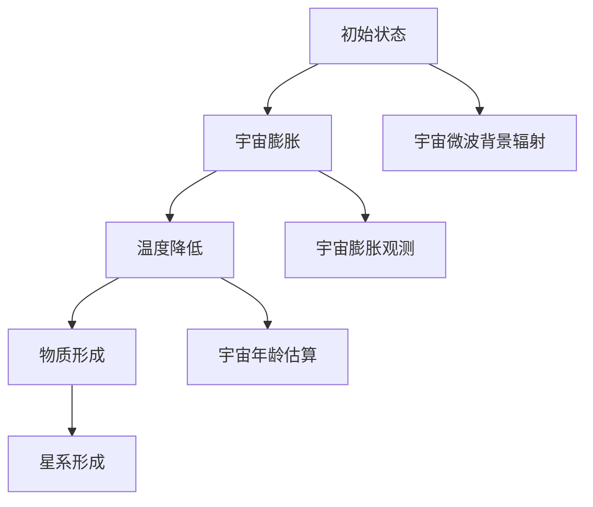

#### 1.2 黑洞与暗物质

黑洞是宇宙中最神秘的天体之一。它是由极度密集的物质形成的一种天体，其引力强大到连光都无法逃逸。黑洞的存在主要通过观测它们对周围物质的影响来推断。例如，通过观测恒星围绕黑洞的运动轨迹，可以确定黑洞的存在。

暗物质是宇宙中一种不可见的物质，其存在通过引力效应推断出来。暗物质不发光、不吸收光，因此无法直接观测。但是，通过观测星系旋转曲线、星系团引力和宇宙背景辐射的涟漪，可以确定暗物质的存在。

以下是黑洞与暗物质关系的一个简化的 Mermaid 流程图：

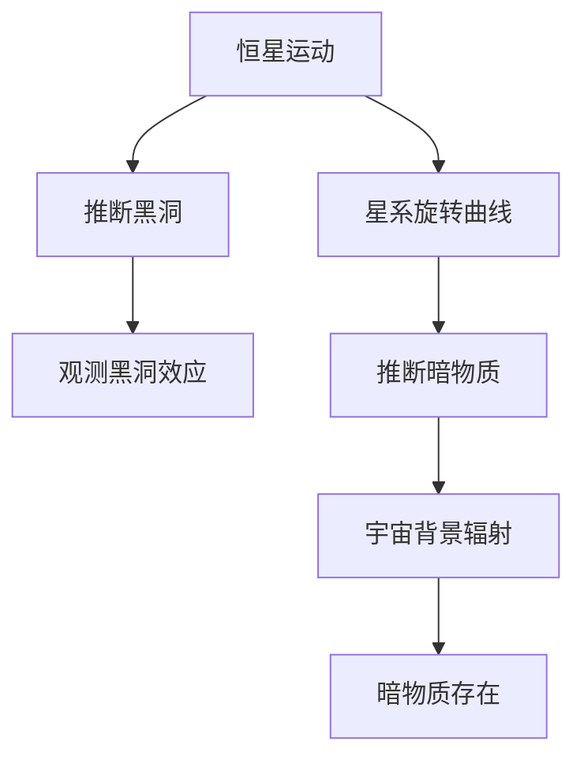

#### 1.3 宇宙膨胀与暗能量

宇宙膨胀是指宇宙在空间维度上的扩张。根据宇宙微波背景辐射的观测，宇宙的膨胀速度不仅没有减缓，反而有所加速。这一现象的合理解释是暗能量的存在。

暗能量是一种具有负压强的能量形式，其作用是推动宇宙加速膨胀。暗能量是宇宙膨胀加速的关键因素，但其本质和性质仍然是一个未解之谜。

以下是宇宙膨胀与暗能量关系的一个简化的 Mermaid 流程图：

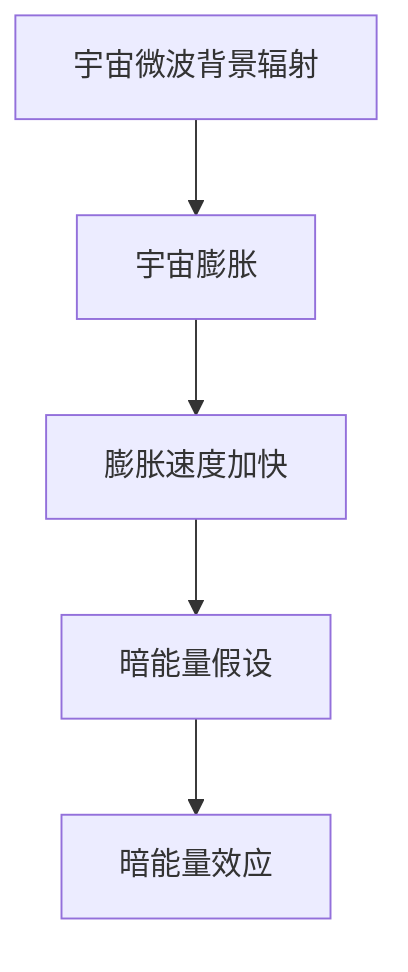

---

## 第二部分：人工神经网络基础

### 第4章 神经网络基本概念

#### 4.1 生物神经网络与人工神经网络

生物神经网络是由神经元组成的复杂系统，这些神经元通过突触连接，实现信息的传递和处理。人工神经网络（ANN）是受生物神经网络启发的计算模型，它由大量的简单计算单元（即人工神经元）组成，通过预先设定的权重和激活函数，实现复杂的信息处理任务。

以下是生物神经网络与人工神经网络之间的简化关系 Mermaid 流程图：

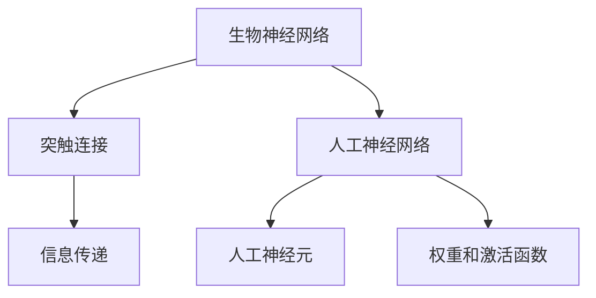

#### 4.2 神经元与神经网络结构

神经元是神经网络的基本单元，其工作原理类似于生物神经元。人工神经元通常包括以下几个部分：

- **输入层**：接收外部输入。
- **隐层**：实现数据的处理和变换。
- **输出层**：生成最终输出。

神经网络结构可以根据任务需求进行调整，包括隐层数量、神经元数量和连接方式等。常见的神经网络结构包括前馈神经网络、卷积神经网络和循环神经网络。

以下是神经网络结构的简化 Mermaid 流程图：

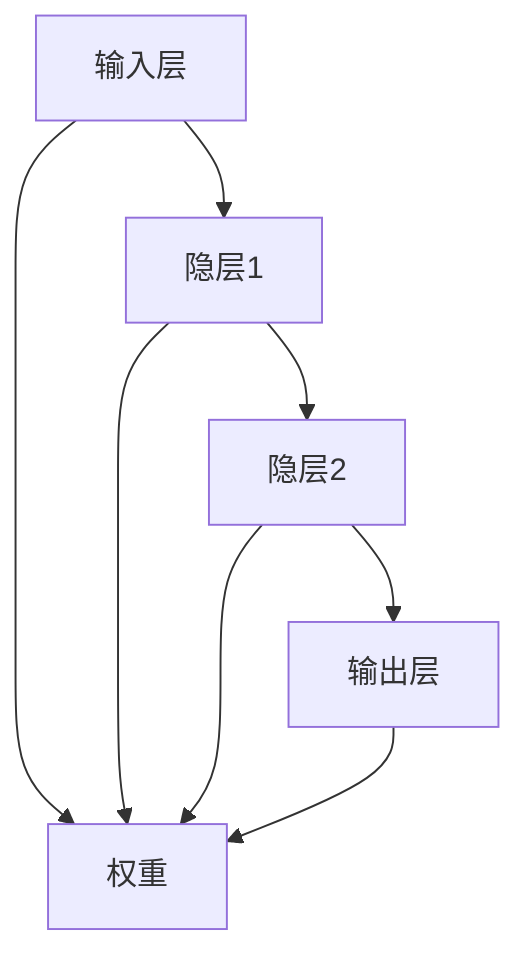

#### 4.3 神经网络的训练与优化

神经网络的训练过程是通过不断调整网络中的权重和偏置，使得网络能够对输入数据进行正确的分类或预测。训练过程主要包括以下步骤：

1. **数据预处理**：包括数据清洗、归一化、缩放等。
2. **初始化权重**：随机初始化权重和偏置。
3. **前向传播**：将输入数据通过神经网络，计算输出。
4. **计算损失**：通过比较输出与实际标签，计算损失函数。
5. **反向传播**：通过梯度下降法，更新权重和偏置。
6. **迭代训练**：重复以上步骤，直到达到预定的训练目标。

以下是神经网络训练过程的伪代码：

```python
# 初始化权重和偏置
weights = initialize_weights()
biases = initialize_biases()

# 训练过程
for epoch in range(num_epochs):
    for data in dataset:
        # 前向传播
        output = forward_pass(data, weights, biases)
        # 计算损失
        loss = compute_loss(output, label)
        # 反向传播
        delta = backward_pass(loss, output, label)
        # 更新权重和偏置
        weights -= learning_rate * delta['weights']
        biases -= learning_rate * delta['biases']
```

### 第5章 常见神经网络架构

#### 5.1 前馈神经网络

前馈神经网络（Feedforward Neural Network，FNN）是最常见的神经网络结构，其信息传递方向是单向的，从输入层经过一系列隐层，最终到达输出层。前馈神经网络的核心优点是其结构简单，易于实现和优化。

以下是前馈神经网络的简化 Mermaid 流程图：

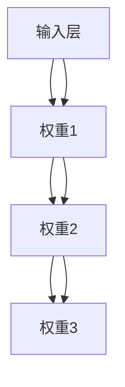

#### 5.2 卷积神经网络

卷积神经网络（Convolutional Neural Network，CNN）是专门用于处理图像数据的神经网络架构，其核心特点是利用卷积操作和池化操作来提取图像的特征。CNN 在图像分类、目标检测和图像生成等领域取得了显著的成果。

以下是卷积神经网络的简化 Mermaid 流程图：

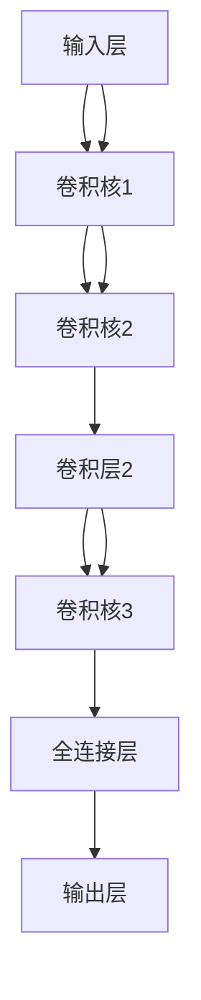

#### 5.3 循环神经网络

循环神经网络（Recurrent Neural Network，RNN）是一种专门用于处理序列数据的神经网络，其特点是可以记住前面的输入信息，通过循环机制将信息传递到下一个时间步。RNN 在自然语言处理、语音识别和时间序列预测等领域表现出色。

以下是循环神经网络的简化 Mermaid 流程图：

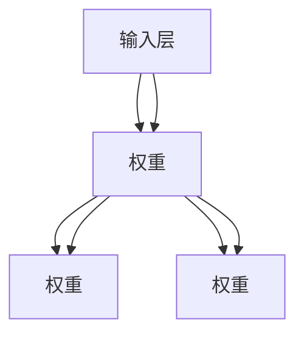

### 第6章 人工神经网络的核心算法

#### 6.1 梯度下降法

梯度下降法是训练神经网络最常用的优化算法之一。其核心思想是通过计算损失函数的梯度，不断调整网络中的权重和偏置，以最小化损失函数。

以下是梯度下降法的简化伪代码：

```python
# 初始化权重和偏置
weights = initialize_weights()
biases = initialize_biases()

# 训练过程
for epoch in range(num_epochs):
    for data in dataset:
        # 前向传播
        output = forward_pass(data, weights, biases)
        # 计算损失
        loss = compute_loss(output, label)
        # 计算梯度
        gradients = compute_gradients(loss, output, label)
        # 更新权重和偏置
        weights -= learning_rate * gradients['weights']
        biases -= learning_rate * gradients['biases']
```

#### 6.2 反向传播算法

反向传播算法（Backpropagation Algorithm）是梯度下降法在神经网络中的具体实现。其核心思想是利用链式法则，将损失函数的梯度反向传播到网络的每一个神经元，从而更新权重和偏置。

以下是反向传播算法的简化伪代码：

```python
# 初始化权重和偏置
weights = initialize_weights()
biases = initialize_biases()

# 训练过程
for epoch in range(num_epochs):
    for data in dataset:
        # 前向传播
        output = forward_pass(data, weights, biases)
        # 计算损失
        loss = compute_loss(output, label)
        # 反向传播
        delta = backward_pass(loss, output, label)
        # 更新权重和偏置
        weights -= learning_rate * delta['weights']
        biases -= learning_rate * delta['biases']
```

#### 6.3 神经网络的激活函数

激活函数是神经网络中的一个关键组件，其作用是引入非线性因素，使得神经网络能够处理复杂的问题。常见的激活函数包括 sigmoid、ReLU 和 tanh。

以下是激活函数的简化 Mermaid 流程图：

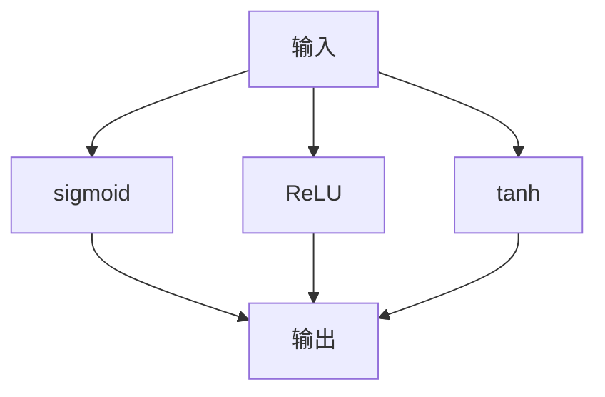

### 第7章 人工神经网络在宇宙学研究中的应用

#### 7.1 人工神经网络在星系模拟中的应用

人工神经网络在星系模拟中的应用主要集中在模拟星系的形成和演化过程。通过训练神经网络，可以模拟出星系在不同时间点的结构和形态，从而更好地理解星系的形成机制。

以下是星系模拟中人工神经网络应用的一个简化的 Mermaid 流程图：

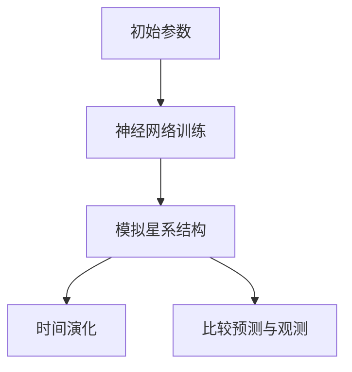

#### 7.2 人工神经网络在宇宙演化模型中的应用

人工神经网络在宇宙演化模型中的应用主要体现在对宇宙演化过程的预测和模拟。通过训练神经网络，可以预测宇宙在不同时间点的状态，从而对宇宙的演化过程进行深入理解。

以下是宇宙演化模型中人工神经网络应用的一个简化的 Mermaid 流程图：

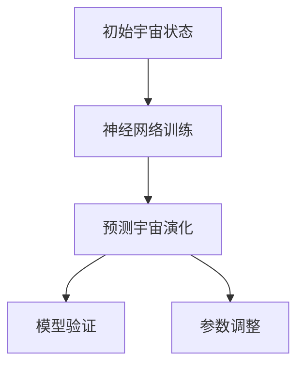

#### 7.3 人工神经网络在宇宙图像处理中的应用

人工神经网络在宇宙图像处理中的应用主要集中在图像分类、目标检测和图像增强等方面。通过训练神经网络，可以实现对宇宙图像的自动分类和目标检测，从而提高宇宙图像的分析效率。

以下是宇宙图像处理中人工神经网络应用的一个简化的 Mermaid 流程图：

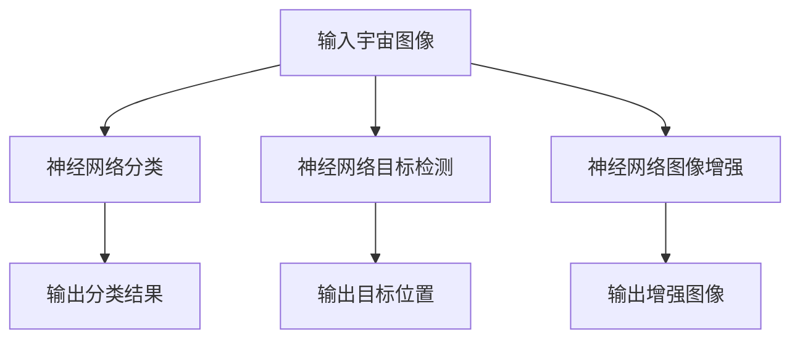

### 第8章 宇宙规律对人工神经网络设计的启示

#### 8.1 宇宙规律对神经网络结构的启示

宇宙规律，如宇宙的层次结构、星系之间的相互作用等，对人工神经网络的设计提供了启示。例如，在设计神经网络时，可以借鉴宇宙的层次结构，将神经网络分为多个层次，每个层次负责处理不同尺度的信息。以下是一个简化的 Mermaid 流程图，展示了如何将宇宙规律应用于神经网络结构设计：

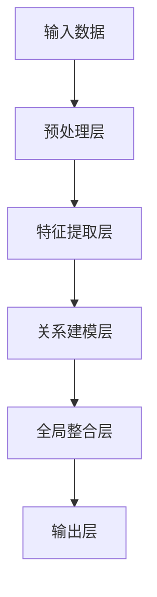

#### 8.2 宇宙规律对神经网络学习算法的启示

宇宙规律，如宇宙的演化过程、星系的运动轨迹等，对神经网络的学习算法提供了启示。例如，在设计学习算法时，可以借鉴宇宙的演化过程，采用逐步进化的方式，使得神经网络能够更好地适应复杂环境。以下是一个简化的 Mermaid 流程图，展示了如何将宇宙规律应用于神经网络学习算法设计：

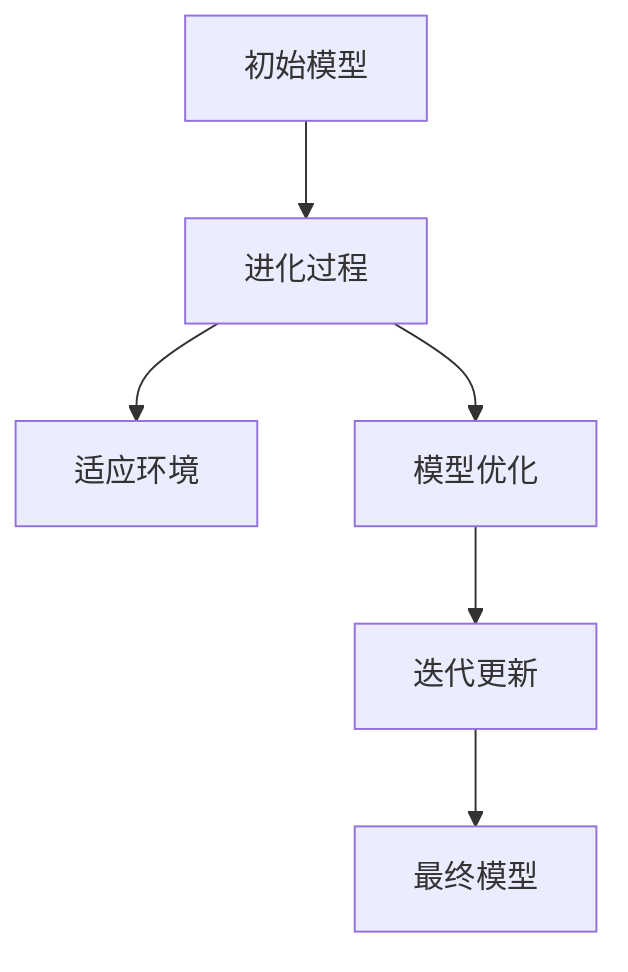

#### 8.3 宇宙规律对神经网络优化策略的启示

宇宙规律，如宇宙的稳定结构、星系的引力相互作用等，对神经网络的优化策略提供了启示。例如，在设计优化策略时，可以借鉴宇宙的稳定结构，采用自组织方法，使得神经网络能够自动调整参数，达到最优状态。以下是一个简化的 Mermaid 流程图，展示了如何将宇宙规律应用于神经网络优化策略设计：

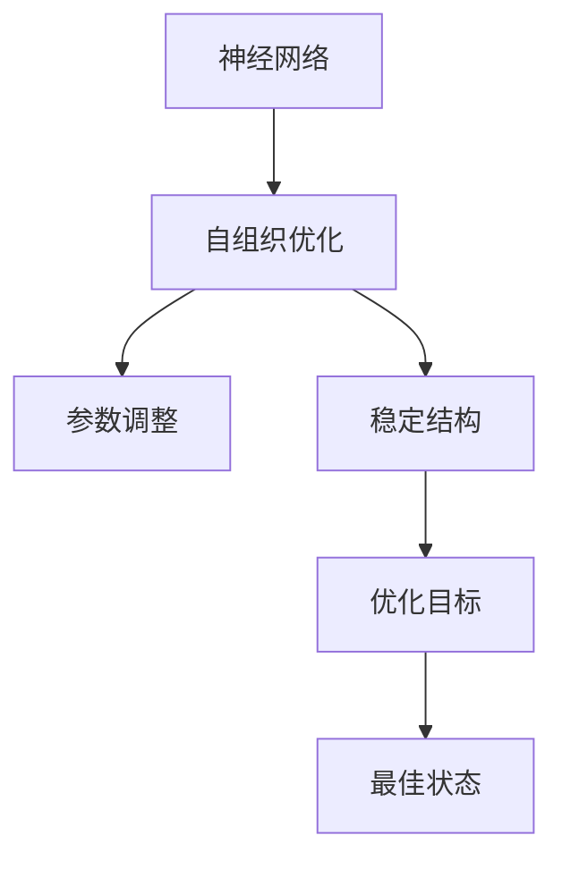

### 第9章 人工神经网络与宇宙规律的综合研究

#### 9.1 人工神经网络与宇宙规律交叉研究的前景

人工神经网络与宇宙规律的交叉研究具有广阔的前景。通过将宇宙规律应用于神经网络设计，可以构建更加高效、鲁棒的神经网络模型。同时，通过利用人工神经网络，可以更好地理解宇宙的复杂现象和演化过程。

以下是人工神经网络与宇宙规律交叉研究前景的简化 Mermaid 流程图：

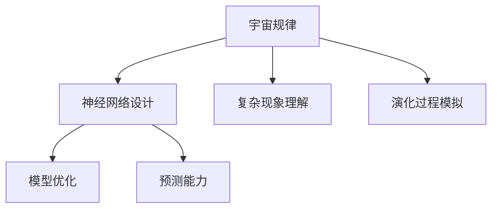

#### 9.2 当前研究进展与挑战

当前，人工神经网络与宇宙规律的交叉研究已经取得了一系列进展。例如，在星系模拟、宇宙演化模型和宇宙图像处理等领域，人工神经网络已经显示出强大的潜力。然而，这一领域仍然面临许多挑战，如如何设计更加高效、鲁棒的神经网络模型，以及如何更好地利用宇宙规律来优化神经网络等。

以下是当前研究进展与挑战的简化 Mermaid 流程图：

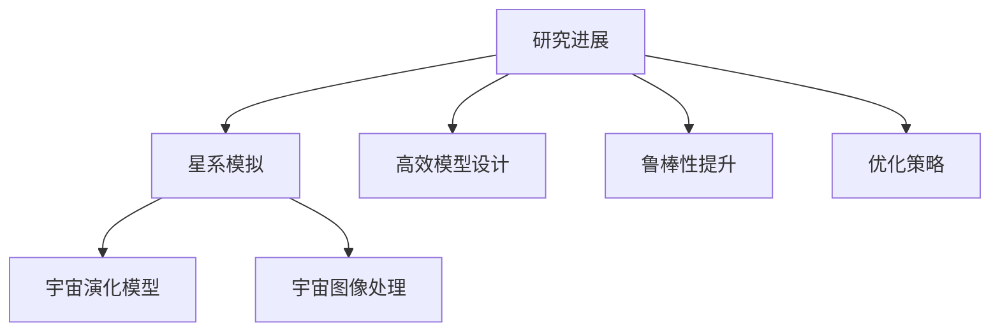

#### 9.3 未来发展趋势

未来，人工神经网络与宇宙规律的交叉研究将继续深入。随着计算能力的提升和算法的改进，人工神经网络将能够更好地模拟宇宙的复杂现象，揭示宇宙的更多奥秘。同时，宇宙规律也将为人工神经网络的设计和优化提供新的思路和方法。

以下是未来发展趋势的简化 Mermaid 流程图：

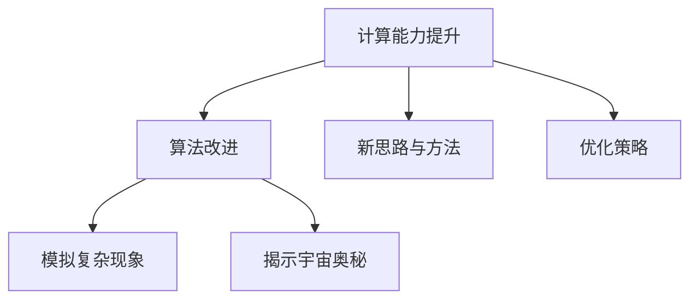

### 附录

#### 附录A 人工神经网络开发工具

以下是几种常用的人工神经网络开发工具：

1. **TensorFlow**：由谷歌开发，是一个开源的端到端机器学习平台，支持多种编程语言，包括 Python。
2. **PyTorch**：由 Facebook 开发，是一个开源的深度学习框架，具有动态计算图，易于调试和优化。
3. **Keras**：是一个高级神经网络API，可以与 TensorFlow 和 Theano 后端无缝集成，提供了简洁、直观的接口。

以下是这些工具的简化 Mermaid 流程图：

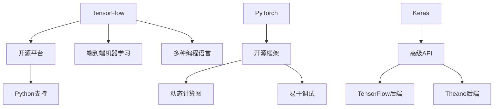

#### 附录B 宇宙规律研究资源

以下是几种常用的宇宙规律研究资源：

1. **宇宙学经典教材**：包括《宇宙学：原理与方法》、《现代宇宙学》等，提供了宇宙学的基础知识和最新进展。
2. **人工神经网络学习资源**：包括《深度学习》、《神经网络与深度学习》等，介绍了人工神经网络的基础知识、算法和应用。
3. **宇宙与人工智能交叉研究文献**：包括《宇宙与人工智能：跨学科融合研究》、《深度学习在宇宙学中的应用》等，探讨了宇宙规律与人工智能的交叉应用。

以下是这些资源的简化 Mermaid 流程图：

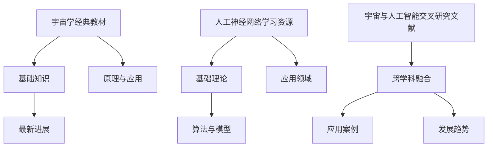

---

## 文章小结

本文详细探讨了宇宙规律与人工神经网络设计之间的奇妙联系。通过对宇宙基本规律和人工神经网络基础的介绍，我们揭示了两者之间的核心概念与联系，并通过实例展示了人工神经网络在宇宙学研究中的应用。同时，我们还探讨了宇宙规律对人工神经网络设计的启示，提出了未来研究的发展方向。希望本文能够为读者提供对这一交叉领域的深入理解。

### 注意事项与拓展阅读

在进行人工神经网络与宇宙规律的研究时，需要注意以下几点：

- **数据质量**：宇宙数据的质量直接影响到人工神经网络的效果，因此需要进行严格的数据预处理和清洗。
- **模型选择**：不同的任务需要选择合适的神经网络模型，例如卷积神经网络适用于图像处理，循环神经网络适用于序列数据。
- **计算资源**：宇宙规律的研究往往需要大量的计算资源，因此需要合理利用现有的计算资源，或考虑使用高性能计算平台。

拓展阅读：

- 《深度学习》（Goodfellow, I., Bengio, Y., & Courville, A.）
- 《宇宙学：原理与方法》（Set梢B., Dodelson, S., & Peebles, P. J. E.）
- 《现代宇宙学》（Rees, M. J.）

### 作者信息

作者：AI天才研究院/AI Genius Institute & 禅与计算机程序设计艺术/Zen And The Art of Computer Programming。本文旨在探讨宇宙规律与人工神经网络设计之间的奇妙联系，旨在为读者提供深入的技术分析和研究思路。感谢您的阅读。

