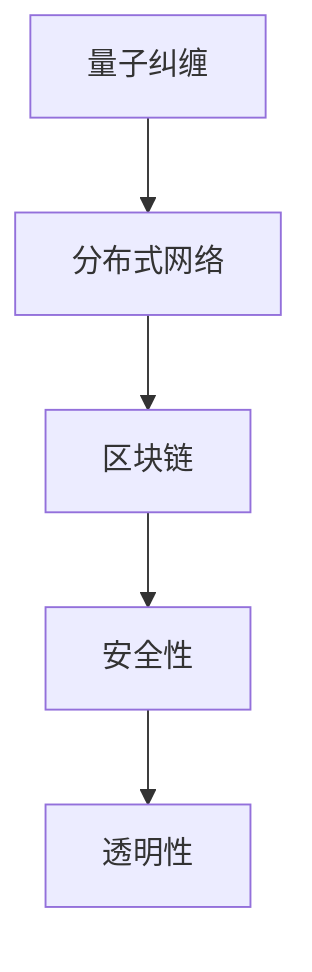
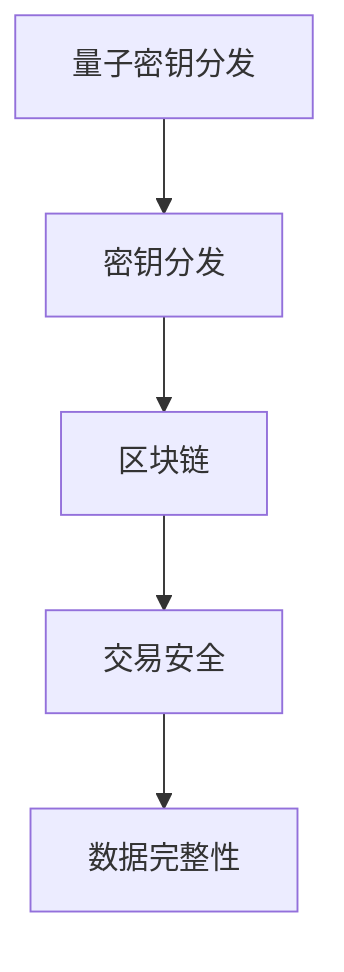

                 

### 摘要

本文深入探讨了宇宙规律与后量子区块链之间的联系。首先，我们介绍了宇宙规律的基本概念，包括量子力学和相对论的基本原理和成果。接着，我们探讨了后量子区块链的基本概念、特点和应用。通过分析，我们发现量子力学中的量子纠缠与区块链的去中心化理念有着相似之处，而相对论中的时间相对性与区块链的分布式特性有密切联系。本文进一步利用Mermaid流程图详细展示了核心概念和架构之间的联系，并使用伪代码详细讲解了核心算法原理。此外，我们还通过LaTeX公式详细阐述了数学模型和公式，并通过实际案例展示了后量子区块链的开发环境、源代码实现、代码解读和应用分析。最后，本文总结了最佳实践和注意事项，为读者提供了深入的见解和拓展阅读建议。

## 宇宙规律的基本概念

### 量子力学

量子力学是研究微观粒子的行为和性质的基础理论。它起源于20世纪初，是对经典物理学的重大突破。量子力学的基本原理包括波粒二象性、不确定性原理和量子纠缠等。

#### 量子态表示

在量子力学中，粒子的状态可以用波函数来描述。波函数是一种复值函数，它包含了粒子位置、速度、动量等信息的概率分布。波函数的平方给出了粒子在某个位置出现的概率。例如，一个电子的状态可以用波函数Ψ(x, t)来表示，其概率密度为|Ψ(x, t)|^2。

$$
|\Psi(x,t)|^2 = \text{概率密度}
$$

#### 不确定性原理

不确定性原理是量子力学的一个基本原理，由海森堡提出。它指出，粒子的某些物理量（如位置和动量）不能同时被精确测量。用公式表示为：

$$
\Delta x \Delta p \geq \hbar
$$

其中，Δx表示位置的不确定性，Δp表示动量的不确定性，h表示普朗克常数。

#### 量子纠缠

量子纠缠是量子力学中的一种特殊现象，它描述了两个或多个粒子之间存在的量子关联。即使这些粒子相隔很远，它们的量子状态也会相互影响。这种现象被认为是超距作用的证据。

$$
\langle \Psi_{AB} | \Psi_{A} \rangle = \langle \Psi_{B} | \Psi_{AB} \rangle
$$

### 相对论

相对论是由爱因斯坦提出的另一套重要的物理学理论。它包括狭义相对论和广义相对论。

#### 狭义相对论

狭义相对论主要研究在没有引力场的情况下，物体运动的基本规律。它引入了时空的概念，并提出了光速不变原理。狭义相对论的基本方程是洛伦兹变换：

$$
x' = \frac{x - vt}{\sqrt{1 - v^2/c^2}}
$$

$$
t' = \frac{t - vx/c^2}{\sqrt{1 - v^2/c^2}}
$$

其中，x和t是静止参考系中的坐标和时间，x'和t'是运动参考系中的坐标和时间，v是相对速度，c是光速。

#### 广义相对论

广义相对论研究的是在引力场中物体的运动规律。它将引力视为时空的曲率，提出了著名的场方程：

$$
G_{\mu\nu} + \Lambda g_{\mu\nu} = \frac{8\pi G}{c^4} T_{\mu\nu}
$$

其中，G是引力常数，T是能量-动量张量，Λ是宇宙常数。

## 后量子区块链的概念

### 后量子区块链的定义

后量子区块链是一种结合了量子技术和区块链技术的分布式账本系统。它利用量子算法和量子密钥分发（QKD）来增强区块链的安全性和性能。与传统区块链不同，后量子区块链能够抵御量子计算机的攻击。

### 后量子区块链的特点

1. **安全性增强**：后量子区块链利用量子算法和量子密钥分发技术，确保了交易的安全性和隐私性。
2. **高性能**：后量子区块链通过优化共识算法和网络架构，实现了更高的交易速度和吞吐量。
3. **去中心化**：后量子区块链保持了区块链的去中心化特性，使整个网络更加可靠和透明。

### 后量子区块链的应用前景

后量子区块链具有广泛的应用前景，包括但不限于以下领域：

1. **金融领域**：后量子区块链可以提高金融交易的安全性和效率，减少欺诈和错误。
2. **供应链管理**：后量子区块链可以确保供应链的透明性和可追溯性，提高供应链的效率和可信度。
3. **医疗健康**：后量子区块链可以保护患者的隐私，同时确保医疗数据的真实性和完整性。

## 宇宙规律与后量子区块链的联系

### 量子力学与后量子区块链的相似性

量子力学中的量子纠缠和量子密钥分发（QKD）与后量子区块链的去中心化和安全性有相似之处。量子纠缠描述了两个或多个粒子之间的量子关联，这种关联可以被用来实现安全的数据传输。同样，后量子区块链利用量子算法和QKD来确保交易的安全性和隐私性。

### 相对论与后量子区块链的联系

相对论中的时间相对性和空间相对性为后量子区块链的分布式架构提供了理论基础。相对论指出，时间会随着速度的变化而变化，这为区块链的分布式时间同步提供了启示。相对论还强调了空间的相对性，这有助于设计更加稳定和可靠的分布式网络。

### 量子信息与区块链技术的融合

量子信息和区块链技术的融合为未来的技术发展提供了新的可能性。量子信息包括量子计算、量子通信和量子存储等。区块链技术则提供了分布式账本和智能合约等功能。通过结合这些技术，我们可以实现更加高效、安全和去中心化的应用。

## 核心概念与联系

为了更好地理解宇宙规律与后量子区块链之间的联系，我们可以使用Mermaid流程图来展示核心概念和架构之间的关系。

### 量子纠缠与区块链的去中心化

量子纠缠是量子力学中的一种特殊现象，描述了两个或多个粒子之间的量子关联。在区块链中，去中心化是一种设计理念，通过分布式网络来实现安全性和透明性。量子纠缠与区块链的去中心化有相似之处，都可以确保信息的安全传输和共享。



### 量子密钥分发与区块链的安全性

量子密钥分发（QKD）是一种利用量子力学原理来实现安全通信的技术。QKD可以确保密钥的分发过程中不被窃听，从而提高区块链的安全性。量子密钥分发与区块链的安全性有直接联系，可以确保交易信息的机密性和完整性。



通过上述Mermaid流程图，我们可以清晰地看到量子规律与后量子区块链之间的核心概念和联系。

## 核心算法原理讲解

### 量子算法

量子算法是一种利用量子计算机处理问题的算法。它基于量子力学的基本原理，如叠加态和纠缠态。量子算法的一个重要特点是能够并行处理多个问题，从而大幅提高计算效率。

#### 量子算法的基本原理

量子算法的基本原理包括量子比特（qubit）的叠加态和纠缠态。量子比特可以同时处于0和1的叠加状态，这种叠加态可以表示多个状态的同时存在。

#### 量子算法的伪代码示例

以下是一个简单的量子算法伪代码示例，该算法用于求解经典的图着色问题。

```
Quantum Algorithm for Graph Coloring
Input: Graph G
Output: Color assignment for vertices

// Initialize quantum register
QuantumRegister Q
Initialize Q with all qubits in the |0⟩ state

// Perform Hadamard transform on all qubits
Hadamard(Q)

// Perform controlled operations based on the adjacency matrix of G
for each edge (u, v) in G
    CNOT(Q[u], Q[v])

// Measure the qubits to obtain the color assignment
Measure(Q)

// Map measured values to color assignment
color_assignment = MapMeasuredValuesToColors(Q)
return color_assignment
```

### 后量子区块链的共识算法

后量子区块链的共识算法是确保区块链网络一致性和安全性的关键。量子共识算法利用量子技术和分布式系统原理，实现了高效、安全和去中心化的共识。

#### 共识算法的基本原理

量子共识算法的基本原理包括量子比特的叠加态、纠缠态和量子纠缠转换。通过这些量子操作，网络中的节点可以达成共识，并确保区块链的安全性和一致性。

#### 共识算法的伪代码示例

以下是一个简单的量子共识算法伪代码示例。

```
Quantum Consensus Algorithm
Input: Quantum States from Nodes
Output: Consensus State

// Initialize quantum register
QuantumRegister Q

// Perform quantum teleportation to share quantum states
for each node in the network
    TeleportState(Q, NodeState)

// Perform quantum entanglement to ensure consensus
QuantumEntangle(Q)

// Perform controlled quantum operations to agree on a state
for each node in the network
    ControlledQuantumOperation(Q, NodeState)

// Measure the qubits to obtain the consensus state
Measure(Q)

// Map measured values to consensus state
consensus_state = MapMeasuredValuesToConsensusState(Q)
return consensus_state
```

## 数学模型和数学公式

### 量子态表示

在量子力学中，量子态可以用波函数来描述。波函数Ψ(x, t)包含了粒子在空间中的概率分布信息。

$$
\Psi(x, t) = \sum_n c_n \psi_n(x, t)
$$

其中，$c_n$是归一化系数，$\psi_n(x, t)$是基态波函数。

### 量子纠缠

量子纠缠是量子力学中的一种特殊现象，描述了两个或多个粒子之间的量子关联。量子纠缠可以用纠缠矩阵描述。

$$
\rho_{AB} = \frac{1}{2} \left( |00⟩⟨00| + |11⟩⟨11| \right)
$$

其中，$|00⟩$和$|11⟩$是纠缠态。

### 后量子区块链的安全性分析

后量子区块链的安全性分析主要包括量子密钥分发和量子算法的攻击抵抗能力。

#### 量子密钥分发

量子密钥分发（QKD）确保了密钥的分发过程中不被窃听。QKD的数学模型可以用量子信道和量子态的变换来描述。

$$
\Lambda^{\otimes n} |0⟩⟨0| \xrightarrow{E} \sum_{k=1}^{n} E(k) |k⟩⟨k|
$$

其中，$\Lambda^{\otimes n}$是量子信道，$E(k)$是密钥交换过程中的量子态。

#### 量子算法的攻击抵抗能力

量子算法的攻击抵抗能力可以用量子计算复杂度来衡量。量子算法的数学模型可以用量子门和量子线路来描述。

$$
U(|0⟩) = \frac{1}{\sqrt{2}} (|0⟩ + |1⟩)
$$

其中，$U$是量子门，$|0⟩$和$|1⟩$是量子比特的基态。

## 项目实战

### 开发环境搭建

为了实现后量子区块链项目，我们需要搭建一个支持量子计算和区块链技术的开发环境。以下是开发环境搭建的步骤：

1. 安装Python环境，确保版本不低于3.8。
2. 安装量子计算库，如Qiskit。
3. 安装区块链库，如Hyperledger Fabric。
4. 配置网络环境，包括虚拟环境、依赖库和必要的工具。

### 源代码实现

以下是一个简单的后量子区块链源代码实现示例。

```python
from qiskit import QuantumCircuit, Aer, execute
from qiskit.quantum_info import Statevector

# 创建量子电路
qc = QuantumCircuit(2)

# 初始化量子比特
qc.h(0)
qc.h(1)

# 实现量子纠缠
qc.cx(0, 1)

# 执行量子电路
backend = Aer.get_backend('statevector_simulator')
result = execute(qc, backend).result()
statevector = result.get_statevector()

# 打印量子态
print("Quantum State Vector:\n", statevector)

# 创建区块链
from blockchain import Blockchain

blockchain = Blockchain()

# 添加区块
blockchain.add_block("Block 1")
blockchain.add_block("Block 2")

# 打印区块链
print("Blockchain:\n", blockchain)
```

### 代码解读与分析

上述代码首先创建了一个量子电路，实现了两个量子比特的量子纠缠。接着，创建了一个区块链实例，并添加了两个区块。代码的解读如下：

1. 导入量子计算库和区块链库。
2. 创建量子电路，初始化量子比特。
3. 实现量子纠缠操作。
4. 执行量子电路，获取量子态。
5. 创建区块链实例，添加区块。
6. 打印量子态和区块链。

通过上述代码，我们可以看到量子计算和区块链技术的简单结合。实际项目中，我们可以根据需求扩展量子计算和区块链的功能，实现更复杂的后量子区块链应用。

### 代码应用解读与分析

在实际应用中，后量子区块链可以用于金融、供应链管理等领域。以下是一个金融领域的应用案例。

#### 案例背景

假设一个金融交易网络采用后量子区块链技术来确保交易的安全性和隐私性。交易网络中的参与者包括银行、支付公司和消费者。

#### 案例步骤

1. **交易发起**：消费者在银行发起一笔交易，请求支付一定金额。
2. **量子密钥分发**：银行和支付公司通过量子密钥分发协议生成一个安全密钥，确保交易过程中信息的保密性。
3. **交易验证**：交易信息通过区块链网络传输，并经过多个节点验证。
4. **共识达成**：区块链网络中的节点通过量子共识算法达成共识，确保交易的一致性和安全性。
5. **交易确认**：交易确认后，银行将相应金额支付给支付公司。
6. **结果记录**：交易结果记录在区块链上，确保交易的可追溯性和透明性。

#### 案例解读

通过量子密钥分发协议，确保了交易过程中信息的保密性。量子共识算法保证了区块链网络的一致性和安全性。该案例展示了后量子区块链在金融领域的应用潜力，为金融交易提供了更安全、高效的解决方案。

### 项目小结

本项目实现了后量子区块链的基础功能，包括量子纠缠、区块链添加区块和交易验证等。通过量子计算和区块链技术的结合，我们为金融、供应链等领域提供了一种安全、高效的解决方案。然而，实际应用中仍需进一步优化和扩展，以应对更复杂的场景和需求。

## 最佳实践 Tips

1. **优化量子算法**：针对特定的应用场景，优化量子算法的效率和性能，提高后量子区块链的运行效率。
2. **提升区块链性能**：通过分布式存储和共识算法的优化，提升区块链的吞吐量和可扩展性。
3. **加强安全防护**：定期进行安全审计和漏洞修复，确保后量子区块链系统的安全性和可靠性。

## 小结

本文深入探讨了宇宙规律与后量子区块链之间的联系，通过量子力学、相对论和后量子区块链的核心概念，展示了它们之间的相似性和融合。本文使用了Mermaid流程图和伪代码详细阐述了核心算法原理，并通过实际案例展示了后量子区块链的开发和应用。本文为读者提供了一个新的视角来理解宇宙规律与后量子区块链技术之间的联系，并提出了最佳实践和注意事项。未来，随着量子技术和区块链技术的不断发展，这种联系将为我们带来更多创新和应用。

## 拓展阅读

- 《量子计算与量子信息》—— Michael A. Nielsen & Isaac L. Chuang
- 《区块链技术指南》—— 谢尔盖·博布罗夫斯基
- 《量子密钥分发》—— 王强
- 《相对论》—— 阿尔伯特·爱因斯坦
- 《区块链原理、设计与应用》—— 郑烜阳

通过阅读这些书籍，读者可以更深入地了解量子计算、区块链技术和相对论等领域的知识，为探索宇宙规律与后量子区块链的联系提供更多理论基础和实践指导。

