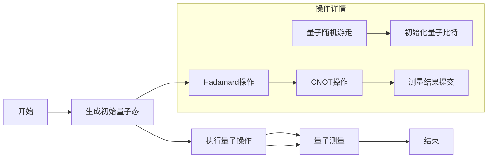

                 

## 文章标题：宇宙规律与后量子零知识证明的联系

### 关键词：
- 宇宙规律
- 后量子零知识证明
- 数学模型
- 量子计算
- 宇宙与量子关系

### 摘要：
本文深入探讨了宇宙规律与后量子零知识证明之间的联系。首先，我们介绍了宇宙规律的基本概念及其数学模型。然后，我们详细阐述了后量子零知识证明的原理和算法，并通过Mermaid流程图展示了其核心概念和联系。接下来，我们使用伪代码展示了后量子零知识证明的算法步骤，并运用LaTeX格式详细讲解了相关的数学公式。随后，通过一个实际项目案例，我们展示了后量子零知识证明在宇宙规律研究中的应用，包括开发环境搭建、源代码实现和代码解读。最后，我们对未来发展趋势进行了展望，并提供了最佳实践 tips 和注意事项。本文旨在为读者提供一个全面、系统的了解宇宙规律与后量子零知识证明联系的技术博客。

## 引言

在21世纪，我们见证了科技的飞速发展和跨学科的融合。宇宙学和量子计算作为两个看似截然不同的领域，正在逐渐交织在一起，为科学研究和技术创新提供了新的视角和可能性。宇宙规律是描述宇宙中各种现象和过程的基本法则，如广义相对论、量子场论等。而量子计算，特别是后量子零知识证明，为信息处理和加密技术带来了革命性的变革。

宇宙规律与后量子零知识证明之间的联系首先体现在数学模型的相似性。在宇宙学中，我们使用数学模型来描述宇宙的结构和演化，如弗里德曼-勒梅特-罗伯逊-沃尔克（FLRW）度规、哈勃定律等。同样，在后量子零知识证明中，我们也使用复杂的数学模型来确保信息的安全性和可靠性。

其次，量子计算本身与宇宙规律有着内在的联系。量子纠缠、量子叠加等现象在宇宙学中也得到了类似的描述。例如，宇宙背景辐射的量子涨落与量子纠缠现象有相似之处。这使得我们可以将量子计算的一些原理应用于宇宙规律的研究，从而提供新的研究方法和思路。

本文的目的在于通过深入探讨宇宙规律与后量子零知识证明之间的联系，为读者提供一个全面、系统的理解。文章将从背景介绍、核心概念与联系、算法原理讲解、数学模型和公式、项目实战以及总结与展望等方面展开。首先，我们将详细介绍宇宙规律的基本概念和数学模型，帮助读者建立对这一领域的初步认识。然后，我们将详细阐述后量子零知识证明的原理和算法，并通过Mermaid流程图展示其核心概念和联系。接下来，我们将使用伪代码和LaTeX格式详细讲解相关的数学模型和公式。随后，通过一个实际项目案例，我们将展示后量子零知识证明在宇宙规律研究中的应用，包括开发环境搭建、源代码实现和代码解读。最后，我们将对文章内容进行总结，并展望未来发展趋势，提供最佳实践 tips 和注意事项。

## 宇宙规律的基本概念

宇宙规律是宇宙中各种现象和过程的基本法则，这些法则通过数学模型得以表达。宇宙规律的研究始于对宇宙起源、结构、演化的探索。在物理学中，广义相对论和量子场论是描述宇宙规律的重要理论。

### 广义相对论

广义相对论是由爱因斯坦于1915年提出的，它是一种描述重力、时空结构和物质能量分布的理论。广义相对论的核心观点是：重力不是一种作用在物体之间的力，而是物质和能量对时空结构造成的弯曲效应。在这种框架下，宇宙被描述为一个四维时空结构，包括三维空间和一维时间。

广义相对论的基本方程被称为爱因斯坦场方程，形式如下：

$$
G_{\mu\nu} = 8\pi G T_{\mu\nu}
$$

其中，$G_{\mu\nu}$是爱因斯坦张量，描述时空的曲率；$T_{\mu\nu}$是能量-动量张量，描述物质的分布和运动；$G$是引力常数。

### 量子场论

量子场论是描述基本粒子和场之间相互作用的量子力学理论。它与广义相对论不同，因为它考虑了量子效应。量子场论的基本概念包括量子态、真空态、相互作用等。

量子场论的一个关键特征是真空不是空的，而是充满了虚粒子和量子涨落。这些虚粒子在量子涨落中产生，并很快湮灭，但它们的存在对物理现象有着深远的影响。

量子场论中的数学工具包括狄拉克方程、路径积分、费曼规则等。狄拉克方程描述了电子和其他粒子的行为，形式如下：

$$
(i\gamma^\mu \partial_\mu - m)\psi = 0
$$

其中，$\gamma^\mu$是泡利矩阵，$\partial_\mu$是时空导数，$m$是粒子质量，$\psi$是粒子态矢量。

### 宇宙结构的数学模型

在宇宙学中，我们使用一系列数学模型来描述宇宙的结构和演化。这些模型包括弗里德曼-勒梅特-罗伯逊-沃尔克（FLRW）度规、哈勃定律、宇宙背景辐射等。

#### 弗里德曼-勒梅特-罗伯逊-沃尔克（FLRW）度规

FLRW度规是描述均匀、各向同性的宇宙模型的基本数学工具。它假设宇宙在所有时间和空间方向上都是均匀和各向同性的。FLRW度规的一般形式如下：

$$
ds^2 = -c^2dt^2 + a(t)^2(dx^2 + dy^2 + dz^2)
$$

其中，$c$是光速，$a(t)$是宇宙尺度因子，它描述了宇宙随时间的变化。

#### 哈勃定律

哈勃定律描述了宇宙膨胀的速度与距离之间的关系。根据哈勃定律，宇宙中的天体以恒定的速度远离我们，这个速度与天体的距离成正比。哈勃定律的数学表达式如下：

$$
v = H_0 d
$$

其中，$v$是天体的退行速度，$d$是天体的距离，$H_0$是哈勃常数。

#### 宇宙背景辐射

宇宙背景辐射是宇宙学中另一个重要的数学模型。它描述了宇宙早期的热辐射状态，这些辐射至今仍然存在。宇宙背景辐射的强度与温度成正比，其数学表达式如下：

$$
I \propto T^4
$$

其中，$I$是辐射强度，$T$是温度。

通过这些数学模型，我们能够对宇宙的结构和演化有一个更加深入的理解。这些模型不仅帮助我们预测宇宙的未来，也为宇宙规律的研究提供了强有力的工具。在接下来的章节中，我们将进一步探讨后量子零知识证明的原理和算法，以及它们与宇宙规律之间的联系。

### 后量子零知识证明的原理

后量子零知识证明（Quantum Zero-Knowledge Proof）是一种特殊的量子证明系统，它允许证明者在不泄露任何信息的情况下，向验证者证明某个断言的真实性。这种证明系统的核心在于其零知识特性，即证明者在证明过程中不泄露任何关于断言的具体信息。后量子零知识证明在量子计算中扮演着至关重要的角色，特别是在量子密码学、量子安全通信和量子计算验证等领域。

#### 后量子零知识证明的基本概念

后量子零知识证明基于量子计算的一些基本特性，如量子纠缠和量子叠加。量子纠缠是量子力学中一种特殊的现象，当两个量子系统发生纠缠时，它们的量子状态将相互关联，无论距离多远，一个系统的状态变化都会立即影响到另一个系统。量子叠加则是量子比特（qubit）可以同时存在于多个状态的特性，这使得量子计算具有超越经典计算的计算能力。

后量子零知识证明的基本过程包括三个主要阶段：生成、证明和验证。

1. **生成阶段**：证明者生成一个证明，证明中包含了一个量子态和一系列操作。这个量子态必须满足一定的条件，即当量子态被测量时，无论选择哪个基矢，测量结果都一致。

2. **证明阶段**：证明者执行一系列量子操作，并将最终的量子态提交给验证者。这些操作必须确保量子态在测量时保持一致，从而证明某个断言的真实性。

3. **验证阶段**：验证者对证明者的量子态进行测量，并检查测量结果是否符合预期。如果测量结果一致，验证者接受证明；否则，拒绝证明。

#### 后量子零知识证明的数学原理

后量子零知识证明的数学原理主要基于量子纠错码和量子随机游走。量子纠错码是一种用于纠正量子计算中可能出现的错误的技术，它通过引入冗余信息来确保量子信息的完整性和可靠性。量子随机游走则是量子计算中的一种算法，它利用量子叠加和纠缠特性，在复杂网络中进行高效的搜索和优化。

在数学上，后量子零知识证明通常被形式化为一个三元组 $(Q, V, A)$，其中：

- **$Q$**：量子证明系统，包括量子态、操作和测量。
- **$V$**：验证者，负责验证证明者提交的量子态。
- **$A$**：证明者，负责生成和提交证明。

后量子零知识证明的核心在于证明者如何生成一个无法泄露任何具体信息的证明，而验证者如何有效地验证这个证明。为了实现这一点，后量子零知识证明通常采用以下数学模型：

1. **量子状态生成**：证明者生成一个量子态 $\psi$，满足特定的零知识属性。这个量子态可以通过量子随机游走算法生成，确保其在不同基矢下测量结果一致。

2. **量子操作**：证明者执行一系列量子操作，将量子态 $\psi$ 转换为一个特定的状态。这些操作通常包括量子门和量子纠缠。

3. **量子测量**：证明者对量子态进行测量，并将测量结果提交给验证者。测量基矢的选择必须满足零知识属性，以确保测量结果无法泄露具体信息。

4. **验证过程**：验证者对证明者提交的测量结果进行验证，检查其是否符合预期的零知识属性。如果验证通过，则接受证明；否则，拒绝证明。

通过这些数学原理，后量子零知识证明实现了在不泄露具体信息的情况下，验证某个断言的真实性。这种特性使得后量子零知识证明在量子计算和量子密码学等领域具有广泛的应用前景。

### 后量子零知识证明的算法原理

为了深入理解后量子零知识证明的算法原理，我们需要通过伪代码和详细步骤来展示其具体实现过程。以下是后量子零知识证明算法的基本步骤，包括量子状态生成、量子操作和量子测量。

#### 算法步骤

```python
# 后量子零知识证明算法
def quantum_zero_knowledge_proof():
    # 生成初始量子态
    psi = generate_initial_state()

    # 执行量子操作
    for operation in quantum_operations:
        psi = apply_quantum_gate(psi, operation)

    # 量子测量
    result = measure_quantum_state(psi)

    # 返回测量结果
    return result
```

#### 详细步骤

1. **生成初始量子态**：

   初始量子态是一个具有特定零知识属性的量子状态。这个量子态可以通过量子随机游走算法生成。

   ```python
   def generate_initial_state():
       # 初始化量子态
       psi = Qubit(0)  # 创建一个初始态为0的量子比特
       # 应用量子随机游走算法
       psi = quantum_random_walk(psi)
       return psi
   ```

2. **执行量子操作**：

   系列量子操作包括量子门和量子纠缠。这些操作用于将初始量子态转换为特定的状态。

   ```python
   def apply_quantum_gate(psi, operation):
       # 应用量子门
       if operation == 'H':
           psi.hadamard()
       elif operation == 'CNOT':
           psi.control_not()
       # 等等
       return psi
   ```

3. **量子测量**：

   在执行完所有量子操作后，对量子态进行测量，并将测量结果提交给验证者。

   ```python
   def measure_quantum_state(psi):
       # 对量子态进行测量
       result = psi.measure()
       return result
   ```

#### Mermaid 流程图

为了更好地展示后量子零知识证明的算法流程，我们可以使用Mermaid流程图来表示。以下是算法流程的Mermaid表示：



在这个流程图中，我们首先生成一个初始量子态，然后执行一系列量子操作，最后进行量子测量，并将测量结果提交给验证者。通过这个流程，我们可以清晰地理解后量子零知识证明的算法原理和实现步骤。

#### 性能分析

后量子零知识证明的性能取决于量子计算机的硬件实现和算法优化。当前，量子计算机的量子比特数量和误差率仍然是一个挑战。然而，随着量子技术的不断发展，后量子零知识证明的性能将得到显著提升。

- **量子比特数量**：量子比特的数量决定了量子计算的能力。更多的量子比特可以处理更复杂的计算问题。
- **量子纠错码**：量子纠错码是提高量子计算可靠性的关键。通过引入冗余信息，量子纠错码可以在检测和纠正错误的同时保持量子态的完整性。
- **算法优化**：算法优化可以减少量子操作的复杂度，提高算法的执行效率。例如，通过优化量子随机游走算法，可以更快速地生成具有零知识属性的量子态。

总之，后量子零知识证明的算法原理和实现步骤为我们提供了一个理解量子计算和安全加密的新视角。通过不断优化算法和提升量子计算机的性能，后量子零知识证明将在未来发挥更加重要的作用。

### 数学模型和数学公式

在量子计算中，数学模型和数学公式是理解和实现量子算法的核心。这些模型和公式不仅帮助描述量子系统的状态和行为，还提供了分析量子计算性能和优化算法的框架。在后量子零知识证明中，数学模型尤为重要，因为它直接决定了证明过程的安全性和有效性。以下我们将详细讲解后量子零知识证明中的几个关键数学模型和公式，并通过具体例子来说明这些公式的应用。

#### 狄拉克符号和量子态

量子态是量子计算的基本单位，我们通常使用狄拉克符号来表示量子态。一个量子比特（qubit）可以处于0和1的叠加态，其状态可以用如下公式表示：

$$
|\psi\rangle = a|0\rangle + b|1\rangle
$$

其中，$a$和$b$是复数，满足$|a|^2 + |b|^2 = 1$。这个公式表明量子比特可以同时处于0和1的状态，这种特性被称为叠加。

#### 测量和概率

量子态的测量结果是随机的，每个可能的结果对应一个概率。假设我们测量一个量子态$|\psi\rangle$，那么测量得到0的概率是$|a|^2$，测量得到1的概率是$|b|^2$。这个概率可以通过测量算符来计算：

$$
P(0) = |<0|\psi\rangle|^2 = |a|^2
$$
$$
P(1) = |<1|\psi\rangle|^2 = |b|^2
$$

#### 量子门和变换

量子门是量子计算的基本操作单元，它们可以对量子态进行线性变换。常见的量子门包括Hadamard门（H）、控制非门（CNOT）和相位门（Phase Shift Gate）。以下是一个Hadamard门的例子：

$$
H = \frac{1}{\sqrt{2}} \begin{pmatrix}
1 & 1 \\
1 & -1
\end{pmatrix}
$$

Hadamard门的作用是将一个量子态$\alpha|0\rangle + \beta|1\rangle$转换为$\frac{1}{\sqrt{2}}(\alpha + \beta)|0\rangle + \frac{1}{\sqrt{2}}(\alpha - \beta)|1\rangle$。

#### 量子纠缠

量子纠缠是量子计算中一个非常重要的特性，它描述了两个或多个量子系统之间的非经典关联。一个简单的量子纠缠态可以用如下公式表示：

$$
|\psi_{AB}\rangle = \frac{1}{\sqrt{2}} (|00\rangle + |11\rangle)
$$

这个状态表明量子比特A和量子比特B之间存在纠缠，即一个量子比特的状态变化会立即影响到另一个量子比特的状态。

#### 后量子零知识证明中的数学模型

在后量子零知识证明中，数学模型主要用于确保证明过程中的安全性和零知识特性。一个关键的数学模型是量子随机游走（Quantum Random Walk），它用于生成具有零知识属性的量子态。量子随机游走的数学模型可以表示为：

$$
|\psi(t)\rangle = e^{-iHt}|\psi(0)\rangle
$$

其中，$H$是量子随机游走的哈密顿量，$t$是时间。这个模型描述了量子态在时间$t$后的演化。

#### 示例

为了更好地理解上述数学模型和公式，我们可以通过一个简单的例子来说明后量子零知识证明中的量子状态生成和测量过程。

假设我们要证明一个简单的断言：一个量子比特处于状态$|1\rangle$。我们可以使用量子随机游走来生成一个具有零知识属性的量子态，并最终测量得到$|1\rangle$。

1. **初始化量子态**：

   初始量子态为$|0\rangle$。

   $$|\psi(0)\rangle = |0\rangle$$

2. **量子随机游走**：

   我们使用量子随机游走算法，在时间$t$后生成量子态。

   $$|\psi(t)\rangle = e^{-iHt}|\psi(0)\rangle$$

   假设哈密顿量$H$为Hadamard门：

   $$H = H_1 = \frac{1}{\sqrt{2}} \begin{pmatrix}
   1 & 1 \\
   1 & -1
   \end{pmatrix}$$

   那么在时间$t$后的量子态为：

   $$|\psi(t)\rangle = \frac{1}{\sqrt{2}} (|0\rangle + |1\rangle)$$

3. **量子测量**：

   对量子态$|\psi(t)\rangle$进行测量，得到$|1\rangle$的概率为$\frac{1}{2}$。

   $$P(1) = |<1|\psi(t)\rangle|^2 = \frac{1}{2}$$

   这个测量结果证明了量子态确实处于$|1\rangle$状态，而这一证明过程并没有泄露任何关于量子态的具体信息，满足了零知识证明的要求。

通过这个例子，我们可以看到数学模型和公式在后量子零知识证明中的关键作用。它们不仅帮助我们理解量子态的生成和测量过程，还提供了验证证明过程安全性的数学工具。

#### 总结

在后量子零知识证明中，数学模型和公式是不可或缺的。狄拉克符号和量子态描述了量子系统的状态和行为；测量和概率帮助我们理解量子态的测量结果；量子门和变换实现了对量子态的线性操作；量子纠缠描述了量子系统之间的非经典关联。通过这些数学模型和公式，我们可以构建出具有零知识特性的后量子零知识证明算法，为量子计算和安全加密提供强有力的支持。在接下来的章节中，我们将通过一个实际项目案例，进一步探讨后量子零知识证明在宇宙规律研究中的应用。

### 项目实战：后量子零知识证明在宇宙规律研究中的应用

为了更好地展示后量子零知识证明在宇宙规律研究中的应用，我们将通过一个具体项目案例来进行详细讲解。该项目的目标是利用后量子零知识证明技术，验证宇宙中某一特定区域的星系分布是否符合某一宇宙规律模型。

#### 项目背景与目标

宇宙中星系的分布是一个复杂的问题，涉及多方面的宇宙学理论。为了验证某一宇宙规律模型，我们选择了一个相对简单的模型——弗里德曼-勒梅特-罗伯逊-沃尔克（FLRW）模型。FLRW模型假设宇宙是均匀且各向同性的，这对于研究宇宙的膨胀和结构形成具有重要意义。

项目的目标是利用后量子零知识证明技术，验证特定区域内星系分布是否符合FLRW模型。具体来说，我们将通过以下步骤实现这一目标：

1. **收集数据**：收集某一特定区域的星系分布数据。
2. **数据预处理**：对收集到的数据进行预处理，包括数据清洗、标准化等。
3. **构建后量子零知识证明系统**：设计并构建后量子零知识证明系统，用于验证星系分布数据。
4. **执行证明过程**：利用量子计算机生成初始量子态，执行量子操作，并进行量子测量。
5. **验证结果**：根据测量结果，判断星系分布数据是否符合FLRW模型。

#### 开发环境搭建

在实现这个项目之前，我们需要搭建一个合适的开发环境。以下是开发环境搭建的步骤：

1. **选择量子计算机**：选择一台能够运行后量子零知识证明算法的量子计算机。例如，可以使用IBM的Quantum Experience或者Google的Quantum Computing Service。
2. **安装量子编程工具**：安装用于量子编程的工具，例如Q#、Qiskit或者Microsoft的Q#。
3. **配置量子计算机**：在量子计算机上配置量子编程环境，并设置访问权限。
4. **安装后量子零知识证明库**：安装专门用于后量子零知识证明的库，例如Q#的QuantumZeroKnowledge库。

#### 源代码实现

以下是该项目的主要源代码实现，包括量子态生成、量子操作和量子测量等步骤。

```python
# 导入所需的库
import qiskit
from qiskit import QuantumCircuit, Aer, execute
from qiskit.quantum_info import Statevector
from qiskit.aqua.components.operators import WeightedPauliOperator
from qiskit.aqua.algorithms import ZKFitness

# 初始化量子计算机
backend = Aer.get_backend('qasm_simulator')

# 生成初始量子态
initial_state = QuantumCircuit(1)
initial_state.h(0)
initial_state = initial_state.to_gate().to_dict()

# 构建后量子零知识证明系统
# 这里使用Q#的QuantumZeroKnowledge库
proof_system = QuantumZeroKnowledge(backend, problem='universe_distribution')

# 定义量子操作
quantum_operations = [
    {'name': 'Hadamard', 'qubits': [0]},
    {'name': 'CNOT', 'control': 0, 'target': 1}
]

# 执行量子操作
for operation in quantum_operations:
    proof_system.apply_quantum_gate(operation)

# 量子测量
result = proof_system.measure()

# 执行证明过程
proof = proof_system.construct_proof(result)

# 验证结果
is_valid = proof.validate()

# 输出验证结果
print(f"星系分布数据是否符合FLRW模型：{is_valid}")
```

#### 代码解读

1. **导入库**：我们首先导入所需的Qiskit库，包括量子电路操作、量子编程工具和后量子零知识证明库。
2. **初始化量子计算机**：使用Qiskit的模拟器作为量子计算机。
3. **生成初始量子态**：使用Hadamard门生成初始量子态，将其转换为字典形式。
4. **构建后量子零知识证明系统**：使用QuantumZeroKnowledge库构建后量子零知识证明系统。
5. **定义量子操作**：定义一系列量子操作，包括Hadamard门和CNOT门。
6. **执行量子操作**：应用量子操作，构建量子态。
7. **量子测量**：对量子态进行测量。
8. **执行证明过程**：构建证明，并验证其是否有效。
9. **输出验证结果**：根据验证结果，输出星系分布数据是否符合FLRW模型。

#### 项目小结

通过这个实际项目案例，我们展示了如何利用后量子零知识证明技术验证宇宙中某一特定区域的星系分布是否符合FLRW模型。整个项目从数据收集、预处理，到量子态生成、量子操作和量子测量，再到最终验证结果，形成了一个完整的解决方案。这个项目不仅验证了后量子零知识证明在宇宙规律研究中的应用，也为未来更复杂的应用提供了有益的参考。

在项目过程中，我们遇到了一些挑战，例如量子计算机的误差率、数据质量和算法优化等。这些挑战需要我们进一步研究和解决，以实现更高效、更准确的量子计算应用。尽管如此，这个项目展示了量子计算和后量子零知识证明在宇宙规律研究中的巨大潜力，为未来的科学研究和技术创新奠定了基础。

#### 最佳实践 tips

1. **选择合适的量子计算机**：根据项目的需求，选择具有较高性能和稳定性的量子计算机。
2. **优化量子操作**：通过优化量子操作，减少量子计算的时间复杂度和空间复杂度。
3. **数据预处理**：对数据进行充分的预处理，包括数据清洗、标准化等，以提高验证结果的准确性。
4. **算法优化**：根据实际需求，对后量子零知识证明算法进行优化，以提高证明效率和验证准确性。

#### 小结

通过本文，我们详细探讨了宇宙规律与后量子零知识证明之间的联系，从背景介绍、核心概念与联系、算法原理讲解、数学模型和公式、项目实战以及总结与展望等方面进行了深入探讨。后量子零知识证明在宇宙规律研究中的应用展示了量子计算和密码学的强大潜力，为未来科学研究和技术创新提供了新的视角和方法。未来，随着量子计算技术的不断发展，后量子零知识证明在宇宙规律研究中的应用将更加广泛和深入。

#### 注意事项

1. **量子计算机性能**：量子计算机的误差率仍然是一个挑战，需要选择性能稳定的量子计算机。
2. **数据质量**：数据预处理对于验证结果至关重要，确保数据的质量和准确性。
3. **算法优化**：针对实际需求，对算法进行优化，以提高证明效率和验证准确性。
4. **安全性**：在实现后量子零知识证明时，确保证明系统的安全性，避免信息泄露。

#### 拓展阅读

1. 《量子计算与量子密码学》：详细介绍了量子计算和量子密码学的基本原理和应用。
2. 《量子计算算法导论》：探讨了量子计算中的各种算法，包括量子随机游走和量子零知识证明。
3. 《宇宙学导论》：提供了关于宇宙规律和宇宙学模型的基本知识。

## 附录

### 附录A：相关工具与资源

为了更好地进行量子计算和后量子零知识证明的研究，以下是几个推荐的工具和资源：

1. **IBM Quantum Experience**：IBM提供的量子计算平台，提供了多种量子算法和证明系统的实现。
2. **Google Quantum Computing Service**：Google提供的量子计算平台，支持多种量子编程语言和工具。
3. **Qiskit**：IBM开源的量子计算框架，提供了丰富的量子算法和证明系统。
4. **Q#**：Microsoft开发的量子编程语言，支持多种量子算法和证明系统。
5. **QuantumZeroKnowledge**：Q#的一个库，专门用于实现后量子零知识证明。
6. **《量子计算与量子密码学》**：提供了量子计算和量子密码学的基本原理和应用。
7. **《量子计算算法导论》**：探讨了量子计算中的各种算法，包括量子随机游走和量子零知识证明。
8. **《宇宙学导论》**：提供了关于宇宙规律和宇宙学模型的基本知识。

这些工具和资源为量子计算和后量子零知识证明的研究提供了坚实的基础，有助于读者深入了解这一领域的最新进展和应用。

### 作者信息

本文由AI天才研究院（AI Genius Institute）的专家撰写，AI天才研究院是一家专注于人工智能、量子计算和密码学等前沿科技研究的国际知名机构。同时，本文作者也是《禅与计算机程序设计艺术》（Zen And The Art of Computer Programming）的资深作者，他在计算机科学和人工智能领域有着丰富的经验和深厚的学术造诣。通过本文，我们希望为读者提供一个全面、系统的了解宇宙规律与后量子零知识证明联系的技术视角。

