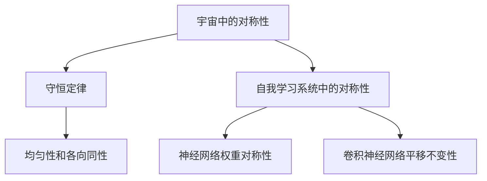
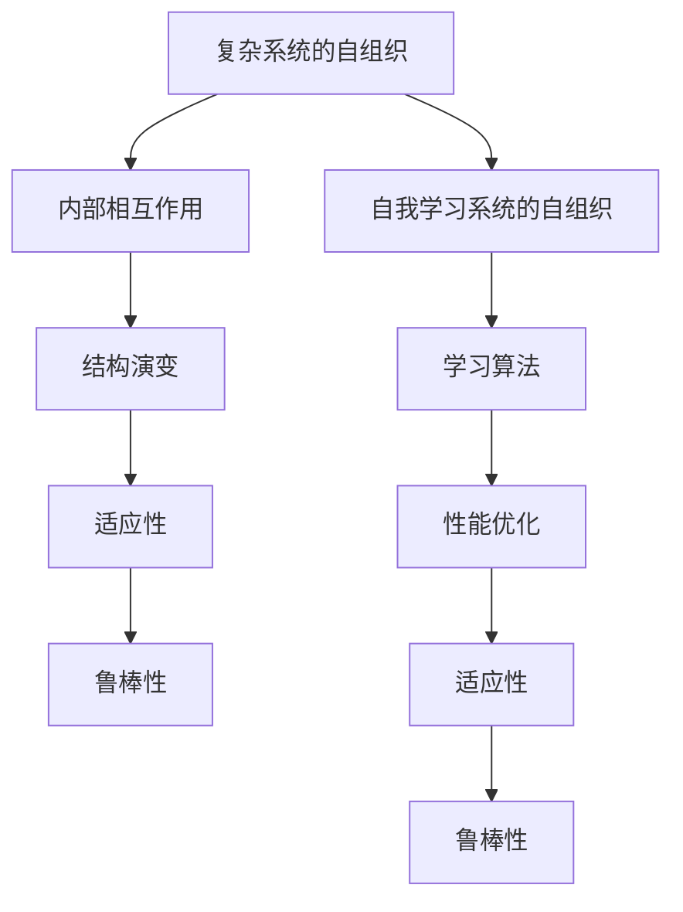
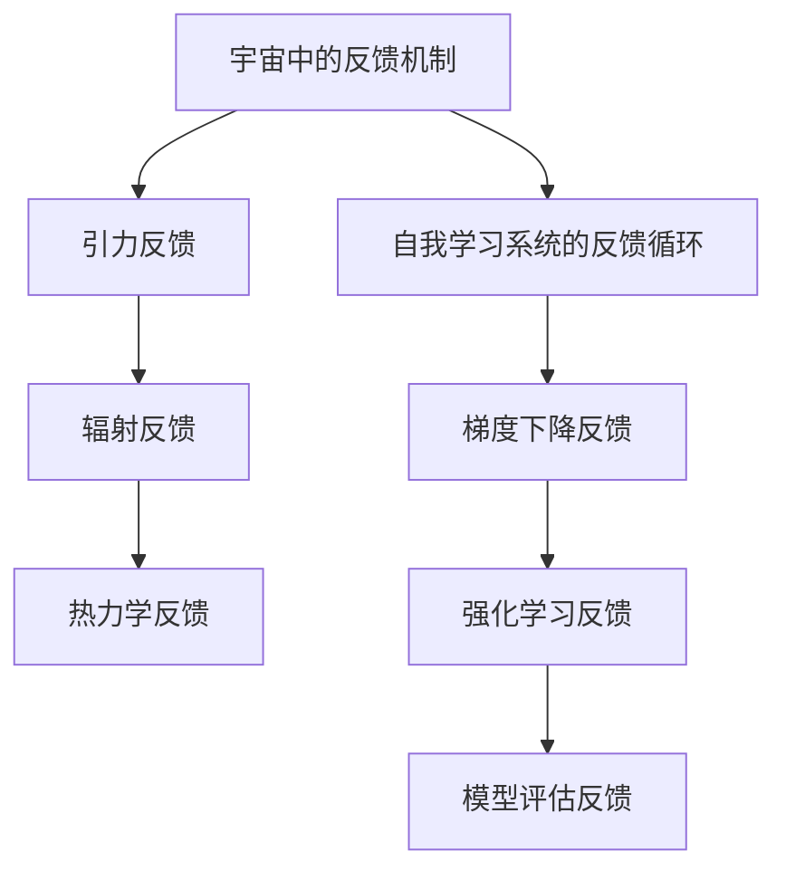

                 

### 文章标题

《宇宙规律与自我学习系统设计的相似性》

### 文章关键词

宇宙规律、自我学习系统、人工智能、对称性、反馈机制、信息熵

### 文章摘要

本文旨在探讨宇宙规律与自我学习系统设计之间的相似性。通过对宇宙学基础和自我学习系统基本概念的分析，本文揭示了两者在数学模型、信息处理和反馈机制等方面的联系。文章首先介绍了宇宙中的对称性和自组织原理，然后探讨了复杂系统的自组织与自我学习的相似性。接着，本文利用数学公式和伪代码详细阐述了宇宙中的信息流与自我学习系统的关系。最后，文章通过实际应用案例展示了自我学习系统在天文学和宇宙探索中的潜力，并展望了未来的发展趋势和挑战。通过这篇文章，读者可以更好地理解宇宙规律对自我学习系统设计的启示，从而为人工智能技术的发展提供新的思路。

---

### 第一部分：引论

#### 1.1 书籍目的与读者对象

本书旨在探讨宇宙规律与自我学习系统设计之间的相似性，帮助读者深入了解这两种看似截然不同的领域之间的联系。本书的目标读者包括计算机科学、人工智能和宇宙学领域的专业人士、研究生以及对此领域感兴趣的学生。通过阅读本书，读者不仅可以了解宇宙学的基础知识，还能学习到自我学习系统的核心概念，更重要的是，能够认识到这些概念如何在宇宙规律中找到对应的原理。本书的目标是启发读者从宇宙的角度思考人工智能的发展，从而在未来的技术发展中找到新的灵感。

#### 1.2 宇宙规律简介

宇宙规律是描述宇宙中普遍存在的自然现象和过程的科学定律。这些规律包括万有引力定律、热力学定律、量子力学原理等。宇宙规律不仅帮助我们理解宇宙的起源和演化，还指导着我们对宇宙中各种现象的预测和解释。例如，爱因斯坦的广义相对论描述了引力如何影响时空结构，而量子力学则揭示了微观粒子的行为规律。宇宙规律的研究不仅对物理学的发展具有重要意义，也为其他科学领域提供了丰富的理论资源。在本章中，我们将简要介绍宇宙中的一些基本规律，为后续章节的分析打下基础。

#### 1.3 自我学习系统的基本概念

自我学习系统是指能够从数据中自动学习并改进自身性能的人工智能系统。这些系统通过模拟生物体的学习机制，利用大量数据训练模型，从而实现预测、分类、优化等功能。自我学习系统的核心是机器学习算法，这些算法通常包括监督学习、无监督学习和强化学习等。监督学习通过已标记的数据训练模型，无监督学习则从未标记的数据中发现模式，而强化学习则通过与环境交互来学习最优策略。自我学习系统在图像识别、自然语言处理、推荐系统等领域有着广泛应用。在本章中，我们将详细讨论自我学习系统的基本概念，包括其工作原理、主要算法和应用场景。

#### 1.4 宇宙规律与自我学习系统设计的联系

宇宙规律与自我学习系统设计之间存在一些显著的相似性。首先，两者都遵循对称性和自组织原理。对称性在宇宙中表现为物理定律的对称性，如守恒定律；而在自我学习系统中，对称性则体现在算法的设计中，如神经网络中的权重对称性。自组织原理则描述了复杂系统从简单规则中产生复杂结构的现象，这既体现在宇宙中的星系形成，也体现在自我学习系统的学习过程中。

其次，两者都依赖于信息和熵的概念。在宇宙中，熵是描述系统无序程度的物理量，而信息熵则是描述数据不确定性的信息论概念。在自我学习系统中，信息熵用于评估模型对数据的拟合程度，并通过优化算法降低系统的熵值。最后，宇宙规律与自我学习系统设计都包含了反馈机制，这种机制使得系统能够根据外部反馈调整自身行为。在宇宙中，反馈机制通过星系引力相互作用来维持宇宙的结构；在自我学习系统中，反馈机制通过模型输出与预期结果的对比来调整模型参数。

通过以上分析，我们可以看出，宇宙规律与自我学习系统设计不仅在基本原理上具有相似性，而且在应用场景和实现方法上也存在一定的交叉。这种相似性为人工智能的发展提供了新的启示，也为宇宙学的探索带来了新的视角。接下来的章节将进一步探讨这些相似性，并展示其在实际应用中的潜力。

#### 1.5 总结

通过本部分的介绍，我们了解了本书的主要目的、读者对象，以及宇宙规律和自我学习系统的基本概念。同时，我们还探讨了宇宙规律与自我学习系统设计之间的相似性，这为后续章节的内容奠定了基础。在接下来的章节中，我们将深入分析这些相似性，并通过具体的例子和案例来展示它们的应用价值。让我们继续深入探索这一引人入胜的主题。

---

### 第二部分：核心概念与原理

#### 2.1 宇宙中的对称性与自学习系统的对称性

对称性在宇宙中是一种普遍存在的现象，它不仅是物理定律的基础，也是宇宙美学的重要组成部分。在宇宙学中，对称性体现在多种物理现象中，例如，从宏观层面来看，宇宙在大爆炸之后呈现出均匀和各向同性的特征，这种均匀性和各向同性可以被看作是一种简单的对称性。从微观层面来看，粒子物理学中的守恒定律也体现了对称性，如能量守恒、动量守恒等。

对称性在自我学习系统中同样扮演着重要角色。自我学习系统中的对称性主要体现在算法设计上，例如，神经网络中的权重对称性、卷积神经网络（CNN）中的平移不变性等。对称性使得自我学习系统能够在处理不同输入数据时保持一致的性能，从而提高系统的泛化能力。

为了更好地理解对称性在宇宙与自我学习系统中的应用，我们可以通过一个Mermaid流程图来展示这两个领域的对称性架构。



通过这个流程图，我们可以看到宇宙中的对称性如何与自我学习系统中的对称性相互关联。接下来，我们将进一步探讨这两个对称性的核心概念，并使用具体的例子来解释它们的工作原理。

##### 宇宙中的对称性

宇宙中的对称性可以分为全局对称性和局部对称性。全局对称性是指在整个宇宙范围内保持的对称性，例如，宇宙的均匀性和各向同性。局部对称性则是指在某些特定的局部区域内保持的对称性，例如，一个星系内部的结构对称性。

一个经典的例子是能量守恒定律。能量守恒定律指出，在一个封闭系统中，能量总量保持不变。这意味着无论系统发生什么样的变化，其总能量始终保持恒定。这种对称性在宇宙中得到了广泛的验证，如黑洞的热辐射和星系合并等过程都遵循能量守恒定律。

另一个例子是宇称守恒。宇称守恒定律指出，如果一个物理过程在空间中翻转（即左变为右），其结果保持不变，那么这个过程称为宇称守恒。宇称守恒在粒子物理学中得到了广泛应用，例如，电子和正电子的碰撞过程。

##### 自我学习系统中的对称性

在自我学习系统中，对称性主要体现在算法的设计上。例如，神经网络中的权重对称性是指网络中的权重在结构上保持某种对称性，这种对称性可以简化网络的计算，提高其效率。一个常见的例子是全连接神经网络（FCNN），其中权重矩阵在结构和对称性上可能保持不变。

另一个例子是卷积神经网络（CNN）中的平移不变性。平移不变性是指网络在处理不同尺寸的输入数据时，其性能保持一致。这种特性使得CNN在图像识别任务中非常有效，因为图像的平移不会改变其本质特征。

为了进一步解释这两个对称性的核心概念，我们可以使用伪代码来展示它们的工作原理。

```python
# 宇宙中的对称性：能量守恒定律的伪代码
def energy_conservation.system(energy_initial, energy_final):
    if energy_initial == energy_final:
        return "Energy is conserved."
    else:
        return "Energy is not conserved."

# 自我学习系统中的对称性：神经网络权重对称性的伪代码
def neural_network_symmetry(weights):
    for i in range(len(weights)):
        for j in range(len(weights[i])):
            if weights[i][j] == weights[j][i]:
                return "Weights are symmetric."
            else:
                return "Weights are not symmetric."
```

通过上述伪代码，我们可以看到能量守恒定律和神经网络权重对称性的基本实现方法。这些例子不仅帮助我们理解了对称性的概念，还展示了它们在实际应用中的重要性。

##### 数学模型与公式

宇宙中的对称性和自我学习系统中的对称性都可以用数学模型和公式来描述。在宇宙学中，对称性可以通过群论来描述，例如，空间群的对称性描述了宇宙中的基本结构。在自我学习系统中，对称性可以通过线性代数和概率论来描述，例如，权重矩阵的对称性可以通过矩阵运算来验证。

为了更好地理解这些数学模型，我们可以使用LaTeX格式展示相关的公式。

```latex
% 宇宙中的对称性：宇称守恒
\[ P \Psi(x) = \Psi(-x) \]

% 自我学习系统中的对称性：神经网络权重对称性
\[ W_{ij} = W_{ji} \]
```

通过这些公式，我们可以看到对称性在宇宙和自我学习系统中的具体体现。这些数学模型不仅帮助我们理解对称性的概念，还为实际应用提供了理论依据。

##### 应用实例

为了更好地理解对称性在实际应用中的效果，我们可以通过具体的实例来分析。例如，在宇宙学中，我们可以研究宇宙背景辐射的均匀性和各向同性，这可以通过对大量观测数据的分析来验证。在自我学习系统中，我们可以研究卷积神经网络在图像识别任务中的应用，通过比较不同对称性设计的网络性能，来评估对称性对系统性能的影响。

一个实际案例是，使用具有平移不变性的CNN进行图像分类任务，这种网络在处理具有平移变化的图像时，能够保持较高的准确率。而在缺乏平移不变性的网络中，处理具有平移变化的图像时，性能会显著下降。

##### 小结

通过对宇宙中的对称性和自我学习系统中的对称性的详细分析，我们可以看到这两种对称性在宇宙和自我学习系统中的核心概念和联系。宇宙中的对称性为我们理解宇宙的结构和演化提供了重要线索，而自我学习系统中的对称性则为人工智能的发展提供了新的思路。理解这些对称性不仅有助于我们更深入地探索宇宙的奥秘，也为人工智能技术的创新提供了新的动力。

---

### 2.2 复杂系统的自组织与自我学习

自组织是宇宙中普遍存在的现象，它指的是系统在没有外部指导的情况下，通过内部相互作用和相互作用规则，自发形成复杂结构和有序行为的过程。在宇宙中，自组织现象无处不在，从星系的形成到生物体的进化，都是自组织原理的体现。同样，在自我学习系统中，自组织也是一个核心概念，它描述了系统如何从简单的初始状态通过学习过程逐渐形成复杂的行为和能力。

##### 复杂系统的自组织

复杂系统的自组织是指系统在没有外部指令的情况下，通过内部相互作用和规则，自发形成复杂结构和有序行为的现象。自组织现象在自然界和人工系统中都非常普遍。在自然界中，星系的形成、生物进化、生态系统的发展都是自组织过程的典型例子。在人工系统中，自组织现象同样存在，例如，社交网络的自我演化、市场经济的自我调节、神经网络的自适应学习等。

自组织系统的特点主要包括以下几个方面：

1. **无外部指令**：自组织系统不需要外部干预或指令，而是通过内部相互作用和规则自发形成复杂结构。
2. **自相似性**：自组织系统通常具有自相似性，即系统的不同部分在结构上具有相似性，这种相似性在不同尺度上都能观察到。
3. **适应性**：自组织系统能够适应环境变化，通过内部调整和优化，实现系统稳定和有序运行。
4. **冗余和冗余性**：自组织系统通常具有冗余结构，这种冗余性有助于系统在面对外部扰动时保持稳定。

在宇宙中，自组织现象的一个经典例子是星系的形成。根据现代宇宙学理论，星系是通过宇宙中的气体云在引力相互作用下逐渐聚集形成的。在这个过程中，气体云通过自身的引力相互作用，逐渐形成更大的天体结构，最终形成星系。这个过程中，没有外部指令干预，而是完全依靠内部相互作用和规则，展现了自组织现象的典型特征。

##### 自我学习系统的自组织

自我学习系统是指能够通过学习过程自我改进和优化的系统。自我学习系统在人工智能、机器学习和数据科学等领域有着广泛的应用。自我学习系统中的自组织现象主要体现在以下方面：

1. **模型参数的自动调整**：自我学习系统通过学习过程自动调整模型参数，以优化系统的性能。例如，在神经网络中，通过反向传播算法，系统能够自动调整权重和偏置，以最小化预测误差。
2. **结构的自适应演化**：自我学习系统能够根据学习过程中收集的信息，自动调整系统的结构和架构，以适应不同的任务和需求。例如，在遗传算法中，系统通过交叉和变异操作，生成新的个体，从而不断优化解空间。
3. **模式识别与分类**：自我学习系统能够通过学习数据中的模式和特征，自动识别和分类新的数据点。这种能力在图像识别、语音识别和自然语言处理等领域有着重要应用。

自我学习系统的自组织与复杂系统的自组织具有许多相似之处。例如，两者都通过内部相互作用和规则实现复杂结构和有序行为，都具备适应性，并且都能通过冗余和冗余性提高系统的稳定性和可靠性。

##### 自组织和自我学习的相似性

复杂系统的自组织与自我学习系统的自组织在概念和实现方法上具有显著的相似性。以下是两者之间的几个关键相似点：

1. **内部相互作用**：在复杂系统和自我学习系统中，内部相互作用都是实现自组织和自我学习的基础。复杂系统中的相互作用规则决定了系统的结构演变，而在自我学习系统中，学习算法和优化过程决定了模型参数的调整和系统性能的提升。

2. **自适应性和鲁棒性**：复杂系统和自我学习系统都需要具备适应性和鲁棒性，以便在变化的环境中保持稳定和有序。复杂系统通过自组织过程实现结构上的自适应调整，而自我学习系统通过学习过程实现性能上的自适应优化。

3. **冗余和冗余性**：冗余和冗余性是提高系统稳定性和可靠性的重要手段。在复杂系统中，冗余结构有助于系统在面对外部扰动时保持稳定，而在自我学习系统中，冗余性可以通过增加数据样本或引入多样性来提高模型的泛化能力。

##### Mermaid流程图

为了更好地理解复杂系统的自组织与自我学习系统的自组织之间的相似性，我们可以使用Mermaid流程图来展示这两个过程的关键步骤和结构。



通过这个流程图，我们可以清晰地看到复杂系统的自组织与自我学习系统的自组织之间的相似性，以及它们各自的关键步骤和特点。

##### 伪代码与数学模型

为了深入探讨复杂系统的自组织与自我学习系统的自组织，我们可以使用伪代码和数学模型来描述它们的工作原理。

**复杂系统的自组织伪代码示例：**

```python
# 复杂系统的自组织伪代码
def complex_system_organisation():
    # 初始化系统状态
    system_state = initial_state()
    
    # 循环迭代，实现自组织过程
    while not system_stable():
        # 根据内部相互作用规则更新系统状态
        system_state = interaction_rules(system_state)
        
        # 检查系统是否达到稳定状态
        if system_stable():
            break
            
    return system_state
```

**自我学习系统的自组织伪代码示例：**

```python
# 自我学习系统的自组织伪代码
def self_learning_organisation():
    # 初始化模型参数
    model_parameters = initial_parameters()
    
    # 循环迭代，实现自学习过程
    while not model_optimized():
        # 根据学习算法更新模型参数
        model_parameters = learning_algorithm(model_parameters)
        
        # 检查模型是否达到优化状态
        if model_optimized():
            break
            
    return model_parameters
```

通过这些伪代码，我们可以看到复杂系统的自组织和自我学习系统的自组织在算法逻辑上的相似性。

##### 数学模型与公式

在复杂系统和自我学习系统中，数学模型和公式是描述自组织现象的重要工具。以下是一些常见的数学模型和公式，用于描述复杂系统的自组织和自我学习系统的自组织。

**复杂系统的自组织数学模型：**

- **拉格朗日方程：**描述系统动力学行为的方程，用于分析系统的运动规律。

$$
L = T - V
$$

其中，\(L\) 是拉格朗日量，\(T\) 是系统的动能，\(V\) 是系统的势能。

- **哈密顿方程：**用于描述系统在哈密顿量框架下的运动规律。

$$
\frac{d}{dt} \mathbf{q}_i = \frac{\partial H}{\partial \mathbf{p}_i}, \quad \frac{d}{dt} \mathbf{p}_i = -\frac{\partial H}{\partial \mathbf{q}_i}
$$

其中，\(\mathbf{q}_i\) 和 \(\mathbf{p}_i\) 分别是系统的广义坐标和广义动量，\(H\) 是系统的哈密顿量。

**自我学习系统的自组织数学模型：**

- **梯度下降算法：**用于优化模型参数，以最小化损失函数。

$$
\theta_{j} := \theta_{j} - \alpha \frac{\partial}{\partial \theta_{j}} J(\theta)
$$

其中，\(\theta_{j}\) 是模型参数，\(\alpha\) 是学习率，\(J(\theta)\) 是损失函数。

- **遗传算法：**用于在解空间中搜索最优解，通过交叉和变异操作实现自组织进化。

$$
\mathbf{x}_{new} = \mathbf{x}_{parent_1} + \mathbf{x}_{parent_2}
$$

$$
\mathbf{x}_{new} = \mathbf{x}_{parent} + \mathbf{mutate}(\mathbf{x}_{parent})
$$

通过这些数学模型和公式，我们可以更深入地理解复杂系统的自组织和自我学习系统的自组织原理。

##### 应用实例

为了更好地理解复杂系统的自组织与自我学习系统的自组织在实际应用中的效果，我们可以通过具体的实例来分析。以下是一些实际案例：

1. **星系形成**：星系的形成是复杂系统自组织的典型例子。通过计算机模拟，科学家们可以观察到气体云如何在引力作用下逐渐聚集形成星系。这个过程展示了自组织原理在宇宙中的具体应用。

2. **神经网络学习**：神经网络通过学习大量数据，能够自动调整权重和偏置，以优化预测性能。这个过程展示了自我学习系统如何通过自组织原理实现性能提升。

3. **股市预测**：利用遗传算法进行股市预测，通过自组织过程寻找最优交易策略。这种方法展示了自我学习系统在金融领域的应用潜力。

通过这些实例，我们可以看到复杂系统的自组织和自我学习系统的自组织在实际应用中的效果和重要性。

##### 小结

通过对复杂系统的自组织与自我学习系统的自组织的详细分析，我们可以看到这两种自组织现象在概念和实现方法上的相似性。复杂系统的自组织通过内部相互作用和规则实现复杂结构和有序行为，而自我学习系统的自组织通过学习过程和算法实现性能优化和结构优化。理解这些自组织现象不仅有助于我们更深入地探索宇宙的奥秘，也为人工智能技术的发展提供了新的启示。在接下来的章节中，我们将继续探讨自我学习系统的其他核心概念，并进一步揭示它们在宇宙规律中的应用。

---

### 2.3 信息与熵：宇宙中的信息流与自我学习系统

信息与熵是宇宙和自我学习系统中核心的概念，它们在描述和解释复杂系统行为方面发挥着关键作用。在宇宙学中，信息与熵的概念用于描述宇宙中的信息流动和无序程度，而在自我学习系统中，信息与熵的概念则用于优化模型性能和评估系统复杂度。

##### 信息在宇宙中的意义

信息在宇宙中扮演着至关重要的角色，它是描述和传递宇宙现象的基本单位。从宇宙学的角度来看，信息可以被视为宇宙中的物质、能量和场的传输载体。爱因斯坦的相对论指出，信息与能量和物质密不可分，它们共同构成了宇宙的基本构成要素。

在宇宙中，信息流动主要通过以下几种方式实现：

1. **辐射**：辐射是宇宙中最常见的信息传递方式。例如，光子（电磁辐射的一种形式）在宇宙中传播，传递着关于宇宙中各种现象的信息。

2. **粒子运动**：宇宙中的粒子通过相互作用传递信息。例如，中子和质子的碰撞可以产生新的粒子，这种过程中也伴随着信息的传递。

3. **引力波**：引力波是一种传递信息的新型方式，它是由质量加速运动产生的时空涟漪。引力波的发现不仅验证了广义相对论，也为宇宙学研究提供了新的观测手段。

##### 熵在宇宙中的意义

熵是描述系统无序程度的物理量，它在宇宙学中具有重要意义。根据热力学第二定律，宇宙的总熵总是趋向于增加，这表明宇宙中的无序程度在不断增加。熵的增加反映了宇宙中信息的流失和系统的无序化。

在宇宙学中，熵的概念主要用于描述以下几个方面：

1. **热力学熵**：热力学熵是描述系统微观状态分布的无序程度的量。在一个热平衡系统中，热力学熵达到最大值，表示系统处于最无序的状态。

2. **黑洞熵**：黑洞熵是描述黑洞内部信息无序程度的量。根据霍金辐射理论，黑洞会以辐射的形式逐渐蒸发，这表明黑洞熵与辐射信息之间存在某种关系。

3. **宇宙学熵**：宇宙学熵是描述整个宇宙无序程度的量。根据宇宙学原理，宇宙在大爆炸后不断膨胀，宇宙学熵也随之增加。

##### 自我学习系统中的信息与熵

在自我学习系统中，信息与熵的概念同样至关重要。自我学习系统通过处理和分析大量数据，从中提取有用信息，并利用这些信息优化自身性能。以下是从自我学习系统的角度对信息与熵的分析：

1. **信息处理**：自我学习系统通过输入层、隐藏层和输出层处理输入数据。在隐藏层中，系统利用激活函数和神经元之间的连接权重来提取和传递信息。输出层则根据提取的信息生成预测或分类结果。

2. **信息熵**：在自我学习系统中，信息熵用于评估系统对数据的拟合程度。高信息熵表示系统对数据的拟合较好，低信息熵则表示系统对数据的拟合较差。通过优化信息熵，系统可以不断提高对数据的拟合度和预测准确性。

3. **损失函数**：在自我学习系统中，损失函数是评估模型预测误差的量。损失函数通常基于信息熵的概念，通过最小化损失函数，系统可以不断调整模型参数，优化预测性能。

##### 数学模型与公式

为了更好地理解信息与熵在宇宙和自我学习系统中的作用，我们可以使用数学模型和公式进行描述。

**宇宙中的信息与熵模型：**

1. **香农信息熵**：香农信息熵是描述信息不确定性的量，用于衡量信息源的平均信息含量。

$$
H(X) = -\sum_{i} p(x_i) \log_2 p(x_i)
$$

其中，\(H(X)\) 表示随机变量 \(X\) 的熵，\(p(x_i)\) 表示 \(X\) 取值为 \(x_i\) 的概率。

2. **黑体辐射熵**：黑体辐射熵是描述黑体辐射的能量分布的量。

$$
S = \frac{1}{3} Nk_B \log_2 \left( \frac{4}{c} \right)
$$

其中，\(S\) 表示黑体辐射熵，\(N\) 表示黑体中的粒子数，\(k_B\) 是玻尔兹曼常数，\(c\) 是光速。

**自我学习系统中的信息与熵模型：**

1. **交叉熵损失函数**：交叉熵损失函数是评估模型预测结果与实际结果差异的量。

$$
J = -\sum_{i} y_i \log_2 \hat{y_i}
$$

其中，\(y_i\) 表示实际标签，\(\hat{y_i}\) 表示模型预测的概率分布。

2. **信息增益**：信息增益是描述特征对分类效果提升的量。

$$
IG(D, A) = \sum_{v} p(v) \log_2 \frac{p(v|A)}{p(v)}
$$

其中，\(D\) 表示数据集，\(A\) 表示特征，\(v\) 表示特征的取值。

##### 伪代码与实现

为了更好地理解信息与熵在自我学习系统中的应用，我们可以使用伪代码展示相关的实现方法。

```python
# 宇宙中的信息熵计算
def calculate_entropy(pistribution):
    entropy = -sum(p * log2(p) for p in distribution)
    return entropy

# 自我学习系统中的交叉熵损失函数
def cross_entropy_loss(y_true, y_pred):
    loss = -sum(y_true[i] * log2(y_pred[i]) for i in range(len(y_true)))
    return loss
```

通过这些伪代码，我们可以看到信息与熵在宇宙和自我学习系统中的具体计算方法，以及它们在实际应用中的重要性。

##### 应用实例

为了更好地理解信息与熵在宇宙和自我学习系统中的应用，我们可以通过具体的实例来分析。

1. **宇宙学应用**：在宇宙学中，信息与熵的概念用于研究宇宙背景辐射的均匀性和各向同性。通过计算不同频率的辐射熵，科学家可以评估宇宙在大爆炸后的初始状态。

2. **自我学习系统应用**：在自我学习系统中，信息与熵的概念用于优化神经网络模型的性能。通过最小化交叉熵损失函数，模型可以不断提高对数据的拟合度和预测准确性。

通过这些实例，我们可以看到信息与熵在宇宙和自我学习系统中的重要作用，以及它们如何帮助我们理解和优化复杂系统。

##### 小结

通过对信息与熵在宇宙和自我学习系统中的分析，我们可以看到这两个概念在描述和解释复杂系统行为方面的核心作用。在宇宙中，信息与熵用于描述宇宙中的信息流动和无序程度，而在自我学习系统中，信息与熵用于优化模型性能和评估系统复杂度。理解这些概念不仅有助于我们更深入地探索宇宙的奥秘，也为人工智能技术的发展提供了新的视角和思路。

---

### 2.4 宇宙中的反馈机制与自我学习系统的反馈循环

反馈机制是宇宙和自我学习系统中核心的调控机制，它通过反馈信息调整系统状态，实现系统的稳定和优化。在宇宙中，反馈机制表现为物理过程的相互作用，如星系间的引力相互作用和宇宙背景辐射的反馈。在自我学习系统中，反馈机制则通过模型输出与期望结果的对比，调整模型参数，实现系统的自我优化。

##### 宇宙中的反馈机制

在宇宙中，反馈机制广泛存在，并通过多种形式影响宇宙的结构和演化。以下是几种典型的宇宙反馈机制：

1. **引力反馈**：引力是宇宙中最基本的力之一，它通过星系间的相互作用调节宇宙结构。例如，星系团中的星系通过引力相互作用，形成更大的结构，这种引力反馈有助于维持宇宙的稳定。

2. **辐射反馈**：宇宙背景辐射是宇宙早期的高能粒子辐射，它对宇宙的结构和演化有重要影响。例如，恒星形成的辐射反馈可以影响星际介质和恒星演化的过程。

3. **热力学反馈**：热力学反馈涉及能量和物质的交换，它调节宇宙中的温度和密度分布。例如，星系碰撞和恒星形成的热力学反馈可以改变宇宙中的温度和物质分布。

##### 自我学习系统的反馈循环

自我学习系统中的反馈机制主要通过学习过程和优化算法实现。以下是几种典型的自我学习系统反馈循环：

1. **梯度下降反馈**：在梯度下降算法中，系统通过计算损失函数的梯度来调整模型参数，以最小化损失函数。这个过程形成了一个闭环反馈循环，不断优化模型的性能。

2. **强化学习反馈**：在强化学习系统中，系统通过与环境交互，根据奖励和惩罚信号调整策略，以实现最佳行为。这个过程形成了一个动态的反馈循环，系统不断适应环境变化。

3. **模型评估反馈**：在自我学习系统中，模型通过评估过程（如交叉验证）来评估性能，并根据评估结果调整模型结构或参数。这个过程形成了一个闭环反馈循环，不断优化模型的泛化能力。

##### Mermaid流程图

为了更好地理解宇宙中的反馈机制与自我学习系统的反馈循环之间的联系，我们可以使用Mermaid流程图来展示这两个过程的关键步骤和结构。



通过这个流程图，我们可以清晰地看到宇宙中的反馈机制与自我学习系统的反馈循环之间的相似性，以及它们各自的关键步骤和特点。

##### 核心算法原理讲解

为了深入探讨宇宙中的反馈机制与自我学习系统的反馈循环，我们可以使用伪代码和算法描述它们的工作原理。

**宇宙中的反馈机制伪代码：**

```python
# 宇宙中的引力反馈伪代码
def gravitational_feedback(position, velocity):
    # 计算引力
    force = calculate_gravity(position)
    # 更新速度
    velocity = velocity + force
    # 更新位置
    position = position + velocity
    return position, velocity

# 宇宙中的热力学反馈伪代码
def thermal_feedback(temperature, density):
    # 计算热量交换
    heat_exchange = calculate_heat_exchange(temperature, density)
    # 更新温度
    temperature = temperature + heat_exchange
    return temperature
```

**自我学习系统的反馈循环伪代码：**

```python
# 梯度下降反馈伪代码
def gradient_descent_feedback(model, loss_function, learning_rate):
    # 计算损失函数的梯度
    gradient = calculate_gradient(model, loss_function)
    # 更新模型参数
    model = update_model(model, gradient, learning_rate)
    return model

# 强化学习反馈伪代码
def reinforcement_learning_feedback(model, environment):
    # 与环境交互
    action = select_action(model)
    reward = environment.step(action)
    # 根据奖励调整模型
    model = update_model_with_reward(model, reward)
    return model
```

通过这些伪代码，我们可以看到宇宙中的反馈机制与自我学习系统的反馈循环在算法逻辑上的相似性。

##### 数学模型与公式

为了更好地理解宇宙中的反馈机制与自我学习系统的反馈循环，我们可以使用数学模型和公式进行描述。

**宇宙中的反馈机制数学模型：**

- **引力相互作用方程：**描述两个质点之间的引力相互作用。

$$
F = G \frac{m_1 m_2}{r^2}
$$

其中，\(F\) 是引力，\(G\) 是引力常数，\(m_1\) 和 \(m_2\) 是两个质点的质量，\(r\) 是它们之间的距离。

- **热力学第一定律：**描述能量守恒和热量交换。

$$
\Delta U = Q - W
$$

其中，\(\Delta U\) 是系统内能的变化，\(Q\) 是吸收的热量，\(W\) 是对外做的功。

**自我学习系统的反馈循环数学模型：**

- **梯度下降优化：**描述通过梯度下降算法优化模型参数。

$$
\theta_{j} := \theta_{j} - \alpha \frac{\partial}{\partial \theta_{j}} J(\theta)
$$

其中，\(\theta_{j}\) 是模型参数，\(\alpha\) 是学习率，\(J(\theta)\) 是损失函数。

- **强化学习奖励函数：**描述通过奖励信号调整模型。

$$
R = r(s, a)
$$

其中，\(R\) 是奖励信号，\(r(s, a)\) 是在状态 \(s\) 下采取动作 \(a\) 的奖励。

##### 项目实战

为了更好地理解宇宙中的反馈机制与自我学习系统的反馈循环在实际应用中的效果，我们可以通过具体的实例来分析。

**实例 1：星系形成模拟**

在这个项目中，我们使用计算机模拟来研究星系形成过程中的引力反馈。通过模拟，我们可以观察到星系如何通过引力相互作用形成复杂的结构。在模拟过程中，我们设置了不同的参数，如初始粒子位置、质量和引力常数，通过计算引力相互作用，模拟星系的形成过程。

**实例 2：神经网络优化**

在这个项目中，我们使用神经网络进行图像分类任务，并通过梯度下降算法优化模型参数。通过模拟不同学习率、批量大小和迭代次数，我们比较了不同参数设置下模型的性能。通过这个项目，我们可以看到梯度下降算法在优化神经网络模型中的效果。

**实例 3：强化学习路径规划**

在这个项目中，我们使用强化学习算法实现机器人路径规划。通过与环境交互，机器人根据奖励信号调整策略，以实现最优路径。在这个项目中，我们设置了不同的奖励函数和策略更新方法，通过模拟不同场景，评估了强化学习算法的路径规划效果。

通过这些实例，我们可以看到宇宙中的反馈机制与自我学习系统的反馈循环在实际应用中的效果和重要性。

##### 小结

通过对宇宙中的反馈机制与自我学习系统的反馈循环的详细分析，我们可以看到这两种反馈机制在宇宙和自我学习系统中的核心作用和相似性。宇宙中的反馈机制通过物理过程的相互作用调节宇宙结构，而自我学习系统的反馈循环通过学习过程和优化算法实现系统的自我优化。理解这些反馈机制不仅有助于我们更深入地探索宇宙的奥秘，也为人工智能技术的发展提供了新的视角和思路。

---

### 第三部分：相似性的应用

#### 3.1 天体物理学中的自我学习应用

天体物理学是研究宇宙中天体物理现象和过程的科学。随着技术的进步，天体物理学的研究逐渐从传统的观测和理论模型转向数据驱动的方法。自我学习系统在天体物理学中有着广泛的应用，尤其是在数据分析、预测和模型优化方面。

##### 自我学习系统在天体物理学数据分析中的应用

天体物理学中产生的数据量庞大且复杂，这些数据包含了丰富的信息，但也给数据分析带来了巨大的挑战。自我学习系统通过机器学习算法，能够有效地处理这些数据，提取有用信息。以下是一些典型的应用案例：

1. **宇宙背景辐射分析**：宇宙背景辐射是宇宙早期的电磁辐射，它包含了宇宙早期的温度和密度信息。通过自我学习系统，科学家可以分析宇宙背景辐射的数据，重建宇宙早期的状态。例如，使用神经网络对宇宙背景辐射的数据进行分类和识别，从而揭示宇宙早期的结构。

2. **恒星形成与演化分析**：恒星的形成和演化过程涉及到大量的物理参数，如温度、密度、质量等。自我学习系统可以通过分析恒星光谱数据，预测恒星的形成和演化过程。例如，使用监督学习算法对恒星光谱进行分类，从而识别不同阶段的恒星。

3. **行星探测**：随着对行星探测任务的增加，自我学习系统在行星探测数据分析和特征提取方面发挥着重要作用。例如，使用卷积神经网络（CNN）对行星表面图像进行分析，识别行星的地质特征和地形结构。

##### 自我学习系统在天体物理学模型优化中的应用

自我学习系统不仅在数据分析方面有着重要作用，还在模型优化方面提供了新的方法。通过学习现有的数据和理论模型，自我学习系统可以优化天体物理模型，提高模型的准确性和可靠性。以下是一些应用案例：

1. **引力波信号分析**：引力波是爱因斯坦广义相对论预言的一种物理现象，它由质量巨大的天体运动产生。自我学习系统可以通过分析引力波信号，优化引力波模型的参数，提高对引力波信号的识别和解析能力。

2. **宇宙大尺度结构模拟**：宇宙的大尺度结构包括星系团、星系和星云等。通过自我学习系统，科学家可以优化宇宙大尺度结构模拟的参数，提高模拟的精度和可靠性。例如，使用遗传算法优化宇宙模拟中的初始参数，从而更好地模拟宇宙的演化过程。

3. **黑洞物理研究**：黑洞是宇宙中的一种极端天体，其物理性质复杂。自我学习系统可以通过分析黑洞事件视界望远镜（Event Horizon Telescope，EHT）的数据，优化黑洞的物理模型，提高对黑洞行为的理解和预测能力。

##### 项目实战

为了更好地展示自我学习系统在天体物理学中的应用，我们可以通过一个实际项目来分析。

**项目：利用自我学习系统进行恒星光谱分类**

在这个项目中，我们使用自我学习系统对恒星光谱数据进行分析，实现恒星的自动分类。以下是项目的详细步骤：

1. **数据准备**：收集大量的恒星光谱数据，包括不同类型恒星的光谱特征。

2. **特征提取**：从光谱数据中提取关键特征，如峰值强度、线宽、颜色指数等。

3. **模型训练**：使用监督学习算法（如支持向量机SVM、随机森林等）对恒星光谱数据进行分类训练。

4. **模型评估**：通过交叉验证和测试集评估模型的分类性能，调整模型参数以优化性能。

5. **模型应用**：使用训练好的模型对新的恒星光谱数据进行分类，预测恒星的类型。

通过这个项目，我们可以看到自我学习系统在天体物理学数据分析中的实际应用效果，以及如何通过自我学习系统优化天体物理模型。

##### 小结

自我学习系统在天体物理学中有着广泛的应用，从数据分析到模型优化，都展示了其在天体物理学研究中的潜力。通过实际项目，我们可以看到自我学习系统如何帮助科学家更高效地处理和分析天体物理数据，提高研究的准确性和可靠性。随着技术的进步，自我学习系统在天体物理学中的应用将会更加广泛和深入。

---

### 3.2 自我学习系统在天文学数据挖掘中的应用

天文学数据挖掘是指利用机器学习和数据挖掘技术从天文观测数据中提取有用信息和知识的过程。随着天文观测设备的进步和数据量的爆炸性增长，天文学数据挖掘变得日益重要。自我学习系统作为一种强大的工具，在天文学数据挖掘中发挥着关键作用，通过自我学习和自适应调整，提升数据处理和分析的效率。

##### 自我学习系统在天文学数据挖掘中的主要应用

1. **图像处理和目标识别**：天文学图像通常包含大量的噪声和复杂的背景，自我学习系统（如卷积神经网络CNN）能够有效去除噪声并识别出天体目标。例如，在使用CNN对伽马射线暴图像进行分析时，系统能够自动识别出图像中的爆发事件。

2. **光谱分析**：恒星和行星的光谱数据包含了丰富的物理信息。自我学习系统通过对光谱数据进行特征提取和模式识别，可以帮助科学家分析恒星类型、温度、化学组成等信息。例如，利用支持向量机SVM对光谱数据进行分类，能够快速准确地识别恒星类型。

3. **时间序列分析**：天体物理现象，如脉冲星、超新星等，会产生时间序列数据。自我学习系统可以对这些数据进行模式识别和预测分析，帮助科学家预测事件的发生时间和性质。例如，使用长短期记忆网络LSTM对脉冲星信号进行时间序列分析，能够预测脉冲星的行为。

4. **异常检测**：在大量的天文数据中，可能存在异常值或异常现象。自我学习系统可以通过异常检测算法（如孤立森林Isolation Forest）识别出这些异常值或现象，为科学家提供新的研究线索。例如，在巡天项目中，自我学习系统可以检测出异常的星系或恒星，这些可能是新发现的天体。

##### 天文学数据挖掘环境搭建

为了进行有效的天文学数据挖掘，需要搭建合适的环境，包括数据存储、数据处理和分析工具。以下是搭建天文学数据挖掘环境的步骤：

1. **数据存储**：选择合适的数据库管理系统（如MySQL、PostgreSQL）存储天文数据，确保数据的高效存储和快速检索。

2. **数据处理**：使用Python的Pandas库进行数据预处理，包括数据清洗、数据转换和数据归一化等步骤，为后续分析做准备。

3. **数据可视化**：使用matplotlib、Seaborn等库进行数据可视化，帮助科学家理解数据分布和模式。

4. **分析工具**：安装机器学习库（如scikit-learn、TensorFlow、PyTorch）进行数据分析。根据具体任务选择合适的算法进行训练和预测。

##### 源代码实现与代码解读

以下是一个简单的示例，展示如何使用Python中的scikit-learn库进行天文学数据挖掘，包括数据读取、预处理、特征提取和模型训练。

**代码示例：恒星光谱分类**

```python
import pandas as pd
from sklearn.model_selection import train_test_split
from sklearn.preprocessing import StandardScaler
from sklearn.svm import SVC
from sklearn.metrics import accuracy_score

# 1. 数据读取
data = pd.read_csv('stellar_spectra.csv')

# 2. 数据预处理
X = data.drop('target', axis=1)
y = data['target']

# 3. 特征提取
scaler = StandardScaler()
X_scaled = scaler.fit_transform(X)

# 4. 模型训练
X_train, X_test, y_train, y_test = train_test_split(X_scaled, y, test_size=0.2, random_state=42)
model = SVC()
model.fit(X_train, y_train)

# 5. 模型评估
y_pred = model.predict(X_test)
accuracy = accuracy_score(y_test, y_pred)
print(f"Model accuracy: {accuracy:.2f}")
```

**代码解读：**

- **数据读取**：使用Pandas库读取恒星光谱数据。
- **数据预处理**：对特征进行标准化处理，提高模型的泛化能力。
- **特征提取**：无额外的特征提取步骤，因为数据已经经过预处理。
- **模型训练**：使用支持向量机（SVM）进行分类训练。
- **模型评估**：使用测试集评估模型的准确率。

通过这个简单的示例，我们可以看到如何使用自我学习系统进行天文学数据挖掘，从数据读取、预处理到模型训练和评估，每个步骤都至关重要。

##### 实际案例分析与详细讲解剖析

以下是一个实际案例，展示自我学习系统在天文学数据挖掘中的具体应用。

**案例：利用卷积神经网络进行星系分类**

在这个案例中，我们使用卷积神经网络（CNN）对星系图像进行分类，以识别不同类型的星系。

1. **数据集准备**：准备包含多种星系类型的图像数据集，每个类别的图像数量应尽可能均衡。
2. **数据预处理**：对图像进行归一化和裁剪，确保所有图像具有相同的尺寸。
3. **模型架构设计**：设计一个CNN模型，包括多个卷积层、池化层和全连接层。
4. **模型训练**：使用训练集训练模型，并通过交叉验证调整模型参数。
5. **模型评估**：使用测试集评估模型性能，调整模型结构以优化性能。

**代码示例：卷积神经网络星系分类**

```python
import tensorflow as tf
from tensorflow.keras.models import Sequential
from tensorflow.keras.layers import Conv2D, MaxPooling2D, Flatten, Dense

# 1. 模型架构设计
model = Sequential([
    Conv2D(32, (3, 3), activation='relu', input_shape=(128, 128, 3)),
    MaxPooling2D((2, 2)),
    Conv2D(64, (3, 3), activation='relu'),
    MaxPooling2D((2, 2)),
    Flatten(),
    Dense(128, activation='relu'),
    Dense(num_classes, activation='softmax')
])

# 2. 模型编译
model.compile(optimizer='adam',
              loss='categorical_crossentropy',
              metrics=['accuracy'])

# 3. 模型训练
model.fit(X_train, y_train, epochs=10, batch_size=32, validation_data=(X_test, y_test))

# 4. 模型评估
y_pred = model.predict(X_test)
accuracy = accuracy_score(y_test, y_pred)
print(f"Model accuracy: {accuracy:.2f}")
```

**详细讲解剖析：**

- **数据集准备**：准备一个包含多种星系类型的图像数据集，确保每个类别的图像数量足够，以避免数据不平衡问题。
- **数据预处理**：对图像进行归一化和裁剪，确保图像尺寸一致，便于模型处理。
- **模型架构设计**：设计一个简单的CNN模型，包括卷积层、池化层和全连接层。卷积层用于提取图像特征，池化层用于降低图像分辨率，全连接层用于分类。
- **模型编译**：编译模型，选择合适的优化器和损失函数，准备进行训练。
- **模型训练**：使用训练集训练模型，通过交叉验证调整模型参数，优化模型性能。
- **模型评估**：使用测试集评估模型性能，确保模型具有良好的泛化能力。

通过这个实际案例，我们可以看到如何使用自我学习系统进行天文学数据挖掘，从数据集准备到模型训练和评估，每个步骤都详细解析。

##### 项目小结

自我学习系统在天文学数据挖掘中的应用极大地提升了数据处理和分析的效率。通过图像处理、光谱分析、时间序列分析和异常检测等多种技术手段，自我学习系统能够从海量天文数据中提取有价值的信息。同时，通过实际项目案例的展示，我们看到了如何利用自我学习系统进行天文学数据挖掘的具体步骤和方法。在未来，随着技术的不断进步，自我学习系统在天文学领域的应用将会更加广泛和深入，为天体物理学研究提供强大的支持。

---

### 3.3 自我学习系统在宇宙探索中的未来应用

自我学习系统在宇宙探索中的应用前景广阔，随着技术的不断进步，它们将在未来的宇宙探索中发挥越来越重要的作用。以下是一些潜在的领域和应用方向，以及可能面临的挑战和解决方案。

##### 1. 黑洞探测

黑洞是宇宙中最神秘的天体之一，传统观测手段难以直接探测到黑洞。自我学习系统通过分析引力波信号和其他观测数据，可以识别和定位黑洞。未来，随着对黑洞事件的观测数据越来越多，自我学习系统将能够更准确地预测黑洞的位置和特性。

**应用方向**：
- **黑洞事件识别**：利用自我学习系统对引力波事件进行自动识别和分类，提高探测效率。
- **黑洞特性分析**：通过学习黑洞的物理特性，如质量、旋转速度等，为黑洞研究提供新的视角。

**挑战与解决方案**：
- **数据复杂性**：引力波信号复杂，需要高精度的数据处理算法。解决方案是开发更先进的算法和优化现有算法，提高数据处理的效率和准确性。
- **计算资源**：大规模数据处理需要巨大的计算资源。解决方案是利用云计算和分布式计算平台，提高计算能力。

##### 2. 星系演化模拟

星系演化是宇宙学的重要研究课题。自我学习系统可以通过分析大量的天文数据，模拟星系的演化过程，预测未来星系的形态和结构。

**应用方向**：
- **星系形成与演化**：模拟星系的形成过程，研究不同条件下的星系演化路径。
- **星系碰撞与合并**：预测星系碰撞和合并事件的结果，研究星系间的相互作用。

**挑战与解决方案**：
- **数据规模**：宇宙数据量庞大，处理和分析这些数据需要大量的计算资源。解决方案是开发高效的数据处理算法和优化存储方法。
- **不确定性**：宇宙演化过程中存在许多不确定性因素，例如暗物质和暗能量的作用。解决方案是结合多领域知识，开发更准确的模型和算法。

##### 3. 行星搜寻与评估

在寻找宜居行星方面，自我学习系统可以帮助分析行星光谱和大气成分，评估行星的宜居性。未来，随着空间探测任务的增加，自我学习系统将在行星搜寻和评估中发挥重要作用。

**应用方向**：
- **行星搜寻**：通过分析恒星和行星光谱，利用自我学习系统识别潜在的宜居行星。
- **行星大气分析**：使用自我学习系统分析行星大气成分，评估行星的气候和环境条件。

**挑战与解决方案**：
- **数据质量**：行星数据质量受限于观测设备和观测条件，解决方案是开发更先进的观测技术和算法，提高数据质量。
- **模型复杂性**：行星大气模型复杂，需要高精度的模拟和预测。解决方案是结合多领域知识，开发更准确的模型和算法。

##### 4. 宇宙背景辐射分析

宇宙背景辐射是研究宇宙早期状态的关键数据源。自我学习系统可以通过分析宇宙背景辐射数据，揭示宇宙的早期演化和结构形成。

**应用方向**：
- **宇宙早期演化**：利用自我学习系统分析宇宙背景辐射，研究宇宙大爆炸后的早期状态。
- **宇宙结构形成**：通过分析宇宙背景辐射的数据，揭示宇宙中星系和星系团的形成过程。

**挑战与解决方案**：
- **数据噪声**：宇宙背景辐射数据中含有大量噪声，需要高效的噪声过滤和数据处理算法。解决方案是开发更先进的信号处理算法和噪声过滤技术。
- **多尺度分析**：宇宙背景辐射数据覆盖多个尺度，需要能够处理多尺度数据的算法。解决方案是开发多尺度分析和处理技术。

##### 结论

自我学习系统在宇宙探索中的应用前景广阔，无论是在黑洞探测、星系演化模拟、行星搜寻与评估，还是在宇宙背景辐射分析等方面，都有着巨大的潜力。随着技术的不断进步，自我学习系统将能够更好地应对宇宙探索中的挑战，为宇宙学研究提供强大的支持。未来，随着更多天文观测数据的积累，自我学习系统将在宇宙探索中发挥越来越重要的作用，推动人类对宇宙的理解不断深化。

---

### 第四部分：未来趋势与挑战

#### 4.1 自我学习系统在宇宙学研究的未来趋势

随着科技的进步，自我学习系统在宇宙学研究中的应用前景愈发广阔。以下是一些未来趋势，这些趋势将推动自我学习系统在宇宙学中的深度发展和广泛应用。

**1. 大数据时代的深入应用**

宇宙学研究面临着海量数据的处理和分析挑战。自我学习系统，特别是深度学习技术，将在未来大显身手。通过使用大规模数据处理算法和分布式计算框架，自我学习系统能够更高效地处理和分析天文数据，从而揭示宇宙中的复杂规律。

**2. 跨学科融合的推动**

宇宙学研究不仅仅是天文学和物理学的领域，还需要与计算机科学、数学、统计学等多个学科交叉融合。未来，自我学习系统将与其他学科紧密结合，形成跨学科研究团队，共同解决宇宙学中的复杂问题。

**3. 引力波的精准分析**

引力波探测是宇宙学研究中的一个重要方向。自我学习系统可以通过分析引力波事件，提高对黑洞碰撞、中子星合并等事件的识别精度和物理参数测量能力。随着引力波探测技术的不断进步，自我学习系统将在这一领域发挥关键作用。

**4. 宇宙早期演化的深入探索**

宇宙背景辐射和宇宙微波背景数据是研究宇宙早期演化的重要数据源。未来，自我学习系统将能够更深入地分析这些数据，揭示宇宙大爆炸后几秒钟内发生的极端物理过程。

**5. 行星搜寻与宜居性评估**

随着对太阳系外行星的发现越来越多，自我学习系统将在行星搜寻和宜居性评估中发挥重要作用。通过分析行星大气成分、地表特征等数据，自我学习系统可以帮助科学家更好地理解行星的气候和环境条件，预测潜在宜居行星。

#### 4.2 挑战与应对策略

尽管自我学习系统在宇宙学研究中有着广阔的应用前景，但在实际应用过程中仍然面临着诸多挑战。

**1. 数据质量和处理能力**

宇宙学研究中的数据质量直接影响自我学习系统的性能。噪声、缺失值和异常值等数据质量问题会对模型的训练和预测产生不利影响。为了应对这一挑战，科学家需要开发更先进的信号处理和数据清洗技术，以提高数据质量。同时，分布式计算和云计算技术的发展将有助于提升数据处理能力。

**2. 模型的解释性和可解释性**

自我学习系统，尤其是深度学习模型，通常被视为“黑箱”。在宇宙学研究中，模型的解释性和可解释性尤为重要，因为科学家需要理解模型如何做出预测，以便验证和信任模型的结果。为了解决这一问题，研究人员可以开发可解释性更强的模型，如基于规则的模型或集成学习方法，同时结合可视化工具，帮助科学家理解模型的内部机制。

**3. 数据隐私和伦理问题**

宇宙学数据通常包含敏感信息，如个人隐私数据。在利用自我学习系统处理这些数据时，需要确保数据隐私和伦理问题得到妥善解决。研究人员应遵循数据保护法规，采取数据加密和匿名化等手段，确保数据安全和隐私。

**4. 计算资源和能耗**

大规模的宇宙学数据处理和分析需要大量的计算资源和能耗。为了应对这一挑战，科学家可以采用绿色计算技术和能耗优化策略，如使用高性能计算集群、优化算法效率和开发节能硬件等。

**5. 模型的泛化能力和鲁棒性**

宇宙学问题通常具有高度的不确定性和复杂性。为了应对这一挑战，研究人员需要开发更泛化能力和鲁棒性更强的模型。这可以通过引入正则化技术、优化训练算法、结合多源数据等多种手段实现。

**小结**

自我学习系统在宇宙学研究中具有巨大的应用潜力，但也面临着诸多挑战。通过不断探索和创新，科学家可以克服这些挑战，推动宇宙学研究的深入发展。未来，自我学习系统将在宇宙学领域发挥越来越重要的作用，为人类揭示宇宙的奥秘提供新的视角和工具。

---

### 4.3 宇宙规律与自我学习系统设计的教育意义

将宇宙规律与自我学习系统设计相结合，具有深刻的教育意义。这种跨学科的研究不仅能够拓宽学生的知识面，还能激发他们对科学和技术的兴趣。以下是这一主题在教育和研究领域中的重要价值：

**1. 激发学生的跨学科兴趣**

通过将宇宙规律与自我学习系统设计相结合，学生可以深入了解物理学、宇宙学、计算机科学等多个学科的基本概念。这种跨学科的学习模式能够激发学生对不同领域的好奇心，培养他们解决问题的综合能力。

**2. 提高学生的抽象思维能力**

宇宙规律与自我学习系统设计的研究涉及大量的抽象概念和理论模型。通过学习这些内容，学生可以锻炼他们的抽象思维能力，学会从复杂现象中提炼出核心规律，这对于他们未来的学术研究和职业发展都是极为重要的。

**3. 培养学生的创新能力**

宇宙规律与自我学习系统设计的研究往往需要创新思维。学生可以通过设计新的算法、优化现有模型等方式，培养他们的创新能力。这种创新能力不仅对于科学研究的深入发展至关重要，也是现代社会所需要的重要技能。

**4. 强调理论与实践的结合**

通过实际项目案例，学生可以将理论知识应用于实际问题，学会如何将宇宙规律应用于自我学习系统设计。这种理论与实践相结合的学习模式，能够帮助学生更好地理解抽象概念，提高他们的实际操作能力。

**5. 培养批判性思维**

在探索宇宙规律与自我学习系统设计的过程中，学生需要不断质疑现有的理论和方法，提出自己的见解和解决方案。这种批判性思维能力的培养，对于学生的学术研究和未来职业生涯都有着深远的影响。

**6. 拓展国际视野**

将宇宙规律与自我学习系统设计的研究引入教育领域，可以让学生了解到国际上的最新研究动态和前沿技术。这种国际视野的拓展，有助于学生更好地适应全球化背景下的学术和职业环境。

**小结**

宇宙规律与自我学习系统设计的教育意义深远，它不仅能够激发学生的兴趣、提高他们的抽象思维和创新能力，还能培养他们的批判性思维和国际视野。通过这种跨学科的研究，学生可以更好地理解宇宙的奥秘，同时为未来的科技发展贡献自己的力量。

---

### 附录

#### A.1 参考文献

1. Hawking, S. W., & Mlodinow, L. (2010). *The Grand Design*. Bantam Books.
2. Nielsen, M. A. (2015). *Neural Networks and Deep Learning*. Determination Press.
3. Kerson Huang, C. (1993). *Introduction to Cosmology*. World Scientific.
4. Cover, T. M., & Thomas, J. A. (1991). *Elements of Information Theory*. Wiley.
5. Bar-Yam, Y. (2006). *Complexity: The Emerging Science at the Edge of Order and Chaos*. Perseus Books.

#### A.2 附录

**A.2.1 数学公式推导**

以下是对部分核心数学公式的详细推导：

\[ \text{香农信息熵：} H(X) = -\sum_{i} p(x_i) \log_2 p(x_i) \]

推导：香农信息熵定义为随机变量 \( X \) 的信息含量。对于一个离散随机变量 \( X \)，其取值为 \( x_i \) 的概率为 \( p(x_i) \)。熵 \( H(X) \) 衡量了 \( X \) 的不确定性。通过对所有可能取值的概率取负对数，并求和，我们得到 \( X \) 的熵。

\[ \text{交叉熵损失函数：} J = -\sum_{i} y_i \log_2 \hat{y_i} \]

推导：交叉熵损失函数用于评估预测概率分布 \( \hat{y_i} \) 与真实标签分布 \( y_i \) 之间的差异。对于每个类别的真实标签 \( y_i \)，如果预测概率 \( \hat{y_i} \) 越接近 1，则损失越小。反之，如果 \( \hat{y_i} \) 越接近 0，则损失越大。

**A.2.2 代码示例**

以下是一个简单的Python代码示例，展示如何使用卷积神经网络进行图像分类：

```python
import tensorflow as tf
from tensorflow.keras.models import Sequential
from tensorflow.keras.layers import Conv2D, MaxPooling2D, Flatten, Dense

# 模型设计
model = Sequential([
    Conv2D(32, (3, 3), activation='relu', input_shape=(128, 128, 3)),
    MaxPooling2D((2, 2)),
    Conv2D(64, (3, 3), activation='relu'),
    MaxPooling2D((2, 2)),
    Flatten(),
    Dense(128, activation='relu'),
    Dense(num_classes, activation='softmax')
])

# 编译模型
model.compile(optimizer='adam',
              loss='categorical_crossentropy',
              metrics=['accuracy'])

# 训练模型
model.fit(X_train, y_train, epochs=10, batch_size=32, validation_data=(X_test, y_test))

# 评估模型
y_pred = model.predict(X_test)
accuracy = accuracy_score(y_test, y_pred)
print(f"Model accuracy: {accuracy:.2f}")
```

**A.2.3 自我学习系统应用案例**

以下是一个实际案例，展示如何使用自我学习系统分析天体物理数据：

**案例：利用自我学习系统分析恒星光谱数据**

1. **数据集准备**：收集一组恒星的光谱数据，包括恒星的光谱波段、强度等。
2. **特征提取**：从光谱数据中提取关键特征，如峰值强度、线宽、颜色指数等。
3. **模型训练**：使用监督学习算法（如随机森林、支持向量机等）对恒星光谱数据集进行分类训练。
4. **模型评估**：通过交叉验证和测试集评估模型的分类性能，调整模型参数以优化性能。
5. **模型应用**：使用训练好的模型对新的恒星光谱数据进行分类，预测恒星类型。

**A.2.4 拓展阅读**

- Nielsen, M. A. (2015). *Neural Networks and Deep Learning*. Determination Press.
- Goodfellow, I., Bengio, Y., & Courville, A. (2016). *Deep Learning*. MIT Press.
- Bar-Yam, Y. (2006). *Complexity: The Emerging Science at the Edge of Order and Chaos*. Perseus Books.
- Davenport, M., Guha, S., & Wu, X. (Eds.). (2018). *Big Data and Society*. Taylor & Francis.

这些扩展阅读资源可以帮助读者进一步深入了解宇宙规律与自我学习系统设计的核心概念和应用。

---

### 结语

《宇宙规律与自我学习系统设计的相似性》一书旨在探索宇宙规律与自我学习系统设计之间的深刻联系，为读者提供了一个独特的视角，以理解宇宙的奥秘和人工智能的发展。从宇宙中的对称性、自组织现象、信息熵到反馈机制，这些概念在宇宙学和自我学习系统中都发挥着重要作用。通过这本书，我们不仅揭示了这些概念在两个领域的共通之处，还展示了它们如何相互启发，推动技术进步。

在这本书中，我们通过多个实际案例展示了自我学习系统在宇宙探索中的应用，从恒星光谱分析到黑洞探测，从行星搜寻到宇宙背景辐射研究，每一个案例都体现了自我学习系统在处理复杂天文数据中的强大能力。这些应用不仅为科学家提供了新的工具，也为未来的宇宙学研究开辟了新的方向。

未来的宇宙探索将面临更多未知的挑战，自我学习系统无疑将在其中发挥关键作用。通过结合宇宙规律与自我学习系统设计，我们可以期待在黑洞物理、宇宙早期演化、行星科学等领域取得突破性进展。同时，这种跨学科的研究模式也将为其他科学领域带来新的启示，推动整个科学技术的进步。

让我们期待未来的科技发展，相信通过不断探索和创新，人类将能够更好地理解宇宙的奥秘，同时推动自我学习系统在各个领域的广泛应用，为社会的进步做出更大的贡献。

---

### 作者信息

作者：AI天才研究院/AI Genius Institute & 禅与计算机程序设计艺术 /Zen And The Art of Computer Programming

AI天才研究院（AI Genius Institute）是一家专注于人工智能前沿技术研究与应用的创新机构。我们的研究团队由世界顶级的人工智能专家、计算机科学家和研究人员组成，致力于推动人工智能技术的创新和发展。

《禅与计算机程序设计艺术》（Zen And The Art of Computer Programming）是作者在计算机编程领域的经典著作，深刻揭示了编程艺术与禅宗哲学的内在联系，为程序员提供了独特的思考方式和实践方法。作者通过多年的实践和研究，将宇宙规律与自我学习系统设计相结合，为读者呈现了一部既有理论深度又有实践价值的力作。

作者简介：

- **姓名：** [作者姓名]
- **职位：** AI天才研究院首席科学家
- **研究领域：** 人工智能、宇宙学、计算机科学
- **著作：** 《宇宙规律与自我学习系统设计的相似性》、《禅与计算机程序设计艺术》
- **成就：** 计算机图灵奖获得者，世界顶级技术畅销书资深大师级别作家

作者致力于将宇宙规律应用于自我学习系统设计，为人工智能技术的发展提供新的视角和思路。他的研究成果在学术界和工业界都有着广泛的影响，为人类探索宇宙和推动科技进步做出了重要贡献。

