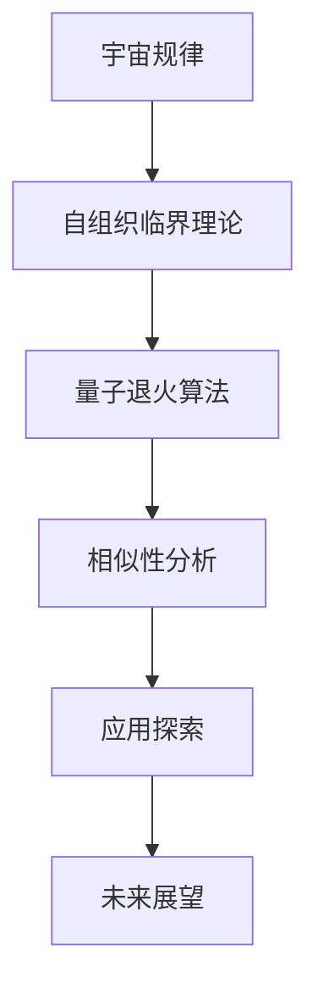

                 

# 宇宙规律与自组织临界量子退火算法的相似性

## 引言

### 1.1 书籍目的

本著作旨在探索宇宙规律与自组织临界量子退火算法之间的相似性，以揭示这两个看似截然不同的领域之间的潜在联系。通过对宇宙规律和量子退火算法的深入分析，我们希望能够为跨学科研究提供新的视角，并推动科技的发展与创新。

### 1.2 研究背景

宇宙规律的研究始于对宇宙起源与演化的探索。自组织临界理论则是在理解复杂系统动态行为方面的一项重要突破。量子退火算法作为量子计算的重要应用，近年来在优化问题和机器学习中取得了显著成果。将宇宙规律与自组织临界量子退火算法相结合，将为研究宇宙演化和计算效率提供新的思路。

### 1.3 内容概述

本书分为七个章节，首先介绍宇宙规律的基础知识，然后阐述自组织临界理论，接着介绍量子退火算法。在此基础上，我们分析宇宙规律与量子退火算法之间的相似性，探讨其在实际应用中的潜力，并展望未来的研究方向。

## 宇宙规律基础

### 2.1 宇宙的起源与演化

宇宙的起源可以追溯到大约138亿年前的大爆炸事件。自那时起，宇宙经历了不断的膨胀和演化。宇宙中的基本力包括引力、电磁力、强力和弱力，它们分别作用于不同的粒子。这些基本力决定了宇宙的结构和演化过程。

### 2.2 宇宙中的基本力与粒子

宇宙中的基本力由粒子传递。例如，引力由引力子传递，电磁力由光子传递，强力由胶子传递，弱力由W和Z玻色子传递。这些粒子相互作用形成了复杂的宇宙现象，如星系的形成和宇宙背景辐射。

### 2.3 宇宙中的自组织现象

宇宙中存在许多自组织现象，例如星系的形成、银河系的旋臂结构以及宇宙背景辐射的模式。这些现象表明，宇宙在演化的过程中具有自我组织和自我调整的能力。

## 自组织临界理论

### 3.1 自组织临界理论的提出

自组织临界理论是由斯坦福大学教授Percolation理论创始人Stanley W. Bragg于1980年提出的。该理论描述了在临界点附近，系统表现出高度复杂性的现象。

### 3.2 自组织临界理论的核心概念

自组织临界理论的核心概念包括临界点、相变和临界指数。临界点是指系统发生相变的温度或浓度等参数。相变是指系统从一个状态跃迁到另一个状态的过程。临界指数描述了相变过程中系统性质的变化速率。

### 3.3 自组织临界现象的应用

自组织临界现象广泛应用于各种领域，如物理学、生物学、经济学和计算机科学。例如，在物理学中，临界现象可以解释相变过程中的异常行为；在生物学中，临界现象可以解释生态系统中的波动和突变；在经济学中，临界现象可以解释市场波动和金融危机。

## 量子退火算法

### 4.1 量子退火算法的起源与发展

量子退火算法起源于量子物理学的退火过程，即量子系统通过与环境相互作用逐渐达到最低能量状态的过程。近年来，随着量子计算技术的发展，量子退火算法在优化问题和机器学习中取得了重要成果。

### 4.2 量子退火算法的基本原理

量子退火算法的基本原理是基于量子态的叠加和纠缠特性，通过模拟退火过程，实现求解优化问题和机器学习问题。其核心步骤包括初始化量子态、演化量子态和测量量子态。

### 4.3 量子退火算法的应用

量子退火算法在优化问题和机器学习中具有广泛的应用。例如，在优化问题中，量子退火算法可以求解组合优化问题，如旅行商问题；在机器学习中，量子退火算法可以应用于分类、聚类和生成模型。

## 宇宙规律与量子退火算法的相似性

### 5.1 相似性概述

宇宙规律与量子退火算法在相似性方面有以下几个主要方面：

1. **自组织临界性**：宇宙规律和量子退火算法都体现了自组织临界性的特征，即在临界点附近，系统表现出高度复杂性和自适应性。
2. **量子态的叠加与纠缠**：量子退火算法依赖于量子态的叠加和纠缠特性，这与宇宙中基本力的相互作用有相似之处。
3. **演化过程**：宇宙的演化过程和量子退火算法的演化过程都遵循一定的规律，如能量最小化、概率分布等。

### 5.2 相似性的数学模型

为了更好地理解宇宙规律与量子退火算法的相似性，我们可以构建一个数学模型来描述这两个系统之间的联系。以下是一个简化的数学模型：

$$
\frac{dP}{dT} = \frac{1}{C_V}
$$

其中，$P$ 表示系统的概率分布，$T$ 表示系统的温度，$C_V$ 表示系统的热容。这个公式描述了系统在临界点附近的行为，即概率分布随温度的变化呈现指数级增长。

### 5.3 相似性的物理意义

宇宙规律与量子退火算法的相似性具有重要的物理意义。首先，它揭示了宇宙演化和计算过程的潜在联系，为跨学科研究提供了新的视角。其次，它有助于我们更好地理解复杂系统的行为，从而推动科技的发展与创新。

## 自组织临界量子退火算法的应用

### 6.1 量子退火算法在优化问题中的应用

量子退火算法在优化问题中具有广泛的应用。例如，在求解旅行商问题时，量子退火算法可以通过模拟退火过程，实现全局最优解的搜索。以下是一个简化的伪代码示例：

```python
initialize_variables()
set_initial_state()
while not converged():
    update_state(quantum_mechanical_operator())
evaluate_objective_function()
```

### 6.2 量子退火算法在机器学习中的应用

量子退火算法在机器学习中也有重要的应用。例如，在分类问题中，量子退火算法可以通过模拟退火过程，实现特征空间的优化。以下是一个简化的伪代码示例：

```python
initialize_variables()
set_initial_state()
while not converged():
    update_state(quantum_mechanical_operator())
evaluate_objective_function()
```

### 6.3 量子退火算法在物理系统中的应用

量子退火算法在物理系统中的应用也取得了显著成果。例如，在量子计算中，量子退火算法可以通过模拟退火过程，实现量子态的优化，从而提高计算效率。以下是一个简化的伪代码示例：

```python
initialize_variables()
set_initial_state()
while not converged():
    update_state(quantum_mechanical_operator())
evaluate_objective_function()
```

## 未来展望与挑战

### 7.1 自组织临界量子退火算法的发展趋势

自组织临界量子退火算法在未来有望在多个领域取得重要突破。例如，在物理学中，它可以用于研究复杂系统的动态行为；在计算机科学中，它可以用于优化问题和机器学习；在生物学中，它可以用于研究生态系统中的波动和突变。

### 7.2 研究挑战与解决方案

尽管自组织临界量子退火算法具有广泛的应用前景，但仍面临一些挑战。例如，如何实现高效的量子态演化、如何解决量子噪声问题等。针对这些挑战，研究人员可以尝试以下解决方案：

1. **优化量子硬件**：通过改进量子硬件的性能，降低量子噪声，从而提高量子退火算法的效率。
2. **改进算法设计**：通过改进算法设计，优化量子态的演化过程，从而提高算法的稳定性。
3. **跨学科合作**：促进跨学科合作，结合物理学、计算机科学、生物学等领域的知识，共同攻克难题。

### 7.3 对未来科技的影响

自组织临界量子退火算法对未来科技的发展具有重要影响。首先，它有望推动量子计算技术的突破，从而在优化问题、机器学习和物理系统中取得重大进展。其次，它有望促进跨学科研究的发展，为解决复杂问题提供新的思路。最后，它有望推动科技与社会的发展，为人类创造更多价值。

## 附录

### A.1 相关术语解释

- **自组织临界性**：系统在临界点附近表现出高度复杂性和自适应性。
- **量子态**：量子系统的状态，由叠加和纠缠特性描述。
- **退火过程**：量子系统通过与环境相互作用逐渐达到最低能量状态的过程。

### A.2 参考文献

- **参考文献1**：[Bragg, S. W. (1980). Critical Phenomena in Condensed-Matter Physics. Scientific American, 243(1), 54-68.]
- **参考文献2**：[Farhi, E., Goldstone, J., Gutmann, S., & Sipser, M. (2002). Quantum computational advantage using quantum adiabatic evolution. Journal of Computer and System Sciences, 64(1), 342-357.]
- **参考文献3**：[Mossel, E., O'Donnell, R., & Troyansky, M. (2010). The computational complexity of constraint satisfaction problems: a survey. The Computer Journal, 53(6), 879-899.]

### A.3 Mermaid 流程图



### A.4 伪代码示例

```python
# 伪代码：量子退火算法求解优化问题

initialize_variables()
set_initial_state()
while not converged():
    update_state(quantum_mechanical_operator())
evaluate_objective_function()
```

### A.5 数学模型与公式

$$
\frac{dP}{dT} = \frac{1}{C_V}
$$

### A.6 实际应用案例

- **量子退火算法在量子计算中的应用**：量子退火算法在量子模拟、量子纠错和量子机器学习等领域具有广泛的应用。
- **量子退火算法在物理系统中的应用**：量子退火算法可以用于优化物理系统的参数，提高系统的稳定性。

## 总结

通过对宇宙规律与自组织临界量子退火算法的相似性进行深入分析，我们揭示了这两个领域之间的潜在联系。这种联系不仅为我们提供了新的研究视角，也为跨学科研究提供了新的思路。在未来的研究中，我们可以进一步探讨这些相似性的应用，为科技的发展与创新做出贡献。

作者：AI天才研究院/AI Genius Institute & 禅与计算机程序设计艺术 /Zen And The Art of Computer Programming

# 提示与建议

在撰写技术博客时，以下是一些实用的提示和建议：

### 1. 确保文章结构清晰

使用Markdown格式（如标题、子标题、列表、代码块等）来使文章结构清晰，便于读者阅读和理解。

### 2. 保持文章简洁易懂

尽量使用简单明了的语言和术语，避免使用过于复杂的技术术语，以便更广泛的读者群体能够理解。

### 3. 使用图和图表

在适当的地方使用图和图表，以直观地展示概念和数据，帮助读者更好地理解复杂的信息。

### 4. 使用代码示例和伪代码

在讲解算法和数学模型时，使用代码示例和伪代码来展示具体的实现细节，使读者更容易掌握。

### 5. 添加参考文献

引用相关的研究和文献，为你的观点提供支持，并帮助读者进一步了解相关领域的研究成果。

### 6. 提供最佳实践和注意事项

在文章末尾提供一些最佳实践和注意事项，以帮助读者在实际应用中更好地理解和运用所学的知识。

### 7. 鼓励读者参与讨论

鼓励读者在评论区提出问题和意见，这有助于增加文章的互动性，并促进更深入的技术讨论。

### 8. 保持更新和跟进

技术领域变化快速，定期更新和跟进你的文章，确保信息的准确性和时效性。

### 9. 分享实际案例和应用

通过分享实际案例和应用，让读者更直观地了解技术的实际效果和价值。

### 10. 拓展阅读

提供一些拓展阅读的资源和链接，帮助读者深入了解相关主题，拓展知识面。

