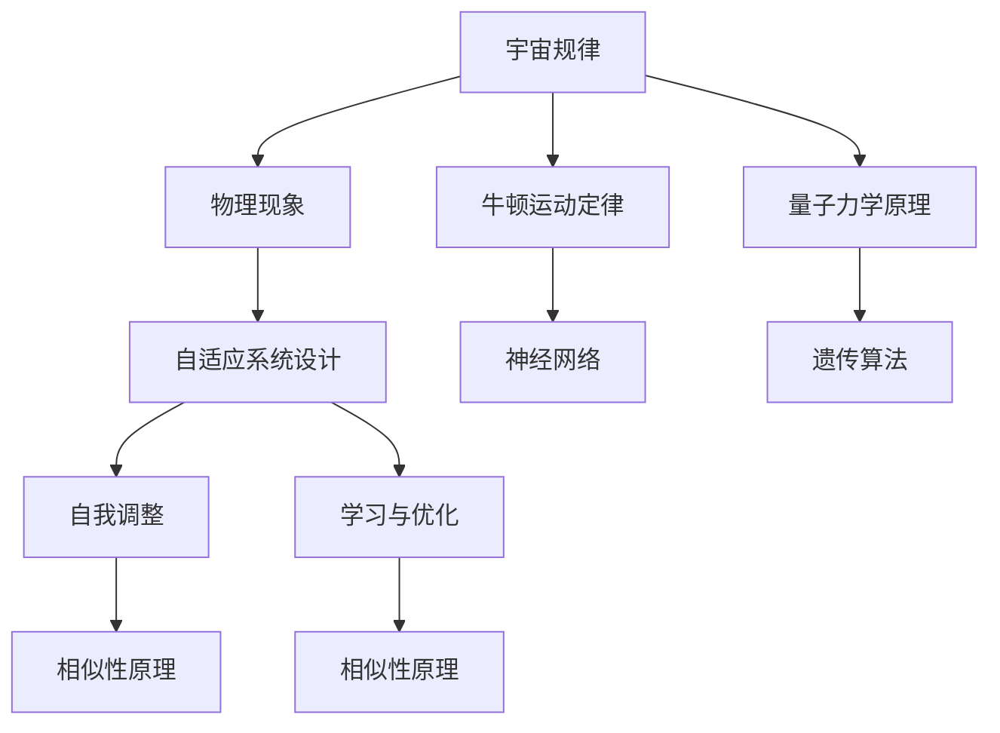

                 

### 文章标题：宇宙规律与自适应系统设计的相似性

> 关键词：宇宙规律、自适应系统设计、相似性原理、人工智能、深度学习

> 摘要：
本文将探讨宇宙规律与自适应系统设计之间的相似性，通过深入分析宇宙中的物理现象和自适应系统设计中的关键技术，揭示两者之间的联系。文章将首先介绍宇宙规律的基本概念和研究方法，然后阐述自适应系统设计的基本概念和技术，接着探讨相似性原理及其在两者中的应用。最后，通过实际案例研究和项目实战，阐述宇宙规律与自适应系统设计相似性的具体体现，并总结与展望未来的研究方向。

### 步骤1：确定核心概念与联系

首先，我们需要明确文章中的核心概念，并分析它们之间的联系。本文的核心概念包括宇宙规律、自适应系统设计、相似性原理等。宇宙规律是描述宇宙中物质运动和相互作用的基本法则，如牛顿运动定律、量子力学原理等。自适应系统设计则是为了应对复杂环境变化而设计的一类系统，具有自我调整、学习和优化的能力，如神经网络、遗传算法等。相似性原理是指不同领域之间存在的相似性和相互借鉴的可能性。

为了展示这些核心概念之间的联系，我们可以使用Mermaid流程图进行描述。以下是一个简化的Mermaid流程图：



### 步骤2：设计章节目录

根据核心概念与联系的分析，我们可以将文章分为以下几个部分：

**第1部分：宇宙规律概述**
- 第1章：宇宙规律的基本概念
- 第2章：宇宙规律的研究方法

**第2部分：自适应系统设计概述**
- 第1章：自适应系统设计的基本概念
- 第2章：自适应系统设计的关键技术

**第3部分：相似性原理探讨**
- 第1章：相似性原理的基本理论
- 第2章：相似性原理的应用

**第4部分：宇宙规律与自适应系统设计的相似性案例研究**
- 第1章：相似性原理在宇宙研究中的应用
- 第2章：相似性原理在自适应系统设计中的应用

**第5部分：项目实战**
- 第1章：宇宙规律与自适应系统设计结合的项目案例
- 第2章：项目实战的步骤与方法

**第6部分：总结与展望**
- 第1章：本书内容的总结
- 第2章：未来研究方向

### 步骤3：细化章节内容

在细化每个章节的内容时，我们需要确保包含核心算法原理讲解、数学模型和数学公式、项目实战等内容。以下是每个章节的详细内容：

**第1章：宇宙规律的基本概念**

1.1 宇宙规律的定义  
宇宙规律是指宇宙中物质运动和相互作用的基本法则，它们决定了宇宙中各种物理现象的发生和演化。

1.2 宇宙规律的核心原则  
宇宙规律的核心原则包括能量守恒、动量守恒、量子力学原理等。

1.3 宇宙规律的分类  
宇宙规律可以分为经典物理规律和现代物理规律，如牛顿运动定律、麦克斯韦方程组、相对论等。

1.4 宇宙规律与自适应系统设计的联系  
宇宙规律为自适应系统设计提供了理论基础和灵感来源，如基于量子力学原理的神经网络设计、基于相对论的自适应控制系统等。

**第2章：宇宙规律的研究方法**

2.1 宇宙规律的研究历史  
宇宙规律的研究经历了漫长的发展过程，从古代的哲学思考到现代的物理学实验。

2.2 宇宙规律的研究方法  
宇宙规律的研究方法包括理论分析、实验验证、数值模拟等。

2.3 宇宙规律的实验验证  
宇宙规律的实验验证是物理学研究的重要环节，如通过实验验证牛顿运动定律、量子力学原理等。

**第3章：自适应系统设计的基本概念**

3.1 自适应系统设计的定义  
自适应系统设计是指一类能够自我调整、学习和优化的系统，它们能够适应环境变化并提高性能。

3.2 自适应系统设计的目标  
自适应系统设计的目标包括提高系统稳定性、提高系统效率、降低系统成本等。

3.3 自适应系统设计的关键技术  
自适应系统设计的关键技术包括自适应控制理论、神经网络、遗传算法等。

3.4 自适应系统设计与宇宙规律的相似性  
自适应系统设计与宇宙规律存在相似之处，如自适应系统的动态调整与宇宙中的物理现象。

**第4章：自适应系统设计的关键技术**

4.1 自适应控制理论  
自适应控制理论是自适应系统设计的基础，它研究如何通过调整系统参数来适应环境变化。

4.2 自适应算法  
自适应算法包括基于神经网络的算法、基于遗传算法的算法等，它们能够实现系统的自我调整和学习。

4.3 自适应系统设计的实现  
自适应系统设计的实现涉及硬件和软件的选择、算法的实现、系统的集成与调试等。

**第5章：相似性原理探讨**

5.1 相似性原理的基本理论  
相似性原理是指不同领域之间存在的相似性和相互借鉴的可能性。

5.2 相似性原理的应用  
相似性原理在宇宙研究和自适应系统设计中的应用，如基于宇宙规律的神经网络设计、基于相似性原理的自适应控制系统等。

**第6章：宇宙规律与自适应系统设计的相似性案例研究**

6.1 相似性原理在宇宙研究中的应用  
通过具体案例展示相似性原理在宇宙研究中的应用，如基于量子力学原理的神经网络设计。

6.2 相似性原理在自适应系统设计中的应用  
通过具体案例展示相似性原理在自适应系统设计中的应用，如基于宇宙规律的自适应控制系统设计。

**第7章：项目实战**

7.1 宇宙规律与自适应系统设计结合的项目案例  
介绍一个结合宇宙规律与自适应系统设计的实际项目案例，包括项目背景、目标、实施步骤和成果分析。

7.2 项目实战的步骤与方法  
详细介绍项目实战的步骤和方法，包括开发环境搭建、源代码实现、代码解读、应用解读与分析等。

**第8章：总结与展望**

8.1 本书内容的总结  
对本书的内容进行总结，强调宇宙规律与自适应系统设计之间的相似性及其重要意义。

8.2 未来研究方向  
展望宇宙规律与自适应系统设计领域未来的研究方向，如量子自适应系统设计、宇宙规律在人工智能中的应用等。

### 步骤4：编写目录大纲

根据以上内容，我们可以编写如下的目录大纲：

```
# 《宇宙规律与自适应系统设计的相似性》目录大纲

## 第1部分：宇宙规律概述
### 第1章：宇宙规律的基本概念
#### 1.1 宇宙规律的定义
#### 1.2 宇宙规律的核心原则
#### 1.3 宇宙规律的分类
#### 1.4 宇宙规律与自适应系统设计的联系

### 第2章：宇宙规律的研究方法
#### 2.1 宇宙规律的研究历史
#### 2.2 宇宙规律的研究方法
#### 2.3 宇宙规律的实验验证

## 第2部分：自适应系统设计概述
### 第1章：自适应系统设计的基本概念
#### 1.1 自适应系统设计的定义
#### 1.2 自适应系统设计的目标
#### 1.3 自适应系统设计的关键技术
#### 1.4 自适应系统设计与宇宙规律的相似性

### 第2章：自适应系统设计的关键技术
#### 2.1 自适应控制理论
#### 2.2 自适应算法
#### 2.3 自适应系统设计的实现

## 第3部分：相似性原理探讨
### 第1章：相似性原理的基本理论
#### 1.1 相似性原理的定义
#### 1.2 相似性原理的数学模型
#### 1.3 相似性原理的应用

### 第2章：相似性原理的应用
#### 2.1 相似性原理在宇宙研究中的应用
#### 2.2 相似性原理在自适应系统设计中的应用

## 第4部分：宇宙规律与自适应系统设计的相似性案例研究
### 第1章：相似性原理在宇宙研究中的应用
#### 1.1 宇宙中的自适应现象
#### 1.2 相似性原理在宇宙研究中的实际应用

### 第2章：相似性原理在自适应系统设计中的应用
#### 1.1 自适应系统设计中的宇宙规律借鉴
#### 1.2 相似性原理在自适应系统设计中的实际应用

## 第5部分：项目实战
### 第1章：宇宙规律与自适应系统设计结合的项目案例
#### 1.1 项目背景
#### 1.2 项目目标
#### 1.3 项目实施步骤
#### 1.4 项目成果分析

### 第2章：项目实战的步骤与方法
#### 2.1 项目实战的基本步骤
#### 2.2 项目实战的方法论
#### 2.3 项目实战的工具与资源

## 第6部分：总结与展望
### 第1章：本书内容的总结
#### 1.1 宇宙规律与自适应系统设计的关键点
#### 1.2 相似性原理的应用与影响

### 第2章：未来研究方向
#### 2.1 量子自适应系统设计
#### 2.2 宇宙规律在人工智能中的应用
```

通过以上步骤，我们完成了文章的标题、关键词、摘要和目录大纲的编写，为后续内容的撰写奠定了基础。在接下来的步骤中，我们将详细撰写每个章节的内容，确保文章的完整性和专业性。

