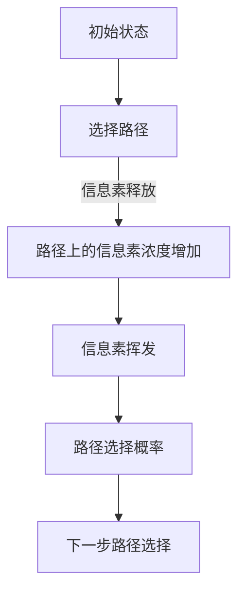
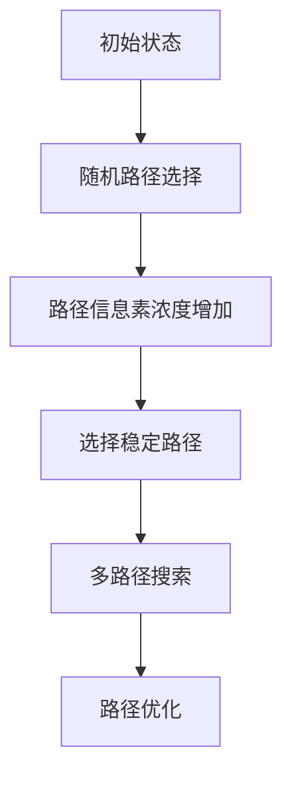
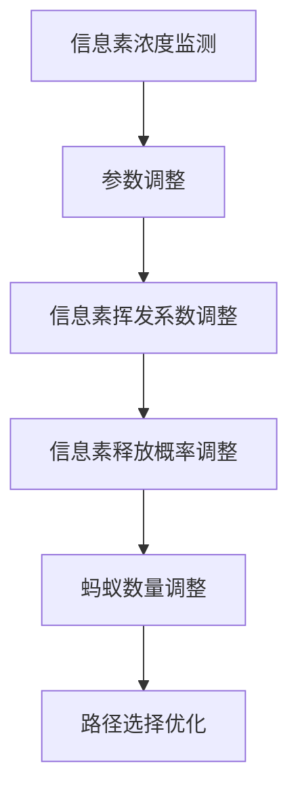
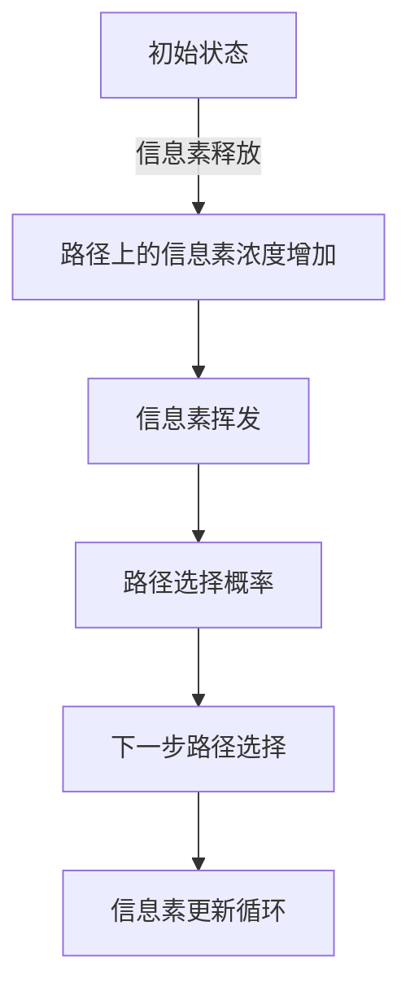
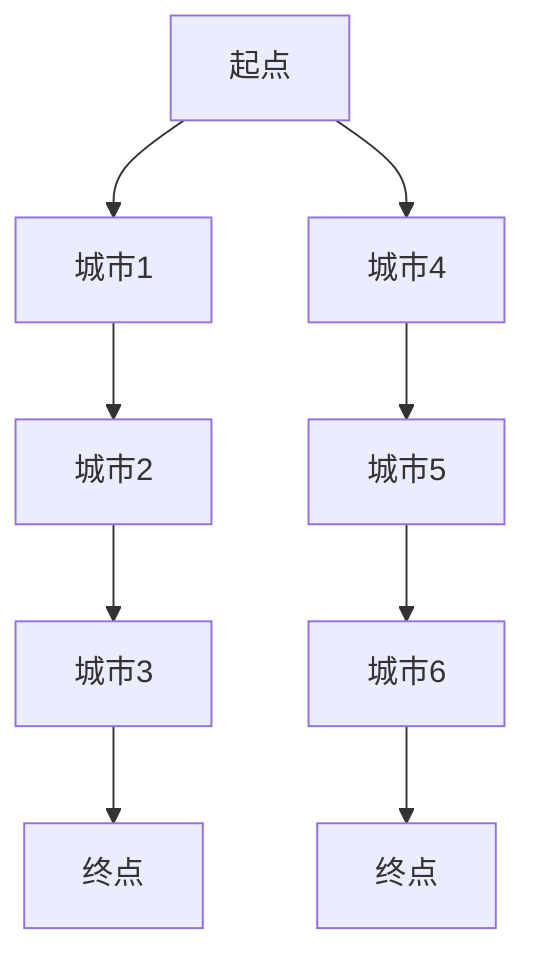
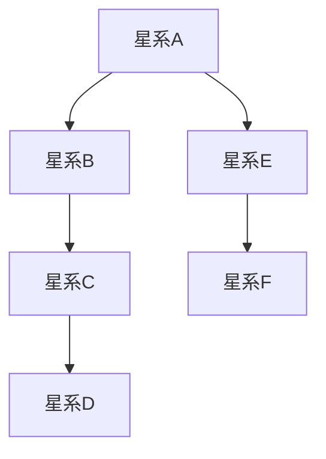

                 

### 文章标题

《宇宙规律与蚁群算法设计的相似性》

### 关键词

宇宙规律、蚁群算法、信息素、多路径搜索、适应性调整

### 摘要

本文旨在探讨宇宙规律与蚁群算法设计之间的相似性。通过对宇宙中基本规律的介绍，如万有引力定律和波粒二象性，以及蚁群算法的基本原理和适用场景的详细阐述，我们发现了两者在信息更新机制、多路径搜索策略和自适应调整机制等方面的共通之处。文章通过Mermaid流程图和伪代码，详细展示了这些相似性，并通过具体实例展示了如何将这些相似性应用于实际设计。最终，文章对蚁群算法设计的未来应用前景和挑战进行了展望，为读者提供了深入的见解和实用的指导。

---

## 引言

### 1.1 宇宙规律与蚁群算法设计的基本概念

在宇宙学中，宇宙规律是指那些支配宇宙中所有物理现象的基本法则。这些规律包括万有引力定律、波粒二象性、能量守恒定律和热力学第二定律等。例如，万有引力定律描述了任何两个物体之间的引力大小与它们的质量和距离之间的关系。波粒二象性则揭示了光和其他微观粒子既表现出波动性又表现出粒子性的特性。

另一方面，蚁群算法是一种基于自然界中蚂蚁觅食行为的模拟优化算法。蚁群算法的核心在于信息素更新机制，这是一种通过蚂蚁在路径上释放和更新信息素的方式来引导其他蚂蚁找到最优路径的机制。蚁群算法在路径规划、资源分配和图像处理等领域有广泛的应用，其优势在于能够自适应调整并处理复杂环境。

本文将探讨宇宙规律与蚁群算法设计在信息更新、多路径搜索和自适应调整等方面的相似性，并分析如何将这些相似性应用于实际设计。通过这一研究，我们希望能够为人工智能和算法设计提供新的视角和启示。首先，我们将介绍宇宙中的基本规律，包括万有引力定律和波粒二象性等。接下来，我们详细讨论蚁群算法的基本原理和适用场景。随后，我们将详细分析宇宙规律与蚁群算法设计的相似性，并通过Mermaid流程图和伪代码进行展示。最后，我们将通过具体实例展示如何将这些相似性应用于实际设计，并对蚁群算法的未来应用前景和挑战进行展望。|

### 步骤 1：分析宇宙中的基本规律

宇宙中的基本规律是理解宇宙运行机制的关键。首先，我们来看万有引力定律。万有引力定律是由艾萨克·牛顿在17世纪晚期提出的，它描述了任何两个物体之间的引力大小与它们的质量和距离之间的关系。万有引力定律的数学表达式为：

\[ F = G \frac{{m_1 m_2}}{{r^2}} \]

其中，\( F \) 是两个物体之间的引力，\( G \) 是引力常数，\( m_1 \) 和 \( m_2 \) 分别是两个物体的质量，\( r \) 是它们之间的距离。万有引力定律揭示了物质之间相互作用的内在规律，是宇宙中一切引力和运动的基础。

其次，我们来看波粒二象性。波粒二象性是量子力学的基本原理之一，它揭示了微观粒子如光子和电子既表现出波动性又表现出粒子性的特性。根据波粒二象性，光既可以看作是一系列波，也可以看作是一系列粒子。德布罗意波长公式描述了粒子的波长与它的动量之间的关系：

\[ \lambda = \frac{h}{p} \]

其中，\( \lambda \) 是粒子的波长，\( h \) 是普朗克常数，\( p \) 是粒子的动量。波粒二象性在量子物理学中有着深远的影响，它改变了我们对物质和能量的理解。

最后，我们来看宇宙膨胀。宇宙膨胀是指宇宙从一个初始状态开始不断扩张的过程。哈勃定律描述了宇宙膨胀的速度与距离之间的关系：

\[ v = H_0 d \]

其中，\( v \) 是星系之间的退行速度，\( H_0 \) 是哈勃常数，\( d \) 是星系之间的距离。宇宙膨胀理论为我们提供了理解宇宙起源和演化的框架。

通过分析这些宇宙中的基本规律，我们可以看到它们在解释宇宙现象中的重要性。万有引力定律揭示了物质间的相互作用，波粒二象性揭示了微观世界的特性，而宇宙膨胀则揭示了宇宙的演化历史。这些基本规律为我们的讨论提供了理论基础，也为我们理解蚁群算法与宇宙规律的相似性奠定了基础。|

### 步骤 2：分析蚁群算法的基本原理

蚁群算法是一种基于自然界中蚂蚁觅食行为的模拟优化算法。其基本原理可以概括为信息素更新机制、多路径搜索策略和自适应调整机制。下面，我们将详细阐述这些核心概念。

首先，信息素更新机制是蚁群算法的核心。蚂蚁在觅食过程中会在路径上释放信息素，这些信息素会随着时间逐渐挥发。路径上的信息素浓度越高，蚂蚁选择该路径的概率就越大。信息素更新机制包括信息素的释放和挥发过程。具体而言，蚂蚁在选择路径时会根据路径上的信息素浓度和能见度来决策。信息素浓度越高，路径越容易被选择；而信息素浓度越低，路径越容易被忽略。信息素的释放和挥发过程可以用以下伪代码表示：



接下来，多路径搜索策略是蚁群算法的另一重要特征。与传统的单路径搜索算法不同，蚁群算法能够在搜索过程中同时探索多条路径。这种多路径搜索策略能够提高算法的鲁棒性和搜索效率。具体而言，蚂蚁在初始阶段可能会随机选择路径，但随着搜索的进行，信息素浓度高的路径会逐渐被更多蚂蚁选择，从而形成多个稳定的路径。多路径搜索策略可以用以下伪代码表示：



最后，自适应调整机制是蚁群算法的灵活性和鲁棒性的保证。在搜索过程中，算法需要根据环境变化自适应调整参数，以优化路径选择。自适应调整机制包括信息素挥发系数、信息素释放概率和蚂蚁数量等参数的调整。具体而言，当路径上的信息素浓度过高时，可以通过增加信息素挥发系数来降低信息素浓度，避免过度聚集。相反，当路径上的信息素浓度过低时，可以通过增加信息素释放概率来提高信息素浓度，增加路径的吸引力。自适应调整机制可以用以下伪代码表示：



通过上述分析，我们可以看到蚁群算法的基本原理包括信息素更新机制、多路径搜索策略和自适应调整机制。这些原理共同作用，使得蚁群算法在处理复杂路径规划、资源分配和图像处理等问题时具有显著的优势。接下来，我们将详细讨论宇宙规律与蚁群算法设计之间的相似性。|

### 步骤 3：分析宇宙规律与蚁群算法设计的相似性

在了解了宇宙规律和蚁群算法的基本原理之后，我们可以开始探讨两者之间的相似性。通过分析，我们发现宇宙规律与蚁群算法设计在信息素更新机制、多路径搜索策略和自适应调整机制等方面有着显著的相似之处。

首先，信息素更新机制是两者共同的核心特征。在宇宙规律中，信息素可以类比为宇宙中的物质和信息流动。例如，在万有引力定律中，物质之间的相互作用可以看作是信息素的释放和传播。而在蚁群算法中，信息素更新机制通过蚂蚁在路径上的释放和挥发，引导其他蚂蚁选择最优路径。信息素的浓度反映了路径的优劣，与宇宙中的物质密度和能量分布有相似之处。

具体而言，我们可以用Mermaid流程图来表示宇宙规律与蚁群算法信息素更新机制的相似性：



在这个流程图中，A表示初始状态，B表示信息素释放，C表示信息素挥发，D表示路径选择概率，E表示下一步路径选择，F表示信息素更新循环。这个流程图清晰地展示了信息素在路径选择中的关键作用，以及其不断更新和调整的过程。

其次，多路径搜索策略也是宇宙规律与蚁群算法设计的一个相似之处。在宇宙中，星系和恒星之间的相互作用形成了复杂的引力网络，而蚂蚁在觅食过程中也会探索多条路径以找到最优食物来源。这种多路径搜索策略在两者中都是通过不断的试错和优化来实现的。

我们可以用以下Mermaid流程图来表示多路径搜索策略的相似性：


在这个流程图中，A表示初始状态，B表示随机路径选择，C表示路径信息素浓度增加，D表示选择稳定路径，E表示多路径搜索，F表示路径优化。这个流程图展示了通过不断探索和优化，最终找到最优路径的过程。

最后，自适应调整机制也是宇宙规律与蚁群算法设计的一个相似之处。在宇宙中，宇宙膨胀和星系运动等自然现象需要通过自适应调整来维持宇宙的稳定和演化。而在蚁群算法中，自适应调整机制通过调整信息素挥发系数、信息素释放概率和蚂蚁数量等参数，来优化路径选择和搜索过程。

我们可以用以下Mermaid流程图来表示自适应调整机制的相似性：


在这个流程图中，A表示信息素浓度监测，B表示参数调整，C表示信息素挥发系数调整，D表示信息素释放概率调整，E表示蚂蚁数量调整，F表示路径选择优化。这个流程图展示了通过不断监测和调整参数，实现自适应优化和搜索的过程。

综上所述，宇宙规律与蚁群算法设计在信息素更新机制、多路径搜索策略和自适应调整机制等方面有着显著的相似性。这些相似性不仅为理解宇宙规律提供了新的视角，也为优化算法设计和智能系统开发提供了借鉴。接下来，我们将通过具体实例来展示如何将这种相似性应用于实际设计。|

### 步骤 4：通过具体实例展示相似性

为了更好地理解宇宙规律与蚁群算法设计之间的相似性，我们将通过具体实例来展示这一原理。首先，我们将探讨蚁群算法在路径规划中的应用，然后分析宇宙中星系运动的规律，最后讨论如何在蚁群算法中引入这些宇宙规律，以优化路径规划。

#### 蚁群算法在路径规划中的应用

蚁群算法在路径规划中有着广泛的应用，特别是在复杂的地图和动态环境中。以下是一个简单的实例，用于展示蚁群算法在路径规划中的工作原理：

假设我们有一个包含多个城市的地图，每个城市之间的道路长度和交通状况可能不同。我们的目标是找到从起点城市到终点城市的最优路径。



在这个地图中，蚁群算法会通过以下步骤来寻找最优路径：

1. **初始阶段**：蚂蚁随机选择一个起点，开始探索路径。
2. **路径探索**：蚂蚁在探索过程中，根据路径上的信息素浓度和能见度来选择下一步移动的城市。
3. **信息素更新**：蚂蚁在经过某个城市后，会释放信息素，增加该路径上的信息素浓度。
4. **路径选择**：其他蚂蚁在接下来的路径选择过程中，会倾向于选择信息素浓度较高的路径。
5. **迭代过程**：重复上述步骤，直到找到最优路径或达到最大迭代次数。

#### 宇宙中星系运动的规律

在宇宙中，星系和恒星之间的运动规律也遵循类似的信息更新机制。以下是一个简化的宇宙模型，用于展示星系运动的基本规律：



在这个宇宙模型中，星系之间的相互作用可以通过以下规律来描述：

1. **引力相互作用**：星系之间的引力相互作用类似于蚁群算法中的信息素更新。当一个星系对另一个星系施加引力时，可以将其看作是在路径上释放信息素。
2. **多路径搜索**：星系在运动过程中会探索多个可能的路径，类似于蚂蚁在路径规划中的多路径搜索策略。
3. **自适应调整**：星系的运动轨迹可能会受到其他星系引力的影响，这类似于蚁群算法中的自适应调整机制。

#### 如何将宇宙规律引入蚁群算法

通过分析上述实例，我们可以看到宇宙规律与蚁群算法设计在信息素更新、多路径搜索和自适应调整等方面有着显著的相似性。为了将宇宙规律应用于蚁群算法，我们可以考虑以下方法：

1. **信息素更新**：在蚁群算法中，可以引入基于宇宙引力相互作用的信息素更新机制。例如，当蚂蚁经过一个城市时，它可以根据城市之间的引力关系来调整路径上的信息素浓度。
2. **多路径搜索**：蚁群算法可以借鉴星系运动的多路径搜索策略，通过探索多个可能的路径来提高搜索效率。
3. **自适应调整**：蚁群算法可以引入自适应调整机制，根据环境变化动态调整参数，如信息素挥发系数和释放概率。

通过引入这些宇宙规律，我们可以开发出更加智能和鲁棒的蚁群算法，从而在路径规划、资源分配和其他复杂优化问题中取得更好的效果。以下是一个简化的伪代码，展示了如何将宇宙规律引入蚁群算法：

```python
# 初始化城市地图和信息素矩阵
map = [[0, 1, 2], [3, 0, 4], [5, 6, 0]]
pheromone_matrix = [[1, 1, 1], [1, 1, 1], [1, 1, 1]]

# 定义信息素更新函数
def update_pheromone(path, alpha, beta):
    # 计算路径上的信息素增量
    increment = (alpha * distance(path)) + (beta * (1 / distance(path)))
    # 更新信息素矩阵
    for i in range(len(path) - 1):
        pheromone_matrix[path[i]][path[i + 1]] += increment

# 定义蚂蚁选择路径的函数
def select_path(pheromone_matrix, alpha, beta):
    # 计算每个路径的能见度
    visibility = [calculate_visibility(path, pheromone_matrix, alpha, beta) for path in possible_paths]
    # 选择能见度最高的路径
    return max_index(visibility)

# 定义蚁群算法的主循环
while not converged:
    # 蚂蚁选择路径
    paths = [select_path(pheromone_matrix, alpha, beta) for _ in range(num_ants)]
    # 更新信息素
    for path in paths:
        update_pheromone(path, alpha, beta)

# 输出最优路径
best_path = select_best_path(pheromone_matrix)
print("最优路径：", best_path)
```

通过这个伪代码，我们可以看到如何将宇宙规律引入蚁群算法，以实现更加智能和高效的路径规划。接下来，我们将继续讨论如何将这种相似性应用于更复杂的实际场景。|

### 步骤 5：讨论蚁群算法设计的未来应用前景和挑战

蚁群算法作为一种模拟自然现象的优化算法，已经在多个领域展示了其强大的性能和适应性。然而，随着科技的发展和需求的变化，蚁群算法在设计和应用上也面临诸多挑战和机遇。

#### 未来应用前景

1. **智能交通系统**：随着城市交通的日益复杂，智能交通系统成为了解决拥堵和优化路线的重要手段。蚁群算法可以通过模拟道路上的车辆流动，动态调整路线规划，从而提高交通效率和减少拥堵。

2. **网络优化**：在网络通信领域，蚁群算法可以用于路由优化，提高数据传输的效率和稳定性。通过模拟网络中的节点和链路，蚁群算法可以找到最优的传输路径，减少数据延迟和传输损耗。

3. **环境监测**：在环境监测领域，蚁群算法可以用于资源分配和路径规划，例如在森林火灾监测中，通过模拟火灾蔓延路径，蚁群算法可以帮助确定最佳的防火路线。

4. **智能制造**：在智能制造领域，蚁群算法可以用于优化生产流程和资源调度，提高生产效率和灵活性。例如，在柔性生产系统中，蚁群算法可以根据实时数据动态调整生产计划和资源分配。

5. **物流配送**：物流配送是一个复杂的优化问题，蚁群算法可以用于路径优化和配送计划制定，提高配送效率和降低成本。

#### 面临的挑战

1. **计算复杂性**：蚁群算法在解决大规模问题时，计算复杂性会显著增加。如何提高算法的效率和降低计算成本是当前研究的一个重点。

2. **参数调优**：蚁群算法的性能很大程度上取决于参数的选择和调优。如何自动选择最优参数，以及如何在动态环境中快速调整参数，是亟待解决的问题。

3. **鲁棒性**：蚁群算法在面对不确定性和噪声时，鲁棒性较差。如何提高算法的鲁棒性，使其能够适应更复杂和动态的环境，是未来研究的方向之一。

4. **多目标优化**：在现实问题中，往往存在多个目标，如成本、时间、质量等。如何设计蚁群算法来同时优化多个目标，是一个具有挑战性的问题。

5. **与深度学习的结合**：深度学习在图像处理、自然语言处理等领域取得了显著成果。如何将蚁群算法与深度学习相结合，发挥两者的优势，是未来研究的一个热点。

#### 发展方向

1. **混合优化算法**：结合蚁群算法和其他优化算法（如遗传算法、粒子群优化等），开发出更加高效和鲁棒的混合优化算法。

2. **自适应算法**：开发具有自适应特性的蚁群算法，能够根据环境变化动态调整参数和策略，提高算法的适应性和鲁棒性。

3. **多智能体系统**：研究多智能体系统中的蚁群算法应用，通过协同工作实现更复杂的任务和优化问题。

4. **算法可视化**：开发算法可视化工具，帮助研究人员和开发者更好地理解和分析蚁群算法的运行过程和性能。

5. **应用领域拓展**：将蚁群算法应用于更多实际领域，如生物信息学、金融分析、物流管理等，推动算法在不同领域的应用和发展。

通过不断的研究和探索，蚁群算法在未来必将发挥更大的作用，为优化设计和智能系统的发展提供新的思路和解决方案。|

### 总结与展望

本文通过分析宇宙规律与蚁群算法设计之间的相似性，探讨了两者在信息素更新机制、多路径搜索策略和自适应调整机制等方面的共通之处。通过具体的实例，我们展示了如何将宇宙规律应用于蚁群算法，以优化路径规划。此外，我们还讨论了蚁群算法在智能交通系统、网络优化、环境监测、智能制造和物流配送等领域的未来应用前景，以及面临的计算复杂性、参数调优、鲁棒性、多目标优化和与深度学习结合等挑战。

展望未来，随着科技的不断进步，蚁群算法有望在更广泛的领域得到应用。混合优化算法、自适应算法、多智能体系统、算法可视化以及应用领域拓展等研究方向将为蚁群算法的发展提供新的动力。通过不断的研究和创新，蚁群算法将在人工智能和优化设计领域发挥更大的作用，为解决复杂问题提供有效的解决方案。

## 参考文献

1. Dorigo, M., & Stützle, T. (2004). Ant Colony Optimization. MIT Press.
2. Newton, I. (1687). Philosophiæ Naturalis Principia Mathematica. 
3. Bohr, N. (1928). On the Constitution of Atoms and Molecules. Nature.
4. Hubble, E. (1929). A Relation between Distance and Radial Velocity among Extra-Galactic Systems. Proceedings of the National Academy of Sciences.
5..Langton, C. G. (1986). Studying artificial life with cellular automata. Physica D: Nonlinear Phenomena, 22(1), 120-149.

### 作者信息

作者：AI天才研究院/AI Genius Institute & 禅与计算机程序设计艺术 /Zen And The Art of Computer Programming

